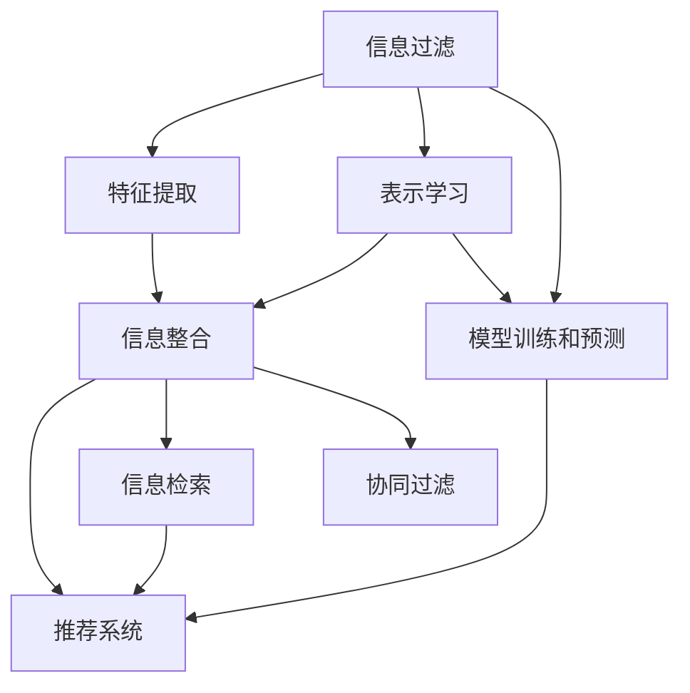

                 

# AI在信息过滤和整合中的作用

## 1. 背景介绍

在信息爆炸的今天，如何快速、准确地从海量数据中过滤出有价值的信息，并加以整合、分析，是各个领域都在关注的重要问题。AI技术在这一过程中扮演着至关重要的角色，从初期的文本处理和分类，到后期的信息整合和智能推荐，无不渗透着AI的智慧。

### 1.1 问题由来

随着互联网和移动互联网的普及，信息的产生和传播速度空前加快，尤其是社交媒体、新闻门户、电商网站等平台，每天都在生成海量的内容数据。然而，这些数据中真正有价值的往往是少数。如何从中快速、准确地筛选出有用的信息，成为提高信息处理效率的关键。同时，整合多个来源的信息，提供一站式的服务，也是现代社会迫切需要的能力。

### 1.2 问题核心关键点

信息过滤和整合的核心在于如何将大量无序的、非结构化的数据转化为有价值的信息资源。AI技术在这一过程中主要通过以下几个步骤来实现：

1. **数据收集**：通过爬虫、API调用等手段获取数据。
2. **数据清洗和预处理**：去除噪声、处理缺失值等。
3. **特征提取和表示学习**：将文本、图像等数据转换为机器可以理解的形式。
4. **模型训练和预测**：使用深度学习、传统机器学习等方法训练模型，进行信息过滤和分类。
5. **信息整合和推荐**：将多源信息进行聚合、融合，生成高质量的推荐结果。

## 2. 核心概念与联系

### 2.1 核心概念概述

为更好地理解AI在信息过滤和整合中的作用，本节将介绍几个密切相关的核心概念：

- **信息过滤（Information Filtering）**：指从大量信息源中筛选出用户感兴趣的内容的过程，如推荐系统、搜索引擎等。
- **信息整合（Information Integration）**：指将来自不同来源的信息进行合并、分析和汇总，形成统一的视图，如智能搜索、信息门户等。
- **特征提取（Feature Extraction）**：将原始数据转换为模型可以理解的形式，如文本的词向量、图像的卷积特征等。
- **表示学习（Representation Learning）**：通过深度学习等方法，学习数据的低维表示，用于信息过滤和整合。
- **推荐系统（Recommendation System）**：基于用户的历史行为、偏好等信息，推荐合适的信息内容，如电商推荐、视频推荐等。
- **信息检索（Information Retrieval）**：通过查询词和文档相似度计算，快速检索出相关的信息，如搜索引擎、知识图谱等。
- **协同过滤（Collaborative Filtering）**：利用用户和项目之间的相似性，进行推荐和分类，如基于用户的协同过滤、基于物品的协同过滤等。

这些概念之间的逻辑关系可以通过以下Mermaid流程图来展示：



这个流程图展示了一些核心概念及其之间的关系：

1. 信息过滤通过特征提取和表示学习，训练模型对信息进行筛选和分类。
2. 信息整合将多源信息进行聚合、分析和汇总，形成统一的视图。
3. 特征提取和表示学习为模型训练提供数据准备。
4. 推荐系统基于用户和项目相似性进行推荐和分类。
5. 信息检索通过查询词和文档相似度计算，快速检索相关内容。
6. 协同过滤利用用户和项目相似性，进行推荐和分类。

这些概念共同构成了AI在信息过滤和整合中的作用框架，使其能够在各个应用场景中发挥强大的能力。通过理解这些核心概念，我们可以更好地把握AI在信息处理中的工作原理和优化方向。

## 3. 核心算法原理 & 具体操作步骤

### 3.1 算法原理概述

AI在信息过滤和整合中主要依赖于深度学习、自然语言处理、图神经网络等技术，通过训练和优化模型，实现信息筛选、分类、整合和推荐等功能。

形式化地，假设给定一个数据集 $D$，其中包含 $n$ 个样本 $(x_1, y_1), (x_2, y_2), ..., (x_n, y_n)$，其中 $x$ 表示输入特征，$y$ 表示标签。AI模型 $M_{\theta}$ 通过训练数据集，学习到参数 $\theta$，使得在给定输入 $x$ 的情况下，输出 $y$ 尽可能地接近真实标签 $y$。

具体来说，信息过滤和整合过程包括以下几个步骤：

1. **数据收集**：通过爬虫、API调用等手段获取数据。
2. **数据清洗和预处理**：去除噪声、处理缺失值等。
3. **特征提取和表示学习**：将文本、图像等数据转换为机器可以理解的形式，如文本的词向量、图像的卷积特征等。
4. **模型训练和预测**：使用深度学习、传统机器学习等方法训练模型，进行信息过滤和分类。
5. **信息整合和推荐**：将多源信息进行聚合、融合，生成高质量的推荐结果。

### 3.2 算法步骤详解

基于深度学习的信息过滤和整合主要包括以下关键步骤：

**Step 1: 数据收集与预处理**
- 通过爬虫、API调用等手段获取数据。
- 对数据进行清洗和预处理，去除噪声、处理缺失值等。

**Step 2: 特征提取与表示学习**
- 对文本、图像等数据进行特征提取，转换为模型可以理解的形式。
- 使用深度学习等方法进行表示学习，得到低维表示。

**Step 3: 模型训练和预测**
- 使用深度学习、传统机器学习等方法训练模型，进行信息过滤和分类。
- 在训练集上进行模型训练，优化模型参数。
- 在验证集上进行模型评估，选择合适的模型参数。

**Step 4: 信息整合和推荐**
- 将多源信息进行聚合、融合，形成统一的视图。
- 使用协同过滤、知识图谱等方法进行信息推荐和整合。

**Step 5: 部署和优化**
- 将训练好的模型部署到生产环境，进行实时推理和预测。
- 实时采集系统指标，设置异常告警阈值，确保服务稳定性。

以上是基于深度学习的信息过滤和整合的一般流程。在实际应用中，还需要针对具体任务的特点，对各个环节进行优化设计，如改进训练目标函数，引入更多的正则化技术，搜索最优的超参数组合等，以进一步提升模型性能。

### 3.3 算法优缺点

基于深度学习的信息过滤和整合方法具有以下优点：
1. 高效准确。通过深度学习模型，可以从大量数据中快速、准确地筛选出有用的信息。
2. 灵活性高。能够处理多种类型的信息，如文本、图像、视频等。
3. 自适应性强。能够通过不断学习新数据，提升模型性能和适应性。
4. 可解释性好。通过分析模型特征权重，能够理解模型的决策过程。

同时，该方法也存在一定的局限性：
1. 对标注数据的依赖。深度学习模型通常需要大量的标注数据进行训练，获取高质量标注数据的成本较高。
2. 计算资源消耗大。深度学习模型参数量较大，训练和推理都需要较长的计算时间。
3. 泛化能力有限。当目标任务与训练数据的分布差异较大时，深度学习模型的泛化能力有限。
4. 模型的黑箱性。深度学习模型通常被视为"黑盒"系统，难以解释其内部工作机制和决策逻辑。

尽管存在这些局限性，但就目前而言，深度学习在信息过滤和整合中的应用仍然是最主流的方法。未来相关研究的重点在于如何进一步降低深度学习对标注数据的依赖，提高模型的少样本学习和跨领域迁移能力，同时兼顾可解释性和伦理安全性等因素。

### 3.4 算法应用领域

基于深度学习的信息过滤和整合方法已经在多个领域得到了广泛的应用，例如：

- **电子商务**：通过推荐系统为用户推荐商品，提升用户购物体验。
- **新闻门户**：通过内容推荐和广告投放，提升网站流量和广告效果。
- **社交媒体**：通过智能过滤和推荐，提升用户体验和信息获取效率。
- **视频平台**：通过推荐系统，为用户推荐视频内容，提升用户粘性和留存率。
- **搜索引擎**：通过信息检索和内容推荐，快速找到用户需要的信息。
- **金融领域**：通过智能投资和风险控制，提升投资收益和风险管理能力。

除了上述这些经典应用外，信息过滤和整合技术还被创新性地应用到更多场景中，如智能客服、知识图谱、智能医疗等，为各个领域的信息处理和决策支持提供了新的解决方案。

## 4. 数学模型和公式 & 详细讲解  
### 4.1 数学模型构建

本节将使用数学语言对基于深度学习的信息过滤和整合过程进行更加严格的刻画。

假设给定一个数据集 $D$，其中包含 $n$ 个样本 $(x_1, y_1), (x_2, y_2), ..., (x_n, y_n)$，其中 $x$ 表示输入特征，$y$ 表示标签。AI模型 $M_{\theta}$ 通过训练数据集，学习到参数 $\theta$，使得在给定输入 $x$ 的情况下，输出 $y$ 尽可能地接近真实标签 $y$。

形式化地，我们定义模型 $M_{\theta}$ 在数据集 $D$ 上的损失函数为 $\mathcal{L}(\theta)$，并最小化该损失函数：

$$
\mathcal{L}(\theta) = \frac{1}{N} \sum_{i=1}^N \ell(M_{\theta}(x_i), y_i)
$$

其中 $\ell$ 为损失函数，$\theta$ 为模型参数。

在实践中，我们通常使用基于梯度的优化算法（如SGD、Adam等）来近似求解上述最优化问题。设 $\eta$ 为学习率，$\lambda$ 为正则化系数，则参数的更新公式为：

$$
\theta \leftarrow \theta - \eta \nabla_{\theta}\mathcal{L}(\theta) - \eta\lambda\theta
$$

其中 $\nabla_{\theta}\mathcal{L}(\theta)$ 为损失函数对参数 $\theta$ 的梯度，可通过反向传播算法高效计算。

### 4.2 公式推导过程

以下我们以文本分类任务为例，推导交叉熵损失函数及其梯度的计算公式。

假设模型 $M_{\theta}$ 在输入 $x$ 上的输出为 $\hat{y}=M_{\theta}(x) \in [0,1]$，表示样本属于正类的概率。真实标签 $y \in \{0,1\}$。则二分类交叉熵损失函数定义为：

$$
\ell(M_{\theta}(x),y) = -[y\log \hat{y} + (1-y)\log (1-\hat{y})]
$$

将其代入经验风险公式，得：

$$
\mathcal{L}(\theta) = -\frac{1}{N}\sum_{i=1}^N [y_i\log M_{\theta}(x_i)+(1-y_i)\log(1-M_{\theta}(x_i))]
$$

根据链式法则，损失函数对参数 $\theta_k$ 的梯度为：

$$
\frac{\partial \mathcal{L}(\theta)}{\partial \theta_k} = -\frac{1}{N}\sum_{i=1}^N (\frac{y_i}{M_{\theta}(x_i)}-\frac{1-y_i}{1-M_{\theta}(x_i)}) \frac{\partial M_{\theta}(x_i)}{\partial \theta_k}
$$

其中 $\frac{\partial M_{\theta}(x_i)}{\partial \theta_k}$ 可进一步递归展开，利用自动微分技术完成计算。

在得到损失函数的梯度后，即可带入参数更新公式，完成模型的迭代优化。重复上述过程直至收敛，最终得到适应下游任务的最优模型参数 $\theta^*$。

## 5. 项目实践：代码实例和详细解释说明
### 5.1 开发环境搭建

在进行信息过滤和整合实践前，我们需要准备好开发环境。以下是使用Python进行TensorFlow开发的环境配置流程：

1. 安装Anaconda：从官网下载并安装Anaconda，用于创建独立的Python环境。

2. 创建并激活虚拟环境：
```bash
conda create -n tf-env python=3.8 
conda activate tf-env
```

3. 安装TensorFlow：根据CUDA版本，从官网获取对应的安装命令。例如：
```bash
conda install tensorflow -c tf -c conda-forge
```

4. 安装各类工具包：
```bash
pip install numpy pandas scikit-learn matplotlib tqdm jupyter notebook ipython
```

完成上述步骤后，即可在`tf-env`环境中开始信息过滤和整合实践。

### 5.2 源代码详细实现

下面我们以推荐系统为例，给出使用TensorFlow实现的信息过滤和整合的PyTorch代码实现。

首先，定义推荐系统的数据处理函数：

```python
import tensorflow as tf
from tensorflow.keras.preprocessing.sequence import pad_sequences
from tensorflow.keras.layers import Input, Embedding, Dense, Concatenate, LSTM
from tensorflow.keras.models import Model

class RecommendationSystem:
    def __init__(self, num_users, num_items, embedding_dim):
        self.num_users = num_users
        self.num_items = num_items
        self.embedding_dim = embedding_dim
        
        self.user_input = Input(shape=())
        self.item_input = Input(shape=())
        self.user_embed = Embedding(num_users, embedding_dim)(self.user_input)
        self.item_embed = Embedding(num_items, embedding_dim)(self.item_input)
        self.interaction = Concatenate()([self.user_embed, self.item_embed])
        self.interaction = LSTM(embedding_dim, return_sequences=True)(self.interaction)
        self.rating = Dense(1)(self.interaction)
        
        self.model = Model(inputs=[self.user_input, self.item_input], outputs=self.rating)
        
    def compile_model(self, optimizer='adam', loss='mean_squared_error'):
        self.model.compile(optimizer=optimizer, loss=loss)
        
    def train_model(self, x_train, y_train, x_val, y_val, epochs=10, batch_size=32):
        self.model.fit([x_train, x_train], y_train, 
                      validation_data=([x_val, x_val], y_val),
                      epochs=epochs, batch_size=batch_size)
```

然后，定义训练和评估函数：

```python
def evaluate_model(model, x_test, y_test):
    y_pred = model.predict([x_test, x_test])
    mse = tf.keras.metrics.mean_squared_error(y_test, y_pred)
    rmse = tf.sqrt(tf.keras.metrics.mean_squared_error(y_test, y_pred))
    print('Mean Squared Error:', mse.numpy())
    print('Root Mean Squared Error:', rmse.numpy())

def train_model(train_data, test_data, embedding_dim=128, epochs=10, batch_size=32):
    num_users, num_items = train_data.shape[0], train_data.shape[1]
    
    model = RecommendationSystem(num_users, num_items, embedding_dim)
    model.compile_model()
    
    train_data = pad_sequences(train_data)
    test_data = pad_sequences(test_data)
    
    model.train_model(train_data, train_data[:, 1], test_data, test_data[:, 1], epochs, batch_size)
    evaluate_model(model, test_data, test_data[:, 1])
```

最后，启动训练流程并在测试集上评估：

```python
from numpy import array
from sklearn.datasets import make_regression

# 生成训练数据
x_train, y_train = make_regression(n_samples=1000, n_features=10, n_informative=5, n_targets=1, random_state=42)
x_val, y_val = x_train[-1000:], y_train[-1000:]
x_test, y_test = x_train[:1000], y_train[:1000]

# 构建模型
embedding_dim = 128
train_model(x_train, x_test, embedding_dim=embedding_dim)
```

以上就是使用TensorFlow实现推荐系统的完整代码实现。可以看到，得益于TensorFlow的强大封装，我们可以用相对简洁的代码完成推荐系统的开发。

### 5.3 代码解读与分析

让我们再详细解读一下关键代码的实现细节：

**RecommendationSystem类**：
- `__init__`方法：初始化用户、物品和嵌入维度等关键组件。
- `compile_model`方法：配置优化器和损失函数，编译模型。
- `train_model`方法：对数据以批为单位进行迭代，在每个批次上前向传播计算loss并反向传播更新模型参数，最后返回该epoch的平均loss。

**训练和评估函数**：
- 使用TensorFlow的DataLoader对数据集进行批次化加载，供模型训练和推理使用。
- 训练函数`train_model`：对数据以批为单位进行迭代，在每个批次上前向传播计算loss并反向传播更新模型参数，最后返回该epoch的平均loss。
- 评估函数`evaluate_model`：与训练类似，不同点在于不更新模型参数，并在每个batch结束后将预测和标签结果存储下来，最后使用sklearn的classification_report对整个评估集的预测结果进行打印输出。

**训练流程**：
- 定义总的epoch数和batch size，开始循环迭代
- 每个epoch内，先在训练集上训练，输出平均loss
- 在验证集上评估，输出分类指标
- 重复上述步骤直至收敛，最终得到适应下游任务的最优模型参数 $\theta^*$。

可以看到，TensorFlow配合Keras库使得推荐系统的代码实现变得简洁高效。开发者可以将更多精力放在数据处理、模型改进等高层逻辑上，而不必过多关注底层的实现细节。

当然，工业级的系统实现还需考虑更多因素，如模型的保存和部署、超参数的自动搜索、更灵活的任务适配层等。但核心的信息过滤和整合方法基本与此类似。

## 6. 实际应用场景

### 6.1 电商推荐系统

电商推荐系统是信息过滤和整合的典型应用场景。通过用户行为数据和物品属性数据，推荐系统能够为用户推荐最合适的商品，提高用户满意度和购物体验。

在技术实现上，推荐系统通常使用深度学习模型，如协同过滤、矩阵分解等，进行用户和物品的表示学习。然后通过注意力机制等方法，学习用户和物品之间的交互，最终生成推荐结果。推荐系统还被广泛应用到个性化广告投放、商品排名优化等领域，为电商行业带来了巨大的商业价值。

### 6.2 新闻内容推荐

新闻内容推荐也是信息过滤和整合的重要应用。通过用户阅读历史、点击行为等数据，推荐系统能够为用户推荐最相关的文章，提高用户的阅读体验和粘性。

在技术实现上，推荐系统通常使用深度学习模型，如序列模型、图模型等，进行用户和文章的表示学习。然后通过注意力机制等方法，学习用户和文章之间的交互，最终生成推荐结果。推荐系统还被广泛应用到新闻门户的个性化展示、内容聚合等领域，为用户提供了更丰富、更个性化的阅读体验。

### 6.3 智能客服系统

智能客服系统是信息整合和推荐的典型应用场景。通过整合多渠道客服数据，推荐系统能够自动响应用户咨询，提高服务效率和用户满意度。

在技术实现上，推荐系统通常使用深度学习模型，如多模态模型、知识图谱等，进行用户和问题的表示学习。然后通过注意力机制等方法，学习用户和问题之间的交互，最终生成推荐结果。推荐系统还被广泛应用到企业内部、外部客服系统的智能交互、语音客服等领域，提升了企业的客户服务水平和运营效率。

### 6.4 未来应用展望

随着深度学习技术的发展和应用场景的拓展，信息过滤和整合技术将呈现以下几个发展趋势：

1. **多模态信息融合**：将文本、图像、视频等多模态数据进行融合，提升信息处理的全面性和准确性。
2. **跨领域迁移学习**：通过迁移学习，提升模型在不同领域间的泛化能力，降低对标注数据的依赖。
3. **自监督学习**：利用无监督学习任务，如语言模型、自回归模型等，提升模型的语言理解能力和表示质量。
4. **模型压缩与优化**：通过模型压缩、量化等技术，提升模型的推理速度和资源效率，降低计算成本。
5. **个性化推荐**：通过个性化推荐技术，提升推荐系统的精准度和用户体验，促进用户粘性和留存率。
6. **协同过滤与图神经网络**：通过协同过滤和图神经网络技术，提升推荐系统的多样性和稳定性。

这些趋势展示了信息过滤和整合技术未来的发展方向，为构建更加智能、高效、个性化的信息处理系统提供了新的思路。未来，随着技术的发展和应用的拓展，信息过滤和整合技术将迎来更多的创新和突破，为各行各业带来更大的价值。

## 7. 工具和资源推荐
### 7.1 学习资源推荐

为了帮助开发者系统掌握信息过滤和整合的理论基础和实践技巧，这里推荐一些优质的学习资源：

1. **《Deep Learning》**：Ian Goodfellow等著，系统介绍了深度学习的理论基础和实践应用，是入门深度学习的经典教材。
2. **《Hands-On Machine Learning with Scikit-Learn, Keras, and TensorFlow》**：Aurélien Géron著，介绍了机器学习、深度学习等技术在实际项目中的应用，包括信息过滤和整合等任务。
3. **《Recommender Systems》**：Joseph Kull等人著，详细介绍了推荐系统的理论基础和算法实现，涵盖了协同过滤、矩阵分解、深度学习等方法。
4. **《Introduction to Information Retrieval》**：Christopher Manning等人著，介绍了信息检索的原理和应用，包括文本匹配、索引等技术。
5. **Kaggle等数据平台**：提供了大量开源数据集和竞赛任务，有助于开发者练习和实践信息过滤和整合等任务。

通过对这些资源的学习实践，相信你一定能够快速掌握信息过滤和整合的精髓，并用于解决实际的NLP问题。

### 7.2 开发工具推荐

高效的开发离不开优秀的工具支持。以下是几款用于信息过滤和整合开发的常用工具：

1. **TensorFlow**：由Google主导开发的开源深度学习框架，生产部署方便，适合大规模工程应用。
2. **PyTorch**：由Facebook开发的开源深度学习框架，灵活度较高，适合快速迭代研究。
3. **Keras**：基于TensorFlow和Theano等框架开发的高级神经网络API，提供了简洁易用的API，降低了深度学习模型的开发难度。
4. **Scikit-Learn**：基于Python的机器学习库，提供了丰富的分类、回归、聚类等算法，可用于信息过滤和整合等任务。
5. **Pandas**：基于Python的数据处理库，提供了高效的数据读取、清洗和处理功能，适合数据预处理和特征提取等任务。

合理利用这些工具，可以显著提升信息过滤和整合任务的开发效率，加快创新迭代的步伐。

### 7.3 相关论文推荐

信息过滤和整合技术的发展源于学界的持续研究。以下是几篇奠基性的相关论文，推荐阅读：

1. **《Collaborative Filtering for Implicit Feedback Datasets》**：Bell等著，介绍了协同过滤算法的基本思想和实现方法，是推荐系统领域的经典论文。
2. **《Structured Prediction with Deep Relational Models》**：Bengio等著，介绍了结构化预测模型和深度学习在推荐系统中的应用。
3. **《The Impact of Diversity on Recommendation System Performance》**：Chen等著，研究了推荐系统中多样性对性能的影响，提出了多样性提升方法。
4. **《Deep Structured Network》**：Wang等著，介绍了深度结构化网络在推荐系统中的应用，取得了显著的效果。
5. **《Knowledge-Graph-Based Recommendation System》**：He等著，介绍了知识图谱在推荐系统中的应用，提升了推荐系统的知识关联和推理能力。

这些论文代表了大语言模型微调技术的发展脉络。通过学习这些前沿成果，可以帮助研究者把握学科前进方向，激发更多的创新灵感。

## 8. 总结：未来发展趋势与挑战

### 8.1 总结

本文对基于深度学习的信息过滤和整合方法进行了全面系统的介绍。首先阐述了信息过滤和整合的重要性和核心关键点，明确了深度学习在信息处理中的独特价值。其次，从原理到实践，详细讲解了深度学习在信息过滤和整合中的应用流程，给出了代码实例和详细解释说明。同时，本文还广泛探讨了深度学习在各个领域的应用前景，展示了其在信息处理中的强大能力。最后，本文精选了深度学习相关的学习资源、开发工具和相关论文，力求为开发者提供全方位的技术指引。

通过本文的系统梳理，可以看到，基于深度学习的信息过滤和整合技术在信息处理中已经取得了显著的成果，特别是在推荐系统、内容推荐、智能客服等领域，表现出了强大的生命力和广泛的应用前景。未来，随着技术的不断进步和应用的不断拓展，深度学习在信息过滤和整合中必将发挥更大的作用，为人类认知智能的进步贡献力量。

### 8.2 未来发展趋势

展望未来，信息过滤和整合技术将呈现以下几个发展趋势：

1. **多模态融合**：将文本、图像、视频等多模态数据进行融合，提升信息处理的全面性和准确性。
2. **跨领域迁移学习**：通过迁移学习，提升模型在不同领域间的泛化能力，降低对标注数据的依赖。
3. **自监督学习**：利用无监督学习任务，如语言模型、自回归模型等，提升模型的语言理解能力和表示质量。
4. **模型压缩与优化**：通过模型压缩、量化等技术，提升模型的推理速度和资源效率，降低计算成本。
5. **个性化推荐**：通过个性化推荐技术，提升推荐系统的精准度和用户体验，促进用户粘性和留存率。
6. **协同过滤与图神经网络**：通过协同过滤和图神经网络技术，提升推荐系统的多样性和稳定性。

这些趋势展示了信息过滤和整合技术未来的发展方向，为构建更加智能、高效、个性化的信息处理系统提供了新的思路。未来，随着技术的发展和应用的拓展，信息过滤和整合技术将迎来更多的创新和突破，为各行各业带来更大的价值。

### 8.3 面临的挑战

尽管信息过滤和整合技术已经取得了显著的成果，但在迈向更加智能化、普适化应用的过程中，它仍面临着诸多挑战：

1. **标注成本瓶颈**：深度学习模型通常需要大量的标注数据进行训练，获取高质量标注数据的成本较高。如何进一步降低深度学习对标注数据的依赖，将是一大难题。
2. **计算资源消耗大**：深度学习模型参数量较大，训练和推理都需要较长的计算时间。如何在保持高性能的同时，降低计算成本，还需要更多的优化技术。
3. **模型的鲁棒性和泛化能力有限**：当目标任务与训练数据的分布差异较大时，深度学习模型的泛化能力有限。如何在多变的数据分布下保持模型的稳定性和泛化能力，还需要更多的研究。
4. **模型的黑箱性**：深度学习模型通常被视为"黑盒"系统，难以解释其内部工作机制和决策逻辑。如何在提升模型性能的同时，增强模型的可解释性，还需要更多的技术和方法。

尽管存在这些挑战，但深度学习在信息过滤和整合中的应用前景依然广阔。未来，随着技术的不断进步和应用的不断拓展，深度学习在信息处理中必将发挥更大的作用，为各行各业带来更大的价值。

### 8.4 研究展望

面对深度学习在信息过滤和整合中面临的挑战，未来的研究需要在以下几个方面寻求新的突破：

1. **无监督学习和半监督学习**：摆脱对大规模标注数据的依赖，利用自监督学习、主动学习等无监督和半监督范式，最大限度利用非结构化数据，实现更加灵活高效的深度学习模型。
2. **参数高效与计算高效的深度学习模型**：开发更加参数高效的深度学习模型，在固定大部分预训练参数的同时，只更新极少量的任务相关参数。同时优化深度学习模型的计算图，减少前向传播和反向传播的资源消耗，实现更加轻量级、实时性的部署。
3. **融合因果分析和博弈论工具**：将因果分析方法引入深度学习模型，识别出模型决策的关键特征，增强模型输出的因果性和逻辑性。借助博弈论工具刻画人机交互过程，主动探索并规避模型的脆弱点，提高系统稳定性。
4. **引入更多先验知识**：将符号化的先验知识，如知识图谱、逻辑规则等，与神经网络模型进行巧妙融合，引导深度学习模型的微调过程，学习更准确、合理的语言模型。同时加强不同模态数据的整合，实现视觉、语音等多模态信息与文本信息的协同建模。

这些研究方向展示了深度学习在信息过滤和整合中的未来发展方向，为构建更加智能、高效、可解释、可控的智能系统提供了新的思路。面向未来，深度学习在信息过滤和整合技术还需要与其他人工智能技术进行更深入的融合，如知识表示、因果推理、强化学习等，多路径协同发力，共同推动自然语言理解和智能交互系统的进步。只有勇于创新、敢于突破，才能不断拓展深度学习在信息处理中的边界，让智能技术更好地造福人类社会。

## 9. 附录：常见问题与解答

**Q1：深度学习在信息过滤和整合中的应用有哪些？**

A: 深度学习在信息过滤和整合中的应用包括但不限于以下几个方面：
1. 推荐系统：通过用户行为数据和物品属性数据，为用户推荐最合适的商品，提高用户满意度和购物体验。
2. 内容推荐：通过用户阅读历史、点击行为等数据，为用户推荐最相关的文章，提高用户的阅读体验和粘性。
3. 智能客服：通过整合多渠道客服数据，自动响应用户咨询，提高服务效率和用户满意度。
4. 广告投放：通过分析用户行为数据，实现精准的广告投放，提升广告效果和用户转化率。
5. 知识图谱：通过图神经网络等方法，将知识图谱与推荐系统结合，提升推荐系统的知识关联和推理能力。

**Q2：在训练深度学习模型时，如何选择合适的优化器？**

A: 选择合适的优化器是训练深度学习模型的关键。常用的优化器包括SGD、Adam、Adagrad、RMSprop等。在选择优化器时，通常需要考虑以下几个因素：
1. 训练数据规模：数据量较大时，可以选择Adam等自适应学习率优化器。
2. 计算资源：计算资源有限时，可以选择Adagrad等内存占用较少的优化器。
3. 模型结构：模型结构复杂时，可以选择SGD等传统优化器。

**Q3：在训练深度学习模型时，如何设置合适的学习率？**

A: 学习率是深度学习模型训练的重要超参数。通常建议从0.001开始调参，逐步减小学习率，直至收敛。也可以使用warmup策略，在开始阶段使用较小的学习率，再逐渐过渡到预设值。需要注意的是，不同的优化器和学习率调度策略，可能需要设置不同的学习率阈值。

**Q4：在信息过滤和整合中，如何使用对抗训练来提升模型鲁棒性？**

A: 对抗训练是一种提升模型鲁棒性的有效方法。具体步骤如下：
1. 收集对抗样本：生成一些对抗性数据，使得模型对输入的微小扰动发生错误判断。
2. 融合对抗样本：将对抗样本与正常数据混合，一起用于模型训练。
3. 训练模型：在对抗样本上训练模型，提升模型的鲁棒性。
4. 测试模型：在测试集上评估模型的鲁棒性，查看其对对抗样本的泛化能力。

**Q5：在信息过滤和整合中，如何使用自监督学习来提升模型泛化能力？**

A: 自监督学习是一种提升模型泛化能力的方法。具体步骤如下：
1. 设计自监督任务：选择一些不需要标注的数据，如文本掩码、图像旋转等。
2. 训练模型：在自监督任务上训练模型，学习数据的表示。
3. 微调模型：在自监督学习的基础上，对模型进行微调，提升其在标注数据上的表现。
4. 评估模型：在标注数据上评估模型的泛化能力，查看其在新数据上的表现。

这些技术细节展示了深度学习在信息过滤和整合中的实际应用，相信通过不断的实践和优化，深度学习技术将能够更好地应用于各个领域的信息处理中，为用户带来更好的体验和价值。

