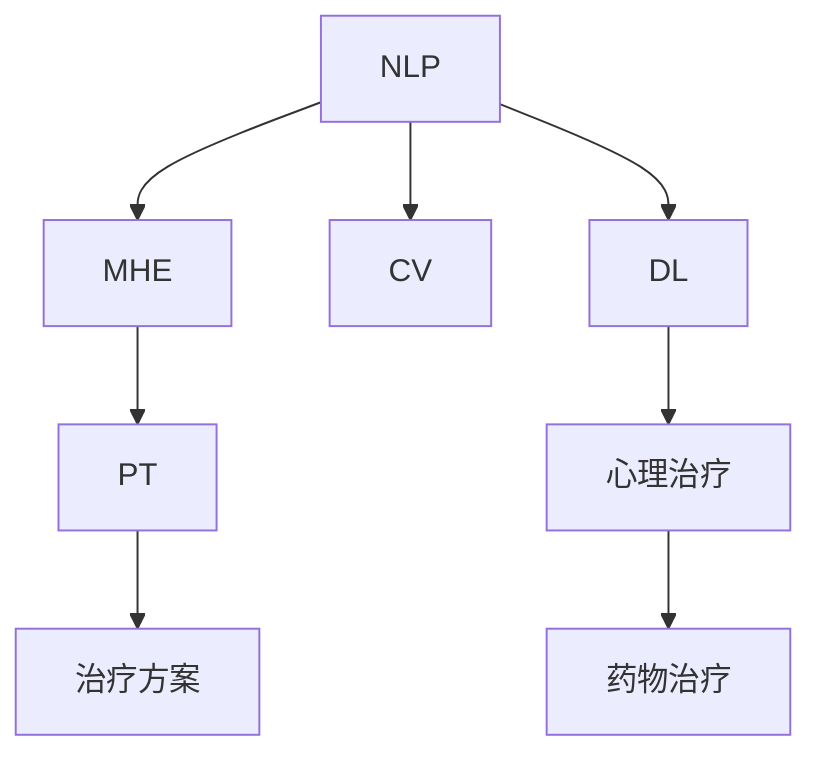

                 

# AI在心理健康领域的应用：早期诊断与治疗

> 关键词：人工智能,心理健康,早期诊断,机器学习,深度学习,自然语言处理,NLP,深度学习模型,心理健康评估,治疗方案,数据集

## 1. 背景介绍

### 1.1 问题由来

心理健康问题在全球范围内都是严峻的社会挑战。据世界卫生组织（WHO）报告，全球约有7.7亿人面临心理健康问题，其中包括抑郁症、焦虑症、精神分裂症等。全球每年约有2.8万人因精神疾病自杀，每分钟就有1人因精神疾病失去生命。在2020年新冠疫情爆发后，全球范围内心理健康问题更加严峻，许多人在疫情的巨大压力下出现了新的或加重的心理健康问题。

面对如此庞大的心理健康需求，传统的心理咨询和治疗方法显得力不从心。首先，心理咨询需要大量的人力和时间成本，且患者的隐私保护存在一定难度。其次，传统的治疗方法，如药物治疗和心理治疗，存在效果不稳定、副作用较大等问题。此外，许多心理疾病的早期症状较为隐匿，难以被及时发现和治疗。

在这样的背景下，AI技术，尤其是人工智能和深度学习技术，在心理健康领域的应用被广泛关注和探索。AI技术不仅可以快速高效地对大量患者进行初步评估和诊断，还可以提供个性化的治疗方案，从而提高心理健康问题的早期发现和治疗率。

### 1.2 问题核心关键点

当前，AI在心理健康领域主要应用于以下几个方面：

- **早期诊断**：利用自然语言处理（NLP）、计算机视觉（CV）等技术，从患者的语言、图像等数据中提取特征，进行心理健康状态的初步评估和分类。
- **治疗方案**：基于患者的历史数据和当前状态，结合AI技术进行个性化治疗方案的推荐。
- **数据分析**：通过数据挖掘和机器学习，分析和理解心理健康问题的潜在原因，探索心理健康疾病的发病机制。
- **行为监控**：利用传感器、移动设备等，实时监控患者的行为变化，及时发现和预警心理健康问题的恶化。

AI在心理健康领域的应用，为心理健康问题的早期诊断与治疗提供了新的可能性，有望极大提升心理健康服务的普及率和效果。

## 2. 核心概念与联系

### 2.1 核心概念概述

为更好地理解AI在心理健康领域的应用，本节将介绍几个密切相关的核心概念：

- **自然语言处理（NLP）**：专注于人工智能与计算机科学在处理和理解自然语言方面应用的一门学科。NLP技术可以从患者的语言数据中提取和分析心理状态。
- **计算机视觉（CV）**：利用图像和视频数据，通过AI技术进行心理健康状态的初步评估。
- **深度学习（DL）**：一种模仿人脑神经网络的机器学习技术，通过大量数据训练深度神经网络，从中提取特征进行分类、预测等任务。
- **心理健康评估（MHE）**：利用AI技术进行的心理健康状态评估，包括情绪、认知、行为等多个方面的综合分析。
- **个性化治疗（PT）**：基于患者的个性化数据和心理状态，提供定制化的治疗方案，以提高治疗效果。
- **数据集（Dataset）**：用于训练和评估AI模型的数据集合，通常包含患者的临床数据、心理测试结果、行为数据等。

这些核心概念之间的逻辑关系可以通过以下Mermaid流程图来展示：



这个流程图展示了大语言模型在心理健康评估中的应用路径，从语言数据到心理健康评估，再到个性化治疗方案的生成。

## 3. 核心算法原理 & 具体操作步骤
### 3.1 算法原理概述

基于AI的早期心理健康评估，一般遵循以下原理：

1. **数据收集**：收集患者的语言、图像、行为等数据，进行预处理和特征提取。
2. **模型训练**：利用收集到的数据，训练深度学习模型，进行心理健康状态的初步评估。
3. **状态分类**：将评估结果进行分类，识别出心理健康问题的类型和严重程度。
4. **治疗推荐**：结合患者的评估结果和历史数据，提供个性化的治疗方案。

### 3.2 算法步骤详解

以下是基于AI的早期心理健康评估的详细步骤：

**Step 1: 数据收集与预处理**

- **语言数据**：收集患者的日记、聊天记录、电子邮件等语言数据，使用NLP技术进行文本清洗、分词、词性标注等预处理。
- **图像数据**：收集患者的面部图像、情绪表情等图像数据，使用CV技术进行图像预处理，提取面部特征、情绪状态等。
- **行为数据**：收集患者的运动数据、睡眠数据等行为数据，使用传感器、移动设备等技术进行数据采集和预处理。

**Step 2: 特征提取**

- **文本特征提取**：利用NLP技术，从语言数据中提取文本特征，如TF-IDF、Word2Vec等。
- **图像特征提取**：利用CV技术，从图像数据中提取面部特征、情绪状态等特征，如卷积神经网络（CNN）、深度卷积神经网络（DCNN）等。
- **行为特征提取**：利用行为数据，提取运动、睡眠等行为特征，如加速度计、心率传感器等数据。

**Step 3: 模型训练**

- **深度学习模型**：利用提取的特征，训练深度学习模型，如卷积神经网络（CNN）、循环神经网络（RNN）、长短期记忆网络（LSTM）等。
- **特征融合**：将语言、图像、行为等多源特征进行融合，提高模型的综合评估能力。

**Step 4: 状态分类**

- **分类算法**：利用训练好的深度学习模型，对患者的心理健康状态进行分类，如正常、轻度抑郁、重度抑郁等。
- **结果验证**：使用测试集对模型进行验证，评估模型的准确率、召回率等性能指标。

**Step 5: 治疗推荐**

- **治疗方案生成**：根据患者的评估结果和历史数据，结合AI技术，生成个性化的治疗方案。
- **方案调整**：根据患者的反馈和治疗效果，不断调整和优化治疗方案。

### 3.3 算法优缺点

基于AI的早期心理健康评估具有以下优点：

- **高效准确**：AI技术可以在短时间内处理大量的患者数据，并快速提供初步评估结果，准确率较高。
- **个性化推荐**：基于患者的个性化数据和心理状态，AI可以提供个性化的治疗方案，提高治疗效果。
- **无创伤性**：相比于传统的心理测量和评估方法，AI技术具有无创伤、非侵入性的特点。

同时，该方法也存在一定的局限性：

- **数据依赖**：AI模型需要大量高质量的数据进行训练，数据质量直接影响模型的评估结果。
- **隐私保护**：患者的隐私数据涉及敏感信息，数据收集和处理过程中需要严格保护。
- **伦理问题**：AI模型的决策过程和输出结果需要透明的解释，避免造成误诊和过度治疗。

尽管存在这些局限性，但AI技术在心理健康评估中的应用前景广阔，为早期诊断和治疗提供了新的可能性。

### 3.4 算法应用领域

AI在心理健康领域的应用，已经涵盖了从早期诊断到个性化治疗的各个环节，具体包括：

- **情绪识别**：利用面部表情识别、语音情绪分析等技术，识别患者的情绪状态，及时发现心理健康问题。
- **行为分析**：通过行为数据，如运动轨迹、睡眠质量等，分析患者的心理和生理状态，辅助心理健康评估。
- **认知评估**：利用自然语言处理技术，分析患者的认知状态，评估记忆、注意力等认知能力。
- **心理健康筛查**：利用图像数据和NLP技术，进行心理健康问题的初步筛查，减少误诊和漏诊。
- **治疗方案推荐**：结合患者的历史数据和当前状态，AI可以生成个性化的治疗方案，提高治疗效果。
- **数据分析和挖掘**：通过数据挖掘和机器学习，分析和理解心理健康问题的发病机制，探索新的治疗路径。

## 4. 数学模型和公式 & 详细讲解  
### 4.1 数学模型构建

本节将使用数学语言对基于AI的早期心理健康评估过程进行更加严格的刻画。

假设患者的心理健康状态为 $x$，模型的评估结果为 $y$，其中 $y$ 的可能取值为 $y_1, y_2, \ldots, y_n$，表示不同的心理健康状态。根据训练数据 $D=\{(x_i, y_i)\}_{i=1}^N$，模型的评估结果 $y$ 的概率分布为：

$$
P(y|x) = \frac{e^{-\ell(x, y)}}{\sum_{k=1}^n e^{-\ell(x, y_k)}}
$$

其中 $\ell(x, y)$ 为损失函数，用于衡量模型评估结果与真实状态之间的差异。损失函数的具体形式可以根据不同的评估任务进行设计，如交叉熵损失、均方误差损失等。

### 4.2 公式推导过程

以下是基于深度学习模型进行心理健康评估的公式推导过程。

以二分类任务为例，假设患者的心理健康状态为 $x$，模型的输出为 $y \in \{0, 1\}$，表示是否存在心理健康问题。模型的损失函数为交叉熵损失函数：

$$
\ell(x, y) = -[y \log P(y|x) + (1-y) \log (1-P(y|x))]
$$

将损失函数代入上述概率分布公式，得：

$$
P(y|x) = \frac{e^{-\ell(x, y)}}{\sum_{k=1}^n e^{-\ell(x, y_k)}}
$$

将上述公式带入深度学习模型的训练公式，得：

$$
\theta \leftarrow \theta - \eta \nabla_{\theta} \ell(x, y) - \eta \lambda \theta
$$

其中 $\theta$ 为模型参数，$\eta$ 为学习率，$\lambda$ 为正则化系数，$\nabla_{\theta} \ell(x, y)$ 为损失函数对模型参数的梯度。

### 4.3 案例分析与讲解

以面部表情识别为例，展示如何利用AI进行心理健康状态的初步评估。

假设我们有 $N$ 个患者的面部图像和对应的心理健康状态，其中 $M$ 个患者存在心理健康问题。利用深度卷积神经网络（DCNN）模型对面部图像进行特征提取和分类。模型的输出结果 $y_i$ 表示第 $i$ 个患者是否存在心理健康问题，损失函数为交叉熵损失。

训练过程中，首先通过交叉熵损失计算模型对每个患者的预测误差 $\ell_i(x_i, y_i)$，然后利用梯度下降算法更新模型参数 $\theta$：

$$
\theta \leftarrow \theta - \eta \nabla_{\theta} \ell(x_i, y_i) - \eta \lambda \theta
$$

重复上述过程，直到模型收敛。训练完成后，利用测试集对模型进行验证，计算准确率和召回率等指标，评估模型的性能。

## 5. 项目实践：代码实例和详细解释说明
### 5.1 开发环境搭建

在进行心理健康评估项目开发前，我们需要准备好开发环境。以下是使用Python进行TensorFlow开发的环境配置流程：

1. 安装Anaconda：从官网下载并安装Anaconda，用于创建独立的Python环境。

2. 创建并激活虚拟环境：
```bash
conda create -n tf-env python=3.8 
conda activate tf-env
```

3. 安装TensorFlow：根据CUDA版本，从官网获取对应的安装命令。例如：
```bash
conda install tensorflow -c pytorch -c conda-forge
```

4. 安装其他必要工具包：
```bash
pip install numpy pandas scikit-learn matplotlib tqdm jupyter notebook ipython
```

完成上述步骤后，即可在`tf-env`环境中开始心理健康评估项目开发。

### 5.2 源代码详细实现

下面我们以面部表情识别为例，给出使用TensorFlow进行心理健康状态评估的PyTorch代码实现。

首先，定义数据处理函数：

```python
import tensorflow as tf
from tensorflow.keras.preprocessing.image import ImageDataGenerator
from tensorflow.keras.models import Sequential
from tensorflow.keras.layers import Conv2D, MaxPooling2D, Flatten, Dense

def preprocess_data(input_dir, batch_size=32):
    datagen = ImageDataGenerator(rescale=1./255)
    train_generator = datagen.flow_from_directory(
        input_dir,
        target_size=(48, 48),
        batch_size=batch_size,
        class_mode='binary')
    test_generator = datagen.flow_from_directory(
        test_input_dir,
        target_size=(48, 48),
        batch_size=batch_size,
        class_mode='binary')
    return train_generator, test_generator
```

然后，定义模型和训练函数：

```python
def create_model(input_shape, num_classes):
    model = Sequential([
        Conv2D(32, (3, 3), activation='relu', input_shape=input_shape),
        MaxPooling2D((2, 2)),
        Conv2D(64, (3, 3), activation='relu'),
        MaxPooling2D((2, 2)),
        Flatten(),
        Dense(64, activation='relu'),
        Dense(num_classes, activation='sigmoid')
    ])
    return model

def train_model(model, train_generator, test_generator, epochs=10, batch_size=32):
    model.compile(
        optimizer=tf.keras.optimizers.Adam(learning_rate=0.001),
        loss='binary_crossentropy',
        metrics=['accuracy'])
    history = model.fit(
        train_generator,
        epochs=epochs,
        validation_data=test_generator,
        steps_per_epoch=train_generator.n // batch_size)
    return model, history
```

接着，定义评估函数：

```python
def evaluate_model(model, test_generator):
    test_loss, test_acc = model.evaluate(
        test_generator, 
        steps=test_generator.n // batch_size)
    print('Test accuracy:', test_acc)
    return test_acc
```

最后，启动训练流程并在测试集上评估：

```python
input_dir = 'train_data'
test_input_dir = 'test_data'

train_generator, test_generator = preprocess_data(input_dir, batch_size=32)

model = create_model(input_shape=(48, 48, 3), num_classes=2)
model, history = train_model(model, train_generator, test_generator, epochs=10, batch_size=32)

test_acc = evaluate_model(model, test_generator)
print('Test accuracy:', test_acc)
```

以上就是使用TensorFlow进行面部表情识别的心理健康状态评估的完整代码实现。可以看到，TensorFlow提供了便捷的Keras API，使得模型构建和训练过程变得简单高效。

### 5.3 代码解读与分析

让我们再详细解读一下关键代码的实现细节：

**preprocess_data函数**：
- 定义了图像数据增强函数，对图像进行归一化处理。
- 使用ImageDataGenerator生成训练和测试数据集，进行批次化加载。

**create_model函数**：
- 定义了一个简单的卷积神经网络模型，包括卷积层、池化层、全连接层等。
- 利用sigmoid激活函数进行二分类任务。

**train_model函数**：
- 利用Adam优化器进行模型训练，损失函数为交叉熵损失。
- 使用evaluation_data验证模型的性能，返回训练过程中的损失和准确率曲线。

**evaluate_model函数**：
- 利用测试集评估模型的性能，输出测试集上的准确率。

**训练流程**：
- 定义输入目录和测试输入目录。
- 调用preprocess_data函数，生成训练和测试数据集。
- 调用create_model函数，定义模型架构。
- 调用train_model函数，训练模型并记录训练过程中的性能指标。
- 调用evaluate_model函数，评估模型的性能。

可以看到，TensorFlow提供了完整的工具链支持，使得心理健康评估模型的开发变得高效便捷。

## 6. 实际应用场景
### 6.1 智能心理咨询

基于AI的智能心理咨询系统，可以24小时不间断地为患者提供心理咨询服务。该系统通过语音识别、NLP技术等，理解患者的问题和情绪状态，提供个性化的心理咨询建议，辅助心理健康评估。

在技术实现上，可以收集用户的语音数据、文字聊天记录等数据，使用NLP技术进行情感分析和话题分类，生成情感和话题分布向量。将此向量输入到深度学习模型中，进行心理健康状态的初步评估。根据评估结果，结合患者的个性化数据，生成个性化的心理咨询建议。

### 6.2 心理健康筛查

心理健康筛查是早期发现心理健康问题的关键手段。传统的心理健康筛查往往依赖人工操作，耗时耗力，且准确率不高。利用AI技术，可以在短时间内对大量人群进行心理健康状态的筛查。

在实践过程中，可以收集患者的问卷数据、日常行为数据等，使用机器学习技术进行心理健康状态的初步评估。对于存在心理健康问题的患者，系统将自动生成筛查报告，并提供进一步的心理健康评估和干预建议。

### 6.3 情绪分析与预警

情绪分析是心理健康评估的重要部分。利用AI技术，可以对患者的情绪状态进行实时监测和分析，及时发现情绪波动的异常情况，进行预警。

具体而言，可以收集患者的语音数据、面部表情数据等，使用深度学习模型进行情绪识别和分析。对于情绪异常的预警，系统将自动通知患者和其家人，提醒其及时进行心理健康干预。

### 6.4 未来应用展望

随着AI技术的发展，未来的心理健康评估将更具智能化和个性化。

- **实时监测**：基于传感器的实时数据，可以实现对患者行为和情绪的实时监测，及时发现心理健康问题的苗头。
- **多模态融合**：将语言、图像、行为等多模态数据进行融合，提高心理健康评估的准确性和全面性。
- **大数据分析**：利用大数据分析技术，进行心理健康问题的趋势分析和预测，辅助心理健康政策的制定和实施。
- **自动化干预**：结合虚拟现实（VR）、增强现实（AR）等技术，提供沉浸式的心理健康干预和康复训练。

总之，AI技术在心理健康领域的应用前景广阔，有望极大地提升心理健康服务的普及率和效果，为心理健康问题的早期发现和治疗提供新的可能性。

## 7. 工具和资源推荐
### 7.1 学习资源推荐

为了帮助开发者系统掌握AI在心理健康领域的应用理论基础和实践技巧，这里推荐一些优质的学习资源：

1. 《深度学习》系列书籍：由多位AI领域的专家共同撰写，全面介绍了深度学习的基本概念和算法，适合入门学习和进阶研究。

2. 《自然语言处理综论》：由斯坦福大学开设的NLP明星课程，详细讲解了NLP的基本原理和应用，涵盖文本分类、情感分析、命名实体识别等多个任务。

3. TensorFlow官方文档：TensorFlow的官方文档，提供了大量实例和教程，适合初学者快速上手深度学习项目。

4. Kaggle竞赛：Kaggle平台上的心理健康数据分析竞赛，提供大量真实数据和模型评估指标，适合进行实际项目训练和优化。

5. GitHub开源项目：Github上的AI心理健康开源项目，提供丰富的数据集和模型实现，适合进行二次开发和优化。

通过对这些资源的学习实践，相信你一定能够快速掌握AI在心理健康领域的应用方法，并用于解决实际的心理学问题。

### 7.2 开发工具推荐

高效的开发离不开优秀的工具支持。以下是几款用于心理健康评估开发的常用工具：

1. TensorFlow：基于Python的开源深度学习框架，生产部署方便，适合大规模工程应用。提供便捷的Keras API，适合快速开发和实验。

2. PyTorch：基于Python的开源深度学习框架，灵活动态的计算图，适合研究型项目开发。提供丰富的模型库和优化器选择，适合学术研究和工业实践。

3. HuggingFace Transformers库：基于PyTorch和TensorFlow，提供了大量预训练语言模型，支持自然语言处理任务。

4. Weights & Biases：模型训练的实验跟踪工具，可以记录和可视化模型训练过程中的各项指标，方便对比和调优。

5. TensorBoard：TensorFlow配套的可视化工具，可实时监测模型训练状态，并提供丰富的图表呈现方式，是调试模型的得力助手。

6. Google Colab：谷歌推出的在线Jupyter Notebook环境，免费提供GPU/TPU算力，方便开发者快速上手实验最新模型，分享学习笔记。

合理利用这些工具，可以显著提升心理健康评估项目的开发效率，加快创新迭代的步伐。

### 7.3 相关论文推荐

心理健康评估技术的不断发展，得益于学界的持续研究。以下是几篇奠基性的相关论文，推荐阅读：

1. "Mood Detection in Online Content with Sentiment Analysis"：利用情感分析技术，检测在线内容的情绪状态。

2. "A Deep Learning Approach for Depression Detection in Smartphones"：利用深度学习模型，检测智能手机上的抑郁情绪。

3. "Natural Language Processing Approach to the Early Detection of Depression"：利用NLP技术，从患者的文字记录中早期检测抑郁情绪。

4. "Emotion Recognition from Facial Images using Deep Convolutional Neural Networks"：利用深度卷积神经网络，从面部图像中识别情绪状态。

5. "Early Identification of Depression and Anxiety from Vocal and EEG Signals"：利用声音和脑电信号，早期识别抑郁和焦虑情绪。

这些论文代表了大规模语言模型在心理健康评估领域的发展脉络。通过学习这些前沿成果，可以帮助研究者把握学科前进方向，激发更多的创新灵感。

## 8. 总结：未来发展趋势与挑战

### 8.1 总结

本文对基于AI的早期心理健康评估方法进行了全面系统的介绍。首先阐述了心理健康问题在全世界的严峻形势，以及AI技术在心理健康领域的应用前景。其次，从原理到实践，详细讲解了心理健康评估的数学模型和操作步骤，给出了心理健康评估项目的完整代码实现。同时，本文还广泛探讨了心理健康评估技术在智能心理咨询、心理健康筛查、情绪分析与预警等多个应用场景中的实际应用，展示了AI技术在心理健康领域的前景。此外，本文精选了心理健康评估技术的各类学习资源，力求为读者提供全方位的技术指引。

通过本文的系统梳理，可以看到，基于AI的早期心理健康评估技术正在成为心理健康领域的重要范式，极大地提升了心理健康问题的早期发现和治疗率。未来，伴随AI技术的不断发展，心理健康评估技术也将不断提升，为心理健康问题的早期发现和治疗提供新的可能性。

### 8.2 未来发展趋势

展望未来，心理健康评估技术将呈现以下几个发展趋势：

1. **多模态融合**：将语言、图像、行为等多模态数据进行融合，提高心理健康评估的准确性和全面性。
2. **实时监测**：基于传感器的实时数据，实现对患者行为和情绪的实时监测，及时发现心理健康问题的苗头。
3. **大数据分析**：利用大数据分析技术，进行心理健康问题的趋势分析和预测，辅助心理健康政策的制定和实施。
4. **自动化干预**：结合虚拟现实（VR）、增强现实（AR）等技术，提供沉浸式的心理健康干预和康复训练。
5. **自动化评估**：结合自然语言处理技术和深度学习模型，自动评估患者的心理健康状态，减少人工操作。

以上趋势凸显了心理健康评估技术在未来的广阔前景。这些方向的探索发展，必将进一步提升心理健康评估的准确性和效率，为心理健康问题的早期发现和治疗提供新的可能性。

### 8.3 面临的挑战

尽管心理健康评估技术已经取得了瞩目成就，但在迈向更加智能化、普适化应用的过程中，它仍面临着诸多挑战：

1. **数据依赖**：AI模型需要大量高质量的数据进行训练，数据质量直接影响模型的评估结果。
2. **隐私保护**：患者的隐私数据涉及敏感信息，数据收集和处理过程中需要严格保护。
3. **伦理问题**：AI模型的决策过程和输出结果需要透明的解释，避免造成误诊和过度治疗。
4. **模型泛化性**：训练集和测试集之间存在差异，模型可能过拟合，影响泛化能力。
5. **实时性**：实时监测需要高效的数据处理和快速响应，对计算资源和算法性能提出较高要求。

尽管存在这些挑战，但AI技术在心理健康评估中的应用前景广阔，为心理健康问题的早期发现和治疗提供了新的可能性。未来，需要从数据、模型、伦理等多个维度进行全面优化，才能真正实现心理健康评估的普及和落地。

### 8.4 研究展望

面对心理健康评估技术所面临的挑战，未来的研究需要在以下几个方面寻求新的突破：

1. **多源数据融合**：将语音、图像、行为等多种数据源进行融合，提高心理健康评估的全面性和准确性。
2. **跨模态分析**：结合多模态数据，利用深度学习模型进行综合分析，挖掘心理健康问题的内在机制。
3. **隐私保护**：采用差分隐私、联邦学习等技术，保护患者隐私，确保数据安全。
4. **实时监测**：优化实时数据处理算法，提高心理健康评估的实时性和响应速度。
5. **解释性增强**：引入可解释性技术，如LIME、SHAP等，提高模型的可解释性，减少误诊和过度治疗。

这些研究方向将推动心理健康评估技术不断进步，为心理健康问题的早期发现和治疗提供新的可能性。相信随着技术的不断突破，心理健康评估技术必将更加智能、普适，为患者提供更好的心理健康服务。

## 9. 附录：常见问题与解答

**Q1：心理健康评估技术是否适用于所有人群？**

A: 心理健康评估技术在很大程度上依赖于高质量的数据，不同人群（如年龄、性别、文化背景等）的数据特点和心理健康问题表现可能有所不同。因此，需要根据具体人群的特点，选择合适的心理健康评估技术，并进行针对性的数据收集和模型训练。

**Q2：心理健康评估技术是否需要高昂的计算资源？**

A: 心理健康评估技术的计算资源需求主要取决于数据规模和模型复杂度。通常，在模型训练和实时监测阶段需要较高计算资源，但在模型评估和预测阶段计算需求相对较小。合理使用GPU/TPU等高性能设备，可以有效降低计算成本。

**Q3：心理健康评估技术的评估结果是否准确可靠？**

A: 心理健康评估技术的准确性和可靠性取决于多个因素，包括模型的训练数据质量、模型的选择和优化、评估指标的设计等。在实践中，需要通过多轮数据集验证和模型优化，不断提高评估结果的准确性和可靠性。

**Q4：心理健康评估技术是否需要人工干预？**

A: 心理健康评估技术在初步评估和诊断阶段，可以自动生成评估结果，减少人工操作。但在某些情况下，如患者的隐私保护、模型的解释性等，需要结合人工干预，确保评估结果的合理性和公正性。

**Q5：心理健康评估技术是否容易被误用？**

A: 心理健康评估技术的误用风险主要来自模型的决策过程和输出结果的透明性不足。为减少误用风险，需要对模型进行公开、透明的解释，并提供必要的伦理和安全保障。

通过本文的系统梳理，可以看到，基于AI的早期心理健康评估技术正在成为心理健康领域的重要范式，极大地提升了心理健康问题的早期发现和治疗率。未来，伴随AI技术的不断发展，心理健康评估技术也将不断提升，为心理健康问题的早期发现和治疗提供新的可能性。相信随着技术的不断突破，心理健康评估技术必将更加智能、普适，为患者提供更好的心理健康服务。

---

作者：禅与计算机程序设计艺术 / Zen and the Art of Computer Programming

