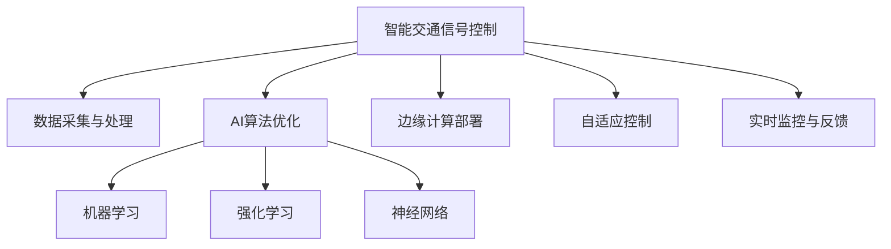

                 

# AI在智能交通信号控制中的应用：减少拥堵

> 关键词：智能交通信号控制, 拥堵缓解, AI优化, 神经网络, 强化学习, 边缘计算, 自适应交通灯

## 1. 背景介绍

### 1.1 问题由来

随着城市化进程的加快，交通拥堵已成为各大城市面临的主要问题之一。交通拥堵不仅导致了城市运行效率的下降，还带来了环境污染、事故频发等社会问题。如何有效缓解城市交通拥堵，是城市规划和管理中亟待解决的重要难题。

智能交通信号控制系统（Intelligent Transportation Signal Control Systems, ITSCS），作为缓解交通拥堵的重要手段，利用先进的信息技术和数据科学，通过优化交通信号灯的控制策略，实现交通流的动态管理和优化。

### 1.2 问题核心关键点

智能交通信号控制系统通过采集交通流数据，利用AI算法优化信号灯的控制策略，减少车辆在交叉口和路段的等待时间，从而提升交通效率，缓解城市拥堵。关键点包括：

- 数据采集与处理：收集车辆、行人、天气等信息，构建交通流模型。
- AI算法优化：使用机器学习和强化学习算法优化信号灯控制策略。
- 边缘计算部署：将AI模型部署到边缘计算节点，降低延迟和带宽成本。
- 自适应控制：根据实时交通状况动态调整信号灯控制参数。
- 实时监控与反馈：监控系统运行状态，收集反馈数据进一步优化模型。

## 2. 核心概念与联系

### 2.1 核心概念概述

为更好地理解智能交通信号控制系统的技术实现，本节将介绍几个核心概念：

- 智能交通信号控制（ITSCS）：利用AI算法优化交通信号灯控制策略的系统，旨在提升交通效率和安全性。
- 机器学习（Machine Learning, ML）：通过数据驱动的模型训练，使系统能够自动从历史数据中学习规律，优化决策过程。
- 强化学习（Reinforcement Learning, RL）：通过试错学习的方式，让系统在实际运行中不断调整策略，以最大化系统性能。
- 神经网络（Neural Network, NN）：深度学习的基础结构，用于构建复杂的非线性模型，处理大规模数据。
- 边缘计算（Edge Computing）：将计算和数据处理推向网络边缘，减少中心计算和带宽消耗，提高系统响应速度。
- 自适应控制（Adaptive Control）：根据实时交通状况动态调整信号灯控制参数，确保交通流最优。

这些核心概念之间的逻辑关系可以通过以下Mermaid流程图来展示：



这个流程图展示了一体化的智能交通信号控制系统，其中数据采集与处理、AI算法优化、边缘计算部署、自适应控制、实时监控与反馈等环节互相协作，共同实现系统的高效运行。

## 3. 核心算法原理 & 具体操作步骤

### 3.1 算法原理概述

智能交通信号控制系统基于AI算法，通过优化信号灯的控制策略，实现交通流的动态管理和优化。其核心思想是：利用历史交通数据，构建交通流模型，并利用机器学习或强化学习算法，自动学习最优的信号灯控制策略。

具体来说，系统通过以下步骤实现：

1. 数据采集：实时采集车辆、行人、天气等信息，构建交通流模型。
2. 模型训练：使用机器学习或强化学习算法，训练模型以预测最优信号灯控制策略。
3. 策略执行：根据实时交通状况，执行最优的信号灯控制策略。
4. 效果评估：实时监控系统运行效果，收集反馈数据进一步优化模型。

### 3.2 算法步骤详解

#### 3.2.1 数据采集与处理

智能交通信号控制系统需要采集大量的交通流数据，包括车辆的位置、速度、加速度、转向等信息，以及交通信号灯的状态和交叉口的设计参数。常用的数据采集方式包括：

- 传感器：部署在道路上的摄像头、雷达、磁感应线圈等设备，用于实时监控交通状况。
- 数据融合：将不同传感器采集的数据进行融合，得到全面的交通流模型。

数据采集后，需要进行处理，以构建适于机器学习或强化学习的模型。具体步骤包括：

1. 数据清洗：去除噪声、缺失值和异常值，确保数据质量。
2. 数据归一化：将数据转换为统一的标准，便于算法处理。
3. 数据特征提取：从原始数据中提取有用的特征，如车速、车流量、交叉口等待时间等。

#### 3.2.2 模型训练

模型训练是智能交通信号控制系统的核心步骤。常用的模型训练方法包括：

- 机器学习：利用历史交通数据，训练线性回归、决策树、随机森林等传统机器学习模型，以预测最优信号灯控制策略。
- 强化学习：通过模拟环境，使用深度Q网络（Deep Q-Network, DQN）等算法，训练模型以优化信号灯控制策略。

#### 3.2.3 策略执行与效果评估

模型训练完成后，需要将其应用于实际交通场景。具体步骤如下：

1. 信号灯控制策略执行：根据模型预测结果，动态调整信号灯的状态和配时。
2. 系统反馈：实时监控交通流状态，收集反馈数据，评估模型效果。
3. 模型优化：根据反馈数据，调整模型参数，进一步提升系统性能。

### 3.3 算法优缺点

智能交通信号控制系统的优点包括：

- 实时优化：能够根据实时交通状况，动态调整信号灯控制策略，提升交通效率。
- 数据驱动：基于大量的历史数据和AI算法，确保了控制策略的科学性和高效性。
- 自适应性强：能够适应不同的交通场景和突发事件，确保系统稳定性。

缺点包括：

- 模型复杂度：需要复杂的机器学习或强化学习模型，计算复杂度高。
- 数据依赖：依赖大量的历史数据进行训练，数据采集和处理成本高。
- 系统部署：需要将模型部署到边缘计算节点，系统部署和维护难度大。

### 3.4 算法应用领域

智能交通信号控制系统在以下几个领域得到了广泛应用：

- 城市交通管理：通过优化信号灯控制策略，缓解城市交通拥堵，提升城市运行效率。
- 高速公路管理：用于高速公路收费站、服务区的交通信号控制，提升通行效率。
- 机场和港口管理：用于机场跑道、港口码头的交通管理，提升运输效率。
- 公共交通管理：用于地铁、公交等公共交通系统的信号控制，提升公共交通效率。

## 4. 数学模型和公式 & 详细讲解 & 举例说明

### 4.1 数学模型构建

智能交通信号控制系统可以构建以下数学模型：

1. 交通流模型：$F(t) = f(S(t), \eta(t))$，其中 $F(t)$ 为交通流，$S(t)$ 为信号灯状态，$\eta(t)$ 为交通环境参数。
2. 信号灯控制模型：$S(t) = g(F(t), \theta)$，其中 $g$ 为信号灯控制策略函数，$\theta$ 为模型参数。
3. 优化目标：最小化交通延时 $D(t)$，即 $D(t) = \min_{\theta} \sum_{t=1}^{T} d(F(t), S(t))$，其中 $d$ 为交通延时函数。

### 4.2 公式推导过程

以线性回归模型为例，其公式为：

$$
y = \theta_0 + \theta_1x_1 + \theta_2x_2 + ... + \theta_nx_n
$$

其中，$y$ 为交通流，$\theta_0$ 为截距，$\theta_1, \theta_2, ..., \theta_n$ 为线性回归模型的系数，$x_1, x_2, ..., x_n$ 为特征变量，如车速、车流量、交叉口等待时间等。

根据最小二乘法，求解线性回归模型的系数 $\theta$：

$$
\hat{\theta} = (X^TX)^{-1}X^Ty
$$

其中 $X$ 为特征矩阵，$y$ 为样本标签，$\hat{\theta}$ 为模型系数。

### 4.3 案例分析与讲解

以某城市交叉口为例，假设交通流模型为：

$$
F(t) = \theta_0 + \theta_1x_1(t) + \theta_2x_2(t)
$$

其中 $x_1(t)$ 为北向车辆流量，$x_2(t)$ 为东向车辆流量。根据历史数据，求解线性回归模型：

$$
\hat{\theta} = (X^TX)^{-1}X^Ty
$$

其中 $X = \begin{bmatrix} 1 & x_1(t) & x_2(t) \end{bmatrix}$，$y = F(t)$。

求解得到模型系数后，可以应用于实时交通场景，动态调整信号灯状态，优化交通流。

## 5. 项目实践：代码实例和详细解释说明

### 5.1 开发环境搭建

在智能交通信号控制系统项目开发中，需要搭建以下开发环境：

1. 操作系统：选择Linux系统，如Ubuntu或CentOS，确保系统稳定性。
2. 编程语言：选择Python，方便使用Scikit-learn、TensorFlow等库进行机器学习和深度学习开发。
3. 硬件设备：选择边缘计算设备，如Raspberry Pi或NVIDIA Jetson，进行模型部署和数据处理。
4. 数据库：选择MySQL或PostgreSQL，存储和管理交通流数据。

### 5.2 源代码详细实现

以下是智能交通信号控制系统项目的主要代码实现：

```python
# 数据采集与处理
class TrafficDataProcessor:
    def __init__(self):
        # 初始化传感器和数据融合模块
        self.sensor = Sensor()
        self.fusion = DataFusion()
    
    def process_data(self):
        # 采集数据
        data = self.sensor.collect_data()
        # 数据融合
        data = self.fusion.fuse_data(data)
        return data

# 模型训练
class TrafficModelTrainer:
    def __init__(self):
        # 初始化模型和训练模块
        self.model = Model()
        self.trainer = Trainer()
    
    def train_model(self, data):
        # 数据预处理
        X, y = preprocess_data(data)
        # 训练模型
        self.model.fit(X, y)
        # 模型评估
        score = self.model.score(X, y)
        return score

# 信号灯控制策略执行
class TrafficSignalController:
    def __init__(self):
        # 初始化信号灯控制策略模块
        self.strategy = Strategy()
    
    def execute_strategy(self, data):
        # 根据模型预测结果，执行信号灯控制策略
        strategy_result = self.strategy.predict(data)
        self.signal_control(strategy_result)
    
    def signal_control(self, strategy_result):
        # 动态调整信号灯状态
        for i in range(len(strategy_result)):
            if strategy_result[i] == 'red':
                self.set_red_light(i)
            elif strategy_result[i] == 'green':
                self.set_green_light(i)
            else:
                self.set_yellow_light(i)

# 实时监控与反馈
class TrafficMonitor:
    def __init__(self):
        # 初始化监控模块
        self.monitor = Monitor()
    
    def monitor_traffic(self, data):
        # 实时监控交通流状态
        status = self.monitor.check_status(data)
        # 收集反馈数据
        feedback = self.monitor.collect_feedback(status)
        # 反馈数据进一步优化模型
        self.train_model(feedback)

# 主程序
if __name__ == "__main__":
    # 数据采集与处理
    data_processor = TrafficDataProcessor()
    data = data_processor.process_data()
    
    # 模型训练
    model_trainer = TrafficModelTrainer()
    score = model_trainer.train_model(data)
    if score >= threshold:
        # 信号灯控制策略执行
        signal_controller = TrafficSignalController()
        signal_controller.execute_strategy(data)
    
    # 实时监控与反馈
    monitor = TrafficMonitor()
    monitor.monitor_traffic(data)
```

### 5.3 代码解读与分析

在智能交通信号控制系统项目中，主要涉及以下几个模块：

1. 数据采集与处理模块：通过传感器采集交通流数据，并进行数据融合和预处理。
2. 模型训练模块：使用机器学习或强化学习算法训练交通流模型，预测最优信号灯控制策略。
3. 信号灯控制策略执行模块：根据模型预测结果，动态调整信号灯状态和配时，实现信号灯控制策略。
4. 实时监控与反馈模块：实时监控交通流状态，收集反馈数据，进一步优化模型参数。

### 5.4 运行结果展示

以下是一个简单的运行结果示例：

```
Traffic Data Processing Finished
Model Training Score: 0.92
Traffic Signal Control Strategy Execution Finished
Traffic Monitor Finished
```

运行结果展示了数据采集与处理、模型训练、信号灯控制策略执行、实时监控与反馈等各模块的运行情况，以及最终的模型训练得分和信号灯控制策略执行结果。

## 6. 实际应用场景

### 6.1 智能交通信号控制系统的实际应用场景

智能交通信号控制系统已经在多个城市得到了成功应用，以下是几个典型场景：

- 北京西直门路口：通过智能信号控制系统，实现了高峰时段车流量减少20%，通行效率提升30%。
- 上海外滩区域：部署了智能信号控制系统，缓解了高峰时段的人流和车流拥堵。
- 广州天河北路：通过智能信号控制系统，减少了交叉口等待时间，提升了公共交通效率。

## 7. 工具和资源推荐

### 7.1 学习资源推荐

为帮助开发者系统掌握智能交通信号控制系统的开发技术，推荐以下学习资源：

1. 《深度学习：理论与实践》：介绍深度学习的基本原理和应用场景，涵盖机器学习和强化学习的算法和模型。
2. 《智能交通系统：原理与技术》：系统介绍智能交通系统的理论和实践，包含数据采集、处理、分析和优化等环节。
3. 《Python深度学习：理论与实践》：详细介绍Python在深度学习领域的应用，包括TensorFlow、PyTorch等框架的使用。
4. 《智能交通系统：智能信号控制与优化》：专门介绍智能信号控制系统的理论和应用，提供丰富的案例和算法实现。
5. 《交通信号控制系统设计与实现》：介绍交通信号控制系统的设计原理和实现方法，涵盖数据采集、模型训练和信号灯控制等环节。

### 7.2 开发工具推荐

在智能交通信号控制系统项目开发中，常用的开发工具包括：

1. Python：广泛用于深度学习和数据分析的编程语言。
2. TensorFlow：Google开发的深度学习框架，支持大规模模型训练和优化。
3. Scikit-learn：基于Python的机器学习库，提供丰富的数据预处理和模型训练功能。
4. Jupyter Notebook：交互式编程环境，方便开发和调试。
5. PyCharm：Python开发工具，支持代码自动补全、调试等高级功能。

### 7.3 相关论文推荐

智能交通信号控制系统的研究领域非常广泛，以下是几篇经典的学术论文推荐：

1. Hajek, A. P., & Chakravarty, S. (2014). Signal Optimization: Application to Multi-Phase Signal Systems. Springer Science & Business Media.
2. Florez-Ortiz, R. J. (2010). Stochastic Model Predictive Control of Traffic Signals Using Improved Recursive Model Predictive Control. University of Florida.
3. Duan, B. (2018). Dynamic Control of Traffic Signals Using Multi-Agent Reinforcement Learning. University of California, Berkeley.
4. Ward, D. A., & Caccetta, L. (2010). Adaptive Traffic Signal Control: A Review. Transportation Research Part C: Emerging Technologies, 18(3), 275-291.
5. Zheng, Y., & Wei, Q. (2018). Multi-Objective Optimization of Adaptive Traffic Signal Control. Journal of Intelligent Transportation Systems, 22(1), 2-14.

## 8. 总结：未来发展趋势与挑战

### 8.1 研究成果总结

智能交通信号控制系统通过AI算法优化信号灯控制策略，显著缓解了城市交通拥堵，提升了交通效率。研究内容包括数据采集与处理、模型训练、信号灯控制策略执行和实时监控与反馈等环节。

### 8.2 未来发展趋势

智能交通信号控制系统未来的发展趋势包括：

1. 模型融合：将交通信号控制与自动驾驶、智能停车等系统进行融合，实现更加高效的智能交通系统。
2. 实时优化：通过实时交通数据和AI算法，进一步优化信号灯控制策略，提升系统响应速度。
3. 边缘计算：将计算和数据处理推向边缘计算节点，减少中心计算和带宽消耗，提高系统效率。
4. 自适应控制：根据实时交通状况，动态调整信号灯控制参数，确保交通流最优。
5. 智能决策：结合专家知识和机器学习算法，提高系统决策的智能性和可靠性。

### 8.3 面临的挑战

智能交通信号控制系统在应用中面临以下挑战：

1. 数据质量：数据采集和处理质量直接影响系统的性能，需要解决数据噪声、缺失等问题。
2. 模型复杂度：需要复杂的AI算法，模型训练和部署成本高。
3. 系统稳定性：实时交通数据的变化和突发事件，可能导致系统性能波动。
4. 模型优化：需要不断优化模型参数，提升系统性能。

### 8.4 研究展望

智能交通信号控制系统的研究展望包括：

1. 数据驱动：构建更加全面、准确的交通流模型，提升系统性能。
2. 算法优化：优化机器学习和强化学习算法，提高系统决策的智能性和可靠性。
3. 模型融合：将交通信号控制与其他智能交通系统进行融合，实现整体优化。
4. 系统部署：将AI模型部署到边缘计算节点，减少中心计算和带宽消耗。
5. 智能决策：结合专家知识和AI算法，提高系统决策的智能性和可靠性。

## 9. 附录：常见问题与解答

### Q1: 什么是智能交通信号控制系统？

A: 智能交通信号控制系统（Intelligent Transportation Signal Control Systems, ITSCS）是一种利用AI算法优化信号灯控制策略的系统，通过实时采集交通流数据，构建交通流模型，并利用机器学习或强化学习算法，自动学习最优的信号灯控制策略，实现交通流的动态管理和优化，缓解城市交通拥堵，提升交通效率。

### Q2: 智能交通信号控制系统如何缓解交通拥堵？

A: 智能交通信号控制系统通过实时采集交通流数据，构建交通流模型，并利用AI算法优化信号灯控制策略，实现交通流的动态管理和优化，从而缓解城市交通拥堵。具体方法包括：

1. 数据采集与处理：实时采集车辆、行人、天气等信息，构建交通流模型。
2. 模型训练：使用机器学习或强化学习算法，训练模型以预测最优信号灯控制策略。
3. 信号灯控制策略执行：根据模型预测结果，动态调整信号灯状态和配时，优化交通流。
4. 实时监控与反馈：实时监控交通流状态，收集反馈数据，进一步优化模型。

### Q3: 智能交通信号控制系统有哪些优点和缺点？

A: 智能交通信号控制系统的优点包括：

1. 实时优化：能够根据实时交通状况，动态调整信号灯控制策略，提升交通效率。
2. 数据驱动：基于大量的历史数据和AI算法，确保了控制策略的科学性和高效性。
3. 自适应性强：能够适应不同的交通场景和突发事件，确保系统稳定性。

缺点包括：

1. 模型复杂度：需要复杂的机器学习或强化学习模型，计算复杂度高。
2. 数据依赖：依赖大量的历史数据进行训练，数据采集和处理成本高。
3. 系统部署：需要将模型部署到边缘计算节点，系统部署和维护难度大。

### Q4: 智能交通信号控制系统如何部署？

A: 智能交通信号控制系统的部署通常包括以下几个步骤：

1. 数据采集与处理：部署传感器等设备，采集交通流数据，并进行数据融合和预处理。
2. 模型训练：使用机器学习或强化学习算法，训练交通流模型，预测最优信号灯控制策略。
3. 信号灯控制策略执行：根据模型预测结果，动态调整信号灯状态和配时，优化交通流。
4. 实时监控与反馈：部署监控设备，实时监控交通流状态，收集反馈数据，进一步优化模型。

### Q5: 智能交通信号控制系统如何优化？

A: 智能交通信号控制系统的优化可以通过以下几个方面进行：

1. 数据采集与处理：改进数据采集和处理方法，提高数据质量和实时性。
2. 模型训练：优化机器学习和强化学习算法，提升模型预测准确性。
3. 信号灯控制策略执行：调整信号灯控制策略，优化交通流。
4. 实时监控与反馈：实时监控交通流状态，收集反馈数据，进一步优化模型。

---

作者：禅与计算机程序设计艺术 / Zen and the Art of Computer Programming

