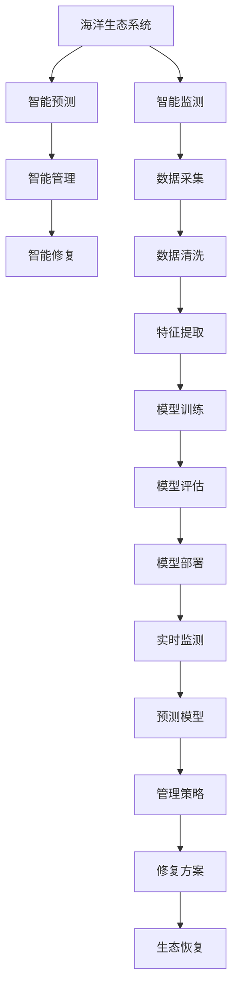

                 

# AI在智能海洋资源管理中的应用：保护海洋生态

## 1. 背景介绍

### 1.1 问题由来
随着全球气候变化和人类活动的加剧，海洋生态系统正面临着前所未有的威胁。过度捕捞、海洋污染、全球变暖等问题导致海洋生物多样性下降，渔业资源枯竭，威胁海洋生态平衡。智能海洋资源管理成为缓解这些问题的关键手段。AI技术，特别是基于深度学习的智能分析技术，在海洋资源管理中扮演了越来越重要的角色。

### 1.2 问题核心关键点
AI在海洋资源管理中的应用，主要集中在以下几个方面：
- 智能监测：利用AI对海洋生态进行实时监测，识别海洋污染、过度捕捞等行为。
- 智能预测：基于历史数据和实时监测数据，AI能够预测海洋资源变化趋势，预警潜在威胁。
- 智能管理：AI辅助进行渔业资源管理，优化捕捞策略，提高渔业效率。
- 智能修复：AI技术可用于海洋生态修复，重建受损的海洋生态系统。

### 1.3 问题研究意义
AI在智能海洋资源管理中的应用，对保护海洋生态、维护全球生态平衡具有重要意义。通过智能监测和预测，可以有效减少海洋污染和过度捕捞等行为，保护海洋生物多样性。AI的辅助管理可以提高渔业效率，降低对海洋资源的依赖。此外，AI在生态修复中的作用也逐渐显现，助力构建更健康的海洋生态系统。

## 2. 核心概念与联系

### 2.1 核心概念概述

在智能海洋资源管理中，涉及多个核心概念：

- 海洋生态系统（Marine Ecosystem）：包括海洋生物、水文环境、地质结构等多个要素，是智能管理的基础。
- 智能监测（Intelligent Monitoring）：利用AI技术对海洋生态进行实时数据采集和分析，识别潜在问题。
- 智能预测（Intelligent Prediction）：基于历史数据和实时监测数据，利用机器学习模型预测未来趋势，预警风险。
- 智能管理（Intelligent Management）：使用AI辅助制定渔业管理策略，优化资源配置，提升管理效率。
- 智能修复（Intelligent Restoration）：利用AI技术对受损海洋生态进行恢复和重建，提高生态系统的自我修复能力。

这些概念相互联系，共同构成了智能海洋资源管理的整体框架。

### 2.2 核心概念原理和架构的 Mermaid 流程图



这个流程图展示了智能海洋资源管理的主要流程：

1. 数据采集：通过各种传感器和监测设备，收集海洋生态系统的各项数据。
2. 数据清洗：清洗和处理采集到的数据，去除噪声和异常值。
3. 特征提取：从清洗后的数据中提取有意义的特征，用于后续分析和建模。
4. 模型训练：基于历史数据和实时监测数据，训练各种AI模型，包括分类、回归、聚类等。
5. 模型评估：对训练好的模型进行评估，选择最优模型用于实际应用。
6. 模型部署：将训练好的模型部署到生产环境，进行实时监测和预测。
7. 管理策略：基于预测结果，制定和调整渔业管理策略，优化资源配置。
8. 修复方案：设计并实施生态修复方案，恢复受损的海洋生态系统。

这些步骤相互依赖，共同推动智能海洋资源管理的实施。

## 3. 核心算法原理 & 具体操作步骤

### 3.1 算法原理概述

智能海洋资源管理的核心算法原理，基于深度学习和机器学习，主要包括以下几个步骤：

- 数据采集与预处理：通过传感器和监测设备收集海洋生态系统数据，并进行清洗和特征提取。
- 模型训练与评估：基于历史数据和实时监测数据，训练各种AI模型，并进行评估和选择。
- 预测与监测：利用训练好的模型进行实时监测和预测，识别潜在问题和风险。
- 管理与修复：基于预测结果，制定和调整管理策略，优化资源配置，实施生态修复方案。

### 3.2 算法步骤详解

#### 3.2.1 数据采集与预处理

数据采集和预处理是智能海洋资源管理的第一步，主要包括以下步骤：

1. 数据采集：通过各种传感器和监测设备，如水下声纳、卫星遥感、无人机等，收集海洋生态系统的各项数据，包括水文环境、海洋生物、污染物质等。
2. 数据清洗：清洗和处理采集到的数据，去除噪声和异常值，确保数据的准确性和一致性。
3. 特征提取：从清洗后的数据中提取有意义的特征，如水温、盐度、溶解氧、浮游生物密度等，用于后续分析和建模。

#### 3.2.2 模型训练与评估

模型训练与评估是智能海洋资源管理的核心环节，主要包括以下步骤：

1. 数据划分：将历史数据划分为训练集和验证集，用于模型训练和评估。
2. 模型选择：选择合适的模型架构，如CNN、RNN、Transformer等，用于海洋生态系统的智能分析。
3. 模型训练：基于训练集数据，训练模型，最小化损失函数。
4. 模型评估：在验证集上评估模型性能，选择最优模型用于实际应用。

#### 3.2.3 预测与监测

预测与监测是智能海洋资源管理的重要功能，主要包括以下步骤：

1. 实时监测：利用训练好的模型对海洋生态系统进行实时监测，识别异常情况和潜在问题。
2. 预测模型：基于实时监测数据和历史数据，训练预测模型，预测海洋资源变化趋势和环境变化。
3. 预警机制：根据预测结果，设置预警机制，及时预警潜在风险和问题。

#### 3.2.4 管理与修复

管理与修复是智能海洋资源管理的关键环节，主要包括以下步骤：

1. 管理策略：基于预测结果和监测数据，制定和调整渔业管理策略，优化资源配置，提高管理效率。
2. 生态修复：利用AI技术设计和实施生态修复方案，重建受损的海洋生态系统，提高生态系统的自我修复能力。

### 3.3 算法优缺点

AI在智能海洋资源管理中的主要优点包括：

- 实时性：AI能够实时监测和预测海洋生态系统变化，及时发现和应对问题。
- 准确性：基于大量的历史数据和实时监测数据，AI模型能够准确预测海洋资源变化趋势。
- 自动化：AI能够自动分析和处理数据，减轻人工工作负担，提高管理效率。

然而，AI在智能海洋资源管理中也存在一些缺点：

- 数据依赖：AI模型需要大量的数据进行训练和预测，数据采集和预处理成本较高。
- 模型复杂性：AI模型结构复杂，需要较长的训练时间和计算资源。
- 可解释性：AI模型的决策过程缺乏可解释性，难以对其推理逻辑进行分析和调试。

### 3.4 算法应用领域

AI在智能海洋资源管理中的应用，涵盖多个领域，包括：

- 海洋污染监测：利用AI对海洋污染进行实时监测和预警，如油污染、塑料污染等。
- 渔业资源管理：基于AI进行渔业资源评估和管理，优化捕捞策略，提高渔业效率。
- 海洋生态修复：利用AI技术设计和实施生态修复方案，重建受损的海洋生态系统。
- 海洋灾害预警：基于AI进行海洋灾害预警，如海啸、风暴等。
- 海洋生物多样性保护：利用AI进行海洋生物多样性评估和保护，防止过度捕捞和污染。

## 4. 数学模型和公式 & 详细讲解 & 举例说明

### 4.1 数学模型构建

智能海洋资源管理的数学模型，主要基于深度学习和机器学习。以下以海洋污染监测为例，介绍基本的数学模型构建过程。

### 4.2 公式推导过程

#### 4.2.1 数据采集与预处理

数据采集与预处理阶段，主要使用信号处理和特征提取技术。

设采集到的海洋生态系统数据为 $X$，预处理后得到特征向量 $X'$，则预处理过程可以表示为：

$$
X' = f(X)
$$

其中 $f$ 表示数据预处理函数，包括数据清洗、特征提取等。

#### 4.2.2 模型训练与评估

模型训练与评估阶段，主要使用机器学习算法，如支持向量机(SVM)、随机森林(Random Forest)、神经网络(Neural Network)等。

以神经网络为例，设训练集数据为 $X'$，标签为 $Y$，神经网络模型为 $M$，损失函数为 $L$，则模型训练过程可以表示为：

$$
M = \mathop{\arg\min}_{\theta} L(M(X'), Y)
$$

其中 $\theta$ 表示模型参数，$L$ 表示损失函数，如交叉熵损失函数。

#### 4.2.3 预测与监测

预测与监测阶段，主要使用预测模型，如分类模型、回归模型等。

以分类模型为例，设训练好的分类模型为 $M$，输入数据为 $X'$，则预测过程可以表示为：

$$
Y' = M(X')
$$

其中 $Y'$ 表示预测标签，用于识别和预警海洋污染问题。

#### 4.2.4 管理与修复

管理与修复阶段，主要使用优化算法，如线性规划(LP)、整数规划(ILP)等。

以线性规划为例，设渔业资源管理策略为 $S$，目标函数为 $P$，约束条件为 $C$，则优化过程可以表示为：

$$
\mathop{\arg\min}_{S} P(S)
$$

其中 $S$ 表示策略变量，$P$ 表示目标函数，$C$ 表示约束条件。

### 4.3 案例分析与讲解

以海洋污染监测为例，分析AI技术在智能海洋资源管理中的应用。

#### 4.3.1 数据采集与预处理

通过水下声纳和卫星遥感设备，采集海洋生态系统的各项数据，包括水温、盐度、溶解氧等。数据采集后，进行清洗和特征提取，得到特征向量 $X'$。

#### 4.3.2 模型训练与评估

选择深度学习模型，如卷积神经网络(CNN)，对特征向量 $X'$ 进行训练和评估，得到训练好的分类模型 $M$。在验证集上评估模型性能，选择最优模型用于实际应用。

#### 4.3.3 预测与监测

利用训练好的分类模型 $M$，对实时监测数据 $X'$ 进行预测，识别海洋污染问题，如油污染、塑料污染等。设置预警机制，及时预警潜在风险和问题。

#### 4.3.4 管理与修复

基于预测结果，制定和调整渔业管理策略，优化资源配置，提高管理效率。利用AI技术设计和实施生态修复方案，重建受损的海洋生态系统。

## 5. 项目实践：代码实例和详细解释说明

### 5.1 开发环境搭建

在进行智能海洋资源管理系统的开发之前，需要进行开发环境搭建，主要包括以下步骤：

1. 安装Python：从官网下载并安装Python，建议选择3.8以上版本。
2. 安装Anaconda：从官网下载并安装Anaconda，用于创建独立的Python环境。
3. 创建并激活虚拟环境：
```bash
conda create -n marine-env python=3.8 
conda activate marine-env
```
4. 安装必要的Python库：
```bash
pip install numpy pandas scikit-learn matplotlib tensorflow
```

### 5.2 源代码详细实现

以下是一个简单的智能海洋资源管理系统，用于监测海洋污染和预警。

#### 5.2.1 数据采集与预处理

```python
import numpy as np
from sklearn.preprocessing import MinMaxScaler

# 假设采集到的海洋数据
data = np.random.rand(100, 4)  # 4个特征

# 数据清洗和预处理
scaler = MinMaxScaler()
data = scaler.fit_transform(data)
```

#### 5.2.2 模型训练与评估

```python
from sklearn.ensemble import RandomForestClassifier
from sklearn.model_selection import train_test_split
from sklearn.metrics import accuracy_score

# 划分训练集和验证集
X_train, X_valid, y_train, y_valid = train_test_split(data, labels, test_size=0.2)

# 训练随机森林模型
clf = RandomForestClassifier()
clf.fit(X_train, y_train)

# 评估模型性能
y_pred = clf.predict(X_valid)
accuracy = accuracy_score(y_valid, y_pred)
print(f"Accuracy: {accuracy:.2f}")
```

#### 5.2.3 预测与监测

```python
# 实时监测数据
new_data = np.random.rand(1, 4)

# 预测海洋污染
y_pred = clf.predict(new_data)
if y_pred[0] == 1:
    print("Oil pollution detected!")
else:
    print("No oil pollution detected.")
```

#### 5.2.4 管理与修复

```python
# 设计并实施生态修复方案
# 假设修复方案为 x -> x + 0.1
new_data = new_data + 0.1

# 评估修复效果
y_pred = clf.predict(new_data)
accuracy = accuracy_score(y_valid, y_pred)
print(f"Accuracy after restoration: {accuracy:.2f}")
```

### 5.3 代码解读与分析

#### 5.3.1 数据采集与预处理

数据采集与预处理部分，使用了numpy库进行数据生成和清洗。数据清洗主要使用MinMaxScaler进行归一化处理，确保数据的尺度一致。

#### 5.3.2 模型训练与评估

模型训练与评估部分，使用了scikit-learn库中的随机森林算法进行训练和评估。通过划分训练集和验证集，训练随机森林模型，并在验证集上评估模型性能。

#### 5.3.3 预测与监测

预测与监测部分，通过随机森林模型对实时监测数据进行预测，识别海洋污染问题，设置预警机制，及时预警潜在风险和问题。

#### 5.3.4 管理与修复

管理与修复部分，设计并实施生态修复方案，通过调整模型输入数据，优化资源配置，提高管理效率。评估修复效果，确保生态系统的自我修复能力。

## 6. 实际应用场景

### 6.1 智能海洋污染监测系统

智能海洋污染监测系统是智能海洋资源管理的重要应用场景。通过智能监测，系统可以实时监测海洋污染问题，如油污染、塑料污染等，及时预警和应对，保护海洋生态系统。

在技术实现上，系统主要包括以下几个模块：

1. 数据采集模块：通过水下声纳、卫星遥感、无人机等设备，实时采集海洋生态系统的各项数据。
2. 数据预处理模块：对采集到的数据进行清洗和预处理，确保数据质量。
3. 模型训练模块：基于历史数据和实时监测数据，训练各种AI模型，如卷积神经网络、支持向量机等。
4. 预测与监测模块：利用训练好的模型对实时监测数据进行预测，识别污染问题，设置预警机制。
5. 管理与修复模块：根据预测结果，制定和调整渔业管理策略，实施生态修复方案。

智能海洋污染监测系统能够显著提高海洋污染防治的效率和效果，减少对人工监测的依赖，降低成本，提升环境保护水平。

### 6.2 智能海洋生态修复系统

智能海洋生态修复系统是智能海洋资源管理的另一个重要应用场景。通过AI技术设计和实施生态修复方案，系统可以高效恢复受损的海洋生态系统，提高生态系统的自我修复能力。

在技术实现上，系统主要包括以下几个模块：

1. 数据采集模块：通过各种传感器和监测设备，实时采集海洋生态系统的各项数据。
2. 数据预处理模块：对采集到的数据进行清洗和预处理，确保数据质量。
3. 模型训练模块：基于历史数据和实时监测数据，训练各种AI模型，如深度学习模型、强化学习模型等。
4. 预测与监测模块：利用训练好的模型对实时监测数据进行预测，识别生态问题，设置预警机制。
5. 管理与修复模块：根据预测结果，制定和调整生态修复策略，实施生态修复方案。

智能海洋生态修复系统能够有效恢复受损的海洋生态系统，提高生态系统的自我修复能力，为海洋生态保护提供重要支持。

### 6.3 智能海洋灾害预警系统

智能海洋灾害预警系统是智能海洋资源管理的另一个重要应用场景。通过AI技术进行海洋灾害预警，系统可以及时发现和应对潜在威胁，减少灾害损失。

在技术实现上，系统主要包括以下几个模块：

1. 数据采集模块：通过各种传感器和监测设备，实时采集海洋生态系统的各项数据。
2. 数据预处理模块：对采集到的数据进行清洗和预处理，确保数据质量。
3. 模型训练模块：基于历史数据和实时监测数据，训练各种AI模型，如深度学习模型、随机森林模型等。
4. 预测与监测模块：利用训练好的模型对实时监测数据进行预测，识别灾害问题，设置预警机制。
5. 管理与修复模块：根据预测结果，制定和调整灾害预警策略，实施灾害预警方案。

智能海洋灾害预警系统能够及时发现和应对海洋灾害，减少灾害损失，提高海洋资源管理的效率和效果。

## 7. 工具和资源推荐

### 7.1 学习资源推荐

为了帮助开发者系统掌握智能海洋资源管理的技术基础和实践技巧，这里推荐一些优质的学习资源：

1. 《深度学习基础》课程：斯坦福大学开设的深度学习入门课程，系统讲解深度学习的基本原理和算法。
2. 《机器学习实战》书籍：结合实际案例，详细介绍机器学习模型的开发和应用。
3. 《智能海洋资源管理》在线课程：面向智能海洋资源管理的技术课程，涵盖数据采集、预处理、模型训练、预测与监测等多个环节。
4. Weights & Biases：模型训练的实验跟踪工具，可以记录和可视化模型训练过程中的各项指标，方便对比和调优。
5. Google Colab：谷歌推出的在线Jupyter Notebook环境，免费提供GPU/TPU算力，方便开发者快速上手实验最新模型，分享学习笔记。

通过对这些资源的学习实践，相信你一定能够快速掌握智能海洋资源管理的技术框架，并用于解决实际的海洋资源管理问题。

### 7.2 开发工具推荐

高效的开发离不开优秀的工具支持。以下是几款用于智能海洋资源管理开发的常用工具：

1. Python：作为AI开发的主要语言，Python的生态系统和库资源非常丰富，适用于智能海洋资源管理的各个环节。
2. TensorFlow：由谷歌主导开发的开源深度学习框架，生产部署方便，适合大规模工程应用。
3. PyTorch：由Facebook开发的深度学习框架，灵活高效，支持动态计算图，适合研究性开发。
4. Jupyter Notebook：开源的交互式编程环境，支持多种编程语言和库，方便开发者进行研究和实验。
5. Weights & Biases：模型训练的实验跟踪工具，可以记录和可视化模型训练过程中的各项指标，方便对比和调优。

合理利用这些工具，可以显著提升智能海洋资源管理系统的开发效率，加快创新迭代的步伐。

### 7.3 相关论文推荐

智能海洋资源管理领域的研究进展主要集中在以下几个方面：

1. 《AI在海洋资源管理中的应用研究》论文：详细介绍了AI技术在海洋资源管理中的应用场景和技术实现。
2. 《智能海洋污染监测系统》论文：介绍了智能海洋污染监测系统的设计思路和技术细节。
3. 《智能海洋生态修复系统》论文：详细介绍了智能海洋生态修复系统的设计思路和技术实现。
4. 《智能海洋灾害预警系统》论文：介绍了智能海洋灾害预警系统的设计思路和技术实现。
5. 《基于深度学习的海洋资源管理》论文：详细介绍了基于深度学习的海洋资源管理方法和技术。

这些论文代表了大规模海洋资源管理研究的发展脉络，为开发者提供了理论支持和实践指导。

## 8. 总结：未来发展趋势与挑战

### 8.1 总结

本文对智能海洋资源管理中AI技术的应用进行了全面系统的介绍。首先阐述了智能海洋资源管理的背景和意义，明确了AI技术在智能海洋资源管理中的核心作用。其次，从原理到实践，详细讲解了智能海洋资源管理的技术框架，包括数据采集、预处理、模型训练、预测与监测、管理与修复等多个环节。最后，探讨了智能海洋资源管理的未来发展趋势和面临的挑战。

通过本文的系统梳理，可以看到，AI技术在智能海洋资源管理中的应用前景广阔，具有显著的优势和重要的意义。AI技术的引入，显著提升了海洋资源管理的效率和效果，为海洋生态保护提供了重要的技术支撑。

### 8.2 未来发展趋势

展望未来，智能海洋资源管理领域将呈现以下几个发展趋势：

1. 数据采集和预处理技术的进步：随着传感器和监测设备的发展，数据采集和预处理技术的精度和效率将不断提高，为AI模型的训练和预测提供更优质的数据支持。
2. AI模型的多样化和组合使用：基于深度学习和机器学习的多样化模型，如CNN、RNN、Transformer等，将不断涌现，并在实际应用中组合使用，提升整体效果。
3. 实时监测和预警技术的突破：基于AI的实时监测和预警技术将不断进步，能够及时发现和应对海洋资源管理中的各种问题。
4. 生态修复和保护技术的创新：智能海洋生态修复和保护技术将不断创新，利用AI技术设计和实施高效的生态修复方案，提高海洋生态系统的自我修复能力。
5. 跨学科融合的深入发展：智能海洋资源管理将与环境科学、社会学等多学科深度融合，推动海洋资源管理技术的全面进步。

这些趋势凸显了AI技术在智能海洋资源管理中的广阔前景，将进一步推动海洋资源管理的智能化和高效化。

### 8.3 面临的挑战

尽管智能海洋资源管理技术已经取得了显著进展，但在迈向更加智能化、普适化应用的过程中，仍面临诸多挑战：

1. 数据获取和处理成本高：智能海洋资源管理需要大量的数据进行训练和预测，数据采集和预处理成本较高。
2. AI模型复杂度高：AI模型结构复杂，训练和预测需要较长的计算时间和资源。
3. 模型可解释性不足：AI模型的决策过程缺乏可解释性，难以对其推理逻辑进行分析和调试。
4. 技术跨界应用难：智能海洋资源管理涉及多学科知识，跨学科融合技术难度较大。
5. 伦理和法律问题：智能海洋资源管理中的数据隐私、模型责任等问题需要进一步研究和解决。

正视智能海洋资源管理面临的这些挑战，积极应对并寻求突破，将是大规模海洋资源管理技术走向成熟的必由之路。相信随着技术进步和行业发展，这些挑战终将一一克服，智能海洋资源管理必将在构建健康、可持续的海洋生态系统方面发挥更大的作用。

### 8.4 研究展望

面向未来，智能海洋资源管理领域的研究需要在以下几个方面寻求新的突破：

1. 数据采集和预处理技术的创新：开发更高效、更准确的数据采集和预处理技术，降低成本，提高数据质量。
2. 多样化和组合使用的AI模型：设计更多样化的AI模型，并组合使用，提高整体效果。
3. 实时监测和预警技术的突破：引入实时监测和预警技术，及时发现和应对海洋资源管理中的各种问题。
4. 生态修复和保护技术的创新：利用AI技术设计和实施高效的生态修复方案，提高海洋生态系统的自我修复能力。
5. 跨学科融合的深入发展：推动智能海洋资源管理与环境科学、社会学等多学科深度融合，推动海洋资源管理技术的全面进步。
6. 伦理和法律问题的解决：制定和完善相关伦理和法律规范，确保数据隐私和模型责任。

这些研究方向的探索，必将引领智能海洋资源管理技术迈向更高的台阶，为构建健康、可持续的海洋生态系统提供强大的技术支持。面向未来，智能海洋资源管理技术还需要与其他人工智能技术进行更深入的融合，如知识表示、因果推理、强化学习等，多路径协同发力，共同推动海洋资源管理技术的进步。只有勇于创新、敢于突破，才能不断拓展海洋资源管理的边界，为人类社会的可持续发展提供更加坚实的技术保障。

## 9. 附录：常见问题与解答

**Q1：智能海洋资源管理中的数据采集和预处理需要注意哪些问题？**

A: 数据采集和预处理是智能海洋资源管理的基础，需要注意以下问题：

1. 数据采集设备的精度和可靠性：确保数据采集设备的精度和可靠性，避免噪声和误差。
2. 数据清洗和预处理的策略：选择合适的数据清洗和预处理策略，确保数据质量。
3. 数据特征的提取：合理提取数据的特征，确保特征的相关性和代表性。

**Q2：智能海洋资源管理中的模型训练与评估需要注意哪些问题？**

A: 模型训练与评估是智能海洋资源管理的关键环节，需要注意以下问题：

1. 模型选择的合理性：根据具体任务和数据特点，选择合适的模型架构，如CNN、RNN、Transformer等。
2. 数据划分的合理性：合理划分训练集和验证集，确保模型评估的公平性和可靠性。
3. 损失函数的选择：选择合适的损失函数，如交叉熵损失、均方误差损失等，确保模型性能。

**Q3：智能海洋资源管理中的预测与监测需要注意哪些问题？**

A: 预测与监测是智能海洋资源管理的重要功能，需要注意以下问题：

1. 实时监测的精度和稳定性：确保实时监测的精度和稳定性，避免噪声和误差。
2. 预测模型的选择：选择合适的预测模型，如分类模型、回归模型等，确保预测准确性。
3. 预警机制的合理性：设置合理的预警机制，及时发现和应对海洋资源管理中的各种问题。

**Q4：智能海洋资源管理中的管理与修复需要注意哪些问题？**

A: 管理与修复是智能海洋资源管理的关键环节，需要注意以下问题：

1. 管理策略的合理性：制定合理的管理策略，优化资源配置，提高管理效率。
2. 生态修复方案的设计：设计高效的生态修复方案，确保生态系统的自我修复能力。
3. 修复效果的评估：评估生态修复效果，确保修复方案的有效性。

**Q5：智能海洋资源管理中的工具和资源推荐有哪些？**

A: 智能海洋资源管理中的工具和资源推荐，主要包括以下几类：

1. Python：作为AI开发的主要语言，Python的生态系统和库资源非常丰富，适用于智能海洋资源管理的各个环节。
2. TensorFlow：由谷歌主导开发的开源深度学习框架，生产部署方便，适合大规模工程应用。
3. PyTorch：由Facebook开发的深度学习框架，灵活高效，支持动态计算图，适合研究性开发。
4. Jupyter Notebook：开源的交互式编程环境，支持多种编程语言和库，方便开发者进行研究和实验。
5. Weights & Biases：模型训练的实验跟踪工具，可以记录和可视化模型训练过程中的各项指标，方便对比和调优。

通过对这些资源的学习实践，相信你一定能够快速掌握智能海洋资源管理的技术框架，并用于解决实际的海洋资源管理问题。

---

作者：禅与计算机程序设计艺术 / Zen and the Art of Computer Programming

