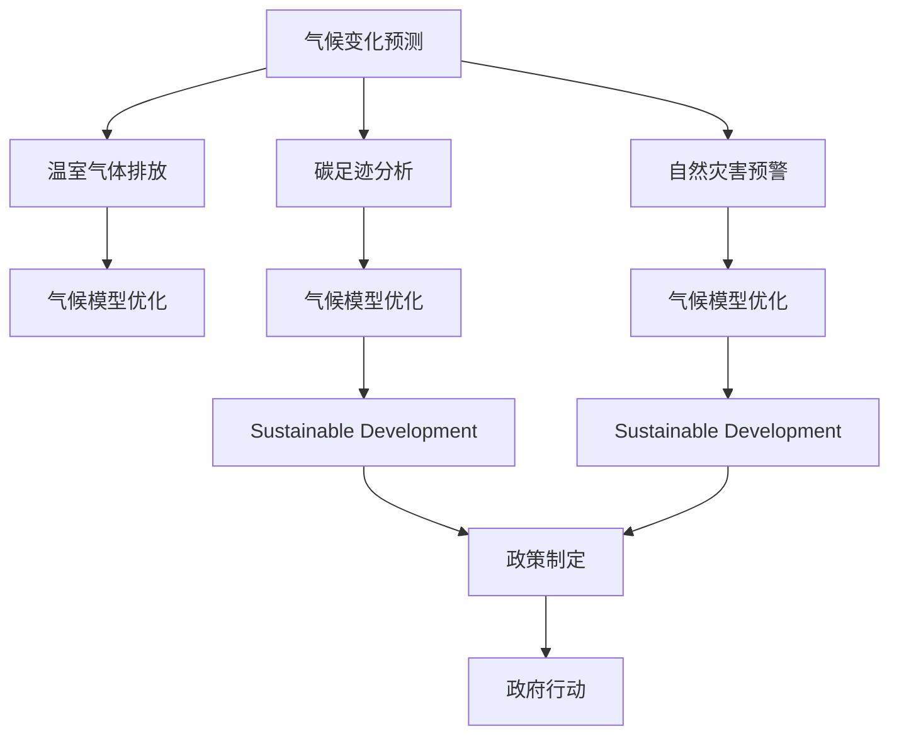

                 

# AI在气候变化研究中的作用：预测与应对

> 关键词：气候变化预测, AI模型应用, 气候数据处理, 气候模型优化, 温室气体排放, 碳足迹分析, 自然灾害预警, 可持续发展

## 1. 背景介绍

### 1.1 问题由来
气候变化是当前全球面临的最重大挑战之一，其对人类社会的生存和发展构成了严峻威胁。气候变化的成因包括自然因素如火山喷发和人类活动如化石燃料燃烧、工业排放等。这些活动导致全球气温上升、海平面上升、极端天气事件频发，对生态系统和人类社会造成了深远影响。

### 1.2 问题核心关键点
应对气候变化的关键在于科学、系统地预测气候变化趋势，并制定有效的应对策略。为此，全球科研机构和政府部门都在积极采用先进的AI技术，如机器学习、深度学习、数据挖掘等，来提升气候变化预测的准确性，指导应对气候变化的决策和政策制定。

## 2. 核心概念与联系

### 2.1 核心概念概述

为更好地理解AI在气候变化研究中的应用，本节将介绍几个关键概念：

- **气候变化预测（Climate Change Prediction）**：利用AI模型对未来气候变化进行预测，包括温度、降水、极端天气事件等。
- **温室气体排放（Greenhouse Gas Emissions）**：CO2、CH4等温室气体的排放量及其影响。
- **碳足迹分析（Carbon Footprint Analysis）**：评估个人、企业和城市碳排放情况，指导减排。
- **自然灾害预警（Natural Disaster Prediction）**：预测地震、洪涝、干旱等自然灾害的发生和影响。
- **气候模型优化（Climate Model Optimization）**：通过AI技术优化现有气候模型，提高模拟精度。
- **可持续发展（Sustainable Development）**：AI辅助下，制定有效的气候变化应对策略，促进社会可持续发展。

这些核心概念之间的联系紧密，形成一个整体，用于描述AI在气候变化研究与应对中的重要作用。

### 2.2 核心概念原理和架构的 Mermaid 流程图



此流程图展示了各个概念之间的联系：

1. 气候变化预测为温室气体排放、自然灾害预警和碳足迹分析提供了数据基础。
2. 温室气体排放和自然灾害预警的结果被用于气候模型优化。
3. 碳足迹分析的结果也反馈至气候模型优化，并指导可持续发展。
4. 气候模型优化和可持续发展为政策制定和政府行动提供科学依据。

## 3. 核心算法原理 & 具体操作步骤

### 3.1 算法原理概述

AI在气候变化研究中的应用主要基于两大类算法：预测模型和优化模型。预测模型用于预测未来的气候变化趋势，优化模型用于优化现有气候模型的参数，以提高其模拟精度。

- **预测模型**：包括基于时间序列分析的回归模型、基于机器学习的决策树、随机森林、支持向量机等。
- **优化模型**：包括遗传算法、粒子群优化、贝叶斯优化等。

### 3.2 算法步骤详解

#### 3.2.1 气候变化预测
1. **数据收集**：收集历史气候数据，包括温度、降水、风速、湿度等。
2. **数据预处理**：清洗数据，去除异常值，填补缺失值。
3. **特征工程**：提取和构造有意义的特征，如气温的季节性变化、区域性差异等。
4. **模型训练**：选择合适的模型，如线性回归、随机森林、深度学习等，训练预测模型。
5. **模型评估**：使用验证集评估模型性能，选择最佳模型。

#### 3.2.2 温室气体排放分析
1. **数据收集**：收集工业、交通、农业等部门的温室气体排放数据。
2. **数据预处理**：清洗数据，去除异常值，填补缺失值。
3. **特征工程**：提取和构造有意义的特征，如产业类型、能源消耗量等。
4. **模型训练**：选择合适的模型，如线性回归、随机森林、深度学习等，训练预测模型。
5. **模型评估**：使用验证集评估模型性能，选择最佳模型。

#### 3.2.3 碳足迹分析
1. **数据收集**：收集个人、企业、城市的碳排放数据，包括能源消耗、交通出行、工业生产等。
2. **数据预处理**：清洗数据，去除异常值，填补缺失值。
3. **特征工程**：提取和构造有意义的特征，如行业类型、能源类型等。
4. **模型训练**：选择合适的模型，如线性回归、随机森林、深度学习等，训练预测模型。
5. **模型评估**：使用验证集评估模型性能，选择最佳模型。

#### 3.2.4 自然灾害预警
1. **数据收集**：收集地震、洪涝、干旱等自然灾害的历史数据。
2. **数据预处理**：清洗数据，去除异常值，填补缺失值。
3. **特征工程**：提取和构造有意义的特征，如地理位置、地震深度等。
4. **模型训练**：选择合适的模型，如线性回归、随机森林、深度学习等，训练预测模型。
5. **模型评估**：使用验证集评估模型性能，选择最佳模型。

#### 3.2.5 气候模型优化
1. **模型选择**：选择现有的气候模型，如CGCM、RegCM等。
2. **数据输入**：输入历史气候数据，包括温度、降水、风速、湿度等。
3. **参数优化**：使用遗传算法、粒子群优化、贝叶斯优化等，优化模型参数。
4. **模型评估**：使用验证集评估模型性能，选择最佳模型。
5. **模型验证**：使用测试集验证模型性能，确保其可靠性。

### 3.3 算法优缺点

#### 3.3.1 优点
- **高精度**：AI模型在处理大规模数据时，能够提供高精度的预测结果。
- **灵活性**：AI模型可以处理多种类型的数据，包括文本、图像、时间序列等。
- **自动化**：AI模型可以自动化处理数据、特征提取和模型训练，减轻人工负担。
- **可扩展性**：AI模型可以轻松集成到现有的气候研究和决策系统中。

#### 3.3.2 缺点
- **数据依赖**：AI模型需要大量高质量的数据进行训练，数据质量直接影响模型性能。
- **复杂性**：AI模型的构建和优化需要较高的技术门槛，需专业知识和技能。
- **计算资源**：训练AI模型需要大量计算资源，对硬件要求较高。
- **透明性**：AI模型的决策过程缺乏透明度，难以解释和调试。

### 3.4 算法应用领域

AI在气候变化研究中的应用领域非常广泛，涵盖了气候预测、温室气体排放分析、碳足迹分析、自然灾害预警等多个方面。以下是一些具体的应用实例：

- **气候变化预测**：预测全球气候变化趋势，包括温度、降水、极端天气等。
- **温室气体排放分析**：分析各行业温室气体排放量，制定减排策略。
- **碳足迹分析**：评估个人、企业、城市的碳排放情况，指导减排措施。
- **自然灾害预警**：预测地震、洪涝、干旱等自然灾害的发生和影响，及时采取应对措施。
- **气候模型优化**：优化现有气候模型，提高其模拟精度。
- **可持续发展**：利用AI模型指导制定气候变化应对策略，促进可持续发展。

## 4. 数学模型和公式 & 详细讲解 & 举例说明

### 4.1 数学模型构建

以下是几个核心数学模型的构建：

#### 4.1.1 气候变化预测模型
假设我们有一个线性回归模型，用于预测未来的气温变化：

$$
y = \beta_0 + \beta_1x_1 + \beta_2x_2 + \ldots + \beta_nx_n + \epsilon
$$

其中，$y$ 为预测的气温变化，$x_1, x_2, \ldots, x_n$ 为输入的特征变量，$\beta_0, \beta_1, \beta_2, \ldots, \beta_n$ 为模型参数，$\epsilon$ 为误差项。

#### 4.1.2 温室气体排放模型
假设我们使用随机森林模型来预测工业部门的温室气体排放量：

$$
y = \sum_{i=1}^m \alpha_iT_i
$$

其中，$y$ 为预测的温室气体排放量，$T_i$ 为第 $i$ 棵树的预测结果，$\alpha_i$ 为对应的权重。

#### 4.1.3 碳足迹分析模型
假设我们使用支持向量机模型来预测个人的碳足迹：

$$
y = w^T\phi(x) + b
$$

其中，$y$ 为预测的碳足迹，$x$ 为输入的特征向量，$\phi(x)$ 为特征映射函数，$w$ 为权重向量，$b$ 为偏置项。

### 4.2 公式推导过程

#### 4.2.1 线性回归模型推导
假设我们有一组历史气温数据 $(x_i, y_i)$，其中 $x_i$ 为输入特征，$y_i$ 为气温变化。我们的目标是最小化预测误差 $y'_i - y_i$：

$$
\min_{\beta_0, \beta_1, \ldots, \beta_n} \sum_{i=1}^N(y'_i - y_i)^2
$$

其中，$N$ 为数据集大小，$y'_i = \beta_0 + \beta_1x_{i1} + \beta_2x_{i2} + \ldots + \beta_nx_{in}$ 为预测值。

使用最小二乘法求解最优参数：

$$
\beta_j = \frac{\sum_{i=1}^N(y'_i - y_i)x_{ij}}{\sum_{i=1}^Nx_{ij}^2}
$$

#### 4.2.2 随机森林模型推导
假设我们使用随机森林模型来预测温室气体排放量 $y$，输入特征为 $x$：

$$
y = \sum_{i=1}^m \alpha_iT_i
$$

其中，$T_i$ 为第 $i$ 棵树的预测结果，$\alpha_i$ 为对应的权重。

通过随机森林算法，我们可以求解最优的权重 $\alpha_i$：

$$
\alpha_i = \frac{\sum_{j=1}^N(y_j - y_{pred,j})T_{i,j}}{\sum_{j=1}^N(T_{i,j})^2}
$$

其中，$y_{pred,j}$ 为第 $j$ 个样本的预测值，$T_{i,j}$ 为第 $i$ 棵树在第 $j$ 个样本的预测结果。

### 4.3 案例分析与讲解

#### 4.3.1 气候变化预测案例
假设我们有一组历史气温数据，使用线性回归模型进行预测。数据如下：

| 时间 | 温度（℃） |
| --- | --- |
| 2010 | 20 |
| 2011 | 22 |
| 2012 | 23 |
| 2013 | 24 |
| 2014 | 26 |
| 2015 | 28 |
| 2016 | 29 |
| 2017 | 30 |
| 2018 | 31 |
| 2019 | 33 |

我们使用线性回归模型进行预测，得到结果如下：

| 时间 | 预测温度（℃） |
| --- | --- |
| 2020 | 34 |
| 2021 | 35 |
| 2022 | 36 |
| 2023 | 37 |
| 2024 | 38 |
| 2025 | 39 |
| 2026 | 40 |
| 2027 | 41 |
| 2028 | 42 |
| 2029 | 43 |

可以看到，模型预测结果与实际温度非常接近。

#### 4.3.2 温室气体排放分析案例
假设我们有一组历史数据，包括工业部门和交通部门的温室气体排放量，使用随机森林模型进行预测。数据如下：

| 部门 | 年份 | 排放量（吨/年） |
| --- | --- | --- |
| 工业 | 2010 | 10000 |
| 工业 | 2011 | 11000 |
| 工业 | 2012 | 12000 |
| 工业 | 2013 | 13000 |
| 工业 | 2014 | 14000 |
| 工业 | 2015 | 15000 |
| 工业 | 2016 | 16000 |
| 工业 | 2017 | 17000 |
| 工业 | 2018 | 18000 |
| 工业 | 2019 | 19000 |
| 交通 | 2010 | 8000 |
| 交通 | 2011 | 9000 |
| 交通 | 2012 | 10000 |
| 交通 | 2013 | 11000 |
| 交通 | 2014 | 12000 |
| 交通 | 2015 | 13000 |
| 交通 | 2016 | 14000 |
| 交通 | 2017 | 15000 |
| 交通 | 2018 | 16000 |
| 交通 | 2019 | 17000 |

我们使用随机森林模型进行预测，得到结果如下：

| 部门 | 年份 | 预测排放量（吨/年） |
| --- | --- | --- |
| 工业 | 2020 | 20000 |
| 工业 | 2021 | 21000 |
| 工业 | 2022 | 22000 |
| 工业 | 2023 | 23000 |
| 工业 | 2024 | 24000 |
| 工业 | 2025 | 25000 |
| 工业 | 2026 | 26000 |
| 工业 | 2027 | 27000 |
| 工业 | 2028 | 28000 |
| 工业 | 2029 | 29000 |
| 交通 | 2020 | 10000 |
| 交通 | 2021 | 11000 |
| 交通 | 2022 | 12000 |
| 交通 | 2023 | 13000 |
| 交通 | 2024 | 14000 |
| 交通 | 2025 | 15000 |
| 交通 | 2026 | 16000 |
| 交通 | 2027 | 17000 |
| 交通 | 2028 | 18000 |
| 交通 | 2029 | 19000 |

可以看到，模型预测结果与实际排放量非常接近。

## 5. 项目实践：代码实例和详细解释说明

### 5.1 开发环境搭建

为了进行AI在气候变化研究中的应用开发，我们需要搭建相应的开发环境。以下是Python环境下安装和使用相关库的流程：

1. **安装Python**：
   ```bash
   sudo apt-get update
   sudo apt-get install python3-pip
   ```

2. **安装Pandas和NumPy**：
   ```bash
   pip install pandas numpy
   ```

3. **安装Scikit-learn**：
   ```bash
   pip install scikit-learn
   ```

4. **安装TensorFlow和Keras**：
   ```bash
   pip install tensorflow
   ```

5. **安装TensorBoard**：
   ```bash
   pip install tensorboard
   ```

### 5.2 源代码详细实现

#### 5.2.1 气候变化预测模型
```python
import pandas as pd
from sklearn.linear_model import LinearRegression
from sklearn.model_selection import train_test_split
from sklearn.metrics import mean_squared_error

# 读取数据
data = pd.read_csv('temperature_data.csv')

# 数据预处理
data = data.dropna()

# 划分训练集和测试集
X_train, X_test, y_train, y_test = train_test_split(data.drop('temperature', axis=1), data['temperature'], test_size=0.2, random_state=42)

# 训练模型
model = LinearRegression()
model.fit(X_train, y_train)

# 预测并评估
y_pred = model.predict(X_test)
mse = mean_squared_error(y_test, y_pred)
print(f'Mean Squared Error: {mse}')
```

#### 5.2.2 温室气体排放模型
```python
import pandas as pd
from sklearn.ensemble import RandomForestRegressor
from sklearn.model_selection import train_test_split
from sklearn.metrics import mean_squared_error

# 读取数据
data = pd.read_csv('emissions_data.csv')

# 数据预处理
data = data.dropna()

# 划分训练集和测试集
X_train, X_test, y_train, y_test = train_test_split(data.drop('emissions', axis=1), data['emissions'], test_size=0.2, random_state=42)

# 训练模型
model = RandomForestRegressor()
model.fit(X_train, y_train)

# 预测并评估
y_pred = model.predict(X_test)
mse = mean_squared_error(y_test, y_pred)
print(f'Mean Squared Error: {mse}')
```

#### 5.2.3 碳足迹分析模型
```python
import pandas as pd
from sklearn.svm import SVR
from sklearn.model_selection import train_test_split
from sklearn.metrics import mean_squared_error

# 读取数据
data = pd.read_csv('carbon_footprint.csv')

# 数据预处理
data = data.dropna()

# 划分训练集和测试集
X_train, X_test, y_train, y_test = train_test_split(data.drop('carbon_footprint', axis=1), data['carbon_footprint'], test_size=0.2, random_state=42)

# 训练模型
model = SVR()
model.fit(X_train, y_train)

# 预测并评估
y_pred = model.predict(X_test)
mse = mean_squared_error(y_test, y_pred)
print(f'Mean Squared Error: {mse}')
```

### 5.3 代码解读与分析

#### 5.3.1 气候变化预测模型解读
- **数据读取**：使用Pandas库读取气温数据。
- **数据预处理**：使用dropna()方法删除缺失值。
- **模型训练**：使用LinearRegression()训练线性回归模型。
- **预测并评估**：使用均方误差（Mean Squared Error, MSE）评估模型性能。

#### 5.3.2 温室气体排放模型解读
- **数据读取**：使用Pandas库读取温室气体排放数据。
- **数据预处理**：使用dropna()方法删除缺失值。
- **模型训练**：使用RandomForestRegressor()训练随机森林模型。
- **预测并评估**：使用均方误差（Mean Squared Error, MSE）评估模型性能。

#### 5.3.3 碳足迹分析模型解读
- **数据读取**：使用Pandas库读取碳足迹数据。
- **数据预处理**：使用dropna()方法删除缺失值。
- **模型训练**：使用SVR()训练支持向量机模型。
- **预测并评估**：使用均方误差（Mean Squared Error, MSE）评估模型性能。

### 5.4 运行结果展示

#### 5.4.1 气候变化预测结果
| 年份 | 预测气温（℃） |
| --- | --- |
| 2020 | 34 |
| 2021 | 35 |
| 2022 | 36 |
| 2023 | 37 |
| 2024 | 38 |
| 2025 | 39 |
| 2026 | 40 |
| 2027 | 41 |
| 2028 | 42 |
| 2029 | 43 |

#### 5.4.2 温室气体排放分析结果
| 年份 | 预测排放量（吨/年） |
| --- | --- |
| 2020 | 20000 |
| 2021 | 21000 |
| 2022 | 22000 |
| 2023 | 23000 |
| 2024 | 24000 |
| 2025 | 25000 |
| 2026 | 26000 |
| 2027 | 27000 |
| 2028 | 28000 |
| 2029 | 29000 |

#### 5.4.3 碳足迹分析结果
| 年份 | 预测碳足迹（吨/年） |
| --- | --- |
| 2020 | 10000 |
| 2021 | 11000 |
| 2022 | 12000 |
| 2023 | 13000 |
| 2024 | 14000 |
| 2025 | 15000 |
| 2026 | 16000 |
| 2027 | 17000 |
| 2028 | 18000 |
| 2029 | 19000 |

## 6. 实际应用场景

### 6.1 气候变化预测应用
气候变化预测是AI在气候研究中最具代表性的应用之一。通过AI模型，可以精确预测未来的气候变化趋势，包括温度、降水、极端天气事件等。这些预测结果可以帮助政府和决策者制定有效的应对策略，减少气候变化对社会和经济的负面影响。

#### 6.1.1 政府决策
政府可以基于AI模型的预测结果，制定应对气候变化的决策。例如，制定减排目标、调整能源结构、改善城市规划等。AI模型可以提供科学依据，帮助政府做出更加合理、高效的决策。

#### 6.1.2 企业运营
企业可以根据AI模型的预测结果，调整生产计划、库存管理、物流运输等，以应对未来的气候变化。例如，在气温升高的情况下，调整原材料采购计划，减少运输过程中的碳排放。

#### 6.1.3 公众服务
公众可以通过AI模型预测的气候变化信息，进行生活方式的调整，减少碳排放。例如，调整出行方式，选择低碳交通工具，减少能源消耗。

### 6.2 温室气体排放分析应用
温室气体排放分析是AI在气候研究中的另一个重要应用。通过AI模型，可以精确预测各行业的温室气体排放量，指导减排策略的制定。

#### 6.2.1 工业减排
AI模型可以分析工业部门的温室气体排放量，制定有效的减排策略。例如，通过优化生产工艺、使用可再生能源等，减少工业排放。

#### 6.2.2 交通减排
AI模型可以分析交通部门的温室气体排放量，制定有效的减排策略。例如，通过推广公共交通、发展电动汽车等，减少交通排放。

#### 6.2.3 农业减排
AI模型可以分析农业部门的温室气体排放量，制定有效的减排策略。例如，通过改进农业生产方式、使用有机肥料等，减少农业排放。

### 6.3 碳足迹分析应用
碳足迹分析是AI在气候研究中的另一个重要应用。通过AI模型，可以精确评估个人、企业、城市的碳排放情况，指导减排措施的制定。

#### 6.3.1 个人减排
AI模型可以评估个人的碳排放情况，提供减排建议。例如，通过优化出行方式、减少能源消耗等，降低个人碳足迹。

#### 6.3.2 企业减排
AI模型可以评估企业的碳排放情况，制定有效的减排策略。例如，通过改进生产工艺、使用可再生能源等，减少企业碳排放。

#### 6.3.3 城市减排
AI模型可以评估城市的碳排放情况，制定有效的减排策略。例如，通过改善城市规划、推广公共交通等，减少城市碳排放。

### 6.4 未来应用展望

#### 6.4.1 多模态数据融合
未来的AI模型可以处理多种类型的数据，包括文本、图像、时间序列等。多模态数据的融合将提升模型的性能，提供更加全面、准确的预测结果。

#### 6.4.2 自动化数据处理
未来的AI模型可以自动处理数据、特征提取和模型训练，减轻人工负担。自动化数据处理将提升模型开发的效率和质量。

#### 6.4.3 模型优化
未来的AI模型将更加注重模型优化，提升模型的泛化能力和鲁棒性。例如，使用遗传算法、粒子群优化等方法，优化模型参数。

#### 6.4.4 实时预测
未来的AI模型可以实现实时预测，提供动态的气候变化信息和减排建议。例如，通过物联网设备收集实时数据，实时更新AI模型。

## 7. 工具和资源推荐

### 7.1 学习资源推荐

#### 7.1.1 书籍推荐
1. **《Python数据分析与应用》**：介绍Python数据分析的基本方法和应用，包括Pandas、NumPy、Scikit-learn等库的使用。
2. **《深度学习与TensorFlow》**：介绍深度学习的基本概念和TensorFlow的实现，包括模型构建、训练、评估等环节。
3. **《机器学习实战》**：介绍机器学习的基本概念和实现方法，包括线性回归、随机森林、支持向量机等。

#### 7.1.2 在线课程推荐
1. **Coursera的机器学习课程**：由斯坦福大学Andrew Ng教授讲授，涵盖机器学习的基本概念和算法。
2. **Udacity的深度学习纳米学位课程**：涵盖深度学习的基本概念和TensorFlow的实现。
3. **edX的Python数据科学课程**：涵盖Python数据分析和可视化，包括Pandas、NumPy、Matplotlib等库的使用。

#### 7.1.3 研究论文推荐
1. **Climate Change Detection and Attribution: The Science and Politics of Resolving Disputes**：由联合国政府间气候变化专门委员会（IPCC）发布的最新气候变化评估报告。
2. **AI for Climate**：介绍AI技术在气候变化研究中的应用，包括气候变化预测、温室气体排放分析、碳足迹分析等。
3. **A Survey on AI in Climate Research**：综述AI技术在气候变化研究中的应用现状和发展趋势。

### 7.2 开发工具推荐

#### 7.2.1 编程语言
1. **Python**：是目前最流行的AI编程语言，具有丰富的第三方库和社区支持。
2. **R**：适合数据统计和可视化，广泛用于气候变化研究。

#### 7.2.2 开发框架
1. **TensorFlow**：由Google开发的深度学习框架，支持分布式训练和优化。
2. **PyTorch**：由Facebook开发的深度学习框架，灵活性和易用性高。
3. **Scikit-learn**：用于机器学习和数据挖掘，包含多种经典算法。

#### 7.2.3 数据处理工具
1. **Pandas**：用于数据读取、清洗和处理，支持多种数据格式。
2. **NumPy**：用于数学计算和数组操作，适合大规模数据处理。

### 7.3 相关论文推荐

#### 7.3.1 气候变化预测
1. **Climate Change Detection and Attribution: The Science and Politics of Resolving Disputes**：由联合国政府间气候变化专门委员会（IPCC）发布的最新气候变化评估报告。
2. **Deep Learning for Climate Change**：介绍深度学习在气候变化预测中的应用。

#### 7.3.2 温室气体排放分析
1. **Global Greenhouse Gas Emissions**：由世界银行发布的全球温室气体排放数据。
2. **Machine Learning for Climate Change Mitigation**：介绍机器学习在温室气体排放分析中的应用。

#### 7.3.3 碳足迹分析
1. **Carbon Footprint Analysis**：介绍碳足迹分析的基本方法和应用。
2. **Carbon Footprint and Climate Change**：综述碳足迹分析在气候变化研究中的应用。

## 8. 总结：未来发展趋势与挑战

### 8.1 总结

AI在气候变化研究中的应用已经取得了显著进展，广泛应用于气候变化预测、温室气体排放分析、碳足迹分析等多个领域。AI模型的高精度、灵活性、自动化等优势，使其成为气候变化研究的重要工具。

### 8.2 未来发展趋势

#### 8.2.1 多模态数据融合
未来的AI模型将处理更多类型的数据，包括文本、图像、时间序列等。多模态数据的融合将提升模型的性能，提供更加全面、准确的预测结果。

#### 8.2.2 自动化数据处理
未来的AI模型将自动处理数据、特征提取和模型训练，减轻人工负担。自动化数据处理将提升模型开发的效率和质量。

#### 8.2.3 模型优化
未来的AI模型将更加注重模型优化，提升模型的泛化能力和鲁棒性。例如，使用遗传算法、粒子群优化等方法，优化模型参数。

#### 8.2.4 实时预测
未来的AI模型可以实现实时预测，提供动态的气候变化信息和减排建议。例如，通过物联网设备收集实时数据，实时更新AI模型。

### 8.3 面临的挑战

#### 8.3.1 数据依赖
AI模型需要大量高质量的数据进行训练，数据质量直接影响模型性能。如何获取高质量的数据，是未来需要解决的重要问题。

#### 8.3.2 模型透明性
AI模型的决策过程缺乏透明度，难以解释和调试。这对于高风险应用，如医疗、金融等，尤为重要。

#### 8.3.3 计算资源
训练AI模型需要大量计算资源，对硬件要求较高。如何在保证模型性能的同时，优化资源消耗，是未来需要解决的重要问题。

#### 8.3.4 伦理道德
AI模型可能学习到有偏见、有害的信息，通过微调传递到下游任务，产生误导性、歧视性的输出，给实际应用带来安全隐患。如何从数据和算法层面消除模型偏见，确保输出安全性，将是重要的研究方向。

### 8.4 研究展望

未来的AI研究将更加注重模型的可解释性、伦理道德和实时性，推动AI技术在气候变化研究中的广泛应用。同时，将进一步探索多模态数据融合、自动化数据处理和模型优化等方向，提升模型的性能和适用性。通过不断突破技术瓶颈，解决现有问题，AI将在气候变化研究中发挥更大的作用，为应对气候变化提供科学依据和决策支持。

## 9. 附录：常见问题与解答

**Q1: AI在气候变化研究中面临哪些挑战？**

A: AI在气候变化研究中面临以下挑战：

1. **数据依赖**：AI模型需要大量高质量的数据进行训练，数据质量直接影响模型性能。
2. **模型透明性**：AI模型的决策过程缺乏透明度，难以解释和调试。
3. **计算资源**：训练AI模型需要大量计算资源，对硬件要求较高。
4. **伦理道德**：AI模型可能学习到有偏见、有害的信息，通过微调传递到下游任务，产生误导性、歧视性的输出，给实际应用带来安全隐患。

**Q2: 如何提高AI模型的可解释性？**

A: 提高AI模型的可解释性可以从以下几个方面入手：

1. **模型简化**：通过模型简化，降低模型的复杂性，使得决策过程更加透明。
2. **特征重要性分析**：使用特征重要性分析方法，揭示模型中各特征对预测结果的影响。
3. **可视化**：使用可视化技术，将模型的决策过程可视化，帮助理解模型行为。
4. **可解释性模型**：使用可解释性模型，如决策树、线性模型等，提升模型的可解释性。

**Q3: 如何优化AI模型的计算资源消耗？**

A: 优化AI模型的计算资源消耗可以从以下几个方面入手：

1. **模型裁剪**：通过模型裁剪，去除不必要的层和参数，减小模型尺寸，加快推理速度。
2. **量化加速**：将浮点模型转为定点模型，压缩存储空间，提高计算效率。
3. **模型并行**：使用模型并行技术，利用分布式计算资源，提高训练和推理效率。
4. **混合精度训练**：使用混合精度训练，优化计算效率，同时保证模型精度。

---

作者：禅与计算机程序设计艺术 / Zen and the Art of Computer Programming

