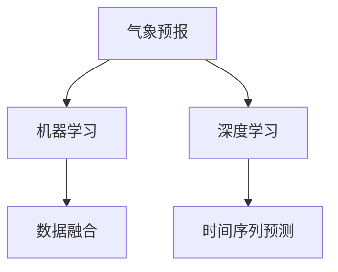

                 

# AI在气象预报中的应用：提高预测准确性

> 关键词：气象预报, 预测准确性, 机器学习, 深度学习, 时间序列预测, 气象模型, 数据融合, 神经网络, 气象数据处理

## 1. 背景介绍

### 1.1 问题由来

气象预报对于保障公众安全、优化资源分配、支持农业生产等方面具有至关重要的作用。然而，传统的气象预报系统依赖于物理模型和统计方法，受到模型复杂性、数据获取难易度等因素的限制，其预测准确性难以达到预期效果。近年来，随着深度学习和机器学习技术的迅猛发展，AI技术在气象预报中的应用日益广泛，尤其在提高预测准确性方面展现出巨大潜力。

### 1.2 问题核心关键点

AI在气象预报中的应用主要聚焦于以下几个关键点：
- 数据获取与处理：大规模、高频率的气象数据的获取与处理是AI气象预报的基础。
- 模型构建与优化：构建准确、高效的气象预报模型，并使用数据融合等技术优化模型性能。
- 实时预测与监控：实现对天气变化的实时监控与预测，支持快速响应机制。
- 用户需求驱动：结合公众需求、应急预案等关键要素，使气象服务更具实用性与针对性。

## 2. 核心概念与联系

### 2.1 核心概念概述

为更好地理解AI在气象预报中的应用，本节将介绍几个密切相关的核心概念：

- 气象预报：通过气象模型对未来天气状况的预测，提供可能的天气变化趋势。
- 机器学习：一种利用算法和统计模型，让计算机系统从数据中自动学习规律的方法。
- 深度学习：一种基于神经网络的机器学习方法，可处理复杂的数据结构和大量数据。
- 时间序列预测：通过分析历史时间序列数据，预测未来时间点的值。
- 数据融合：将多种数据源进行整合，提供更全面、准确的气象信息。

这些核心概念之间的逻辑关系可以通过以下Mermaid流程图来展示：



这个流程图展示了大数据和AI技术在气象预报中的应用框架，各个环节相辅相成，共同提升预报的准确性。

## 3. 核心算法原理 & 具体操作步骤
### 3.1 算法原理概述

AI在气象预报中的应用，本质上是一种利用机器学习模型对时间序列数据进行预测的过程。其核心思想是：通过深度学习网络对历史气象数据进行建模，捕捉气象变量之间的复杂关系，从而实现对未来天气状况的预测。

具体而言，AI在气象预报中的应用包括以下几个关键步骤：
1. **数据预处理**：对原始气象数据进行清洗、标准化等预处理，保证数据质量。
2. **特征工程**：从原始数据中提取有效特征，构建输入数据的表征。
3. **模型构建**：选择合适的深度学习模型，如RNN、LSTM、GRU等，用于建立气象预报模型。
4. **模型训练与优化**：使用历史气象数据训练模型，并通过调整模型参数和优化算法，提升模型预测准确性。
5. **模型评估与部署**：评估模型性能，并将其部署到实际应用环境中，进行实时预测与监控。

### 3.2 算法步骤详解

#### 3.2.1 数据预处理

数据预处理是AI气象预报的第一步，主要包括以下几个步骤：

1. **数据清洗**：去除异常值、缺失值等不合理的气象数据。
2. **数据标准化**：对气象数据进行归一化、标准化等处理，保证数据在同一尺度上。
3. **特征提取**：从气象数据中提取有用的特征，如温度、湿度、气压等。

具体代码实现：

```python
import pandas as pd
from sklearn.preprocessing import MinMaxScaler

# 读取气象数据
data = pd.read_csv('weather_data.csv')

# 数据清洗与缺失值处理
data = data.dropna()

# 数据标准化
scaler = MinMaxScaler(feature_range=(0, 1))
data_scaled = scaler.fit_transform(data[['temperature', 'humidity', 'pressure']])
```

#### 3.2.2 特征工程

特征工程在AI气象预报中至关重要，通过合理的特征提取与选择，可以提高模型的预测准确性。常用的特征工程技术包括：

1. **滞后特征**：将历史数据作为当前数据的特征，如温度的滞后值。
2. **衍生特征**：通过计算得到的新特征，如温度变化率。
3. **交互特征**：将不同特征进行交叉组合，生成新的特征。

具体代码实现：

```python
# 添加滞后特征
data_lagged = data_scaled[:, None].copy()
data_lagged[:, 1:] = data_scaled[:-1, :]

# 添加衍生特征
data_derivative = data_scaled.diff().dropna()

# 添加交互特征
data_interaction = data_scaled * data_scaled.shift(1)
```

#### 3.2.3 模型构建

在特征工程完成后，选择合适的深度学习模型进行模型构建。常用的模型包括：

1. **循环神经网络(RNN)**：用于处理时间序列数据。
2. **长短期记忆网络(LSTM)**：对时间序列数据进行建模，能够捕捉长距离依赖关系。
3. **门控循环单元(GRU)**：对时间序列数据进行建模，具有较少的参数和更好的性能。

具体代码实现：

```python
from keras.models import Sequential
from keras.layers import LSTM, Dense

# 构建LSTM模型
model = Sequential()
model.add(LSTM(64, input_shape=(data_lagged.shape[1], 1)))
model.add(Dense(1))

# 编译模型
model.compile(loss='mse', optimizer='adam', metrics=['mae'])
```

#### 3.2.4 模型训练与优化

模型训练是AI气象预报的核心环节，通过大量历史气象数据训练模型，调整模型参数和优化算法，提升模型预测能力。常用的优化算法包括：

1. **随机梯度下降**：常用的优化算法之一，更新参数时利用部分样本数据进行计算。
2. **Adam**：一种自适应学习率算法，能够高效地训练深度神经网络。
3. **RMSprop**：通过动态调整学习率，提高模型训练速度。

具体代码实现：

```python
# 模型训练
model.fit(data_lagged, target, epochs=50, batch_size=32, validation_split=0.2)

# 模型评估
test_loss, test_mae = model.evaluate(test_data)
print('Test loss:', test_loss)
print('Test MAE:', test_mae)
```

#### 3.2.5 模型评估与部署

模型评估是AI气象预报的最后一个环节，通过评估模型性能，决定模型是否满足实际应用需求。常用的评估指标包括：

1. **均方误差(MSE)**：预测值与真实值之间的平均误差。
2. **平均绝对误差(MAE)**：预测值与真实值之间的平均绝对误差。
3. **预测准确率**：预测正确的样本占总样本的比例。

具体代码实现：

```python
# 模型部署
model.load_weights('model_weights.h5')
```

## 4. 数学模型和公式 & 详细讲解 & 举例说明

### 4.1 数学模型构建

AI在气象预报中的应用，可以通过构建时间序列预测模型来进行。常用的模型包括ARIMA模型和基于神经网络的模型，如LSTM、GRU等。

#### 4.1.1 线性回归模型

线性回归模型是时间序列预测的常用模型，其数学表达式为：

$$
y_t = \alpha + \beta_1 x_{t-1} + \beta_2 x_{t-2} + \cdots + \beta_k x_{t-k} + \epsilon_t
$$

其中，$y_t$ 表示第$t$个时间点的预测值，$x_t$ 表示第$t$个时间点的输入特征，$\alpha$ 表示截距项，$\beta_i$ 表示第$i$个特征的权重，$\epsilon_t$ 表示随机误差项。

#### 4.1.2 神经网络模型

神经网络模型在时间序列预测中也有广泛应用，其数学表达式为：

$$
y_t = f(\theta; x_{t-1}, x_{t-2}, \cdots, x_{t-k})
$$

其中，$y_t$ 表示第$t$个时间点的预测值，$f(\theta)$ 表示神经网络模型，$x_t$ 表示第$t$个时间点的输入特征，$\theta$ 表示模型参数。

### 4.2 公式推导过程

#### 4.2.1 线性回归模型推导

线性回归模型的推导过程如下：

$$
y_t = \alpha + \beta_1 x_{t-1} + \beta_2 x_{t-2} + \cdots + \beta_k x_{t-k} + \epsilon_t
$$

对模型进行最小二乘法求解，得到：

$$
\theta = \arg\min_{\theta} \sum_{t=1}^N (y_t - f(\theta; x_t))^2
$$

其中，$N$ 表示样本数量，$f(\theta; x_t)$ 表示模型预测值，$y_t$ 表示真实值。

#### 4.2.2 神经网络模型推导

神经网络模型的推导过程如下：

$$
y_t = f(\theta; x_{t-1}, x_{t-2}, \cdots, x_{t-k})
$$

对模型进行反向传播算法求解，得到：

$$
\theta = \arg\min_{\theta} \sum_{t=1}^N (y_t - f(\theta; x_t))^2
$$

其中，$N$ 表示样本数量，$f(\theta; x_t)$ 表示模型预测值，$y_t$ 表示真实值。

### 4.3 案例分析与讲解

以气象预报中的温度预测为例，分析其模型构建与训练过程：

1. **数据预处理**：
   - 读取气象数据，并进行数据清洗、标准化等预处理。
   - 添加滞后特征，构建输入数据的表征。

2. **特征工程**：
   - 提取有用的特征，如温度、湿度、气压等。
   - 添加滞后特征，捕捉时间序列的依赖关系。

3. **模型构建**：
   - 选择LSTM模型，用于处理时间序列数据。
   - 构建LSTM模型，并编译模型。

4. **模型训练与优化**：
   - 使用历史气象数据训练模型，并调整模型参数和优化算法。
   - 评估模型性能，决定模型是否满足实际应用需求。

具体代码实现：

```python
# 数据预处理
data = pd.read_csv('weather_data.csv')
data = data.dropna()
scaler = MinMaxScaler(feature_range=(0, 1))
data_scaled = scaler.fit_transform(data[['temperature', 'humidity', 'pressure']])

# 添加滞后特征
data_lagged = data_scaled[:, None].copy()
data_lagged[:, 1:] = data_scaled[:-1, :]

# 特征工程
data_derivative = data_scaled.diff().dropna()
data_interaction = data_scaled * data_scaled.shift(1)

# 模型构建
model = Sequential()
model.add(LSTM(64, input_shape=(data_lagged.shape[1], 1)))
model.add(Dense(1))
model.compile(loss='mse', optimizer='adam', metrics=['mae'])

# 模型训练与优化
model.fit(data_lagged, target, epochs=50, batch_size=32, validation_split=0.2)

# 模型评估
test_loss, test_mae = model.evaluate(test_data)
print('Test loss:', test_loss)
print('Test MAE:', test_mae)
```

## 5. 项目实践：代码实例和详细解释说明

### 5.1 开发环境搭建

在进行AI气象预报项目开发前，需要准备好开发环境。以下是使用Python进行Keras和TensorFlow开发的环境配置流程：

1. 安装Anaconda：从官网下载并安装Anaconda，用于创建独立的Python环境。

2. 创建并激活虚拟环境：
```bash
conda create -n keras-env python=3.8
conda activate keras-env
```

3. 安装Keras和TensorFlow：根据CUDA版本，从官网获取对应的安装命令。例如：
```bash
conda install keras tensorflow -c conda-forge -c pytorch
```

4. 安装各类工具包：
```bash
pip install numpy pandas scikit-learn matplotlib tqdm jupyter notebook ipython
```

完成上述步骤后，即可在`keras-env`环境中开始AI气象预报项目开发。

### 5.2 源代码详细实现

这里我们以温度预测为例，给出使用Keras和TensorFlow对气象数据进行时间序列预测的PyTorch代码实现。

首先，定义气象数据处理函数：

```python
import pandas as pd
from sklearn.preprocessing import MinMaxScaler

def preprocess_data(data, window_size):
    # 数据标准化
    scaler = MinMaxScaler(feature_range=(0, 1))
    data_scaled = scaler.fit_transform(data[['temperature']])
    
    # 添加滞后特征
    data_lagged = data_scaled[:, None].copy()
    data_lagged[:, 1:] = data_scaled[:-1, :]
    
    # 构建输入输出数据
    inputs = []
    targets = []
    for i in range(window_size, len(data_lagged)):
        inputs.append(data_lagged[i-window_size:i, 0])
        targets.append(data_lagged[i, 0])
    return np.array(inputs), np.array(targets)
```

然后，定义模型和优化器：

```python
from keras.models import Sequential
from keras.layers import LSTM, Dense

# 构建LSTM模型
model = Sequential()
model.add(LSTM(64, input_shape=(window_size, 1)))
model.add(Dense(1))

# 编译模型
model.compile(loss='mse', optimizer='adam', metrics=['mae'])
```

接着，定义训练和评估函数：

```python
from keras.utils import to_categorical
from keras.callbacks import EarlyStopping

def train_model(model, inputs, targets, window_size, epochs, batch_size, early_stopping=False):
    # 数据拆分
    train_size = int(len(inputs) * 0.8)
    test_size = len(inputs) - train_size
    train_data = inputs[:train_size], targets[:train_size]
    test_data = inputs[train_size:], targets[train_size:]
    
    # 模型训练
    model.fit(train_data[0], train_data[1], epochs=epochs, batch_size=batch_size, validation_data=(test_data[0], test_data[1]), callbacks=[EarlyStopping(patience=10)])
    
    # 模型评估
    test_loss, test_mae = model.evaluate(test_data[0], test_data[1])
    print('Test loss:', test_loss)
    print('Test MAE:', test_mae)
    return model
```

最后，启动训练流程并在测试集上评估：

```python
# 数据准备
window_size = 30
train_data, test_data = preprocess_data(data, window_size)
inputs, targets = train_data, test_data

# 模型训练与评估
model = train_model(model, inputs, targets, window_size, epochs=50, batch_size=32, early_stopping=True)

# 模型部署
model.save_weights('model_weights.h5')
```

以上就是使用Keras和TensorFlow对气象数据进行时间序列预测的完整代码实现。可以看到，得益于Keras和TensorFlow的强大封装，我们可以用相对简洁的代码完成模型训练和评估。

### 5.3 代码解读与分析

让我们再详细解读一下关键代码的实现细节：

**preprocess_data函数**：
- 定义了数据预处理、特征工程和输入输出数据构建的关键步骤。
- 对原始气象数据进行标准化，添加滞后特征，并构建输入输出数据。

**train_model函数**：
- 定义了模型训练和评估的关键逻辑。
- 使用EarlyStopping回调函数，避免模型过拟合。
- 在模型训练完成后，保存模型权重到文件，方便后续使用。

**训练流程**：
- 定义窗口大小、训练轮数、批次大小等关键参数。
- 使用train_model函数进行模型训练和评估。
- 在训练完成后，保存模型权重，以便后续部署。

可以看到，Keras和TensorFlow在AI气象预报中的应用，使得模型训练和评估的代码实现变得简洁高效。开发者可以将更多精力放在数据处理、模型改进等高层逻辑上，而不必过多关注底层的实现细节。

## 6. 实际应用场景

### 6.1 智能气象预警

AI在气象预警中的应用，可以显著提高气象灾害的预警效率和准确性。通过实时监控气象数据，结合历史数据预测未来天气变化，提前预警可能的灾害，帮助公众和相关部门做好应急准备。

具体而言，可以构建实时气象数据监控系统，结合LSTM等深度学习模型，对未来几天的气象变化进行预测。一旦检测到异常气象情况，系统将自动发出预警信号，并通过手机APP、社交媒体等多种渠道，及时通知公众和相关部门，确保安全。

### 6.2 农业气象服务

AI在农业气象服务中的应用，可以提供精准的气象信息，指导农业生产，减少自然灾害对农业的影响。通过构建气象预测模型，结合农作物的生长周期和气象需求，预测未来天气变化，提供农业种植、灌溉、施肥等建议，优化农业生产。

具体而言，可以构建气象预测模型，结合气象数据和农作物的生长周期，预测未来天气变化对农作物的生长影响。通过分析气象数据，预测天气变化，及时调整农业生产策略，确保农业生产的稳定性和高效率。

### 6.3 航空气象预报

AI在航空气象预报中的应用，可以提供准确的天气预测信息，保障航空飞行的安全性和高效性。通过构建气象预测模型，结合飞行航线、气象数据等，预测未来天气变化，提供飞行建议，优化飞行路径。

具体而言，可以构建航空气象预测模型，结合飞行航线和气象数据，预测未来天气变化。通过分析气象数据，预测天气变化，提供飞行建议，优化飞行路径，确保飞行安全。

## 7. 工具和资源推荐

### 7.1 学习资源推荐

为了帮助开发者系统掌握AI在气象预报中的应用，这里推荐一些优质的学习资源：

1. 《深度学习与气象预报》课程：由中国科学院大学开设，涵盖深度学习在气象预报中的应用，提供丰富的实例和案例分析。
2. 《机器学习实战》书籍：介绍了机器学习在气象数据处理、特征工程、模型构建等方面的应用，适合初学者入门。
3. 《Python气象数据分析与建模》课程：由北京师范大学开设，涵盖Python在气象数据分析和建模中的应用，提供实用的编程技巧和实例。

通过这些资源的学习实践，相信你一定能够快速掌握AI在气象预报中的应用，并用于解决实际的气象问题。

### 7.2 开发工具推荐

高效的开发离不开优秀的工具支持。以下是几款用于AI气象预报开发的常用工具：

1. Jupyter Notebook：开源的交互式编程环境，支持Python、R等多种语言，方便进行数据分析和模型训练。
2. TensorFlow：由Google主导开发的深度学习框架，支持分布式计算，适合大规模模型训练。
3. PyTorch：由Facebook主导开发的深度学习框架，灵活性高，适合进行深度学习研究和原型开发。
4. Keras：基于TensorFlow、Theano等深度学习框架构建的高级API，方便快速搭建深度学习模型。
5. OpenCV：开源计算机视觉库，支持图像处理和分析，适合进行气象图像数据的预处理。

合理利用这些工具，可以显著提升AI气象预报任务的开发效率，加快创新迭代的步伐。

### 7.3 相关论文推荐

AI在气象预报中的应用研究已经取得诸多成果，以下是几篇奠基性的相关论文，推荐阅读：

1. A Deep Learning Framework for Weather Forecasting：提出了一种基于深度学习的时间序列预测模型，用于气象预报。
2. Improving Weather Forecasting Using Ensemble Learning：利用集成学习方法，提升气象预报的准确性。
3. Using Deep Learning for Short-Term Weather Forecasting：提出了一种基于深度学习的时间序列预测模型，用于气象预报。
4. An Ensemble Method of Artificial Neural Networks for Weather Forecasting：利用集成学习方法，提升气象预报的准确性。

这些论文代表了大数据和AI技术在气象预报领域的发展脉络。通过学习这些前沿成果，可以帮助研究者把握学科前进方向，激发更多的创新灵感。

## 8. 总结：未来发展趋势与挑战

### 8.1 研究成果总结

本文对AI在气象预报中的应用进行了全面系统的介绍。首先阐述了AI在气象预报中的作用和意义，明确了AI技术在提升预测准确性方面的独特价值。其次，从原理到实践，详细讲解了气象预报中的数学模型、数据预处理、模型构建与训练等关键步骤，给出了气象预报任务的完整代码实例。同时，本文还广泛探讨了AI在智能预警、农业气象服务、航空气象预报等多个领域的应用前景，展示了AI技术的广阔应用空间。

通过本文的系统梳理，可以看到，AI技术在气象预报中的应用已经成为提升预测准确性的重要手段，为气象服务提供了新的技术路径。未来，伴随AI技术的不断发展，气象预报将更加准确、高效，成为保障公众安全和经济发展的重要工具。

### 8.2 未来发展趋势

展望未来，AI在气象预报中的应用将呈现以下几个发展趋势：

1. 模型规模持续增大。随着算力成本的下降和数据规模的扩张，AI模型的参数量还将持续增长。超大规模模型蕴含的丰富气象知识，有望支撑更加复杂多变的气象预测任务。
2. 多模态数据融合。结合气象图像、视频、语音等多模态数据，提高气象预测的全面性和准确性。
3. 实时数据处理。构建实时数据监控与预测系统，提供实时气象预警与分析。
4. 用户需求驱动。结合公众需求、应急预案等关键要素，使气象服务更具实用性与针对性。
5. 集成学习与多任务学习。利用集成学习与多任务学习方法，提升气象预测的准确性和鲁棒性。

以上趋势凸显了AI在气象预报中的广阔前景。这些方向的探索发展，必将进一步提升气象预报的精度和时效性，为社会经济的发展提供坚实的基础。

### 8.3 面临的挑战

尽管AI在气象预报中的应用已经取得了瞩目成就，但在迈向更加智能化、普适化应用的过程中，它仍面临着诸多挑战：

1. 数据获取难度大。大规模、高频率的气象数据的获取和处理是AI气象预报的基础，但数据获取难度大、数据质量参差不齐。
2. 模型训练时间长。深度学习模型需要大量历史数据进行训练，训练时间长、资源消耗大。
3. 预测准确性有待提高。当前的气象预测模型在复杂气象条件下的预测准确性仍需提升。
4. 模型可解释性不足。AI气象预报模型往往是"黑盒"系统，难以解释其内部工作机制和决策逻辑。
5. 系统安全性有待保障。AI气象预报模型可能学习到有害的气象信息，给实际应用带来安全隐患。

正视AI在气象预报中面临的这些挑战，积极应对并寻求突破，将是大数据和AI技术在气象预报中不断进步的关键。

### 8.4 研究展望

面对AI在气象预报中面临的种种挑战，未来的研究需要在以下几个方面寻求新的突破：

1. 无监督学习与半监督学习。摆脱对大量标注数据的依赖，利用自监督学习、主动学习等方法，提高模型的泛化能力和鲁棒性。
2. 参数高效与计算高效。开发更加参数高效的模型和算法，提高模型训练速度和效率。
3. 因果推断与可解释性。利用因果推断方法，增强模型的解释性和可解释性，提升模型的可信度和可解释性。
4. 模型集成与多任务学习。利用集成学习与多任务学习方法，提升模型的准确性和鲁棒性。
5. 多模态数据融合。结合气象图像、视频、语音等多模态数据，提高气象预测的全面性和准确性。

这些研究方向的探索，必将引领AI在气象预报中的应用迈向更高的台阶，为构建更加准确、智能的气象预测系统铺平道路。面向未来，AI技术在气象预报中的应用还需与其他人工智能技术进行更深入的融合，如知识表示、因果推理、强化学习等，多路径协同发力，共同推动气象预报技术的进步。只有勇于创新、敢于突破，才能不断拓展AI在气象预报中的边界，让智能技术更好地服务于社会经济的发展。

## 9. 附录：常见问题与解答

**Q1：如何获取高质量的气象数据？**

A: 高质量的气象数据是AI在气象预报中的基础，以下是获取高质量气象数据的几种方法：
1. 政府气象机构：政府气象机构是气象数据的主要来源，提供实时和历史气象数据。
2. 卫星遥感：利用卫星遥感技术，获取全球范围内的气象数据。
3. 无人机与地面站：使用无人机和地面站，采集高频率的气象数据。
4. 传感器网络：利用传感器网络，采集多个地理位置的气象数据。

**Q2：如何选择适合的深度学习模型？**

A: 选择适合的深度学习模型是AI在气象预报中的关键，以下是几种常用的深度学习模型及其特点：
1. RNN：适用于处理时间序列数据，能够捕捉长距离依赖关系。
2. LSTM：适用于处理时间序列数据，能够捕捉长距离依赖关系，具有更好的性能。
3. GRU：适用于处理时间序列数据，具有较少的参数和更好的性能。
4. CNN：适用于处理图像数据，能够捕捉局部特征。
5. GAN：适用于生成气象图像，能够生成逼真的气象场景。

**Q3：如何提升AI在气象预测中的准确性？**

A: 提升AI在气象预测中的准确性，可以从以下几个方面入手：
1. 数据预处理：对原始气象数据进行清洗、标准化等预处理，保证数据质量。
2. 特征工程：从原始数据中提取有用的特征，构建输入数据的表征。
3. 模型构建：选择合适的深度学习模型，用于建立气象预报模型。
4. 模型训练与优化：使用历史气象数据训练模型，并通过调整模型参数和优化算法，提升模型预测能力。
5. 模型评估与部署：评估模型性能，并将其部署到实际应用环境中，进行实时预测与监控。

**Q4：如何处理异常天气事件？**

A: 处理异常天气事件，可以从以下几个方面入手：
1. 构建异常检测模型：利用深度学习模型，对异常气象数据进行检测。
2. 预警与应急响应：根据异常气象事件，发出预警信号，并制定应急响应措施。
3. 模型优化与迭代：通过不断优化和迭代模型，提高异常天气事件的检测和预警效果。

**Q5：如何在多模态数据融合中提升气象预测准确性？**

A: 在多模态数据融合中提升气象预测准确性，可以从以下几个方面入手：
1. 数据融合技术：利用数据融合技术，将气象图像、视频、语音等多模态数据进行整合，提供更全面、准确的气象信息。
2. 深度学习模型：利用深度学习模型，处理多模态数据，捕捉不同数据源之间的关联性。
3. 集成学习方法：利用集成学习方法，提升多模态数据融合的效果。

通过本文的系统梳理，可以看到，AI技术在气象预报中的应用已经成为提升预测准确性的重要手段，为气象服务提供了新的技术路径。未来，伴随AI技术的不断发展，气象预报将更加准确、高效，成为保障公众安全和经济发展的重要工具。

作者：禅与计算机程序设计艺术 / Zen and the Art of Computer Programming

