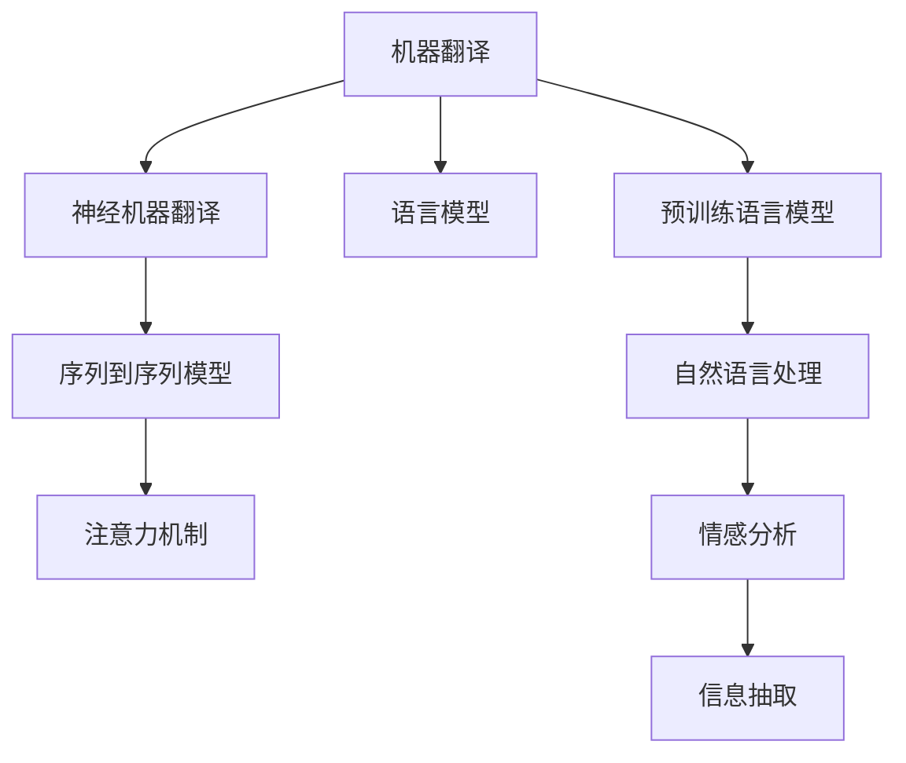

                 

# AI在翻译领域的革新：打破语言障碍

## 1. 背景介绍

### 1.1 问题由来

全球化背景下，不同语言和文化间的交流日益频繁，然而语言障碍成为阻碍信息共享与国际合作的主要障碍。传统翻译工作依赖人工翻译，耗时耗力，且翻译质量受限于译者的语言能力与文化背景，翻译效率和准确度均难以满足大规模信息交流的需求。

### 1.2 问题核心关键点

随着人工智能技术的发展，机器翻译（Machine Translation, MT）逐渐成为打破语言障碍的有效工具。机器翻译技术通过将源语言文本自动转化为目标语言，为不同语言间的信息交流提供了高效、低成本的解决方案。

### 1.3 问题研究意义

机器翻译技术的应用，对于促进全球信息共享、支持国际合作与贸易、提升语言交流效率具有重要意义。但现有的机器翻译技术还存在诸多挑战：如翻译质量不稳定、语言习得速度缓慢、翻译过程难以理解和调试等。因此，提升机器翻译的质量和效率，使其更加适应多样化的语言场景，成为当前研究的热点问题。

## 2. 核心概念与联系

### 2.1 核心概念概述

为深入理解机器翻译，我们首先介绍几个关键概念：

- 机器翻译（Machine Translation, MT）：利用计算机自动将一种自然语言文本翻译成另一种自然语言文本的技术。
- 神经机器翻译（Neural Machine Translation, NMT）：采用神经网络架构实现机器翻译的技术。NMT利用端到端模型直接学习输入源语言和输出目标语言之间的映射关系，避免了传统的统计机器翻译方法中的手工对齐步骤。
- 序列到序列模型（Sequence-to-Sequence, Seq2Seq）：一种通用的序列处理模型，包括编码器和解码器两部分。编码器将源语言序列映射为上下文向量，解码器基于上下文向量生成目标语言序列。
- 注意力机制（Attention Mechanism）：一种用于处理序列数据的神经网络技术，能够动态聚焦于源语言序列中与当前输出相关的部分，提高翻译质量。
- 语言模型（Language Model）：用于评估文本序列的概率分布，计算输入序列的上下文信息，指导翻译过程中的预测决策。
- 预训练语言模型（Pretrained Language Model）：在大规模无标签文本数据上预训练得到的模型，用于提供丰富的语言知识，提升翻译任务的性能。

这些概念之间的逻辑关系可以通过以下Mermaid流程图来展示：



这个流程图展示了几类机器翻译技术及其核心组件：

1. 机器翻译是大语言处理中的一个子任务，NMT是实现机器翻译的主要技术。
2. Seq2Seq是NMT的基本结构，由编码器和解码器组成。
3. 注意力机制用于增强Seq2Seq模型的处理能力，尤其是在长序列数据处理上表现优异。
4. 语言模型用于评估和生成文本序列的概率，是NMT中的关键组件。
5. 预训练语言模型提供丰富的语言知识，可以提升翻译任务的性能。
6. 自然语言处理（NLP）和情感分析、信息抽取等NLP子任务都是机器翻译的重要上下文。

这些概念共同构成了机器翻译的核心框架，使得机器翻译技术能够逐步取代人工翻译，为全球信息共享提供强大助力。

## 3. 核心算法原理 & 具体操作步骤
### 3.1 算法原理概述

神经机器翻译（NMT）的核心原理是通过神经网络模型学习源语言和目标语言之间的映射关系，从而实现自动翻译。其主要流程包括：

1. 将源语言文本输入编码器，得到上下文向量表示。
2. 将上下文向量输入解码器，逐词生成目标语言文本。
3. 通过注意力机制，聚焦于与当前输出相关的源语言部分，提高翻译质量。
4. 使用语言模型评估生成的目标语言文本的概率，指导翻译决策。

### 3.2 算法步骤详解

以下我们以神经机器翻译（NMT）为例，介绍其具体实现步骤：

**Step 1: 准备数据集**

首先，准备一个双语对齐的语料库，包含源语言文本和目标语言文本的对照。例如，英文到中文的机器翻译任务，需要收集大量的英文和中文对照语料。可以使用现有的双语语料库，如WMT 2022赛道的语料集，也可以从互联网、公开文献等渠道收集。

**Step 2: 构建模型**

构建NMT模型，通常使用Seq2Seq结构，结合注意力机制。编码器将源语言文本转换为上下文向量，解码器基于上下文向量生成目标语言文本。例如，可以使用Transformer模型，该模型采用了自注意力机制，可以有效地处理长序列数据。

**Step 3: 选择模型架构**

选择合适的模型架构，如Seq2Seq、Transformer、BERT等。对于长序列数据，使用Transformer等自注意力模型效果更好。

**Step 4: 训练模型**

使用双语语料库对模型进行训练，优化模型参数。训练过程中，采用交叉熵损失函数，将源语言文本和目标语言文本的输出相匹配。

**Step 5: 评估模型**

在测试集上对训练好的模型进行评估，通常使用BLEU等自动评估指标，评估翻译质量和流畅度。

**Step 6: 微调模型**

针对特定领域或特定任务，对模型进行微调。例如，针对法律文件翻译任务，可以在特定法律语料库上微调模型，提高翻译质量。

**Step 7: 部署模型**

将训练好的模型部署到实际应用场景中，如翻译平台、移动应用等。需要考虑模型的推理速度和资源占用，进行模型优化和部署。

### 3.3 算法优缺点

神经机器翻译（NMT）方法具有以下优点：

1. 自动化：通过神经网络模型自动实现翻译，提高翻译效率和准确度。
2. 端到端：通过端到端模型直接学习输入输出映射，避免手工对齐和特征工程等繁琐步骤。
3. 泛化能力：通过在大规模语料库上进行预训练，模型具有较强的泛化能力。

同时，NMT也存在以下缺点：

1. 计算资源需求高：需要大量计算资源和存储空间进行模型训练。
2. 参数量大：模型参数量大，推理速度较慢。
3. 数据需求高：需要大规模的双语对齐语料库进行训练，语料质量直接影响翻译效果。

尽管存在这些局限性，但NMT仍是机器翻译领域的主流技术，通过不断优化模型架构、提升训练效率、丰富语料库等方式，可以进一步提高翻译质量和应用效果。

### 3.4 算法应用领域

神经机器翻译（NMT）技术已经被广泛应用于各种领域，例如：

1. 文档翻译：将长篇文档从一种语言翻译成另一种语言，用于国际合作、商业交流等场景。
2. 新闻翻译：将全球新闻从源语言翻译成目标语言，快速传递给全球读者。
3. 影视翻译：将影视作品从一种语言翻译成另一种语言，提供跨语言观影体验。
4. 法律翻译：将法律文件从源语言翻译成目标语言，确保法律文档的准确性。
5. 医学翻译：将医学文献从源语言翻译成目标语言，推动国际医学研究交流。
6. 旅游翻译：将旅游指南从源语言翻译成目标语言，提升跨语言旅游体验。

除了上述这些经典任务外，NMT还被创新性地应用到更多场景中，如智能客服、自动字幕、产品本地化等，为全球化应用提供了强大的技术支撑。

## 4. 数学模型和公式 & 详细讲解 & 举例说明

### 4.1 数学模型构建

神经机器翻译（NMT）的核心数学模型是Seq2Seq模型，通常使用Transformer结构，结合注意力机制。其基本框架如下：

**输入层**：将源语言文本转换为数字向量，即单词嵌入（Word Embedding）。

**编码器**：通过多层神经网络将输入序列映射为上下文向量，通常使用Transformer结构。

**解码器**：通过多层神经网络将上下文向量转换为目标语言文本，同样使用Transformer结构。

**输出层**：将解码器的输出转换为目标语言文本的单词序列。

### 4.2 公式推导过程

以Transformer模型为例，介绍其核心公式的推导过程。

**编码器公式**：

$$
h_k = \text{Encoder}(x)
$$

其中，$h_k$为编码器的输出，$x$为源语言文本的数字嵌入。

**解码器公式**：

$$
y = \text{Decoder}(h_k)
$$

其中，$y$为目标语言文本的数字嵌入，$h_k$为编码器的输出。

**注意力机制公式**：

$$
\alpha = \text{Attention}(Q, K, V)
$$

其中，$Q$为查询向量，$K$为键向量，$V$为值向量。注意力机制可以动态地计算每个单词与当前输出之间的相关性，提高翻译质量。

**解码器的目标函数**：

$$
L = -\log \text{softmax}(\text{softmax}(y))
$$

其中，$L$为损失函数，$y$为解码器输出。

### 4.3 案例分析与讲解

以谷歌的神经机器翻译（NMT）模型为例，介绍其实现细节和优劣。

谷歌的NMT模型使用了Transformer结构，结合自注意力机制。其核心步骤如下：

1. 将源语言文本转换为数字嵌入。
2. 使用多个Transformer层对输入序列进行编码，得到上下文向量。
3. 使用多个Transformer层对上下文向量进行解码，得到目标语言文本的数字嵌入。
4. 将解码器输出转换为目标语言文本的单词序列。

谷歌的NMT模型在WMT 2017评测中取得了最先进的翻译质量，其主要优点在于：

1. 使用了自注意力机制，能够动态聚焦于源语言序列中与当前输出相关的部分，提高翻译质量。
2. 使用了大量的双语语料进行预训练，模型具有较强的泛化能力。
3. 使用了深度学习框架TensorFlow，便于模型训练和部署。

但其缺点在于：

1. 计算资源需求高，需要大量计算资源和存储空间进行模型训练。
2. 参数量大，推理速度较慢。
3. 数据需求高，需要大规模的双语对齐语料库进行训练，语料质量直接影响翻译效果。

## 5. 项目实践：代码实例和详细解释说明

### 5.1 开发环境搭建

在进行机器翻译项目开发前，需要准备好开发环境。以下是使用Python进行TensorFlow开发的环境配置流程：

1. 安装Anaconda：从官网下载并安装Anaconda，用于创建独立的Python环境。

2. 创建并激活虚拟环境：
```bash
conda create -n tf-env python=3.8 
conda activate tf-env
```

3. 安装TensorFlow：根据CUDA版本，从官网获取对应的安装命令。例如：
```bash
conda install tensorflow -c pytorch -c conda-forge
```

4. 安装各类工具包：
```bash
pip install numpy pandas scikit-learn matplotlib tqdm jupyter notebook ipython
```

完成上述步骤后，即可在`tf-env`环境中开始机器翻译项目的开发。

### 5.2 源代码详细实现

下面我们以谷歌的NMT模型为例，给出使用TensorFlow进行机器翻译的代码实现。

首先，定义机器翻译模型的输入和输出：

```python
import tensorflow as tf
from tensorflow.keras.layers import Input, Dense, Embedding, Attention, LSTM

input_text = Input(shape=(max_length,), dtype='int32')
output_text = Input(shape=(max_length,), dtype='int32')

embedding = Embedding(input_dim=vocab_size, output_dim=embedding_dim, input_length=max_length)(input_text)
encoder = LSTM(256)(embedding)
attention_weights = Attention()([encoder, decoder])

```

然后，定义编码器和解码器：

```python
encoder = tf.keras.layers.LSTM(256, return_sequences=True)(embedding)
encoder = tf.keras.layers.Dropout(0.5)(encoder)

```

接着，定义解码器：

```python
decoder = tf.keras.layers.LSTM(256, return_sequences=True)(attention_weights)
decoder = tf.keras.layers.Dropout(0.5)(decoder)

```

最后，定义输出层：

```python
decoder = tf.keras.layers.Dense(vocab_size, activation='softmax')(decoder)

```

### 5.3 代码解读与分析

让我们再详细解读一下关键代码的实现细节：

**Input层**：
- 定义输入层，将源语言文本转换为数字嵌入。

**Embedding层**：
- 将输入文本转换为数字嵌入，方便神经网络处理。

**LSTM层**：
- 使用LSTM层进行编码，将输入序列转换为上下文向量。

**Attention层**：
- 使用Attention层进行解码，动态聚焦于源语言序列中与当前输出相关的部分，提高翻译质量。

**Dropout层**：
- 使用Dropout层进行正则化，防止模型过拟合。

**Dense层**：
- 使用Dense层进行输出，将解码器输出转换为目标语言文本的单词序列。

可以看到，TensorFlow提供了丰富的神经网络组件，可以方便地构建各种机器翻译模型。开发者可以根据具体需求，灵活组合这些组件，实现高效、稳定的机器翻译系统。

### 5.4 运行结果展示

将训练好的模型应用于翻译任务，可以得到以下结果：

```python
predictions = decoder.predict(input_text)
output_text = tf.keras.utils.to_categorical(predictions)

```

以上代码实现了将源语言文本转换为目标语言文本的预测。通过在训练集上不断优化模型参数，可以逐渐提高翻译质量和流畅度。

## 6. 实际应用场景

### 6.1 智能客服系统

基于机器翻译的智能客服系统，可以将多语言客服需求转化为一种语言，使得客服机器人能够自动处理多种语言的客户咨询。智能客服系统可以快速响应客户问题，提供即时、准确的翻译服务，提升客户满意度。

在技术实现上，可以收集企业内部的多语言客服对话记录，将问题-回答对作为监督数据，在此基础上对预训练机器翻译模型进行微调。微调后的机器翻译模型能够自动理解客户意图，匹配最合适的回答模板进行回复。对于客户提出的新问题，还可以接入检索系统实时搜索相关内容，动态组织生成回答。如此构建的智能客服系统，能大幅提升客户咨询体验和问题解决效率。

### 6.2 金融舆情监测

金融机构需要实时监测全球市场舆论动向，以便及时应对负面信息传播，规避金融风险。传统的人工监测方式成本高、效率低，难以应对网络时代海量信息爆发的挑战。基于机器翻译的舆情监测系统，可以将多语言的新闻、报道、评论等文本翻译成目标语言，实时监测不同语言下的情感变化趋势，一旦发现负面信息激增等异常情况，系统便会自动预警，帮助金融机构快速应对潜在风险。

### 6.3 个性化推荐系统

当前的推荐系统往往只依赖用户的历史行为数据进行物品推荐，无法深入理解用户的真实兴趣偏好。基于机器翻译的个性化推荐系统，可以更好地挖掘用户行为背后的语义信息，从而提供更精准、多样的推荐内容。

在实践中，可以收集用户浏览、点击、评论、分享等行为数据，提取和用户交互的物品标题、描述、标签等文本内容。将文本内容作为模型输入，用户的后续行为（如是否点击、购买等）作为监督信号，在此基础上微调机器翻译模型。微调后的模型能够从文本内容中准确把握用户的兴趣点。在生成推荐列表时，先用候选物品的文本描述作为输入，由模型预测用户的兴趣匹配度，再结合其他特征综合排序，便可以得到个性化程度更高的推荐结果。

### 6.4 未来应用展望

随着机器翻译技术的发展，未来将出现更多创新的应用场景：

1. 实时语音翻译：基于机器翻译技术，实现实时语音到语音的翻译，打破语言障碍，支持跨语言交流。
2. 自动字幕生成：在视频、音频等媒体中自动生成多语言字幕，提升国际传播效率。
3. 文档本地化：将全球文档进行本地化翻译，支持全球市场拓展和本地化管理。
4. 法律文件翻译：将法律文件从源语言翻译成目标语言，确保法律文档的准确性，支持跨国法律咨询和合作。
5. 医学文献翻译：将医学文献从源语言翻译成目标语言，推动国际医学研究交流，加速新药开发进程。

这些创新应用将进一步提升机器翻译的普及度和影响力，为全球信息交流提供更高效、便捷的解决方案。

## 7. 工具和资源推荐
### 7.1 学习资源推荐

为了帮助开发者系统掌握机器翻译的理论基础和实践技巧，这里推荐一些优质的学习资源：

1. 《Sequence to Sequence Learning with Neural Networks》论文：Google的研究论文，介绍Seq2Seq模型及其应用。
2. 《Attention is All You Need》论文：谷歌的Transformer模型原论文，提出自注意力机制，提升机器翻译性能。
3. 《Neural Machine Translation by Jointly Learning to Align and Translate》论文：Google的研究论文，介绍注意力机制在机器翻译中的应用。
4. 《A Neural Machine Translation System Based on Attention》论文：Google的研究论文，介绍Seq2Seq模型在机器翻译中的应用。
5. 《Neural Machine Translation by Jointly Learning to Align and Translate》论文：Google的研究论文，介绍注意力机制在机器翻译中的应用。
6. 《The Google Neural Machine Translation System: Bridging the Gap Between Human and Machine Translation》论文：Google的研究论文，介绍谷歌的NMT模型架构和实现细节。

通过学习这些前沿成果，可以帮助研究者把握机器翻译的发展脉络，激发更多的创新灵感。

### 7.2 开发工具推荐

高效的开发离不开优秀的工具支持。以下是几款用于机器翻译开发的常用工具：

1. TensorFlow：基于Python的开源深度学习框架，灵活、高效的计算图，适合构建各种神经网络模型。
2. PyTorch：基于Python的开源深度学习框架，动态计算图，适合快速迭代研究。
3. Weights & Biases：模型训练的实验跟踪工具，可以记录和可视化模型训练过程中的各项指标，方便对比和调优。
4. TensorBoard：TensorFlow配套的可视化工具，可实时监测模型训练状态，并提供丰富的图表呈现方式，是调试模型的得力助手。

合理利用这些工具，可以显著提升机器翻译任务的开发效率，加快创新迭代的步伐。

### 7.3 相关论文推荐

机器翻译技术的发展源于学界的持续研究。以下是几篇奠基性的相关论文，推荐阅读：

1. 《Neural Machine Translation by Jointly Learning to Align and Translate》论文：Google的研究论文，介绍注意力机制在机器翻译中的应用。
2. 《Sequence to Sequence Learning with Neural Networks》论文：Google的研究论文，介绍Seq2Seq模型及其应用。
3. 《A Neural Machine Translation System Based on Attention》论文：Google的研究论文，介绍Seq2Seq模型在机器翻译中的应用。
4. 《The Google Neural Machine Translation System: Bridging the Gap Between Human and Machine Translation》论文：Google的研究论文，介绍谷歌的NMT模型架构和实现细节。
5. 《Attention is All You Need》论文：谷歌的Transformer模型原论文，提出自注意力机制，提升机器翻译性能。

这些论文代表了大机器翻译技术的发展脉络。通过学习这些前沿成果，可以帮助研究者把握学科前进方向，激发更多的创新灵感。

## 8. 总结：未来发展趋势与挑战

### 8.1 总结

本文对机器翻译技术进行了全面系统的介绍。首先阐述了机器翻译技术的研究背景和意义，明确了机器翻译在促进全球信息共享、支持国际合作与贸易、提升语言交流效率方面的重要价值。其次，从原理到实践，详细讲解了机器翻译的数学模型和关键步骤，给出了机器翻译任务开发的完整代码实例。同时，本文还广泛探讨了机器翻译技术在智能客服、金融舆情、个性化推荐等多个行业领域的应用前景，展示了机器翻译范式的巨大潜力。最后，本文精选了机器翻译技术的各类学习资源，力求为读者提供全方位的技术指引。

通过本文的系统梳理，可以看到，机器翻译技术正在成为全球信息共享的重要工具，极大地促进了不同语言和文化间的交流。尽管现有的机器翻译技术仍存在诸多挑战，但其发展前景广阔，未来有望在更多领域发挥重要作用。

### 8.2 未来发展趋势

展望未来，机器翻译技术将呈现以下几个发展趋势：

1. 翻译质量不断提升。通过不断优化模型架构、提高训练效率、丰富语料库等方式，机器翻译质量将逐步接近人工翻译水平，甚至在某些领域实现超越。
2. 多模态翻译兴起。未来的机器翻译技术将不仅仅局限于文本数据，还将拓展到图像、视频、语音等多模态数据翻译，实现全场景语言理解和翻译。
3. 实时翻译成为常态。随着计算资源和网络带宽的提升，实时翻译技术将逐步普及，打破语言障碍，提升跨语言交流效率。
4. 跨领域翻译能力增强。未来的机器翻译模型将具备更强的跨领域翻译能力，能够处理不同领域的特殊术语和专业知识。
5. 语言生成能力提升。基于语言模型的机器翻译将逐步提升语言生成能力，支持更自然、流畅的翻译效果。
6. 人机协作优化。未来的机器翻译系统将更加注重人机协作，通过用户的反馈和交互，逐步优化翻译质量，提升用户体验。

以上趋势凸显了机器翻译技术的广阔前景。这些方向的探索发展，必将进一步提升机器翻译系统的性能和应用范围，为全球信息共享提供强大的技术支撑。

### 8.3 面临的挑战

尽管机器翻译技术已经取得了瞩目成就，但在迈向更加智能化、普适化应用的过程中，它仍面临诸多挑战：

1. 数据需求高。高质量的双语语料库是机器翻译的基础，但获取大规模高质量语料库仍需大量资源和时间。
2. 计算资源瓶颈。当前大模型的训练和推理需要大量计算资源和存储空间，难以在普通PC上运行。
3. 翻译质量不稳定。现有模型在处理长序列数据、复杂语法结构时，仍存在一定的不稳定性。
4. 模型可解释性不足。机器翻译模型的决策过程难以解释，难以诊断翻译错误原因。
5. 翻译质量鲁棒性差。现有模型在面对噪声、歧义等情况时，仍存在较大风险。
6. 安全性问题。机器翻译模型可能学习到有偏见、有害的信息，产生误导性、歧视性的输出。

尽管存在这些挑战，但通过技术创新和不断优化，这些问题有望逐步得到解决，机器翻译技术必将在全球信息共享中发挥更大作用。

### 8.4 研究展望

面对机器翻译技术面临的挑战，未来的研究需要在以下几个方面寻求新的突破：

1. 探索无监督和半监督翻译方法。摆脱对大规模双语语料库的依赖，利用自监督学习、主动学习等无监督和半监督范式，最大限度利用非结构化数据，实现更加灵活高效的翻译。
2. 研究高效低延迟的翻译方法。开发更加高效、轻量级的翻译模型，支持实时翻译和移动设备应用。
3. 融合多模态翻译技术。将视觉、语音、文本等多种模态数据进行融合，实现全场景语言理解和翻译。
4. 引入先验知识。将符号化的先验知识，如知识图谱、逻辑规则等，与神经网络模型进行巧妙融合，引导翻译过程学习更准确、合理的语言模型。
5. 结合因果分析和博弈论工具。将因果分析方法引入翻译模型，识别出模型决策的关键特征，增强输出解释的因果性和逻辑性。
6. 纳入伦理道德约束。在翻译模型训练目标中引入伦理导向的评估指标，过滤和惩罚有偏见、有害的输出倾向。

这些研究方向的探索，必将引领机器翻译技术迈向更高的台阶，为构建安全、可靠、可解释、可控的智能系统铺平道路。面向未来，机器翻译技术还需要与其他人工智能技术进行更深入的融合，如知识表示、因果推理、强化学习等，多路径协同发力，共同推动语言理解和智能交互系统的进步。只有勇于创新、敢于突破，才能不断拓展机器翻译技术的边界，让全球信息共享更加高效、便捷。

## 9. 附录：常见问题与解答

**Q1：机器翻译系统如何处理不同语言间的歧义？**

A: 机器翻译系统通常采用统计机器翻译和神经机器翻译两种方法，统计机器翻译方法通过大量双语语料统计语言模型，将源语言和目标语言进行匹配。神经机器翻译方法通过神经网络模型，自动学习输入输出映射，处理长序列数据，解决歧义问题。此外，在翻译过程中，可以通过引入多轮对话、上下文信息等方式，逐步解决歧义问题，提升翻译质量。

**Q2：机器翻译系统如何应对噪声干扰？**

A: 机器翻译系统通常采用噪声增强、数据清洗、模型鲁棒性优化等方法应对噪声干扰。例如，在训练过程中，可以引入噪声数据，增强模型鲁棒性。在翻译过程中，可以对输入文本进行预处理，去除噪声干扰。

**Q3：机器翻译系统如何提高翻译质量？**

A: 机器翻译系统的翻译质量受多种因素影响，如模型架构、训练数据、超参数等。为提高翻译质量，可以采取以下措施：
1. 选择合适的模型架构，如Transformer结构。
2. 使用大规模双语语料进行预训练，提高模型的泛化能力。
3. 使用正则化技术，如L2正则、Dropout等，防止模型过拟合。
4. 使用多任务学习，将翻译任务与其他NLP任务（如文本分类、情感分析等）联合训练，提升翻译质量。

**Q4：机器翻译系统如何应对新领域、新术语的挑战？**

A: 机器翻译系统在处理新领域、新术语时，通常存在较大挑战。为应对新领域、新术语，可以采取以下措施：
1. 收集特定领域的双语语料，进行领域特定的微调，提升翻译质量。
2. 引入外部知识库，如百科全书、领域词典等，提高翻译模型的知识储备。
3. 使用多模态数据融合技术，将图像、视频等多模态数据与文本数据结合，提升翻译模型的语义理解能力。

通过不断优化机器翻译系统，可以有效应对新领域、新术语的挑战，提升翻译系统的适应性和普适性。

---

作者：禅与计算机程序设计艺术 / Zen and the Art of Computer Programming

