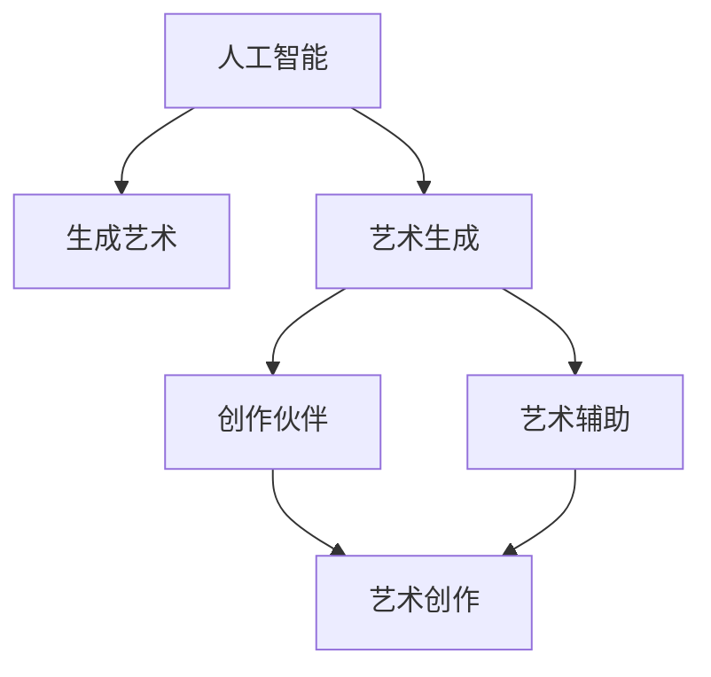

                 

# AI在艺术创作中的角色：工具还是合作者

> 关键词：人工智能, 艺术创作, 机器学习, 生成艺术, 艺术生成, 创作伙伴, 艺术辅助

## 1. 背景介绍

### 1.1 问题由来
在人类历史长河中，艺术创作始终是人类表达自我、探索未知的重要途径。然而，艺术创作通常需要深厚的技艺、大量的灵感和时间的积累。随着科技的迅猛发展，人工智能(AI)逐渐成为艺术创作领域的重要工具。AI不仅能够辅助艺术家进行初步构思，还能独立生成艺术作品，极大地拓宽了艺术的创作边界。

### 1.2 问题核心关键点
AI在艺术创作中扮演的角色，始终是讨论的热点。一方面，AI可以高效地生成海量艺术作品，降低创作门槛；另一方面，AI生成的艺术作品是否具有独立性、创造力，是否能够超越人类艺术家，成为我们新的创作伙伴，还是仅仅作为一个创作工具，一直是艺术与科技界面临的重要问题。

## 2. 核心概念与联系

### 2.1 核心概念概述

为更好地理解AI在艺术创作中的作用，本节将介绍几个密切相关的核心概念：

- **人工智能(AI)**：通过模拟人类智能行为，实现自主学习、推理、决策等功能的计算机系统。在艺术创作中，AI通常指的是能够进行图像生成、音乐创作、文本创作等艺术创作任务的智能算法。

- **生成艺术(Generative Art)**：使用算法或程序自动生成的艺术作品，通常包括视觉艺术、音乐、文本等形式。生成艺术是一种新的艺术表达方式，能够突破传统艺术的创作模式。

- **艺术生成(Artistic Generation)**：指通过算法自动生成艺术作品的过程。这个过程通常涉及数据输入、模型训练、生成输出等多个步骤。

- **创作伙伴(Partner in Creation)**：指AI不仅作为一个工具，而是作为一个合作者，与人类艺术家共同完成艺术创作。创作伙伴不仅能够提供创作灵感，还能在创作过程中提供反馈和优化建议。

- **艺术辅助(Artistic Assist)**：指AI辅助人类艺术家进行创作，提供技术支持、数据分析、可视化工具等，帮助艺术家提高创作效率和质量。

这些概念之间的逻辑关系可以通过以下Mermaid流程图来展示：



这个流程图展示了大语言模型的核心概念及其之间的关系：

1. 人工智能通过生成艺术和艺术生成，创造艺术作品。
2. 生成艺术和艺术生成作为AI在艺术创作中的具体应用形式，可能扮演创作伙伴或艺术辅助的角色。
3. 创作伙伴和艺术辅助两个概念更多强调AI与人类艺术家的合作，而非仅仅作为工具。

## 3. 核心算法原理 & 具体操作步骤
### 3.1 算法原理概述

AI在艺术创作中的核心算法，主要是基于深度学习和生成模型的方法，通过大规模数据训练，学习到艺术作品的生成规律，然后利用这些规律进行创作。

形式化地，假设艺术创作问题可以表示为一个条件概率模型 $P(X|Y)$，其中 $X$ 为艺术作品，$Y$ 为创作任务或条件。目标是找到最优的模型参数 $\theta$，使得生成的艺术作品 $X$ 最大化符合目标任务 $Y$ 的条件概率。

常见的深度学习生成模型包括变分自编码器(VAE)、生成对抗网络(GAN)、自回归模型(如LSTM)等。通过这些模型，AI能够在给定任务或条件 $Y$ 的情况下，生成符合期望的艺术作品 $X$。

### 3.2 算法步骤详解

AI在艺术创作中的主要步骤包括：

1. **数据准备**：收集艺术作品数据集，进行预处理和标注，准备训练数据。
2. **模型训练**：使用深度学习生成模型对数据集进行训练，学习到艺术作品的生成规律。
3. **条件生成**：给定特定的创作条件或任务，使用训练好的模型生成符合条件的作品。
4. **艺术创作**：将生成的作品输出，供人类艺术家参考、修改或直接使用。

### 3.3 算法优缺点

AI在艺术创作中的算法具有以下优点：

1. **高效创作**：AI能够快速生成大量艺术作品，缩短创作时间。
2. **多样性**：AI生成的作品风格多样，能够突破传统艺术创作的边界。
3. **成本降低**：使用AI辅助创作，降低了人力和物料成本。
4. **创新能力**：AI能够探索人类无法触及的艺术领域，提供新的创作思路。

但同时，这些算法也存在一些局限性：

1. **缺乏人类情感**：AI生成的作品往往缺乏人类情感和细腻的表达。
2. **作品独立性**：AI生成的作品是否具有独立性和原创性，是否超越人类艺术家，还存在争议。
3. **技术依赖**：AI生成的作品对技术依赖性强，模型的质量直接决定创作质量。
4. **伦理问题**：AI生成的作品涉及版权和伦理问题，需要进行严格的管理和规范。

### 3.4 算法应用领域

AI在艺术创作中的应用广泛，包括但不限于：

1. **视觉艺术**：如自动生成绘画、摄影、3D建模等作品。
2. **音乐创作**：生成器可以创作旋律、和声、节奏等音乐元素，甚至整首曲子。
3. **文本创作**：生成器可以创作诗歌、小说、剧本等文学作品。
4. **多媒体艺术**：如结合视觉、听觉和文本等多种形式的艺术创作。
5. **交互艺术**：生成艺术作品与观众互动，创造出新的艺术体验。

## 4. 数学模型和公式 & 详细讲解  
### 4.1 数学模型构建

对于艺术生成问题，我们通常使用以下条件概率模型进行建模：

$$ P(X|Y) = \frac{P(X,Y)}{P(Y)} $$

其中 $P(X,Y)$ 表示生成作品 $X$ 的条件概率，$P(Y)$ 表示生成该作品的先验概率。

### 4.2 公式推导过程

以视觉艺术生成为例，假设输入的艺术作品是图像 $X$，创作的条件是 $Y$，生成模型可以表示为：

$$ P(X|Y) = \frac{\exp(-\frac{1}{2}\|X - G(Y)\|^2)}{\int_{Y}\exp(-\frac{1}{2}\|X - G(Y')\|^2)dY'} $$

其中 $G(Y)$ 为生成函数，$\| \cdot \|$ 为L2范数。

### 4.3 案例分析与讲解

以GAN为例，假设生成的艺术作品是图像 $X$，创作条件是 $Y$，其损失函数为：

$$ \mathcal{L} = -\log D(G(Y)) + \log(1-D(X)) $$

其中 $D$ 为判别器，$G$ 为生成器。目标是最小化这个损失函数，使得生成的艺术作品尽可能真实，同时也难以被判别器区分。

## 5. 项目实践：代码实例和详细解释说明
### 5.1 开发环境搭建

在进行艺术生成实践前，我们需要准备好开发环境。以下是使用Python进行TensorFlow开发的环境配置流程：

1. 安装Anaconda：从官网下载并安装Anaconda，用于创建独立的Python环境。

2. 创建并激活虚拟环境：
```bash
conda create -n tensorflow-env python=3.8 
conda activate tensorflow-env
```

3. 安装TensorFlow：根据CUDA版本，从官网获取对应的安装命令。例如：
```bash
conda install tensorflow==2.6.0 -c tf
```

4. 安装必要的库：
```bash
pip install numpy scipy matplotlib scikit-image
```

完成上述步骤后，即可在`tensorflow-env`环境中开始艺术生成实践。

### 5.2 源代码详细实现

这里以基于GAN的图像生成为例，给出使用TensorFlow和Keras进行图像生成的完整代码实现。

首先，定义生成器和判别器的基本结构：

```python
import tensorflow as tf
from tensorflow.keras import layers

class Generator(tf.keras.Model):
    def __init__(self, latent_dim, img_shape):
        super(Generator, self).__init__()
        self.img_shape = img_shape
        self.latent_dim = latent_dim
        
        self.dense1 = layers.Dense(128*128*256)
        self.dense2 = layers.Dense(256*128*256)
        self.dense3 = layers.Dense(512*128*256)
        self.dense4 = layers.Dense(1024*128*256)
        self.dense5 = layers.Dense(np.prod(img_shape), activation='tanh')
        self.reshape = layers.Reshape(img_shape, input_shape=(latent_dim,))
        
    def call(self, x):
        x = self.dense1(x)
        x = layers.LeakyReLU(alpha=0.2)(x)
        x = self.dense2(x)
        x = layers.LeakyReLU(alpha=0.2)(x)
        x = self.dense3(x)
        x = layers.LeakyReLU(alpha=0.2)(x)
        x = self.dense4(x)
        x = layers.LeakyReLU(alpha=0.2)(x)
        x = self.dense5(x)
        x = self.reshape(x)
        return x

class Discriminator(tf.keras.Model):
    def __init__(self, img_shape):
        super(Discriminator, self).__init__()
        self.img_shape = img_shape
        
        self.conv1 = layers.Conv2D(256, kernel_size=5, strides=2, padding='same', input_shape=img_shape)
        self.conv2 = layers.Conv2D(256, kernel_size=5, strides=2, padding='same')
        self.conv3 = layers.Conv2D(256, kernel_size=5, strides=2, padding='same')
        self.conv4 = layers.Conv2D(256, kernel_size=5, strides=2, padding='same')
        self.flatten = layers.Flatten()
        self.dense1 = layers.Dense(1)
        
    def call(self, x):
        x = self.conv1(x)
        x = layers.LeakyReLU(alpha=0.2)(x)
        x = self.conv2(x)
        x = layers.LeakyReLU(alpha=0.2)(x)
        x = self.conv3(x)
        x = layers.LeakyReLU(alpha=0.2)(x)
        x = self.conv4(x)
        x = layers.LeakyReLU(alpha=0.2)(x)
        x = self.flatten(x)
        x = self.dense1(x)
        return x
```

然后，定义模型训练的超参数和损失函数：

```python
latent_dim = 100
img_shape = (28, 28, 1)
epochs = 10000
batch_size = 32
learning_rate = 0.0002
beta1 = 0.5
beta2 = 0.999

g_optimizer = tf.keras.optimizers.Adam(learning_rate, beta_1=beta1, beta_2=beta2)
d_optimizer = tf.keras.optimizers.Adam(learning_rate, beta_1=beta1, beta_2=beta2)

g_loss = tf.keras.losses.BinaryCrossentropy(from_logits=True)
d_loss = tf.keras.losses.BinaryCrossentropy(from_logits=True)

g_loss历史记录的训练损失，d_loss历史记录的判别器损失
```

接下来，定义生成器和判别器的损失函数和梯度计算：

```python
def generator_loss(fake_output, valid):
    return g_loss(tf.ones_like(fake_output), fake_output)

def discriminator_loss(real_output, fake_output, valid):
    real_loss = d_loss(tf.ones_like(real_output), real_output)
    fake_loss = d_loss(tf.zeros_like(fake_output), fake_output)
    return real_loss + fake_loss

def generator_grads(fake_output, valid):
    with tf.GradientTape() as tape:
        g_loss = generator_loss(fake_output, valid)
    return tape.gradient(g_loss, g.trainable_variables)

def discriminator_grads(real_output, fake_output, valid):
    with tf.GradientTape() as tape:
        d_loss = discriminator_loss(real_output, fake_output, valid)
    return tape.gradient(d_loss, d.trainable_variables)
```

最后，启动训练流程：

```python
def train_step(x):
    with tf.GradientTape() as g_tape, tf.GradientTape() as d_tape:
        g_loss_value = generator_loss(g(x, random_latent_vector), valid)
        d_loss_value = discriminator_loss(d(x, random_latent_vector), x, valid)
    g_grads = generator_grads(g_loss_value, valid)
    d_grads = discriminator_grads(d_loss_value, x, valid)
    g_optimizer.apply_gradients(zip(g_grads, g.trainable_variables))
    d_optimizer.apply_gradients(zip(d_grads, d.trainable_variables))
```

在训练过程中，需要注意以下几点：

1. 学习率衰减：随着训练轮数增加，逐步减小学习率，避免过拟合。
2. 梯度累积：使用梯度累积技术，提高训练效率。
3. 模型保存：定期保存训练好的模型，以便后续加载和继续训练。

### 5.3 代码解读与分析

让我们再详细解读一下关键代码的实现细节：

**Generator类**：
- 定义了生成器的基本结构，包括多个卷积层和全连接层。
- 使用Leaky ReLU作为激活函数，增加非线性性。
- 最后一层是tanh激活，保证输出在[0,1]之间。
- 定义了reshape函数，将生成张量重塑为指定形状。

**Discriminator类**：
- 定义了判别器的基本结构，包括多个卷积层和全连接层。
- 使用Leaky ReLU作为激活函数，增加非线性性。
- 最后一层是sigmoid激活，输出在[0,1]之间，表示真实性概率。

**模型训练**：
- 定义了损失函数和优化器，使用Adam算法。
- 定义了训练步骤，计算生成器和判别器的损失函数和梯度。
- 使用tf.GradientTape进行梯度计算，并应用优化器更新模型参数。

## 6. 实际应用场景
### 6.1 交互艺术

基于AI的交互艺术，是一种全新的艺术形式。通过AI生成的艺术作品与观众互动，可以创造出更加丰富多样的艺术体验。

例如，一个交互式艺术装置可以结合图像、声音、文本等多种形式，通过机器学习模型生成艺术作品，并根据观众的反馈实时调整作品内容，甚至生成新的作品。这种动态生成的艺术作品，能够提供独特的互动体验，吸引观众的参与和兴趣。

### 6.2 艺术辅助设计

AI在艺术辅助设计中具有广阔的应用前景。设计师可以通过AI辅助生成设计草图、色彩方案、布局设计等，提高设计的效率和质量。

例如，利用AI生成3D模型或平面设计草图，帮助设计师快速获取多个方案，通过迭代优化，选择最优方案。AI还可以分析历史数据，预测设计趋势，提供个性化的设计建议。

### 6.3 教育培训

AI在艺术教育培训中的应用，可以帮助学生进行创作和评估。

例如，AI可以自动生成艺术作品作为参考，提供创作灵感。AI还可以自动评估学生作品，提供反馈和改进建议，帮助学生提高创作水平。此外，AI还可以进行自动化的课程评估和成绩管理，减轻教师负担。

### 6.4 未来应用展望

随着AI技术的不断发展，AI在艺术创作中的应用将越来越广泛。未来，我们可以预见以下几个方向：

1. **多模态艺术创作**：结合视觉、听觉、文本等多种形式，创造出更加丰富的艺术作品。
2. **个性化创作**：利用AI的推荐算法，根据观众偏好生成个性化的艺术作品。
3. **艺术风格迁移**：将一个艺术家的风格应用到另一个艺术家的作品中，创造出新的艺术风格。
4. **跨媒体艺术创作**：结合电影、音乐、游戏等多种媒体形式，创造出全新的艺术体验。

## 7. 工具和资源推荐
### 7.1 学习资源推荐

为了帮助开发者系统掌握AI在艺术创作中的应用，这里推荐一些优质的学习资源：

1. **《生成对抗网络GAN》书籍**：深入讲解GAN的原理和应用，涵盖图像生成、音乐生成等多种任务。
2. **DeepArt网站**：一个生成艺术平台，提供各种艺术风格的生成器，可帮助开发者快速上手生成艺术作品。
3. **ArtProject网站**：一个艺术创作平台，提供各种AI创作工具和生成器，支持图像、文本、音乐等多种形式的艺术创作。
4. **DeepLearning.AI课程**：深度学习AI教育平台，提供大量关于艺术生成和AI辅助设计的课程和资源。
5. **Kaggle比赛**：Kaggle定期举办艺术生成相关的比赛，可以学习到大量高水平的AI艺术作品。

通过对这些资源的学习实践，相信你一定能够快速掌握AI在艺术创作中的应用，并用于解决实际的创作问题。

### 7.2 开发工具推荐

高效的开发离不开优秀的工具支持。以下是几款用于AI艺术创作开发的常用工具：

1. **TensorFlow**：谷歌主导的开源深度学习框架，支持GPU加速，适合大规模图像生成任务。
2. **PyTorch**：Facebook主导的开源深度学习框架，支持动态图，适合快速迭代研究和实验。
3. **Keras**：高级深度学习API，支持多种深度学习框架，易于使用。
4. **Blender**：开源的3D建模软件，支持AI生成的3D模型和动画，适合艺术辅助设计。
5. **Audacity**：开源音频编辑软件，支持AI生成的音乐创作和编辑，适合音频艺术创作。

合理利用这些工具，可以显著提升AI艺术创作的开发效率，加快创新迭代的步伐。

### 7.3 相关论文推荐

AI在艺术创作中的应用，源于学界的持续研究。以下是几篇奠基性的相关论文，推荐阅读：

1. **《Neural Style Transfer》**：提出将图像风格迁移的思想，利用深度学习模型将一幅艺术作品的风格应用到另一幅图像上。
2. **《DeepArt》**：展示如何使用深度学习生成艺术作品，结合图像风格迁移和GAN技术，生成高品质的艺术图像。
3. **《DeepDream》**：利用深度学习生成图像中的梦境般效果，创造出独特的艺术风格。
4. **《Real-Time Text-to-Art》**：利用深度学习生成文本描述对应的艺术作品，打破文本和图像之间的界限。
5. **《Text to Art》**：利用深度学习生成文本描述对应的艺术作品，结合文本生成和GAN技术，生成多样化的艺术作品。

这些论文代表了大语言模型在艺术创作中的应用方向，帮助研究者了解最新进展，激发更多的创新灵感。

## 8. 总结：未来发展趋势与挑战
### 8.1 总结

本文对AI在艺术创作中的作用进行了全面系统的介绍。首先阐述了AI在艺术创作中的研究背景和应用前景，明确了AI在艺术创作中可能扮演的角色。其次，从原理到实践，详细讲解了AI艺术生成的数学模型和关键步骤，给出了艺术生成任务开发的完整代码实例。同时，本文还广泛探讨了AI在艺术创作中的多种应用场景，展示了AI技术在艺术领域的多样化应用。此外，本文精选了AI艺术创作的学习资源，力求为读者提供全方位的技术指引。

通过本文的系统梳理，可以看到，AI在艺术创作中已经成为重要的创作工具，极大地拓宽了艺术创作的边界，带来了新的创作思路和表达方式。未来，AI与艺术的结合将更加紧密，催生出更多创新性和富有创意的艺术作品，为人类艺术的发展注入新的活力。

### 8.2 未来发展趋势

展望未来，AI在艺术创作中的应用将呈现以下几个发展趋势：

1. **创作伙伴**：AI不仅作为一个工具，而将逐渐成为创作伙伴，与人类艺术家共同完成创作，提供更丰富的创作灵感和反馈。
2. **跨媒体融合**：AI将打破艺术形式之间的界限，结合视觉、听觉、文本等多种形式，创造出全新的艺术体验。
3. **个性化创作**：利用AI的推荐算法，根据观众偏好生成个性化的艺术作品，提高艺术作品的市场接受度。
4. **自动化评估**：AI可以自动评估艺术作品的质量和风格，提供客观的评估结果，帮助艺术家提高创作水平。
5. **教育培训**：AI可以辅助艺术教育，帮助学生进行创作和评估，提供个性化的学习建议。

以上趋势凸显了AI在艺术创作中的广阔前景。这些方向的探索发展，必将进一步提升艺术创作的效率和质量，推动艺术领域的技术进步和创新。

### 8.3 面临的挑战

尽管AI在艺术创作中已经取得了显著进展，但在迈向更加智能化、普适化应用的过程中，仍面临诸多挑战：

1. **作品原创性**：AI生成的艺术作品是否具有独立性和原创性，是否超越人类艺术家，是一个重要问题。
2. **技术复杂性**：AI艺术创作涉及深度学习、生成模型等多种技术，开发难度较高。
3. **版权和伦理**：AI生成的作品涉及版权和伦理问题，需要进行严格的管理和规范。
4. **用户接受度**：AI生成的艺术作品是否能被观众接受，是否具有审美价值，需要进一步验证。

### 8.4 研究展望

面对AI在艺术创作中的挑战，未来的研究需要在以下几个方面寻求新的突破：

1. **多模态融合**：结合视觉、听觉、文本等多种形式，创造出更加丰富的艺术作品。
2. **跨媒体创作**：结合电影、音乐、游戏等多种媒体形式，创造出全新的艺术体验。
3. **个性化推荐**：利用AI的推荐算法，根据观众偏好生成个性化的艺术作品。
4. **自动化评估**：AI可以自动评估艺术作品的质量和风格，提供客观的评估结果。

这些研究方向的探索，必将引领AI在艺术创作中的应用走向更深层次，为人类艺术的发展注入新的活力。总之，AI不仅是一个工具，更是一个创作伙伴，将为人类艺术创作带来新的可能性。

## 9. 附录：常见问题与解答

**Q1：AI生成的艺术作品是否具有独立性？**

A: AI生成的艺术作品是否具有独立性，是一个争议性的问题。部分AI生成的作品能够展现出独特的风格和创新性，具有较高的艺术价值。然而，也有部分作品缺乏人类艺术家的情感和表达，无法超越人类的创作水平。总体来说，AI在艺术创作中扮演的角色是一个创作工具，需要与人类艺术家共同完成创作。

**Q2：AI生成的艺术作品是否能够替代人类艺术家？**

A: AI生成的艺术作品不能完全替代人类艺术家。尽管AI可以生成大量的艺术作品，但人类艺术家的创造力和情感表达，是AI难以超越的。人类艺术家通过多年的积累和灵感，创作出的作品往往具有深刻的内涵和独特的表达方式，这些是AI难以模仿的。AI更多地作为创作工具，辅助人类艺术家进行创作。

**Q3：AI生成的艺术作品是否具有版权问题？**

A: AI生成的艺术作品版权归属问题，需要根据具体创作方式进行判断。如果AI在创作过程中使用了人类的原始作品或创意，则生成作品可能需要得到原作者的授权。同时，AI生成的作品是否具有版权，也需要根据版权法的规定进行评估。

**Q4：AI生成的艺术作品是否具备伦理问题？**

A: AI生成的艺术作品可能会涉及伦理问题，例如使用未经授权的内容，生成有害或误导性的信息等。因此，在使用AI进行艺术创作时，需要进行严格的伦理审查，确保作品内容符合社会规范和道德标准。

**Q5：AI生成的艺术作品是否能够满足观众的审美需求？**

A: AI生成的艺术作品是否能满足观众的审美需求，需要根据具体的艺术创作方式和作品类型进行评估。一些观众可能会对AI生成的艺术作品感到新鲜和有趣，而另一些观众可能更喜欢传统的人力创作。因此，AI艺术创作需要尊重观众的审美多样性，提供多样的艺术选择。

---

作者：禅与计算机程序设计艺术 / Zen and the Art of Computer Programming

