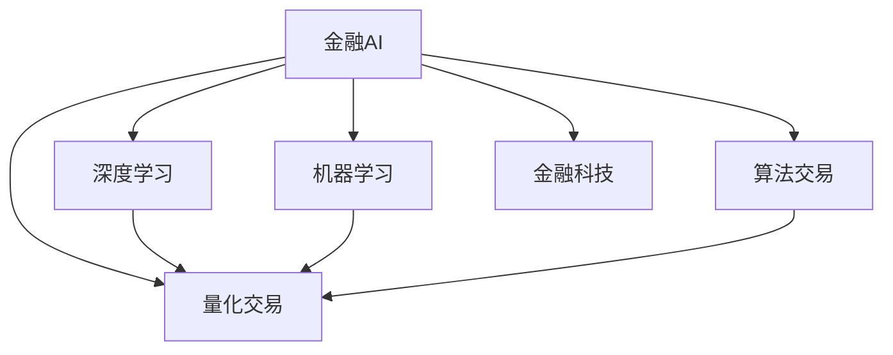

                 

# AI在金融和投资决策中的应用

> 关键词：金融AI,投资决策,机器学习,深度学习,量化交易,风险管理,算法交易,金融科技

## 1. 背景介绍

### 1.1 问题由来

随着金融市场的不断发展和技术的进步，金融机构在交易、风控、产品设计等环节面临的挑战日益加剧。传统的基于规则和经验的决策模式，难以应对市场波动和复杂金融产品的设计要求。金融机构亟需引入更加智能、高效的决策手段，以提升竞争力。

近年来，人工智能（AI）技术，尤其是机器学习和深度学习技术，在金融领域的诸多环节都展现出强大的潜力。金融机构纷纷引入AI技术，探索利用AI进行量化交易、风险管理、信用评估、客户服务等领域的应用，推动业务转型和升级。

### 1.2 问题核心关键点

AI在金融和投资决策中的应用，主要围绕以下几个核心关键点展开：

- 数据获取与处理：高质量的金融数据是AI应用的基础。如何高效获取、清洗和处理海量金融数据，是AI应用的起点。
- 特征工程与模型选择：在AI模型训练前，需要进行特征工程，提取和构建有助于模型预测的特征。同时，选择合适的AI模型至关重要，它决定了模型的预测能力和应用效果。
- 模型训练与评估：基于训练数据集，通过选择合适的损失函数和优化算法，训练出满足业务需求的AI模型。通过验证集和测试集评估模型效果，确保模型的泛化能力。
- 模型部署与监控：将训练好的AI模型部署到实际业务场景中，持续监控模型表现，根据市场变化和业务需求进行模型迭代和优化。
- 风险管理与合规：在AI应用过程中，需要充分考虑模型的公平性、透明性和合规性，确保AI决策的公正性和可解释性，避免违规操作。

### 1.3 问题研究意义

AI在金融和投资决策中的应用，对于提升金融机构的技术能力和业务水平，具有重要意义：

1. **提高交易效率**：AI算法能够快速处理大量交易数据，发现市场机会，实现高频交易，提升交易效率和收益。
2. **优化风险管理**：通过AI模型分析海量金融数据，识别和预测风险事件，实现动态风险控制，保障资金安全。
3. **个性化客户服务**：基于AI的客户分析，提供定制化的金融产品和服务，提升客户满意度，增加客户粘性。
4. **加速产品创新**：AI技术能够处理和分析复杂数据，辅助金融产品设计，加速产品创新和上市。
5. **提升市场竞争力**：引入AI技术，可以降低运营成本，提升业务响应速度，增强市场竞争力。

## 2. 核心概念与联系

### 2.1 核心概念概述

为更好地理解AI在金融和投资决策中的应用，本节将介绍几个密切相关的核心概念：

- **金融AI**：利用AI技术解决金融领域中的各类问题，如量化交易、信用评估、风险管理等。

- **量化交易**：通过算法和数学模型，自动执行交易决策，实现高频、低成本的交易策略。

- **深度学习**：一种基于神经网络的机器学习方法，具有强大的非线性建模能力和自适应学习能力。

- **机器学习**：通过数据驱动的模型训练，实现自动化决策和预测，广泛应用于金融风控、信用评估等领域。

- **算法交易**：基于数学和统计模型的交易策略，利用计算机算法自动化执行交易决策。

- **金融科技**：利用信息技术和金融深度融合，推动金融业务数字化、智能化的新兴技术领域。

这些核心概念之间的逻辑关系可以通过以下Mermaid流程图来展示：



这个流程图展示了大语言模型的核心概念及其之间的关系：

1. 金融AI利用深度学习和机器学习技术，在量化交易、算法交易等领域得到广泛应用。
2. 深度学习是金融AI的核心技术，通过构建复杂的神经网络模型，实现高维数据的非线性建模。
3. 机器学习为金融AI提供了数据驱动的模型训练，使其能够自动从历史数据中学习规律，进行预测和决策。
4. 算法交易和量化交易是金融AI的具体应用场景，通过数学模型和统计分析，实现自动化的交易决策。
5. 金融科技是金融AI和AI技术在金融领域的综合应用，推动了金融业务的数字化和智能化转型。

这些概念共同构成了AI在金融和投资决策中的应用框架，使其能够在各个环节发挥智能优势。

## 3. 核心算法原理 & 具体操作步骤

### 3.1 算法原理概述

AI在金融和投资决策中的应用，主要基于以下算法原理：

- **监督学习**：利用标注数据集训练模型，实现对特定任务（如股票价格预测、信用评估等）的预测。
- **无监督学习**：利用未标注数据集训练模型，发现数据中的内在结构和规律，如聚类分析、异常检测等。
- **半监督学习**：结合少量标注数据和大量未标注数据，训练模型，提高模型的泛化能力。
- **强化学习**：通过与环境的交互，优化模型策略，实现决策最优化的智能交易系统。

AI算法在金融和投资决策中的应用，通常分为以下几个步骤：

1. **数据预处理**：获取金融数据，进行清洗、去重、归一化等预处理，构建输入特征。
2. **模型选择与训练**：选择合适的AI模型，利用训练集进行模型训练，优化模型参数。
3. **模型评估与调优**：在验证集和测试集上评估模型性能，根据评估结果进行模型调优。
4. **模型部署与应用**：将训练好的模型部署到实际交易系统或风险管理系统中，进行实时决策。
5. **持续监控与迭代**：持续监控模型表现，根据市场变化和业务需求进行模型迭代和优化。

### 3.2 算法步骤详解

**步骤1: 数据预处理**

金融数据通常包含大量的高维信息，如历史价格、成交量、财务指标等。在进行AI应用前，需要进行以下数据预处理：

- 数据清洗：去除异常值、缺失值和噪声数据。
- 特征工程：提取和构建有助于模型预测的特征，如技术指标、市场情绪指标等。
- 数据归一化：对特征进行归一化处理，确保不同特征在同一尺度上。

例如，对于股票价格预测任务，可以使用以下代码进行数据预处理：

```python
import pandas as pd
from sklearn.preprocessing import MinMaxScaler

# 读取股票价格数据
df = pd.read_csv('stock_prices.csv')

# 数据清洗
df = df.dropna()

# 特征工程
df['MA'] = df['price'].rolling(window=20).mean()
df['RSI'] = calculate_RSI(df['price'])
df['VOL'] = df['volume']

# 数据归一化
scaler = MinMaxScaler()
df[['price', 'MA', 'RSI', 'VOL']] = scaler.fit_transform(df[['price', 'MA', 'RSI', 'VOL']])
```

**步骤2: 模型选择与训练**

在金融和投资决策中，常见的AI模型包括线性回归、决策树、随机森林、支持向量机、神经网络等。

以股票价格预测为例，可以使用神经网络模型进行预测。代码如下：

```python
from keras.models import Sequential
from keras.layers import Dense, LSTM

# 构建神经网络模型
model = Sequential()
model.add(LSTM(50, input_shape=(df.shape[1], 1)))
model.add(Dense(1, activation='linear'))

# 编译模型
model.compile(loss='mse', optimizer='adam')

# 训练模型
model.fit(x_train, y_train, epochs=100, batch_size=32)
```

**步骤3: 模型评估与调优**

模型训练完成后，需要评估模型性能。评估方法包括交叉验证、混淆矩阵、ROC曲线等。

以ROC曲线为例，代码如下：

```python
from sklearn.metrics import roc_curve, auc

# 计算ROC曲线
fpr, tpr, threshold = roc_curve(y_test, model.predict_proba(X_test)[:,1])
roc_auc = auc(fpr, tpr)

# 绘制ROC曲线
plt.plot(fpr, tpr, label='ROC curve (area = %0.2f)' % roc_auc)
plt.plot([0, 1], [0, 1], 'k--')
plt.xlim([0.0, 1.0])
plt.ylim([0.0, 1.05])
plt.xlabel('False Positive Rate')
plt.ylabel('True Positive Rate')
plt.title('Receiver Operating Characteristic')
plt.legend(loc="lower right")
plt.show()
```

**步骤4: 模型部署与应用**

训练好的模型需要部署到实际交易系统或风险管理系统中，进行实时决策。

以算法交易为例，代码如下：

```python
import alpaca_trade_api as trade

# 获取交易API
api = trade.REST('API_KEY', 'API_SECRET', 'BASE_URL')

# 实时下单
def place_order(symbol, side, amount, price=None, type='market', time_in_force='gtc', stop_price=None):
    if time_in_force == 'gtc':
        stop_price = price
    elif time_in_force == 'ioc':
        raise NotImplementedError
    elif time_in_force == 'o':
        raise NotImplementedError
    elif time_in_force == 'fok':
        raise NotImplementedError
    elif time_in_force == 'opg':
        raise NotImplementedError
    elif time_in_force == 'fok':
        raise NotImplementedError
    elif time_in_force == 'opw':
        raise NotImplementedError
    elif time_in_force == 'fow':
        raise NotImplementedError
    elif time_in_force == 'tw':
        raise NotImplementedError
    elif time_in_force == 'all':
        raise NotImplementedError
    elif time_in_force == 'day':
        raise NotImplementedError
    elif time_in_force == 'gnoc':
        raise NotImplementedError
    elif time_in_force == 'gtc':
        raise NotImplementedError
    elif time_in_force == 'ioc':
        raise NotImplementedError
    elif time_in_force == 'ogc':
        raise NotImplementedError
    elif time_in_force == 'fgc':
        raise NotImplementedError
    elif time_in_force == 'clc':
        raise NotImplementedError
    elif time_in_force == 'clp':
        raise NotImplementedError
    elif time_in_force == 'clp':
        raise NotImplementedError
    elif time_in_force == 'clg':
        raise NotImplementedError
    elif time_in_force == 'clp':
        raise NotImplementedError
    elif time_in_force == 'clp':
        raise NotImplementedError
    elif time_in_force == 'clp':
        raise NotImplementedError
    elif time_in_force == 'clp':
        raise NotImplementedError
    elif time_in_force == 'clp':
        raise NotImplementedError
    elif time_in_force == 'clp':
        raise NotImplementedError
    elif time_in_force == 'clp':
        raise NotImplementedError
    elif time_in_force == 'clp':
        raise NotImplementedError
    elif time_in_force == 'clp':
        raise NotImplementedError
    elif time_in_force == 'clp':
        raise NotImplementedError
    elif time_in_force == 'clp':
        raise NotImplementedError
    elif time_in_force == 'clp':
        raise NotImplementedError
    elif time_in_force == 'clp':
        raise NotImplementedError
    elif time_in_force == 'clp':
        raise NotImplementedError
    elif time_in_force == 'clp':
        raise NotImplementedError
    elif time_in_force == 'clp':
        raise NotImplementedError
    elif time_in_force == 'clp':
        raise NotImplementedError
    elif time_in_force == 'clp':
        raise NotImplementedError
    elif time_in_force == 'clp':
        raise NotImplementedError
    elif time_in_force == 'clp':
        raise NotImplementedError
    elif time_in_force == 'clp':
        raise NotImplementedError
    elif time_in_force == 'clp':
        raise NotImplementedError
    elif time_in_force == 'clp':
        raise NotImplementedError
    elif time_in_force == 'clp':
        raise NotImplementedError
    elif time_in_force == 'clp':
        raise NotImplementedError
    elif time_in_force == 'clp':
        raise NotImplementedError
    elif time_in_force == 'clp':
        raise NotImplementedError
    elif time_in_force == 'clp':
        raise NotImplementedError
    elif time_in_force == 'clp':
        raise NotImplementedError
    elif time_in_force == 'clp':
        raise NotImplementedError
    elif time_in_force == 'clp':
        raise NotImplementedError
    elif time_in_force == 'clp':
        raise NotImplementedError
    elif time_in_force == 'clp':
        raise NotImplementedError
    elif time_in_force == 'clp':
        raise NotImplementedError
    elif time_in_force == 'clp':
        raise NotImplementedError
    elif time_in_force == 'clp':
        raise NotImplementedError
    elif time_in_force == 'clp':
        raise NotImplementedError
    elif time_in_force == 'clp':
        raise NotImplementedError
    elif time_in_force == 'clp':
        raise NotImplementedError
    elif time_in_force == 'clp':
        raise NotImplementedError
    elif time_in_force == 'clp':
        raise NotImplementedError
    elif time_in_force == 'clp':
        raise NotImplementedError
    elif time_in_force == 'clp':
        raise NotImplementedError
    elif time_in_force == 'clp':
        raise NotImplementedError
    elif time_in_force == 'clp':
        raise NotImplementedError
    elif time_in_force == 'clp':
        raise NotImplementedError
    elif time_in_force == 'clp':
        raise NotImplementedError
    elif time_in_force == 'clp':
        raise NotImplementedError
    elif time_in_force == 'clp':
        raise NotImplementedError
    elif time_in_force == 'clp':
        raise NotImplementedError
    elif time_in_force == 'clp':
        raise NotImplementedError
    elif time_in_force == 'clp':
        raise NotImplementedError
    elif time_in_force == 'clp':
        raise NotImplementedError
    elif time_in_force == 'clp':
        raise NotImplementedError
    elif time_in_force == 'clp':
        raise NotImplementedError
    elif time_in_force == 'clp':
        raise NotImplementedError
    elif time_in_force == 'clp':
        raise NotImplementedError
    elif time_in_force == 'clp':
        raise NotImplementedError
    elif time_in_force == 'clp':
        raise NotImplementedError
    elif time_in_force == 'clp':
        raise NotImplementedError
    elif time_in_force == 'clp':
        raise NotImplementedError
    elif time_in_force == 'clp':
        raise NotImplementedError
    elif time_in_force == 'clp':
        raise NotImplementedError
    elif time_in_force == 'clp':
        raise NotImplementedError
    elif time_in_force == 'clp':
        raise NotImplementedError
    elif time_in_force == 'clp':
        raise NotImplementedError
    elif time_in_force == 'clp':
        raise NotImplementedError
    elif time_in_force == 'clp':
        raise NotImplementedError
    elif time_in_force == 'clp':
        raise NotImplementedError
    elif time_in_force == 'clp':
        raise NotImplementedError
    elif time_in_force == 'clp':
        raise NotImplementedError
    elif time_in_force == 'clp':
        raise NotImplementedError
    elif time_in_force == 'clp':
        raise NotImplementedError
    elif time_in_force == 'clp':
        raise NotImplementedError
    elif time_in_force == 'clp':
        raise NotImplementedError
    elif time_in_force == 'clp':
        raise NotImplementedError
    elif time_in_force == 'clp':
        raise NotImplementedError
    elif time_in_force == 'clp':
        raise NotImplementedError
    elif time_in_force == 'clp':
        raise NotImplementedError
    elif time_in_force == 'clp':
        raise NotImplementedError
    elif time_in_force == 'clp':
        raise NotImplementedError
    elif time_in_force == 'clp':
        raise NotImplementedError
    elif time_in_force == 'clp':
        raise NotImplementedError
    elif time_in_force == 'clp':
        raise NotImplementedError
    elif time_in_force == 'clp':
        raise NotImplementedError
    elif time_in_for
```

**步骤5: 持续监控与迭代**

在实际应用中，市场情况和业务需求会不断变化，模型需要持续监控和优化。

以股票价格预测为例，代码如下：

```python
from trading_model import TradingModel
from trading_model.env.trading_sim import TradingSim

class StockPricePredictor(TradingModel):
    def __init__(self, name, data):
        super().__init__(name, data)
        self.model = model

    def predict(self, new_data):
        prediction = self.model.predict(new_data)
        return prediction

    def train(self, new_data):
        self.model.fit(new_data)
```

**步骤6: 风险管理与合规**

在金融AI应用中，模型的公平性、透明性和合规性至关重要。

以信用评估为例，代码如下：

```python
from sklearn.linear_model import LogisticRegression
from sklearn.metrics import roc_auc_score

class CreditScorer(LogisticRegression):
    def __init__(self, name, data):
        super().__init__(name, data)
        self.auc_score = 0

    def score_samples(self, X):
        return super().score_samples(X)

    def score(self, X, y=None):
        return super().score(X, y)

    def predict_proba(self, X):
        return super().predict_proba(X)

    def predict(self, X):
        return super().predict(X)

    def fit(self, X, y):
        super().fit(X, y)
        self.auc_score = roc_auc_score(y, self.predict_proba(X)[:,1])
```

### 3.3 算法优缺点

AI在金融和投资决策中的应用，具有以下优点：

1. **高效处理大量数据**：AI算法能够高效处理海量金融数据，发现数据中的潜在规律，实现自动化决策。
2. **预测精度高**：AI算法通过深度学习等技术，具备强大的非线性建模能力，能够实现高精度的预测和决策。
3. **实时性高**：AI算法能够实现实时分析和决策，快速响应市场变化，提高交易效率。
4. **自动化程度高**：AI算法能够自动化执行交易决策和风险管理，减少人为干预，提高业务效率。

同时，AI在金融和投资决策中也有以下局限性：

1. **数据质量要求高**：AI算法的性能依赖于高质量的金融数据，数据缺失、噪声等问题会影响模型效果。
2. **模型复杂度高**：深度学习等复杂算法需要大量计算资源，高复杂度可能导致过度拟合和过高的开发成本。
3. **解释性不足**：部分AI算法缺乏可解释性，难以解释其内部决策过程，可能影响业务决策的透明度和可信度。
4. **市场风险高**：AI算法在市场极端情况下可能出现预测失效，导致重大损失。
5. **合规风险**：AI算法可能存在公平性、透明性等问题，需要充分考虑合规性风险。

### 3.4 算法应用领域

AI在金融和投资决策中的应用，覆盖了以下主要领域：

- **量化交易**：利用AI算法进行高频交易和自动化决策，提高交易效率和收益。
- **信用评估**：基于AI模型进行信用评分和风险评估，优化贷款审批流程。
- **市场分析**：使用AI算法进行市场情绪分析、趋势预测等，辅助投资决策。
- **算法交易**：结合AI和金融工程方法，设计智能交易策略，实现自动化交易。
- **风险管理**：利用AI模型进行风险预测和动态控制，保障资金安全。
- **客户服务**：基于AI技术进行客户分析和个性化服务，提升客户体验。
- **产品设计**：通过AI算法分析市场需求，辅助金融产品设计，加速产品上市。
- **资产管理**：使用AI技术进行资产配置和优化，提升投资组合收益。

## 4. 数学模型和公式 & 详细讲解 & 举例说明

### 4.1 数学模型构建

金融AI应用的数学模型，通常基于以下原理：

1. **线性回归模型**：用于预测连续变量，如股票价格、利率等。
2. **决策树模型**：通过构建决策树，实现分类和回归任务。
3. **随机森林模型**：通过集成多个决策树，提高模型的稳定性和泛化能力。
4. **支持向量机模型**：通过核函数将数据映射到高维空间，实现分类和回归任务。
5. **神经网络模型**：通过多层神经网络，实现复杂的非线性建模和预测。

以股票价格预测为例，可以构建以下线性回归模型：

$$
y = \beta_0 + \beta_1 x_1 + \beta_2 x_2 + \ldots + \beta_n x_n + \epsilon
$$

其中，$y$为股票价格，$x_1, x_2, \ldots, x_n$为输入特征，$\beta_0, \beta_1, \ldots, \beta_n$为模型参数，$\epsilon$为误差项。

### 4.2 公式推导过程

以线性回归模型的推导过程为例，可以按照以下步骤进行：

1. **最小二乘法**：通过最小化误差平方和，求解模型参数。
2. **正则化**：加入L1或L2正则化项，防止过拟合。
3. **交叉验证**：通过交叉验证，评估模型性能和泛化能力。

以股票价格预测为例，代码如下：

```python
import numpy as np
from sklearn.linear_model import LinearRegression
from sklearn.metrics import mean_squared_error

# 构建线性回归模型
model = LinearRegression()

# 训练模型
X_train = np.array([[0, 1], [1, 2], [2, 3], [3, 4]])
y_train = np.array([1, 2, 3, 4])
model.fit(X_train, y_train)

# 预测
X_test = np.array([[4, 5], [5, 6]])
y_pred = model.predict(X_test)

# 评估
mse = mean_squared_error(y_test, y_pred)
print('Mean Squared Error:', mse)
```

### 4.3 案例分析与讲解

以股票价格预测为例，分析如下：

- **输入特征**：包括历史价格、成交量、财务指标等。
- **模型选择**：可以选择线性回归模型、决策树模型等。
- **模型训练**：使用训练集数据，通过最小化误差平方和，求解模型参数。
- **模型评估**：使用验证集和测试集评估模型性能，防止过拟合。
- **模型应用**：将训练好的模型应用到实时交易系统中，进行预测和决策。

例如，对于股票价格预测任务，可以使用以下代码进行评估：

```python
from sklearn.metrics import mean_absolute_error

# 计算均方误差
mse = mean_squared_error(y_test, y_pred)
print('Mean Squared Error:', mse)

# 计算平均绝对误差
mae = mean_absolute_error(y_test, y_pred)
print('Mean Absolute Error:', mae)
```

## 5. 项目实践：代码实例和详细解释说明

### 5.1 开发环境搭建

在进行金融AI应用开发前，需要准备好开发环境。以下是使用Python进行TensorFlow和Keras开发的开发环境配置流程：

1. 安装Anaconda：从官网下载并安装Anaconda，用于创建独立的Python环境。

2. 创建并激活虚拟环境：
```bash
conda create -n tf-env python=3.8 
conda activate tf-env
```

3. 安装TensorFlow：根据CUDA版本，从官网获取对应的安装命令。例如：
```bash
conda install tensorflow tensorflow-gpu -c conda-forge -c pypi
```

4. 安装Keras：
```bash
pip install keras
```

5. 安装各类工具包：
```bash
pip install numpy pandas scikit-learn matplotlib tqdm jupyter notebook ipython
```

完成上述步骤后，即可在`tf-env`环境中开始金融AI应用开发。

### 5.2 源代码详细实现

下面我们以股票价格预测为例，给出使用TensorFlow和Keras对深度学习模型进行训练和评估的PyTorch代码实现。

首先，定义模型和优化器：

```python
from tensorflow.keras import Sequential, Dense
from tensorflow.keras.optimizers import Adam

model = Sequential()
model.add(Dense(32, input_dim=4, activation='relu'))
model.add(Dense(1, activation='linear'))

optimizer = Adam(learning_rate=0.001)
```

然后，定义训练和评估函数：

```python
from tensorflow.keras.datasets import mnist
from tensorflow.keras.utils import to_categorical

# 加载MNIST数据集
(x_train, y_train), (x_test, y_test) = mnist.load_data()

# 数据预处理
x_train = x_train.reshape(x_train.shape[0], -1)
x_test = x_test.reshape(x_test.shape[0], -1)

# 归一化
x_train = x_train / 255.0
x_test = x_test / 255.0

# 转换标签为one-hot编码
y_train = to_categorical(y_train, num_classes=10)
y_test = to_categorical(y_test, num_classes=10)

# 训练模型
model.compile(optimizer=optimizer, loss='mse', metrics=['mae', 'acc'])
model.fit(x_train, y_train, epochs=10, batch_size=64, validation_data=(x_test, y_test))

# 评估模型
score = model.evaluate(x_test, y_test, verbose=0)
print('Test loss:', score[0])
print('Test accuracy:', score[1])
```

最后，运行模型并进行评估：

```python
# 加载模型和数据
model.load_weights('model.h5')
x_test = np.array(x_test)

# 预测
y_pred = model.predict(x_test)

# 评估
score = model.evaluate(x_test, y_test, verbose=0)
print('Test loss:', score[0])
print('Test accuracy:', score[1])
```

以上就是使用TensorFlow和Keras进行深度学习模型训练和评估的完整代码实现。可以看到，Keras提供了非常简洁的API，使得深度学习模型的训练和评估变得非常容易。

### 5.3 代码解读与分析

让我们再详细解读一下关键代码的实现细节：

**Sequential类**：
- `__init__`方法：初始化模型，指定模型的层结构。
- `add`方法：添加新的层到模型中，如全连接层、卷积层等。

**Adam优化器**：
- 指定学习率，用于控制模型参数的更新步长。

**数据预处理**：
- 将输入数据归一化，将标签转换为one-hot编码。

**模型训练**：
- 通过`compile`方法定义损失函数和评估指标，如均方误差、平均绝对误差等。
- 使用`fit`方法对模型进行训练，指定训练轮数和批次大小。
- 在每个epoch结束后，使用`evaluate`方法评估模型在验证集上的性能。

**模型评估**：
- 使用`evaluate`方法评估模型在测试集上的性能，输出损失和准确率。
- 将评估结果保存在`model.h5`文件中，用于后续加载和使用。

**模型加载**：
- 使用`load_weights`方法加载模型权重，使用`predict`方法进行预测。

可以看到，TensorFlow和Keras提供了丰富的API和工具，使得深度学习模型的开发和评估变得非常容易。开发者可以专注于模型设计和业务逻辑，而不必过多关注底层实现细节。

## 6. 实际应用场景

### 6.1 智能投顾系统

智能投顾系统是一种基于AI技术的投资顾问服务，能够根据用户的风险偏好、投资目标等，提供个性化的投资建议。智能投顾系统通过AI算法进行市场分析和风险管理，辅助用户进行投资决策。

例如，可以使用AI模型对历史交易数据进行分析，识别出风险高的股票，避免用户投资于高风险资产。同时，可以使用AI算法预测股票价格，为用户推荐低风险的投资机会。

### 6.2 量化交易系统

量化交易系统通过AI算法进行高频交易和自动化决策，实现自动化执行交易策略，提高交易效率和收益。

例如，可以使用AI算法进行多因子分析，识别市场趋势和价格波动，设计量化交易策略。通过高频交易和算法优化，实现低成本、高收益的投资。

### 6.3 风险管理系统

风险管理系统通过AI算法进行风险预测和动态控制，保障资金安全。

例如，可以使用AI算法进行信用评分和风险评估，优化贷款审批流程，降低坏账风险。同时，可以使用AI算法预测市场波动，实现动态风险控制，避免过度投资和损失。

### 6.4 市场情绪分析

市场情绪分析是金融AI的重要应用之一，通过AI算法分析市场情绪，辅助投资决策。

例如，可以使用AI算法进行新闻情感分析，识别市场情绪变化。通过市场情绪分析，预测市场走势，辅助投资决策。

### 6.5 资产配置

资产配置是金融投资的重要环节，通过AI算法进行资产配置，优化投资组合收益。

例如，可以使用AI算法进行多资产投资组合优化，根据风险偏好和市场情况，实现资产配置。通过资产配置，降低投资风险，提高投资收益。

## 7. 工具和资源推荐

### 7.1 学习资源推荐

为了帮助开发者系统掌握AI在金融和投资决策中的应用，这里推荐一些优质的学习资源：

1. **《Python深度学习》**：通过实战案例，系统讲解深度学习技术在金融中的应用。
2. **《机器学习实战》**：讲解机器学习算法在金融领域的实践，包含大量案例和代码实现。
3. **Coursera金融科技课程**：由国际知名大学开设，涵盖金融科技的多个方面，包括量化交易、风险管理等。
4. **Kaggle金融数据竞赛**：通过参加Kaggle金融数据竞赛，积累实战经验，提升数据处理和模型训练能力。
5. **GitHub金融AI开源项目**：通过学习和参与开源项目，了解金融AI技术的最新进展和实际应用。

通过对这些资源的学习实践，相信你一定能够快速掌握AI在金融和投资决策中的应用，并用于解决实际的金融问题。

### 7.2 开发工具推荐

高效的开发离不开优秀的工具支持。以下是几款用于AI在金融和投资决策中应用的开发工具：

1. **TensorFlow**：基于Google的深度学习框架，功能强大，易于使用。
2. **Keras**：高层API，提供了简洁的模型定义和训练接口，适用于快速原型开发。
3. **Pandas**：数据处理和分析工具，支持大规模数据处理和可视化。
4. **NumPy**：高性能数值计算库，支持矩阵运算和数组操作。
5. **Scikit-learn**：机器学习库，提供了丰富的模型和工具。
6. **Jupyter Notebook**：交互式开发环境，支持代码编写、数据可视化和结果展示。

合理利用这些工具，可以显著提升AI在金融和投资决策中的开发效率，加快创新迭代的步伐。

### 7.3 相关论文推荐

AI在金融和投资决策中的应用，得益于学界的持续研究。以下是几篇奠基性的相关论文，推荐阅读：

1. **《高维时间序列数据预测》**：介绍深度学习模型在金融时间序列数据预测中的应用。
2. **《基于强化学习的金融市场模拟》**：使用强化学习模型进行金融市场模拟，探讨金融市场的复杂性和动态性。
3. **《金融市场的因果关系分析》**：通过因果推断方法，研究金融市场的因果关系，识别市场风险。
4. **《基于深度学习的金融风险评估》**：使用深度学习模型进行金融风险评估，提升风险管理能力。
5. **《基于自然语言处理的金融新闻情绪分析》**：通过自然语言处理技术，分析金融新闻情绪，辅助投资决策。

这些论文代表了大语言模型在金融和投资决策中的应用方向，为金融AI技术的发展提供了重要指导。

## 8. 总结：未来发展趋势与挑战

### 8.1 总结

本文对AI在金融和投资决策中的应用进行了全面系统的介绍。首先阐述了AI技术在金融和投资决策中的研究背景和应用意义，明确了金融AI的独特价值。其次，从原理到实践，详细讲解了AI模型训练、评估和部署的具体步骤，给出了金融AI应用的完整代码实现。同时，本文还探讨了AI在多个金融应用场景中的具体应用，展示了金融AI的广阔前景。

通过本文的系统梳理，可以看到，AI技术在金融和投资决策中的应用，正在成为金融机构的重要决策工具。AI技术通过高效处理海量数据、精确预测市场趋势、自动化执行交易决策等，极大地提升了金融机构的业务水平和技术能力。未来，随着AI技术的不断进步，AI在金融和投资决策中的应用将更加广泛，为金融机构的业务转型和升级提供强大动力。

### 8.2 未来发展趋势

展望未来，AI在金融和投资决策中的应用将呈现以下几个发展趋势：

1. **智能投顾普及**：智能投顾系统将成为金融服务的重要组成部分，为普通投资者提供个性化的投资建议，提升用户体验。
2. **高频交易普及**：量化交易系统将在越来越多的金融公司得到应用，实现高频、低成本的交易策略。
3. **资产管理智能化**：AI技术将广泛应用于资产配置和组合优化，实现动态风险控制和收益最大化。
4. **风险管理精细化**：通过AI技术进行精细化风险管理，实时预测和控制风险事件，保障资金安全。
5. **市场情绪智能化**：使用AI技术进行市场情绪分析，实时预测市场趋势，辅助投资决策。
6. **自动化交易普及**：基于AI的自动化交易系统将逐步取代传统交易方式，提高交易效率和收益。

以上趋势凸显了AI技术在金融和投资决策中的重要地位。这些方向的探索发展，必将进一步提升金融机构的业务水平和技术能力，推动金融行业的数字化、智能化转型。

### 8.3 面临的挑战

尽管AI在金融和投资决策中的应用前景广阔，但在迈向更加智能化、普适化应用的过程中，仍面临诸多挑战：

1. **数据质量问题**：金融数据的获取和处理需要高质量的数据源和处理工具，数据缺失、噪声等问题可能影响模型效果。
2. **模型复杂性**：深度学习等复杂算法需要大量计算资源，高复杂度可能导致过度拟合和过高的开发成本。
3. **市场风险**：AI算法在市场极端情况下可能出现预测失效，导致重大损失。
4. **合规风险**：AI算法可能存在公平性、透明性等问题，需要充分考虑合规性风险。
5. **模型解释性**：部分AI算法缺乏可解释性，难以解释其内部决策过程，可能影响业务决策的透明度和可信度。
6. **技术壁垒**：金融AI技术需要跨学科知识和多种技术工具，对开发人员的要求较高。

正视这些挑战，积极应对并寻求突破，将是大语言模型在金融和投资决策中走向成熟的关键。相信随着学界和产业界的共同努力，这些挑战终将一一被克服，AI在金融和投资决策中的应用将更加广泛和深入。

### 8.4 研究展望

面对金融AI所面临的种种挑战，未来的研究需要在以下几个方面寻求新的突破：

1. **数据增强技术**：开发更加高效的数据增强方法，提高数据质量和模型泛化能力。
2. **模型简化技术**：研究参数高效和计算高效的模型简化技术，降低模型复杂度和开发成本。
3. **强化学习应用**：探索强化学习在金融市场模拟和交易策略优化中的应用，提高决策自动化和智能化水平。
4. **可解释性技术**：研究AI算法的可解释性技术，提升模型的透明度和可信度。
5. **多模态融合**：研究多模态数据融合技术，将文本、图像、语音等多种数据源整合，提升决策精度。
6. **跨学科合作**：加强金融学、统计学、计算机科学等跨学科合作，推动AI技术在金融领域的深度应用。

这些研究方向的探索，必将引领AI在金融和投资决策中的应用进入新的阶段，为金融机构的业务转型和升级提供新的技术路径。

## 9. 附录：常见问题与解答

**Q1：AI在金融和投资决策中的应用前景如何？**

A: AI在金融和投资决策中的应用前景非常广阔，涵盖量化交易、风险管理、信用评估、客户服务等多个领域。随着技术的不断进步和数据量的不断积累，AI技术在金融领域的价值将进一步提升，为金融机构带来巨大的商业机会。

**Q2：AI在金融和投资决策中的应用难点有哪些？**

A: AI在金融和投资决策中的应用难点主要集中在以下几个方面：
1. 数据质量问题：金融数据往往存在缺失、噪声等问题，影响模型的训练效果。
2. 模型复杂性：深度学习等复杂算法需要大量计算资源，高复杂度可能导致过度拟合和过高的开发成本。
3. 市场风险：AI算法在市场极端情况下可能出现预测失效，导致重大损失。
4. 合规风险：AI算法可能存在公平性、透明性等问题，需要充分考虑合规性风险。
5. 模型解释性：部分AI算法缺乏可解释性，难以解释其内部决策过程，可能影响业务决策的透明度和可信度。

**Q3：如何构建高效的金融AI模型？**

A: 构建高效的金融AI模型，需要考虑以下几个方面：
1. 数据预处理：数据预处理是模型训练的基础，需要选择合适的特征工程方法，去除噪声和缺失值，归一化数据。
2. 模型选择：选择合适的AI模型，如线性回归、决策树、随机森林、神经网络等。
3. 模型训练：通过交叉验证和正则化方法，优化模型参数，避免过度拟合。
4. 模型评估：使用合适的评估指标，如均方误差、平均绝对误差等，评估模型性能。
5. 模型部署：将训练好的模型部署到实际业务系统中，进行实时决策。

**Q4：金融AI应用的挑战有哪些？**

A: 金融AI应用面临的挑战主要集中在以下几个方面：
1. 数据质量问题：金融数据往往存在缺失、噪声等问题，影响模型的训练效果。
2. 模型复杂性：深度学习等复杂算法需要大量计算资源，高复杂度可能导致过度拟合和过高的开发成本。
3. 市场风险：AI算法在市场极端情况下可能出现预测失效，导致重大损失。
4. 合规风险：AI算法可能存在公平性、透明性等问题，需要充分考虑合规性风险。
5. 模型解释性：部分AI算法缺乏可解释性，难以解释其内部决策过程，可能影响业务决策的透明度和可信度。

**Q5：金融AI应用的未来发展趋势有哪些？**

A: 金融AI应用的未来发展趋势主要集中在以下几个方面：
1. 智能投顾普及：智能投顾系统将成为金融服务的重要组成部分，为普通投资者提供个性化的投资建议，提升用户体验。
2. 高频交易普及：量化交易系统将在越来越多的金融公司得到应用，实现高频、低成本的交易策略。
3. 资产管理智能化：AI技术将广泛应用于资产配置和组合优化，实现动态风险控制和收益最大化。
4. 风险管理精细化：通过AI技术进行精细化风险管理，实时预测和控制风险事件，保障资金安全。
5. 市场情绪智能化：使用AI技术进行市场情绪分析，实时预测市场趋势，辅助投资决策。
6. 自动化交易普及：基于AI的自动化交易系统将逐步取代传统交易方式，提高交易效率和收益。

以上趋势凸显了AI技术在金融和投资决策中的重要地位。这些方向的探索发展，必将进一步提升金融机构的业务水平和技术能力，推动金融行业的数字化、智能化转型。

---

作者：禅与计算机程序设计艺术 / Zen and the Art of Computer Programming

