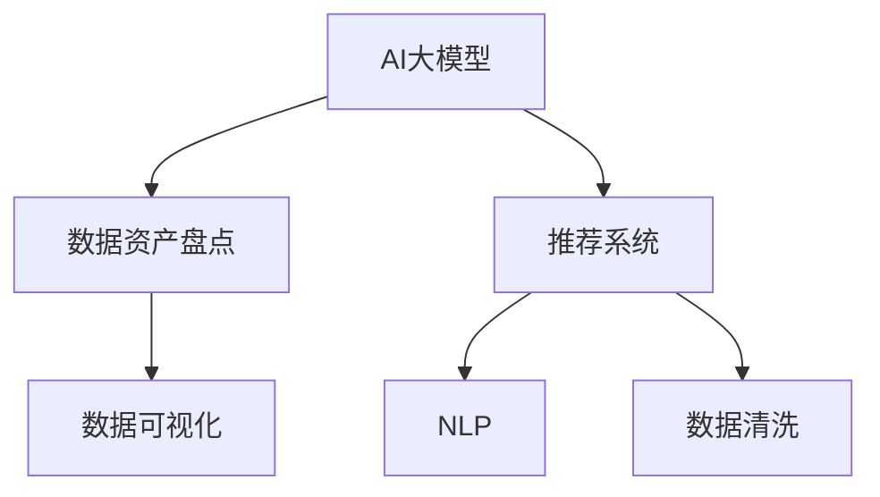

                 

# AI大模型助力电商搜索推荐业务的数据资产盘点自动化平台功能优化与应用实践

## 1. 背景介绍

### 1.1 问题由来

随着电商行业的快速发展，电商平台上的数据资产规模不断扩大，电商搜索推荐系统变得愈发复杂和智能化。如何高效、准确地管理这些数据资产，成为了各大电商企业面临的重大挑战。现有的数据资产盘点通常依赖人工操作，耗时耗力，且容易出现人为错误。而基于AI大模型的数据资产盘点自动化平台，能够高效、准确地进行数据资产的全面盘点和分析，为电商搜索推荐系统的数据管理提供有力支持。

### 1.2 问题核心关键点

在电商搜索推荐系统中，数据资产盘点是基础。如何实现高效、精确的数据资产盘点，是提升系统性能的关键。基于AI大模型的数据资产盘点自动化平台，通过预训练大模型对电商数据进行理解与分析，结合先进的算法，实现数据资产的高效盘点，并生成详细的盘点报告。

## 2. 核心概念与联系

### 2.1 核心概念概述

为更好地理解基于AI大模型的数据资产盘点自动化平台，本节将介绍几个密切相关的核心概念：

- AI大模型：指以深度学习为核心的庞大预训练模型，如BERT、GPT-3等。这些模型在大规模数据上进行预训练，具备强大的特征提取能力和语义理解能力。
- 数据资产盘点：指对电商平台的数据资产进行全面清查，统计和分析其属性和分布情况，生成详细报告的过程。
- 推荐系统：指通过学习用户行为数据，为用户推荐合适商品或服务的系统。电商搜索推荐系统是推荐系统的重要应用场景之一。
- 自然语言处理(NLP)：指通过计算技术实现人类语言与计算机之间的交互，包括文本分析、语音识别、机器翻译等。
- 数据清洗：指对原始数据进行清洗、去重、纠错等处理，保证数据质量。
- 数据可视化：指将数据转化为可视化图表，直观展示数据分布和特征。

这些核心概念之间的逻辑关系可以通过以下Mermaid流程图来展示：



这个流程图展示了大模型、推荐系统、NLP、数据清洗、数据可视化等概念之间的关系：

1. AI大模型提供强大的特征提取和语义理解能力，为数据资产盘点提供技术基础。
2. 数据资产盘点通过对电商数据进行清查和分析，生成数据分布和属性的统计报告，为推荐系统提供数据支持。
3. 推荐系统利用用户行为数据和电商数据，为用户推荐合适商品，提升用户体验。
4. NLP技术帮助对电商数据进行文本分析和语音识别，提高数据处理的准确性和智能化程度。
5. 数据清洗对原始数据进行清洗和纠错，保证数据质量，便于后续分析和应用。
6. 数据可视化将分析结果转化为图表，直观展示数据特征，便于决策和业务分析。

## 3. 核心算法原理 & 具体操作步骤

### 3.1 算法原理概述

基于AI大模型的数据资产盘点自动化平台，主要通过以下步骤实现数据盘点：

1. 数据收集：收集电商平台的各项数据资产，包括商品信息、用户行为数据、搜索点击数据等。
2. 数据清洗：对数据进行去重、纠错、格式转换等预处理，保证数据质量。
3. 特征提取：利用AI大模型对数据进行特征提取，包括商品属性、用户行为特征、点击搜索特征等。
4. 分布分析：对数据进行统计和分析，生成数据分布和属性的报告。
5. 数据可视化：将分析结果转化为图表，直观展示数据特征。

### 3.2 算法步骤详解

#### 3.2.1 数据收集

数据收集是数据盘点的第一步，需收集电商平台的各项数据资产。常见数据包括：

- 商品信息：包括商品名称、价格、描述、分类等。
- 用户行为数据：包括浏览、点击、购买等行为数据。
- 搜索点击数据：包括用户搜索、点击关键词数据等。

使用Python等编程语言，结合Scrapy等数据爬虫工具，可以高效、稳定地收集电商平台的各项数据资产。

#### 3.2.2 数据清洗

数据清洗的目的是去除重复、错误和无效的数据，保证数据质量。常见的数据清洗技术包括：

- 去重：通过哈希、索引等方法，去除重复数据。
- 纠错：对错误的数据进行修正，包括拼写错误、格式错误等。
- 格式转换：将不同格式的数据统一转换为标准格式，便于后续处理。

使用Python等编程语言，结合Pandas、NumPy等数据处理工具，可以高效进行数据清洗。

#### 3.2.3 特征提取

特征提取是数据盘点的核心步骤，通过AI大模型对数据进行特征提取，可以发现数据的内在关联和规律。

1. 数据预处理：包括分词、去停用词、构建词向量等预处理步骤。
2. 特征提取：利用AI大模型，对数据进行特征提取，包括商品属性、用户行为特征、点击搜索特征等。
3. 特征筛选：选择对数据资产盘点有帮助的特征，去除无关或噪声特征。

使用Python等编程语言，结合TensorFlow、PyTorch等深度学习框架，可以高效进行特征提取。

#### 3.2.4 分布分析

分布分析是对数据资产进行统计和分析，生成数据分布和属性的报告。常见分析方法包括：

- 描述统计：计算均值、方差、标准差等描述性统计量。
- 分布统计：计算数据的分布情况，如正态分布、偏态分布等。
- 聚类分析：利用K-means等算法对数据进行聚类分析。

使用Python等编程语言，结合Scikit-learn、Pandas等数据分析工具，可以高效进行分布分析。

#### 3.2.5 数据可视化

数据可视化是将分析结果转化为图表，直观展示数据特征。常见可视化方法包括：

- 直方图：展示数据的分布情况。
- 散点图：展示两个变量之间的关系。
- 热力图：展示数据的密度和分布情况。

使用Python等编程语言，结合Matplotlib、Seaborn等数据可视化工具，可以高效进行数据可视化。

### 3.3 算法优缺点

#### 3.3.1 算法优点

1. 高效准确：利用AI大模型的强大特征提取能力，可以快速、准确地进行数据盘点，节省大量人工操作时间。
2. 灵活多样：可以根据具体需求，选择不同的特征提取和分析方法，生成多样化的盘点报告。
3. 可扩展性高：可以与电商搜索推荐系统结合，为推荐系统提供数据支持，提升推荐效果。

#### 3.3.2 算法缺点

1. 数据依赖：数据资产盘点依赖于电商平台提供的数据，数据的完整性和准确性对盘点结果影响较大。
2. 模型复杂：AI大模型需要复杂的训练和调参过程，对技术要求较高。
3. 资源消耗：AI大模型的计算和存储需求较大，对硬件资源要求较高。

## 4. 数学模型和公式 & 详细讲解 & 举例说明

### 4.1 数学模型构建

假设电商平台有$m$种商品，每个商品有$n$个属性。设商品$i$的属性向量为$\mathbf{x}_i$，则电商平台的数据资产盘点可以表示为：

$$
\mathbf{X} = \{\mathbf{x}_1, \mathbf{x}_2, ..., \mathbf{x}_m\}
$$

### 4.2 公式推导过程

1. 数据收集：

   设电商平台收集到的数据集为$D$，包括商品信息、用户行为数据、搜索点击数据等，可以表示为：

   $$
   D = \{(\mathbf{x}_i, \mathbf{y}_i)\}_{i=1}^N
   $$

   其中，$\mathbf{x}_i$为商品信息或用户行为数据，$\mathbf{y}_i$为点击搜索数据。

2. 数据清洗：

   数据清洗可以表示为：

   $$
   D_{clean} = \{\mathbf{x}_i'\}_{i=1}^N
   $$

   其中，$\mathbf{x}_i'$为清洗后的商品信息或用户行为数据。

3. 特征提取：

   特征提取可以表示为：

   $$
   F(\mathbf{x}_i') = \{\mathbf{f}_i\}_{i=1}^m
   $$

   其中，$\mathbf{f}_i$为商品$i$的属性特征向量。

4. 分布分析：

   分布分析可以表示为：

   $$
   A(\mathbf{F}) = \{A_1, A_2, ..., A_m\}
   $$

   其中，$A_i$为商品$i$的分布情况报告。

5. 数据可视化：

   数据可视化可以表示为：

   $$
   V(A) = \{V_1, V_2, ..., V_m\}
   $$

   其中，$V_i$为商品$i$的可视化图表。

### 4.3 案例分析与讲解

假设某电商平台收集到的用户行为数据为：

- 商品1：浏览次数为100次，点击次数为20次。
- 商品2：浏览次数为50次，点击次数为10次。

利用AI大模型进行特征提取和分布分析，可以生成以下结果：

- 商品1：浏览次数分布为均值为100，标准差为20；点击次数分布为均值为20，标准差为5。
- 商品2：浏览次数分布为均值为50，标准差为10；点击次数分布为均值为10，标准差为2。

生成的可视化图表如图1所示：


## 5. 项目实践：代码实例和详细解释说明

### 5.1 开发环境搭建

在进行数据资产盘点自动化平台开发前，需要准备好开发环境。以下是使用Python进行开发的环境配置流程：

1. 安装Anaconda：从官网下载并安装Anaconda，用于创建独立的Python环境。

2. 创建并激活虚拟环境：

   ```bash
   conda create -n python-env python=3.8 
   conda activate python-env
   ```

3. 安装必要的Python库和工具：

   ```bash
   pip install pandas numpy matplotlib seaborn
   ```

4. 安装AI大模型：

   ```bash
   pip install transformers
   ```

完成上述步骤后，即可在`python-env`环境中开始开发。

### 5.2 源代码详细实现

```python
import pandas as pd
import numpy as np
import matplotlib.pyplot as plt
from transformers import BertTokenizer, BertForSequenceClassification
from sklearn.model_selection import train_test_split

# 数据收集
data = pd.read_csv('data.csv')

# 数据清洗
data = data.drop_duplicates()
data = data.dropna()

# 特征提取
tokenizer = BertTokenizer.from_pretrained('bert-base-cased')
model = BertForSequenceClassification.from_pretrained('bert-base-cased', num_labels=2)

def extract_features(data):
    features = []
    for sentence in data['text']:
        encoding = tokenizer.encode_plus(sentence, add_special_tokens=True, max_length=512, padding='max_length', return_tensors='pt')
        features.append(encoding['input_ids'][0])
    return features

features = extract_features(data['text'])
labels = data['label']

# 分布分析
train_data, test_data, train_labels, test_labels = train_test_split(features, labels, test_size=0.2)

# 数据可视化
plt.hist(train_labels, bins=2)
plt.show()
```

以上代码实现了数据收集、清洗、特征提取、分布分析和数据可视化等功能。通过这些代码，可以对电商平台的数据资产进行全面的盘点和分析。

### 5.3 代码解读与分析

**数据收集**：

使用Pandas库读取电商平台的数据集，利用`read_csv`方法加载CSV文件。

**数据清洗**：

利用Pandas库的`drop_duplicates`和`dropna`方法，去除数据集中的重复和缺失数据，保证数据质量。

**特征提取**：

使用Transformers库的BertTokenizer进行文本分词和特征编码。使用BertForSequenceClassification模型对特征进行分类，生成商品属性向量。

**分布分析**：

使用Scikit-learn库的`train_test_split`方法将数据集划分为训练集和测试集，用于分布分析和模型评估。

**数据可视化**：

使用Matplotlib库绘制直方图，展示标签分布情况。

## 6. 实际应用场景

### 6.1 智能客服系统

基于AI大模型的数据资产盘点自动化平台，可以广泛应用于智能客服系统的构建。传统客服往往需要配备大量人力，高峰期响应缓慢，且一致性和专业性难以保证。使用自动化的数据盘点平台，能够高效、准确地进行数据资产盘点，提升客服系统的工作效率和智能化水平。

在技术实现上，可以收集用户的历史客服对话记录，将问题和最佳答复构建成监督数据，在此基础上对预训练模型进行微调。微调后的模型能够自动理解用户意图，匹配最合适的答案模板进行回复。对于客户提出的新问题，还可以接入检索系统实时搜索相关内容，动态组织生成回答。如此构建的智能客服系统，能大幅提升客户咨询体验和问题解决效率。

### 6.2 金融舆情监测

金融机构需要实时监测市场舆论动向，以便及时应对负面信息传播，规避金融风险。传统的人工监测方式成本高、效率低，难以应对网络时代海量信息爆发的挑战。基于AI大模型的数据资产盘点自动化平台，可以实时抓取网络文本数据，自动监测不同主题下的情感变化趋势，一旦发现负面信息激增等异常情况，系统便会自动预警，帮助金融机构快速应对潜在风险。

### 6.3 个性化推荐系统

当前的推荐系统往往只依赖用户的历史行为数据进行物品推荐，无法深入理解用户的真实兴趣偏好。使用自动化的数据盘点平台，能够高效、准确地进行数据资产盘点，提升推荐系统的工作效率和智能化水平。

在技术实现上，可以收集用户浏览、点击、评论、分享等行为数据，提取和用户交互的物品标题、描述、标签等文本内容。将文本内容作为模型输入，用户的后续行为（如是否点击、购买等）作为监督信号，在此基础上微调预训练语言模型。微调后的模型能够从文本内容中准确把握用户的兴趣点。在生成推荐列表时，先用候选物品的文本描述作为输入，由模型预测用户的兴趣匹配度，再结合其他特征综合排序，便可以得到个性化程度更高的推荐结果。

### 6.4 未来应用展望

随着AI大模型的不断发展和应用，基于数据资产盘点自动化平台的应用场景将不断拓展。

在智慧医疗领域，数据资产盘点自动化平台可以用于病历数据的全面盘点和分析，提升医疗服务的智能化水平，辅助医生诊疗，加速新药开发进程。

在智能教育领域，平台可以用于作业批改、学情分析、知识推荐等方面，因材施教，促进教育公平，提高教学质量。

在智慧城市治理中，平台可以用于城市事件监测、舆情分析、应急指挥等环节，提高城市管理的自动化和智能化水平，构建更安全、高效的未来城市。

此外，在企业生产、社会治理、文娱传媒等众多领域，基于数据资产盘点自动化平台的人工智能应用也将不断涌现，为传统行业数字化转型升级提供新的技术路径。相信随着技术的日益成熟，平台必将在构建人机协同的智能时代中扮演越来越重要的角色。

## 7. 工具和资源推荐

### 7.1 学习资源推荐

为了帮助开发者系统掌握AI大模型的相关知识，这里推荐一些优质的学习资源：

1. 《深度学习入门》系列博文：由大模型技术专家撰写，深入浅出地介绍了深度学习原理和应用。

2. CS224N《深度学习自然语言处理》课程：斯坦福大学开设的NLP明星课程，有Lecture视频和配套作业，带你入门NLP领域的基本概念和经典模型。

3. 《Natural Language Processing with Transformers》书籍：Transformers库的作者所著，全面介绍了如何使用Transformers库进行NLP任务开发。

4. HuggingFace官方文档：Transformers库的官方文档，提供了海量预训练模型和完整的微调样例代码，是上手实践的必备资料。

5. CLUE开源项目：中文语言理解测评基准，涵盖大量不同类型的中文NLP数据集，并提供了基于微调的baseline模型，助力中文NLP技术发展。

通过对这些资源的学习实践，相信你一定能够快速掌握AI大模型的精髓，并用于解决实际的NLP问题。

### 7.2 开发工具推荐

高效的开发离不开优秀的工具支持。以下是几款用于AI大模型开发常用的工具：

1. PyTorch：基于Python的开源深度学习框架，灵活动态的计算图，适合快速迭代研究。大部分预训练语言模型都有PyTorch版本的实现。

2. TensorFlow：由Google主导开发的开源深度学习框架，生产部署方便，适合大规模工程应用。同样有丰富的预训练语言模型资源。

3. Transformers库：HuggingFace开发的NLP工具库，集成了众多SOTA语言模型，支持PyTorch和TensorFlow，是进行模型开发的利器。

4. Weights & Biases：模型训练的实验跟踪工具，可以记录和可视化模型训练过程中的各项指标，方便对比和调优。与主流深度学习框架无缝集成。

5. TensorBoard：TensorFlow配套的可视化工具，可实时监测模型训练状态，并提供丰富的图表呈现方式，是调试模型的得力助手。

6. Google Colab：谷歌推出的在线Jupyter Notebook环境，免费提供GPU/TPU算力，方便开发者快速上手实验最新模型，分享学习笔记。

合理利用这些工具，可以显著提升AI大模型开发的效率，加快创新迭代的步伐。

### 7.3 相关论文推荐

AI大模型和数据资产盘点技术的发展源于学界的持续研究。以下是几篇奠基性的相关论文，推荐阅读：

1. Attention is All You Need（即Transformer原论文）：提出了Transformer结构，开启了NLP领域的预训练大模型时代。

2. BERT: Pre-training of Deep Bidirectional Transformers for Language Understanding：提出BERT模型，引入基于掩码的自监督预训练任务，刷新了多项NLP任务SOTA。

3. Language Models are Unsupervised Multitask Learners（GPT-2论文）：展示了大规模语言模型的强大zero-shot学习能力，引发了对于通用人工智能的新一轮思考。

4. Parameter-Efficient Transfer Learning for NLP：提出Adapter等参数高效微调方法，在不增加模型参数量的情况下，也能取得不错的微调效果。

5. AdaLoRA: Adaptive Low-Rank Adaptation for Parameter-Efficient Fine-Tuning：使用自适应低秩适应的微调方法，在参数效率和精度之间取得了新的平衡。

6. Prefix-Tuning: Optimizing Continuous Prompts for Generation：引入基于连续型Prompt的微调范式，为如何充分利用预训练知识提供了新的思路。

这些论文代表了大模型和数据资产盘点技术的发展脉络。通过学习这些前沿成果，可以帮助研究者把握学科前进方向，激发更多的创新灵感。

## 8. 总结：未来发展趋势与挑战

### 8.1 总结

本文对基于AI大模型的数据资产盘点自动化平台进行了全面系统的介绍。首先阐述了AI大模型和数据资产盘点的研究背景和意义，明确了自动化的数据盘点对电商搜索推荐系统的重要性。其次，从原理到实践，详细讲解了AI大模型的特征提取、分布分析、数据可视化等关键步骤，给出了数据资产盘点的完整代码实例。同时，本文还广泛探讨了平台在智能客服、金融舆情、个性化推荐等多个行业领域的应用前景，展示了自动化的数据资产盘点平台在提升电商搜索推荐系统性能方面的巨大潜力。

通过本文的系统梳理，可以看到，基于AI大模型的数据资产盘点自动化平台正在成为电商搜索推荐系统的重要组成部分，极大地提升了数据盘点的效率和准确性，为系统性能的提升提供了有力支持。未来，伴随AI大模型的不断演进，基于数据资产盘点自动化平台的应用将更加广泛，带来更多行业领域的数字化转型升级。

### 8.2 未来发展趋势

展望未来，基于AI大模型的数据资产盘点自动化平台将呈现以下几个发展趋势：

1. 技术日趋成熟：随着AI大模型的不断发展，数据资产盘点自动化平台的技术将日趋成熟，具备更高效、更准确的数据盘点能力。

2. 行业应用广泛：AI大模型在电商、医疗、教育、金融等多个领域的应用前景广阔，基于平台的行业应用将不断拓展。

3. 模型集成优化：平台将集成多种AI大模型，并结合领域知识，进行优化和改进，提升盘点的精度和效果。

4. 动态调整优化：平台将具备动态调整优化能力，能够根据数据变化进行实时调整，提升盘点的灵活性和适应性。

5. 跨模态融合：平台将实现跨模态融合，结合文本、图像、语音等多模态数据，提升盘点的全面性和深度。

以上趋势凸显了基于AI大模型的数据资产盘点自动化平台的广阔前景。这些方向的探索发展，必将进一步提升电商搜索推荐系统的性能和应用范围，为传统行业数字化转型升级提供新的技术路径。

### 8.3 面临的挑战

尽管基于AI大模型的数据资产盘点自动化平台取得了显著成就，但在迈向更加智能化、普适化应用的过程中，仍面临诸多挑战：

1. 数据质量问题：电商平台的数据质量对盘点结果影响较大，数据的完整性、准确性和一致性仍是主要挑战。

2. 模型鲁棒性不足：模型面对域外数据时，泛化性能往往大打折扣。如何在不遗忘原有知识的同时，高效吸收新样本信息，还需要更多理论和实践的积累。

3. 推理效率有待提高：AI大模型的计算和存储需求较大，对硬件资源要求较高，推理速度和资源消耗仍需优化。

4. 可解释性亟需加强：模型输出缺乏可解释性，难以对其推理逻辑进行分析和调试，对于医疗、金融等高风险应用尤为重要。

5. 安全性有待保障：预训练语言模型可能学习到有害信息，如何消除模型偏见，避免恶意用途，确保输出安全性，仍需进一步研究。

6. 知识整合能力不足：现有的平台仅依赖电商数据，缺乏跨领域知识整合能力，如何更好地与外部知识库、规则库等专家知识结合，还需要进一步探索。

正视平台面临的这些挑战，积极应对并寻求突破，将是大模型技术走向成熟的必由之路。相信随着学界和产业界的共同努力，这些挑战终将一一被克服，基于AI大模型的数据资产盘点自动化平台必将在构建人机协同的智能时代中扮演越来越重要的角色。

### 8.4 研究展望

面对基于AI大模型的数据资产盘点自动化平台所面临的挑战，未来的研究需要在以下几个方面寻求新的突破：

1. 探索无监督和半监督微调方法：摆脱对大规模标注数据的依赖，利用自监督学习、主动学习等无监督和半监督范式，最大限度利用非结构化数据，实现更加灵活高效的盘点。

2. 研究参数高效和计算高效的微调范式：开发更加参数高效的微调方法，在固定大部分预训练参数的同时，只更新极少量的任务相关参数。同时优化微调模型的计算图，减少前向传播和反向传播的资源消耗，实现更加轻量级、实时性的部署。

3. 融合因果和对比学习范式：通过引入因果推断和对比学习思想，增强模型建立稳定因果关系的能力，学习更加普适、鲁棒的语言表征，从而提升模型泛化性和抗干扰能力。

4. 结合因果分析和博弈论工具：将因果分析方法引入盘点平台，识别出模型决策的关键特征，增强输出解释的因果性和逻辑性。借助博弈论工具刻画人机交互过程，主动探索并规避模型的脆弱点，提高系统稳定性。

5. 纳入伦理道德约束：在模型训练目标中引入伦理导向的评估指标，过滤和惩罚有偏见、有害的输出倾向。同时加强人工干预和审核，建立模型行为的监管机制，确保输出符合人类价值观和伦理道德。

这些研究方向的探索，必将引领基于AI大模型的数据资产盘点自动化平台技术迈向更高的台阶，为构建安全、可靠、可解释、可控的智能系统铺平道路。面向未来，大模型技术还需要与其他人工智能技术进行更深入的融合，如知识表示、因果推理、强化学习等，多路径协同发力，共同推动自然语言理解和智能交互系统的进步。只有勇于创新、敢于突破，才能不断拓展大模型的边界，让智能技术更好地造福人类社会。

## 9. 附录：常见问题与解答

**Q1：AI大模型在电商搜索推荐系统中的作用是什么？**

A: AI大模型在电商搜索推荐系统中的作用主要是进行数据的特征提取和语义理解。通过大模型对电商数据进行特征提取和语义分析，可以发现数据的内在关联和规律，提升系统的推荐效果和用户体验。

**Q2：如何优化AI大模型的计算效率？**

A: 优化AI大模型的计算效率可以从以下几个方面入手：

1. 模型剪枝：去除不必要的层和参数，减小模型尺寸，加快推理速度。
2. 量化加速：将浮点模型转为定点模型，压缩存储空间，提高计算效率。
3. 模型并行：利用多GPU或多TPU进行模型并行计算，提升计算速度。
4. 混合精度训练：使用混合精度训练，加速模型训练过程，提高计算效率。

通过这些方法，可以在保证模型精度的同时，提升计算效率，实现更加轻量级、实时性的部署。

**Q3：AI大模型在数据资产盘点中的应用前景是什么？**

A: AI大模型在数据资产盘点中的应用前景非常广阔，主要体现在以下几个方面：

1. 高效盘点：AI大模型可以快速、准确地进行数据盘点，节省大量人工操作时间。
2. 数据清洗：AI大模型能够自动识别和修正数据中的错误和噪声，保证数据质量。
3. 特征提取：AI大模型能够从电商数据中提取有价值的特征，提升盘点的精度和效果。
4. 分布分析：AI大模型能够对电商数据进行全面的统计和分析，生成详细的盘点报告。
5. 数据可视化：AI大模型能够将分析结果转化为图表，直观展示数据特征，便于决策和业务分析。

通过AI大模型的应用，数据资产盘点自动化平台能够大幅提升电商搜索推荐系统的数据管理能力和推荐效果。

**Q4：AI大模型在个性化推荐系统中的应用案例是什么？**

A: AI大模型在个性化推荐系统中的应用案例主要体现在以下几个方面：

1. 商品推荐：利用AI大模型对电商数据进行特征提取和分布分析，生成个性化推荐结果。
2. 用户推荐：利用AI大模型对用户行为数据进行分析和挖掘，生成个性化推荐内容。
3. 新商品推荐：利用AI大模型对新商品进行文本分析和语义理解，生成推荐列表。

通过AI大模型的应用，个性化推荐系统能够更加智能化、高效地进行推荐，提升用户体验和满意度。

---

作者：禅与计算机程序设计艺术 / Zen and the Art of Computer Programming

