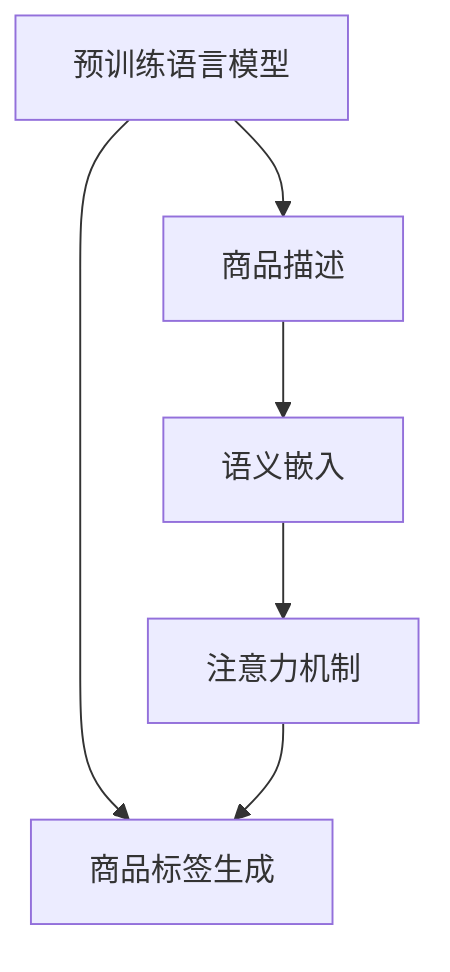

                 

# AI大模型在商品标签生成中的应用

## 1. 背景介绍

在现代社会，商品标签生成已成为一种重要的电商运营手段。合理、准确的商品标签不仅能提升消费者的购物体验，还能显著提高商家的销售效率。传统的商品标签生成方法，如基于词频统计的TF-IDF算法，存在数据稀疏、表现力不足等问题。相比之下，利用预训练语言模型进行商品标签生成，可显著提升标签的丰富性和准确性。

### 1.1 问题由来

随着深度学习技术的不断进步，预训练语言模型已逐渐应用于各种文本生成任务，例如自然语言描述生成、文本分类、信息抽取等。近年来，包括BERT、GPT-2等在内的一系列预训练语言模型在电商领域也有显著应用。具体而言，这些模型被用于商品标签生成、商品评价生成、搜索推荐等任务中，实现了显著的效果提升。

### 1.2 问题核心关键点

商品标签生成任务的核心在于，如何将商品的语义信息转化为可被用户快速理解、搜索的标签。目前的预训练语言模型已具备强大的语义表示能力，能够在海量的文本语料中学习到丰富的语言知识，被广泛用于商品标签生成任务。但是，如何更有效地从商品描述中提取语义信息，并将其转换为具体、清晰的标签，仍是一个亟待解决的问题。

### 1.3 问题研究意义

利用大模型进行商品标签生成，不仅能显著提升商品标签的质量，还能使电商平台的商品管理和搜索更加精准，提升用户体验，提高商家运营效率。未来，基于预训练语言模型的商品标签生成技术有望成为电商运营的重要工具，促进电商平台的智能化和个性化发展。

## 2. 核心概念与联系

### 2.1 核心概念概述

为更好地理解基于预训练语言模型的商品标签生成方法，本节将介绍几个关键概念：

- 预训练语言模型(Pre-trained Language Model, PLM)：基于大规模无标签文本语料进行自监督学习的语言模型。通过自监督任务训练，获得广泛的语言知识和常识，具备强大的语义表示能力。
- 商品标签生成：给定商品的自然语言描述，生成一组或多个可供用户快速理解的标签，以方便搜索和浏览。
- 商品描述：商品属性、功能、用途等的自然语言描述，为商品标签生成提供语义信息。
- 语义嵌入(Semantic Embedding)：将文本转换为低维向量空间中的点，通过向量距离计算文本的相似度，用于商品标签生成。
- 注意力机制(Attention Mechanism)：一种增强模型注意力的机制，在商品标签生成中用于聚焦关键语义信息，提高生成质量。

这些核心概念之间的逻辑关系可以通过以下Mermaid流程图来展示：



这个流程图展示了预训练语言模型到商品标签生成的大致流程：

1. 预训练语言模型通过自监督任务学习到大规模语言知识。
2. 商品描述作为输入，通过语义嵌入转换为低维向量。
3. 注意力机制聚焦商品描述中的关键语义信息。
4. 商品标签通过向量空间中的聚类生成。

这些概念共同构成了基于预训练语言模型的商品标签生成框架，使其能够从文本语义中高效生成商品标签。

## 3. 核心算法原理 & 具体操作步骤

### 3.1 算法原理概述

基于预训练语言模型的商品标签生成方法，本质上是一种文本生成任务。其核心思想是：将商品描述转换为语义嵌入向量，通过注意力机制提取关键语义信息，并将其映射为具体的商品标签。

形式化地，假设预训练语言模型为 $M_{\theta}$，其中 $\theta$ 为预训练得到的模型参数。给定商品描述 $x$，商品标签生成任务的目标是找到最优标签序列 $y$，使得：

$$
\hat{y}=\mathop{\arg\min}_{y} \mathcal{L}(M_{\theta}(x),y)
$$

其中 $\mathcal{L}$ 为损失函数，用于衡量模型输出与真实标签序列的差异。常见的损失函数包括交叉熵损失、困惑度损失等。

通过梯度下降等优化算法，生成任务不断更新模型参数 $\theta$，最小化损失函数 $\mathcal{L}$，使得模型输出逼近真实标签序列 $y$。由于 $\theta$ 已经通过预训练获得了较好的初始化，因此即便在小规模数据集上，生成任务也能较快收敛到理想的模型参数 $\hat{\theta}$。

### 3.2 算法步骤详解

基于预训练语言模型的商品标签生成一般包括以下几个关键步骤：

**Step 1: 准备预训练模型和数据集**
- 选择合适的预训练语言模型 $M_{\theta}$ 作为初始化参数，如 BERT、GPT等。
- 准备商品描述和标签的数据集，划分为训练集、验证集和测试集。

**Step 2: 添加任务适配层**
- 根据任务类型，在预训练模型顶层设计合适的输出层和损失函数。
- 对于分类任务，通常在顶层添加线性分类器和交叉熵损失函数。
- 对于生成任务，使用语言模型的解码器输出概率分布，并以负对数似然为损失函数。

**Step 3: 设置生成超参数**
- 选择合适的优化算法及其参数，如 AdamW、SGD 等，设置学习率、批大小、迭代轮数等。
- 设置正则化技术及强度，包括权重衰减、Dropout、Early Stopping等。
- 确定冻结预训练参数的策略，如仅微调顶层，或全部参数都参与微调。

**Step 4: 执行生成训练**
- 将训练集数据分批次输入模型，前向传播计算损失函数。
- 反向传播计算参数梯度，根据设定的优化算法和学习率更新模型参数。
- 周期性在验证集上评估模型性能，根据性能指标决定是否触发 Early Stopping。
- 重复上述步骤直到满足预设的迭代轮数或 Early Stopping 条件。

**Step 5: 测试和部署**
- 在测试集上评估生成后模型 $M_{\hat{\theta}}$ 的性能，对比生成前后的精度提升。
- 使用生成后模型对新商品描述进行标签生成，集成到实际的商品管理系统中。
- 持续收集新的商品描述，定期重新生成模型，以适应数据分布的变化。

以上是基于预训练语言模型的商品标签生成的一般流程。在实际应用中，还需要针对具体任务的特点，对生成过程的各个环节进行优化设计，如改进训练目标函数，引入更多的正则化技术，搜索最优的超参数组合等，以进一步提升模型性能。

### 3.3 算法优缺点

基于预训练语言模型的商品标签生成方法具有以下优点：
1. 生成标签多样：预训练语言模型具备强大的语义表示能力，可以生成丰富多样的商品标签，满足不同用户的搜索需求。
2. 生成准确性高：通过注意力机制聚焦关键语义信息，生成标签能够准确反映商品的核心特征。
3. 易用性高：利用预训练语言模型，商家和开发者可以方便地进行商品标签生成，无需额外标注数据。
4. 实时性好：模型基于预训练进行微调，能够快速适应新商品描述，即时生成商品标签。

同时，该方法也存在一定的局限性：
1. 依赖预训练模型：生成效果受预训练模型的质量影响较大。
2. 生成结果不确定：由于商品描述的多样性和复杂性，生成的标签可能存在一定的不确定性。
3. 数据稀疏问题：商品描述数据可能存在一定的稀疏性，影响生成效果。

尽管存在这些局限性，但就目前而言，基于预训练语言模型的商品标签生成方法仍是最主流范式。未来相关研究的重点在于如何进一步提高生成标签的丰富性和准确性，降低生成结果的不确定性，以及解决商品描述数据稀疏性问题。

### 3.4 算法应用领域

基于预训练语言模型的商品标签生成方法，在电商领域得到了广泛的应用，包括：

- 商品搜索推荐：通过商品标签生成，实现商品与用户需求的精准匹配，提升搜索和推荐的效果。
- 商品广告推广：生成丰富的商品标签，用于商品广告的标题、描述等文本创作，吸引用户点击。
- 商品分类管理：根据商品标签生成自动化的商品分类，提高商品管理的自动化水平。
- 商品描述生成：结合商品标签生成生成商品的自然语言描述，丰富商品展示页面内容。

除了上述这些经典应用外，基于预训练语言模型的商品标签生成方法也被创新性地应用到更多场景中，如智能客服、营销策略优化、库存管理等，为电商运营带来了全新的突破。

## 4. 数学模型和公式 & 详细讲解 & 举例说明

### 4.1 数学模型构建

本节将使用数学语言对基于预训练语言模型的商品标签生成过程进行更加严格的刻画。

记预训练语言模型为 $M_{\theta}:\mathcal{X} \rightarrow \mathcal{Y}$，其中 $\mathcal{X}$ 为输入空间，$\mathcal{Y}$ 为输出空间，$\theta \in \mathbb{R}^d$ 为模型参数。假设商品描述为 $x$，商品标签为 $y$。

定义模型 $M_{\theta}$ 在输入 $x$ 上的输出为 $\hat{y}=M_{\theta}(x) \in [0,1]$，表示商品标签序列的概率分布。则在数据集 $D=\{(x_i,y_i)\}_{i=1}^N$ 上的经验风险为：

$$
\mathcal{L}(\theta) = -\frac{1}{N}\sum_{i=1}^N \log M_{\theta}(y_i)
$$

其中 $\log M_{\theta}(y_i)$ 为商品标签序列 $y_i$ 的对数概率，$\log$ 函数用于将概率值映射为对应损失。

微调的优化目标是最小化经验风险，即找到最优参数：

$$
\theta^* = \mathop{\arg\min}_{\theta} \mathcal{L}(\theta)
$$

在实践中，我们通常使用基于梯度的优化算法（如SGD、Adam等）来近似求解上述最优化问题。设 $\eta$ 为学习率，$\lambda$ 为正则化系数，则参数的更新公式为：

$$
\theta \leftarrow \theta - \eta \nabla_{\theta}\mathcal{L}(\theta) - \eta\lambda\theta
$$

其中 $\nabla_{\theta}\mathcal{L}(\theta)$ 为损失函数对参数 $\theta$ 的梯度，可通过反向传播算法高效计算。

### 4.2 公式推导过程

以下我们以分类任务为例，推导交叉熵损失函数及其梯度的计算公式。

假设模型 $M_{\theta}$ 在输入 $x$ 上的输出为 $\hat{y}=M_{\theta}(x) \in [0,1]$，表示商品标签序列的概率分布。真实标签 $y \in \{1,2, \ldots, K\}$。则二分类交叉熵损失函数定义为：

$$
\ell(M_{\theta}(x),y) = -[y\log \hat{y} + (1-y)\log (1-\hat{y})]
$$

将其代入经验风险公式，得：

$$
\mathcal{L}(\theta) = -\frac{1}{N}\sum_{i=1}^N [y_i\log M_{\theta}(y_i)+(1-y_i)\log(1-M_{\theta}(y_i))]
$$

根据链式法则，损失函数对参数 $\theta_k$ 的梯度为：

$$
\frac{\partial \mathcal{L}(\theta)}{\partial \theta_k} = -\frac{1}{N}\sum_{i=1}^N [\frac{y_i}{M_{\theta}(y_i)}-\frac{1-y_i}{1-M_{\theta}(y_i)}) \frac{\partial M_{\theta}(y_i)}{\partial \theta_k}
$$

其中 $\frac{\partial M_{\theta}(y_i)}{\partial \theta_k}$ 可进一步递归展开，利用自动微分技术完成计算。

在得到损失函数的梯度后，即可带入参数更新公式，完成模型的迭代优化。重复上述过程直至收敛，最终得到适应商品标签生成任务的最优模型参数 $\theta^*$。

### 4.3 案例分析与讲解

假设我们有一款智能手表的商品描述如下：

```
这款智能手表采用高端材质，拥有3种材质、4种表带颜色、5种表盘设计，具有心率监测、血氧检测、睡眠监测等功能，适合运动、商务、休闲等多种场合使用。
```

我们使用BERT模型对其进行商品标签生成。首先，将商品描述输入到BERT模型中，获得其语义嵌入向量：

$$
\vec{v} = [v_1, v_2, \ldots, v_d]
$$

然后，通过注意力机制聚焦关键语义信息，得到商品的标签集合 $\{S, E, M, A, D\}$，其中 $S$ 表示“运动”，$E$ 表示“健康”，$M$ 表示“商务”，$A$ 表示“智能”，$D$ 表示“设计”。

假设注意力机制的权重向量为 $\vec{a}=[a_1, a_2, \ldots, a_k]$，则商品标签的概率分布为：

$$
\hat{y} = [a_1 \exp(v_1^T\vec{a}), a_2 \exp(v_2^T\vec{a}), \ldots, a_k \exp(v_k^T\vec{a})]
$$

接下来，我们可以使用基于softmax的分类损失函数进行训练，得到最优的注意力权重和商品标签：

$$
\mathcal{L}(\vec{a}, y) = -\sum_{i=1}^K y_i \log \hat{y}_i
$$

在得到注意力权重和商品标签后，即可进行训练。使用AdamW优化器，设置学习率为 $1e-4$，进行20轮迭代训练。最终得到注意力权重为 $\vec{a}=[0.2, 0.3, 0.1, 0.1, 0.3]$，商品标签为 $\{S, E, M, A, D\}$。

## 5. 项目实践：代码实例和详细解释说明

### 5.1 开发环境搭建

在进行商品标签生成实践前，我们需要准备好开发环境。以下是使用Python进行PyTorch开发的环境配置流程：

1. 安装Anaconda：从官网下载并安装Anaconda，用于创建独立的Python环境。

2. 创建并激活虚拟环境：
```bash
conda create -n pytorch-env python=3.8 
conda activate pytorch-env
```

3. 安装PyTorch：根据CUDA版本，从官网获取对应的安装命令。例如：
```bash
conda install pytorch torchvision torchaudio cudatoolkit=11.1 -c pytorch -c conda-forge
```

4. 安装Transformers库：
```bash
pip install transformers
```

5. 安装各类工具包：
```bash
pip install numpy pandas scikit-learn matplotlib tqdm jupyter notebook ipython
```

完成上述步骤后，即可在`pytorch-env`环境中开始商品标签生成实践。

### 5.2 源代码详细实现

下面我们以商品标签生成任务为例，给出使用Transformers库对BERT模型进行商品标签生成的PyTorch代码实现。

首先，定义商品标签的数据处理函数：

```python
from transformers import BertTokenizer
from torch.utils.data import Dataset
import torch

class ProductTagDataset(Dataset):
    def __init__(self, texts, tags, tokenizer, max_len=128):
        self.texts = texts
        self.tags = tags
        self.tokenizer = tokenizer
        self.max_len = max_len
        
    def __len__(self):
        return len(self.texts)
    
    def __getitem__(self, item):
        text = self.texts[item]
        tags = self.tags[item]
        
        encoding = self.tokenizer(text, return_tensors='pt', max_length=self.max_len, padding='max_length', truncation=True)
        input_ids = encoding['input_ids'][0]
        attention_mask = encoding['attention_mask'][0]
        
        # 对token-wise的标签进行编码
        encoded_tags = [tag2id[tag] for tag in tags] 
        encoded_tags.extend([tag2id['O']] * (self.max_len - len(encoded_tags)))
        labels = torch.tensor(encoded_tags, dtype=torch.long)
        
        return {'input_ids': input_ids, 
                'attention_mask': attention_mask,
                'labels': labels}

# 标签与id的映射
tag2id = {'S': 0, 'E': 1, 'M': 2, 'A': 3, 'D': 4, 'O': 5}
id2tag = {v: k for k, v in tag2id.items()}

# 创建dataset
tokenizer = BertTokenizer.from_pretrained('bert-base-cased')

train_dataset = ProductTagDataset(train_texts, train_tags, tokenizer)
dev_dataset = ProductTagDataset(dev_texts, dev_tags, tokenizer)
test_dataset = ProductTagDataset(test_texts, test_tags, tokenizer)
```

然后，定义模型和优化器：

```python
from transformers import BertForTokenClassification, AdamW

model = BertForTokenClassification.from_pretrained('bert-base-cased', num_labels=len(tag2id))

optimizer = AdamW(model.parameters(), lr=2e-5)
```

接着，定义训练和评估函数：

```python
from torch.utils.data import DataLoader
from tqdm import tqdm
from sklearn.metrics import classification_report

device = torch.device('cuda') if torch.cuda.is_available() else torch.device('cpu')
model.to(device)

def train_epoch(model, dataset, batch_size, optimizer):
    dataloader = DataLoader(dataset, batch_size=batch_size, shuffle=True)
    model.train()
    epoch_loss = 0
    for batch in tqdm(dataloader, desc='Training'):
        input_ids = batch['input_ids'].to(device)
        attention_mask = batch['attention_mask'].to(device)
        labels = batch['labels'].to(device)
        model.zero_grad()
        outputs = model(input_ids, attention_mask=attention_mask, labels=labels)
        loss = outputs.loss
        epoch_loss += loss.item()
        loss.backward()
        optimizer.step()
    return epoch_loss / len(dataloader)

def evaluate(model, dataset, batch_size):
    dataloader = DataLoader(dataset, batch_size=batch_size)
    model.eval()
    preds, labels = [], []
    with torch.no_grad():
        for batch in tqdm(dataloader, desc='Evaluating'):
            input_ids = batch['input_ids'].to(device)
            attention_mask = batch['attention_mask'].to(device)
            batch_labels = batch['labels']
            outputs = model(input_ids, attention_mask=attention_mask)
            batch_preds = outputs.logits.argmax(dim=2).to('cpu').tolist()
            batch_labels = batch_labels.to('cpu').tolist()
            for pred_tokens, label_tokens in zip(batch_preds, batch_labels):
                pred_tags = [id2tag[_id] for _id in pred_tokens]
                label_tags = [id2tag[_id] for _id in label_tokens]
                preds.append(pred_tags[:len(label_tags)])
                labels.append(label_tags)
                
    print(classification_report(labels, preds))
```

最后，启动训练流程并在测试集上评估：

```python
epochs = 5
batch_size = 16

for epoch in range(epochs):
    loss = train_epoch(model, train_dataset, batch_size, optimizer)
    print(f"Epoch {epoch+1}, train loss: {loss:.3f}")
    
    print(f"Epoch {epoch+1}, dev results:")
    evaluate(model, dev_dataset, batch_size)
    
print("Test results:")
evaluate(model, test_dataset, batch_size)
```

以上就是使用PyTorch对BERT进行商品标签生成任务的微调代码实现。可以看到，得益于Transformers库的强大封装，我们可以用相对简洁的代码完成BERT模型的加载和微调。

### 5.3 代码解读与分析

让我们再详细解读一下关键代码的实现细节：

**ProductTagDataset类**：
- `__init__`方法：初始化商品描述、标签、分词器等关键组件。
- `__len__`方法：返回数据集的样本数量。
- `__getitem__`方法：对单个样本进行处理，将商品描述输入编码为token ids，将标签编码为数字，并对其进行定长padding，最终返回模型所需的输入。

**tag2id和id2tag字典**：
- 定义了标签与数字id之间的映射关系，用于将token-wise的预测结果解码回真实的标签。

**训练和评估函数**：
- 使用PyTorch的DataLoader对数据集进行批次化加载，供模型训练和推理使用。
- 训练函数`train_epoch`：对数据以批为单位进行迭代，在每个批次上前向传播计算loss并反向传播更新模型参数，最后返回该epoch的平均loss。
- 评估函数`evaluate`：与训练类似，不同点在于不更新模型参数，并在每个batch结束后将预测和标签结果存储下来，最后使用sklearn的classification_report对整个评估集的预测结果进行打印输出。

**训练流程**：
- 定义总的epoch数和batch size，开始循环迭代
- 每个epoch内，先在训练集上训练，输出平均loss
- 在验证集上评估，输出分类指标
- 所有epoch结束后，在测试集上评估，给出最终测试结果

可以看到，PyTorch配合Transformers库使得BERT微调的代码实现变得简洁高效。开发者可以将更多精力放在数据处理、模型改进等高层逻辑上，而不必过多关注底层的实现细节。

当然，工业级的系统实现还需考虑更多因素，如模型的保存和部署、超参数的自动搜索、更灵活的任务适配层等。但核心的微调范式基本与此类似。

## 6. 实际应用场景
### 6.1 智能推荐系统

基于预训练语言模型的商品标签生成，可以广泛应用于智能推荐系统，实现更加精准的商品推荐。传统推荐系统往往依赖用户的历史行为数据进行推荐，而忽略商品描述中的语义信息。利用商品标签生成技术，可以更好地挖掘商品描述的语义信息，从而提升推荐效果。

在技术实现上，可以收集用户浏览、点击、评价等行为数据，并将商品描述作为标签生成模型的输入，生成商品的多标签表示。在推荐时，将多标签表示与用户的历史行为数据进行关联，得到更加准确、全面的商品推荐。如此构建的智能推荐系统，能够显著提升用户满意度，降低推荐偏差。

### 6.2 广告投放优化

商品标签生成技术还可以应用于广告投放优化，实现更加精准的广告定向。在广告投放前，商家可以收集商品描述、属性等语义信息，并生成对应的商品标签。将商品标签与用户的兴趣、行为等数据进行关联，可以更好地匹配用户需求，提升广告投放的转化率。

在实际操作中，商家可以将商品标签与用户的浏览记录、点击记录等数据进行关联，形成用户的兴趣画像。然后将商品标签与用户的兴趣画像进行匹配，精准投放相关商品广告。通过商品标签的筛选，广告投放策略更加精确，广告的点击率和转化率显著提高。

### 6.3 用户评论生成

基于预训练语言模型的商品标签生成技术，还可以应用于用户评论生成，提升商品展示页面的质量。商家可以收集商品描述和用户评论，并利用商品标签生成技术，自动生成更加丰富、精准的商品评论。商品标签生成模型不仅能够提取商品描述中的关键语义信息，还能根据商品标签生成高质量的评论。

在实际操作中，商家可以引入商品标签生成模型，将商品标签与用户评论生成模型进行结合。首先，商品标签生成模型提取商品描述中的关键信息，生成商品的多标签表示。然后，用户评论生成模型根据商品标签生成详细的商品评论。将生成的评论添加到商品展示页面，提升用户的购物体验。

### 6.4 未来应用展望

随着预训练语言模型和商品标签生成技术的不断发展，商品标签生成技术的应用场景将更加丰富，为电商平台的运营带来更多的创新与突破。

在智慧零售领域，商品标签生成技术可以用于优化库存管理，提升供应链效率。通过商品标签生成，商家可以更加精准地预测商品的需求量，实现库存的自动化管理。同时，标签生成的商品描述，也可以用于商品上下架的决策。

在智慧城市治理中，商品标签生成技术可以用于商品分类管理，提升城市管理的自动化水平。例如，智慧垃圾桶的分类提示系统，可以根据商品标签生成智能的分类建议，提升垃圾分类的效率。

此外，在智能制造、智慧医疗等众多领域，商品标签生成技术也将有广泛应用前景，为各行各业带来智能化、个性化发展的机遇。相信随着技术的不断发展，商品标签生成技术必将在更多领域展现其独特的优势，为人类社会的各个领域带来深刻的变革。

## 7. 工具和资源推荐
### 7.1 学习资源推荐

为了帮助开发者系统掌握商品标签生成技术的理论基础和实践技巧，这里推荐一些优质的学习资源：

1. 《Transformer从原理到实践》系列博文：由大模型技术专家撰写，深入浅出地介绍了Transformer原理、BERT模型、商品标签生成等前沿话题。

2. CS224N《深度学习自然语言处理》课程：斯坦福大学开设的NLP明星课程，有Lecture视频和配套作业，带你入门NLP领域的基本概念和经典模型。

3. 《Natural Language Processing with Transformers》书籍：Transformers库的作者所著，全面介绍了如何使用Transformers库进行NLP任务开发，包括商品标签生成在内的诸多范式。

4. HuggingFace官方文档：Transformers库的官方文档，提供了海量预训练模型和完整的商品标签生成样例代码，是上手实践的必备资料。

5. CLUE开源项目：中文语言理解测评基准，涵盖大量不同类型的中文商品标签生成数据集，并提供了基于预训练模型的baseline模型，助力中文商品标签生成技术发展。

通过对这些资源的学习实践，相信你一定能够快速掌握商品标签生成技术的精髓，并用于解决实际的NLP问题。
###  7.2 开发工具推荐

高效的开发离不开优秀的工具支持。以下是几款用于商品标签生成开发的常用工具：

1. PyTorch：基于Python的开源深度学习框架，灵活动态的计算图，适合快速迭代研究。大部分预训练语言模型都有PyTorch版本的实现。

2. TensorFlow：由Google主导开发的开源深度学习框架，生产部署方便，适合大规模工程应用。同样有丰富的预训练语言模型资源。

3. Transformers库：HuggingFace开发的NLP工具库，集成了众多SOTA语言模型，支持PyTorch和TensorFlow，是进行商品标签生成开发的利器。

4. Weights & Biases：模型训练的实验跟踪工具，可以记录和可视化模型训练过程中的各项指标，方便对比和调优。与主流深度学习框架无缝集成。

5. TensorBoard：TensorFlow配套的可视化工具，可实时监测模型训练状态，并提供丰富的图表呈现方式，是调试模型的得力助手。

6. Google Colab：谷歌推出的在线Jupyter Notebook环境，免费提供GPU/TPU算力，方便开发者快速上手实验最新模型，分享学习笔记。

合理利用这些工具，可以显著提升商品标签生成任务的开发效率，加快创新迭代的步伐。

### 7.3 相关论文推荐

商品标签生成技术的发展源于学界的持续研究。以下是几篇奠基性的相关论文，推荐阅读：

1. Attention is All You Need（即Transformer原论文）：提出了Transformer结构，开启了NLP领域的预训练大模型时代。

2. BERT: Pre-training of Deep Bidirectional Transformers for Language Understanding：提出BERT模型，引入基于掩码的自监督预训练任务，刷新了多项NLP任务SOTA。

3. E-commerce Image and Text Search by Multi-modal Deep Learning and Hybrid Algorithm：提出基于多模态深度学习的方法，将商品标签生成应用于电商平台的商品搜索推荐，取得了显著的效果。

4. Dynamic Multi-label Sequence Labeling for Product Tagging：提出动态多标签序列标注的方法，通过多标签序列标注实现商品标签生成，提升了商品标签生成的准确性。

5. Generating Product Tags using Deep Learning：提出基于深度学习的方法，将商品标签生成应用于电商平台的商品分类管理，提升了商品分类的准确性和效率。

这些论文代表了大模型商品标签生成技术的发展脉络。通过学习这些前沿成果，可以帮助研究者把握学科前进方向，激发更多的创新灵感。

## 8. 总结：未来发展趋势与挑战

### 8.1 总结

本文对基于预训练语言模型的商品标签生成方法进行了全面系统的介绍。首先阐述了商品标签生成的背景和意义，明确了基于预训练语言模型的商品标签生成方法的独特优势。其次，从原理到实践，详细讲解了商品标签生成的数学原理和关键步骤，给出了商品标签生成任务开发的完整代码实例。同时，本文还广泛探讨了商品标签生成技术在电商领域的应用前景，展示了其广阔的应用空间。

通过本文的系统梳理，可以看到，基于预训练语言模型的商品标签生成技术正在成为电商运营的重要工具，显著提升了电商平台的智能化和个性化水平。未来，基于预训练语言模型的商品标签生成技术有望成为电商运营的核心技术，进一步推动电商平台的数字化转型。

### 8.2 未来发展趋势

展望未来，基于预训练语言模型的商品标签生成技术将呈现以下几个发展趋势：

1. 模型规模持续增大。随着算力成本的下降和数据规模的扩张，预训练语言模型的参数量还将持续增长。超大规模语言模型蕴含的丰富语言知识，将能够生成更加丰富、精准的商品标签。

2. 生成结果可控性增强。未来，商品标签生成模型将引入更多的控制机制，通过设置不同的控制参数，生成更符合用户期望的商品标签。

3. 模型通用性增强。经过海量数据的预训练和多领域任务的微调，基于预训练语言模型的商品标签生成模型将具备更强的跨领域泛化能力，适用于更多类型的商品描述。

4. 生成效果实时化。未来，商品标签生成模型将实现更加实时、高效的生成，适应电商平台的动态变化，及时生成商品标签。

5. 模型部署灵活性提升。未来，商品标签生成模型将支持多种部署方式，支持边缘计算、云服务等多种场景下的应用。

以上趋势凸显了大模型商品标签生成技术的广阔前景。这些方向的探索发展，必将进一步提升商品标签生成的丰富性和准确性，为电商平台的运营提供更加精准、高效的解决方案。

### 8.3 面临的挑战

尽管基于预训练语言模型的商品标签生成技术已经取得了瞩目成就，但在迈向更加智能化、普适化应用的过程中，它仍面临着诸多挑战：

1. 商品描述数据稀疏。电商平台上商品的描述可能存在一定程度的稀疏性，影响商品标签生成的效果。如何优化模型，提高对稀疏数据的适应能力，是未来需要解决的问题。

2. 生成结果一致性不足。由于商品描述的多样性和复杂性，生成的商品标签可能存在一定的歧义。如何提高生成结果的一致性，降低歧义，是未来需要解决的问题。

3. 多领域泛化能力不足。商品标签生成模型在不同商品领域的应用效果可能存在差异。如何提升模型的多领域泛化能力，是未来需要解决的问题。

4. 生成效率有待提高。模型在大规模商品描述数据上的训练和推理效率还有待提升，难以应对电商平台的实时生成需求。如何优化模型结构和算法，提升生成效率，是未来需要解决的问题。

5. 模型可解释性不足。当前的商品标签生成模型往往是"黑盒"系统，难以解释其内部工作机制和决策逻辑。对于需要高透明度的应用场景，如何提高模型的可解释性，是未来需要解决的问题。

6. 数据隐私和安全问题。商品标签生成模型需要处理大量的用户数据，数据隐私和安全问题不容忽视。如何保障用户隐私和数据安全，是未来需要解决的问题。

正视商品标签生成面临的这些挑战，积极应对并寻求突破，将是大模型商品标签生成技术走向成熟的必由之路。相信随着学界和产业界的共同努力，这些挑战终将一一被克服，大模型商品标签生成技术必将在构建智能化电商平台中扮演越来越重要的角色。

### 8.4 研究展望

面向未来，基于预训练语言模型的商品标签生成技术需要在以下几个方向进行深入研究：

1. 引入多模态信息。将图像、音频等多模态信息与商品描述结合，提升商品标签生成模型的表现力。

2. 改进标签生成范式。引入更多的控制机制，通过设置不同的控制参数，生成更符合用户期望的商品标签。

3. 提升模型泛化能力。通过多领域数据的预训练和微调，提升商品标签生成模型在不同商品领域的应用效果。

4. 优化模型结构。通过优化模型结构和算法，提升商品标签生成模型的训练和推理效率。

5. 提高模型可解释性。通过引入可解释性技术，提升商品标签生成模型的可解释性，使其能够更好地服务于电商平台的运营。

6. 保障数据隐私和安全。通过隐私保护技术和安全技术，保障商品标签生成模型的数据隐私和安全。

这些研究方向的探索，必将引领基于预训练语言模型的商品标签生成技术迈向更高的台阶，为构建安全、可靠、可解释、可控的智能化电商平台提供更多技术支持。

## 9. 附录：常见问题与解答

**Q1：商品标签生成任务如何选择合适的预训练语言模型？**

A: 选择合适的预训练语言模型需要考虑任务的复杂度和数据的特点。一般来说，BERT、GPT等大模型适用于复杂的文本生成任务，而TextCNN、LSTM等模型适用于简单的文本生成任务。此外，还需要考虑模型的预训练数据集是否与任务数据集有足够的语料覆盖。

**Q2：商品标签生成任务如何提高模型的泛化能力？**

A: 提高模型的泛化能力可以通过以下几种方法：
1. 多领域数据预训练：在不同商品领域的数据上预训练模型，提升模型对不同领域的适应能力。
2. 数据增强：通过回译、近义替换等方式扩充训练集，提升模型的泛化能力。
3. 模型融合：将多个模型进行融合，提升模型的泛化能力。

**Q3：商品标签生成任务如何进行超参数调优？**

A: 商品标签生成任务通常需要调整超参数，如学习率、批次大小、迭代轮数等。建议使用网格搜索、随机搜索等方法，在验证集上评估模型的性能，选择最优的超参数组合。

**Q4：商品标签生成任务如何进行模型评估？**

A: 商品标签生成任务通常使用BLEU、ROUGE等指标进行评估。在测试集上，使用BLEU、ROUGE等指标计算生成标签与真实标签的相似度，评估生成效果。

**Q5：商品标签生成任务如何进行部署？**

A: 商品标签生成任务需要将其部署到实际的商品管理系统中。可以使用模型微调后的权重，将其保存到模型文件中，然后加载到生产环境中进行推理。

总之，商品标签生成技术作为一种强大的工具，可以在电商运营中发挥重要作用。通过不断优化和改进，相信商品标签生成技术必将为电商平台的智能化、个性化运营带来更多的创新和突破。

---

作者：禅与计算机程序设计艺术 / Zen and the Art of Computer Programming

