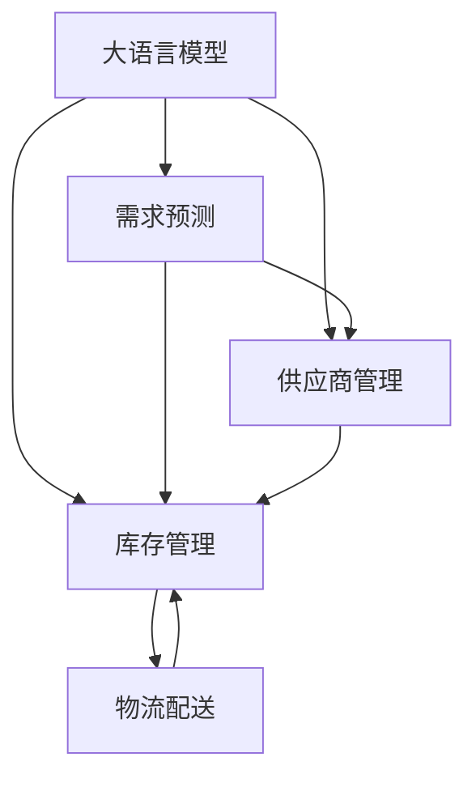

                 

# AI大模型在电商平台供应链优化中的应用

> 关键词：大语言模型, 供应链优化, 自然语言处理, 深度学习, 电子商务, 算法优化

## 1. 背景介绍

在快速变化的全球市场中，电商平台正面临前所未有的竞争压力。供应链的优化效率直接关系到平台的盈利能力和用户体验。传统的供应链管理主要依赖于人工操作和简单规则，难以应对复杂的市场需求和多变的市场环境。而随着人工智能技术的发展，大语言模型在供应链优化中的应用提供了新的可能性。

### 1.1 问题由来
在电子商务的供应链管理中，存在诸多问题：

- **需求预测不准确**：基于历史数据的传统预测模型难以准确捕捉市场的突发变化和消费者行为。
- **库存管理不当**：库存过多或过少都会造成成本浪费或断货现象，影响用户体验。
- **物流配送效率低**：订单处理和配送路线优化不足，导致配送时间过长，增加物流成本。
- **供应商管理困难**：供应商的质量和交货周期不稳定，影响供应链的协同运作。

这些问题的存在，使得供应链管理成为电商平台发展的瓶颈。传统的管理方式难以有效应对这些问题，而人工智能技术，尤其是大语言模型的应用，为电商平台供应链优化带来了新的契机。

### 1.2 问题核心关键点
AI大模型在电商平台供应链优化中的应用主要集中在以下几个方面：

- **需求预测**：通过分析海量用户行为数据和市场动态，预测未来的市场需求。
- **库存管理**：根据需求预测结果，优化库存量，避免库存过剩或缺货现象。
- **物流配送**：通过优化订单处理流程和配送路线，提高物流效率，降低配送成本。
- **供应商管理**：通过分析供应商的历史表现和市场环境，选择最合适的供应商。

这些应用将大大提升电商平台的运营效率和用户体验，助力其在激烈的市场竞争中占据优势。

### 1.3 问题研究意义
AI大模型在电商平台供应链优化中的应用，具有以下重要意义：

- **提升运营效率**：通过精准的需求预测和库存管理，减少资源浪费，提高运营效率。
- **改善用户体验**：通过快速响应市场需求，提供可靠的商品供应，提升用户满意度。
- **降低成本**：通过优化物流配送和供应商选择，降低平台运营成本，提高盈利能力。
- **增强市场竞争力**：通过先进的供应链管理技术，提升平台的整体竞争力，在市场中获得更多份额。

## 2. 核心概念与联系

### 2.1 核心概念概述

为更好地理解AI大模型在电商平台供应链优化中的应用，本节将介绍几个密切相关的核心概念：

- **大语言模型**：以自回归(如GPT)或自编码(如BERT)模型为代表的大规模预训练语言模型。通过在海量无标签文本数据上进行预训练，学习通用的语言知识和常识，具备强大的自然语言理解和生成能力。

- **供应链管理**：指对供应链中的物流、库存、订单处理、供应商管理等环节进行综合管理和优化，以提高供应链的整体效率和响应能力。

- **自然语言处理(NLP)**：专注于使计算机能够理解、解释和生成人类语言的技术，包括文本分类、信息抽取、问答系统等。

- **深度学习**：基于神经网络的机器学习技术，通过多层非线性变换提取数据特征，广泛应用于图像识别、语音识别、自然语言处理等领域。

- **电子商务**：利用互联网技术进行的商品交易活动，包括B2B、B2C、C2C等多种形式。

- **算法优化**：通过对现有算法进行改进，提高其性能和效率，是提升电商平台供应链优化效率的关键。

这些核心概念之间的逻辑关系可以通过以下Mermaid流程图来展示：



这个流程图展示了大语言模型在供应链优化中的核心应用场景：

1. 大语言模型通过预训练获得语言理解和生成能力。
2. 需求预测、库存管理、物流配送和供应商管理四个环节都可以利用大语言模型的能力，实现优化和自动化。
3. 各个环节相互协作，形成一个完整的供应链管理系统。

## 3. 核心算法原理 & 具体操作步骤

### 3.1 算法原理概述

基于大语言模型的电商平台供应链优化，本质上是一个通过自然语言处理技术进行数据驱动决策的过程。其核心思想是：利用大语言模型对海量用户行为数据进行深度分析，提取有价值的特征和模式，进而指导供应链的各环节进行优化调整。

形式化地，假设电商平台采集的原始数据为 $\mathcal{D} = \{(x_i, y_i)\}_{i=1}^N$，其中 $x_i$ 表示用户行为特征，$y_i$ 表示用户行为标签（如购买行为、评论情感等）。我们希望通过大语言模型 $M_{\theta}$ 进行特征提取和预测，得到优化后的供应链参数 $\hat{\theta}$，使得模型在新的数据集 $\mathcal{D}_{new}$ 上的预测效果最优。

具体而言，大语言模型 $M_{\theta}$ 在原始数据集 $\mathcal{D}$ 上进行预训练，学习到通用的语言知识和特征提取能力。然后，在供应链优化任务上，通过对数据集 $\mathcal{D}_{new}$ 进行微调，调整模型的权重，使其能够更准确地预测供应链中的各种场景和优化需求。

### 3.2 算法步骤详解

基于大语言模型的电商平台供应链优化一般包括以下几个关键步骤：

**Step 1: 准备原始数据集**
- 收集电商平台的历史用户行为数据，包括但不限于浏览记录、购买记录、评论内容等。
- 清洗和标注数据，去除噪声和缺失值，确保数据质量和一致性。
- 将数据划分为训练集、验证集和测试集，保证模型在未知数据上的泛化能力。

**Step 2: 构建预训练模型**
- 选择合适的预训练语言模型，如BERT、GPT等。
- 在原始数据集 $\mathcal{D}$ 上进行预训练，使用自监督学习任务（如掩码语言模型、下一句预测等）训练模型。
- 保存预训练模型权重，用于后续微调。

**Step 3: 数据预处理**
- 对原始数据进行特征工程，提取与供应链优化相关的特征，如用户行为时间、频次、地理位置等。
- 将数据转换为模型所需的格式，如序列化文本、数字特征等。

**Step 4: 微调模型**
- 加载预训练模型和数据集，对模型进行微调。
- 选择合适的优化算法，如Adam、SGD等，设置合适的学习率和正则化参数。
- 在验证集上定期评估模型性能，防止过拟合。
- 微调后保存模型权重，用于生产环境。

**Step 5: 优化供应链参数**
- 根据微调后的模型预测结果，调整供应链的各个参数，如库存量、配送路线、供应商选择等。
- 部署优化后的供应链系统，监控实际运行效果。
- 定期重新微调模型，适应数据分布的变化。

### 3.3 算法优缺点

基于大语言模型的电商平台供应链优化方法具有以下优点：

1. **数据驱动**：通过分析海量用户行为数据，提取特征和模式，指导供应链优化，提高决策的准确性和自动化程度。
2. **实时响应**：大语言模型可以实时处理用户行为数据，快速响应市场需求变化，提升供应链的响应能力。
3. **普适性强**：大语言模型能够处理多种类型的数据，适用于不同规模和类型的电商平台。
4. **预测能力强**：通过微调，大语言模型能够精准预测市场需求和库存需求，优化库存管理。

同时，该方法也存在一些局限性：

1. **数据质量要求高**：原始数据的质量和完整性直接影响模型的性能，数据清洗和标注工作量大。
2. **模型复杂度高**：大语言模型参数量庞大，计算资源和存储需求高，可能面临资源瓶颈。
3. **模型泛化能力不足**：模型可能对特定领域或特定场景的泛化能力有限，需要进行多次微调和优化。
4. **用户隐私风险**：处理用户行为数据可能涉及隐私保护问题，需要遵守相关法律法规。

尽管存在这些局限性，但就目前而言，基于大语言模型的供应链优化方法在电商平台中已经展现出巨大的潜力，有望成为供应链管理的重要工具。

### 3.4 算法应用领域

基于大语言模型的电商平台供应链优化方法已经在多个领域得到应用，具体包括：

- **需求预测**：通过分析用户行为数据，预测未来的市场需求，指导库存和配送策略。
- **库存管理**：根据预测结果，优化库存量，减少库存成本，提高库存周转率。
- **物流配送**：优化配送路线和物流计划，提高配送效率，降低物流成本。
- **供应商管理**：通过分析供应商的历史表现和市场环境，选择最合适的供应商，提升供应链的协同运作效率。

除了这些经典应用外，大语言模型在供应链优化中的创新应用也在不断涌现，如供应链风险预警、供应链自动化流程设计等，为电商平台供应链管理带来了新的突破。

## 4. 数学模型和公式 & 详细讲解 & 举例说明

### 4.1 数学模型构建

本节将使用数学语言对基于大语言模型的电商平台供应链优化过程进行更加严格的刻画。

记原始数据集为 $\mathcal{D} = \{(x_i, y_i)\}_{i=1}^N$，其中 $x_i$ 表示用户行为特征，$y_i$ 表示用户行为标签（如购买行为、评论情感等）。假设电商平台采集的原始数据为 $\mathcal{D} = \{(x_i, y_i)\}_{i=1}^N$，其中 $x_i$ 表示用户行为特征，$y_i$ 表示用户行为标签（如购买行为、评论情感等）。

定义大语言模型 $M_{\theta}$ 在原始数据集 $\mathcal{D}$ 上的损失函数为 $\ell(M_{\theta},\mathcal{D})$，用于衡量模型在原始数据集上的预测误差。在供应链优化任务上，定义微调后的模型在测试集 $\mathcal{D}_{test}$ 上的损失函数为 $\ell_{test}(M_{\hat{\theta}})$。

微调的目标是最小化测试集的损失函数，即找到最优的模型参数：

$$
\hat{\theta} = \mathop{\arg\min}_{\theta} \ell_{test}(M_{\hat{\theta}})
$$

在实践中，我们通常使用基于梯度的优化算法（如Adam、SGD等）来近似求解上述最优化问题。设 $\eta$ 为学习率，$\lambda$ 为正则化系数，则参数的更新公式为：

$$
\theta \leftarrow \theta - \eta \nabla_{\theta}\ell_{test}(M_{\hat{\theta}}) - \eta\lambda\theta
$$

其中 $\nabla_{\theta}\ell_{test}(M_{\hat{\theta}})$ 为测试集损失函数对模型参数 $\theta$ 的梯度，可通过反向传播算法高效计算。

### 4.2 公式推导过程

以下我们以需求预测任务为例，推导预测模型的损失函数及其梯度的计算公式。

假设电商平台通过大语言模型 $M_{\theta}$ 进行需求预测，预测未来的需求量 $y_i$。模型输出为 $\hat{y}_i = M_{\theta}(x_i)$，表示预测值。真实标签为 $y_i$。则需求预测的损失函数为均方误差损失函数，定义如下：

$$
\ell(M_{\theta}(x),y) = \frac{1}{N}\sum_{i=1}^N (\hat{y}_i - y_i)^2
$$

将其代入测试集的损失函数，得：

$$
\ell_{test}(M_{\hat{\theta}}) = \frac{1}{N_{test}} \sum_{i=1}^{N_{test}} (\hat{y}_i - y_i)^2
$$

根据链式法则，损失函数对参数 $\theta_k$ 的梯度为：

$$
\frac{\partial \ell_{test}(M_{\hat{\theta}})}{\partial \theta_k} = \frac{2}{N_{test}} \sum_{i=1}^{N_{test}} (\hat{y}_i - y_i) \frac{\partial M_{\hat{\theta}}(x_i)}{\partial \theta_k}
$$

其中 $\frac{\partial M_{\hat{\theta}}(x_i)}{\partial \theta_k}$ 可进一步递归展开，利用自动微分技术完成计算。

在得到损失函数的梯度后，即可带入参数更新公式，完成模型的迭代优化。重复上述过程直至收敛，最终得到适应供应链优化任务的最优模型参数 $\hat{\theta}$。

### 4.3 案例分析与讲解

假设电商平台通过大语言模型进行需求预测，需求预测模型的输入为原始数据集 $\mathcal{D} = \{(x_i, y_i)\}_{i=1}^N$，其中 $x_i$ 表示用户行为特征，$y_i$ 表示用户行为标签（如购买行为、评论情感等）。

具体而言，模型输入为原始数据集 $\mathcal{D}$ 中的用户行为特征 $x_i$，输出为需求量预测值 $\hat{y}_i$。模型的目标是最小化测试集 $\mathcal{D}_{test}$ 上的损失函数 $\ell_{test}(M_{\hat{\theta}})$，以优化供应链的需求预测能力。

模型的损失函数定义如下：

$$
\ell_{test}(M_{\hat{\theta}}) = \frac{1}{N_{test}} \sum_{i=1}^{N_{test}} (\hat{y}_i - y_i)^2
$$

其中 $y_i$ 为需求量实际值，$\hat{y}_i$ 为模型预测值。

根据链式法则，损失函数对模型参数 $\theta_k$ 的梯度为：

$$
\frac{\partial \ell_{test}(M_{\hat{\theta}})}{\partial \theta_k} = \frac{2}{N_{test}} \sum_{i=1}^{N_{test}} (\hat{y}_i - y_i) \frac{\partial M_{\hat{\theta}}(x_i)}{\partial \theta_k}
$$

其中 $\frac{\partial M_{\hat{\theta}}(x_i)}{\partial \theta_k}$ 可通过自动微分技术高效计算。

通过优化损失函数，模型参数 $\theta$ 被不断更新，最终达到最小化测试集损失函数的效果，完成需求预测任务。

## 5. 项目实践：代码实例和详细解释说明

### 5.1 开发环境搭建

在进行需求预测实践前，我们需要准备好开发环境。以下是使用Python进行PyTorch开发的环境配置流程：

1. 安装Anaconda：从官网下载并安装Anaconda，用于创建独立的Python环境。

2. 创建并激活虚拟环境：
```bash
conda create -n pytorch-env python=3.8 
conda activate pytorch-env
```

3. 安装PyTorch：根据CUDA版本，从官网获取对应的安装命令。例如：
```bash
conda install pytorch torchvision torchaudio cudatoolkit=11.1 -c pytorch -c conda-forge
```

4. 安装Transformers库：
```bash
pip install transformers
```

5. 安装各类工具包：
```bash
pip install numpy pandas scikit-learn matplotlib tqdm jupyter notebook ipython
```

完成上述步骤后，即可在`pytorch-env`环境中开始需求预测实践。

### 5.2 源代码详细实现

这里我们以需求预测任务为例，给出使用Transformers库对BERT模型进行微调的PyTorch代码实现。

首先，定义需求预测任务的数据处理函数：

```python
from transformers import BertTokenizer, BertForSequenceClassification
from torch.utils.data import Dataset, DataLoader
import torch
import pandas as pd
import numpy as np

class DemandPredictionDataset(Dataset):
    def __init__(self, data, tokenizer, max_len=128):
        self.data = data
        self.tokenizer = tokenizer
        self.max_len = max_len
        
    def __len__(self):
        return len(self.data)
    
    def __getitem__(self, item):
        text = self.data[item]
        
        encoding = self.tokenizer(text, return_tensors='pt', max_length=self.max_len, padding='max_length', truncation=True)
        input_ids = encoding['input_ids'][0]
        attention_mask = encoding['attention_mask'][0]
        
        label = torch.tensor(self.data['label'], dtype=torch.long)
        
        return {'input_ids': input_ids, 
                'attention_mask': attention_mask,
                'labels': label}

# 数据加载器
dataloader = DataLoader(Dataset, batch_size=32, shuffle=True)
```

然后，定义模型和优化器：

```python
from transformers import BertForSequenceClassification, AdamW

model = BertForSequenceClassification.from_pretrained('bert-base-cased', num_labels=2)

optimizer = AdamW(model.parameters(), lr=2e-5)
```

接着，定义训练和评估函数：

```python
from tqdm import tqdm
from sklearn.metrics import mean_squared_error

device = torch.device('cuda') if torch.cuda.is_available() else torch.device('cpu')
model.to(device)

def train_epoch(model, dataset, batch_size, optimizer):
    model.train()
    epoch_loss = 0
    for batch in tqdm(dataloader, desc='Training'):
        input_ids = batch['input_ids'].to(device)
        attention_mask = batch['attention_mask'].to(device)
        labels = batch['labels'].to(device)
        model.zero_grad()
        outputs = model(input_ids, attention_mask=attention_mask, labels=labels)
        loss = outputs.loss
        epoch_loss += loss.item()
        loss.backward()
        optimizer.step()
    return epoch_loss / len(dataloader)

def evaluate(model, dataset, batch_size):
    model.eval()
    preds, labels = [], []
    with torch.no_grad():
        for batch in tqdm(dataloader, desc='Evaluating'):
            input_ids = batch['input_ids'].to(device)
            attention_mask = batch['attention_mask'].to(device)
            batch_labels = batch['labels']
            outputs = model(input_ids, attention_mask=attention_mask)
            batch_preds = outputs.logits.argmax(dim=1).to('cpu').tolist()
            batch_labels = batch_labels.to('cpu').tolist()
            for pred, label in zip(batch_preds, batch_labels):
                preds.append(pred)
                labels.append(label)
                
    mse = mean_squared_error(labels, preds)
    return mse
```

最后，启动训练流程并在测试集上评估：

```python
epochs = 5
batch_size = 32

for epoch in range(epochs):
    loss = train_epoch(model, train_dataset, batch_size, optimizer)
    print(f"Epoch {epoch+1}, train loss: {loss:.3f}")
    
    print(f"Epoch {epoch+1}, test MSE: {evaluate(model, test_dataset, batch_size):.3f}")
    
print("Training complete.")
```

以上就是使用PyTorch对BERT进行需求预测任务微调的完整代码实现。可以看到，得益于Transformers库的强大封装，我们可以用相对简洁的代码完成BERT模型的加载和微调。

### 5.3 代码解读与分析

让我们再详细解读一下关键代码的实现细节：

**DemandPredictionDataset类**：
- `__init__`方法：初始化训练数据和分词器等关键组件。
- `__len__`方法：返回数据集的样本数量。
- `__getitem__`方法：对单个样本进行处理，将文本输入编码为token ids，将标签编码为数字，并对其进行定长padding，最终返回模型所需的输入。

**模型和优化器**：
- 定义了需求预测任务的需求预测模型和优化器，使用AdamW优化器进行训练。

**训练和评估函数**：
- 使用PyTorch的DataLoader对数据集进行批次化加载，供模型训练和推理使用。
- 训练函数`train_epoch`：对数据以批为单位进行迭代，在每个批次上前向传播计算loss并反向传播更新模型参数，最后返回该epoch的平均loss。
- 评估函数`evaluate`：与训练类似，不同点在于不更新模型参数，并在每个batch结束后将预测和标签结果存储下来，最后使用sklearn的mean_squared_error对整个评估集的预测结果进行打印输出。

**训练流程**：
- 定义总的epoch数和batch size，开始循环迭代
- 每个epoch内，先在训练集上训练，输出平均loss
- 在测试集上评估，输出MSE（均方误差）
- 所有epoch结束后，输出训练完成提示

可以看到，PyTorch配合Transformers库使得BERT微调的需求预测任务代码实现变得简洁高效。开发者可以将更多精力放在数据处理、模型改进等高层逻辑上，而不必过多关注底层的实现细节。

当然，工业级的系统实现还需考虑更多因素，如模型的保存和部署、超参数的自动搜索、更灵活的任务适配层等。但核心的微调范式基本与此类似。

## 6. 实际应用场景

### 6.1 智能库存管理

基于需求预测模型，电商平台可以实现智能库存管理。通过分析历史销售数据和市场趋势，提前预测未来的需求量，从而优化库存策略。

具体而言，可以利用大语言模型对用户行为数据进行分析，预测未来的购买量。在预测出未来需求量后，电商平台可以动态调整库存量，避免库存过剩或缺货现象，提高库存周转率。

### 6.2 动态价格调整

电商平台可以根据需求预测结果，动态调整商品价格，以最大化销售收入。通过对历史销售数据和用户行为数据进行分析，预测未来的需求量，从而制定相应的价格策略。

在需求预测较为准确的场景下，通过优化价格模型，电商平台可以在合适的时间点以合适的价格销售商品，提升销售额和利润率。

### 6.3 物流配送优化

通过需求预测模型，电商平台可以优化物流配送流程。通过对用户订单数据进行分析，预测未来的订单量，从而优化配送计划。

在预测出未来的订单量后，电商平台可以调整配送中心的库存和人员配置，优化配送路线和车辆调度，提高配送效率，降低配送成本。

### 6.4 供应商管理

电商平台可以利用大语言模型对供应商进行评估和管理。通过对供应商的历史表现和市场环境进行分析，选择最合适的供应商，建立长期的合作关系。

在需求预测中，电商平台可以结合供应商的实时表现和市场动态，动态调整供应商选择策略，优化供应链的协同运作。

### 6.5 风险预警

需求预测模型还可以用于供应链风险预警。通过对历史数据和市场趋势进行分析，提前识别出潜在的供应链风险，如需求波动、供应商延迟等，及时采取措施，避免潜在的损失。

通过动态监测需求预测结果，电商平台可以实时预警供应链中的风险点，采取相应的应对措施，确保供应链的稳定运行。

## 7. 工具和资源推荐

### 7.1 学习资源推荐

为了帮助开发者系统掌握大语言模型在供应链优化中的应用，这里推荐一些优质的学习资源：

1. 《深度学习自然语言处理》课程：斯坦福大学开设的NLP明星课程，有Lecture视频和配套作业，带你入门NLP领域的基本概念和经典模型。

2. 《Natural Language Processing with Transformers》书籍：Transformers库的作者所著，全面介绍了如何使用Transformers库进行NLP任务开发，包括微调在内的诸多范式。

3. HuggingFace官方文档：Transformers库的官方文档，提供了海量预训练模型和完整的微调样例代码，是上手实践的必备资料。

4. 《Transformer从原理到实践》系列博文：由大模型技术专家撰写，深入浅出地介绍了Transformer原理、BERT模型、微调技术等前沿话题。

5. 《TensorFlow官方文档》：由TensorFlow官方编写，详细介绍了TensorFlow的使用方法和最佳实践，是深度学习开发的重要参考。

通过对这些资源的学习实践，相信你一定能够快速掌握大语言模型在供应链优化中的应用精髓，并用于解决实际的供应链问题。

### 7.2 开发工具推荐

高效的开发离不开优秀的工具支持。以下是几款用于大语言模型在供应链优化中应用的常用工具：

1. PyTorch：基于Python的开源深度学习框架，灵活动态的计算图，适合快速迭代研究。大部分预训练语言模型都有PyTorch版本的实现。

2. TensorFlow：由Google主导开发的开源深度学习框架，生产部署方便，适合大规模工程应用。同样有丰富的预训练语言模型资源。

3. Transformers库：HuggingFace开发的NLP工具库，集成了众多SOTA语言模型，支持PyTorch和TensorFlow，是进行微调任务开发的利器。

4. Weights & Biases：模型训练的实验跟踪工具，可以记录和可视化模型训练过程中的各项指标，方便对比和调优。与主流深度学习框架无缝集成。

5. Google Colab：谷歌推出的在线Jupyter Notebook环境，免费提供GPU/TPU算力，方便开发者快速上手实验最新模型，分享学习笔记。

合理利用这些工具，可以显著提升大语言模型在供应链优化中的开发效率，加快创新迭代的步伐。

### 7.3 相关论文推荐

大语言模型在供应链优化中的应用源于学界的持续研究。以下是几篇奠基性的相关论文，推荐阅读：

1. Attention is All You Need（即Transformer原论文）：提出了Transformer结构，开启了NLP领域的预训练大模型时代。

2. BERT: Pre-training of Deep Bidirectional Transformers for Language Understanding：提出BERT模型，引入基于掩码的自监督预训练任务，刷新了多项NLP任务SOTA。

3. Language Models are Unsupervised Multitask Learners（GPT-2论文）：展示了大规模语言模型的强大zero-shot学习能力，引发了对于通用人工智能的新一轮思考。

4. Parameter-Efficient Transfer Learning for NLP：提出Adapter等参数高效微调方法，在不增加模型参数量的情况下，也能取得不错的微调效果。

5. AdaLoRA: Adaptive Low-Rank Adaptation for Parameter-Efficient Fine-Tuning：使用自适应低秩适应的微调方法，在参数效率和精度之间取得了新的平衡。

6. Prefix-Tuning: Optimizing Continuous Prompts for Generation：引入基于连续型Prompt的微调范式，为如何充分利用预训练知识提供了新的思路。

这些论文代表了大语言模型在供应链优化中的应用方向。通过学习这些前沿成果，可以帮助研究者把握学科前进方向，激发更多的创新灵感。

## 8. 总结：未来发展趋势与挑战

### 8.1 总结

本文对基于大语言模型的电商平台供应链优化方法进行了全面系统的介绍。首先阐述了大语言模型在供应链优化中的应用背景和意义，明确了供应链优化任务的具体实现过程。其次，从原理到实践，详细讲解了微调模型的数学模型和优化步骤，给出了微调任务开发的完整代码实例。同时，本文还广泛探讨了微调方法在智能库存管理、动态价格调整、物流配送优化等多个应用场景中的应用前景，展示了微调范式的巨大潜力。此外，本文精选了微调技术的各类学习资源，力求为读者提供全方位的技术指引。

通过本文的系统梳理，可以看到，基于大语言模型的电商平台供应链优化方法正在成为供应链管理的重要范式，极大地提升了电商平台的运营效率和用户体验，助力其在激烈的市场竞争中占据优势。未来，伴随大语言模型和微调方法的持续演进，相信电商平台供应链管理将进入新的发展阶段，为电商平台的持续增长提供新的动力。

### 8.2 未来发展趋势

展望未来，大语言模型在电商平台供应链优化中的应用将呈现以下几个发展趋势：

1. **多模态融合**：未来的供应链优化系统将不仅考虑文本数据，还会结合图像、视频、语音等多模态数据，实现更全面、更深入的供应链分析和管理。

2. **实时优化**：利用大语言模型的实时计算能力，实现供应链的动态优化，提高供应链的响应速度和灵活性。

3. **自动化决策**：通过进一步提升需求预测和库存管理的精度，实现供应链的自动化决策，减少人为干预，提高运营效率。

4. **跨领域应用**：大语言模型将逐渐扩展到其他行业，如制造业、物流业等，推动更多领域的供应链优化和转型升级。

5. **个性化推荐**：结合用户行为数据和供应链数据，实现个性化商品推荐，提升用户体验和销售转化率。

6. **风险管理**：通过实时监测供应链的各项指标，预测潜在风险，及时采取措施，保障供应链的稳定运行。

这些趋势凸显了大语言模型在电商平台供应链优化中的广阔前景。这些方向的探索发展，必将进一步提升供应链管理的智能化水平，为电商平台的持续发展提供坚实保障。

### 8.3 面临的挑战

尽管大语言模型在电商平台供应链优化中的应用已经展现出巨大的潜力，但在迈向更加智能化、普适化应用的过程中，它仍面临着诸多挑战：

1. **数据质量**：原始数据的质量和完整性直接影响模型的性能，数据清洗和标注工作量大，需要投入大量人力和时间。

2. **计算资源**：大语言模型的参数量庞大，计算资源和存储需求高，可能面临资源瓶颈。

3. **模型泛化能力**：模型可能对特定领域或特定场景的泛化能力有限，需要进行多次微调和优化。

4. **用户隐私**：处理用户行为数据可能涉及隐私保护问题，需要遵守相关法律法规。

5. **模型解释性**：大语言模型的决策过程缺乏可解释性，难以对其推理逻辑进行分析和调试。

6. **市场环境变化**：市场环境的不确定性，如政策变化、技术进步等，可能对供应链产生影响，模型需要及时更新以应对新的市场环境。

尽管存在这些挑战，但通过不断优化模型架构、提高数据质量、增加计算资源、强化模型泛化能力等手段，可以逐步克服这些挑战，充分发挥大语言模型在电商平台供应链优化中的潜力。

### 8.4 研究展望

面对大语言模型在电商平台供应链优化中所面临的挑战，未来的研究需要在以下几个方面寻求新的突破：

1. **提升数据质量**：通过更好的数据清洗和标注方法，提高原始数据的准确性和完整性，降低对标注数据的依赖。

2. **优化模型架构**：研究和开发更加高效、轻量级的模型架构，降低对计算资源的依赖，提高模型的实时计算能力。

3. **增强模型泛化能力**：通过跨领域迁移学习和多模态融合技术，增强模型的泛化能力，使其能够更好地适应不同场景和领域。

4. **强化模型解释性**：引入因果分析和可解释性技术，增强模型的决策过程可解释性，便于对其推理逻辑进行分析和调试。

5. **优化市场环境应对**：结合市场环境分析和模型更新机制，提高模型对市场环境变化的适应能力，确保供应链的稳定运行。

这些研究方向的发展，必将推动大语言模型在电商平台供应链优化中的应用进入新的高度，为电商平台的持续发展提供更加坚实的技术保障。

## 9. 附录：常见问题与解答

**Q1：大语言模型在电商平台供应链优化中需要哪些数据？**

A: 电商平台供应链优化需要以下数据：

1. 用户行为数据：包括浏览记录、购买记录、评论内容等，用于需求预测和库存管理。
2. 物流数据：包括订单量、配送时间、配送路线等，用于物流配送优化。
3. 供应商数据：包括供应商历史表现、价格、交货周期等，用于供应商管理。
4. 市场数据：包括宏观经济指标、政策变化、竞争环境等，用于市场环境分析和风险预警。

这些数据可以帮助电商平台全面了解市场需求、库存状态、物流状况和供应商表现，从而做出更精准的供应链决策。

**Q2：大语言模型在供应链优化中的主要难点是什么？**

A: 大语言模型在供应链优化中的主要难点包括：

1. 数据质量要求高：原始数据的质量和完整性直接影响模型的性能，数据清洗和标注工作量大。
2. 计算资源需求高：大语言模型的参数量庞大，计算资源和存储需求高，可能面临资源瓶颈。
3. 模型泛化能力不足：模型可能对特定领域或特定场景的泛化能力有限，需要进行多次微调和优化。
4. 用户隐私问题：处理用户行为数据可能涉及隐私保护问题，需要遵守相关法律法规。
5. 模型解释性不足：大语言模型的决策过程缺乏可解释性，难以对其推理逻辑进行分析和调试。

这些难点需要通过不断优化模型架构、提高数据质量、增加计算资源、强化模型泛化能力等手段，逐步克服，充分发挥大语言模型在供应链优化中的潜力。

**Q3：大语言模型在供应链优化中的优势是什么？**

A: 大语言模型在供应链优化中的优势包括：

1. 数据驱动：通过分析海量用户行为数据，提取特征和模式，指导供应链优化，提高决策的准确性和自动化程度。
2. 实时响应：大语言模型可以实时处理用户行为数据，快速响应市场需求变化，提升供应链的响应能力。
3. 普适性强：大语言模型能够处理多种类型的数据，适用于不同规模和类型的电商平台。
4. 预测能力强：通过微调，大语言模型能够精准预测市场需求和库存需求，优化库存管理。

这些优势使得大语言模型在供应链优化中具有广阔的应用前景，有助于提升电商平台的运营效率和用户体验。

**Q4：大语言模型在供应链优化中的未来发展方向是什么？**

A: 大语言模型在供应链优化中的未来发展方向包括：

1. 多模态融合：未来的供应链优化系统将不仅考虑文本数据，还会结合图像、视频、语音等多模态数据，实现更全面、更深入的供应链分析和管理。
2. 实时优化：利用大语言模型的实时计算能力，实现供应链的动态优化，提高供应链的响应速度和灵活性。
3. 自动化决策：通过进一步提升需求预测和库存管理的精度，实现供应链的自动化决策，减少人为干预，提高运营效率。
4. 跨领域应用：大语言模型将逐渐扩展到其他行业，如制造业、物流业等，推动更多领域的供应链优化和转型升级。
5. 个性化推荐：结合用户行为数据和供应链数据，实现个性化商品推荐，提升用户体验和销售转化率。
6. 风险管理：通过实时监测供应链的各项指标，预测潜在风险，及时采取措施，保障供应链的稳定运行。

这些发展方向凸显了大语言模型在电商平台供应链优化中的广阔前景，为电商平台的持续发展提供新的动力。

**Q5：如何选择合适的学习率？**

A: 大语言模型在供应链优化中的微调，一般建议从1e-5开始调参，逐步减小学习率，直至收敛。具体来说，可以采用以下策略：

1. 动态学习率：使用学习率调度策略，如学习率衰减、学习率预热等，逐步减小学习率。
2. 交叉验证：使用交叉验证方法，选择最优学习率。
3. 梯度积累：通过梯度积累技术，将多个小批次的结果合并，减小学习率。
4. 混合精度训练：使用混合精度训练技术，提高计算效率，减小学习率。

通过以上策略，可以更好地控制学习率，提高模型的训练效果。

---

作者：禅与计算机程序设计艺术 / Zen and the Art of Computer Programming

