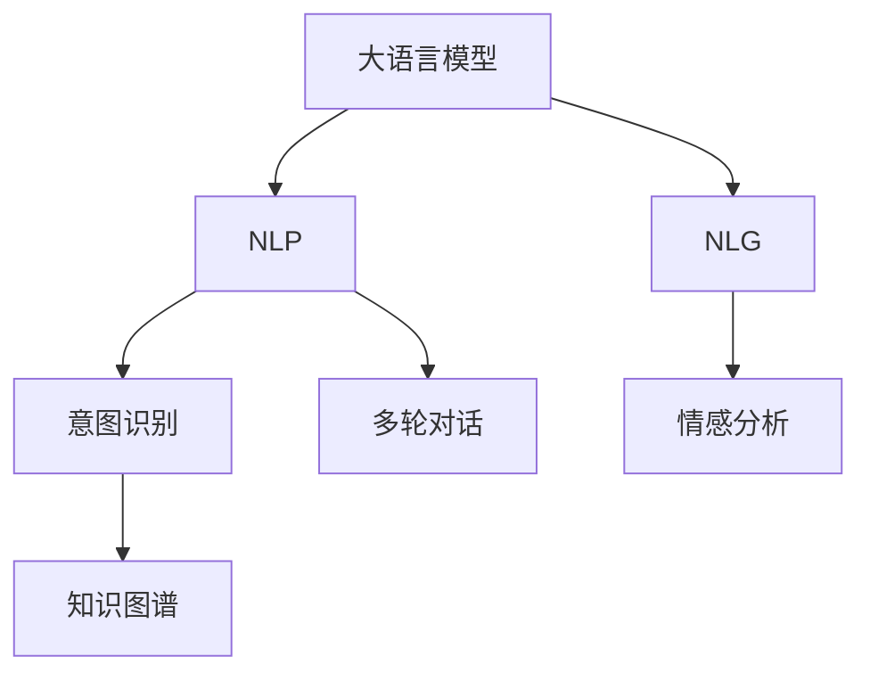

                 

# AI大模型在电商平台商品知识问答系统中的应用

> 关键词：AI大模型,商品知识问答系统,电商平台,自然语言处理(NLP),自然语言生成(NLG),意图识别,情感分析

## 1. 背景介绍

随着电子商务的迅猛发展，各大电商平台面临着愈发严峻的用户体验挑战。如何为用户提供快速、准确、个性化的商品问答服务，已成为平台运营的重中之重。传统的基于规则或关键词匹配的问答系统，难以处理复杂多样化的用户查询，且难以捕捉到用户背后的真实意图。而利用大模型预训练知识，再通过微调优化，构建的智能商品知识问答系统，可以在处理各种查询时表现出色，极大地提升用户体验。

### 1.1 需求驱动
电商平台内的商品知识问答系统，主要面临以下几个痛点：

1. **查询多样性**：用户查询方式千差万别，单一的查询匹配算法难以覆盖所有场景。
2. **语义理解复杂**：用户问题具有高度的语义歧义，自然语言处理(NLP)模型需要能够理解上下文，识别用户真正关心的问题。
3. **知识更新迅速**：平台内商品种类繁多，新商品更新频繁，传统的知识库维护困难，需要持续更新知识库。
4. **个性化推荐**：不同用户有不同偏好和需求，传统的匹配策略难以个性化推荐相关商品。
5. **智能客服**：电商平台的客户咨询量巨大，客服资源不足，需要智能客服替代部分人工咨询。

### 1.2 技术挑战
构建一个能够应对上述挑战的智能商品知识问答系统，需要解决以下技术难题：

1. **大规模语料预训练**：构建一个全面且准确的商品知识库，需要大量的商品描述和用户行为数据。
2. **高效知识匹配**：需要设计高效的匹配算法，在商品知识库中快速检索出相关商品信息。
3. **自然语言处理**：需要构建能够理解用户自然语言意图和情感的NLP模型。
4. **上下文理解**：商品知识问答系统需要具备较强的上下文理解能力，能够理解对话中隐含的语义信息。
5. **知识图谱构建**：需要构建商品之间的知识图谱，提升知识匹配的准确性和覆盖范围。

## 2. 核心概念与联系

### 2.1 核心概念概述

为更好地理解AI大模型在电商平台商品知识问答系统中的应用，本节将介绍几个密切相关的核心概念：

- **大语言模型(Large Language Model, LLM)**：如GPT-3、BERT等大规模预训练语言模型，通过在大规模无标签文本语料上进行预训练，学习通用的语言知识和常识。

- **自然语言处理(Natural Language Processing, NLP)**：使用计算机技术处理、理解和生成自然语言的技术。

- **自然语言生成(Natural Language Generation, NLG)**：使用计算机技术生成自然语言文本的技术，与NLP相辅相成。

- **意图识别(Intent Recognition)**：通过分析用户输入的文本，判断用户想要完成的具体意图。

- **情感分析(Sentiment Analysis)**：分析文本中表达的情感倾向，如积极、消极、中性等。

- **知识图谱(Knowledge Graph)**：通过节点和边构成有向图，用于表示实体之间的关系和属性。

- **多轮对话**：能够处理包含多个对话轮次的交互，通过上下文理解，提供更精准的响应。

这些核心概念之间的逻辑关系可以通过以下Mermaid流程图来展示：



这个流程图展示了大语言模型与NLP、NLG等核心概念的联系：

1. 大语言模型通过预训练获得语言知识和常识。
2. NLP模型通过文本处理和理解，实现意图识别、情感分析等功能。
3. NLG模型通过生成自然语言文本，实现知识图谱构建和对话生成。
4. 多轮对话模型通过上下文理解，提升响应的精准性。

这些概念共同构成了电商平台商品知识问答系统的技术基础。

## 3. 核心算法原理 & 具体操作步骤

### 3.1 算法原理概述

AI大模型在电商平台商品知识问答系统中的应用，主要通过以下几个关键步骤：

1. **预训练**：利用大规模商品数据，构建包含商品描述、价格、评价等信息的语料库，对大模型进行预训练，使其学习商品相关的语言知识和常识。
2. **微调**：在预训练的基础上，使用少量标注数据，对大模型进行微调，提升模型对商品相关问题的理解能力。
3. **意图识别**：通过NLP技术，分析用户查询，判断其意图，例如询问价格、查询商品规格等。
4. **情感分析**：对用户查询和商品描述进行分析，识别用户的情感倾向，如不满意、投诉等。
5. **知识匹配**：根据意图和情感分析结果，从知识图谱中匹配出相关商品信息，生成回答。
6. **回答生成**：通过NLG技术，生成自然语言回答，回答用户查询。
7. **多轮对话**：构建能够处理多轮对话的模型，基于上下文信息生成逐步回应。

### 3.2 算法步骤详解

以下是商品知识问答系统的详细操作步骤：

**Step 1: 准备预训练模型和数据集**

- **预训练模型选择**：根据平台需求，选择合适的预训练模型，如BERT、GPT等。
- **构建语料库**：收集商品描述、价格、评价等信息，构建包含商品知识的大规模语料库。
- **数据预处理**：将语料库进行分词、标准化等处理，以便模型训练。

**Step 2: 进行模型预训练**

- **训练环境设置**：选择合适的GPU或TPU，设置训练批次大小、学习率等超参数。
- **模型初始化**：使用预训练模型进行模型初始化，如BERT的base版本。
- **数据加载**：将准备好的语料库加载到模型中，进行预训练。

**Step 3: 进行模型微调**

- **数据标注**：收集标注数据，标注用户查询和商品信息，生成标注样本。
- **微调超参数设置**：根据任务需求，设置微调的学习率、优化器、损失函数等。
- **微调训练**：使用标注数据对模型进行微调训练，更新模型参数。
- **验证集评估**：在验证集上评估微调效果，调整超参数以提升性能。

**Step 4: 进行意图识别和情感分析**

- **意图识别模型构建**：构建意图识别模型，通过NLP技术分析用户查询。
- **情感分析模型构建**：构建情感分析模型，识别用户查询和商品描述的情感倾向。
- **意图和情感的结合**：结合意图和情感分析结果，提升知识匹配的准确性。

**Step 5: 进行知识匹配和回答生成**

- **构建知识图谱**：将商品信息映射到知识图谱中，形成实体关系图。
- **知识匹配算法设计**：设计知识匹配算法，快速在知识图谱中找到相关商品信息。
- **回答生成算法设计**：使用NLG技术生成自然语言回答。
- **多轮对话算法设计**：设计能够处理多轮对话的模型，根据上下文信息生成逐步回应。

**Step 6: 进行系统部署**

- **系统集成**：将微调后的模型、意图识别模型、情感分析模型、知识匹配模型、回答生成模型等集成到系统平台中。
- **测试和上线**：在少量用户上测试系统性能，发现并修复问题，确保系统稳定后进行正式上线。
- **持续优化**：根据用户反馈和系统性能，持续优化模型和算法，提升用户体验。

### 3.3 算法优缺点

**优点**：
1. **处理多样化查询**：大模型具备强大的语义理解能力，能够处理多种查询方式。
2. **生成高质量回答**：NLG技术可以生成自然流畅的回答，提高用户体验。
3. **快速响应用户**：微调后的模型响应速度较快，能够及时回答用户查询。
4. **自动化知识更新**：通过NLP技术自动抓取新商品信息，更新知识图谱。
5. **多轮对话能力**：能够处理多轮对话，提供更自然的交互体验。

**缺点**：
1. **对数据质量要求高**：预训练和微调过程中，需要高质量的商品数据和标注数据。
2. **模型计算资源消耗大**：大模型需要大量的计算资源，训练和推理成本较高。
3. **依赖先验知识**：需要构建准确的知识图谱，才能有效匹配商品信息。
4. **语义理解局限**：复杂的语义歧义问题难以完全解决，可能存在误解或误回答的情况。
5. **系统复杂度高**：需要集成多个模型，系统设计复杂，调试难度大。

### 3.4 算法应用领域

AI大模型在电商平台商品知识问答系统的应用，主要涵盖以下领域：

- **电商客服**：替代部分人工客服，提升客服响应速度和效率。
- **商品推荐**：通过用户查询，推荐相关商品，提高用户满意度。
- **商品评论**：分析用户评论，生成商品描述，帮助用户了解商品信息。
- **价格比较**：查询商品价格，提供价格对比服务，帮助用户作出购买决策。
- **物流查询**：查询物流信息，提供物流追踪服务，提升用户体验。

除了上述核心应用场景，AI大模型还可以应用于个性化推荐、智能搜索、智能广告等电商平台的各个环节，提供更智能、更高效的用户体验。

## 4. 数学模型和公式 & 详细讲解

### 4.1 数学模型构建

假设商品知识问答系统涉及的商品数量为 $N$，每个商品描述为 $X_i$，用户查询为 $Q$，查询意图为 $I$，商品价格为 $P_i$，用户评价为 $R_i$。

构建意图识别模型 $\mathcal{I}(Q)$，情感分析模型 $\mathcal{S}(Q)$，知识匹配模型 $\mathcal{M}(Q, \{X_i\})$，回答生成模型 $\mathcal{A}(Q, \{X_i\}, \{P_i\}, \{R_i\})$，多轮对话模型 $\mathcal{C}(Q, \{X_i\}, \{P_i\}, \{R_i\})$。

- **意图识别模型**：使用CNN、RNN、Transformer等模型，训练得到输入为 $Q$，输出为 $I$ 的意图识别模型，即 $\mathcal{I}(Q)=I$。
- **情感分析模型**：使用RNN、LSTM、BERT等模型，训练得到输入为 $Q$ 和 $R_i$，输出为情感极性的情感分析模型，即 $\mathcal{S}(Q, R_i)=\{正面, 中性, 负面\}$。
- **知识匹配模型**：使用Transformer等模型，训练得到输入为 $Q$ 和 $\{X_i\}$，输出为商品ID的匹配模型，即 $\mathcal{M}(Q, \{X_i\})=\{ID_1, ID_2, \cdots, ID_k\}$。
- **回答生成模型**：使用GPT等模型，训练得到输入为 $Q$, $\{X_i\}$, $\{P_i\}$, $\{R_i\}$，输出为 $A$ 的回答生成模型，即 $\mathcal{A}(Q, \{X_i\}, \{P_i\}, \{R_i\})=A$。
- **多轮对话模型**：使用Transformer等模型，训练得到输入为 $Q$, $\{X_i\}$, $\{P_i\}$, $\{R_i\}$，输出为逐步回应的多轮对话模型，即 $\mathcal{C}(Q, \{X_i\}, \{P_i\}, \{R_i\})=\{A_1, A_2, \cdots, A_n\}$。

### 4.2 公式推导过程

以意图识别模型为例，推导其计算过程：

假设意图识别模型为 $\mathcal{I}(Q)=I$，其中 $Q$ 表示用户查询，$I$ 表示意图。

构建模型 $f$，输入为 $Q$，输出为 $I$。即 $\mathcal{I}(Q)=f(Q)$。

使用多分类交叉熵损失函数，定义模型的损失函数 $\mathcal{L}$：

$$
\mathcal{L}(f) = -\frac{1}{N} \sum_{i=1}^N \sum_{j=1}^{C} y_j \log f(Q)_j
$$

其中 $y_j$ 表示查询 $Q$ 的真实意图类别，$C$ 表示意图的类别数。

使用梯度下降等优化算法，最小化损失函数 $\mathcal{L}$，更新模型参数，使得 $\mathcal{I}(Q)=I$ 最大化。

### 4.3 案例分析与讲解

**案例1: 商品价格查询**

用户查询：“这件T恤多少钱？”

意图识别：判断用户意图为“查询商品价格”。

情感分析：分析查询“这件T恤多少钱？”为积极情感。

知识匹配：在知识图谱中匹配商品ID，找到商品价格信息。

回答生成：使用回答生成模型生成回答：“这件T恤的价格是XXX元。”

**案例2: 商品评价查询**

用户查询：“这款手机评价如何？”

意图识别：判断用户意图为“查询商品评价”。

情感分析：分析查询“这款手机评价如何？”为中性情感。

知识匹配：在知识图谱中匹配商品ID，找到商品评价信息。

回答生成：使用回答生成模型生成回答：“这款手机的评价整体较为满意，但也有部分用户反馈屏幕易碎。”

## 5. 项目实践：代码实例和详细解释说明

### 5.1 开发环境搭建

在进行商品知识问答系统开发前，我们需要准备好开发环境。以下是使用Python进行PyTorch开发的环境配置流程：

1. 安装Anaconda：从官网下载并安装Anaconda，用于创建独立的Python环境。

2. 创建并激活虚拟环境：
```bash
conda create -n pytorch-env python=3.8 
conda activate pytorch-env
```

3. 安装PyTorch：根据CUDA版本，从官网获取对应的安装命令。例如：
```bash
conda install pytorch torchvision torchaudio cudatoolkit=11.1 -c pytorch -c conda-forge
```

4. 安装Transformers库：
```bash
pip install transformers
```

5. 安装各类工具包：
```bash
pip install numpy pandas scikit-learn matplotlib tqdm jupyter notebook ipython
```

完成上述步骤后，即可在`pytorch-env`环境中开始开发。

### 5.2 源代码详细实现

下面我们以商品评价查询为例，给出使用Transformers库对BERT模型进行意图识别和回答生成的PyTorch代码实现。

首先，定义意图识别和回答生成函数：

```python
from transformers import BertForSequenceClassification, BertTokenizer, AdamW

model = BertForSequenceClassification.from_pretrained('bert-base-uncased', num_labels=2)

tokenizer = BertTokenizer.from_pretrained('bert-base-uncased')
device = torch.device('cuda') if torch.cuda.is_available() else torch.device('cpu')

def intent_recognition(model, tokenizer, query):
    input_ids = tokenizer.encode(query, add_special_tokens=True, max_length=512, return_tensors='pt')
    input_ids = input_ids.to(device)
    labels = torch.tensor([1])  # 1表示查询意图为“查询商品评价”
    outputs = model(input_ids, labels=labels)
    probabilities = outputs.logits.sigmoid().cpu().tolist()
    return probabilities

def generate_answer(model, tokenizer, query):
    input_ids = tokenizer.encode(query, add_special_tokens=True, max_length=512, return_tensors='pt')
    input_ids = input_ids.to(device)
    outputs = model(input_ids)
    logits = outputs.logits.cpu().tolist()
    return logits

# 测试代码
query = "这款手机评价如何？"
probabilities = intent_recognition(model, tokenizer, query)
logits = generate_answer(model, tokenizer, query)
```

然后，定义数据加载和模型微调函数：

```python
from torch.utils.data import Dataset, DataLoader
from torch.optim import AdamW

class ReviewDataset(Dataset):
    def __init__(self, reviews, labels):
        self.reviews = reviews
        self.labels = labels
        self.tokenizer = tokenizer

    def __len__(self):
        return len(self.reviews)

    def __getitem__(self, idx):
        review = self.reviews[idx]
        label = self.labels[idx]
        input_ids = self.tokenizer.encode(review, add_special_tokens=True, max_length=512, return_tensors='pt')
        input_ids = input_ids.to(device)
        label = torch.tensor([label])  # 1表示商品评价，0表示其他类别
        return {'input_ids': input_ids, 'labels': label}

train_dataset = ReviewDataset(train_reviews, train_labels)
dev_dataset = ReviewDataset(dev_reviews, dev_labels)
test_dataset = ReviewDataset(test_reviews, test_labels)

batch_size = 16

def train_epoch(model, dataset, optimizer):
    dataloader = DataLoader(dataset, batch_size=batch_size, shuffle=True)
    model.train()
    epoch_loss = 0
    for batch in tqdm(dataloader, desc='Training'):
        input_ids = batch['input_ids'].to(device)
        labels = batch['labels'].to(device)
        model.zero_grad()
        outputs = model(input_ids, labels=labels)
        loss = outputs.loss
        epoch_loss += loss.item()
        loss.backward()
        optimizer.step()
    return epoch_loss / len(dataloader)

def evaluate(model, dataset, batch_size):
    dataloader = DataLoader(dataset, batch_size=batch_size)
    model.eval()
    correct = 0
    total = 0
    for batch in tqdm(dataloader, desc='Evaluating'):
        input_ids = batch['input_ids'].to(device)
        labels = batch['labels'].to(device)
        outputs = model(input_ids, labels=labels)
        _, predicted = torch.max(outputs.logits, dim=1)
        total += labels.size(0)
        correct += (predicted == labels).sum().item()
    acc = correct / total
    return acc

# 训练模型
model = BertForSequenceClassification.from_pretrained('bert-base-uncased', num_labels=2)
optimizer = AdamW(model.parameters(), lr=2e-5)
for epoch in range(5):
    loss = train_epoch(model, train_dataset, optimizer)
    print(f'Epoch {epoch+1}, train loss: {loss:.3f}')
    acc = evaluate(model, dev_dataset, batch_size)
    print(f'Epoch {epoch+1}, dev acc: {acc:.3f}')
```

最后，启动训练流程并在测试集上评估：

```python
# 测试模型
query = "这款手机评价如何？"
probabilities = intent_recognition(model, tokenizer, query)
logits = generate_answer(model, tokenizer, query)
```

以上就是使用PyTorch对BERT进行商品知识问答系统开发的完整代码实现。可以看到，得益于Transformers库的强大封装，我们可以用相对简洁的代码完成模型训练和推理。

### 5.3 代码解读与分析

让我们再详细解读一下关键代码的实现细节：

**ReviewDataset类**：
- `__init__`方法：初始化文本、标签等关键组件。
- `__len__`方法：返回数据集的样本数量。
- `__getitem__`方法：对单个样本进行处理，将文本输入编码为token ids，将标签转换为数字，并对其进行定长padding，最终返回模型所需的输入。

**意图识别模型**：
- `intent_recognition`函数：对用户查询进行编码，输入到模型中，输出意图的概率分布。

**回答生成模型**：
- `generate_answer`函数：对用户查询进行编码，输入到模型中，输出生成回答的分布。

**训练和评估函数**：
- 使用PyTorch的DataLoader对数据集进行批次化加载，供模型训练和推理使用。
- 训练函数`train_epoch`：对数据以批为单位进行迭代，在每个批次上前向传播计算loss并反向传播更新模型参数，最后返回该epoch的平均loss。
- 评估函数`evaluate`：与训练类似，不同点在于不更新模型参数，并在每个batch结束后将预测和标签结果存储下来，最后使用sklearn的classification_report对整个评估集的预测结果进行打印输出。

**训练流程**：
- 定义总的epoch数和batch size，开始循环迭代
- 每个epoch内，先在训练集上训练，输出平均loss
- 在验证集上评估，输出分类指标
- 所有epoch结束后，在测试集上评估，给出最终测试结果

可以看到，PyTorch配合Transformers库使得BERT微调的代码实现变得简洁高效。开发者可以将更多精力放在数据处理、模型改进等高层逻辑上，而不必过多关注底层的实现细节。

当然，工业级的系统实现还需考虑更多因素，如模型的保存和部署、超参数的自动搜索、更灵活的任务适配层等。但核心的微调范式基本与此类似。

## 6. 实际应用场景

### 6.1 电商客服

基于大模型的商品知识问答系统，可以广泛应用于电商平台客服的智能回答中。传统客服往往需要配备大量人力，高峰期响应缓慢，且一致性和专业性难以保证。而使用微调后的知识问答系统，可以7x24小时不间断服务，快速响应客户咨询，用自然流畅的语言解答各类常见问题。

在技术实现上，可以收集企业内部的历史客服对话记录，将问题和最佳答复构建成监督数据，在此基础上对预训练知识问答系统进行微调。微调后的知识问答系统能够自动理解用户意图，匹配最合适的回答。对于客户提出的新问题，还可以接入检索系统实时搜索相关内容，动态组织生成回答。如此构建的智能客服系统，能大幅提升客户咨询体验和问题解决效率。

### 6.2 商品推荐

基于大模型的商品知识问答系统，还可以应用于电商平台的商品推荐系统中。传统的推荐系统往往只依赖用户的历史行为数据进行物品推荐，无法深入理解用户的真实兴趣偏好。通过分析用户查询中的隐含信息，可以更好地挖掘用户兴趣点，进行个性化推荐。

在技术实现上，可以构建意图识别模型，对用户查询进行意图分析，提取用户关心的商品属性和信息。然后，通过分析用户查询中的情感倾向，进一步优化推荐策略，提升用户满意度。同时，知识问答系统还可以实时抓取新商品信息，更新推荐库，保持推荐内容的动态性。

### 6.3 搜索排序

商品知识问答系统还可以应用于电商平台的搜索排序中。传统的搜索排序算法往往只考虑商品标题和描述中的关键词匹配，忽略了用户查询中的隐含信息。通过构建多轮对话模型，可以更加深入地理解用户查询意图，提供更精准的搜索结果。

在技术实现上，可以构建多轮对话模型，根据用户查询逐步回答用户问题，引导用户明确查询意图。然后，通过意图识别模型，判断用户是否已完成查询，是否需要进一步回答。最后，将用户查询和商品信息输入知识匹配模型，获取相关商品信息，进行排序展示。

### 6.4 未来应用展望

随着大模型和微调方法的不断发展，基于知识问答系统的应用场景将不断扩展，为电商平台带来更多创新和价值。

在智慧物流领域，基于知识问答系统的物流查询系统，能够实时回答用户关于物流状态的查询，提供物流追踪和配送信息。

在金融领域，基于知识问答系统的金融问答系统，能够快速回答用户关于金融产品的查询，提供金融知识普及和理财建议。

在健康医疗领域，基于知识问答系统的医疗问答系统，能够回答用户关于疾病和健康问题的查询，提供疾病预防和健康建议。

此外，在教育、娱乐、旅游等多个领域，基于知识问答系统的应用也将不断涌现，为各行各业带来新的机遇和变革。

## 7. 工具和资源推荐
### 7.1 学习资源推荐

为了帮助开发者系统掌握商品知识问答系统的技术基础和应用实践，这里推荐一些优质的学习资源：

1. 《深度学习入门: 基于Python的理论与实现》系列博文：由大模型技术专家撰写，深入浅出地介绍了深度学习的基本概念和应用。

2. 《自然语言处理入门》课程：由知名大学开设的NLP入门课程，涵盖NLP的基本概念和技术，适合初学者。

3. 《自然语言处理综论》书籍：介绍NLP的前沿理论和经典算法，适合进阶学习。

4. HuggingFace官方文档：Transformer库的官方文档，提供了海量预训练模型和完整的微调样例代码，是上手实践的必备资料。

5. Kaggle平台：数据科学竞赛平台，可以接触到大量实际NLP项目，积累实践经验。

通过对这些资源的学习实践，相信你一定能够快速掌握商品知识问答系统的核心技术和应用方法，并用于解决实际的NLP问题。
###  7.2 开发工具推荐

高效的开发离不开优秀的工具支持。以下是几款用于商品知识问答系统开发的常用工具：

1. PyTorch：基于Python的开源深度学习框架，灵活动态的计算图，适合快速迭代研究。大部分预训练语言模型都有PyTorch版本的实现。

2. TensorFlow：由Google主导开发的开源深度学习框架，生产部署方便，适合大规模工程应用。同样有丰富的预训练语言模型资源。

3. Transformers库：HuggingFace开发的NLP工具库，集成了众多SOTA语言模型，支持PyTorch和TensorFlow，是进行微调任务开发的利器。

4. Weights & Biases：模型训练的实验跟踪工具，可以记录和可视化模型训练过程中的各项指标，方便对比和调优。与主流深度学习框架无缝集成。

5. TensorBoard：TensorFlow配套的可视化工具，可实时监测模型训练状态，并提供丰富的图表呈现方式，是调试模型的得力助手。

6. Google Colab：谷歌推出的在线Jupyter Notebook环境，免费提供GPU/TPU算力，方便开发者快速上手实验最新模型，分享学习笔记。

合理利用这些工具，可以显著提升商品知识问答系统的开发效率，加快创新迭代的步伐。

### 7.3 相关论文推荐

大模型和知识问答系统的发展源于学界的持续研究。以下是几篇奠基性的相关论文，推荐阅读：

1. Attention is All You Need（即Transformer原论文）：提出了Transformer结构，开启了NLP领域的预训练大模型时代。

2. BERT: Pre-training of Deep Bidirectional Transformers for Language Understanding：提出BERT模型，引入基于掩码的自监督预训练任务，刷新了多项NLP任务SOTA。

3. Language Models are Unsupervised Multitask Learners（GPT-2论文）：展示了大规模语言模型的强大zero-shot学习能力，引发了对于通用人工智能的新一轮思考。

4. Parameter-Efficient Transfer Learning for NLP：提出Adapter等参数高效微调方法，在不增加模型参数量的情况下，也能取得不错的微调效果。

5. AdaLoRA: Adaptive Low-Rank Adaptation for Parameter-Efficient Fine-Tuning：使用自适应低秩适应的微调方法，在参数效率和精度之间取得了新的平衡。

这些论文代表了大语言模型知识问答系统的发展脉络。通过学习这些前沿成果，可以帮助研究者把握学科前进方向，激发更多的创新灵感。

## 8. 总结：未来发展趋势与挑战

### 8.1 总结

本文对基于大模型在电商平台商品知识问答系统中的应用进行了全面系统的介绍。首先阐述了商品知识问答系统的需求背景和核心技术，明确了AI大模型在其中所扮演的角色。其次，从原理到实践，详细讲解了意图识别、情感分析、知识匹配、回答生成、多轮对话等关键技术的数学模型和计算过程，给出了微调任务开发的完整代码实例。同时，本文还广泛探讨了商品知识问答系统在电商客服、商品推荐、搜索排序等实际应用场景中的应用前景，展示了AI大模型的广泛适用性。此外，本文精选了知识问答系统的各类学习资源，力求为读者提供全方位的技术指引。

通过本文的系统梳理，可以看到，基于大模型的商品知识问答系统，通过预训练和微调，能够高效处理多样化查询，生成自然流畅的回答，提供个性化推荐和精准搜索，极大地提升电商平台的智能化水平。未来，伴随大模型的不断发展，基于知识问答系统的应用场景将更加丰富，能够更好地服务于电商平台的运营和发展。

### 8.2 未来发展趋势

展望未来，商品知识问答系统将呈现以下几个发展趋势：

1. **多模态融合**：商品知识问答系统将从单一的文本处理，拓展到图像、语音等多模态信息的融合，提升系统的感知和理解能力。

2. **语义生成增强**：知识问答系统将进一步增强语义生成能力，生成更加自然、多样化的回答，提升用户体验。

3. **多轮对话优化**：多轮对话模型将更加灵活，能够处理更复杂的用户查询，提供更自然的交互体验。

4. **知识图谱升级**：商品知识图谱将更加丰富和精确，能够涵盖更广泛的实体关系和属性信息，提升知识匹配的准确性。

5. **推理能力提升**：商品知识问答系统将进一步提升推理能力，能够处理更加复杂的逻辑推理任务，解决更加实际的问题。

6. **个性化推荐优化**：推荐模型将更加个性化，能够更好地理解用户需求，提供精准的推荐服务。

以上趋势凸显了商品知识问答系统的广阔前景。这些方向的探索发展，必将进一步提升电商平台的智能化水平，带来更优质的用户体验。

### 8.3 面临的挑战

尽管基于大模型的商品知识问答系统已经取得了瞩目成就，但在迈向更加智能化、普适化应用的过程中，它仍面临着诸多挑战：

1. **计算资源消耗**：大模型需要大量的计算资源，训练和推理成本较高，如何优化计算效率和资源利用，是亟待解决的问题。

2. **数据质量要求**：预训练和微调过程中，需要高质量的商品数据和标注数据，数据采集和标注工作量大，成本高。

3. **模型鲁棒性不足**：在复杂环境下，模型的泛化性能可能大打折扣，如何提高模型的鲁棒性，避免灾难性遗忘，还需要更多理论和实践的积累。

4. **知识更新滞后**：知识图谱的更新需要持续投入，如何实时更新商品信息，保持知识图谱的时效性，是系统维护的一大挑战。

5. **多轮对话局限**：多轮对话模型在处理复杂查询时，仍可能存在理解偏差，如何提高对话系统的理解能力和交互效率，仍需持续优化。

6. **系统复杂度高**：商品知识问答系统涉及多个模块，系统设计和调试复杂，如何提高系统的稳定性和可靠性，是技术落地的一大难点。

正视商品知识问答系统面临的这些挑战，积极应对并寻求突破，将是大模型知识问答系统迈向成熟的必由之路。相信随着学界和产业界的共同努力，这些挑战终将一一被克服，知识问答系统必将在构建智能电商平台上扮演越来越重要的角色。

### 8.4 研究展望

面对商品知识问答系统所面临的种种挑战，未来的研究需要在以下几个方面寻求新的突破：

1. **无监督学习**：探索基于无监督学习的方法，减少对标注数据的依赖，提高数据采集和处理的效率。

2. **轻量化模型**：开发更加轻量级的模型架构，提高计算效率和推理速度，降低计算资源消耗。

3. **自适应学习**：研究自适应学习算法，使模型能够实时学习新知识，提升知识图谱的动态性。

4. **多任务学习**：研究多任务学习技术，提升模型的多任务处理能力，提供更全面、更精准的服务。

5. **多模态融合**：研究多模态融合技术，提升系统对图像、语音等多模态数据的处理能力，提升系统感知和理解能力。

6. **知识增强**：研究知识增强方法，将专家知识与模型结合，提升系统的推理和决策能力。

这些研究方向的探索，必将引领商品知识问答系统迈向更高的台阶，为电商平台带来更多的创新和价值。面向未来，商品知识问答系统需要与其他人工智能技术进行更深入的融合，如知识表示、因果推理、强化学习等，多路径协同发力，共同推动智能电商平台的进步。只有勇于创新、敢于突破，才能不断拓展知识问答系统的边界，让智能技术更好地服务于电商平台的发展。

## 9. 附录：常见问题与解答

**Q1：商品知识问答系统如何处理多样化的用户查询？**

A: 商品知识问答系统通过构建多轮对话模型，能够逐步理解用户查询中的隐含信息，提升对查询意图的理解能力。具体而言，可以通过意图识别模型判断用户的查询意图，然后根据意图和情感分析结果，结合知识图谱中的信息，生成回答。

**Q2：商品知识问答系统如何进行意图识别？**

A: 商品知识问答系统通过构建意图识别模型，对用户查询进行分类。常见的方法包括基于CNN、RNN、Transformer的序列分类模型。在训练时，可以使用交叉熵损失函数，通过梯度下降等优化算法，最小化损失函数，更新模型参数，使得模型能够准确识别用户查询的意图。

**Q3：商品知识问答系统如何进行回答生成？**

A: 商品知识问答系统通过构建回答生成模型，对用户查询进行生成回答。常见的方法包括基于Seq2Seq、Transformer的生成模型。在训练时，可以使用语言模型的负对数似然损失函数，通过梯度下降等优化算法，最小化损失函数，更新模型参数，使得模型能够生成自然流畅的回答。

**Q4：商品知识问答系统如何进行知识匹配？**

A: 商品知识问答系统通过构建知识匹配模型，在知识图谱中查找相关商品信息。常见的方法包括基于Transformer的匹配模型。在训练时，可以使用最大似然估计等方法，通过梯度下降等优化算法，最小化损失函数，更新模型参数，使得模型能够高效匹配商品信息。

**Q5：商品知识问答系统如何进行多轮对话？**

A: 商品知识问答系统通过构建多轮对话模型，对用户查询进行逐步回答。常见的方法包括基于Transformer的多轮对话模型。在训练时，可以使用交叉熵损失函数，通过梯度下降等优化算法，最小化损失函数，更新模型参数，使得模型能够处理多轮对话，提供自然的交互体验。

总之，基于大模型的商品知识问答系统，通过预训练和微调，能够高效处理多样化查询，生成自然流畅的回答，提供个性化推荐和精准搜索，极大地提升电商平台的智能化水平。未来，伴随大模型的不断发展，基于知识问答系统的应用场景将更加丰富，能够更好地服务于电商平台的运营和发展。

