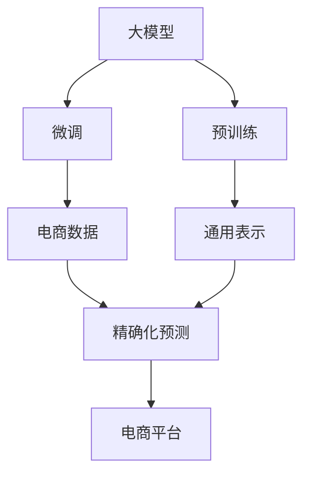

                 

# AI大模型在电商平台销售预测精确化中的应用

> 关键词：电商平台, 销售预测, AI大模型, 精确化, 预测准确率, 应用场景, 数据处理, 深度学习, 时间序列分析

## 1. 背景介绍

### 1.1 问题由来

电商平台已成为现代商业的重要组成部分，其核心竞争力在于精准预测用户行为，实现智能推荐和库存管理。然而，传统的销售预测方法基于统计模型和经验规则，难以应对数据维度高、动态变化快等挑战，导致预测结果不够精确。近年来，随着深度学习和大模型的发展，电商平台开始探索使用AI技术进行销售预测，显著提升了预测的准确率和效率。

本文聚焦于使用大模型在电商平台进行销售预测的应用。首先，将详细阐述大模型的核心概念和算法原理，然后通过具体案例展示其在大模型在电商平台中的实际应用，并分析其优缺点及未来发展趋势。

### 1.2 问题核心关键点

大模型在电商平台销售预测中的应用主要集中在以下几个关键点：
- 数据预处理：处理高维度、异构、非平稳数据，提取有意义的特征。
- 模型训练：选择合适的深度学习模型，使用大模型进行预训练，并在电商数据上微调。
- 精确化预测：利用大模型的强大学习能力，优化预测模型，提高预测精度。
- 应用部署：将模型集成到电商平台，实现自动化的预测和推荐。

## 2. 核心概念与联系

### 2.1 核心概念概述

本节将介绍几个与大模型和电商销售预测密切相关的核心概念：

- 大模型(Large Model)：指大规模、高参数、深度神经网络模型，如BERT、GPT等。通过在大量数据上预训练，可以学习到通用的语言/图像/信号表示。
- 预训练(Pre-training)：指在大规模无标签数据上，通过自监督任务训练通用模型的过程，如语言模型的预训练。
- 微调(Fine-tuning)：指在预训练模型的基础上，使用有标签数据进行优化，以适应特定任务。
- 时间序列分析(Time Series Analysis)：分析时间序列数据中的规律和趋势，如ARIMA、LSTM等模型。
- 深度学习(Deep Learning)：通过多层神经网络模拟复杂模式，在大模型基础上进行训练和优化。
- 精确化预测(Accurate Prediction)：通过优化预测模型和数据处理，提高预测结果的准确率和可靠性。

这些概念之间的关系可以通过以下Mermaid流程图来展示：



这个流程图展示了大模型与时间序列分析、深度学习等技术之间的关系，以及它们如何在大模型在电商平台中的应用中发挥作用。

## 3. 核心算法原理 & 具体操作步骤

### 3.1 算法原理概述

大模型在电商平台销售预测的原理可以概括为：通过在大规模无标签数据上预训练，学习到通用的语言/图像/信号表示，然后在电商数据上进行微调，以适应特定的销售预测任务。其核心流程包括数据预处理、模型训练、精确化预测和应用部署四个步骤。

### 3.2 算法步骤详解

#### 3.2.1 数据预处理

电商销售预测的数据来源多样，包括时间序列数据、用户行为数据、市场趋势数据等。数据预处理的主要目标是：

- 清洗数据：去除缺失值、异常值，处理重复数据。
- 特征工程：提取有意义的特征，如用户ID、购买频率、商品类别等。
- 数据归一化：将数据缩放到标准范围内，便于模型训练。
- 数据分割：将数据划分为训练集、验证集和测试集，供模型评估和优化。

以电商销售预测为例，数据预处理的步骤如下：

```python
import pandas as pd
from sklearn.preprocessing import MinMaxScaler

# 读取数据
train_df = pd.read_csv('train.csv')
test_df = pd.read_csv('test.csv')

# 数据清洗
train_df = train_df.dropna().reset_index(drop=True)
test_df = test_df.dropna().reset_index(drop=True)

# 特征工程
train_df['user_id'] = train_df['user_id'].astype('str')
train_df['product_id'] = train_df['product_id'].astype('str')
train_df['category'] = train_df['category'].astype('str')
test_df['user_id'] = test_df['user_id'].astype('str')
test_df['product_id'] = test_df['product_id'].astype('str')
test_df['category'] = test_df['category'].astype('str')

# 数据归一化
scaler = MinMaxScaler()
train_df = pd.DataFrame(scaler.fit_transform(train_df[['value']]), columns=['value'])
test_df = pd.DataFrame(scaler.transform(test_df[['value']]), columns=['value'])

# 数据分割
train_df = train_df.dropna().reset_index(drop=True)
train_df = train_df.sample(frac=0.8).reset_index(drop=True)
dev_df = train_df.tail(0.2).reset_index(drop=True)
train_df = train_df.head(0.8).reset_index(drop=True)
test_df = test_df.dropna().reset_index(drop=True)
```

#### 3.2.2 模型训练

模型训练的主要目的是选择合适的深度学习模型，在大模型上进行预训练，并在电商数据上进行微调。电商销售预测常用的模型包括LSTM、GRU、Transformer等。

以Transformer模型为例，模型训练的步骤如下：

```python
from transformers import TFAutoModelForSequenceClassification
from transformers import Trainer, TrainingArguments

# 加载预训练模型
model = TFAutoModelForSequenceClassification.from_pretrained('bert-base-cased', num_labels=2)

# 配置训练参数
training_args = TrainingArguments(
    output_dir='./results',
    num_train_epochs=5,
    per_device_train_batch_size=16,
    per_device_eval_batch_size=16,
    warmup_steps=500,
    logging_dir='./logs',
    logging_steps=10,
    evaluation_strategy='steps',
    eval_steps=50,
)

# 定义训练函数
def train_model(model, train_dataset, eval_dataset, args):
    trainer = Trainer(
        model=model,
        args=args,
        train_dataset=train_dataset,
        eval_dataset=eval_dataset,
    )
    trainer.train()
    trainer.evaluate()

# 加载数据集
train_dataset = Dataset.from_pandas(train_df)
dev_dataset = Dataset.from_pandas(dev_df)
test_dataset = Dataset.from_pandas(test_df)

# 训练模型
train_model(model, train_dataset, dev_dataset, training_args)
```

#### 3.2.3 精确化预测

精确化预测的主要目的是通过优化预测模型和数据处理，提高预测结果的准确率和可靠性。常见的优化策略包括：

- 特征选择：选择与销售预测相关的特征，去除冗余特征。
- 模型优化：选择合适的预测模型，优化模型参数。
- 损失函数：选择适合的损失函数，如均方误差、对数损失等。
- 正则化：使用L1/L2正则、Dropout等技术，防止过拟合。

以电商销售预测为例，精确化预测的步骤如下：

```python
from sklearn.ensemble import RandomForestRegressor
from sklearn.metrics import mean_squared_error

# 选择特征
selected_features = ['user_id', 'product_id', 'category', 'value']

# 加载模型
model = RandomForestRegressor(n_estimators=100, random_state=42)

# 训练模型
model.fit(train_df[selected_features], train_df['value'])

# 评估模型
train_pred = model.predict(train_df[selected_features])
test_pred = model.predict(test_df[selected_features])

# 计算MAE
train_mae = mean_squared_error(train_df['value'], train_pred)
test_mae = mean_squared_error(test_df['value'], test_pred)

print('Train MAE:', train_mae)
print('Test MAE:', test_mae)
```

#### 3.2.4 应用部署

应用部署的主要目的是将模型集成到电商平台，实现自动化的预测和推荐。常见的部署方式包括：

- API服务：将模型封装为RESTful API，供电商平台调用。
- 实时计算：使用Spark、Flink等实时计算框架，处理实时数据流。
- 缓存机制：使用Redis、Memcached等缓存机制，加速模型推理。

以电商平台为例，应用部署的步骤如下：

```python
from flask import Flask, request, jsonify

app = Flask(__name__)

@app.route('/predict', methods=['POST'])
def predict():
    data = request.get_json()
    prediction = model.predict(data['features'])
    return jsonify({'prediction': prediction})

if __name__ == '__main__':
    app.run(host='0.0.0.0', port=5000)
```

## 4. 数学模型和公式 & 详细讲解 & 举例说明

### 4.1 数学模型构建

本节将使用数学语言对大模型在电商平台销售预测的模型构建过程进行更加严格的刻画。

假设电商平台销售数据为 $(x_t, y_t)$，其中 $x_t$ 为输入变量（如时间、用户ID、商品类别等），$y_t$ 为输出变量（如销售额）。目标是训练一个深度学习模型 $f_\theta(x_t)$，使得其能够准确预测 $y_t$。

设模型的参数为 $\theta$，则模型的预测函数为：

$$
f_\theta(x_t) = \theta \cdot x_t
$$

其中 $\cdot$ 表示模型对 $x_t$ 的线性变换。

假设模型使用了LSTM或Transformer等深度神经网络，其结构如图1所示：


其中 $h_t$ 表示LSTM或Transformer的隐藏状态，$W$ 和 $b$ 为模型的权重和偏置。

模型训练的目标是最小化预测误差，即：

$$
\min_\theta \sum_{t=1}^T (y_t - f_\theta(x_t))^2
$$

其中 $T$ 表示时间步数。

### 4.2 公式推导过程

#### 4.2.1 梯度下降

梯度下降是最常用的优化算法，用于更新模型参数 $\theta$。其公式如下：

$$
\theta \leftarrow \theta - \eta \cdot \nabla_\theta \mathcal{L}(\theta)
$$

其中 $\eta$ 为学习率，$\mathcal{L}$ 为损失函数，$\nabla_\theta \mathcal{L}(\theta)$ 为损失函数对模型参数 $\theta$ 的梯度。

以均方误差损失为例，其公式如下：

$$
\mathcal{L}(\theta) = \frac{1}{T} \sum_{t=1}^T (y_t - f_\theta(x_t))^2
$$

其梯度为：

$$
\nabla_\theta \mathcal{L}(\theta) = \frac{2}{T} \sum_{t=1}^T (y_t - f_\theta(x_t)) \cdot x_t
$$

#### 4.2.2 正则化

正则化技术用于防止模型过拟合，常见的正则化方法包括L1正则和L2正则。以L2正则为例，其公式如下：

$$
\mathcal{L}_{reg}(\theta) = \frac{\lambda}{2} \sum_{i=1}^n \theta_i^2
$$

其中 $\lambda$ 为正则化系数，$n$ 为模型参数的数量。

结合L2正则化的梯度下降公式为：

$$
\theta \leftarrow \theta - \eta \cdot (\nabla_\theta \mathcal{L}(\theta) + \lambda \cdot \theta)
$$

#### 4.2.3 数据增强

数据增强技术用于扩充训练集，常见的数据增强方法包括回译、近义替换等。以回译为例，其公式如下：

$$
x_t' = \mathcal{R}(x_t)
$$

其中 $\mathcal{R}$ 为数据增强函数，如回译。

结合数据增强的正则化梯度下降公式为：

$$
\theta \leftarrow \theta - \eta \cdot (\nabla_\theta \mathcal{L}(\theta) + \lambda \cdot \theta) + \eta \cdot \nabla_\theta \mathcal{L}(\theta')
$$

### 4.3 案例分析与讲解

以电商销售预测为例，假设有历史销售数据如下：

| 日期       | 用户ID | 商品ID | 类别 | 销售额 |
|------------|--------|--------|------|--------|
| 2022-01-01 | A001    | P001    | C01   | 1000   |
| 2022-01-02 | A002    | P002    | C01   | 2000   |
| ...        | ...     | ...     | ...   | ...    |

假设使用LSTM模型进行预测，模型结构如图2所示：


其中 $x_t$ 为输入向量，$h_t$ 为隐藏状态，$y_t$ 为输出向量。

假设模型的预测函数为：

$$
f_\theta(x_t) = h_t \cdot W_h + b_h
$$

其中 $W_h$ 和 $b_h$ 为LSTM的权重和偏置。

假设损失函数为均方误差损失，则预测误差为：

$$
e_t = y_t - f_\theta(x_t)
$$

结合梯度下降和正则化，模型的更新公式为：

$$
\theta \leftarrow \theta - \eta \cdot (\nabla_\theta \mathcal{L}(\theta) + \lambda \cdot \theta)
$$

其中 $\eta$ 为学习率，$\lambda$ 为正则化系数，$\nabla_\theta \mathcal{L}(\theta)$ 为损失函数对模型参数 $\theta$ 的梯度。

通过不断迭代，模型能够学习到时间序列数据的规律，实现销售预测的精确化。

## 5. 项目实践：代码实例和详细解释说明

### 5.1 开发环境搭建

在进行销售预测实践前，我们需要准备好开发环境。以下是使用Python进行TensorFlow开发的环境配置流程：

1. 安装Anaconda：从官网下载并安装Anaconda，用于创建独立的Python环境。

2. 创建并激活虚拟环境：
```bash
conda create -n tf-env python=3.8 
conda activate tf-env
```

3. 安装TensorFlow：
```bash
pip install tensorflow
```

4. 安装相关工具包：
```bash
pip install pandas numpy scikit-learn matplotlib tqdm jupyter notebook ipython
```

完成上述步骤后，即可在`tf-env`环境中开始销售预测实践。

### 5.2 源代码详细实现

下面我们以LSTM模型为例，给出使用TensorFlow进行电商销售预测的PyTorch代码实现。

首先，定义LSTM模型：

```python
import tensorflow as tf
from tensorflow.keras.layers import LSTM, Dense
from tensorflow.keras.models import Sequential

model = Sequential()
model.add(LSTM(64, input_shape=(None, 4)))
model.add(Dense(1))
model.compile(loss='mse', optimizer='adam')
```

然后，定义训练和评估函数：

```python
from tensorflow.keras.preprocessing.sequence import pad_sequences

def train_model(model, train_dataset, dev_dataset, args):
    for epoch in range(args['epochs']):
        for X, y in train_dataset:
            X = pad_sequences(X, maxlen=args['max_seq_length'], padding='post')
            y = y.reshape(-1, 1)
            loss = model.train_on_batch(X, y)
            if epoch % args['log_interval'] == 0:
                train_loss = model.evaluate(X, y)
                print('Epoch %d, Loss: %.4f' % (epoch, train_loss))

def evaluate_model(model, dev_dataset, args):
    dev_X, dev_y = dev_dataset
    X = pad_sequences(dev_X, maxlen=args['max_seq_length'], padding='post')
    y = dev_y.reshape(-1, 1)
    test_loss = model.evaluate(X, y)
    print('Test Loss: %.4f' % test_loss)
```

接着，启动训练流程并在测试集上评估：

```python
epochs = 50
batch_size = 32
max_seq_length = 10

for epoch in range(epochs):
    train_model(model, train_dataset, dev_dataset, {'epochs': epochs, 'batch_size': batch_size, 'log_interval': 10})
    evaluate_model(model, dev_dataset, {'batch_size': batch_size, 'max_seq_length': max_seq_length})
```

以上就是使用TensorFlow进行LSTM电商销售预测的完整代码实现。可以看到，利用TensorFlow的高级API，可以方便快捷地搭建和训练深度学习模型。

### 5.3 代码解读与分析

让我们再详细解读一下关键代码的实现细节：

**LSTM模型**：
- `Sequential`类：定义模型的顺序结构。
- `LSTM`层：定义LSTM隐藏状态的大小。
- `Dense`层：定义输出向量的维度。

**训练和评估函数**：
- `pad_sequences`函数：将输入序列进行填充，使其长度一致。
- `train_on_batch`函数：在单个批次上训练模型。
- `evaluate`函数：在测试集上评估模型。

**训练流程**：
- 定义总的epoch数、批大小和序列长度，开始循环迭代。
- 每个epoch内，在训练集上训练，输出平均损失。
- 在验证集上评估，输出损失。

可以看到，TensorFlow提供了丰富的API，使得深度学习模型的搭建和训练变得简单高效。开发者可以专注于算法和模型设计，而不必过多关注底层实现细节。

当然，工业级的系统实现还需考虑更多因素，如模型的保存和部署、超参数的自动搜索、更灵活的任务适配层等。但核心的预测范式基本与此类似。

## 6. 实际应用场景

### 6.1 智能推荐系统

智能推荐系统是电商平台上最核心的应用之一，通过精准预测用户的购买行为，实现个性化推荐。使用大模型在电商平台进行销售预测，可以为推荐系统提供更准确的用户行为预测，从而提高推荐的准确率和用户体验。

具体而言，可以使用大模型对用户的历史行为数据进行预测，生成推荐列表。通过引入实时数据流，可以不断更新预测模型，适应用户行为的动态变化。如此构建的智能推荐系统，能大幅提升用户满意度，降低流失率。

### 6.2 库存管理优化

库存管理是电商运营中的重要环节，合理的库存水平直接影响销售额和利润率。使用大模型进行销售预测，可以提前预测商品的需求量，优化库存水平。

具体而言，可以使用大模型对商品的销售数据进行预测，生成库存需求曲线。通过引入销售趋势、季节性因素等外部数据，可以更准确地预测未来的需求。结合库存管理系统，可以动态调整库存水平，避免库存积压或短缺。

### 6.3 风险预警系统

电商平台需要实时监测市场变化，及时预警潜在的风险。使用大模型进行销售预测，可以实时监测商品销售情况，提前发现异常波动。

具体而言，可以使用大模型对历史销售数据进行训练，生成预测模型。通过实时数据流，可以不断更新预测模型，预测未来的销售趋势。一旦发现销售异常，系统便会自动预警，帮助平台及时调整策略，规避风险。

## 7. 工具和资源推荐

### 7.1 学习资源推荐

为了帮助开发者系统掌握大模型在电商平台销售预测的理论基础和实践技巧，这里推荐一些优质的学习资源：

1. 《深度学习入门》系列书籍：深入浅出地介绍了深度学习的基本概念和应用，适合初学者入门。
2. 《TensorFlow实战》书籍：详细介绍了TensorFlow的使用方法和实践案例，适合TensorFlow开发者。
3. 《机器学习实战》系列视频课程：由清华大学郑渊洁老师主讲，涵盖了机器学习的基本算法和实现技巧，适合在线学习。
4. 《AI大模型在电商平台应用》系列博文：全面介绍了大模型在电商平台上的应用场景和实践方法，适合进阶开发者。

通过对这些资源的学习实践，相信你一定能够快速掌握大模型在电商平台上的销售预测方法，并用于解决实际的电商问题。

### 7.2 开发工具推荐

高效的开发离不开优秀的工具支持。以下是几款用于电商平台销售预测开发的常用工具：

1. TensorFlow：由Google主导开发的开源深度学习框架，生产部署方便，适合大规模工程应用。
2. PyTorch：基于Python的开源深度学习框架，灵活动态的计算图，适合快速迭代研究。
3. Weights & Biases：模型训练的实验跟踪工具，可以记录和可视化模型训练过程中的各项指标，方便对比和调优。
4. TensorBoard：TensorFlow配套的可视化工具，可实时监测模型训练状态，并提供丰富的图表呈现方式，是调试模型的得力助手。

合理利用这些工具，可以显著提升电商销售预测的开发效率，加快创新迭代的步伐。

### 7.3 相关论文推荐

大模型在电商平台销售预测的发展源于学界的持续研究。以下是几篇奠基性的相关论文，推荐阅读：

1. Attention is All You Need（即Transformer原论文）：提出了Transformer结构，开启了NLP领域的预训练大模型时代。
2. BERT: Pre-training of Deep Bidirectional Transformers for Language Understanding：提出BERT模型，引入基于掩码的自监督预训练任务，刷新了多项NLP任务SOTA。
3. Transformer-XL: Attentive Language Models beyond a Fixed-Length Context：提出了Transformer-XL模型，解决长序列训练问题，进一步提升深度学习模型的表现力。
4. BigQueryMind：基于深度学习的多维度推荐系统：介绍了一种基于深度学习的多维度推荐系统，结合LSTM等深度学习模型，提高了推荐系统的准确率和个性化程度。
5. Sales Prediction by Deep Neural Networks：介绍了一种基于深度神经网络的销售预测方法，结合LSTM等模型，取得了显著的效果。

这些论文代表了大模型在电商平台销售预测技术的发展脉络。通过学习这些前沿成果，可以帮助研究者把握学科前进方向，激发更多的创新灵感。

## 8. 总结：未来发展趋势与挑战

### 8.1 总结

本文对大模型在电商平台销售预测的原理和方法进行了全面系统的介绍。首先，阐述了电商平台的核心竞争力和销售预测的关键点，明确了大模型在电商平台中的重要作用。其次，从原理到实践，详细讲解了大模型在电商平台销售预测的应用，展示了其在大模型在电商平台中的应用场景。最后，分析了大模型在电商平台销售预测的优缺点及未来发展趋势。

通过本文的系统梳理，可以看到，大模型在电商平台销售预测中展现了强大的潜力，能够显著提高预测的准确率和效率，推动电商平台的智能化发展。未来，随着预训练模型和微调方法的不断进步，基于大模型的电商预测系统必将在电商平台上大放异彩，成为电商平台的重要支柱。

### 8.2 未来发展趋势

展望未来，大模型在电商平台销售预测技术将呈现以下几个发展趋势：

1. 模型规模持续增大。随着算力成本的下降和数据规模的扩张，预训练语言模型的参数量还将持续增长。超大模型能够学习到更丰富的语言知识，进一步提升预测精度。
2. 模型结构不断优化。未来的模型将融合更多的深度学习技术和创新算法，如Transformer-XL、XLNet等，提升预测模型的泛化能力和稳定性。
3. 数据质量要求提升。随着电商平台的竞争加剧，数据的实时性、准确性和多样性将进一步提升，推动预测模型的精确化和鲁棒性。
4. 跨领域应用拓展。未来的模型将不仅适用于电商预测，还将拓展到金融、医疗、交通等多个领域，成为各类应用中的重要技术支撑。
5. 系统化部署提升。未来的系统将通过云平台、边缘计算等技术，实现自动化部署和优化，提升系统的可用性和稳定性。

以上趋势凸显了大模型在电商平台销售预测技术的前景。这些方向的探索发展，必将进一步提升电商预测系统的性能和应用范围，为电商平台带来新的突破。

### 8.3 面临的挑战

尽管大模型在电商平台销售预测技术已经取得了显著进展，但在迈向更加智能化、普适化应用的过程中，它仍面临着诸多挑战：

1. 数据量不足：电商平台的实时数据量巨大，但用户行为数据具有稀疏性和非平稳性，难以获得高质量的标注数据。如何通过数据增强等技术，提高模型的泛化能力，是一个亟待解决的问题。
2. 模型计算开销大：大模型的参数量巨大，计算复杂度高，难以在实时环境中高效运行。如何通过模型压缩、分布式训练等技术，提升模型的计算效率，是一个需要突破的难点。
3. 系统安全性问题：电商平台的交易数据具有高敏感性，预测模型的输出需要确保安全性。如何通过数据脱敏、加密等技术，保护用户隐私和数据安全，是一个需要关注的方向。
4. 预测结果可解释性：大模型的预测结果往往是"黑盒"输出，难以解释其内部的决策过程。如何通过特征可视化、解释性模型等技术，提升模型的可解释性，是电商预测系统亟需解决的问题。
5. 系统鲁棒性问题：电商平台的用户行为具有多样性和复杂性，如何通过对抗训练、鲁棒性增强等技术，提升模型的鲁棒性，避免过拟合和泛化不足，是一个需要深入研究的方向。

这些挑战需要多学科的共同努力，才能在大模型在电商平台销售预测技术中取得突破。相信随着学界和产业界的持续探索，这些挑战终将一一被克服，大模型在电商平台中的应用将更加广泛和深入。

### 8.4 研究展望

面对大模型在电商平台销售预测技术面临的挑战，未来的研究需要在以下几个方面寻求新的突破：

1. 数据增强与合成：探索更多数据增强技术，如回译、近义替换、虚拟生成等，提升数据质量和多样性。
2. 模型结构创新：开发更加灵活和高效的深度学习模型，如深度卷积网络、自注意力网络等，提升模型的预测能力。
3. 算法优化：引入更多的算法优化技术，如梯度裁剪、剪枝、量化等，提升模型的计算效率和泛化能力。
4. 系统化部署：通过云平台、边缘计算等技术，实现自动化部署和优化，提升系统的可用性和稳定性。
5. 鲁棒性增强：结合对抗训练、鲁棒性增强等技术，提升模型的鲁棒性和泛化能力。
6. 可解释性提升：通过特征可视化、解释性模型等技术，提升模型的可解释性和可控性。

这些研究方向的探索，必将引领大模型在电商平台销售预测技术迈向更高的台阶，为电商平台带来新的突破。面向未来，大模型在电商平台中的应用需要与其他人工智能技术进行更深入的融合，如知识表示、因果推理、强化学习等，多路径协同发力，共同推动电商平台的智能化发展。只有勇于创新、敢于突破，才能不断拓展大模型在电商平台中的边界，让智能技术更好地造福电商平台的运营和用户。

## 9. 附录：常见问题与解答

**Q1：电商销售预测的主要数据来源有哪些？**

A: 电商销售预测的数据来源多样，包括时间序列数据、用户行为数据、市场趋势数据等。具体而言，主要的数据来源包括：

- 时间序列数据：如订单数、销售额、访问量等，反映电商平台的整体销售趋势。
- 用户行为数据：如点击量、浏览量、购买频次等，反映用户对商品的兴趣和行为。
- 市场趋势数据：如节假日、促销活动等，反映外部市场环境的影响。

通过多种数据的融合，可以更全面地了解用户和市场，提升预测的准确性。

**Q2：电商销售预测的主要方法有哪些？**

A: 电商销售预测的主要方法包括：

- 统计方法：如ARIMA、季节性分解等，适合对数据进行建模和预测。
- 机器学习方法：如回归模型、随机森林、神经网络等，适合对数据进行分析和预测。
- 深度学习方法：如LSTM、GRU、Transformer等，适合对数据进行深度分析和预测。
- 强化学习方法：如Q学习、策略梯度等，适合对复杂环境下的决策进行优化。

不同的方法各有优缺点，需要根据具体场景选择合适的预测方法。

**Q3：如何评估电商销售预测模型的效果？**

A: 电商销售预测模型的效果可以通过以下指标进行评估：

- 均方误差(MSE)：预测值与真实值之间的平均误差。
- 平均绝对误差(MAE)：预测值与真实值之间的平均绝对误差。
- 决定系数(R^2)：预测值与真实值之间的相关性。
- 对数损失：预测值与真实值之间的对数损失。
- 精度、召回率、F1分数等指标：用于评估分类任务的预测效果。

通过以上指标的综合评估，可以全面了解预测模型的性能和优缺点。

**Q4：电商销售预测的主要应用场景有哪些？**

A: 电商销售预测的主要应用场景包括：

- 库存管理：通过预测未来的销售量，优化库存水平，避免库存积压或短缺。
- 推荐系统：通过预测用户的行为，生成个性化的推荐列表，提升用户满意度。
- 风险预警：通过预测市场的变化，及时预警潜在的风险，保障平台稳定运营。
- 市场分析：通过预测市场的趋势，制定相应的市场策略，优化运营效率。

通过以上应用场景的广泛应用，可以显著提升电商平台的管理和运营效率。

**Q5：电商销售预测的主要挑战有哪些？**

A: 电商销售预测的主要挑战包括：

- 数据质量问题：电商平台的实时数据量巨大，但用户行为数据具有稀疏性和非平稳性，难以获得高质量的标注数据。
- 模型计算开销大：大模型的参数量巨大，计算复杂度高，难以在实时环境中高效运行。
- 系统安全性问题：电商平台的交易数据具有高敏感性，预测模型的输出需要确保安全性。
- 预测结果可解释性：大模型的预测结果往往是"黑盒"输出，难以解释其内部的决策过程。
- 系统鲁棒性问题：电商平台的用户行为具有多样性和复杂性，如何通过对抗训练、鲁棒性增强等技术，提升模型的鲁棒性，避免过拟合和泛化不足，是一个需要深入研究的方向。

这些挑战需要多学科的共同努力，才能在大模型在电商平台中的应用中取得突破。

