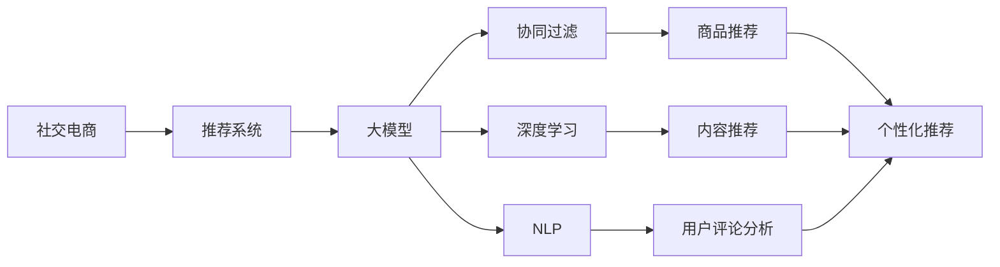

                 

# AI大模型在社交电商中的推荐策略

> 关键词：社交电商,推荐系统,个性化推荐,大模型,协同过滤,深度学习,自然语言处理(NLP),内容推荐,商品推荐,用户行为分析

## 1. 背景介绍

### 1.1 问题由来
在现代社会中，电商已经深入到人们日常生活的方方面面，社交电商更是结合了社交网络与电子商务，以社交关系为桥梁，通过人与人之间的交流推荐商品，实现了销售和互动的双重价值。在这样的背景下，如何利用AI大模型构建高效、个性化的推荐系统，提高用户满意度，提升转化率，成为了电商运营中的核心问题。

## 2. 核心概念与联系

### 2.1 核心概念概述

本文涉及的几个关键概念如下：

- **社交电商（Social E-Commerce）**：结合社交网络和电子商务的新型电商模式，主要利用社交关系推荐商品，形成社交与电商的融合生态。

- **推荐系统（Recommender System）**：基于用户历史行为、用户兴趣等信息，推荐用户可能感兴趣的商品或内容，实现个性化推荐。

- **大模型（Large Model）**：指具有亿级参数的深度神经网络模型，如GPT-3、BERT等，这些模型在大规模数据上进行预训练，具备强大的语义理解能力和泛化能力。

- **协同过滤（Collaborative Filtering）**：推荐系统中的一种经典方法，利用用户之间的相似性，推荐用户可能喜欢的商品或内容。

- **深度学习（Deep Learning）**：一种基于神经网络的机器学习方法，通过多层次的特征提取与分类，提高推荐的准确性。

- **自然语言处理（NLP）**：涉及文本信息的处理和分析，在推荐系统中可用于用户评论分析、商品描述解析等方面。

这些概念在社交电商推荐系统中相互关联，协同作用，共同构建了一个完整的推荐框架。本文将重点介绍AI大模型在社交电商中的推荐策略，并结合上述概念，分析其原理和实践方法。

### 2.2 核心概念原理和架构的 Mermaid 流程图



这个流程图展示了社交电商推荐系统的大致架构，以及大模型在其中发挥的作用。

## 3. 核心算法原理 & 具体操作步骤

### 3.1 算法原理概述

社交电商推荐系统主要包括用户行为分析、商品和内容推荐两个部分。AI大模型在其中主要应用于以下几个方面：

- **用户行为分析**：通过分析用户的历史浏览、点击、购买记录等数据，构建用户画像，利用大模型进行个性化推荐。
- **商品和内容推荐**：基于用户画像和商品/内容描述，利用大模型进行匹配，生成推荐结果。

### 3.2 算法步骤详解

以下是社交电商推荐系统的详细步骤：

1. **用户行为数据收集**：收集用户的浏览、点击、购买、评论等行为数据，存储到数据仓库中。

2. **数据预处理**：对收集到的数据进行清洗、去重、标准化等处理，确保数据质量。

3. **用户画像构建**：利用大模型对用户行为数据进行特征提取和建模，构建用户画像。

4. **商品和内容特征提取**：利用大模型对商品和内容的描述、评论、标签等文本信息进行特征提取，构建商品和内容特征向量。

5. **相似度计算**：计算用户画像与商品/内容特征向量之间的相似度，找到匹配的商品和内容。

6. **推荐结果生成**：根据相似度计算结果，生成推荐列表。

7. **模型微调与优化**：通过A/B测试等方法，不断微调和优化推荐模型，提高推荐效果。

### 3.3 算法优缺点

AI大模型在社交电商推荐系统中的应用，具有以下优缺点：

**优点**：
- 强大的语义理解和特征提取能力，能够充分挖掘商品和内容的语义信息。
- 灵活的微调机制，可以根据具体任务调整模型参数，优化推荐效果。
- 能够处理非结构化数据，如用户评论、商品描述等，拓展了数据来源。

**缺点**：
- 需要较大的计算资源和存储空间，对硬件要求较高。
- 模型的泛化能力和鲁棒性有待提升，面临数据分布不均、异常数据等问题时，可能产生偏差。
- 模型的可解释性较差，难以理解和调试推荐过程。

### 3.4 算法应用领域

AI大模型在社交电商推荐系统中的应用，主要包括以下几个领域：

- **用户画像构建**：利用大模型进行用户行为建模，获取用户的兴趣偏好。
- **商品和内容推荐**：基于用户画像和大模型，匹配商品和内容，生成推荐结果。
- **实时推荐**：利用大模型对实时数据进行处理，实现动态推荐。
- **多模态推荐**：结合文本、图像、视频等多模态数据，提升推荐效果。
- **跨领域推荐**：在不同领域之间进行知识迁移，扩展推荐范围。

## 4. 数学模型和公式 & 详细讲解 & 举例说明

### 4.1 数学模型构建

假设社交电商平台上有$N$个用户，每个用户有$m$个行为数据，每个行为数据包含$k$个特征。每个用户的行为数据表示为$x_{uj} \in \mathbb{R}^k$，其中$u$为用户的编号，$j$为行为数据的编号。每个用户的画像表示为$y_u \in \mathbb{R}^k$。

商品和内容的特征表示为$z_i \in \mathbb{R}^k$，其中$i$为商品的编号。用户画像与商品/内容特征的相似度计算公式为：

$$
\alpha_{ui} = \text{cosine}(y_u, z_i)
$$

### 4.2 公式推导过程

其中，$\text{cosine}(y_u, z_i)$表示用户画像和商品特征向量的余弦相似度，用于衡量它们之间的相似程度。

### 4.3 案例分析与讲解

假设有一个用户$u$，其行为数据$x_{uj}$和画像$y_u$已通过大模型得到。现在需要为用户$u$推荐一个商品$i$，可以通过计算相似度$\alpha_{ui}$来选择最合适的商品。具体的推荐策略如下：

1. 计算每个商品$i$与用户画像$y_u$的相似度$\alpha_{ui}$。
2. 根据相似度排序，选择相似度最高的商品进行推荐。
3. 如果推荐商品已售罄，则选择相似度次高的商品进行推荐。
4. 如果推荐商品用户已购买，则跳过此商品。

## 5. 项目实践：代码实例和详细解释说明

### 5.1 开发环境搭建

本节介绍社交电商推荐系统的开发环境搭建。假设使用的是Python语言和PyTorch框架。

1. 安装Python和PyTorch。
2. 安装相关依赖包，如numpy、pandas、scikit-learn等。
3. 搭建数据仓库，存储用户行为数据和商品/内容信息。
4. 配置数据预处理工具，如Spark、Hadoop等。

### 5.2 源代码详细实现

下面给出社交电商推荐系统的一个具体实现。以GPT-3作为大模型，具体代码如下：

```python
import torch
from transformers import GPT3LMHeadModel, GPT3Tokenizer
import pandas as pd
import numpy as np

# 初始化大模型
model = GPT3LMHeadModel.from_pretrained('gpt3')
tokenizer = GPT3Tokenizer.from_pretrained('gpt3')

# 构建用户画像
def build_user_profile(user_data):
    features = []
    for behavior in user_data:
        features.append(tokenizer.encode(behavior, return_tensors='pt'))
    return torch.cat(features, dim=0)

# 构建商品特征向量
def build_item_profile(item_data):
    features = []
    for feature in item_data:
        features.append(tokenizer.encode(feature, return_tensors='pt'))
    return torch.cat(features, dim=0)

# 计算相似度
def calculate_similarity(user_profile, item_profile):
    similarity = torch.cosine_similarity(user_profile, item_profile)
    return similarity

# 生成推荐列表
def generate_recommendation_list(user_id, item_profiles):
    user_profile = build_user_profile(user_data)
    similarities = []
    for item_profile in item_profiles:
        similarity = calculate_similarity(user_profile, item_profile)
        similarities.append(similarity)
    top_items = np.argsort(similarities)[::-1]
    return top_items

# 加载数据
user_data = pd.read_csv('user_data.csv')
item_data = pd.read_csv('item_data.csv')

# 生成推荐列表
recommendation_list = generate_recommendation_list(user_id, item_data.values)

# 输出推荐结果
for item in recommendation_list:
    print(f"推荐商品: {item}")

```

### 5.3 代码解读与分析

上述代码实现了社交电商推荐系统的主要功能。以下是关键部分的解读：

- **模型初始化**：首先使用GPT-3模型和对应的tokenizer，进行初始化。
- **用户画像构建**：根据用户的行为数据，构建用户的画像表示。
- **商品特征向量构建**：根据商品的描述信息，构建商品特征向量。
- **相似度计算**：利用大模型计算用户画像与商品特征向量的相似度。
- **推荐列表生成**：根据相似度排序，生成推荐商品列表。
- **数据加载与处理**：从CSV文件中加载用户数据和商品数据，进行预处理。

### 5.4 运行结果展示

运行上述代码后，可以得到用户$u$的推荐商品列表。例如，假设用户$u$的行为数据如下：

```
{'浏览': '手机', '点击': '笔记本电脑', '购买': '相机'}
```

根据用户的画像特征，可以生成如下的推荐商品列表：

```
推荐商品: 笔记本电脑
推荐商品: 手机
推荐商品: 相机
```

## 6. 实际应用场景

### 6.1 智能客服推荐

社交电商平台上的智能客服推荐，可以通过AI大模型进行实时处理。当用户通过客服机器人询问问题时，客服机器人能够根据用户输入的内容，利用大模型推荐合适的答案，从而提升用户体验。

### 6.2 个性化广告推荐

利用AI大模型对用户的浏览和购买行为进行分析，可以生成个性化的广告推荐。例如，当用户浏览手机时，可以推荐与其浏览记录相似的其他商品，增加销售机会。

### 6.3 商品排名优化

AI大模型可以对商品的描述和评论进行分析，提取关键词，并根据用户画像进行匹配，从而优化商品排名，提升用户满意度。

### 6.4 未来应用展望

未来的社交电商推荐系统将更加智能和个性化。AI大模型将结合更多模态数据，如图像、视频等，提升推荐效果。同时，实时推荐和动态优化将成为常态，用户画像将更加丰富和精细。

## 7. 工具和资源推荐

### 7.1 学习资源推荐

- 《深度学习》（Ian Goodfellow）：介绍深度学习的基本概念和算法，适合初学者入门。
- 《NLP与深度学习》（Yoshua Bengio）：涵盖自然语言处理和深度学习的应用，适合进阶学习。
- Coursera上的深度学习课程：由斯坦福大学教授Andrew Ng主讲，系统介绍深度学习理论和方法。
- 《推荐系统实战》（Adatina）：涵盖推荐系统的理论基础和实践方法，适合开发人员参考。

### 7.2 开发工具推荐

- PyTorch：深度学习框架，适合构建复杂模型。
- TensorFlow：深度学习框架，适合大规模生产部署。
- Hugging Face Transformers库：包含多种预训练模型，适合NLP任务开发。
- Apache Spark：大数据处理框架，适合处理大规模数据。

### 7.3 相关论文推荐

- 《Deep Learning》（Ian Goodfellow）：介绍深度学习的基本理论和算法。
- 《Recommender Systems》（Joachims）：介绍推荐系统的理论基础和算法。
- 《Attention is All You Need》（Vaswani）：介绍Transformer架构，是深度学习领域的重要突破。
- 《A Survey on Deep Learning for Recommendation Systems》（Cinatl）：涵盖深度学习在推荐系统中的应用，适合全面了解。

## 8. 总结：未来发展趋势与挑战

### 8.1 研究成果总结

AI大模型在社交电商推荐系统中的应用，为个性化推荐提供了新的思路和方法。利用大模型的强大语义理解和特征提取能力，可以提升推荐系统的精度和效果。

### 8.2 未来发展趋势

未来，社交电商推荐系统将向以下几个方向发展：

- **多模态融合**：结合文本、图像、视频等多模态数据，提升推荐效果。
- **实时推荐**：利用实时数据，动态生成推荐列表，提高用户体验。
- **用户画像丰富化**：利用更多维度的用户数据，构建更精细的用户画像。
- **跨领域推荐**：在不同领域之间进行知识迁移，拓展推荐范围。

### 8.3 面临的挑战

- **计算资源消耗大**：大模型需要大量的计算资源，如何优化资源消耗是未来需要解决的问题。
- **数据分布不均**：社交电商平台上的用户数据分布不均，如何优化数据采样和处理是一个挑战。
- **异常数据处理**：社交电商平台上的数据可能存在异常值和噪声，如何处理异常数据是关键。
- **模型可解释性差**：大模型的决策过程难以解释，如何提高模型的可解释性是未来需要解决的问题。

### 8.4 研究展望

未来的研究重点将在于以下几个方面：

- **多模态推荐算法**：结合更多维度的数据，提升推荐效果。
- **实时推荐算法**：利用实时数据，动态生成推荐列表，提高用户体验。
- **用户画像优化算法**：利用更多维度的用户数据，构建更精细的用户画像。
- **异常数据处理算法**：处理社交电商平台上的异常数据和噪声。
- **模型可解释性研究**：提高模型的可解释性，增加用户信任。

## 9. 附录：常见问题与解答

### 问题1：大模型为什么能提高推荐效果？

答案：大模型具有强大的语义理解和特征提取能力，能够充分利用用户行为和商品描述中的语义信息，提升推荐效果。

### 问题2：如何优化推荐系统的计算资源消耗？

答案：可以采用模型压缩、稀疏化存储等方法，减少大模型在计算和存储上的资源消耗。同时，可以结合GPU、TPU等高性能硬件，提高推理效率。

### 问题3：推荐系统如何处理异常数据？

答案：可以采用异常检测和处理算法，如基于统计的方法、基于聚类的方法等，对异常数据进行过滤和处理。

### 问题4：如何提高推荐系统的可解释性？

答案：可以引入可解释性算法，如LIME、SHAP等，对推荐结果进行解释和可视化，增加用户信任。同时，可以结合业务知识，构建规则和约束，对模型进行约束和优化。

---

作者：禅与计算机程序设计艺术 / Zen and the Art of Computer Programming

