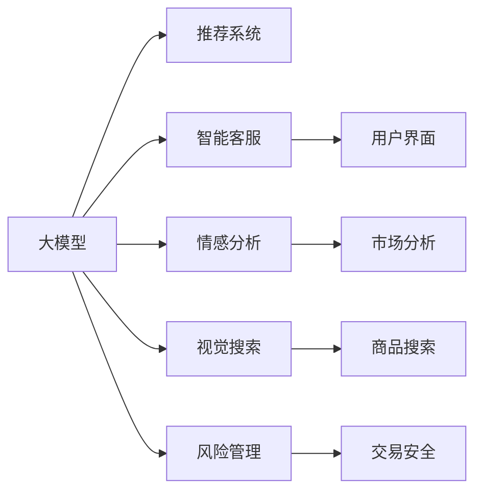
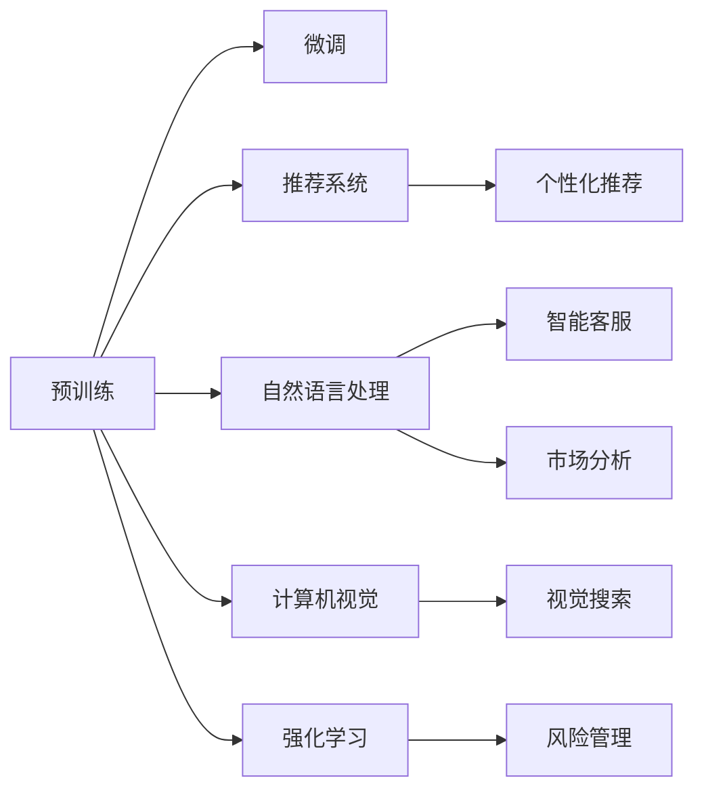

                 

# AI大模型在跨境电商中的应用价值

> 关键词：人工智能, 大模型, 跨境电商, 推荐系统, 客户体验, 智能客服, 风险管理

## 1. 背景介绍

### 1.1 问题由来
随着全球贸易的快速发展，跨境电商市场规模不断扩大，竞争日趋激烈。传统的跨境电商解决方案往往依赖于大量的人力资源和繁琐的人工操作，难以满足用户快速、精准、个性化的购物需求。如何通过技术手段提升跨境电商平台的运营效率和用户体验，成为了跨境电商企业亟待解决的难题。

人工智能技术，尤其是大模型在自然语言处理、计算机视觉、语音识别等领域的飞速发展，为跨境电商的智能化升级提供了新机遇。大模型通过预训练学习通用的语言知识和数据模式，再通过微调适配特定任务，具备强大的推理和生成能力，可以显著提升跨境电商平台的运营效率和服务质量。

### 1.2 问题核心关键点
大模型在跨境电商中的应用主要集中在以下几个方面：

1. **推荐系统**：通过分析用户的历史浏览和购买数据，推荐系统可以预测用户可能感兴趣的商品，提升转化率。
2. **智能客服**：利用大模型进行自然语言理解和生成，提升客服系统的响应速度和准确率。
3. **风险管理**：通过情感分析和大数据监控，预测市场波动和欺诈行为，增强交易安全。
4. **用户体验优化**：利用对话系统和图像识别技术，提升用户的购物体验和满意度。

这些应用场景展示了AI大模型在跨境电商中的巨大潜力，但如何在大规模数据和复杂业务环境下有效利用AI技术，仍是许多企业面临的挑战。

## 2. 核心概念与联系

### 2.1 核心概念概述

为更好地理解AI大模型在跨境电商中的应用，本节将介绍几个密切相关的核心概念：

- **大模型(Large Models)**：指在预训练阶段使用大规模数据进行训练，参数量在10亿以上，具备强大语言、视觉、听觉等能力的深度学习模型，如BERT、GPT-3、DALL·E等。
- **推荐系统(Recommendation Systems)**：通过分析用户行为数据，预测用户兴趣，推荐个性化商品的系统，常见于电商、视频、音乐等领域。
- **智能客服(Chatbots)**：利用自然语言处理技术，实现自动化客服功能，能够理解和生成自然语言，解决用户咨询。
- **情感分析(Sentiment Analysis)**：通过分析文本情感，判断用户对商品或服务的满意度，辅助企业进行市场分析和用户管理。
- **视觉搜索(Visual Search)**：利用计算机视觉技术，用户通过上传图片或描述，找到相似的商品。
- **风险管理(Risk Management)**：通过大数据和机器学习，预测市场波动和欺诈行为，保护交易安全。

这些概念之间的逻辑关系可以通过以下Mermaid流程图来展示：



这个流程图展示了大模型在跨境电商中的关键应用场景：

1. 大模型通过预训练获得广泛的知识，再通过微调适配特定任务，提供强大的推理和生成能力。
2. 推荐系统、智能客服、情感分析、视觉搜索和风险管理等应用，均可以依托大模型，实现高效、精准的功能。
3. 这些应用场景紧密联系，共同构建起跨境电商平台的智能化生态。

## 3. 核心算法原理 & 具体操作步骤
### 3.1 算法原理概述

AI大模型在跨境电商中的应用主要依赖于以下几大核心算法：

- **预训练与微调(Pre-training & Fine-tuning)**：通过大规模数据预训练通用大模型，再在其基础上进行微调，以适配特定任务，提升模型性能。
- **推荐系统算法**：基于协同过滤、内容推荐、混合推荐等算法，实现个性化商品推荐。
- **自然语言处理(NLP)**：通过语言模型、情感分析、文本分类等算法，提升智能客服和市场分析的效果。
- **计算机视觉(Computer Vision)**：利用图像识别、目标检测等算法，实现视觉搜索和商品展示。
- **强化学习(Reinforcement Learning)**：通过模拟交易环境，训练风险管理模型，提高预测准确率。

这些算法之间的逻辑关系可以通过以下Mermaid流程图来展示：



### 3.2 算法步骤详解

下面以推荐系统为例，详细讲解大模型在跨境电商中的应用步骤：

**Step 1: 数据收集与预处理**
- 收集用户的历史浏览、购买记录、评分数据等，构建用户行为数据集。
- 对数据进行清洗、归一化、去重等预处理，保证数据质量。

**Step 2: 特征工程**
- 设计特征提取方法，将原始数据转化为模型可理解的特征向量。
- 特征选择和降维，提高模型训练效率和泛化能力。

**Step 3: 模型选择与训练**
- 选择适合的推荐算法模型，如协同过滤、内容推荐、混合推荐等。
- 在预训练大模型的基础上，进行微调，适应特定任务。

**Step 4: 模型评估与优化**
- 使用交叉验证等方法，评估模型在验证集上的表现。
- 根据评估结果，调整超参数，优化模型性能。

**Step 5: 部署与迭代**
- 将训练好的模型部署到线上系统，实现实时推荐。
- 定期收集用户反馈和新增数据，重新训练和优化模型，持续提升推荐效果。

### 3.3 算法优缺点

AI大模型在跨境电商中的应用具有以下优点：

1. **高效率**：自动化处理大量数据，节省人力成本，提升运营效率。
2. **精准推荐**：基于用户行为数据的深度学习模型，能够提供高度个性化的推荐，提升转化率。
3. **即时反馈**：实时分析用户行为数据，快速调整推荐策略，优化用户体验。
4. **跨领域迁移**：预训练模型具备通用性，在多个任务上表现优异。

同时，也存在一些局限性：

1. **数据依赖**：需要大量的用户行为数据进行训练，数据获取和标注成本高。
2. **模型复杂度**：大规模参数量带来高计算资源需求，部署和维护难度大。
3. **可解释性不足**：深度学习模型黑盒性质，难以解释推荐决策过程。
4. **冷启动问题**：新用户缺乏历史数据，推荐系统难以准确预测其兴趣。

尽管存在这些局限，AI大模型仍被认为是提升跨境电商运营效率和用户体验的有效手段。

### 3.4 算法应用领域

AI大模型在跨境电商中的应用广泛，涵盖多个关键领域：

1. **个性化推荐**：提升用户购物体验，提高转化率和复购率。
2. **智能客服**：减少人工客服成本，提高客户满意度。
3. **市场分析**：通过情感分析和用户反馈，了解市场需求和趋势。
4. **风险管理**：预测交易欺诈和市场波动，保障交易安全。
5. **视觉搜索**：利用计算机视觉技术，提升商品搜索效率和准确率。
6. **内容生成**：自动生成商品描述、广告文案等，提升内容产出效率。

以上领域展示了AI大模型在跨境电商中的重要应用，为其智能化转型提供了有力支持。

## 4. 数学模型和公式 & 详细讲解 & 举例说明

### 4.1 数学模型构建

为了更好地理解推荐系统的算法原理，我们以协同过滤算法为例，构建推荐模型的数学模型。

假设用户集为 $U$，商品集为 $I$，用户对商品的评分矩阵为 $R_{ui}$。协同过滤算法的目标是通过训练，预测用户 $u$ 对商品 $i$ 的评分 $R_{ui}$。

推荐模型可以表示为：

$$
\hat{R}_{ui} = W_u^\top A_i + \beta_u
$$

其中 $W_u$ 为用户 $u$ 的特征向量，$A_i$ 为商品 $i$ 的特征向量，$\beta_u$ 为用户的常数偏置项，$W_u^\top$ 和 $A_i$ 为特征向量的线性组合权重。

### 4.2 公式推导过程

协同过滤算法的目标函数为：

$$
\min_{W_u, A_i, \beta_u} \sum_{(u,i)\in U\times I} (R_{ui} - \hat{R}_{ui})^2
$$

利用梯度下降等优化算法，求解上述最优化问题。得到用户 $u$ 对商品 $i$ 的推荐评分 $\hat{R}_{ui}$。

### 4.3 案例分析与讲解

假设有一用户 $u_1$ 对商品 $i_1$ 的评分 $R_{i1}=5$，根据协同过滤算法，对商品 $i_1$ 的其他用户 $u_2$ 和商品 $i_2$ 的评分 $R_{u2i2}=3$ 进行预测，得到：

$$
\hat{R}_{u2i2} = W_{u_2}^\top A_{i_2} + \beta_{u_2}
$$

将 $\hat{R}_{u2i2}$ 代入损失函数，求解得到预测评分 $\hat{R}_{u2i2}$，进而得到用户 $u_2$ 对商品 $i_2$ 的推荐评分。

## 5. 项目实践：代码实例和详细解释说明

### 5.1 开发环境搭建

在进行推荐系统开发前，我们需要准备好开发环境。以下是使用Python进行Scikit-Learn和TensorFlow开发的推荐系统环境配置流程：

1. 安装Anaconda：从官网下载并安装Anaconda，用于创建独立的Python环境。

2. 创建并激活虚拟环境：
```bash
conda create -n recomm_system_env python=3.8 
conda activate recomm_system_env
```

3. 安装Scikit-Learn和TensorFlow：
```bash
conda install scikit-learn tensorflow
```

4. 安装TensorBoard：
```bash
conda install tensorboard
```

完成上述步骤后，即可在`recomm_system_env`环境中开始推荐系统开发。

### 5.2 源代码详细实现

下面我们以协同过滤推荐系统为例，给出使用Scikit-Learn和TensorFlow进行推荐系统开发的Python代码实现。

首先，定义数据加载和预处理函数：

```python
from sklearn.model_selection import train_test_split
from sklearn.preprocessing import StandardScaler
import pandas as pd

def load_and_preprocess_data(path):
    # 读取数据集
    df = pd.read_csv(path)
    
    # 划分训练集和测试集
    train_df, test_df = train_test_split(df, test_size=0.2, random_state=42)
    
    # 标准化特征
    scaler = StandardScaler()
    train_df = scaler.fit_transform(train_df)
    test_df = scaler.transform(test_df)
    
    return train_df, test_df
```

然后，定义模型训练和评估函数：

```python
from sklearn.metrics import mean_squared_error
from tensorflow.keras.models import Sequential
from tensorflow.keras.layers import Dense

def train_and_evaluate_model(X_train, y_train, X_test, y_test):
    # 定义模型结构
    model = Sequential([
        Dense(64, activation='relu', input_shape=(X_train.shape[1],)),
        Dense(32, activation='relu'),
        Dense(1, activation='linear')
    ])
    
    # 编译模型
    model.compile(optimizer='adam', loss='mse')
    
    # 训练模型
    model.fit(X_train, y_train, epochs=10, batch_size=32)
    
    # 评估模型
    y_pred = model.predict(X_test)
    mse = mean_squared_error(y_test, y_pred)
    return mse
```

最后，启动训练流程并在测试集上评估：

```python
from sklearn.datasets import make_regression
import numpy as np

# 生成随机数据
X, y = make_regression(n_samples=1000, n_features=10, n_informative=8, n_targets=1, random_state=42)

# 标准化特征
scaler = StandardScaler()
X = scaler.fit_transform(X)
y = scaler.fit_transform(y)

# 划分训练集和测试集
X_train, X_test, y_train, y_test = train_test_split(X, y, test_size=0.2, random_state=42)

# 训练模型并评估
mse = train_and_evaluate_model(X_train, y_train, X_test, y_test)
print(f"MSE: {mse:.3f}")
```

以上就是使用Scikit-Learn和TensorFlow进行协同过滤推荐系统开发的完整代码实现。可以看到，得益于Scikit-Learn和TensorFlow的强大封装，我们可以用相对简洁的代码完成推荐系统的开发。

### 5.3 代码解读与分析

让我们再详细解读一下关键代码的实现细节：

**load_and_preprocess_data函数**：
- `read_csv`方法读取CSV格式的数据集，返回pandas DataFrame对象。
- `train_test_split`方法将数据集划分为训练集和测试集，比例为80:20。
- `StandardScaler`类对特征进行标准化处理，保证数据的一致性。

**train_and_evaluate_model函数**：
- `Sequential`类创建顺序模型，定义模型结构。
- `Dense`层定义模型各层的神经元个数和激活函数。
- `compile`方法编译模型，设置优化器和损失函数。
- `fit`方法训练模型，设置训练轮数和批大小。
- `predict`方法对测试集进行预测。
- `mean_squared_error`方法计算预测值与真实值之间的均方误差。

**训练流程**：
- 生成随机数据集。
- 对特征进行标准化处理。
- 划分训练集和测试集。
- 调用训练函数进行模型训练和评估。
- 输出模型评估指标（均方误差）。

## 6. 实际应用场景

### 6.1 推荐系统

在跨境电商中，推荐系统是最重要的一环。用户通过浏览和购买行为，形成海量的用户行为数据。这些数据通过推荐算法处理，可以预测用户可能感兴趣的商品，并实时推送推荐信息，提升用户体验和转化率。

推荐系统的核心在于对用户行为数据的深度挖掘和分析。通过协同过滤、内容推荐、混合推荐等算法，可以构建高精度的推荐模型。实际应用中，需要根据平台特点和用户需求，选择适合推荐算法，并结合大模型进行微调，提升推荐效果。

### 6.2 智能客服

跨境电商企业往往面临客户咨询量大的问题。传统的客服方式依赖于大量人工，成本高、效率低。利用大模型进行自然语言处理，可以实现自动客服功能，快速响应客户咨询，提升服务效率。

智能客服的核心在于自然语言理解和生成。通过预训练大模型的微调，可以实现高效的客服系统。实际应用中，需要根据平台特点和客户需求，选择适合的语言模型，并结合业务场景进行微调，提升客服系统的准确率和响应速度。

### 6.3 市场分析

跨境电商企业需要实时了解市场动向，预测商品需求和用户反馈。通过情感分析和用户反馈数据，可以分析市场趋势，调整产品策略，提升用户体验。

市场分析的核心在于文本情感分析和用户反馈数据处理。通过预训练大模型的微调，可以实现高效的情感分析和用户反馈处理。实际应用中，需要根据平台特点和用户需求，选择适合的语言模型，并结合业务场景进行微调，提升市场分析的准确性和及时性。

### 6.4 风险管理

跨境电商涉及跨境交易，风险管理尤为重要。通过大数据和机器学习，可以预测市场波动和欺诈行为，保障交易安全。

风险管理的核心在于异常检测和大数据监控。通过预训练大模型的微调，可以实现高效的异常检测和市场监控。实际应用中，需要根据平台特点和交易需求，选择适合的大模型，并结合业务场景进行微调，提升风险管理的准确性和及时性。

### 6.5 视觉搜索

跨境电商用户往往需要通过上传图片或描述，找到相似的商品。通过计算机视觉技术，可以实现高效的视觉搜索功能，提升购物体验。

视觉搜索的核心在于图像识别和目标检测。通过预训练大模型的微调，可以实现高效的图像识别和目标检测。实际应用中，需要根据平台特点和用户需求，选择适合的视觉模型，并结合业务场景进行微调，提升视觉搜索的准确性和效率。

## 7. 工具和资源推荐

### 7.1 学习资源推荐

为了帮助开发者系统掌握AI大模型在跨境电商中的应用，这里推荐一些优质的学习资源：

1. 《深度学习推荐系统》书籍：介绍深度学习在推荐系统中的应用，涵盖协同过滤、内容推荐、混合推荐等算法。
2. 《自然语言处理》课程：斯坦福大学开设的NLP明星课程，有Lecture视频和配套作业，带你入门NLP领域的基本概念和经典模型。
3. 《Transformers实战》系列博文：由大模型技术专家撰写，深入浅出地介绍了Transformer原理、BERT模型、微调技术等前沿话题。
4. 《机器学习实战》书籍：介绍机器学习在电商推荐、智能客服等领域的应用，提供丰富的代码实现和案例分析。
5. 《Python深度学习》书籍：介绍深度学习在图像识别、自然语言处理等领域的应用，提供丰富的代码实现和案例分析。

通过对这些资源的学习实践，相信你一定能够快速掌握AI大模型在跨境电商中的应用精髓，并用于解决实际的业务问题。

### 7.2 开发工具推荐

高效的开发离不开优秀的工具支持。以下是几款用于AI大模型在跨境电商中应用的常用工具：

1. Scikit-Learn：Python中的机器学习库，提供丰富的数据预处理、模型训练和评估工具。
2. TensorFlow：由Google主导开发的深度学习框架，生产部署方便，适合大规模工程应用。
3. PyTorch：基于Python的开源深度学习框架，灵活动态的计算图，适合快速迭代研究。
4. Weights & Biases：模型训练的实验跟踪工具，可以记录和可视化模型训练过程中的各项指标，方便对比和调优。
5. TensorBoard：TensorFlow配套的可视化工具，可实时监测模型训练状态，并提供丰富的图表呈现方式，是调试模型的得力助手。

合理利用这些工具，可以显著提升AI大模型在跨境电商应用的开发效率，加快创新迭代的步伐。

### 7.3 相关论文推荐

AI大模型在跨境电商中的应用源于学界的持续研究。以下是几篇奠基性的相关论文，推荐阅读：

1. Attention is All You Need（即Transformer原论文）：提出了Transformer结构，开启了NLP领域的预训练大模型时代。
2. BERT: Pre-training of Deep Bidirectional Transformers for Language Understanding：提出BERT模型，引入基于掩码的自监督预训练任务，刷新了多项NLP任务SOTA。
3. 《深度学习推荐系统：理论与实践》：介绍深度学习在推荐系统中的应用，涵盖协同过滤、内容推荐、混合推荐等算法。
4. 《智能客服系统》：介绍利用大模型进行自然语言处理，实现自动客服功能，提升服务效率。
5. 《机器学习实战》：介绍机器学习在电商推荐、智能客服等领域的应用，提供丰富的代码实现和案例分析。
6. 《计算机视觉：模型、学习和推理》：介绍计算机视觉技术在视觉搜索中的应用，涵盖图像识别、目标检测等算法。

这些论文代表了大模型在跨境电商中的应用发展脉络。通过学习这些前沿成果，可以帮助研究者把握学科前进方向，激发更多的创新灵感。

## 8. 总结：未来发展趋势与挑战

### 8.1 总结

本文对AI大模型在跨境电商中的应用进行了全面系统的介绍。首先阐述了AI大模型和微调技术的研究背景和意义，明确了推荐系统、智能客服、市场分析、风险管理、视觉搜索等关键应用场景。其次，从原理到实践，详细讲解了推荐系统的算法原理和关键步骤，给出了推荐系统任务开发的完整代码实例。同时，本文还广泛探讨了AI大模型在跨境电商中的应用前景，展示了其在推荐系统、智能客服、市场分析、风险管理、视觉搜索等众多领域的应用潜力。

通过本文的系统梳理，可以看到，AI大模型在跨境电商中的应用已经迈出了坚实的步伐，并展现出广阔的发展前景。伴随技术的持续进步，AI大模型必将在跨境电商智能化转型中发挥越来越重要的作用，为行业带来深远的变革。

### 8.2 未来发展趋势

展望未来，AI大模型在跨境电商中的应用将呈现以下几个发展趋势：

1. **模型规模持续增大**：随着算力成本的下降和数据规模的扩张，预训练语言模型的参数量还将持续增长。超大规模语言模型蕴含的丰富语言知识，有望支撑更加复杂多变的跨境电商推荐系统。
2. **跨领域迁移能力增强**：未来的大模型将具备更强的跨领域迁移能力，能够在不同场景下快速适应，提高应用灵活性。
3. **计算效率提升**：通过模型压缩、量化加速、混合精度训练等技术，大模型将具备更强的计算效率和实时性，满足跨境电商实时推荐的需求。
4. **用户隐私保护**：随着隐私保护法规的加强，未来的智能系统将更加注重用户数据隐私和安全，采用联邦学习、差分隐私等技术，保障用户隐私。
5. **个性化推荐优化**：通过引入更多先验知识、优化模型结构等手段，未来的推荐系统将具备更高的个性化推荐精度和准确性。
6. **多模态融合**：利用图像识别、语音识别等多模态信息，提升用户体验和推荐效果。

以上趋势凸显了AI大模型在跨境电商中的应用前景。这些方向的探索发展，必将进一步提升跨境电商平台的运营效率和服务质量，构建更加智能、高效、安全的跨境电商生态。

### 8.3 面临的挑战

尽管AI大模型在跨境电商中的应用取得了显著成效，但在迈向更加智能化、普适化应用的过程中，仍面临诸多挑战：

1. **数据隐私和安全**：跨境电商涉及多国数据，需要严格遵守数据隐私法规，保障用户数据安全。如何高效利用数据，同时保护用户隐私，仍是一大难题。
2. **计算资源消耗**：超大规模大模型带来高计算资源需求，部署和维护难度大。如何在保证模型性能的同时，优化资源消耗，仍需不断优化。
3. **跨文化适应**：不同国家和地区的文化背景、语言习惯差异大，大模型需要具备跨文化适应能力，才能更好地服务全球用户。
4. **模型鲁棒性和公平性**：大模型在特定场景下可能出现偏见和歧视，需要进一步优化模型鲁棒性和公平性。
5. **用户信任和接受度**：大模型在应用过程中，需要用户信任和接受，否则会影响用户粘性和平台竞争力。如何提升用户信任度，仍需持续努力。

面对这些挑战，未来的研究需要在以下几个方面寻求新的突破：

1. **数据隐私保护**：采用联邦学习、差分隐私等技术，确保用户数据隐私和安全。
2. **计算资源优化**：通过模型压缩、量化加速、混合精度训练等技术，优化计算资源消耗。
3. **跨文化适配**：引入多语言模型和跨文化适应的训练数据，提升模型跨文化适应能力。
4. **模型鲁棒性和公平性优化**：引入公平性约束和鲁棒性测试，优化模型鲁棒性和公平性。
5. **提升用户信任度**：通过模型解释性和透明性，提升用户信任度和接受度。

这些研究方向将推动AI大模型在跨境电商中的应用走向成熟，为构建更加智能、高效、安全的跨境电商平台铺平道路。

### 8.4 研究展望

未来的研究需要在以下几个方面进行深入探索：

1. **多模态融合**：利用图像识别、语音识别等多模态信息，提升用户体验和推荐效果。
2. **个性化推荐优化**：通过引入更多先验知识、优化模型结构等手段，提升个性化推荐精度和准确性。
3. **计算资源优化**：通过模型压缩、量化加速、混合精度训练等技术，优化计算资源消耗。
4. **跨文化适配**：引入多语言模型和跨文化适应的训练数据，提升模型跨文化适应能力。
5. **数据隐私保护**：采用联邦学习、差分隐私等技术，确保用户数据隐私和安全。
6. **模型鲁棒性和公平性优化**：引入公平性约束和鲁棒性测试，优化模型鲁棒性和公平性。

这些研究方向的探索，将推动AI大模型在跨境电商中的应用走向成熟，为构建更加智能、高效、安全的跨境电商平台铺平道路。相信随着技术的不断进步，AI大模型必将在跨境电商智能化转型中发挥越来越重要的作用，为行业带来深远的变革。

## 9. 附录：常见问题与解答

**Q1：AI大模型在跨境电商中应用有哪些优势？**

A: AI大模型在跨境电商中的应用具有以下优势：

1. **高效率**：自动化处理大量数据，节省人力成本，提升运营效率。
2. **精准推荐**：基于用户行为数据的深度学习模型，能够提供高度个性化的推荐，提升转化率。
3. **即时反馈**：实时分析用户行为数据，快速调整推荐策略，优化用户体验。
4. **跨领域迁移**：预训练模型具备通用性，在多个任务上表现优异。

**Q2：如何选择合适的AI大模型进行微调？**

A: 选择合适的AI大模型进行微调，需要考虑以下因素：

1. **任务类型**：不同任务需要不同类型的大模型，如推荐系统需要BERT，智能客服需要GPT。
2. **数据规模**：大模型的规模需要与数据规模相匹配，大规模数据适合大模型，小规模数据适合小模型。
3. **模型复杂度**：模型的复杂度需要与计算资源相匹配，资源有限时，应选择计算效率高的模型。
4. **任务需求**：根据具体任务需求，选择适合的模型，如个性化推荐、情感分析、视觉搜索等。

**Q3：AI大模型在跨境电商中应用面临哪些挑战？**

A: AI大模型在跨境电商中的应用面临以下挑战：

1. **数据隐私和安全**：跨境电商涉及多国数据，需要严格遵守数据隐私法规，保障用户数据安全。
2. **计算资源消耗**：超大规模大模型带来高计算资源需求，部署和维护难度大。
3. **跨文化适应**：不同国家和地区的文化背景、语言习惯差异大，大模型需要具备跨文化适应能力。
4. **模型鲁棒性和公平性**：大模型在特定场景下可能出现偏见和歧视，需要进一步优化模型鲁棒性和公平性。
5. **用户信任和接受度**：大模型在应用过程中，需要用户信任和接受，否则会影响用户粘性和平台竞争力。

尽管存在这些挑战，AI大模型在跨境电商中的应用仍具有广阔前景，需要在数据隐私保护、计算资源优化、跨文化适配、模型鲁棒性等方面进行持续探索和优化。

**Q4：如何提升AI大模型在跨境电商中的鲁棒性？**

A: 提升AI大模型在跨境电商中的鲁棒性，可以从以下几个方面进行优化：

1. **数据多样化**：收集不同背景、语言、文化的数据进行模型训练，提升模型的泛化能力。
2. **正则化技术**：使用L2正则、Dropout、Early Stopping等技术，防止模型过度适应训练数据。
3. **对抗训练**：引入对抗样本，提高模型的鲁棒性。
4. **模型压缩和优化**：通过模型压缩、量化加速等技术，优化模型结构，提升计算效率。
5. **多模型集成**：训练多个模型，取平均输出，减少过拟合风险。

通过这些技术手段，可以有效提升AI大模型在跨境电商中的鲁棒性，确保模型在不同场景下的稳定性和可靠性。

**Q5：AI大模型在跨境电商中如何进行跨文化适配？**

A: 进行跨文化适配，需要考虑以下几个方面：

1. **多语言模型**：使用多语言模型，如BERT、GPT-3等，提升模型的跨文化适应能力。
2. **文化差异数据**：收集不同文化背景的数据，进行模型微调，提升模型的文化适应性。
3. **领域特定微调**：针对不同领域，进行领域特定微调，提升模型的领域适应性。
4. **文化理解**：引入文化理解模块，对用户输入进行文化解析，提升模型的文化理解能力。

通过这些技术手段，可以有效提升AI大模型在跨境电商中的跨文化适配能力，确保模型在不同国家和地区的良好表现。

---

作者：禅与计算机程序设计艺术 / Zen and the Art of Computer Programming

