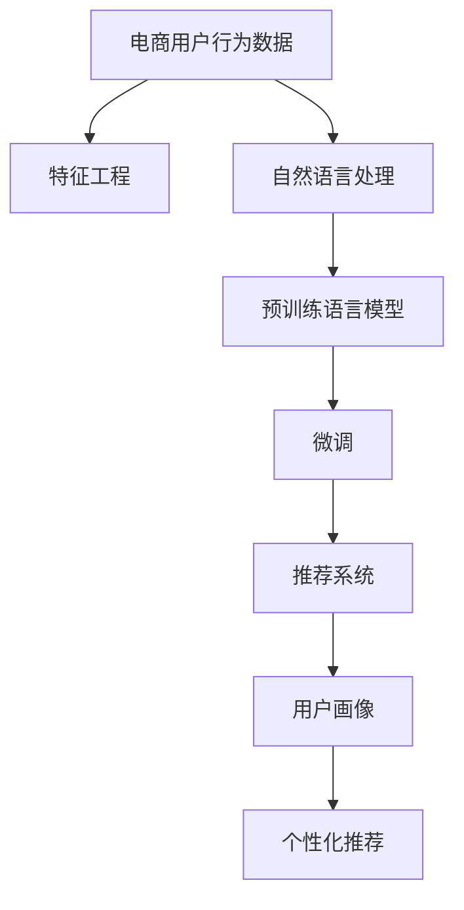

                 

# AI大模型对电商用户行为分析的深度洞察

> 关键词：大模型, 电商, 用户行为, 深度学习, 自然语言处理, 推荐系统, 特征工程

## 1. 背景介绍

### 1.1 问题由来

随着电商行业的快速发展，电商用户行为分析变得越来越重要。用户行为数据不仅包含用户的点击、浏览、购买等历史行为，还涵盖了用户的评论、评分、社交互动等多方面信息。深度学习尤其是自然语言处理技术的兴起，使得电商平台能够利用用户评论等文本数据，更全面地了解用户需求，预测用户行为，提升用户体验。

但是，传统的电商用户行为分析方法往往依赖于特征工程，需要手工提取、组合各种特征，成本高且效果难以保证。近年来，基于预训练语言模型的大模型方法，特别是BERT、GPT等深度模型，在自然语言处理任务中取得了突破性进展，以其强大的表达能力，推动了电商用户行为分析的发展。

### 1.2 问题核心关键点

大模型在电商用户行为分析中的应用，主要体现在以下几个方面：

1. **用户评论分析**：利用大模型对用户评论进行情感分析、主题分类等，了解用户对商品的满意度、偏好等信息。
2. **用户画像构建**：通过分析用户行为数据，结合用户评论，构建多维度的用户画像，提升个性化推荐效果。
3. **产品推荐系统**：利用大模型的语义理解能力，改进推荐算法，实现更准确的商品推荐。
4. **用户需求预测**：通过分析用户历史行为和评论内容，预测用户未来的购买需求，提供更及时、更精准的营销策略。

通过深度学习模型，电商平台可以更高效、更精准地分析用户行为，提升用户体验和平台竞争力。

## 2. 核心概念与联系

### 2.1 核心概念概述

在电商用户行为分析中，涉及到的核心概念包括：

- **大模型(大语言模型, Large Language Model, LLM)**：如BERT、GPT等，通过大规模无标签数据预训练，学习通用的语言表示，具备强大的语言理解和生成能力。
- **预训练(Pre-training)**：指在大规模无标签文本语料上，通过自监督学习任务训练通用语言模型的过程。
- **微调(Fine-tuning)**：在预训练模型的基础上，使用下游任务的少量标注数据，通过有监督学习优化模型在特定任务上的性能。
- **推荐系统(Recommendation System)**：根据用户历史行为和兴趣，推荐用户可能感兴趣的商品或内容。
- **特征工程(Feature Engineering)**：通过手工设计特征，提取用户行为数据中的有用信息，用于训练模型。
- **自然语言处理(Natural Language Processing, NLP)**：使用语言模型处理文本数据，提取有意义的特征。
- **情感分析(Sentiment Analysis)**：识别文本中蕴含的情感，如正面、负面、中性。
- **主题分类(Theme Classification)**：对文本进行主题标注，如产品评论的分类。

这些核心概念之间存在紧密的联系，共同构成了电商用户行为分析的深度学习框架。

### 2.2 核心概念原理和架构的 Mermaid 流程图



这个流程图展示了电商用户行为分析中各关键步骤的逻辑关系：

1. **电商用户行为数据**：包括点击、浏览、购买、评论等多方面信息。
2. **特征工程**：从电商用户行为数据中手工提取特征，如时间、频率、位置等。
3. **自然语言处理**：利用大模型处理用户评论，提取语义特征。
4. **预训练语言模型**：在大规模无标签数据上预训练，学习语言表示。
5. **微调**：利用电商用户行为数据进行微调，提升大模型的任务适应能力。
6. **推荐系统**：结合用户画像和行为特征，提供个性化推荐。
7. **用户画像**：通过用户行为和评论分析，构建多维度用户画像。
8. **个性化推荐**：根据用户画像和行为特征，推荐个性化商品或内容。

## 3. 核心算法原理 & 具体操作步骤
### 3.1 算法原理概述

基于大模型的电商用户行为分析方法，主要分为两个阶段：预训练和微调。

**预训练阶段**：在大规模无标签电商用户行为数据上预训练语言模型，学习通用的语言表示。此过程通过自监督学习任务，如掩码语言模型、句子对分类等，使得模型能够自动学习到语言中的各种规律和结构。

**微调阶段**：在预训练模型的基础上，利用电商用户行为数据进行微调，适应特定任务。此过程通过有监督学习，如情感分析、主题分类等，使得模型能够对用户评论等文本数据进行理解和分析。

### 3.2 算法步骤详解

基于大模型的电商用户行为分析步骤如下：

**Step 1: 准备电商用户行为数据**
- 收集电商平台的点击、浏览、购买、评论等数据。
- 对数据进行清洗和标注，去除噪声和无用信息。

**Step 2: 构建预训练数据集**
- 将电商用户行为数据与文本数据合并，生成大规模无标签数据集。
- 使用BertTokenizer等工具对文本数据进行分词和编码，生成输入序列。

**Step 3: 训练预训练模型**
- 使用自监督学习任务，如掩码语言模型、句子对分类等，训练预训练模型。
- 使用AdamW等优化算法，设置合适的学习率、批大小、迭代轮数等超参数。

**Step 4: 微调预训练模型**
- 在电商用户行为数据上微调预训练模型，进行情感分析、主题分类等任务。
- 选择合适的优化算法和正则化技术，如AdamW、Dropout等。
- 设置合适的学习率，避免破坏预训练权重。

**Step 5: 结合推荐系统**
- 根据用户画像和行为特征，生成个性化推荐列表。
- 结合大模型分析的文本特征，优化推荐系统算法。

### 3.3 算法优缺点

**优点**：
- **高效性**：利用大模型的预训练能力，减少特征工程的工作量。
- **泛化性强**：大模型经过大规模数据训练，具备更强的泛化能力，适应不同领域的电商用户行为数据。
- **灵活性**：大模型可以通过微调适应不同的任务，如情感分析、主题分类等。

**缺点**：
- **资源消耗大**：大模型的训练和推理需要高性能硬件，计算资源消耗较大。
- **解释性不足**：大模型的决策过程难以解释，难以进行调试和优化。
- **数据依赖性强**：大模型的性能依赖于高质量的数据标注，标注成本较高。

### 3.4 算法应用领域

大模型的电商用户行为分析方法，已经在电商推荐系统、用户画像构建、情感分析等多个领域得到广泛应用，取得了显著的效果。

- **电商推荐系统**：通过分析用户评论和行为数据，结合大模型的语义理解能力，改进推荐算法，提升推荐效果。
- **用户画像构建**：利用用户评论数据，结合用户行为特征，构建多维度的用户画像，提升个性化推荐。
- **情感分析**：对用户评论进行情感分析，了解用户对商品的好恶，优化产品策略。
- **主题分类**：对用户评论进行主题分类，了解用户关注的商品类型，提升产品推荐。

## 4. 数学模型和公式 & 详细讲解

### 4.1 数学模型构建

电商用户行为分析主要涉及以下几个数学模型：

1. **掩码语言模型**：
   $$
   P(\text{token}_i|H) = \frac{exp(\text{softmax}(H_{token_i}))}{\sum_{j=1}^N exp(\text{softmax}(H_{token_j}))}
   $$
   其中，$H$为预训练模型在输入序列上的隐藏表示，$softmax$为归一化函数。

2. **情感分析**：
   $$
   P(y|x) = \frac{exp(\text{softmax}(H_{y} \cdot H_{x}))}{\sum_{i=1}^K exp(\text{softmax}(H_{i} \cdot H_{x}))}
   $$
   其中，$x$为用户评论，$y$为情感标签，$H_{y}$为情感标签的隐藏表示，$H_{x}$为用户评论的隐藏表示。

3. **主题分类**：
   $$
   P(y|x) = \frac{exp(\text{softmax}(H_{y} \cdot H_{x}))}{\sum_{i=1}^C exp(\text{softmax}(H_{i} \cdot H_{x}))}
   $$
   其中，$x$为用户评论，$y$为主题标签，$H_{y}$为主题标签的隐藏表示，$H_{x}$为用户评论的隐藏表示，$C$为主题数量。

### 4.2 公式推导过程

**掩码语言模型**：
在掩码语言模型中，目标是从输入序列中预测缺失的token。给定一个输入序列$x = \{x_1, x_2, ..., x_n\}$，将其中$k$个token位置随机掩码，其余位置不变。模型需要预测这些位置上的token。

**情感分析**：
情感分析任务的目标是预测用户评论的情感标签。假设模型已经得到一个用户评论$x$，其中包含情感标签$y \in \{0, 1\}$，模型需要学习$x$与$y$之间的映射关系。

**主题分类**：
主题分类任务的目标是对用户评论进行主题分类。假设模型已经得到一个用户评论$x$，其中包含主题标签$y \in \{1, 2, ..., C\}$，模型需要学习$x$与$y$之间的映射关系。

### 4.3 案例分析与讲解

以电商推荐系统为例，分析大模型的应用过程：

1. **数据准备**：收集电商平台的点击、浏览、购买、评论等数据，并进行清洗和标注。
2. **预训练模型**：在无标签的电商用户行为数据上预训练BERT模型，学习通用的语言表示。
3. **微调模型**：在电商用户行为数据上微调BERT模型，进行情感分析、主题分类等任务。
4. **推荐系统**：根据用户画像和行为特征，生成个性化推荐列表。
5. **模型评估**：使用A/B测试等方法评估推荐效果，不断优化模型。

## 5. 项目实践：代码实例和详细解释说明
### 5.1 开发环境搭建

在进行电商用户行为分析的深度学习开发前，我们需要准备好开发环境。以下是使用Python进行PyTorch开发的环境配置流程：

1. 安装Anaconda：从官网下载并安装Anaconda，用于创建独立的Python环境。
2. 创建并激活虚拟环境：
```bash
conda create -n pytorch-env python=3.8 
conda activate pytorch-env
```

3. 安装PyTorch：根据CUDA版本，从官网获取对应的安装命令。例如：
```bash
conda install pytorch torchvision torchaudio cudatoolkit=11.1 -c pytorch -c conda-forge
```

4. 安装transformers库：
```bash
pip install transformers
```

5. 安装各类工具包：
```bash
pip install numpy pandas scikit-learn matplotlib tqdm jupyter notebook ipython
```

完成上述步骤后，即可在`pytorch-env`环境中开始电商用户行为分析的深度学习实践。

### 5.2 源代码详细实现

下面以BERT模型为例，给出电商推荐系统的代码实现。

首先，定义电商推荐系统的数据处理函数：

```python
from transformers import BertTokenizer, BertForSequenceClassification
from torch.utils.data import Dataset
import torch

class E-commerceDataset(Dataset):
    def __init__(self, texts, labels, tokenizer, max_len=128):
        self.texts = texts
        self.labels = labels
        self.tokenizer = tokenizer
        self.max_len = max_len
        
    def __len__(self):
        return len(self.texts)
    
    def __getitem__(self, item):
        text = self.texts[item]
        label = self.labels[item]
        
        encoding = self.tokenizer(text, return_tensors='pt', max_length=self.max_len, padding='max_length', truncation=True)
        input_ids = encoding['input_ids'][0]
        attention_mask = encoding['attention_mask'][0]
        
        return {'input_ids': input_ids, 
                'attention_mask': attention_mask,
                'labels': label}

# 标签与id的映射
label2id = {'positive': 1, 'negative': 0}

# 创建dataset
tokenizer = BertTokenizer.from_pretrained('bert-base-cased')

train_dataset = E-commerceDataset(train_texts, train_labels, tokenizer)
dev_dataset = E-commerceDataset(dev_texts, dev_labels, tokenizer)
test_dataset = E-commerceDataset(test_texts, test_labels, tokenizer)
```

然后，定义模型和优化器：

```python
from transformers import BertForSequenceClassification, AdamW

model = BertForSequenceClassification.from_pretrained('bert-base-cased', num_labels=len(label2id))

optimizer = AdamW(model.parameters(), lr=2e-5)
```

接着，定义训练和评估函数：

```python
from torch.utils.data import DataLoader
from tqdm import tqdm
from sklearn.metrics import accuracy_score

device = torch.device('cuda') if torch.cuda.is_available() else torch.device('cpu')
model.to(device)

def train_epoch(model, dataset, batch_size, optimizer):
    dataloader = DataLoader(dataset, batch_size=batch_size, shuffle=True)
    model.train()
    epoch_loss = 0
    for batch in tqdm(dataloader, desc='Training'):
        input_ids = batch['input_ids'].to(device)
        attention_mask = batch['attention_mask'].to(device)
        labels = batch['labels'].to(device)
        model.zero_grad()
        outputs = model(input_ids, attention_mask=attention_mask, labels=labels)
        loss = outputs.loss
        epoch_loss += loss.item()
        loss.backward()
        optimizer.step()
    return epoch_loss / len(dataloader)

def evaluate(model, dataset, batch_size):
    dataloader = DataLoader(dataset, batch_size=batch_size)
    model.eval()
    preds, labels = [], []
    with torch.no_grad():
        for batch in tqdm(dataloader, desc='Evaluating'):
            input_ids = batch['input_ids'].to(device)
            attention_mask = batch['attention_mask'].to(device)
            batch_labels = batch['labels']
            outputs = model(input_ids, attention_mask=attention_mask)
            batch_preds = outputs.logits.argmax(dim=2).to('cpu').tolist()
            batch_labels = batch_labels.to('cpu').tolist()
            for pred in batch_preds:
                preds.append(pred)
                labels.append(label2id[batch_labels[0]])
            
    return accuracy_score(labels, preds)

```

最后，启动训练流程并在测试集上评估：

```python
epochs = 5
batch_size = 16

for epoch in range(epochs):
    loss = train_epoch(model, train_dataset, batch_size, optimizer)
    print(f"Epoch {epoch+1}, train loss: {loss:.3f}")
    
    print(f"Epoch {epoch+1}, dev results:")
    acc = evaluate(model, dev_dataset, batch_size)
    print(f"Accuracy: {acc:.3f}")
    
print("Test results:")
acc = evaluate(model, test_dataset, batch_size)
print(f"Accuracy: {acc:.3f}")
```

以上就是使用PyTorch对BERT进行电商推荐系统的代码实现。可以看到，利用预训练语言模型，电商用户行为分析的深度学习开发变得相对简单高效。

### 5.3 代码解读与分析

让我们再详细解读一下关键代码的实现细节：

**E-commerceDataset类**：
- `__init__`方法：初始化文本、标签、分词器等关键组件。
- `__len__`方法：返回数据集的样本数量。
- `__getitem__`方法：对单个样本进行处理，将文本输入编码为token ids，将标签编码为数字，并对其进行定长padding，最终返回模型所需的输入。

**标签与id的映射**：
- 定义了标签与数字id之间的映射关系，用于将token-wise的预测结果解码回真实的标签。

**训练和评估函数**：
- 使用PyTorch的DataLoader对数据集进行批次化加载，供模型训练和推理使用。
- 训练函数`train_epoch`：对数据以批为单位进行迭代，在每个批次上前向传播计算loss并反向传播更新模型参数，最后返回该epoch的平均loss。
- 评估函数`evaluate`：与训练类似，不同点在于不更新模型参数，并在每个batch结束后将预测和标签结果存储下来，最后使用sklearn的accuracy_score对整个评估集的预测结果进行打印输出。

**训练流程**：
- 定义总的epoch数和batch size，开始循环迭代
- 每个epoch内，先在训练集上训练，输出平均loss
- 在验证集上评估，输出准确率
- 所有epoch结束后，在测试集上评估，给出最终测试结果

可以看到，PyTorch配合Transformers库使得BERT微调的代码实现变得简洁高效。开发者可以将更多精力放在数据处理、模型改进等高层逻辑上，而不必过多关注底层的实现细节。

当然，工业级的系统实现还需考虑更多因素，如模型的保存和部署、超参数的自动搜索、更灵活的任务适配层等。但核心的微调范式基本与此类似。

## 6. 实际应用场景
### 6.1 智能客服系统

基于大模型对电商用户行为进行深度分析，智能客服系统可以更高效地解答用户问题，提供个性化服务。通过分析用户的历史浏览和购买行为，智能客服系统能够预测用户的下一步操作，提供更精准的解决方案。

例如，当用户询问某个商品的详细信息时，智能客服系统可以通过分析用户之前的评论和浏览记录，推荐用户可能感兴趣的其他商品或配件，提升用户购买意愿和满意度。

### 6.2 个性化推荐系统

利用大模型分析用户评论，构建多维度的用户画像，可以进一步提升个性化推荐系统的效果。通过分析用户评论中的情感倾向、主题偏好等信息，系统能够更准确地预测用户需求，推荐个性化的商品或内容。

例如，在分析用户评论时，大模型能够识别出用户对某类商品的好恶，并结合用户的历史行为数据，预测用户未来的购买需求，提供更加精准的推荐。

### 6.3 情感分析

电商用户行为分析中的情感分析任务，可以用于了解用户对商品的好恶，优化产品策略。通过分析用户评论中的情感倾向，电商平台可以及时发现问题商品，优化产品质量和用户体验。

例如，当大量用户对某类商品给出负面评价时，电商平台可以及时调整商品策略，改进产品设计，提升用户满意度。

### 6.4 未来应用展望

随着大模型和电商用户行为分析技术的不断发展，未来的应用场景将更加广泛。

- **电商推荐系统**：通过深度学习模型，电商平台能够更准确地理解用户需求，提供个性化推荐，提升用户体验。
- **用户画像构建**：利用用户评论数据，电商平台能够构建更全面、准确的用户画像，提升推荐效果。
- **情感分析**：电商平台可以更及时地了解用户对商品的好恶，优化产品策略，提升用户满意度。
- **用户需求预测**：通过分析用户历史行为和评论内容，电商平台能够预测用户未来的购买需求，提供更及时、更精准的营销策略。

## 7. 工具和资源推荐
### 7.1 学习资源推荐

为了帮助开发者系统掌握大模型在电商用户行为分析中的应用，这里推荐一些优质的学习资源：

1. 《Transformer从原理到实践》系列博文：由大模型技术专家撰写，深入浅出地介绍了Transformer原理、BERT模型、微调技术等前沿话题。
2. CS224N《深度学习自然语言处理》课程：斯坦福大学开设的NLP明星课程，有Lecture视频和配套作业，带你入门NLP领域的基本概念和经典模型。
3. 《Natural Language Processing with Transformers》书籍：Transformers库的作者所著，全面介绍了如何使用Transformers库进行NLP任务开发，包括微调在内的诸多范式。
4. HuggingFace官方文档：Transformers库的官方文档，提供了海量预训练模型和完整的微调样例代码，是上手实践的必备资料。
5. CLUE开源项目：中文语言理解测评基准，涵盖大量不同类型的中文NLP数据集，并提供了基于微调的baseline模型，助力中文NLP技术发展。

通过对这些资源的学习实践，相信你一定能够快速掌握大模型在电商用户行为分析中的应用，并用于解决实际的NLP问题。

### 7.2 开发工具推荐

高效的开发离不开优秀的工具支持。以下是几款用于电商用户行为分析的深度学习开发的常用工具：

1. PyTorch：基于Python的开源深度学习框架，灵活动态的计算图，适合快速迭代研究。大部分预训练语言模型都有PyTorch版本的实现。
2. TensorFlow：由Google主导开发的开源深度学习框架，生产部署方便，适合大规模工程应用。同样有丰富的预训练语言模型资源。
3. Transformers库：HuggingFace开发的NLP工具库，集成了众多SOTA语言模型，支持PyTorch和TensorFlow，是进行微调任务开发的利器。
4. Weights & Biases：模型训练的实验跟踪工具，可以记录和可视化模型训练过程中的各项指标，方便对比和调优。与主流深度学习框架无缝集成。
5. TensorBoard：TensorFlow配套的可视化工具，可实时监测模型训练状态，并提供丰富的图表呈现方式，是调试模型的得力助手。
6. Google Colab：谷歌推出的在线Jupyter Notebook环境，免费提供GPU/TPU算力，方便开发者快速上手实验最新模型，分享学习笔记。

合理利用这些工具，可以显著提升电商用户行为分析的深度学习开发效率，加快创新迭代的步伐。

### 7.3 相关论文推荐

大模型在电商用户行为分析中的应用，源于学界的持续研究。以下是几篇奠基性的相关论文，推荐阅读：

1. Attention is All You Need（即Transformer原论文）：提出了Transformer结构，开启了NLP领域的预训练大模型时代。
2. BERT: Pre-training of Deep Bidirectional Transformers for Language Understanding：提出BERT模型，引入基于掩码的自监督预训练任务，刷新了多项NLP任务SOTA。
3. Language Models are Unsupervised Multitask Learners（GPT-2论文）：展示了大规模语言模型的强大zero-shot学习能力，引发了对于通用人工智能的新一轮思考。
4. Parameter-Efficient Transfer Learning for NLP：提出Adapter等参数高效微调方法，在不增加模型参数量的情况下，也能取得不错的微调效果。
5. Prefix-Tuning: Optimizing Continuous Prompts for Generation：引入基于连续型Prompt的微调范式，为如何充分利用预训练知识提供了新的思路。
6. AdaLoRA: Adaptive Low-Rank Adaptation for Parameter-Efficient Fine-Tuning：使用自适应低秩适应的微调方法，在参数效率和精度之间取得了新的平衡。
7. Prompt Engineering for Large Language Models：探讨如何设计有效的Prompt，引导大模型进行特定任务的推理和生成。

这些论文代表了大模型在电商用户行为分析技术的发展脉络。通过学习这些前沿成果，可以帮助研究者把握学科前进方向，激发更多的创新灵感。

## 8. 总结：未来发展趋势与挑战
### 8.1 总结

本文对基于大模型的电商用户行为分析方法进行了全面系统的介绍。首先阐述了大模型和电商用户行为分析的研究背景和意义，明确了电商用户行为分析的深度学习框架。其次，从原理到实践，详细讲解了电商用户行为分析的数学模型和核心算法，给出了电商推荐系统的代码实例。同时，本文还探讨了电商用户行为分析在智能客服、个性化推荐、情感分析等多个领域的应用场景，展示了大模型的潜力。

通过本文的系统梳理，可以看到，基于大模型的电商用户行为分析方法正在成为NLP领域的重要范式，极大地拓展了电商平台的智能应用边界，提升了用户体验和平台竞争力。未来，伴随大模型和电商用户行为分析技术的不断发展，这些技术将在更多领域得到应用，为电商行业带来变革性影响。

### 8.2 未来发展趋势

展望未来，电商用户行为分析技术的发展趋势如下：

1. **模型规模增大**：随着算力成本的下降和数据规模的扩张，预训练语言模型的参数量还将持续增长，超大规模语言模型在电商用户行为分析中的应用将更加广泛。
2. **微调方法多样化**：除了传统的全参数微调外，未来将涌现更多参数高效的微调方法，如Prefix-Tuning、LoRA等，在固定大部分预训练参数的情况下，只更新极少量的任务相关参数。
3. **持续学习成为常态**：电商用户行为分析模型需要不断学习新知识以保持性能。如何在不遗忘原有知识的同时，高效吸收新样本信息，将成为重要的研究课题。
4. **标注数据需求降低**：受启发于提示学习(Prompt-based Learning)的思路，未来的微调方法将更好地利用大模型的语言理解能力，通过更加巧妙的任务描述，在更少的标注样本上也能实现理想的微调效果。
5. **多模态微调崛起**：将视觉、语音等多模态信息与文本信息进行协同建模，增强用户行为分析模型的泛化能力和鲁棒性。
6. **模型通用性增强**：经过海量数据的预训练和多领域任务的微调，未来的语言模型将具备更强的常识推理和跨领域迁移能力，逐步迈向通用人工智能(AGI)的目标。

以上趋势凸显了大模型在电商用户行为分析领域的巨大前景。这些方向的探索发展，必将进一步提升电商平台的智能化水平，为电商行业带来深远影响。

### 8.3 面临的挑战

尽管大模型在电商用户行为分析中取得了显著成效，但在迈向更加智能化、普适化应用的过程中，它仍面临着诸多挑战：

1. **标注成本瓶颈**：大模型微调依赖于高质量的数据标注，标注成本较高。如何进一步降低微调对标注样本的依赖，将是一大难题。
2. **模型鲁棒性不足**：电商用户行为数据存在噪声和偏差，微调模型面对域外数据时，泛化性能往往大打折扣。如何提高模型的鲁棒性和泛化能力，还需要更多理论和实践的积累。
3. **推理效率有待提高**：大模型的推理速度较慢，在电商推荐系统中可能影响用户体验。如何优化模型结构和推理算法，提升计算效率，是重要的优化方向。
4. **可解释性不足**：大模型的决策过程难以解释，难以进行调试和优化。对于电商平台的透明性和可解释性要求较高的场景，需要进一步增强模型的可解释性。
5. **安全性有待保障**：电商平台的商品推荐系统涉及用户隐私和商业秘密，微调模型需要满足安全性要求。如何保障模型输出的安全性和隐私性，是亟待攻克的难题。
6. **知识整合能力不足**：现有的微调模型往往局限于任务内数据，难以灵活吸收和运用更广泛的先验知识。如何让微调过程更好地与外部知识库、规则库等专家知识结合，形成更加全面、准确的信息整合能力，还有很大的想象空间。

正视这些挑战，积极应对并寻求突破，将是大模型在电商用户行为分析中走向成熟的必由之路。相信随着学界和产业界的共同努力，这些挑战终将一一被克服，大模型在电商用户行为分析中的应用将更加广泛。

### 8.4 研究展望

面对电商用户行为分析所面临的挑战，未来的研究需要在以下几个方面寻求新的突破：

1. **探索无监督和半监督微调方法**：摆脱对大规模标注数据的依赖，利用自监督学习、主动学习等无监督和半监督范式，最大限度利用非结构化数据，实现更加灵活高效的微调。
2. **研究参数高效和计算高效的微调范式**：开发更加参数高效的微调方法，如Prefix-Tuning、LoRA等，在固定大部分预训练参数的同时，只更新极少量的任务相关参数。同时优化微调模型的计算图，减少前向传播和反向传播的资源消耗，实现更加轻量级、实时性的部署。
3. **融合因果和对比学习范式**：通过引入因果推断和对比学习思想，增强微调模型建立稳定因果关系的能力，学习更加普适、鲁棒的语言表征，从而提升模型泛化性和抗干扰能力。
4. **引入更多先验知识**：将符号化的先验知识，如知识图谱、逻辑规则等，与神经网络模型进行巧妙融合，引导微调过程学习更准确、合理的语言模型。同时加强不同模态数据的整合，实现视觉、语音等多模态信息与文本信息的协同建模。
5. **结合因果分析和博弈论工具**：将因果分析方法引入微调模型，识别出模型决策的关键特征，增强输出解释的因果性和逻辑性。借助博弈论工具刻画人机交互过程，主动探索并规避模型的脆弱点，提高系统稳定性。
6. **纳入伦理道德约束**：在模型训练目标中引入伦理导向的评估指标，过滤和惩罚有偏见、有害的输出倾向。同时加强人工干预和审核，建立模型行为的监管机制，确保输出符合人类价值观和伦理道德。

这些研究方向的探索，必将引领大模型在电商用户行为分析技术迈向更高的台阶，为电商平台带来更加智能化、个性化的用户体验。

## 9. 附录：常见问题与解答

**Q1：大模型在电商用户行为分析中是否存在过拟合风险？**

A: 大模型在电商用户行为分析中，由于数据量相对较小，存在一定的过拟合风险。为了缓解过拟合，可以采用以下策略：

1. **数据增强**：通过回译、近义替换等方式扩充训练集。
2. **正则化技术**：使用L2正则、Dropout、Early Stopping等避免过拟合。
3. **对抗训练**：引入对抗样本，提高模型鲁棒性。
4. **参数高效微调**：只调整少量参数，如Adapter、Prefix等，减小过拟合风险。

这些策略往往需要根据具体任务和数据特点进行灵活组合，以最大限度地降低过拟合风险。

**Q2：大模型在电商用户行为分析中是否需要预训练？**

A: 在电商用户行为分析中，虽然直接使用大模型微调也能取得一定的效果，但预训练模型的性能通常更优。预训练模型通过在大规模无标签数据上学习通用的语言表示，能够更好地理解和分析电商用户行为数据，提升微调效果。因此，建议在电商用户行为分析中，先进行预训练，再使用预训练模型进行微调。

**Q3：大模型在电商用户行为分析中是否适用于多领域任务？**

A: 大模型在电商用户行为分析中，具有较强的通用性，可以应用于多个领域任务。通过微调，大模型能够快速适应不同领域的数据特点，提升微调效果。但需要注意的是，不同领域的用户行为数据存在差异，微调时需要针对特定任务进行优化。

**Q4：大模型在电商用户行为分析中如何处理噪声数据？**

A: 电商用户行为数据中可能存在噪声和异常值，大模型在处理时需要进行数据清洗和预处理。具体方法如下：

1. **数据清洗**：去除缺失值、异常值和重复数据，确保数据质量。
2. **数据增强**：通过回译、近义替换等方式扩充训练集。
3. **正则化技术**：使用L2正则、Dropout、Early Stopping等避免过拟合。
4. **对抗训练**：引入对抗样本，提高模型鲁棒性。
5. **参数高效微调**：只调整少量参数，如Adapter、Prefix等，减小过拟合风险。

通过以上方法，可以有效地处理电商用户行为数据中的噪声，提升模型的泛化能力和鲁棒性。

**Q5：大模型在电商用户行为分析中如何优化推理速度？**

A: 大模型在电商用户行为分析中，推理速度较慢，可以通过以下方法进行优化：

1. **模型裁剪**：去除不必要的层和参数，减小模型尺寸，加快推理速度。
2. **量化加速**：将浮点模型转为定点模型，压缩存储空间，提高计算效率。
3. **服务化封装**：将模型封装为标准化服务接口，便于集成调用。
4. **弹性伸缩**：根据请求流量动态调整资源配置，平衡服务质量和成本。
5. **监控告警**：实时采集系统指标，设置异常告警阈值，确保服务稳定性。

通过以上方法，可以显著提升大模型在电商用户行为分析中的推理速度，满足实际应用需求。

---

作者：禅与计算机程序设计艺术 / Zen and the Art of Computer Programming

