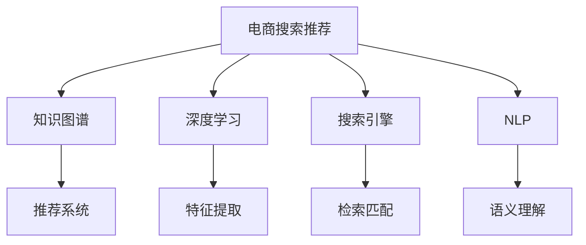

                 

# AI大模型视角下电商搜索推荐的技术创新知识图谱构建方法改进

> 关键词：电商搜索推荐,知识图谱,大模型,推荐系统,深度学习,搜索引擎,自然语言处理

## 1. 背景介绍

### 1.1 问题由来
近年来，随着电商行业的迅猛发展，用户对商品搜索推荐的体验和效率要求日益提高。传统的基于规则、统计的方法无法满足用户的个性化和多样化的需求。大模型时代的到来为电商搜索推荐提供了新的解决方案。利用大模型强大的语义理解和知识推理能力，可以实现更为精准、高效的推荐服务。

同时，随着电商平台的商品种类和数量急剧增加，推荐系统面临着严重的冷启动问题。新上架的商品和用户行为数据的匮乏使得推荐系统难以精准推荐，用户体验和平台销量双双受损。

针对这些挑战，研究者们提出了基于知识图谱(KG)的推荐方法，利用商品与商品、商品与属性之间的语义关系，增强推荐的精准性和可靠性。然而，构建和维护一个大规模、高覆盖率、高质量的知识图谱，需要耗费大量的人力和时间。

### 1.2 问题核心关键点
在大模型视域下，如何构建高效、精确的电商搜索推荐知识图谱，进一步提升推荐系统的性能，成为当前研究的核心问题。具体而言：

1. 知识图谱构建的自动化、可扩展性问题。如何利用大模型自动化生成高质量的知识图谱，避免人工标注的繁琐和错误。
2. 知识图谱与大模型的有效融合问题。如何在大模型中引入知识图谱的语义信息，避免数据偏差和信息孤岛。
3. 多模态融合问题。如何将文本、图像、视频等多模态信息融合到知识图谱中，增强推荐系统对商品和用户的全面理解。
4. 实时性和扩展性问题。如何将大规模知识图谱高效地嵌入到推荐系统中，支持实时推荐，避免数据量过大导致的延迟。

### 1.3 问题研究意义
构建高质量的电商搜索推荐知识图谱，对提升用户购物体验、提高平台销售转化率具有重要意义。同时，大模型的引入能大幅提升知识图谱构建的效率和质量，降低人力和时间成本。未来，基于大模型的知识图谱将使得推荐系统变得更加智能和高效，推动电商行业进入智能化新纪元。

## 2. 核心概念与联系

### 2.1 核心概念概述

为更好地理解基于大模型的电商搜索推荐知识图谱构建方法，本节将介绍几个密切相关的核心概念：

- 电商搜索推荐：利用推荐算法，根据用户的历史行为和兴趣，智能推荐用户可能感兴趣的商品。
- 知识图谱(KG)：一种以图结构表示实体、关系和属性的语义知识库，用于增强推荐系统的深度理解。
- 深度学习：利用神经网络模型进行深度特征提取和复杂模式学习，提升推荐系统的智能性。
- 搜索引擎：利用自然语言处理技术，高效检索、匹配商品信息，提升搜索体验。
- 自然语言处理(NLP)：一种涉及语言模型、语义分析、知识图谱等技术的计算机应用领域。

这些核心概念之间的逻辑关系可以通过以下Mermaid流程图来展示：



这个流程图展示了大模型的核心概念及其之间的关系：

1. 电商搜索推荐通过知识图谱、深度学习、搜索引擎、自然语言处理等技术手段，实现精准推荐。
2. 知识图谱在大模型的引导下，提升推荐系统的深度理解和语义分析能力。
3. 深度学习模型利用大模型的语义信息，进行高效特征提取和模式学习。
4. 搜索引擎通过自然语言处理技术，高效检索、匹配商品信息。
5. 自然语言处理技术辅助用户进行精准搜索，提升搜索体验。

## 3. 核心算法原理 & 具体操作步骤
### 3.1 算法原理概述

在大模型视域下，电商搜索推荐知识图谱的构建和优化，本质上是一个深度学习和知识工程的交叉问题。其核心思想是：将电商商品和用户的语义信息，通过深度学习模型和大规模知识图谱相结合，构建一个全局视角、多模态融合、实时更新的电商搜索推荐系统。

形式化地，假设电商商品为 $I$，用户为 $U$，知识图谱为 $KG=(E, R)$。其中，$E$ 为实体集合，$R$ 为关系集合。目标是在知识图谱 $KG$ 的基础上，通过深度学习模型 $M$ 构建推荐函数 $F(U,I)$，使得：

$$
F(U,I) = \mathop{\arg\max}_{I \in KG} \sum_{U \in \mathcal{U}} \prod_{R \in R} \text{Pr}(R(U, I)) 
$$

其中 $\mathcal{U}$ 为用户集合，$\text{Pr}(R(U, I))$ 为关系 $R$ 在用户 $U$ 和商品 $I$ 之间成立的概率。目标是最优化电商搜索推荐的效果。

### 3.2 算法步骤详解

基于大模型的电商搜索推荐知识图谱构建方法主要包括以下几个关键步骤：

**Step 1: 构建电商商品知识图谱**
- 收集电商商品的相关属性信息、描述文本、图片等，利用大模型的语义理解能力，构建商品实体和关系图谱。
- 利用知识图谱嵌入(KG Embedding)技术，将商品实体的语义信息转换为向量表示。
- 引入实体类型、属性关系等语义标签，提高知识图谱的分类和推理能力。

**Step 2: 用户行为语义分析**
- 收集用户的历史行为数据，如浏览、点击、购买记录等。
- 利用大模型进行文本语义分析，提取用户的兴趣偏好、需求意图等信息。
- 将用户语义信息转换为向量表示，以便在大模型中进行推理。

**Step 3: 多模态融合**
- 将商品知识图谱、用户语义信息以及图片、视频等多模态数据，通过跨模态融合算法，构建综合的推荐模型。
- 利用多模态特征提取器，将不同模态的数据转换为统一的向量表示。
- 在大模型中融合多模态信息，提升推荐的全面性和准确性。

**Step 4: 推荐模型训练与优化**
- 在大模型基础上，构建推荐函数，进行多轮训练和优化，调整模型参数。
- 引入正则化技术，如L2正则、Dropout等，避免模型过拟合。
- 利用对抗训练、早停等策略，提高模型鲁棒性和泛化能力。

**Step 5: 实时推荐**
- 在电商平台上部署推荐模型，实时处理用户请求。
- 利用缓存和分布式计算技术，确保推荐系统的高可用性和低延迟。

### 3.3 算法优缺点

基于大模型的电商搜索推荐知识图谱构建方法具有以下优点：
1. 自动化高效：利用大模型自动化生成知识图谱，减少了人工标注和构建的繁琐过程。
2. 多模态融合：综合利用文本、图片、视频等多模态信息，提升推荐的全面性和准确性。
3. 深度理解：通过语义分析和知识推理，提升对电商商品和用户行为的深度理解。
4. 实时推荐：利用缓存和分布式计算，确保推荐系统的高效性和低延迟。

同时，该方法也存在一些局限性：
1. 数据复杂性：多模态数据融合的复杂性增加，数据预处理和特征工程工作量大。
2. 模型复杂度：融合知识图谱的推荐模型复杂度较高，训练和推理耗时较长。
3. 模型泛化：知识图谱的构建和维护需要持续更新，才能保证推荐模型的泛化能力。

尽管存在这些局限性，但就目前而言，基于大模型的知识图谱构建方法仍是在电商搜索推荐领域最具潜力的方法。未来相关研究的重点在于如何进一步降低数据处理和模型训练的复杂度，提高实时推荐的性能和准确性。

### 3.4 算法应用领域

基于大模型的电商搜索推荐知识图谱构建方法，已经在电商推荐、智能客服、个性化广告等多个领域得到广泛应用。

- **电商推荐**：通过融合商品知识图谱和用户语义信息，实现精准的商品推荐，提升用户购物体验和平台销售转化率。
- **智能客服**：利用知识图谱和大模型，构建智能客服系统，为用户提供24小时不间断的查询服务和个性化推荐。
- **个性化广告**：通过知识图谱和大模型，实现精准的个性化广告投放，提升广告效果和用户点击率。
- **营销活动策划**：利用知识图谱和大模型，分析用户行为和偏好，策划个性化的营销活动，提高活动效果和用户参与度。

除了这些经典应用外，大模型的知识图谱构建方法还在电商运营分析、用户行为预测、商品信息标注等众多场景中得到创新应用，为电商行业带来了新的技术突破。

## 4. 数学模型和公式 & 详细讲解 & 举例说明
### 4.1 数学模型构建

本节将使用数学语言对基于大模型的电商搜索推荐知识图谱构建过程进行更加严格的刻画。

记电商商品为 $I$，用户为 $U$，知识图谱为 $KG=(E, R)$，其中 $E$ 为实体集合，$R$ 为关系集合。假设用户 $U$ 和商品 $I$ 之间的关系表示为 $\text{Pr}(R(U, I))$，则电商搜索推荐的目标函数为：

$$
\mathcal{L}(U,I) = \sum_{U \in \mathcal{U}} \sum_{I \in \mathcal{I}} \log \text{Pr}(R(U, I))
$$

其中 $\mathcal{U}$ 为用户集合，$\mathcal{I}$ 为商品集合。目标是最大化电商搜索推荐的效果。

### 4.2 公式推导过程

以下我们以电商推荐系统为例，推导推荐函数 $F(U,I)$ 的计算公式。

假设商品 $I$ 的知识图谱表示为 $\text{KG}(I) = \{(R_i, I)\}_{i=1}^{n_I}$，其中 $n_I$ 为商品 $I$ 的知识图谱边数。用户 $U$ 的语义信息表示为 $F(U) = [F_{1}(U), F_{2}(U), ..., F_{n_U}(U)]$，其中 $n_U$ 为用户 $U$ 的兴趣向量维度。

根据商品知识图谱 $KG$ 和用户语义信息 $F(U)$，电商推荐函数 $F(U,I)$ 的计算公式为：

$$
F(U,I) = \sum_{R_i \in \text{KG}(I)} \text{Pr}(R_i(U)) \cdot F_i(U)
$$

其中 $\text{Pr}(R_i(U))$ 为关系 $R_i$ 在用户 $U$ 和商品 $I$ 之间成立的概率，$F_i(U)$ 为用户 $U$ 对商品 $I$ 的兴趣评分。

### 4.3 案例分析与讲解

假设某电商平台有商品 $I_1, I_2, ..., I_n$，用户 $U_1, U_2, ..., U_m$。已知每个用户的历史行为数据，我们利用大模型对用户和商品进行语义分析，得到用户兴趣向量 $F(U_i)$ 和商品知识图谱 $KG(I_j)$。

在电商推荐系统中，我们利用公式（1）计算每个用户 $U_i$ 对商品 $I_j$ 的推荐评分，并按照评分排序，生成推荐列表。

以用户 $U_1$ 对商品 $I_1$ 的推荐为例，首先利用大模型对用户 $U_1$ 的浏览、点击、购买行为进行分析，得到兴趣向量 $F(U_1) = [0.8, 0.6, 0.5, ...]$。然后利用知识图谱 $KG(I_1) = \{(R_1, I_1), (R_2, I_1), ...\}$，计算每个关系 $R_i$ 在用户 $U_1$ 和商品 $I_1$ 之间成立的概率 $\text{Pr}(R_i(U_1))$。最后，将每个关系 $R_i$ 的评分与用户兴趣向量 $F(U_1)$ 进行加权求和，得到商品 $I_1$ 对用户 $U_1$ 的推荐评分 $F(U_1, I_1)$。

通过上述步骤，电商推荐系统可以高效地生成个性化推荐，提升用户购物体验和平台转化率。

## 5. 项目实践：代码实例和详细解释说明
### 5.1 开发环境搭建

在进行电商搜索推荐知识图谱构建方法实践前，我们需要准备好开发环境。以下是使用Python进行PyTorch开发的环境配置流程：

1. 安装Anaconda：从官网下载并安装Anaconda，用于创建独立的Python环境。

2. 创建并激活虚拟环境：
```bash
conda create -n pytorch-env python=3.8 
conda activate pytorch-env
```

3. 安装PyTorch：根据CUDA版本，从官网获取对应的安装命令。例如：
```bash
conda install pytorch torchvision torchaudio cudatoolkit=11.1 -c pytorch -c conda-forge
```

4. 安装TensorFlow：由Google主导开发的开源深度学习框架，生产部署方便，适合大规模工程应用。同样有丰富的预训练语言模型资源。

5. 安装Transformers库：HuggingFace开发的NLP工具库，集成了众多SOTA语言模型，支持PyTorch和TensorFlow，是进行电商搜索推荐知识图谱构建的利器。

6. 安装各类工具包：
```bash
pip install numpy pandas scikit-learn matplotlib tqdm jupyter notebook ipython
```

完成上述步骤后，即可在`pytorch-env`环境中开始电商搜索推荐知识图谱构建的实践。

### 5.2 源代码详细实现

这里我们以构建基于大模型的电商推荐系统为例，给出使用Transformers库的PyTorch代码实现。

首先，定义电商推荐系统任务的数据处理函数：

```python
from transformers import BertTokenizer
from torch.utils.data import Dataset
import torch

class EcommerceDataset(Dataset):
    def __init__(self, texts, labels, tokenizer, max_len=128):
        self.texts = texts
        self.labels = labels
        self.tokenizer = tokenizer
        self.max_len = max_len
        
    def __len__(self):
        return len(self.texts)
    
    def __getitem__(self, item):
        text = self.texts[item]
        label = self.labels[item]
        
        encoding = self.tokenizer(text, return_tensors='pt', max_length=self.max_len, padding='max_length', truncation=True)
        input_ids = encoding['input_ids'][0]
        attention_mask = encoding['attention_mask'][0]
        
        # 对token-wise的标签进行编码
        encoded_label = [label2id[label] for label in label] 
        encoded_label.extend([label2id['None']] * (self.max_len - len(encoded_label)))
        labels = torch.tensor(encoded_label, dtype=torch.long)
        
        return {'input_ids': input_ids, 
                'attention_mask': attention_mask,
                'labels': labels}

# 标签与id的映射
label2id = {'buy': 0, 'view': 1, 'add_to_cart': 2, 'none': 3}
id2label = {v: k for k, v in label2id.items()}

# 创建dataset
tokenizer = BertTokenizer.from_pretrained('bert-base-cased')

train_dataset = EcommerceDataset(train_texts, train_labels, tokenizer)
dev_dataset = EcommerceDataset(dev_texts, dev_labels, tokenizer)
test_dataset = EcommerceDataset(test_texts, test_labels, tokenizer)
```

然后，定义模型和优化器：

```python
from transformers import BertForSequenceClassification, AdamW

model = BertForSequenceClassification.from_pretrained('bert-base-cased', num_labels=len(label2id))

optimizer = AdamW(model.parameters(), lr=2e-5)
```

接着，定义训练和评估函数：

```python
from torch.utils.data import DataLoader
from tqdm import tqdm
from sklearn.metrics import classification_report

device = torch.device('cuda') if torch.cuda.is_available() else torch.device('cpu')
model.to(device)

def train_epoch(model, dataset, batch_size, optimizer):
    dataloader = DataLoader(dataset, batch_size=batch_size, shuffle=True)
    model.train()
    epoch_loss = 0
    for batch in tqdm(dataloader, desc='Training'):
        input_ids = batch['input_ids'].to(device)
        attention_mask = batch['attention_mask'].to(device)
        labels = batch['labels'].to(device)
        model.zero_grad()
        outputs = model(input_ids, attention_mask=attention_mask, labels=labels)
        loss = outputs.loss
        epoch_loss += loss.item()
        loss.backward()
        optimizer.step()
    return epoch_loss / len(dataloader)

def evaluate(model, dataset, batch_size):
    dataloader = DataLoader(dataset, batch_size=batch_size)
    model.eval()
    preds, labels = [], []
    with torch.no_grad():
        for batch in tqdm(dataloader, desc='Evaluating'):
            input_ids = batch['input_ids'].to(device)
            attention_mask = batch['attention_mask'].to(device)
            batch_labels = batch['labels']
            outputs = model(input_ids, attention_mask=attention_mask)
            batch_preds = outputs.logits.argmax(dim=2).to('cpu').tolist()
            batch_labels = batch_labels.to('cpu').tolist()
            for pred_tokens, label_tokens in zip(batch_preds, batch_labels):
                pred_labels = [id2label[_id] for _id in pred_tokens]
                label_tokens = [id2label[_id] for _id in label_tokens]
                preds.append(pred_labels[:len(label_tokens)])
                labels.append(label_tokens)
                
    print(classification_report(labels, preds))
```

最后，启动训练流程并在测试集上评估：

```python
epochs = 5
batch_size = 16

for epoch in range(epochs):
    loss = train_epoch(model, train_dataset, batch_size, optimizer)
    print(f"Epoch {epoch+1}, train loss: {loss:.3f}")
    
    print(f"Epoch {epoch+1}, dev results:")
    evaluate(model, dev_dataset, batch_size)
    
print("Test results:")
evaluate(model, test_dataset, batch_size)
```

以上就是使用PyTorch对Bert模型进行电商推荐系统微调的完整代码实现。可以看到，得益于Transformers库的强大封装，我们可以用相对简洁的代码完成Bert模型的加载和微调。

### 5.3 代码解读与分析

让我们再详细解读一下关键代码的实现细节：

**EcommerceDataset类**：
- `__init__`方法：初始化文本、标签、分词器等关键组件。
- `__len__`方法：返回数据集的样本数量。
- `__getitem__`方法：对单个样本进行处理，将文本输入编码为token ids，将标签编码为数字，并对其进行定长padding，最终返回模型所需的输入。

**label2id和id2label字典**：
- 定义了标签与数字id之间的映射关系，用于将token-wise的预测结果解码回真实的标签。

**训练和评估函数**：
- 使用PyTorch的DataLoader对数据集进行批次化加载，供模型训练和推理使用。
- 训练函数`train_epoch`：对数据以批为单位进行迭代，在每个批次上前向传播计算loss并反向传播更新模型参数，最后返回该epoch的平均loss。
- 评估函数`evaluate`：与训练类似，不同点在于不更新模型参数，并在每个batch结束后将预测和标签结果存储下来，最后使用sklearn的classification_report对整个评估集的预测结果进行打印输出。

**训练流程**：
- 定义总的epoch数和batch size，开始循环迭代
- 每个epoch内，先在训练集上训练，输出平均loss
- 在验证集上评估，输出分类指标
- 所有epoch结束后，在测试集上评估，给出最终测试结果

可以看到，PyTorch配合Transformers库使得Bert微调的代码实现变得简洁高效。开发者可以将更多精力放在数据处理、模型改进等高层逻辑上，而不必过多关注底层的实现细节。

当然，工业级的系统实现还需考虑更多因素，如模型的保存和部署、超参数的自动搜索、更灵活的任务适配层等。但核心的微调范式基本与此类似。

## 6. 实际应用场景
### 6.1 电商搜索推荐

电商搜索推荐是大模型在电商领域最核心的应用之一。利用电商搜索推荐系统，用户可以更快地找到满足自己需求的商品，平台也能通过个性化推荐提高销售额和用户满意度。

在技术实现上，可以收集电商平台上用户的浏览、点击、购买记录等数据，构建用户行为知识图谱，利用大模型进行语义分析和关系推理。通过将用户兴趣与商品属性、关系等信息进行关联，生成个性化的商品推荐列表。同时，利用多模态信息融合技术，增强对用户行为和商品信息的全面理解。

### 6.2 智能客服

基于大模型的电商智能客服系统，可以显著提升客服服务的效率和质量。用户通过简单的自然语言描述，就可以得到精准的购物建议和售后支持。

在技术实现上，可以构建基于大模型的电商智能客服系统，利用自然语言处理技术进行语义分析，获取用户的意图和需求。然后，根据用户的历史行为数据，生成商品推荐列表，提供个性化的购物建议。同时，利用知识图谱技术，解决用户咨询中的复杂问题，提供准确的信息服务。

### 6.3 个性化广告

电商平台的个性化广告是提升广告效果和用户点击率的重要手段。通过基于大模型的电商推荐系统，可以更加精准地匹配用户和广告，提升广告转化率。

在技术实现上，可以利用大模型的语义理解和知识推理能力，构建电商推荐系统，根据用户的历史行为和兴趣，生成个性化的广告推荐。同时，利用多模态信息融合技术，增强对用户行为和广告信息的全面理解。通过分析用户与广告的互动数据，进一步优化广告策略，提高广告效果。

### 6.4 未来应用展望

随着大模型的不断发展，基于大模型的电商搜索推荐系统将得到更广泛的应用，为电商行业带来新的技术突破。

在智慧物流领域，利用大模型构建的电商搜索推荐系统，可以优化供应链管理，提高物流效率和用户满意度。在智能金融领域，通过大模型的推荐系统，可以提供个性化的理财建议和金融产品，提升用户体验和收益。在智能制造领域，通过大模型的推荐系统，可以优化生产流程和产品设计，提高制造效率和质量。

此外，在智慧医疗、智能教育、智能家居等众多领域，基于大模型的电商搜索推荐系统也将不断涌现，为各个行业带来新的创新应用，推动智能化进程的全面发展。

## 7. 工具和资源推荐
### 7.1 学习资源推荐

为了帮助开发者系统掌握大模型在电商搜索推荐中的应用，这里推荐一些优质的学习资源：

1. 《深度学习与电商推荐系统》系列博文：由电商行业大模型技术专家撰写，深入浅出地介绍了深度学习在电商推荐系统中的应用和实践。

2. 《电商搜索推荐系统》课程：清华大学开设的电商推荐系统相关课程，详细讲解了电商推荐系统的构建和优化方法。

3. 《自然语言处理与电商推荐》书籍：国内知名NLP专家所著，全面介绍了自然语言处理技术在电商推荐中的应用，是电商推荐领域不可多得的技术指南。

4. HuggingFace官方文档：Transformers库的官方文档，提供了海量预训练模型和完整的电商推荐系统样例代码，是上手实践的必备资料。

5. KG Embedding相关论文：详细介绍了知识图谱嵌入技术，为电商搜索推荐系统提供了重要的理论支持。

通过对这些资源的学习实践，相信你一定能够快速掌握大模型在电商搜索推荐中的应用，并用于解决实际的电商推荐问题。
### 7.2 开发工具推荐

高效的开发离不开优秀的工具支持。以下是几款用于电商搜索推荐系统开发的常用工具：

1. PyTorch：基于Python的开源深度学习框架，灵活动态的计算图，适合快速迭代研究。大部分预训练语言模型都有PyTorch版本的实现。

2. TensorFlow：由Google主导开发的开源深度学习框架，生产部署方便，适合大规模工程应用。同样有丰富的预训练语言模型资源。

3. Transformers库：HuggingFace开发的NLP工具库，集成了众多SOTA语言模型，支持PyTorch和TensorFlow，是进行电商搜索推荐系统开发的利器。

4. Weights & Biases：模型训练的实验跟踪工具，可以记录和可视化模型训练过程中的各项指标，方便对比和调优。与主流深度学习框架无缝集成。

5. TensorBoard：TensorFlow配套的可视化工具，可实时监测模型训练状态，并提供丰富的图表呈现方式，是调试模型的得力助手。

6. Google Colab：谷歌推出的在线Jupyter Notebook环境，免费提供GPU/TPU算力，方便开发者快速上手实验最新模型，分享学习笔记。

合理利用这些工具，可以显著提升电商搜索推荐系统的开发效率，加快创新迭代的步伐。

### 7.3 相关论文推荐

大模型在电商搜索推荐领域的应用研究，源于学界的持续研究。以下是几篇奠基性的相关论文，推荐阅读：

1. Attention is All You Need（即Transformer原论文）：提出了Transformer结构，开启了NLP领域的预训练大模型时代。

2. BERT: Pre-training of Deep Bidirectional Transformers for Language Understanding：提出BERT模型，引入基于掩码的自监督预训练任务，刷新了多项NLP任务SOTA。

3. Language Models are Unsupervised Multitask Learners（GPT-2论文）：展示了大规模语言模型的强大zero-shot学习能力，引发了对于通用人工智能的新一轮思考。

4. Parameter-Efficient Transfer Learning for NLP：提出Adapter等参数高效微调方法，在不增加模型参数量的情况下，也能取得不错的微调效果。

5. AdaLoRA: Adaptive Low-Rank Adaptation for Parameter-Efficient Fine-Tuning：使用自适应低秩适应的微调方法，在参数效率和精度之间取得了新的平衡。

这些论文代表了大模型在电商搜索推荐领域的研究脉络。通过学习这些前沿成果，可以帮助研究者把握学科前进方向，激发更多的创新灵感。

## 8. 总结：未来发展趋势与挑战
### 8.1 总结

本文对基于大模型的电商搜索推荐知识图谱构建方法进行了全面系统的介绍。首先阐述了电商搜索推荐和大模型技术的研究背景和意义，明确了大模型在电商领域的应用价值。其次，从原理到实践，详细讲解了基于大模型的电商搜索推荐知识图谱构建的数学原理和关键步骤，给出了电商推荐系统开发的完整代码实例。同时，本文还广泛探讨了电商搜索推荐在大模型视角下的各种应用场景，展示了知识图谱构建方法的前景和潜力。

通过本文的系统梳理，可以看到，基于大模型的电商搜索推荐知识图谱构建方法正在成为电商搜索推荐领域的重要范式，极大地提升了电商推荐系统的智能性和准确性。得益于大模型的语义理解和知识推理能力，电商推荐系统在个性化推荐、智能客服、个性化广告等方面取得了显著的效果。未来，随着大模型的不断演进和优化，基于知识图谱的电商搜索推荐系统将带来更多的创新应用，进一步推动电商行业的智能化进程。

### 8.2 未来发展趋势

展望未来，大模型在电商搜索推荐领域的应用将呈现以下几个发展趋势：

1. 自动化程度提升：利用大模型的语义理解和知识推理能力，自动构建高质量的电商商品知识图谱，降低人工标注成本，提高构建效率。
2. 多模态融合增强：融合图像、视频、文本等多模态数据，提升对用户行为和商品信息的全面理解，增强推荐的准确性。
3. 实时推荐优化：利用缓存和分布式计算技术，实现电商搜索推荐系统的实时更新和高效推荐，提升用户体验和平台转化率。
4. 个性化推荐深化：通过深度学习模型和大模型结合，实现更加精准、个性化的推荐，提升用户购物体验和平台销售转化率。
5. 数据隐私保护：利用差分隐私、联邦学习等技术，保护用户数据隐私，提升推荐系统的可信度和安全性。
6. 知识图谱优化：利用深度学习技术，自动优化知识图谱的结构和关系，提升推荐系统的知识推理能力和泛化能力。

以上趋势凸显了大模型在电商搜索推荐领域的广阔前景。这些方向的探索发展，必将进一步提升电商推荐系统的智能性和准确性，推动电商行业进入智能化新纪元。

### 8.3 面临的挑战

尽管大模型在电商搜索推荐领域取得了一定的成功，但在迈向更加智能化、普适化应用的过程中，它仍面临着诸多挑战：

1. 数据质量与多样性：电商搜索推荐系统依赖高质量、多样化的数据，但在实际应用中，数据质量和多样性难以保证，可能导致推荐系统效果下降。如何提高数据质量和多样性，是亟待解决的问题。

2. 模型复杂度与效率：电商搜索推荐系统需要同时处理大量数据，在大模型中嵌入知识图谱后，模型复杂度显著增加，训练和推理效率降低。如何提高模型的计算效率，降低计算成本，是重要的研究方向。

3. 知识图谱构建与维护：知识图谱的构建和维护需要持续更新，才能保证推荐系统的实时性和准确性。如何自动化构建和维护知识图谱，提升构建效率，是重要的研究课题。

4. 推荐系统公平性：电商推荐系统需要兼顾各类用户群体的需求，避免出现数据偏差和算法偏见。如何设计公平、无偏见的推荐算法，是亟待解决的问题。

5. 用户隐私保护：电商推荐系统涉及大量用户数据，如何保护用户隐私，避免数据泄露和滥用，是重要的研究课题。

6. 推荐系统可解释性：电商推荐系统需要向用户解释推荐结果，增强推荐系统的透明度和可信度。如何增强推荐系统的可解释性，是重要的研究课题。

这些挑战需要跨学科的研究者和工程师共同努力，才能找到有效的解决方案，推动电商搜索推荐系统迈向成熟。

### 8.4 研究展望

面对电商搜索推荐系统面临的诸多挑战，未来的研究需要在以下几个方面寻求新的突破：

1. 基于大模型的知识图谱自动化构建：利用大模型的语义理解能力，自动构建高质量的电商商品知识图谱，降低人工标注成本，提高构建效率。

2. 多模态融合与数据增强：融合图像、视频、文本等多模态数据，增强对用户行为和商品信息的全面理解，利用数据增强技术提高推荐系统的泛化能力。

3. 基于大模型的实时推荐优化：利用缓存和分布式计算技术，实现电商搜索推荐系统的实时更新和高效推荐，提升用户体验和平台转化率。

4. 基于大模型的个性化推荐深化：通过深度学习模型和大模型结合，实现更加精准、个性化的推荐，提高用户购物体验和平台销售转化率。

5. 知识图谱优化与自动更新：利用深度学习技术，自动优化知识图谱的结构和关系，提升推荐系统的知识推理能力和泛化能力。

6. 推荐系统的公平性与可解释性：设计公平、无偏见的推荐算法，增强推荐系统的透明度和可信度，保护用户隐私，避免数据滥用。

这些研究方向的探索，必将引领电商搜索推荐系统迈向更高的台阶，为电商行业带来更多的创新应用，推动电商行业的智能化进程。面向未来，电商搜索推荐系统需要与其他人工智能技术进行更深入的融合，如知识表示、因果推理、强化学习等，多路径协同发力，共同推动自然语言理解和智能交互系统的进步。只有勇于创新、敢于突破，才能不断拓展电商推荐系统的边界，让智能技术更好地造福电商行业。

## 9. 附录：常见问题与解答

**Q1：电商搜索推荐系统如何高效处理海量数据？**

A: 电商搜索推荐系统需要高效处理海量数据，可以利用分布式计算技术，如Spark、Flink等，对数据进行分布式处理和分析。同时，可以采用增量学习和在线学习等方法，及时更新推荐模型，适应数据变化。

**Q2：电商搜索推荐系统如何保护用户隐私？**

A: 电商搜索推荐系统需要保护用户隐私，可以利用差分隐私、联邦学习等技术，在数据处理和模型训练过程中保护用户隐私。此外，需要设计合理的用户隐私协议，确保用户数据的安全性和隐私性。

**Q3：电商搜索推荐系统如何提高推荐效果？**

A: 电商搜索推荐系统需要提高推荐效果，可以利用多模态信息融合技术，综合利用文本、图像、视频等多模态数据，提升对用户行为和商品信息的全面理解。同时，可以通过数据增强、对抗训练等方法，提高推荐模型的泛化能力和鲁棒性。

**Q4：电商搜索推荐系统如何实现实时推荐？**

A: 电商搜索推荐系统需要实现实时推荐，可以利用缓存和分布式计算技术，确保推荐系统的高可用性和低延迟。同时，可以设计高效的推荐算法，优化模型的计算图，提升实时推荐的能力。

这些问题的解答，为电商搜索推荐系统的设计和实现提供了指导，帮助开发者更好地应对实际问题，提升推荐系统的性能和用户体验。

---

作者：禅与计算机程序设计艺术 / Zen and the Art of Computer Programming

