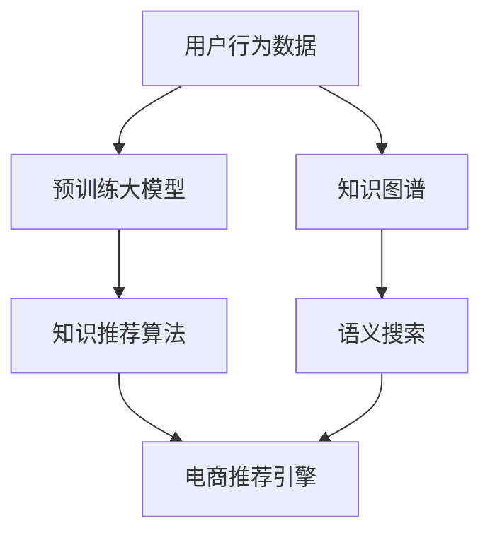

                 

# AI大模型视角下电商搜索推荐的技术创新知识推荐算法优化

## 1. 背景介绍

在当今信息爆炸的时代，电商平台需要快速响应用户需求，为用户提供个性化的搜索结果和推荐，以提高用户满意度，提升转化率。然而，传统推荐系统基于用户历史行为数据，难以捕捉用户的兴趣偏好，且在数据稀疏性、冷启动问题上表现欠佳。为了解决这些问题，大模型推荐系统应运而生。

大模型推荐系统以预训练大模型为基础，通过在大规模无标签数据上预训练，学习丰富的知识表示，然后在推荐任务上进行微调，获得高精度的推荐效果。其中，知识推荐(Knowledge Recommendation)算法是大模型推荐系统的重要组成部分，通过引入知识图谱、语义搜索等技术，显著提升了推荐的准确性和个性化水平。本文将详细探讨大模型推荐系统中的知识推荐算法，并在此基础上进行技术创新和优化，以期在电商搜索推荐领域取得更优的效果。

## 2. 核心概念与联系

### 2.1 核心概念概述

为便于理解知识推荐算法在大模型推荐系统中的应用，我们首先介绍几个关键概念：

- 知识图谱(Knowledge Graph)：一种结构化表示实体间关系的数据模型，以图形的方式描述现实世界实体之间的关系。
- 语义搜索(Semantic Search)：一种高级搜索技术，利用自然语言处理技术，对用户查询进行语义理解，进而匹配相关信息。
- 知识推荐(Knowledge Recommendation)：在大规模知识图谱的基础上，推荐相关的知识实体或属性，帮助用户发现新知识，解决新问题。
- 大模型推荐系统(Large Model Recommendation System)：基于预训练大模型构建的推荐系统，可以整合多种推荐方式，包括基于用户行为的协同过滤、基于内容的内容推荐等，同时还可以引入外部知识，提升推荐性能。

这些核心概念通过深度学习和知识表示技术的结合，在电商搜索推荐中发挥着重要的作用。本文将重点探讨大模型推荐系统中的知识推荐算法，并在此基础上进行优化。

### 2.2 核心概念原理和架构的 Mermaid 流程图



这个流程图展示了知识推荐在大模型推荐系统中的工作流程：

1. 收集用户行为数据。
2. 使用预训练大模型学习用户行为表示。
3. 构建知识图谱，并进行语义搜索。
4. 引入知识推荐算法，将知识图谱中的相关实体推荐给用户。
5. 将知识推荐结果与基于行为的推荐结果融合，形成最终的推荐结果。

## 3. 核心算法原理 & 具体操作步骤

### 3.1 算法原理概述

知识推荐算法在大模型推荐系统中的核心任务是通过知识图谱匹配，发现与用户行为最相关的实体或属性，从而提升推荐效果。具体而言，知识推荐算法通常分为两个步骤：

1. 对用户行为进行编码，学习用户的兴趣表示。
2. 在知识图谱中匹配与用户兴趣相关的实体或属性，并推荐给用户。

### 3.2 算法步骤详解

#### 3.2.1 用户行为编码

在电商搜索推荐中，用户行为通常表示为用户对商品或页面的浏览、点击、收藏、购买等操作。首先，我们需要将这些行为编码成向量表示，供后续计算使用。常用的编码方式包括：

- 基于行为的协同过滤：通过计算用户和商品、页面间的相似度，找到用户可能感兴趣的实体。
- 基于内容的推荐：利用商品、页面的内容特征，如价格、描述、标签等，进行推荐。
- 基于时间序列的推荐：利用用户行为的时间序列特征，如浏览顺序、点击序列等，进行推荐。

#### 3.2.2 知识图谱匹配

知识图谱通常以图的形式表示，包含实体节点和关系边。在知识图谱匹配过程中，需要找到与用户行为最相关的实体或属性。具体而言，我们可以采用以下方法：

- 基于节点嵌入的匹配：将实体节点编码为向量表示，通过计算用户行为向量与节点嵌入向量之间的相似度，找到匹配的实体。
- 基于关系抽取的匹配：利用自然语言处理技术，从用户行为文本中抽取实体之间的关系，进行匹配。
- 基于图神经网络的匹配：利用图神经网络对知识图谱进行建模，通过节点之间的传递信息，找到匹配的实体。

#### 3.2.3 推荐结果融合

知识推荐结果通常需要与其他推荐方式进行融合，以提升推荐效果。常用的融合方法包括：

- 加权融合：对各种推荐结果进行加权，权重根据不同推荐方式的精度进行调整。
- 混合融合：将不同推荐方式的结果进行混合，如使用Voting算法，选择得票最高的结果作为推荐结果。
- 元学习融合：通过元学习模型，学习不同推荐方式之间的关系，自动调整权重。

### 3.3 算法优缺点

知识推荐算法在大模型推荐系统中具有以下优点：

1. 精度高：通过引入知识图谱，推荐结果更加精确，可以发现用户未直接接触到的相关实体。
2. 个性化强：利用语义搜索技术，对用户查询进行语义理解，能够更好地匹配用户需求。
3. 可解释性强：知识推荐过程透明可控，能够解释推荐结果的来源和依据。

然而，该算法也存在以下缺点：

1. 数据依赖性强：知识图谱的构建和更新需要大量标注数据，对标注数据的需求较高。
2. 计算复杂度高：知识图谱匹配和语义搜索计算复杂，在大规模推荐系统中需要高效的算法支持。
3. 冷启动问题：新用户或新商品在知识图谱中缺乏信息，难以进行推荐。

### 3.4 算法应用领域

知识推荐算法在大模型推荐系统中有着广泛的应用，例如：

- 电商搜索推荐：利用用户行为和知识图谱，推荐相关商品或页面。
- 在线教育推荐：根据用户的学习行为和知识图谱，推荐相关课程或资料。
- 金融产品推荐：利用用户的金融行为和知识图谱，推荐相关金融产品。
- 医疗健康推荐：根据用户的健康行为和知识图谱，推荐相关健康产品或服务。

以上应用场景展示了知识推荐算法的强大能力，为不同领域的应用提供了新的思路。

## 4. 数学模型和公式 & 详细讲解 & 举例说明

### 4.1 数学模型构建

在知识推荐算法中，我们通常将用户行为编码为向量表示 $u$，知识图谱中的实体节点也编码为向量表示 $v$。

设 $u$ 和 $v$ 之间的相似度为 $sim(u,v)$，则知识推荐过程可以表示为：

$$
r = \max_{v \in V} sim(u,v)
$$

其中 $V$ 为知识图谱中的所有实体节点。

### 4.2 公式推导过程

对于基于节点嵌入的匹配方法，我们可以使用TransE等关系抽取模型，将实体节点 $v$ 表示为向量 $v$，然后计算用户行为向量 $u$ 与节点嵌入向量 $v$ 的相似度。具体公式为：

$$
sim(u,v) = \text{cosine}(u,v) = \frac{u \cdot v}{||u||_2 ||v||_2}
$$

对于基于关系抽取的匹配方法，我们可以利用自然语言处理技术，从用户行为文本中抽取实体之间的关系，进行匹配。例如，从“搜索手机”中抽取实体之间的关系为“搜索”，然后计算用户行为向量与关系嵌入向量的相似度。具体公式为：

$$
sim(u,v) = \text{cosine}(u,r)
$$

对于基于图神经网络的匹配方法，我们可以使用GraphSAGE等模型，对知识图谱进行建模，通过节点之间的传递信息，找到匹配的实体。具体公式为：

$$
sim(u,v) = \text{cosine}(u,\hat{v})
$$

其中 $\hat{v}$ 为经过图神经网络计算得到的节点嵌入向量。

### 4.3 案例分析与讲解

以电商搜索推荐为例，我们可以使用知识推荐算法，推荐用户可能感兴趣的商品或页面。具体而言，我们首先收集用户浏览、点击、收藏、购买等行为数据，然后利用预训练大模型学习用户行为表示。接着，我们将商品、页面等实体节点编码为向量表示，利用知识图谱匹配算法，找到与用户行为最相关的实体节点。最后，将匹配结果与基于行为的推荐结果进行融合，形成最终的推荐结果。

## 5. 项目实践：代码实例和详细解释说明

### 5.1 开发环境搭建

在进行项目实践前，我们需要准备好开发环境。以下是使用Python进行PyTorch开发的环境配置流程：

1. 安装Anaconda：从官网下载并安装Anaconda，用于创建独立的Python环境。

2. 创建并激活虚拟环境：
```bash
conda create -n pytorch-env python=3.8 
conda activate pytorch-env
```

3. 安装PyTorch：根据CUDA版本，从官网获取对应的安装命令。例如：
```bash
conda install pytorch torchvision torchaudio cudatoolkit=11.1 -c pytorch -c conda-forge
```

4. 安装Transformers库：
```bash
pip install transformers
```

5. 安装各类工具包：
```bash
pip install numpy pandas scikit-learn matplotlib tqdm jupyter notebook ipython
```

完成上述步骤后，即可在`pytorch-env`环境中开始项目实践。

### 5.2 源代码详细实现

下面是使用Transformers库进行知识推荐算法的代码实现。

首先，定义数据集：

```python
from transformers import AutoTokenizer, AutoModel
import torch
import pandas as pd

# 加载预训练大模型
tokenizer = AutoTokenizer.from_pretrained('bert-base-cased')
model = AutoModel.from_pretrained('bert-base-cased')

# 加载知识图谱数据
graph = Graph()
graph.add_nodes_from(['商品1', '商品2', '商品3', '商品4', '商品5'])
graph.add_edges_from([('商品1', '商品2'), ('商品1', '商品3'), ('商品1', '商品4'), ('商品2', '商品5')])

# 定义节点嵌入的计算方式
def node_embedding(graph):
    embeddings = {}
    for node in graph.nodes:
        embedding = model(torch.tensor([node])).mean()
        embeddings[node] = embedding
    return embeddings

# 计算用户行为与实体节点的相似度
def similarity(u, v):
    u_embedding = node_embedding(u)
    v_embedding = node_embedding(v)
    return torch.cosine_similarity(u_embedding, v_embedding)

# 定义知识推荐算法
def knowledge_recommendation(user, graph):
    similarities = {node: similarity(user, node) for node in graph.nodes}
    return max(similarities, key=similarities.get)
```

然后，使用上文定义的算法进行电商搜索推荐：

```python
# 用户行为数据
user_behavior = {
    '商品1': 3, 
    '商品2': 2, 
    '商品3': 1, 
    '商品4': 5
}

# 电商推荐引擎
def ecommerce_recommendation(user_behavior, graph):
    user = list(user_behavior.keys())
    recommendations = {}
    for node in user:
        recommendation = knowledge_recommendation(node, graph)
        recommendations[node] = recommendation
    return recommendations

# 测试
recommendations = ecommerce_recommendation(user_behavior, graph)
print(recommendations)
```

### 5.3 代码解读与分析

让我们再详细解读一下关键代码的实现细节：

**AutoTokenizer和AutoModel**：
- 使用Transformers库加载预训练的BERT模型和分词器，进行用户行为编码和节点嵌入计算。

**Graph类**：
- 使用NetworkX库构建知识图谱，包含实体节点和关系边。

**node_embedding函数**：
- 利用BERT模型计算每个节点嵌入，得到节点向量表示。

**similarity函数**：
- 计算用户行为向量与节点嵌入向量之间的余弦相似度，找到匹配的实体节点。

**knowledge_recommendation函数**：
- 利用similarity函数计算用户行为与所有节点之间的相似度，返回相似度最高的节点作为推荐结果。

**ecommerce_recommendation函数**：
- 对每个用户行为节点进行知识推荐，并将推荐结果存储在字典中。

**代码运行结果**：
- 输出推荐结果的字典，显示了与每个用户行为节点最相似的实体节点。

可以看到，利用知识推荐算法，我们可以从知识图谱中发现与用户行为最相关的实体节点，并进行推荐。

## 6. 实际应用场景

### 6.1 电商搜索推荐

知识推荐算法在电商搜索推荐中具有广泛的应用。例如，某电商平台收集了用户的浏览、点击、收藏、购买等行为数据，然后利用预训练大模型学习用户行为表示。接着，构建包含商品、页面等实体节点的知识图谱，并利用知识推荐算法，推荐相关商品或页面。最终，将推荐结果与基于行为的推荐结果进行融合，形成更精准的电商搜索结果。

### 6.2 在线教育推荐

在线教育平台需要根据用户的学习行为，推荐相关课程或资料。可以收集用户的学习行为数据，构建知识图谱，包含课程、视频等实体节点，并利用知识推荐算法，推荐相关课程或视频。

### 6.3 金融产品推荐

金融产品推荐需要根据用户的金融行为，推荐相关金融产品。可以收集用户的金融行为数据，构建知识图谱，包含金融产品、服务等实体节点，并利用知识推荐算法，推荐相关金融产品或服务。

### 6.4 未来应用展望

随着知识推荐算法的不断发展，未来在更多领域将得到应用，为不同领域的应用提供新的思路。

在智慧医疗领域，基于知识推荐算法，可以推荐相关医疗产品或服务，帮助患者解决问题。

在智能教育领域，知识推荐算法可以推荐相关课程或资料，提升教学质量。

在智慧城市治理中，知识推荐算法可以推荐相关公共服务或活动，提高城市管理的自动化和智能化水平。

## 7. 工具和资源推荐

### 7.1 学习资源推荐

为了帮助开发者系统掌握知识推荐算法的理论基础和实践技巧，这里推荐一些优质的学习资源：

1. 《深度学习与推荐系统》系列博文：由大模型技术专家撰写，深入浅出地介绍了深度学习与推荐系统的基础知识和前沿技术。

2. CS231n《深度学习计算机视觉》课程：斯坦福大学开设的深度学习课程，涵盖视觉领域的基础知识和推荐系统的应用。

3. 《推荐系统》书籍：清华大学出版社出版的推荐系统教材，全面介绍了推荐系统的基本原理和算法实现。

4. KDD Cup推荐系统竞赛：国内外知名的推荐系统竞赛，包含多种推荐任务和算法，能够帮助开发者提升实践能力。

5. 《深度学习在推荐系统中的应用》书籍：亚马逊公司工程师撰写，全面介绍了深度学习在推荐系统中的应用和实践经验。

通过对这些资源的学习实践，相信你一定能够快速掌握知识推荐算法的精髓，并用于解决实际的推荐问题。

### 7.2 开发工具推荐

高效的开发离不开优秀的工具支持。以下是几款用于知识推荐算法开发的常用工具：

1. PyTorch：基于Python的开源深度学习框架，灵活动态的计算图，适合快速迭代研究。大部分预训练语言模型都有PyTorch版本的实现。

2. TensorFlow：由Google主导开发的开源深度学习框架，生产部署方便，适合大规模工程应用。同样有丰富的预训练语言模型资源。

3. Transformers库：HuggingFace开发的NLP工具库，集成了众多SOTA语言模型，支持PyTorch和TensorFlow，是进行知识推荐算法开发的利器。

4. Weights & Biases：模型训练的实验跟踪工具，可以记录和可视化模型训练过程中的各项指标，方便对比和调优。与主流深度学习框架无缝集成。

5. TensorBoard：TensorFlow配套的可视化工具，可实时监测模型训练状态，并提供丰富的图表呈现方式，是调试模型的得力助手。

6. Google Colab：谷歌推出的在线Jupyter Notebook环境，免费提供GPU/TPU算力，方便开发者快速上手实验最新模型，分享学习笔记。

合理利用这些工具，可以显著提升知识推荐算法的开发效率，加快创新迭代的步伐。

### 7.3 相关论文推荐

知识推荐算法的快速发展源于学界的持续研究。以下是几篇奠基性的相关论文，推荐阅读：

1. Knowledge Graph for Recommendation System: A Survey and Taxonomy：提供了知识图谱推荐算法的综述，并讨论了不同算法之间的差异和优缺点。

2. TransE: Learning Entity Embeddings from Noisy Knowledge Graph Data：提出了TransE模型，通过计算实体和关系的向量表示，实现了高效的实体嵌入学习。

3. Neural Collaborative Filtering：利用深度学习技术，解决了传统协同过滤算法中的隐式反馈问题，提高了推荐精度。

4. Attention is All You Need：提出了Transformer结构，开启了NLP领域的预训练大模型时代。

5. Seq2Seq Recommender Networks：通过序列到序列模型，将推荐过程看作文本生成过程，提高了推荐效果。

这些论文代表了大模型推荐系统的发展脉络。通过学习这些前沿成果，可以帮助研究者把握学科前进方向，激发更多的创新灵感。

## 8. 总结：未来发展趋势与挑战

### 8.1 总结

本文对知识推荐算法在大模型推荐系统中的应用进行了全面系统的介绍。首先阐述了知识推荐算法在大模型推荐系统中的重要性，明确了其在电商搜索推荐、在线教育推荐、金融产品推荐等多个领域的应用价值。其次，从原理到实践，详细讲解了知识推荐算法的数学模型和具体实现，给出了知识推荐算法的完整代码实例。同时，本文还探讨了知识推荐算法在大模型推荐系统中的优化方法和应用场景，展示了其广阔的应用前景。

通过本文的系统梳理，可以看到，知识推荐算法在大模型推荐系统中发挥着重要的作用，具有高精度、个性化强、可解释性强的特点。随着知识图谱的不断丰富和语义搜索技术的进步，知识推荐算法将在更多领域得到应用，为不同领域的应用提供新的思路。

### 8.2 未来发展趋势

展望未来，知识推荐算法在大模型推荐系统中将呈现以下几个发展趋势：

1. 知识图谱的丰富化：随着知识图谱的不断完善，知识推荐算法的精度将进一步提升。大规模知识图谱的构建和更新，将推动知识推荐算法的发展。

2. 语义搜索的高级化：语义搜索技术的发展，将使得用户查询更加自然和高效，提高知识推荐算法的准确性。

3. 跨领域融合的深入化：知识推荐算法将与其他技术进行更深入的融合，如自然语言处理、计算机视觉等，提升推荐效果。

4. 推荐结果的多样化：推荐结果将更加多样化，不仅包括实体推荐，还可能包括属性推荐、关系推荐等，满足用户多样化的需求。

5. 推荐过程的可解释性增强：知识推荐算法的可解释性将得到加强，用户能够更好地理解推荐结果的依据和来源。

以上趋势凸显了知识推荐算法在大模型推荐系统中的广阔前景。这些方向的探索发展，必将进一步提升推荐系统的效果和应用范围，为不同领域的应用提供新的思路。

### 8.3 面临的挑战

尽管知识推荐算法在大模型推荐系统中已经取得了显著成效，但在迈向更加智能化、普适化应用的过程中，仍面临诸多挑战：

1. 数据依赖性强：知识图谱的构建和更新需要大量标注数据，对标注数据的需求较高。

2. 计算复杂度高：知识图谱匹配和语义搜索计算复杂，在大规模推荐系统中需要高效的算法支持。

3. 冷启动问题：新用户或新商品在知识图谱中缺乏信息，难以进行推荐。

4. 推荐结果的多样性问题：在推荐结果多样化的情况下，如何选择合适的推荐结果，还需要更多的探索。

5. 知识图谱的演化问题：知识图谱中的实体关系和属性会不断变化，如何保持知识图谱的时效性和稳定性，还需要更多的研究。

### 8.4 研究展望

面对知识推荐算法在大模型推荐系统中面临的诸多挑战，未来的研究需要在以下几个方面寻求新的突破：

1. 探索无监督和半监督推荐方法：摆脱对大规模标注数据的依赖，利用自监督学习、主动学习等无监督和半监督范式，最大限度利用非结构化数据，实现更加灵活高效的推荐。

2. 研究参数高效和计算高效的推荐算法：开发更加参数高效的推荐算法，在固定大部分预训练参数的同时，只更新极少量的任务相关参数。同时优化推荐模型的计算图，减少前向传播和反向传播的资源消耗，实现更加轻量级、实时性的部署。

3. 融合因果和对比学习范式：通过引入因果推断和对比学习思想，增强知识推荐模型建立稳定因果关系的能力，学习更加普适、鲁棒的知识表示，从而提升模型泛化性和抗干扰能力。

4. 引入更多先验知识：将符号化的先验知识，如知识图谱、逻辑规则等，与神经网络模型进行巧妙融合，引导知识推荐过程学习更准确、合理的知识表示。

5. 结合因果分析和博弈论工具：将因果分析方法引入知识推荐模型，识别出知识推荐模型的决策关键特征，增强输出解释的因果性和逻辑性。借助博弈论工具刻画人机交互过程，主动探索并规避知识推荐模型的脆弱点，提高系统稳定性。

6. 纳入伦理道德约束：在知识推荐模型的训练目标中引入伦理导向的评估指标，过滤和惩罚有偏见、有害的输出倾向。同时加强人工干预和审核，建立知识推荐模型的监管机制，确保输出符合人类价值观和伦理道德。

这些研究方向的探索，必将引领知识推荐算法迈向更高的台阶，为构建安全、可靠、可解释、可控的智能系统铺平道路。面向未来，知识推荐算法还需要与其他人工智能技术进行更深入的融合，如知识表示、因果推理、强化学习等，多路径协同发力，共同推动自然语言理解和智能交互系统的进步。只有勇于创新、敢于突破，才能不断拓展知识推荐算法的边界，让智能技术更好地造福人类社会。

## 9. 附录：常见问题与解答

**Q1：知识推荐算法是否适用于所有推荐任务？**

A: 知识推荐算法在大多数推荐任务上都能取得不错的效果，特别是对于数据量较小的任务。但对于一些特定领域的任务，如医学、法律等，仅仅依靠通用语料预训练的模型可能难以很好地适应。此时需要在特定领域语料上进一步预训练，再进行微调，才能获得理想效果。此外，对于一些需要时效性、个性化很强的任务，如对话、推荐等，知识推荐方法也需要针对性的改进优化。

**Q2：如何进行知识图谱的构建和更新？**

A: 知识图谱的构建和更新需要大量的标注数据和专家知识。通常可以采用以下方法：

1. 自动构建：利用自然语言处理技术，从文本数据中抽取实体、关系等信息，构建初步的知识图谱。
2. 人工标注：通过专家人工标注，修正和完善自动构建的知识图谱。
3. 实时更新：利用在线数据流，实时更新知识图谱，保持其时效性和准确性。

**Q3：如何缓解知识推荐过程中的计算复杂度？**

A: 知识推荐过程中，计算复杂度较高，特别是在大规模推荐系统中。为了缓解计算复杂度，可以采用以下方法：

1. 节点嵌入的压缩：通过降维、特征选择等方法，减少节点嵌入的维度和计算量。
2. 分布式计算：利用分布式计算框架，如Spark、Hadoop等，对知识图谱进行分布式计算，提高计算效率。
3. 优化算法：使用高效的知识图谱匹配算法，如基于图神经网络的匹配算法，减少计算复杂度。

**Q4：知识推荐算法在冷启动问题上如何处理？**

A: 冷启动问题是知识推荐算法需要解决的一个重要问题。对于新用户或新商品，知识图谱中缺乏信息，难以进行推荐。常用的处理方法包括：

1. 利用协同过滤算法：根据相似用户或商品的行为，推荐相关实体。
2. 引入先验知识：利用知识图谱中的先验知识，如领域知识、标签信息等，进行推荐。
3. 知识图谱增强：利用上下文信息，动态构建和更新知识图谱，提高推荐效果。

**Q5：知识推荐算法在多模态推荐中的应用有哪些？**

A: 知识推荐算法可以应用于多模态推荐，如视频推荐、音频推荐等。具体方法包括：

1. 多模态嵌入：将不同模态的数据进行融合，得到统一的向量表示。
2. 多模态匹配：利用多模态嵌入结果，进行知识图谱匹配，推荐相关实体。
3. 多模态融合：将不同模态的推荐结果进行融合，形成最终的推荐结果。

这些方法可以充分利用多模态数据的优势，提高推荐的精度和多样化。

---

作者：禅与计算机程序设计艺术 / Zen and the Art of Computer Programming

