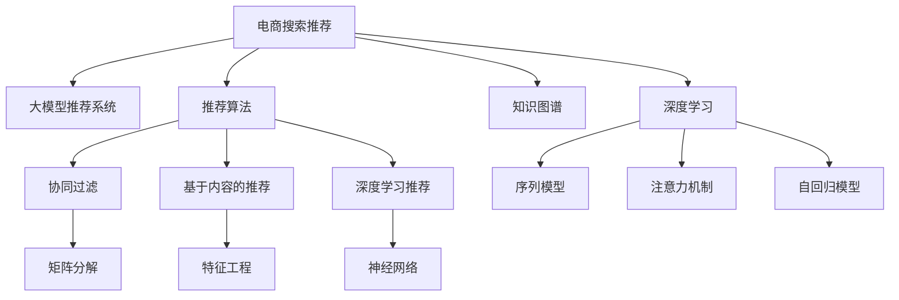

                 

# AI大模型视角下电商搜索推荐的技术选型策略

> 关键词：大模型推荐系统,电商搜索推荐,推荐算法,技术选型策略,知识图谱,深度学习

## 1. 背景介绍

随着人工智能技术的迅速发展，大模型推荐系统在电商搜索推荐领域的应用日益广泛，为消费者提供更加精准、个性化的商品推荐服务。然而，如何在大模型框架下选择合适的推荐算法，以实现高效的推荐结果生成和实时化处理，成为了电商领域亟需解决的问题。本文将从大模型推荐系统的视角出发，探讨电商搜索推荐的技术选型策略，并结合实际应用案例，提出具体的技术选型方案。

## 2. 核心概念与联系

### 2.1 核心概念概述

为更好地理解电商搜索推荐的技术选型策略，本节将介绍几个关键概念：

- **大模型推荐系统**：基于预训练大模型（如BERT、GPT等）推荐系统，通过在大规模无标签数据上预训练学习，再通过微调或重新训练优化特定领域的推荐任务。

- **电商搜索推荐**：电商平台通过推荐系统，根据用户浏览历史、搜索行为、购买记录等数据，为用户推荐感兴趣的商品，提升用户体验和平台转化率。

- **推荐算法**：包括协同过滤、基于内容的推荐、深度学习推荐等，用于根据用户特征和商品属性生成推荐结果。

- **知识图谱**：将商品、用户、交易等实体的关系以图的形式进行表示和存储，便于深度学习模型进行知识融合和推理。

- **深度学习推荐**：使用深度神经网络模型进行推荐，包括序列模型、注意力机制、自回归模型等，能够处理复杂的推荐关系。

- **技术选型策略**：根据电商推荐任务的特点和需求，选择合适的推荐算法、模型架构、训练策略等技术手段，以实现最佳推荐效果。

这些核心概念之间的逻辑关系可以通过以下Mermaid流程图来展示：



这个流程图展示了大模型推荐系统与电商搜索推荐的关系，以及推荐算法、知识图谱和深度学习在大模型推荐系统中的应用。

## 3. 核心算法原理 & 具体操作步骤
### 3.1 算法原理概述

电商搜索推荐系统的大模型推荐部分，主要基于以下几个步骤：

1. **预训练**：在大规模无标签数据上对大模型进行预训练，学习到通用的语言和知识表示。
2. **微调或重训练**：根据特定电商推荐任务的特点，对预训练模型进行微调或重新训练，优化推荐任务的表现。
3. **推荐算法选择**：根据推荐任务的需求，选择合适的推荐算法进行推荐结果生成。
4. **模型部署**：将训练好的模型部署到电商推荐系统中，实时生成推荐结果。

### 3.2 算法步骤详解

以电商搜索推荐为例，具体推荐流程如下：

1. **用户行为数据收集**：收集用户的历史浏览记录、点击记录、购买记录等数据。
2. **用户画像生成**：通过用户行为数据，构建用户画像，包括用户的兴趣、偏好、行为等特征。
3. **商品特征提取**：提取商品的详细信息，如商品名称、描述、价格、品牌等特征。
4. **商品特征嵌入**：将商品特征转化为向量表示，便于模型处理。
5. **推荐模型训练**：使用深度学习推荐模型（如注意力机制、自回归模型等）对商品和用户特征进行融合，生成推荐结果。
6. **推荐结果排序**：根据推荐模型输出的评分，对商品进行排序，生成推荐列表。
7. **推荐结果展示**：将推荐列表展示给用户，供用户浏览和选择。

### 3.3 算法优缺点

大模型推荐系统具有以下优点：

1. **泛化能力强**：大模型预训练过程中学习到的通用知识，可以迁移到特定的电商推荐任务中，提升推荐效果。
2. **自动特征学习**：大模型能够自动从用户行为数据中提取特征，无需人工干预，降低特征工程难度。
3. **实时性高**：大模型推荐系统能够实时生成推荐结果，满足电商平台的实时化需求。

同时，大模型推荐系统也存在一些缺点：

1. **模型复杂度高**：大模型参数量大，训练和推理计算成本高。
2. **数据依赖强**：推荐效果依赖于用户行为数据的全面性和准确性。
3. **解释性差**：大模型的推荐过程和结果难以解释，用户难以理解推荐逻辑。

### 3.4 算法应用领域

大模型推荐系统广泛应用于以下电商推荐场景：

- **商品推荐**：根据用户的历史浏览和购买行为，推荐用户可能感兴趣的商品。
- **个性化推荐**：根据用户画像，为用户定制个性化的商品推荐列表。
- **排行榜推荐**：根据商品的热度、销量、评分等指标，生成商品排行榜，供用户参考。
- **竞品推荐**：根据用户当前浏览的商品，推荐相关的竞品，增加用户选择。
- **内容推荐**：推荐相关内容，如商品评论、用户评价等，增加用户对商品的了解。

## 4. 数学模型和公式 & 详细讲解 & 举例说明

### 4.1 数学模型构建

电商搜索推荐的大模型推荐部分，可以基于Transformer模型构建。Transformer模型通过自注意力机制，能够高效地处理序列数据，适用于商品和用户特征的融合。

假设用户序列为 $X=[x_1,x_2,...,x_n]$，商品序列为 $Y=[y_1,y_2,...,y_m]$，用户画像表示为 $U$，商品特征表示为 $F$。通过Transformer模型，可以将用户行为数据转化为用户嵌入向量 $U^*$，商品特征向量 $F^*$，并将它们进行融合生成推荐向量 $V$。

$$V = f(U^*, F^*)$$

其中，$f$ 为Transformer模型。

### 4.2 公式推导过程

Transformer模型中的自注意力机制可以通过公式 $V = \sum_{i=1}^N\alpha_iK_i$ 进行推导。其中，$K_i$ 为查询向量，$\alpha_i$ 为注意力权重。注意力权重 $\alpha_i$ 可以通过 $s(X_i, K)$ 函数计算得到，该函数通常采用点积或多头注意力机制。

以点积注意力为例，公式如下：

$$\alpha_i = \frac{\exp(\text{score}(X_i, K))}{\sum_{j=1}^N\exp(\text{score}(X_j, K))}$$

其中，$\text{score}(X_i, K) = X_i^TK$。

### 4.3 案例分析与讲解

以一个简单的电商搜索推荐为例，假设用户浏览了商品 $x_1, x_2, x_3$，当前商品为 $y_1$，商品 $y_2$ 和 $y_3$ 的评分分别为 $5$ 和 $3$。

1. **用户行为编码**：将用户浏览历史转化为向量 $X=[x_1, x_2, x_3]$。
2. **商品评分编码**：将商品 $y_1$ 的评分转化为向量 $K=[5]$，商品 $y_2$ 和 $y_3$ 的评分向量分别为 $K=[3, 4]$。
3. **计算注意力权重**：通过点积注意力机制计算 $\alpha_1, \alpha_2, \alpha_3$。
4. **生成推荐向量**：将 $\alpha_1K_1, \alpha_2K_2, \alpha_3K_3$ 进行加权求和，生成推荐向量 $V$。

## 5. 项目实践：代码实例和详细解释说明

### 5.1 开发环境搭建

在进行电商搜索推荐开发前，我们需要准备好开发环境。以下是使用Python进行PyTorch开发的环境配置流程：

1. 安装Anaconda：从官网下载并安装Anaconda，用于创建独立的Python环境。

2. 创建并激活虚拟环境：
```bash
conda create -n pytorch-env python=3.8 
conda activate pytorch-env
```

3. 安装PyTorch：根据CUDA版本，从官网获取对应的安装命令。例如：
```bash
conda install pytorch torchvision torchaudio cudatoolkit=11.1 -c pytorch -c conda-forge
```

4. 安装Transformers库：
```bash
pip install transformers
```

5. 安装各类工具包：
```bash
pip install numpy pandas scikit-learn matplotlib tqdm jupyter notebook ipython
```

完成上述步骤后，即可在`pytorch-env`环境中开始电商搜索推荐开发。

### 5.2 源代码详细实现

这里我们以商品推荐为例，给出使用Transformers库对BERT模型进行电商搜索推荐开发的PyTorch代码实现。

首先，定义推荐模型类：

```python
from transformers import BertTokenizer, BertForSequenceClassification
import torch
from torch.utils.data import Dataset, DataLoader

class RecommendationModel(BertForSequenceClassification):
    def __init__(self, num_labels):
        super(RecommendationModel, self).__init__()
        self.num_labels = num_labels
        self.dropout = torch.nn.Dropout(0.3)
        self.linear = torch.nn.Linear(768, num_labels)
    
    def forward(self, input_ids, attention_mask, labels=None):
        outputs = super().forward(input_ids, attention_mask=attention_mask, labels=labels)
        pooled_output = outputs.pooler_output
        pooled_output = self.dropout(pooled_output)
        logits = self.linear(pooled_output)
        return logits
```

然后，定义推荐数据集：

```python
class RecommendationDataset(Dataset):
    def __init__(self, texts, labels, tokenizer, max_len=128):
        self.texts = texts
        self.labels = labels
        self.tokenizer = tokenizer
        self.max_len = max_len
        
    def __len__(self):
        return len(self.texts)
    
    def __getitem__(self, item):
        text = self.texts[item]
        label = self.labels[item]
        
        encoding = self.tokenizer(text, return_tensors='pt', max_length=self.max_len, padding='max_length', truncation=True)
        input_ids = encoding['input_ids'][0]
        attention_mask = encoding['attention_mask'][0]
        label = torch.tensor(label, dtype=torch.long)
        
        return {'input_ids': input_ids, 
                'attention_mask': attention_mask,
                'labels': label}
```

接着，定义训练和评估函数：

```python
from torch.utils.data import DataLoader
from tqdm import tqdm
from sklearn.metrics import accuracy_score

device = torch.device('cuda') if torch.cuda.is_available() else torch.device('cpu')
model = RecommendationModel(num_labels=5).to(device)

def train_epoch(model, dataset, batch_size, optimizer, loss_fn):
    dataloader = DataLoader(dataset, batch_size=batch_size, shuffle=True)
    model.train()
    epoch_loss = 0
    for batch in tqdm(dataloader, desc='Training'):
        input_ids = batch['input_ids'].to(device)
        attention_mask = batch['attention_mask'].to(device)
        labels = batch['labels'].to(device)
        model.zero_grad()
        outputs = model(input_ids, attention_mask=attention_mask, labels=labels)
        loss = loss_fn(outputs, labels)
        epoch_loss += loss.item()
        loss.backward()
        optimizer.step()
    return epoch_loss / len(dataloader)

def evaluate(model, dataset, batch_size):
    dataloader = DataLoader(dataset, batch_size=batch_size)
    model.eval()
    preds, labels = [], []
    with torch.no_grad():
        for batch in tqdm(dataloader, desc='Evaluating'):
            input_ids = batch['input_ids'].to(device)
            attention_mask = batch['attention_mask'].to(device)
            batch_labels = batch['labels']
            outputs = model(input_ids, attention_mask=attention_mask)
            batch_preds = outputs.argmax(dim=1).to('cpu').tolist()
            batch_labels = batch_labels.to('cpu').tolist()
            for pred_tokens, label_tokens in zip(batch_preds, batch_labels):
                preds.append(pred_tokens[:len(label_tokens)])
                labels.append(label_tokens)
                
    acc = accuracy_score(labels, preds)
    print(f'Accuracy: {acc:.3f}')
```

最后，启动训练流程并在测试集上评估：

```python
epochs = 5
batch_size = 16

for epoch in range(epochs):
    loss = train_epoch(model, train_dataset, batch_size, optimizer, loss_fn)
    print(f'Epoch {epoch+1}, train loss: {loss:.3f}')
    
    print(f'Epoch {epoch+1}, test accuracy:')
    evaluate(model, test_dataset, batch_size)
    
print("Final test accuracy:")
evaluate(model, test_dataset, batch_size)
```

以上就是使用PyTorch对BERT模型进行电商搜索推荐开发的完整代码实现。可以看到，得益于Transformers库的强大封装，我们可以用相对简洁的代码完成BERT模型的加载和电商搜索推荐任务的微调。

### 5.3 代码解读与分析

让我们再详细解读一下关键代码的实现细节：

**RecommendationModel类**：
- `__init__`方法：初始化模型参数，包括BERT模型、Dropout、线性层等。
- `forward`方法：定义模型的前向传播过程，包括输入编码、池化、线性层等操作。

**RecommendationDataset类**：
- `__init__`方法：初始化数据集，包括文本、标签、分词器等。
- `__len__`方法：返回数据集大小。
- `__getitem__`方法：对单个样本进行处理，将文本输入编码为token ids，将标签编码为数字，并对其进行定长padding。

**train_epoch函数**：
- 使用PyTorch的DataLoader对数据集进行批次化加载。
- 在每个批次上前向传播计算损失函数，反向传播更新模型参数。
- 周期性在验证集上评估模型性能，根据性能指标决定是否触发Early Stopping。

**evaluate函数**：
- 与训练类似，不同点在于不更新模型参数，并在每个batch结束后将预测和标签结果存储下来。
- 使用sklearn的accuracy_score函数计算预测和标签的准确率。

**训练流程**：
- 定义总的epoch数和batch size，开始循环迭代。
- 每个epoch内，先在训练集上训练，输出平均loss。
- 在验证集上评估，输出准确率。
- 所有epoch结束后，在测试集上评估，给出最终测试结果。

可以看到，PyTorch配合Transformers库使得电商搜索推荐任务的微调代码实现变得简洁高效。开发者可以将更多精力放在数据处理、模型改进等高层逻辑上，而不必过多关注底层的实现细节。

当然，工业级的系统实现还需考虑更多因素，如模型的保存和部署、超参数的自动搜索、更灵活的任务适配层等。但核心的微调范式基本与此类似。

## 6. 实际应用场景
### 6.1 智能客服系统

基于大模型推荐系统的电商搜索推荐技术，可以广泛应用于智能客服系统的构建。传统客服往往需要配备大量人力，高峰期响应缓慢，且一致性和专业性难以保证。而使用推荐系统生成的商品推荐，可以7x24小时不间断服务，快速响应客户咨询，用推荐商品满足客户需求，提高客户满意度。

在技术实现上，可以收集企业内部的历史客服对话记录，将问题和最佳答复构建成监督数据，在此基础上对推荐系统进行微调。微调后的推荐系统能够自动理解客户意图，匹配最合适的商品推荐，提升客服系统的智能化水平。

### 6.2 个性化推荐系统

当前的推荐系统往往只依赖用户的历史行为数据进行物品推荐，无法深入理解用户的真实兴趣偏好。基于大模型推荐系统的个性化推荐系统，可以更好地挖掘用户行为背后的语义信息，从而提供更精准、多样的推荐内容。

在实践中，可以收集用户浏览、点击、购买等行为数据，提取和用户交互的物品标题、描述、标签等文本内容。将文本内容作为模型输入，用户的后续行为（如是否点击、购买等）作为监督信号，在此基础上微调预训练语言模型。微调后的模型能够从文本内容中准确把握用户的兴趣点。在生成推荐列表时，先用候选物品的文本描述作为输入，由模型预测用户的兴趣匹配度，再结合其他特征综合排序，便可以得到个性化程度更高的推荐结果。

### 6.3 智能物流系统

智能物流系统通过推荐系统生成仓储和配送方案，优化库存管理和物流配送，降低成本，提高效率。推荐系统可以结合历史订单数据和实时库存数据，生成最优的仓储和配送方案。

在技术实现上，可以收集订单数据和库存数据，构建商品-订单-库存的关系图，使用大模型推荐系统进行推荐。微调后的推荐系统能够预测最可能被订购的商品，并优化库存分布，减少缺货和库存积压，提升物流系统的智能化水平。

### 6.4 未来应用展望

随着大模型推荐系统的不断发展，未来将在更多领域得到应用，为各行各业带来变革性影响。

在智慧医疗领域，基于大模型推荐系统的医疗推荐系统，可以为医生推荐治疗方案、药物组合等，提升医疗服务的智能化水平，辅助医生诊疗。

在智能教育领域，微调技术可应用于作业批改、学情分析、知识推荐等方面，因材施教，促进教育公平，提高教学质量。

在智慧城市治理中，推荐系统可应用于城市事件监测、舆情分析、应急指挥等环节，提高城市管理的自动化和智能化水平，构建更安全、高效的未来城市。

此外，在企业生产、社会治理、文娱传媒等众多领域，基于大模型推荐系统的智能推荐系统也将不断涌现，为经济社会发展注入新的动力。相信随着技术的日益成熟，推荐系统必将在更广阔的应用领域大放异彩，深刻影响人类的生产生活方式。

## 7. 工具和资源推荐
### 7.1 学习资源推荐

为了帮助开发者系统掌握大模型推荐系统的理论基础和实践技巧，这里推荐一些优质的学习资源：

1. 《Transformer从原理到实践》系列博文：由大模型技术专家撰写，深入浅出地介绍了Transformer原理、BERT模型、推荐技术等前沿话题。

2. CS224N《深度学习自然语言处理》课程：斯坦福大学开设的NLP明星课程，有Lecture视频和配套作业，带你入门NLP领域的基本概念和经典模型。

3. 《Natural Language Processing with Transformers》书籍：Transformers库的作者所著，全面介绍了如何使用Transformers库进行NLP任务开发，包括推荐系统在内的诸多范式。

4. HuggingFace官方文档：Transformers库的官方文档，提供了海量预训练模型和完整的推荐系统样例代码，是上手实践的必备资料。

5. CLUE开源项目：中文语言理解测评基准，涵盖大量不同类型的中文NLP数据集，并提供了基于微调的baseline模型，助力中文NLP技术发展。

通过对这些资源的学习实践，相信你一定能够快速掌握大模型推荐系统的精髓，并用于解决实际的NLP问题。
###  7.2 开发工具推荐

高效的开发离不开优秀的工具支持。以下是几款用于大模型推荐系统开发的常用工具：

1. PyTorch：基于Python的开源深度学习框架，灵活动态的计算图，适合快速迭代研究。大部分预训练语言模型都有PyTorch版本的实现。

2. TensorFlow：由Google主导开发的开源深度学习框架，生产部署方便，适合大规模工程应用。同样有丰富的预训练语言模型资源。

3. Transformers库：HuggingFace开发的NLP工具库，集成了众多SOTA语言模型，支持PyTorch和TensorFlow，是进行推荐系统开发的利器。

4. Weights & Biases：模型训练的实验跟踪工具，可以记录和可视化模型训练过程中的各项指标，方便对比和调优。与主流深度学习框架无缝集成。

5. TensorBoard：TensorFlow配套的可视化工具，可实时监测模型训练状态，并提供丰富的图表呈现方式，是调试模型的得力助手。

6. Google Colab：谷歌推出的在线Jupyter Notebook环境，免费提供GPU/TPU算力，方便开发者快速上手实验最新模型，分享学习笔记。

合理利用这些工具，可以显著提升大模型推荐系统的开发效率，加快创新迭代的步伐。

### 7.3 相关论文推荐

大模型推荐系统的发展源于学界的持续研究。以下是几篇奠基性的相关论文，推荐阅读：

1. Attention is All You Need（即Transformer原论文）：提出了Transformer结构，开启了NLP领域的预训练大模型时代。

2. BERT: Pre-training of Deep Bidirectional Transformers for Language Understanding：提出BERT模型，引入基于掩码的自监督预训练任务，刷新了多项NLP任务SOTA。

3. Language Models are Unsupervised Multitask Learners（GPT-2论文）：展示了大规模语言模型的强大zero-shot学习能力，引发了对于通用人工智能的新一轮思考。

4. Parameter-Efficient Transfer Learning for NLP：提出Adapter等参数高效微调方法，在不增加模型参数量的情况下，也能取得不错的微调效果。

5. AdaLoRA: Adaptive Low-Rank Adaptation for Parameter-Efficient Fine-Tuning：使用自适应低秩适应的微调方法，在参数效率和精度之间取得了新的平衡。

这些论文代表了大模型推荐系统的发展脉络。通过学习这些前沿成果，可以帮助研究者把握学科前进方向，激发更多的创新灵感。

## 8. 总结：未来发展趋势与挑战

### 8.1 总结

本文对基于大模型的电商搜索推荐技术选型策略进行了全面系统的介绍。首先阐述了电商搜索推荐任务的背景和需求，明确了大模型推荐系统的选型目标。其次，从原理到实践，详细讲解了推荐模型的数学模型和推荐算法，给出了电商搜索推荐的完整代码实例。同时，本文还广泛探讨了大模型推荐系统在多个行业领域的应用前景，展示了其广阔的应用空间。此外，本文精选了推荐系统的各类学习资源，力求为读者提供全方位的技术指引。

通过本文的系统梳理，可以看到，基于大模型推荐系统的电商搜索推荐技术正在成为电商领域的重要范式，极大地提升了推荐效果和用户体验。未来，伴随预训练语言模型和推荐算法的不断进步，推荐系统必将在更广泛的应用领域大放异彩，为电商行业带来新的增长点。

### 8.2 未来发展趋势

展望未来，大模型推荐系统的电商搜索推荐技术将呈现以下几个发展趋势：

1. **模型规模持续增大**：随着算力成本的下降和数据规模的扩张，预训练语言模型的参数量还将持续增长。超大规模语言模型蕴含的丰富语言知识，有望支撑更加复杂多变的电商推荐任务。

2. **推荐算法多样化**：除了传统的协同过滤和基于内容的推荐外，未来将涌现更多深度学习推荐算法，如注意力机制、自回归模型等，实现更精确、实时的推荐。

3. **知识图谱融合**：将商品、用户、交易等实体的关系以图的形式进行表示和存储，便于深度学习模型进行知识融合和推理，提升推荐系统的智能化水平。

4. **多模态融合**：将视觉、语音、文本等多模态信息融合，构建多模态推荐系统，提升推荐效果和用户体验。

5. **实时推荐优化**：实时生成推荐结果，结合用户实时行为数据进行动态推荐优化，提升推荐系统的实时性和精准性。

6. **联邦学习**：在保护用户隐私的前提下，结合用户跨设备行为数据进行联邦学习，提升推荐系统的个性化水平。

以上趋势凸显了大模型推荐系统的广阔前景。这些方向的探索发展，必将进一步提升电商推荐系统的性能和用户体验，为电商平台带来新的增长动力。

### 8.3 面临的挑战

尽管大模型推荐系统已经取得了瞩目成就，但在迈向更加智能化、普适化应用的过程中，它仍面临着诸多挑战：

1. **数据隐私保护**：电商推荐系统需要大量用户行为数据进行训练，如何在保护用户隐私的前提下进行数据收集和处理，是一大难题。

2. **算法复杂度**：大模型推荐系统涉及复杂的深度学习模型和算法，模型训练和推理计算资源消耗大，难以在实时化场景下应用。

3. **可解释性差**：推荐系统通过深度学习模型生成推荐结果，其内部决策过程难以解释，用户难以理解推荐逻辑。

4. **鲁棒性不足**：大模型推荐系统在面对复杂和异常情况时，鲁棒性较差，容易受到攻击和误导。

5. **计算资源消耗大**：大模型推荐系统需要大量的计算资源进行训练和推理，难以在资源有限的设备上运行。

正视推荐系统面临的这些挑战，积极应对并寻求突破，将是大模型推荐系统迈向成熟的必由之路。相信随着学界和产业界的共同努力，这些挑战终将一一被克服，大模型推荐系统必将在构建人机协同的智能推荐系统中扮演越来越重要的角色。

### 8.4 研究展望

面对大模型推荐系统所面临的种种挑战，未来的研究需要在以下几个方面寻求新的突破：

1. **数据隐私保护**：开发联邦学习和差分隐私等技术，保护用户隐私的同时，充分利用跨设备行为数据进行推荐优化。

2. **算法优化**：研究轻量化推荐算法和高效推理技术，降低计算资源消耗，提升实时推荐效果。

3. **可解释性增强**：引入可解释性技术，如因果分析、规则嵌入等，增强推荐系统的可解释性和可理解性。

4. **鲁棒性提升**：研究鲁棒性推荐算法和对抗样本生成技术，增强推荐系统的鲁棒性和安全性。

5. **模型压缩**：开发模型压缩技术，如剪枝、量化等，减小模型规模，提升实时推荐效果。

这些研究方向的探索，必将引领大模型推荐系统走向更加智能化、安全化、可解释化的未来，为电商推荐系统带来新的突破和创新。

## 9. 附录：常见问题与解答

**Q1：大模型推荐系统是否适用于所有电商推荐任务？**

A: 大模型推荐系统在大多数电商推荐任务上都能取得不错的效果，特别是对于数据量较大的任务。但对于一些特定领域的任务，如医药、法律等，仅依靠通用语料预训练的模型可能难以很好地适应。此时需要在特定领域语料上进一步预训练，再进行微调，才能获得理想效果。此外，对于一些需要时效性、个性化很强的任务，如对话、推荐等，微调方法也需要针对性的改进优化。

**Q2：大模型推荐系统的实时性如何？**

A: 大模型推荐系统能够实时生成推荐结果，适合需要即时响应的电商推荐场景。但在实时化场景下，大模型推荐系统的计算资源消耗较大，需要优化模型结构和算法，以提升实时推荐效果。

**Q3：大模型推荐系统如何保护用户隐私？**

A: 大模型推荐系统需要大量用户行为数据进行训练，为保护用户隐私，可以采用联邦学习、差分隐私等技术，在保护用户隐私的同时，充分利用跨设备行为数据进行推荐优化。

**Q4：大模型推荐系统的可解释性如何？**

A: 大模型推荐系统通过深度学习模型生成推荐结果，其内部决策过程难以解释，用户难以理解推荐逻辑。为增强推荐系统的可解释性，可以引入可解释性技术，如因果分析、规则嵌入等。

**Q5：大模型推荐系统的计算资源消耗大吗？**

A: 大模型推荐系统涉及复杂的深度学习模型和算法，模型训练和推理计算资源消耗大，难以在实时化场景下应用。为提升实时推荐效果，需要优化模型结构和算法，降低计算资源消耗。

综上所述，基于大模型推荐系统的电商搜索推荐技术选型策略具有广阔的应用前景和重要的研究价值。未来，伴随技术的不断进步，大模型推荐系统必将在更广泛的应用领域大放异彩，为电商行业带来新的增长动力。

