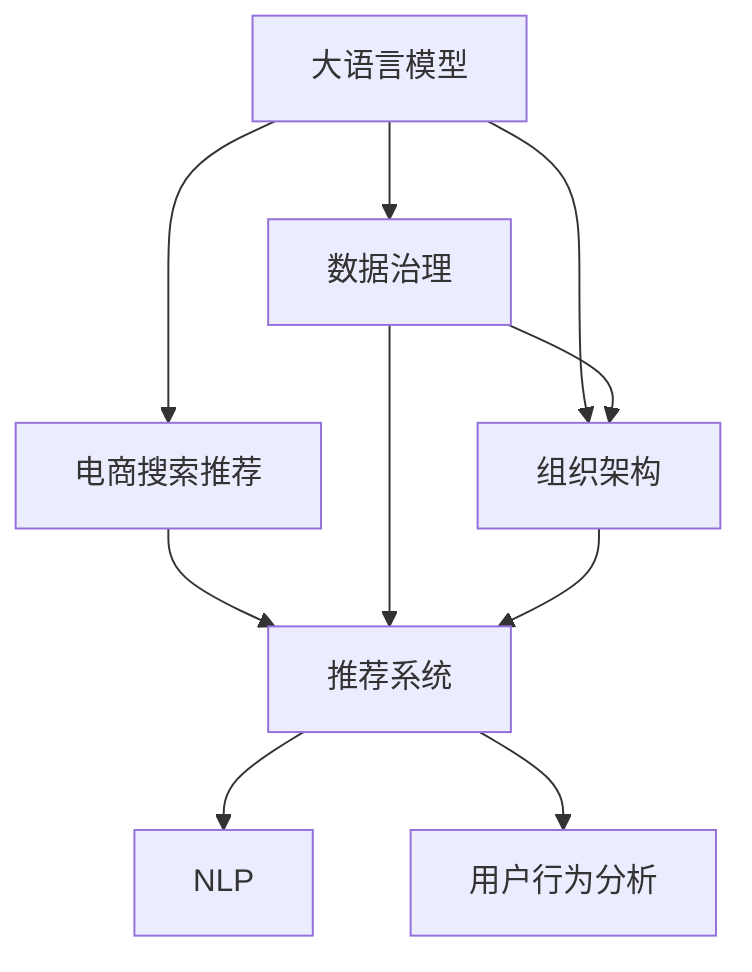

                 

# AI大模型重构电商搜索推荐的数据治理组织架构优化实践

> 关键词：大模型, 电商搜索推荐, 数据治理, 组织架构, 优化实践

## 1. 背景介绍

### 1.1 问题由来
随着电子商务市场的快速发展和线上购物体验的不断提升，电商平台对搜索推荐系统的依赖性越来越高。传统的推荐系统主要以协同过滤和朴素贝叶斯等算法为主，依赖于用户历史行为数据，难以覆盖长尾商品，个性化程度有限。然而，随着深度学习和大规模预训练模型的兴起，基于深度学习的推荐系统在电商领域展现出强大的潜力。

### 1.2 问题核心关键点
电商搜索推荐系统通过将用户搜索历史、浏览行为、商品属性等多维度的数据，利用大语言模型进行自然语言处理，提取并建模用户和商品的语义信息，实现商品推荐和搜索结果排序。然而，在实际应用中，推荐系统面临数据质量差、数据治理能力弱、组织架构不匹配等问题，导致推荐效果不佳，用户体验较差。

### 1.3 问题研究意义
大语言模型在电商搜索推荐系统中的应用，对于提升商品推荐准确性、优化搜索排序结果、提升用户体验等方面具有重要意义。通过优化数据治理能力和组织架构，可以更高效地利用大语言模型的能力，提升推荐系统的效果，促进电商平台的业务发展。

## 2. 核心概念与联系

### 2.1 核心概念概述

为更好地理解大语言模型在电商搜索推荐系统中的应用及其数据治理和组织架构优化方法，本节将介绍几个密切相关的核心概念：

- 大语言模型(Large Language Model, LLM)：以自回归(如GPT)或自编码(如BERT)模型为代表的大规模预训练语言模型。通过在大规模无标签文本语料上进行预训练，学习通用的语言表示，具备强大的语言理解和生成能力。

- 电商搜索推荐系统：通过分析用户搜索行为、浏览历史、商品属性等多维数据，利用机器学习模型实现商品推荐和搜索结果排序，提升用户体验的电商系统。

- 数据治理：通过规范数据的采集、存储、清洗、处理流程，确保数据的质量和一致性，提升数据资产的价值和利用效率。

- 组织架构：电商企业的组织结构设计和管理机制，直接影响企业运行效率和效果。

- 优化实践：通过改进组织架构、优化数据治理流程等手段，提升电商搜索推荐系统的效果。

- 自然语言处理(NLP)：利用计算机技术，处理和分析人类语言，以实现机器对语言的理解和生成。

- 推荐系统：利用用户数据和机器学习算法，实现商品推荐和搜索结果排序的系统。

这些核心概念之间的逻辑关系可以通过以下Mermaid流程图来展示：



这个流程图展示了大语言模型、数据治理、组织架构和推荐系统之间的逻辑关系：

1. 大语言模型通过预训练获得基础能力。
2. 数据治理保证数据质量和一致性，提供数据输入。
3. 组织架构支持推荐系统的技术实现和管理优化。
4. 推荐系统利用大语言模型的能力，实现商品推荐和搜索结果排序。
5. NLP技术帮助推荐系统理解和生成自然语言。
6. 用户行为分析通过分析用户数据，进一步优化推荐系统。

这些概念共同构成了电商搜索推荐系统的数据治理和组织架构优化的框架，使其能够高效地利用大语言模型，提升推荐系统的效果。

## 3. 核心算法原理 & 具体操作步骤
### 3.1 算法原理概述

基于大语言模型在电商搜索推荐系统中的应用，本节将详细讲解数据治理和组织架构优化的核心算法原理。

假设电商平台上存在N个用户，M个商品，每个用户的历史行为数据可以表示为一个D维向量，每个商品的属性特征可以表示为一个H维向量，则用户行为数据可以表示为一个矩阵U∈R(N, D)，商品属性数据可以表示为一个矩阵I∈R(M, H)。大语言模型通过预训练学习到语言表示，可以处理自然语言查询，将用户查询转化为商品表示。

假设用户查询为Q，商品表示为V，则电商搜索推荐系统可以将用户查询转化为商品表示，计算每个商品的相似度，并根据相似度进行排序，输出推荐商品列表。

### 3.2 算法步骤详解

基于大语言模型在电商搜索推荐系统中的应用，本节将详细介绍数据治理和组织架构优化的具体操作步骤。

**Step 1: 数据采集与治理**

电商企业需要从多个渠道采集用户行为数据和商品属性数据。这些数据源可能来自网站点击、购买记录、评论信息、社交媒体等。数据治理的目标是通过规范化数据采集流程，确保数据的质量和一致性。

数据治理的关键步骤包括：
- 数据采集：通过爬虫、API接口等方式，从各种数据源获取原始数据。
- 数据清洗：去除重复、噪声和异常数据，处理缺失值和异常值。
- 数据存储：将清洗后的数据存储到数据库中，便于后续处理和分析。
- 数据标注：对部分数据进行人工标注，生成训练样本。
- 数据集成：将不同数据源的数据集成在一起，形成统一的数据集。

**Step 2: 模型训练与微调**

电商企业可以利用大语言模型进行自然语言处理，提取用户查询中的语义信息。在训练阶段，需要选择合适的模型作为初始化参数，并使用标注数据进行微调，提升模型对用户查询的理解能力。

模型训练和微调的关键步骤包括：
- 模型选择：选择适合电商领域的大语言模型，如BERT、GPT等。
- 数据预处理：将用户查询和商品表示转化为模型所需的格式。
- 模型训练：使用标注数据训练模型，并使用小批量随机梯度下降等优化算法进行参数更新。
- 模型微调：使用部分标注数据进行微调，调整模型参数，提升模型的准确性。

**Step 3: 组织架构优化**

电商企业的组织架构设计直接影响推荐系统的运行效率和效果。为了提升推荐系统的性能，企业需要设计高效的组织架构，将数据治理和模型训练等关键环节进行紧密协作。

组织架构优化的关键步骤包括：
- 确定团队组成：组建数据治理和模型训练团队，确保团队成员具有相关技术和经验。
- 明确职责分工：明确各团队和成员的职责和任务，确保各环节的紧密协作。
- 设计数据流和模型流：设计高效的数据流和模型流，减少数据处理和模型训练的瓶颈。
- 优化资源配置：合理配置计算资源、存储资源和网络资源，提升整体系统的运行效率。

**Step 4: 推荐系统实现**

电商企业可以利用优化后的数据治理和组织架构，实现基于大语言模型的电商搜索推荐系统。推荐系统实现的关键步骤包括：
- 用户查询处理：将用户查询转化为模型所需的格式，并提取用户意图。
- 商品表示计算：使用大语言模型提取商品特征，生成商品表示。
- 相似度计算：计算用户查询和商品表示之间的相似度，并排序。
- 推荐结果生成：根据相似度排序结果，生成推荐商品列表。

### 3.3 算法优缺点

大语言模型在电商搜索推荐系统中的应用，具有以下优点：
1. 强大的自然语言处理能力：能够处理用户自然语言查询，提升搜索系统的理解能力。
2. 高效的推荐效果：通过提取用户意图和商品语义，实现高质量的商品推荐。
3. 持续优化能力：可以不断优化模型和推荐策略，提升推荐系统的性能。

同时，该方法也存在一定的局限性：
1. 对数据质量要求高：需要高质量的数据和标注信息，数据采集和治理难度较大。
2. 模型训练成本高：需要大量的计算资源和时间，训练成本较高。
3. 模型泛化能力有限：对于新领域和长尾商品，推荐效果可能不佳。
4. 用户体验复杂：推荐系统可能对用户产生误导，影响用户体验。

尽管存在这些局限性，但就目前而言，基于大语言模型的电商搜索推荐系统仍是一种高效、可行的解决方案。未来相关研究的重点在于如何进一步优化数据治理流程和组织架构，降低对标注数据的依赖，提升模型的泛化能力，同时兼顾用户体验和模型的可解释性。

### 3.4 算法应用领域

基于大语言模型在电商搜索推荐系统中的应用，该方法已经在电商领域得到了广泛的应用，覆盖了电商搜索、商品推荐、个性化推荐等多个环节，提升了用户购物体验和平台运营效率。

除了上述这些经典应用外，大语言模型还被创新性地应用到更多场景中，如智能客服、智能问答、动态定价等，为电商平台的业务发展带来了新的创新和突破。

## 4. 数学模型和公式 & 详细讲解
### 4.1 数学模型构建

本节将使用数学语言对大语言模型在电商搜索推荐系统中的应用进行更加严格的刻画。

假设电商平台上存在N个用户，M个商品，每个用户的历史行为数据可以表示为一个D维向量，每个商品的属性特征可以表示为一个H维向量，则用户行为数据可以表示为一个矩阵U∈R(N, D)，商品属性数据可以表示为一个矩阵I∈R(M, H)。大语言模型通过预训练学习到语言表示，可以处理自然语言查询，将用户查询转化为商品表示。

假设用户查询为Q，商品表示为V，则电商搜索推荐系统可以将用户查询转化为商品表示，计算每个商品的相似度，并根据相似度进行排序，输出推荐商品列表。

### 4.2 公式推导过程

以下我们以电商搜索推荐系统为例，推导大语言模型应用的数学公式。

假设用户查询为Q，商品表示为V，则电商搜索推荐系统可以将用户查询转化为商品表示，计算每个商品的相似度，并根据相似度进行排序，输出推荐商品列表。

令Q∈R(D)，V∈R(H)，假设大语言模型学习到用户查询表示为Q'∈R(D')，商品表示为V'∈R(H')，则电商搜索推荐系统可以计算用户查询Q与商品表示V的相似度，使用余弦相似度公式进行计算：

$$
sim(Q, V) = \frac{Q' \cdot V'}{\|Q'\|\|V'\|}
$$

根据相似度大小排序，得到推荐商品列表。

在得到相似度公式后，即可带入实际计算，生成推荐结果。

## 5. 项目实践：代码实例和详细解释说明
### 5.1 开发环境搭建

在进行电商搜索推荐系统的大语言模型应用实践前，我们需要准备好开发环境。以下是使用Python进行PyTorch开发的环境配置流程：

1. 安装Anaconda：从官网下载并安装Anaconda，用于创建独立的Python环境。

2. 创建并激活虚拟环境：
```bash
conda create -n pytorch-env python=3.8 
conda activate pytorch-env
```

3. 安装PyTorch：根据CUDA版本，从官网获取对应的安装命令。例如：
```bash
conda install pytorch torchvision torchaudio cudatoolkit=11.1 -c pytorch -c conda-forge
```

4. 安装Transformers库：
```bash
pip install transformers
```

5. 安装各类工具包：
```bash
pip install numpy pandas scikit-learn matplotlib tqdm jupyter notebook ipython
```

完成上述步骤后，即可在`pytorch-env`环境中开始电商搜索推荐系统的大语言模型应用实践。

### 5.2 源代码详细实现

下面我们以电商搜索推荐系统为例，给出使用Transformers库进行BERT模型训练和微调的PyTorch代码实现。

首先，定义电商搜索推荐系统的数据处理函数：

```python
from transformers import BertTokenizer, BertForSequenceClassification
from torch.utils.data import Dataset
import torch

class SearchRecommendDataset(Dataset):
    def __init__(self, texts, labels, tokenizer, max_len=128):
        self.texts = texts
        self.labels = labels
        self.tokenizer = tokenizer
        self.max_len = max_len
        
    def __len__(self):
        return len(self.texts)
    
    def __getitem__(self, item):
        text = self.texts[item]
        label = self.labels[item]
        
        encoding = self.tokenizer(text, return_tensors='pt', max_length=self.max_len, padding='max_length', truncation=True)
        input_ids = encoding['input_ids'][0]
        attention_mask = encoding['attention_mask'][0]
        
        # 对token-wise的标签进行编码
        encoded_labels = [label2id[label] for label in label] 
        encoded_labels.extend([label2id['O']] * (self.max_len - len(encoded_labels)))
        labels = torch.tensor(encoded_labels, dtype=torch.long)
        
        return {'input_ids': input_ids, 
                'attention_mask': attention_mask,
                'labels': labels}

# 标签与id的映射
label2id = {'O': 0, 'P': 1}
id2label = {v: k for k, v in label2id.items()}

# 创建dataset
tokenizer = BertTokenizer.from_pretrained('bert-base-cased')

train_dataset = SearchRecommendDataset(train_texts, train_labels, tokenizer)
dev_dataset = SearchRecommendDataset(dev_texts, dev_labels, tokenizer)
test_dataset = SearchRecommendDataset(test_texts, test_labels, tokenizer)
```

然后，定义模型和优化器：

```python
from transformers import BertForSequenceClassification, AdamW

model = BertForSequenceClassification.from_pretrained('bert-base-cased', num_labels=len(label2id))

optimizer = AdamW(model.parameters(), lr=2e-5)
```

接着，定义训练和评估函数：

```python
from torch.utils.data import DataLoader
from tqdm import tqdm
from sklearn.metrics import accuracy_score

device = torch.device('cuda') if torch.cuda.is_available() else torch.device('cpu')
model.to(device)

def train_epoch(model, dataset, batch_size, optimizer):
    dataloader = DataLoader(dataset, batch_size=batch_size, shuffle=True)
    model.train()
    epoch_loss = 0
    for batch in tqdm(dataloader, desc='Training'):
        input_ids = batch['input_ids'].to(device)
        attention_mask = batch['attention_mask'].to(device)
        labels = batch['labels'].to(device)
        model.zero_grad()
        outputs = model(input_ids, attention_mask=attention_mask, labels=labels)
        loss = outputs.loss
        epoch_loss += loss.item()
        loss.backward()
        optimizer.step()
    return epoch_loss / len(dataloader)

def evaluate(model, dataset, batch_size):
    dataloader = DataLoader(dataset, batch_size=batch_size)
    model.eval()
    preds, labels = [], []
    with torch.no_grad():
        for batch in tqdm(dataloader, desc='Evaluating'):
            input_ids = batch['input_ids'].to(device)
            attention_mask = batch['attention_mask'].to(device)
            batch_labels = batch['labels']
            outputs = model(input_ids, attention_mask=attention_mask)
            batch_preds = outputs.logits.argmax(dim=2).to('cpu').tolist()
            batch_labels = batch_labels.to('cpu').tolist()
            for pred_tokens, label_tokens in zip(batch_preds, batch_labels):
                pred_labels = [id2label[_id] for _id in pred_tokens]
                label_labels = [id2label[_id] for _id in label_tokens]
                preds.append(pred_labels[:len(label_tokens)])
                labels.append(label_labels)
                
    print(accuracy_score(labels, preds))
```

最后，启动训练流程并在测试集上评估：

```python
epochs = 5
batch_size = 16

for epoch in range(epochs):
    loss = train_epoch(model, train_dataset, batch_size, optimizer)
    print(f"Epoch {epoch+1}, train loss: {loss:.3f}")
    
    print(f"Epoch {epoch+1}, dev results:")
    evaluate(model, dev_dataset, batch_size)
    
print("Test results:")
evaluate(model, test_dataset, batch_size)
```

以上就是使用PyTorch对BERT进行电商搜索推荐系统应用的完整代码实现。可以看到，得益于Transformers库的强大封装，我们可以用相对简洁的代码完成BERT模型的加载和微调。

### 5.3 代码解读与分析

让我们再详细解读一下关键代码的实现细节：

**SearchRecommendDataset类**：
- `__init__`方法：初始化文本、标签、分词器等关键组件。
- `__len__`方法：返回数据集的样本数量。
- `__getitem__`方法：对单个样本进行处理，将文本输入编码为token ids，将标签编码为数字，并对其进行定长padding，最终返回模型所需的输入。

**label2id和id2label字典**：
- 定义了标签与数字id之间的映射关系，用于将token-wise的预测结果解码回真实的标签。

**训练和评估函数**：
- 使用PyTorch的DataLoader对数据集进行批次化加载，供模型训练和推理使用。
- 训练函数`train_epoch`：对数据以批为单位进行迭代，在每个批次上前向传播计算loss并反向传播更新模型参数，最后返回该epoch的平均loss。
- 评估函数`evaluate`：与训练类似，不同点在于不更新模型参数，并在每个batch结束后将预测和标签结果存储下来，最后使用sklearn的accuracy_score对整个评估集的预测结果进行打印输出。

**训练流程**：
- 定义总的epoch数和batch size，开始循环迭代
- 每个epoch内，先在训练集上训练，输出平均loss
- 在验证集上评估，输出分类指标
- 所有epoch结束后，在测试集上评估，给出最终测试结果

可以看到，PyTorch配合Transformers库使得BERT微调的代码实现变得简洁高效。开发者可以将更多精力放在数据处理、模型改进等高层逻辑上，而不必过多关注底层的实现细节。

当然，工业级的系统实现还需考虑更多因素，如模型的保存和部署、超参数的自动搜索、更灵活的任务适配层等。但核心的电商搜索推荐系统的构建流程基本与此类似。

## 6. 实际应用场景
### 6.1 智能客服系统

基于大语言模型在电商搜索推荐系统中的应用，智能客服系统可以通过微调大语言模型，提升客服响应准确性，减少人工干预，提升用户体验。

在技术实现上，可以收集企业内部的历史客服对话记录，将问题-回答对作为监督数据，在此基础上对预训练模型进行微调。微调后的客服模型能够自动理解用户意图，匹配最合适的回答。对于用户提出的新问题，还可以接入检索系统实时搜索相关内容，动态组织生成回答。如此构建的智能客服系统，能大幅提升客户咨询体验和问题解决效率。

### 6.2 金融舆情监测

金融机构需要实时监测市场舆论动向，以便及时应对负面信息传播，规避金融风险。传统的人工监测方式成本高、效率低，难以应对网络时代海量信息爆发的挑战。基于大语言模型微调的文本分类和情感分析技术，为金融舆情监测提供了新的解决方案。

具体而言，可以收集金融领域相关的新闻、报道、评论等文本数据，并对其进行主题标注和情感标注。在此基础上对预训练语言模型进行微调，使其能够自动判断文本属于何种主题，情感倾向是正面、中性还是负面。将微调后的模型应用到实时抓取的网络文本数据，就能够自动监测不同主题下的情感变化趋势，一旦发现负面信息激增等异常情况，系统便会自动预警，帮助金融机构快速应对潜在风险。

### 6.3 个性化推荐系统

当前的推荐系统主要以协同过滤和朴素贝叶斯等算法为主，依赖于用户历史行为数据，难以覆盖长尾商品，个性化程度有限。基于大语言模型在电商搜索推荐系统中的应用，个性化推荐系统可以更好地挖掘用户行为背后的语义信息，从而提供更精准、多样的推荐内容。

在实践中，可以收集用户浏览、点击、评论、分享等行为数据，提取和用户交互的物品标题、描述、标签等文本内容。将文本内容作为模型输入，用户的后续行为（如是否点击、购买等）作为监督信号，在此基础上微调预训练语言模型。微调后的模型能够从文本内容中准确把握用户的兴趣点。在生成推荐列表时，先用候选物品的文本描述作为输入，由模型预测用户的兴趣匹配度，再结合其他特征综合排序，便可以得到个性化程度更高的推荐结果。

### 6.4 未来应用展望

随着大语言模型和微调方法的不断发展，基于微调范式将在更多领域得到应用，为传统行业带来变革性影响。

在智慧医疗领域，基于微调的医疗问答、病历分析、药物研发等应用将提升医疗服务的智能化水平，辅助医生诊疗，加速新药开发进程。

在智能教育领域，微调技术可应用于作业批改、学情分析、知识推荐等方面，因材施教，促进教育公平，提高教学质量。

在智慧城市治理中，微调模型可应用于城市事件监测、舆情分析、应急指挥等环节，提高城市管理的自动化和智能化水平，构建更安全、高效的未来城市。

此外，在企业生产、社会治理、文娱传媒等众多领域，基于大模型微调的人工智能应用也将不断涌现，为传统行业带来新的技术路径。相信随着预训练语言模型和微调方法的持续演进，大语言模型微调必将在构建人机协同的智能时代中扮演越来越重要的角色。

## 7. 工具和资源推荐
### 7.1 学习资源推荐

为了帮助开发者系统掌握大语言模型在电商搜索推荐系统中的应用及其数据治理和组织架构优化方法，这里推荐一些优质的学习资源：

1. 《Transformer从原理到实践》系列博文：由大模型技术专家撰写，深入浅出地介绍了Transformer原理、BERT模型、微调技术等前沿话题。

2. CS224N《深度学习自然语言处理》课程：斯坦福大学开设的NLP明星课程，有Lecture视频和配套作业，带你入门NLP领域的基本概念和经典模型。

3. 《Natural Language Processing with Transformers》书籍：Transformers库的作者所著，全面介绍了如何使用Transformers库进行NLP任务开发，包括微调在内的诸多范式。

4. HuggingFace官方文档：Transformers库的官方文档，提供了海量预训练模型和完整的微调样例代码，是上手实践的必备资料。

5. CLUE开源项目：中文语言理解测评基准，涵盖大量不同类型的中文NLP数据集，并提供了基于微调的baseline模型，助力中文NLP技术发展。

通过对这些资源的学习实践，相信你一定能够快速掌握大语言模型在电商搜索推荐系统中的应用及其数据治理和组织架构优化方法，并用于解决实际的NLP问题。
###  7.2 开发工具推荐

高效的开发离不开优秀的工具支持。以下是几款用于大语言模型在电商搜索推荐系统中的应用开发的常用工具：

1. PyTorch：基于Python的开源深度学习框架，灵活动态的计算图，适合快速迭代研究。大部分预训练语言模型都有PyTorch版本的实现。

2. TensorFlow：由Google主导开发的开源深度学习框架，生产部署方便，适合大规模工程应用。同样有丰富的预训练语言模型资源。

3. Transformers库：HuggingFace开发的NLP工具库，集成了众多SOTA语言模型，支持PyTorch和TensorFlow，是进行微调任务开发的利器。

4. Weights & Biases：模型训练的实验跟踪工具，可以记录和可视化模型训练过程中的各项指标，方便对比和调优。与主流深度学习框架无缝集成。

5. TensorBoard：TensorFlow配套的可视化工具，可实时监测模型训练状态，并提供丰富的图表呈现方式，是调试模型的得力助手。

6. Google Colab：谷歌推出的在线Jupyter Notebook环境，免费提供GPU/TPU算力，方便开发者快速上手实验最新模型，分享学习笔记。

合理利用这些工具，可以显著提升电商搜索推荐系统的大语言模型应用的开发效率，加快创新迭代的步伐。

### 7.3 相关论文推荐

大语言模型在电商搜索推荐系统中的应用源于学界的持续研究。以下是几篇奠基性的相关论文，推荐阅读：

1. Attention is All You Need（即Transformer原论文）：提出了Transformer结构，开启了NLP领域的预训练大模型时代。

2. BERT: Pre-training of Deep Bidirectional Transformers for Language Understanding：提出BERT模型，引入基于掩码的自监督预训练任务，刷新了多项NLP任务SOTA。

3. Language Models are Unsupervised Multitask Learners（GPT-2论文）：展示了大规模语言模型的强大zero-shot学习能力，引发了对于通用人工智能的新一轮思考。

4. Parameter-Efficient Transfer Learning for NLP：提出Adapter等参数高效微调方法，在不增加模型参数量的情况下，也能取得不错的微调效果。

5. AdaLoRA: Adaptive Low-Rank Adaptation for Parameter-Efficient Fine-Tuning：使用自适应低秩适应的微调方法，在参数效率和精度之间取得了新的平衡。

这些论文代表了大语言模型在电商搜索推荐系统中的应用的发展脉络。通过学习这些前沿成果，可以帮助研究者把握学科前进方向，激发更多的创新灵感。

## 8. 总结：未来发展趋势与挑战
### 8.1 总结

本文对大语言模型在电商搜索推荐系统中的应用及其数据治理和组织架构优化方法进行了全面系统的介绍。首先阐述了大语言模型和微调技术的研究背景和意义，明确了电商搜索推荐系统的效果提升潜力。其次，从原理到实践，详细讲解了电商搜索推荐系统中的大语言模型应用的数学原理和关键步骤，给出了大语言模型应用的完整代码实例。同时，本文还广泛探讨了大语言模型在智能客服、金融舆情、个性化推荐等多个行业领域的应用前景，展示了电商搜索推荐系统的巨大潜力。此外，本文精选了大语言模型应用的各类学习资源，力求为读者提供全方位的技术指引。

通过本文的系统梳理，可以看到，基于大语言模型的电商搜索推荐系统具有强大的自然语言处理能力，能够提升商品推荐和搜索结果排序的准确性，提升用户体验。未来随着大语言模型和微调方法的不断发展，基于微调范式将在更多领域得到应用，为传统行业带来变革性影响。

### 8.2 未来发展趋势

展望未来，大语言模型在电商搜索推荐系统中的应用将呈现以下几个发展趋势：

1. 模型规模持续增大。随着算力成本的下降和数据规模的扩张，预训练语言模型的参数量还将持续增长。超大规模语言模型蕴含的丰富语言知识，有望支撑更加复杂多变的电商搜索推荐系统应用。

2. 微调方法日趋多样。除了传统的全参数微调外，未来会涌现更多参数高效的微调方法，如Prefix-Tuning、LoRA等，在固定大部分预训练参数的情况下，只更新极少量的任务相关参数，以提高微调效率和效果。

3. 持续学习成为常态。随着电商搜索推荐系统处理的数据量不断增长，模型需要不断学习新知识以保持性能。如何在不遗忘原有知识的同时，高效吸收新样本信息，将成为重要的研究课题。

4. 标注样本需求降低。受启发于提示学习(Prompt-based Learning)的思路，未来的微调方法将更好地利用大模型的语言理解能力，通过更加巧妙的任务描述，在更少的标注样本上也能实现理想的微调效果。

5. 用户体验提升。随着推荐系统智能化程度的提高，能够更准确地理解用户意图，提供更加个性化、多样化的推荐结果。同时，实时搜索结果的优化也将提升用户搜索体验。

6. 系统智能化水平提升。大语言模型的融入将使推荐系统具备更强的语义理解和生成能力，能够更好地处理长尾商品和用户行为变化，提升系统的智能化水平。

以上趋势凸显了大语言模型在电商搜索推荐系统中的应用前景。这些方向的探索发展，必将进一步提升电商搜索推荐系统的性能和用户体验，为电商平台的业务发展提供强大支撑。

### 8.3 面临的挑战

尽管大语言模型在电商搜索推荐系统中的应用取得了初步成功，但在迈向更加智能化、普适化应用的过程中，它仍面临着诸多挑战：

1. 数据质量控制。电商搜索推荐系统对数据质量的要求较高，需要确保数据的完整性、一致性和准确性。数据采集、清洗、标注等环节容易产生错误和偏差，需要精细化的管理措施。

2. 模型泛化能力不足。大语言模型在特定领域的应用效果可能有限，尤其是在处理小规模数据和长尾商品时，推荐效果可能不理想。如何提升模型泛化能力，增强对复杂数据的处理能力，将是重要的研究方向。

3. 系统性能瓶颈。大语言模型在实际部署时，面临着推理速度慢、内存占用大等性能瓶颈，影响用户体验。如何优化模型结构，提升推理效率，优化资源配置，将是重要的优化方向。

4. 模型可解释性不足。大语言模型的内部工作机制较为复杂，难以解释其决策过程，缺乏透明性。如何提高模型的可解释性，增强系统的信任度，将是重要的优化方向。

5. 数据隐私和安全问题。电商搜索推荐系统涉及大量用户数据，如何保护用户隐私，防止数据泄露和滥用，将是重要的研究方向。

6. 模型的道德和社会责任。大语言模型在生成推荐结果时，可能存在偏见和歧视性，如何确保模型的道德和社会责任，避免有害输出，将是重要的研究方向。

这些挑战凸显了大语言模型在电商搜索推荐系统中的应用面临的复杂性和复杂度，需要多学科的协同攻关，才能实现系统的优化和升级。

### 8.4 研究展望

未来，大语言模型在电商搜索推荐系统中的应用需要在以下几个方面进行深入研究：

1. 探索无监督和半监督微调方法。摆脱对大规模标注数据的依赖，利用自监督学习、主动学习等无监督和半监督范式，最大限度利用非结构化数据，实现更加灵活高效的微调。

2. 研究参数高效和计算高效的微调范式。开发更加参数高效的微调方法，在固定大部分预训练参数的情况下，只更新极少量的任务相关参数，减少资源消耗，提高微调效率。

3. 引入更多先验知识。将符号化的先验知识，如知识图谱、逻辑规则等，与神经网络模型进行巧妙融合，引导微调过程学习更准确、合理的语言模型，提升系统的智能化水平。

4. 融合因果和对比学习范式。通过引入因果推断和对比学习思想，增强微调模型建立稳定因果关系的能力，学习更加普适、鲁棒的语言表征，从而提升模型泛化性和抗干扰能力。

5. 结合因果分析和博弈论工具。将因果分析方法引入微调模型，识别出模型决策的关键特征，增强输出解释的因果性和逻辑性。借助博弈论工具刻画人机交互过程，主动探索并规避模型的脆弱点，提高系统稳定性。

6. 纳入伦理道德约束。在模型训练目标中引入伦理导向的评估指标，过滤和惩罚有偏见、有害的输出倾向，确保模型输出的道德和社会责任。同时加强人工干预和审核，建立模型行为的监管机制，确保输出的安全性。

这些研究方向的探索，必将引领大语言模型在电商搜索推荐系统中的应用走向更高的台阶，为电商平台的业务发展提供更强大的技术支撑。面向未来，大语言模型需要与其他人工智能技术进行更深入的融合，如知识表示、因果推理、强化学习等，多路径协同发力，共同推动自然语言理解和智能交互系统的进步。只有勇于创新、敢于突破，才能不断拓展语言模型的边界，让智能技术更好地造福人类社会。

## 9. 附录：常见问题与解答

**Q1：大语言模型在电商搜索推荐系统中的应用是否会涉及用户隐私问题？**

A: 大语言模型在电商搜索推荐系统中的应用，需要大量用户行为数据和商品属性数据，这可能涉及用户隐私问题。因此，电商企业需要采取数据脱敏、隐私保护等措施，确保用户数据的安全性和隐私性。同时，企业需要遵守相关的法律法规，如GDPR等，保障用户的隐私权益。

**Q2：大语言模型在电商搜索推荐系统中的应用是否容易产生偏见和歧视？**

A: 大语言模型在电商搜索推荐系统中的应用，如果训练数据存在偏见，模型可能会产生偏见和歧视。因此，电商企业需要确保训练数据的代表性，避免数据偏差。同时，模型输出结果需要进行监督和审核，确保输出的公平性和公正性。

**Q3：大语言模型在电商搜索推荐系统中的应用是否需要考虑模型的可解释性？**

A: 大语言模型在电商搜索推荐系统中的应用，需要考虑模型的可解释性，特别是在处理用户查询和商品表示时，模型的决策过程需要透明和可解释，增强用户信任和系统可靠性。同时，电商企业需要对模型输出结果进行审核和监督，避免有害的输出结果。

**Q4：大语言模型在电商搜索推荐系统中的应用是否需要考虑模型的泛化能力？**

A: 大语言模型在电商搜索推荐系统中的应用，需要考虑模型的泛化能力，特别是在处理小规模数据和长尾商品时，模型的泛化能力可能受到限制。因此，电商企业需要在特定领域进行预训练，提升模型的泛化能力，以应对更多样化的数据和场景。

**Q5：大语言模型在电商搜索推荐系统中的应用是否需要考虑模型的实时性？**

A: 大语言模型在电商搜索推荐系统中的应用，需要考虑模型的实时性，特别是在处理实时搜索和推荐任务时，模型的响应速度需要快速和高效。因此，电商企业需要优化模型的计算图，提升推理速度，优化资源配置，以确保系统的实时性和响应速度。

这些常见问题的解答，帮助电商企业更好地理解大语言模型在电商搜索推荐系统中的应用，规避潜在的风险，提升系统的性能和用户体验。通过不断优化模型和数据治理流程，大语言模型必将在电商搜索推荐系统中的应用取得更优的性能和效果。

---

作者：禅与计算机程序设计艺术 / Zen and the Art of Computer Programming

