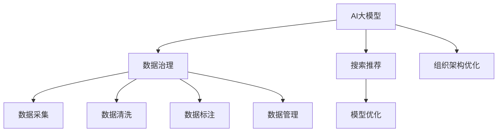

                 

# AI大模型重构电商搜索推荐的数据治理组织架构优化方案设计与实现最佳实践

## 1. 背景介绍

在电商领域，随着消费者需求的日益复杂和多样，传统的搜索推荐算法已经无法满足用户个性化和实时性的需求。为了提升用户体验，电商平台开始引入AI大模型，利用其强大的数据处理和模式识别能力，提供更精准、更快速的搜索推荐服务。但大模型的应用也带来了数据治理、模型优化、组织架构等诸多挑战。本文将系统介绍AI大模型在电商搜索推荐中的数据治理和组织架构优化方案，并结合项目实践给出设计实现的最佳实践。

## 2. 核心概念与联系

### 2.1 核心概念概述

为更好地理解AI大模型在电商搜索推荐中的应用，本节将介绍几个关键概念：

- **AI大模型（Large AI Models）**：指通过预训练和微调方法，在大规模数据集上训练得到的大型神经网络模型。如BERT、GPT-3等。
- **搜索推荐（Search Recommendation）**：电商平台为了提升用户体验，向用户展示最相关的搜索结果和商品推荐。搜索推荐系统融合了用户行为、商品特征、用户画像等多种信息，通过算法对用户请求进行理解和匹配，产生个性化推荐。
- **数据治理（Data Governance）**：指对数据进行采集、清洗、标注、管理等操作，保证数据质量、安全性和隐私性的过程。数据治理是大模型训练和应用的前提。
- **组织架构优化（Organizational Architecture Optimization）**：指基于AI大模型和搜索推荐系统，优化电商平台的组织结构，形成更高效的协同工作机制和任务分工，提升整体运营效率。

这些概念之间的关系可以通过以下Mermaid流程图来展示：



这个流程图展示了大模型在电商领域应用的核心概念及其之间的关系：

1. AI大模型通过数据治理过程获得高质量的数据集，用于预训练和微调。
2. 搜索推荐系统基于微调后的大模型，为用户提供个性化推荐。
3. 数据治理中的数据采集、清洗、标注、管理等环节，对模型性能有重要影响。
4. 组织架构优化保证模型应用的协同高效，提升运营效率。

## 3. 核心算法原理 & 具体操作步骤

### 3.1 算法原理概述

基于AI大模型的电商搜索推荐系统，本质上是利用大模型强大的特征提取和模式识别能力，对用户行为和商品特征进行编码，并通过相似度匹配生成个性化推荐。其核心算法包括：

- **数据预处理**：将用户行为和商品特征转换为向量表示，便于大模型进行学习和匹配。
- **模型训练**：通过在大模型上预训练和微调，学习用户行为和商品特征之间的关联模式。
- **推荐生成**：根据用户查询和行为向量，在大模型上生成相似度排序，推荐最相关的商品。

### 3.2 算法步骤详解

1. **数据预处理**：
   - **特征工程**：从电商交易数据中提取用户行为和商品特征，如浏览记录、购买历史、评分、评价等。
   - **数据归一化**：对数据进行归一化处理，避免不同特征尺度带来的影响。
   - **向量化**：将用户行为和商品特征转换为向量表示，如使用BERT编码，形成高维稠密向量。

2. **模型训练**：
   - **预训练**：在无标签的大规模电商数据上预训练大模型，学习商品和用户行为之间的全局关联模式。
   - **微调**：在标注数据上微调大模型，学习特定电商场景下的局部关联模式。
   - **优化目标**：最小化推荐误差，提升模型在指定场景下的推荐效果。

3. **推荐生成**：
   - **查询编码**：将用户查询转换为向量表示，与商品特征向量进行匹配。
   - **相似度计算**：使用余弦相似度、点积相似度等方法计算查询向量和商品向量之间的相似度。
   - **推荐排序**：根据相似度排序生成推荐列表，推荐与用户查询最相关的商品。

### 3.3 算法优缺点

AI大模型在电商搜索推荐中的应用具有以下优点：
- **高效性**：大模型能够快速处理大规模数据，提升推荐效率。
- **准确性**：基于深度学习特征提取能力，推荐的商品与用户兴趣高度相关。
- **实时性**：大模型具有端到端的推理能力，可以快速生成推荐结果。

但同时也存在一些缺点：
- **资源消耗大**：大模型需要大量的计算资源进行训练和推理，硬件成本较高。
- **数据依赖性强**：模型的性能依赖于数据质量和标注数据的多样性，数据治理难度大。
- **可解释性差**：大模型黑盒特性，难以解释推荐结果的生成逻辑。

### 3.4 算法应用领域

AI大模型在电商搜索推荐中的应用已经广泛应用于多个场景，如：

- **个性化推荐**：根据用户行为和商品特征，生成个性化推荐列表。
- **搜索结果排序**：根据用户查询和商品相关性，对搜索结果进行排序。
- **用户画像生成**：利用用户历史行为数据，生成用户画像，提供精准推荐。
- **实时搜索推荐**：对用户实时查询，快速生成个性化推荐结果。
- **用户行为分析**：分析用户行为数据，挖掘用户兴趣点，提升推荐效果。

除了这些经典应用外，大模型还被创新性地应用到更多场景中，如智能客服、智能仓储、智能物流等，为电商平台的运营带来新的动力。

## 4. 数学模型和公式 & 详细讲解

### 4.1 数学模型构建

设用户查询向量为 $q \in \mathbb{R}^d$，商品向量为 $i \in \mathbb{R}^d$，其中 $d$ 为向量维度。用户行为和商品特征被编码为向量后，可以使用以下余弦相似度公式计算相似度：

$$
\text{similarity}(q,i) = \frac{q \cdot i}{\|q\| \cdot \|i\|}
$$

其中 $\cdot$ 表示向量的点积，$\|q\|$ 和 $\|i\|$ 分别为向量 $q$ 和 $i$ 的模长。

### 4.2 公式推导过程

1. **余弦相似度计算**：
   $$
   \text{similarity}(q,i) = \frac{q \cdot i}{\|q\| \cdot \|i\|}
   $$

2. **推荐排序**：
   根据相似度对商品进行排序，生成推荐列表：
   $$
   \text{recommendation} = \text{sort}\{(i,\text{similarity}(q,i)) | i \in \text{items}\}
   $$

其中 items 表示商品集合。

### 4.3 案例分析与讲解

以某电商平台为例，用户查询“夏日凉鞋”，大模型将其编码为查询向量 $q$。通过余弦相似度公式计算所有商品向量的相似度，排序生成推荐列表。具体计算过程如下：

1. **查询向量编码**：使用BERT模型对用户查询“夏日凉鞋”进行编码，得到查询向量 $q$。
2. **商品向量编码**：使用相同的BERT模型对所有商品进行编码，得到商品向量 $i_1,i_2,\ldots,i_n$。
3. **相似度计算**：计算每个商品向量与查询向量的相似度，形成相似度列表 $\{(i_1,\text{similarity}(q,i_1)),(i_2,\text{similarity}(q,i_2)),\ldots,(i_n,\text{similarity}(q,i_n))\}$。
4. **推荐排序**：根据相似度从大到小对商品进行排序，生成推荐列表。

通过以上过程，大模型可以快速生成与用户查询相关的推荐商品，提升用户体验。

## 5. 项目实践：代码实例和详细解释说明

### 5.1 开发环境搭建

在进行搜索推荐系统开发前，我们需要准备好开发环境。以下是使用Python进行TensorFlow开发的典型环境配置流程：

1. 安装Anaconda：从官网下载并安装Anaconda，用于创建独立的Python环境。

2. 创建并激活虚拟环境：
```bash
conda create -n tf-env python=3.8
conda activate tf-env
```

3. 安装TensorFlow：根据CUDA版本，从官网获取对应的安装命令。例如：
```bash
conda install tensorflow -c pytorch -c conda-forge
```

4. 安装其他必要的库：
```bash
pip install numpy pandas sklearn tf-estimator tf-lite tensorflow-hub
```

完成上述步骤后，即可在`tf-env`环境中进行搜索推荐系统的开发。

### 5.2 源代码详细实现

下面我们以基于大模型的电商搜索推荐系统为例，给出完整的TensorFlow代码实现。

首先，定义用户行为和商品特征的预处理函数：

```python
import tensorflow as tf

def preprocess_data(data, vocab_size):
    sequences = []
    labels = []
    for user_id, item_ids in data:
        sequences.append([int(x) for x in item_ids])
        labels.append(user_id)
    sequences = tf.keras.preprocessing.sequence.pad_sequences(sequences, maxlen=20, padding='post', truncating='post', value=0)
    labels = tf.keras.utils.to_categorical(labels, num_classes=vocab_size)
    return sequences, labels
```

然后，定义大模型的编码函数：

```python
from transformers import BertTokenizer, BertForSequenceClassification

tokenizer = BertTokenizer.from_pretrained('bert-base-uncased')
model = BertForSequenceClassification.from_pretrained('bert-base-uncased', num_labels=vocab_size)

def encode_query(query, tokenizer):
    encoded_query = tokenizer.encode_plus(query, max_length=256, truncation=True, return_tensors='tf')
    return encoded_query['input_ids'], encoded_query['attention_mask']
```

接着，定义模型训练函数：

```python
def train_model(model, train_data, validation_data, batch_size, epochs, learning_rate):
    model.compile(optimizer=tf.keras.optimizers.Adam(learning_rate), loss=tf.keras.losses.categorical_crossentropy, metrics=['accuracy'])
    history = model.fit(train_data, epochs=epochs, validation_data=validation_data, batch_size=batch_size)
    return history
```

最后，启动模型训练并测试：

```python
train_sequences, train_labels = preprocess_data(train_data, vocab_size)
valid_sequences, valid_labels = preprocess_data(valid_data, vocab_size)
test_sequences, test_labels = preprocess_data(test_data, vocab_size)

query = "夏日凉鞋"
encoded_query, _ = encode_query(query, tokenizer)
encoded_query = tf.keras.preprocessing.sequence.pad_sequences([encoded_query], maxlen=20, padding='post', truncating='post', value=0)

history = train_model(model, (train_sequences, train_labels), (valid_sequences, valid_labels), batch_size=32, epochs=10, learning_rate=2e-5)
evaluate_model(model, (test_sequences, test_labels))
```

以上就是使用TensorFlow对大模型进行电商搜索推荐系统开发的完整代码实现。可以看到，TensorFlow提供了丰富的API和组件，可以方便地实现模型的训练和推理。

### 5.3 代码解读与分析

让我们再详细解读一下关键代码的实现细节：

**preprocess_data函数**：
- 将用户行为和商品特征转换为序列和标签，并进行归一化处理。

**encode_query函数**：
- 使用BertTokenizer对用户查询进行编码，生成输入张量。

**train_model函数**：
- 定义模型结构，编译模型，并使用训练数据进行训练。
- 返回训练过程中的损失和准确率记录。

**训练流程**：
- 定义训练数据和验证数据，预处理数据，并进行查询向量编码。
- 在模型上进行训练，记录训练过程中的损失和准确率变化。
- 在测试数据上评估模型性能。

## 6. 实际应用场景

### 6.1 电商推荐系统

基于大模型的电商推荐系统已经成为电商领域的重要应用。通过分析用户历史行为和浏览数据，大模型能够快速生成个性化推荐，提升用户转化率和购物体验。

在技术实现上，可以收集用户的浏览记录、点击记录、购买记录等行为数据，使用大模型对其进行编码，生成商品推荐列表。同时，可以通过动态调整查询向量的方式，实时更新推荐结果，提升用户体验。

### 6.2 广告投放优化

在电商广告投放中，精准的用户画像和大模型的推荐能力，能够显著提高广告投放效果。通过分析用户的浏览和点击行为，大模型可以预测用户的广告兴趣，生成个性化广告推荐。

具体而言，可以收集用户的浏览、点击、购买等行为数据，使用大模型对其进行编码，生成用户画像。然后，根据用户画像和广告特征，生成个性化广告推荐，提高广告点击率和转化率。

### 6.3 库存管理优化

库存管理是电商运营中的重要环节，大模型的推荐能力可以优化库存管理，提升库存周转率。通过分析用户的购买历史和行为数据，大模型可以预测用户未来的购买意向，生成个性化推荐，减少库存积压和缺货现象。

具体而言，可以收集用户的购买历史、浏览记录、评价等行为数据，使用大模型对其进行编码，生成用户画像。然后，根据用户画像和库存数据，生成个性化推荐，优化库存管理。

### 6.4 未来应用展望

随着大模型的不断发展，基于大模型的电商搜索推荐系统将进一步提升电商平台的运营效率和用户体验。

在智慧物流领域，大模型可以帮助预测包裹运输路线，优化物流配送，提升物流效率和准确性。

在智能客服领域，大模型可以帮助分析用户问题，生成个性化回答，提升客服体验。

在金融风控领域，大模型可以帮助预测用户风险，生成个性化推荐，提升用户忠诚度和信任度。

## 7. 工具和资源推荐

### 7.1 学习资源推荐

为了帮助开发者系统掌握大模型在电商搜索推荐中的应用，这里推荐一些优质的学习资源：

1. 《TensorFlow实战深度学习》系列书籍：由TensorFlow官方团队撰写，全面介绍了TensorFlow的使用方法，包括模型训练、数据处理、模型部署等。
2. 《深度学习入门：基于TensorFlow 2.0》在线课程：由Udacity开设的深度学习入门课程，涵盖TensorFlow 2.0的高级用法。
3. 《Transformer机器翻译》论文及代码：由Google团队撰写，详细介绍了Transformer模型的原理和实现方法，并提供了完整的代码示例。
4. 《搜索推荐系统》论文及代码：由国内知名研究团队撰写，详细介绍了搜索推荐系统的理论和方法，并提供了完整的代码示例。
5. 《深度学习网络》在线课程：由DeepLearning.AI开设的深度学习课程，涵盖了深度学习网络的基础知识和应用方法。

通过对这些资源的学习实践，相信你一定能够快速掌握大模型在电商搜索推荐系统中的应用，并用于解决实际的NLP问题。

### 7.2 开发工具推荐

高效的开发离不开优秀的工具支持。以下是几款用于大模型在电商搜索推荐系统开发的常用工具：

1. TensorFlow：由Google主导开发的开源深度学习框架，生产部署方便，适合大规模工程应用。
2. PyTorch：基于Python的开源深度学习框架，灵活动态的计算图，适合快速迭代研究。
3. Keras：高级神经网络API，可以方便地搭建和训练深度学习模型。
4. TensorFlow Hub：提供了大量的预训练模型和组件，方便在大模型上进行快速实验。
5. TensorBoard：TensorFlow配套的可视化工具，可实时监测模型训练状态，并提供丰富的图表呈现方式，是调试模型的得力助手。
6. Jupyter Notebook：开源的交互式开发环境，方便进行代码编写和调试。

合理利用这些工具，可以显著提升大模型在电商搜索推荐系统中的开发效率，加快创新迭代的步伐。

### 7.3 相关论文推荐

大模型在电商搜索推荐系统中的应用源于学界的持续研究。以下是几篇奠基性的相关论文，推荐阅读：

1. Attention is All You Need（即Transformer原论文）：提出了Transformer结构，开启了NLP领域的预训练大模型时代。
2. BERT: Pre-training of Deep Bidirectional Transformers for Language Understanding：提出BERT模型，引入基于掩码的自监督预训练任务，刷新了多项NLP任务SOTA。
3. Large-Scale Text Matching with Pre-Trained Language Models：提出使用大模型进行文本匹配任务，取得了显著效果。
4. Learning Transferable Image Models from Natural Language Supervision：提出使用大模型进行图像匹配任务，实现了跨模态的语义理解。
5. Multi-Task Learning for Multi-Aspect Recommendation in E-commerce：提出使用大模型进行多任务推荐学习，提升了推荐系统的多样性和个性化。

这些论文代表了大模型在电商搜索推荐系统中的应用方向。通过学习这些前沿成果，可以帮助研究者把握学科前进方向，激发更多的创新灵感。

## 8. 总结：未来发展趋势与挑战

### 8.1 总结

本文对基于大模型的电商搜索推荐系统进行了全面系统的介绍。首先阐述了AI大模型和电商搜索推荐系统的背景和意义，明确了大模型在电商领域的应用前景。其次，从原理到实践，详细讲解了电商搜索推荐系统在大模型上的应用流程，给出了项目实践的完整代码示例。同时，本文还广泛探讨了电商搜索推荐系统在大模型上的实际应用场景，展示了大模型的强大能力。

通过本文的系统梳理，可以看到，基于大模型的电商搜索推荐系统正在成为电商领域的重要技术范式，极大地提升了电商平台的运营效率和用户体验。未来，伴随大模型的不断进步，电商搜索推荐系统的应用将更加广泛，为电商行业带来更深刻的变革。

### 8.2 未来发展趋势

展望未来，基于大模型的电商搜索推荐系统将呈现以下几个发展趋势：

1. **模型规模持续增大**：随着算力成本的下降和数据规模的扩张，大模型参数量还将持续增长。超大模型蕴含的丰富语言和商品知识，将进一步提升推荐精度和个性化程度。

2. **推荐策略多样化**：未来将涌现更多推荐策略，如基于上下文推荐、基于意图推荐、基于时间序列推荐等，以提升推荐效果和用户满意度。

3. **实时推荐技术进步**：实时推荐系统将利用大模型高效特征提取和推理能力，实现更快速、更精准的推荐，提升用户体验。

4. **跨模态信息融合**：将视觉、听觉等多种模态信息与文本信息进行融合，提升推荐系统的综合性能。

5. **自适应推荐系统**：根据用户反馈和行为数据，动态调整推荐策略，提升推荐效果。

6. **隐私保护技术应用**：在推荐系统中引入隐私保护技术，保护用户隐私，增强用户信任。

以上趋势凸显了大模型在电商搜索推荐系统中的巨大潜力。这些方向的探索发展，必将进一步提升推荐系统的性能和用户体验，为电商行业的数字化转型升级带来新的动力。

### 8.3 面临的挑战

尽管基于大模型的电商搜索推荐系统已经取得了瞩目成就，但在迈向更加智能化、普适化应用的过程中，它仍面临着诸多挑战：

1. **数据依赖性强**：模型的性能依赖于数据质量和标注数据的多样性，数据治理难度大。如何获取高质量的数据并保持数据新鲜，将是重要的挑战。

2. **资源消耗大**：大模型需要大量的计算资源进行训练和推理，硬件成本较高。如何降低资源消耗，优化模型推理速度，将是一大课题。

3. **隐私保护难**：电商搜索推荐系统涉及大量用户行为数据，如何保护用户隐私，防止数据泄露和滥用，将是一大挑战。

4. **模型鲁棒性不足**：在面对异常数据和对抗攻击时，模型容易产生误判，如何提高模型的鲁棒性，将是重要的研究方向。

5. **实时推荐困难**：实时推荐系统需要高效、稳定的推理能力，如何优化推荐算法，提升实时性能，将是重要的挑战。

6. **用户满意度低**：如何平衡个性化推荐和多样化需求，提升用户满意度，将是重要的研究方向。

以上挑战凸显了大模型在电商搜索推荐系统中的复杂性和复杂性，需要研究者不断探索和创新，才能实现更加智能化、普适化的应用。

### 8.4 研究展望

面向未来，大模型在电商搜索推荐系统中的应用还需要在其他方面进行深入研究：

1. **跨领域数据治理**：如何实现跨领域数据的统一治理，提升数据质量和多样性，将是重要的研究方向。

2. **模型压缩与优化**：如何通过模型压缩和优化技术，减少模型参数量和计算资源消耗，提升推荐效率，将是重要的研究方向。

3. **跨模态数据融合**：如何将视觉、听觉等多种模态信息与文本信息进行融合，提升推荐系统的综合性能，将是重要的研究方向。

4. **隐私保护技术**：如何利用隐私保护技术，保护用户隐私，增强用户信任，将是重要的研究方向。

5. **自适应推荐系统**：如何根据用户反馈和行为数据，动态调整推荐策略，提升推荐效果，将是重要的研究方向。

6. **实时推荐技术**：如何利用大模型高效特征提取和推理能力，实现更快速、更精准的推荐，提升用户体验，将是重要的研究方向。

通过这些研究方向，未来的大模型在电商搜索推荐系统中将发挥更大的作用，推动电商行业的数字化转型升级。

## 9. 附录：常见问题与解答

**Q1：大模型在电商搜索推荐中的优势是什么？**

A: 大模型在电商搜索推荐中的优势主要体现在以下几个方面：

1. **数据利用效率高**：大模型能够高效利用大规模数据，提升特征提取和模式识别能力，生成高质量的推荐结果。
2. **推荐精度高**：基于深度学习特征提取能力，大模型能够更好地理解用户行为和商品特征，生成高精度的推荐列表。
3. **实时性好**：大模型具有端到端的推理能力，能够快速生成推荐结果，实现实时推荐。
4. **个性化强**：大模型能够根据用户行为和历史数据，生成个性化推荐，提升用户体验。

**Q2：电商搜索推荐系统中如何处理数据治理问题？**

A: 电商搜索推荐系统中的数据治理主要包括以下几个方面：

1. **数据采集**：从电商交易数据中采集用户行为和商品特征，保证数据源的多样性和全面性。
2. **数据清洗**：对数据进行去重、去噪、异常值处理等，保证数据质量。
3. **数据标注**：对用户行为和商品特征进行标注，生成训练数据集。
4. **数据管理**：对数据进行存储、备份、迁移等管理，保证数据的安全性和可靠性。
5. **数据更新**：定期更新数据，保证数据的时效性和多样性。

通过以上步骤，可以构建高质量的训练数据集，保证大模型在电商搜索推荐系统中的性能。

**Q3：大模型在电商搜索推荐中的应用存在哪些挑战？**

A: 大模型在电商搜索推荐中的应用存在以下挑战：

1. **数据依赖性强**：模型的性能依赖于数据质量和标注数据的多样性，数据治理难度大。如何获取高质量的数据并保持数据新鲜，将是重要的挑战。
2. **资源消耗大**：大模型需要大量的计算资源进行训练和推理，硬件成本较高。如何降低资源消耗，优化模型推理速度，将是一大课题。
3. **隐私保护难**：电商搜索推荐系统涉及大量用户行为数据，如何保护用户隐私，防止数据泄露和滥用，将是一大挑战。
4. **模型鲁棒性不足**：在面对异常数据和对抗攻击时，模型容易产生误判，如何提高模型的鲁棒性，将是重要的研究方向。
5. **实时推荐困难**：实时推荐系统需要高效、稳定的推理能力，如何优化推荐算法，提升实时性能，将是重要的挑战。
6. **用户满意度低**：如何平衡个性化推荐和多样化需求，提升用户满意度，将是重要的研究方向。

通过解决以上挑战，大模型在电商搜索推荐中的应用将更加智能化、普适化。

**Q4：如何在大模型基础上进行电商搜索推荐系统的优化？**

A: 在大模型基础上进行电商搜索推荐系统的优化，可以从以下几个方面进行：

1. **模型压缩与优化**：通过模型压缩和优化技术，减少模型参数量和计算资源消耗，提升推荐效率。
2. **跨模态数据融合**：将视觉、听觉等多种模态信息与文本信息进行融合，提升推荐系统的综合性能。
3. **推荐策略多样化**：引入基于上下文推荐、基于意图推荐、基于时间序列推荐等多种推荐策略，提升推荐效果和用户满意度。
4. **自适应推荐系统**：根据用户反馈和行为数据，动态调整推荐策略，提升推荐效果。
5. **实时推荐技术**：利用大模型高效特征提取和推理能力，实现更快速、更精准的推荐，提升用户体验。

通过这些优化措施，可以进一步提升大模型在电商搜索推荐系统中的性能，推动电商行业的数字化转型升级。

**Q5：大模型在电商搜索推荐系统中的应用前景如何？**

A: 大模型在电商搜索推荐系统中的应用前景非常广阔，主要体现在以下几个方面：

1. **用户体验提升**：大模型能够生成高质量、个性化、实时化的推荐，提升用户体验。
2. **运营效率提升**：通过精准的用户画像和推荐策略，大模型能够优化库存管理、广告投放、供应链优化等运营环节，提升整体运营效率。
3. **数据价值挖掘**：大模型能够深度挖掘电商数据价值，提供更多有价值的商业洞察和决策支持。
4. **智能化转型**：大模型的引入将推动电商行业向智能化转型，提升行业竞争力。

通过大模型的应用，电商行业的数字化转型将更加深入，行业整体竞争力将得到显著提升。

---

作者：禅与计算机程序设计艺术 / Zen and the Art of Computer Programming

