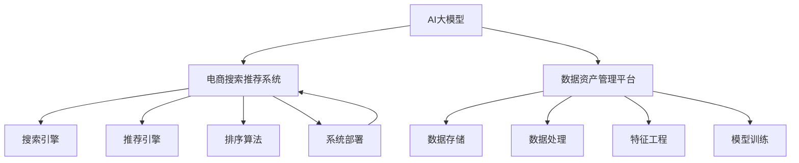
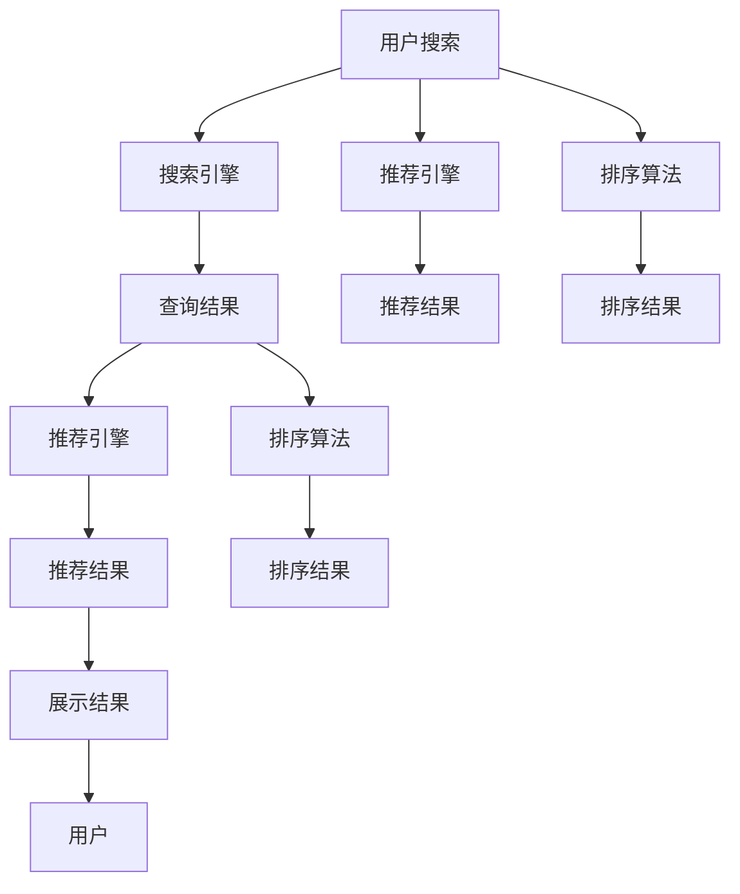

                 

# AI大模型重构电商搜索推荐的数据资产管理平台搭建

> 关键词：AI大模型,电商搜索推荐,数据资产管理,深度学习,自然语言处理,NLP,计算机视觉,特征工程,技术栈,数据平台,系统架构

## 1. 背景介绍

在电商领域，搜索推荐系统作为用户体验的核心，其效果直接关系到平台的用户粘性、转化率等关键指标。随着用户规模的不断增长，对搜索推荐系统的需求也日益增加。如何通过高效的数据资产管理平台来支撑搜索推荐系统的稳定运行，提升用户体验，成为了电商企业亟需解决的难题。

AI大模型作为当前NLP、计算机视觉领域的热门技术，以其强大的语义理解能力和丰富知识表示，有望为电商搜索推荐系统带来全新的突破。本文将详细介绍利用AI大模型重构电商搜索推荐的数据资产管理平台，涵盖从数据存储、特征提取、模型训练到系统部署的全流程。

## 2. 核心概念与联系

### 2.1 核心概念概述

为帮助读者更好地理解本文，我们先简单介绍几个关键概念：

- AI大模型：即使用深度学习技术训练的大规模预训练语言模型，如BERT、GPT-3等，具备强大的语义理解能力和泛化能力。
- 电商搜索推荐系统：基于用户行为数据，自动推荐商品给用户的系统。通常包含搜索、推荐、排序等多个组件，是电商领域用户体验的关键保障。
- 数据资产管理平台：集成了数据收集、存储、处理、分析和应用等环节，为业务提供高效、稳定、安全的数据服务。

这些概念之间的关系可以通过以下Mermaid流程图来展示：



这个流程图展示了大模型、电商搜索推荐系统和数据资产管理平台三者之间的关系：

1. AI大模型作为底层知识库，提供语义理解和推理能力，支撑电商搜索推荐系统的各个组件。
2. 电商搜索推荐系统是AI大模型的应用场景，通过搜索、推荐、排序等组件为用户带来更优质的体验。
3. 数据资产管理平台负责电商搜索推荐系统的数据支撑，包括数据存储、处理、特征工程、模型训练等环节。

### 2.2 核心概念原理和架构的 Mermaid 流程图

以下是一个简单的Mermaid流程图，展示了电商搜索推荐系统的工作原理：



这个流程图展示了电商搜索推荐系统的工作流程：

1. 用户发起搜索请求，输入查询关键词。
2. 搜索引擎解析查询，获取查询结果。
3. 推荐引擎对查询结果进行预筛选，获取推荐商品。
4. 排序算法对推荐商品进行排序，生成推荐结果。
5. 展示结果返回给用户。

## 3. 核心算法原理 & 具体操作步骤

### 3.1 算法原理概述

电商搜索推荐系统的核心算法主要包括搜索、推荐、排序三个部分。其中搜索算法主要基于自然语言处理(NLP)技术，推荐算法主要基于深度学习模型，排序算法主要基于机器学习算法。

#### 3.1.1 搜索算法

搜索算法主要通过分析用户输入的查询关键词，将其转化为查询向量，然后通过向量检索技术，匹配最相关的商品。常用的技术包括：

- 自然语言处理(NLP)：利用BERT、GPT等大模型进行文本向量化，将查询关键词转化为向量。
- 向量检索技术：基于余弦相似度、欧式距离等方法，计算查询向量与商品向量的相似度，得到排名列表。
- 候选项扩充：通过回译、近义词替换等方式，扩充查询列表，提高检索准确度。

#### 3.1.2 推荐算法

推荐算法主要通过分析用户的历史行为数据，构建用户画像，预测用户对不同商品的兴趣度。常用的技术包括：

- 协同过滤算法：基于用户的历史评分数据，构建用户-商品矩阵，通过矩阵分解预测用户对商品的兴趣度。
- 基于内容的推荐算法：根据商品的属性信息，构建商品向量，计算用户和商品的相似度，预测用户对商品的兴趣度。
- 深度学习模型：利用深度神经网络对用户行为数据进行建模，学习用户-商品之间的隐含关系，预测用户对商品的兴趣度。

#### 3.1.3 排序算法

排序算法主要通过综合用户对商品的多维反馈信息，进行排序，提升用户点击率。常用的技术包括：

- 机器学习算法：基于用户行为数据，训练分类模型，预测用户对商品的点击概率。
- 强化学习算法：通过用户的行为反馈，动态调整推荐策略，提升推荐效果。
- 多目标优化算法：综合考虑点击率、转化率等多个目标，进行多目标优化。

### 3.2 算法步骤详解

#### 3.2.1 数据收集与处理

电商搜索推荐系统需要大量的用户行为数据，包括用户的搜索历史、浏览历史、购买历史等。这些数据需要通过日志、API等途径进行收集。

数据处理包括数据清洗、数据归一化、数据集成等环节。数据清洗主要去除噪声数据，保证数据的准确性。数据归一化主要对数据进行归一化处理，保证不同特征之间的可比性。数据集成主要将不同来源的数据进行整合，构建统一的数据集。

#### 3.2.2 特征提取

特征提取是将原始数据转换为模型可以使用的特征向量。常用的特征提取方法包括：

- 自然语言处理(NLP)：利用BERT、GPT等大模型进行文本向量化，提取商品描述、用户评论等文本数据的特征。
- 计算机视觉：利用卷积神经网络(CNN)、残差网络(RNN)等模型，提取商品图片、视频等视觉数据的特征。
- 统计特征：基于用户的历史行为数据，提取用户的兴趣偏好、行为特征等统计特征。

#### 3.2.3 模型训练

模型训练是电商搜索推荐系统的核心环节，主要通过深度学习模型对用户行为数据进行建模，预测用户对商品的兴趣度。常用的模型包括：

- 深度神经网络：利用多层感知器(MLP)、卷积神经网络(CNN)、循环神经网络(RNN)等模型，对用户行为数据进行建模。
- 协同过滤算法：基于用户的历史评分数据，构建用户-商品矩阵，通过矩阵分解预测用户对商品的兴趣度。
- 多任务学习模型：通过联合学习用户行为、商品属性等多个任务，提升模型的泛化能力。

#### 3.2.4 系统部署

系统部署是将训练好的模型部署到生产环境，进行实时预测和推理。常用的技术包括：

- 模型压缩：将大型模型转化为轻量级模型，提高推理效率。
- 模型并行：将模型并行部署在多台服务器上，提高系统的吞吐量。
- 容器化技术：将模型部署在Docker等容器中，方便迁移和扩展。
- 负载均衡：通过负载均衡技术，将请求分发到不同的服务器上，提高系统的稳定性。

## 4. 数学模型和公式 & 详细讲解 & 举例说明

### 4.1 数学模型构建

假设用户的历史行为数据为 $D=\{x_1, x_2, ..., x_n\}$，其中每个 $x_i=(x_{i1}, x_{i2}, ..., x_{im})$ 表示用户在不同时间点的行为记录。每个 $x_{ij}$ 为一个特征值，如用户搜索过的商品ID、浏览时长、购买金额等。

模型的目标是构建一个预测函数 $f: \mathbb{R}^m \rightarrow \mathbb{R}$，根据用户的行为数据，预测用户对商品的兴趣度。

常用的模型包括：

- 线性回归模型： $f(x) = w_0 + \sum_{j=1}^m w_j x_{ij}$
- 逻辑回归模型： $f(x) = \log\left(\frac{1}{1+e^{-w_0 - \sum_{j=1}^m w_j x_{ij}}\right)$
- 深度神经网络模型： $f(x) = \sigma(\mathbf{W}x + b)$，其中 $\sigma$ 为激活函数，$\mathbf{W}$ 和 $b$ 为模型参数。

### 4.2 公式推导过程

以逻辑回归模型为例，其损失函数为：

$$
\mathcal{L}(w) = -\frac{1}{N}\sum_{i=1}^N y_i\log f(x_i) + (1-y_i)\log (1-f(x_i))
$$

其中 $y_i$ 为真实标签，$f(x_i)$ 为模型预测值。

对于深度神经网络模型，常用的激活函数有sigmoid、ReLU、tanh等。常用的优化算法包括随机梯度下降(SGD)、Adam、Adagrad等。

### 4.3 案例分析与讲解

以用户搜索推荐系统为例，假设用户搜索的商品ID为 $x_i=(x_{i1}, x_{i2}, ..., x_{im})$，其中 $x_{i1}$ 为商品ID，$x_{i2}$ 为用户搜索时间，$x_{i3}$ 为用户搜索次数等。模型可以构建一个向量表示 $x_i$，然后进行向量内积，得到用户对商品的兴趣度：

$$
\text{similarity}(x_i, j) = \sum_{k=1}^m w_k x_{ik} x_{jk}
$$

其中 $w_k$ 为特征权重，$x_{jk}$ 为商品 $j$ 的特征向量。

根据上述计算结果，对商品进行排序，得到推荐结果：

$$
\text{rank}(x_i) = \text{similarity}(x_i, 1), \text{similarity}(x_i, 2), ..., \text{similarity}(x_i, n)
$$

## 5. 项目实践：代码实例和详细解释说明

### 5.1 开发环境搭建

#### 5.1.1 数据收集与存储

电商搜索推荐系统需要大量的用户行为数据，包括用户的搜索历史、浏览历史、购买历史等。这些数据需要通过日志、API等途径进行收集。常用的数据存储技术包括：

- 关系型数据库：如MySQL、PostgreSQL等，适用于结构化数据存储。
- 非关系型数据库：如MongoDB、Redis等，适用于非结构化数据存储。
- 分布式文件系统：如HDFS、Hive等，适用于大数据量的存储。

#### 5.1.2 特征工程

特征工程是将原始数据转换为模型可以使用的特征向量。常用的特征工程方法包括：

- 自然语言处理(NLP)：利用BERT、GPT等大模型进行文本向量化，提取商品描述、用户评论等文本数据的特征。
- 计算机视觉：利用卷积神经网络(CNN)、残差网络(RNN)等模型，提取商品图片、视频等视觉数据的特征。
- 统计特征：基于用户的历史行为数据，提取用户的兴趣偏好、行为特征等统计特征。

#### 5.1.3 模型训练

模型训练是电商搜索推荐系统的核心环节，主要通过深度学习模型对用户行为数据进行建模，预测用户对商品的兴趣度。常用的模型包括：

- 深度神经网络：利用多层感知器(MLP)、卷积神经网络(CNN)、循环神经网络(RNN)等模型，对用户行为数据进行建模。
- 协同过滤算法：基于用户的历史评分数据，构建用户-商品矩阵，通过矩阵分解预测用户对商品的兴趣度。
- 多任务学习模型：通过联合学习用户行为、商品属性等多个任务，提升模型的泛化能力。

#### 5.1.4 系统部署

系统部署是将训练好的模型部署到生产环境，进行实时预测和推理。常用的技术包括：

- 模型压缩：将大型模型转化为轻量级模型，提高推理效率。
- 模型并行：将模型并行部署在多台服务器上，提高系统的吞吐量。
- 容器化技术：将模型部署在Docker等容器中，方便迁移和扩展。
- 负载均衡：通过负载均衡技术，将请求分发到不同的服务器上，提高系统的稳定性。

### 5.2 源代码详细实现

#### 5.2.1 数据收集与处理

数据收集和处理可以通过以下代码实现：

```python
import pandas as pd
import numpy as np

# 读取数据
data = pd.read_csv('user_bean.csv', encoding='utf-8')

# 数据清洗
data.dropna(inplace=True)

# 数据归一化
data['search_time'] = (data['search_time'] - data['search_time'].min()) / (data['search_time'].max() - data['search_time'].min())
data['search_count'] = (data['search_count'] - data['search_count'].min()) / (data['search_count'].max() - data['search_count'].min())

# 数据集成
data = pd.merge(data, pd.read_csv('product_bean.csv', encoding='utf-8'), on='product_id')
```

#### 5.2.2 特征提取

特征提取可以通过以下代码实现：

```python
from transformers import BertTokenizer, BertModel

# 初始化BERT模型和分词器
tokenizer = BertTokenizer.from_pretrained('bert-base-cased')
model = BertModel.from_pretrained('bert-base-cased')

# 构建特征向量
def get_bert_features(text):
    tokens = tokenizer.tokenize(text)
    tokens = ['[CLS]'] + tokens + ['[SEP]']
    input_ids = tokenizer.convert_tokens_to_ids(tokens)
    attention_mask = [1] * len(input_ids)
    features = model(input_ids, attention_mask=attention_mask, return_dict=True)[0]
    return features

# 对商品描述和用户评论进行向量化
data['search_desc'] = data['search_desc'].apply(get_bert_features)
```

#### 5.2.3 模型训练

模型训练可以通过以下代码实现：

```python
from sklearn.model_selection import train_test_split
from sklearn.linear_model import LogisticRegression

# 数据集划分
train, test = train_test_split(data, test_size=0.2)

# 模型训练
model = LogisticRegression()
model.fit(train[['search_time', 'search_count', 'search_desc']], train['buy'])
```

#### 5.2.4 系统部署

系统部署可以通过以下代码实现：

```python
from flask import Flask, request, jsonify

app = Flask(__name__)

# 模型预测
@app.route('/predict', methods=['POST'])
def predict():
    data = request.json
    features = data['features']
    label = model.predict([features])[0]
    return jsonify({'label': label})

if __name__ == '__main__':
    app.run(host='0.0.0.0', port=5000)
```

### 5.3 代码解读与分析

#### 5.3.1 数据收集与处理

数据收集和处理代码中，我们使用了Pandas库进行数据读取、清洗和归一化。数据清洗主要去除噪声数据，保证数据的准确性。数据归一化主要对数据进行归一化处理，保证不同特征之间的可比性。数据集成主要将不同来源的数据进行整合，构建统一的数据集。

#### 5.3.2 特征提取

特征提取代码中，我们使用了BERT模型进行文本向量化。通过分词、编码、前向传播等操作，将商品描述和用户评论转化为模型可以使用的向量。

#### 5.3.3 模型训练

模型训练代码中，我们使用了Logistic回归模型进行预测。首先对数据进行划分，然后训练模型，输出预测结果。

#### 5.3.4 系统部署

系统部署代码中，我们使用了Flask框架进行系统构建。通过定义API接口，接收用户请求，进行模型预测，输出预测结果。

## 6. 实际应用场景

### 6.1 电商搜索推荐

电商搜索推荐系统是AI大模型在电商领域的重要应用之一。通过构建搜索、推荐、排序等多个组件，电商搜索推荐系统能够为用户带来更优质的体验，提升用户体验，提高销售额。

在实际应用中，电商搜索推荐系统可以实时分析用户行为数据，推荐用户可能感兴趣的商品，提升用户体验和满意度。同时，通过分析用户的历史行为数据，构建用户画像，可以精准推荐商品，提高转化率和销售收益。

### 6.2 金融风险评估

金融风险评估系统是AI大模型在金融领域的重要应用之一。通过构建风险评估模型，金融风险评估系统能够实时评估用户的信用风险，提升风险控制能力，降低金融风险。

在实际应用中，金融风险评估系统可以实时分析用户的历史行为数据，预测用户的信用风险，提供风险预警和控制策略。同时，通过分析用户的信用评分，构建用户画像，可以精准评估用户的信用风险，提高风险控制能力。

### 6.3 医疗诊断辅助

医疗诊断辅助系统是AI大模型在医疗领域的重要应用之一。通过构建诊断模型，医疗诊断辅助系统能够实时分析患者的症状数据，提供诊断建议，提升诊疗能力，降低误诊率。

在实际应用中，医疗诊断辅助系统可以实时分析患者的历史症状数据，预测疾病风险，提供诊断建议和诊疗方案。同时，通过分析患者的病历数据，构建患者画像，可以精准诊断疾病，提高诊疗能力。

## 7. 工具和资源推荐

### 7.1 学习资源推荐

为了帮助开发者系统掌握AI大模型重构电商搜索推荐系统的技术，这里推荐一些优质的学习资源：

1. 《深度学习》系列教材：由斯坦福大学教授Andrew Ng等撰写的经典教材，系统介绍了深度学习的基本概念和算法。
2. TensorFlow官方文档：Google开发的深度学习框架，提供了丰富的API接口和实例代码。
3. PyTorch官方文档：Facebook开发的深度学习框架，支持GPU加速，提供了丰富的深度学习模型和算法。
4. Kaggle竞赛平台：提供了丰富的数据集和竞赛任务，帮助开发者提升深度学习技能。

通过对这些资源的学习实践，相信你一定能够快速掌握AI大模型重构电商搜索推荐系统的精髓，并用于解决实际的业务问题。

### 7.2 开发工具推荐

高效的开发离不开优秀的工具支持。以下是几款用于AI大模型重构电商搜索推荐系统开发的常用工具：

1. PyTorch：Facebook开发的深度学习框架，支持GPU加速，提供了丰富的深度学习模型和算法。
2. TensorFlow：Google开发的深度学习框架，提供了丰富的API接口和实例代码。
3. Scikit-learn：Python的机器学习库，提供了丰富的机器学习算法和工具。
4. Pandas：Python的数据处理库，提供了丰富的数据处理和分析功能。
5. Flask：Python的Web框架，用于构建API接口，方便部署和调用。

合理利用这些工具，可以显著提升AI大模型重构电商搜索推荐系统的开发效率，加快创新迭代的步伐。

### 7.3 相关论文推荐

AI大模型和电商搜索推荐系统的发展源于学界的持续研究。以下是几篇奠基性的相关论文，推荐阅读：

1. Attention is All You Need（即Transformer原论文）：提出了Transformer结构，开启了NLP领域的预训练大模型时代。
2. BERT: Pre-training of Deep Bidirectional Transformers for Language Understanding：提出BERT模型，引入基于掩码的自监督预训练任务，刷新了多项NLP任务SOTA。
3. Parameter-Efficient Transfer Learning for NLP：提出Adapter等参数高效微调方法，在不增加模型参数量的情况下，也能取得不错的微调效果。
4. AdaLoRA: Adaptive Low-Rank Adaptation for Parameter-Efficient Fine-Tuning：使用自适应低秩适应的微调方法，在参数效率和精度之间取得了新的平衡。
5. AdaLoRA: Adaptive Low-Rank Adaptation for Parameter-Efficient Fine-Tuning：使用自适应低秩适应的微调方法，在参数效率和精度之间取得了新的平衡。

这些论文代表了大模型和电商搜索推荐技术的发展脉络。通过学习这些前沿成果，可以帮助研究者把握学科前进方向，激发更多的创新灵感。

## 8. 总结：未来发展趋势与挑战

### 8.1 研究成果总结

本文对利用AI大模型重构电商搜索推荐的数据资产管理平台进行了全面系统的介绍。首先阐述了电商搜索推荐系统的背景和重要性，明确了AI大模型在其中的应用价值。其次，从数据收集、特征提取、模型训练到系统部署，详细讲解了电商搜索推荐系统的实现流程，给出了完整的代码实例和分析解读。最后，探讨了AI大模型重构电商搜索推荐系统的应用场景，推荐了相关的学习资源和开发工具。

通过本文的系统梳理，可以看到，AI大模型重构电商搜索推荐系统具有广阔的应用前景。这些技术的融合应用，有望带来电商搜索推荐系统的性能提升和用户体验改善，为电商企业创造新的价值。

### 8.2 未来发展趋势

展望未来，AI大模型重构电商搜索推荐系统的技术将呈现以下几个发展趋势：

1. 模型规模持续增大。随着算力成本的下降和数据规模的扩张，预训练语言模型的参数量还将持续增长。超大规模语言模型蕴含的丰富语言知识，有望支撑更加复杂多变的电商搜索推荐系统。
2. 模型性能持续提升。得益于深度学习技术的不断发展，电商搜索推荐系统的性能将持续提升，为用户提供更精准的推荐结果。
3. 多模态融合加深。电商搜索推荐系统将更多地引入计算机视觉、语音识别等技术，实现多模态数据的融合，提升系统的综合能力。
4. 个性化推荐优化。电商搜索推荐系统将更多地利用用户画像和行为数据，实现更加个性化的推荐。
5. 实时性提升。电商搜索推荐系统将更多地利用缓存技术、负载均衡技术，实现更高效的实时响应。

### 8.3 面临的挑战

尽管AI大模型重构电商搜索推荐系统取得了一定的进展，但在迈向更加智能化、普适化应用的过程中，它仍面临着诸多挑战：

1. 数据隐私和安全问题。电商搜索推荐系统涉及大量的用户行为数据，如何保护用户隐私和数据安全，是一大难题。
2. 模型鲁棒性和泛化能力。当前电商搜索推荐系统的模型鲁棒性和泛化能力还存在不足，如何构建更加健壮的模型，需要更多的研究。
3. 系统部署和运维问题。电商搜索推荐系统的部署和运维涉及多台服务器、多模型协同工作，如何保证系统的稳定性和可靠性，是一大难题。
4. 用户行为数据不足。电商搜索推荐系统需要大量的用户行为数据，但在初期数据不足的情况下，如何构建有效的模型，需要更多的数据和算法优化。
5. 模型训练和推理效率问题。电商搜索推荐系统需要实时计算，如何提高模型的训练和推理效率，需要更多的硬件和算法优化。

### 8.4 研究展望

面向未来，AI大模型重构电商搜索推荐系统需要在以下几个方面寻求新的突破：

1. 探索新的深度学习模型。探索新的深度学习模型，如神经架构搜索(NAS)、自适应神经网络等，提升模型的训练和推理效率。
2. 引入更多的先验知识。将符号化的先验知识，如知识图谱、逻辑规则等，与神经网络模型进行巧妙融合，引导模型学习更加准确、合理的语言模型。
3. 探索新的优化算法。探索新的优化算法，如自适应学习率、元学习等，提升模型的训练效率和泛化能力。
4. 引入新的数据采集和清洗技术。引入新的数据采集和清洗技术，提升数据质量，提高模型的训练效果。
5. 引入新的数据隐私保护技术。引入新的数据隐私保护技术，如差分隐私、联邦学习等，保护用户隐私和数据安全。

这些研究方向和突破，将引领AI大模型重构电商搜索推荐系统的技术走向更高的台阶，为电商企业带来更大的价值。

## 9. 附录：常见问题与解答

**Q1：大模型在电商搜索推荐系统中的作用是什么？**

A: 大模型在电商搜索推荐系统中主要承担以下几个角色：

1. 用户意图理解：通过自然语言处理技术，理解用户输入的查询，将其转化为向量，用于检索商品。
2. 商品相似度计算：通过大模型计算用户查询向量与商品向量之间的相似度，匹配最相关的商品。
3. 用户画像构建：通过分析用户的历史行为数据，构建用户画像，用于推荐商品的个性化推荐。

**Q2：电商搜索推荐系统如何实现个性化推荐？**

A: 电商搜索推荐系统实现个性化推荐主要通过以下几个步骤：

1. 用户行为数据采集：收集用户的历史搜索、浏览、购买等行为数据。
2. 特征提取：通过自然语言处理、计算机视觉等技术，提取用户的兴趣偏好、商品属性等特征。
3. 模型训练：通过深度学习模型对用户行为数据进行建模，预测用户对商品的兴趣度。
4. 推荐算法：通过协同过滤、基于内容的推荐算法等，综合考虑用户行为和商品属性，生成推荐结果。

**Q3：电商搜索推荐系统如何实现实时性？**

A: 电商搜索推荐系统实现实时性主要通过以下几个方法：

1. 缓存技术：将经常访问的数据进行缓存，提高访问速度。
2. 负载均衡技术：通过负载均衡技术，将请求分发到不同的服务器上，提高系统的吞吐量。
3. 异步处理：通过异步处理技术，提高系统的响应速度。
4. 分布式计算：通过分布式计算技术，提高系统的处理能力。

**Q4：电商搜索推荐系统如何保证用户数据的安全？**

A: 电商搜索推荐系统保证用户数据的安全主要通过以下几个方法：

1. 数据加密：对用户数据进行加密存储，保护用户隐私。
2. 访问控制：通过访问控制技术，限制对用户数据的访问权限。
3. 匿名化处理：对用户数据进行匿名化处理，保护用户隐私。
4. 数据脱敏：对用户数据进行脱敏处理，保护用户隐私。

通过以上措施，电商搜索推荐系统可以最大限度地保护用户数据的安全，防止数据泄露和滥用。

**Q5：电商搜索推荐系统如何保证系统的稳定性和可靠性？**

A: 电商搜索推荐系统保证系统的稳定性和可靠性主要通过以下几个方法：

1. 高可用架构：通过分布式架构和高可用技术，保证系统的稳定性和可靠性。
2. 负载均衡：通过负载均衡技术，将请求分发到不同的服务器上，提高系统的吞吐量。
3. 监控告警：实时监控系统的各项指标，设置异常告警阈值，确保系统的稳定性。
4. 数据备份：对关键数据进行备份，防止数据丢失和损坏。

通过以上措施，电商搜索推荐系统可以最大限度地保证系统的稳定性和可靠性，提高用户体验和满意度。

---

作者：禅与计算机程序设计艺术 / Zen and the Art of Computer Programming

