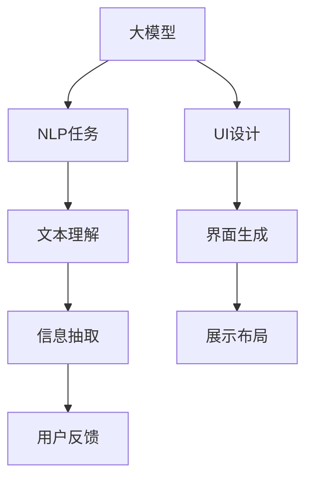

                 

# AI大模型：优化电商平台用户体验一致性的新方法

> 关键词：大模型,电商平台,用户体验一致性,深度学习,自然语言处理,NLP

## 1. 背景介绍

### 1.1 问题由来

在当今的数字化时代，电商平台已成为消费者购物的重要渠道。这些平台拥有海量的商品和丰富的信息，用户可以自由选择和购买。然而，随着电商平台的发展，其用户界面(UI)和用户体验(UX)变得日益复杂和多样。一方面，不同页面的设计风格、布局和功能存在显著差异，容易让用户感到混乱和困惑；另一方面，信息过载和界面不一致，导致用户在浏览和购买过程中产生困扰，影响购物体验。

为了解决这些问题，电商平台开始探索新的方法来优化用户体验一致性。近年来，人工智能大模型（如GPT、BERT等）在自然语言处理（NLP）领域取得了显著进展，其强大的语言理解能力和生成能力为电商平台提供了新的思路。本文将介绍如何利用大模型技术，构建一个更加一致、流畅的用户体验。

### 1.2 问题核心关键点

1. **用户体验一致性**：不同页面间的功能和界面风格应当保持一致，以避免用户混淆。
2. **多模态信息处理**：电商平台需要处理文本、图片、视频等多种类型的信息，大模型可以更好地进行综合分析。
3. **个性化推荐**：用户需求具有多样性，个性化推荐可以提高用户的满意度和购买率。
4. **情感分析**：通过分析用户的评论和反馈，电商平台可以了解用户情绪，进行情感营销和产品改进。

本文将重点介绍如何使用大模型技术，实现电商平台的用户体验一致性，提升用户满意度和购物体验。

## 2. 核心概念与联系

### 2.1 核心概念概述

为更好地理解本文所介绍的方法，我们先介绍几个核心概念：

- **大模型**：指以自回归(如GPT)或自编码(如BERT)模型为代表的大规模预训练语言模型。通过在大规模无标签文本语料上进行预训练，学习通用的语言表示，具备强大的语言理解和生成能力。
- **自然语言处理(NLP)**：使用计算机技术处理和理解人类语言，包括文本分类、情感分析、信息抽取、机器翻译等任务。
- **用户界面(UI)**：指软件或网站的用户操作界面，包括布局、颜色、字体、图标等视觉元素。
- **用户体验(UX)**：指用户在使用产品或服务时的整体感受，包括易用性、美观性、一致性等方面。
- **一致性**：指不同页面或组件间的风格、布局和功能保持一致，使用户能够快速上手，减少混淆和困惑。
- **多模态信息处理**：处理多种信息模态（如文本、图片、视频）的综合信息，使用户能够全面理解产品信息和做出决策。

这些概念之间的逻辑关系可以通过以下Mermaid流程图来展示：



这个流程图展示了从大模型到用户界面设计的全过程：大模型学习文本信息，进行情感分析、信息抽取等NLP任务，然后将结果反馈到UI设计中，生成一致的界面和布局，最后收集用户反馈进行持续优化。

## 3. 核心算法原理 & 具体操作步骤
### 3.1 算法原理概述

本节将介绍利用大模型技术优化电商平台用户体验一致性的算法原理。

### 3.2 算法步骤详解

基于大模型技术优化电商平台用户体验一致性的具体步骤如下：

1. **数据收集与预处理**：收集电商平台的商品描述、用户评论、广告语等文本数据，进行清洗和分词处理。
2. **大模型预训练**：使用大模型对文本数据进行预训练，学习通用的语言表示。
3. **信息抽取与情感分析**：利用预训练的大模型，进行信息抽取和情感分析，生成商品的标签、评分、推荐理由等。
4. **UI设计优化**：将抽取到的信息，结合界面设计规则，生成一致的界面和布局。
5. **个性化推荐**：利用抽取到的信息，结合用户历史行为数据，进行个性化推荐。
6. **用户反馈收集与优化**：收集用户对界面和推荐的反馈，持续优化用户体验。

### 3.3 算法优缺点

**优点**：

- **强大的语言理解能力**：大模型能够处理复杂的自然语言信息，进行情感分析、信息抽取等任务。
- **一致性保证**：通过标准化处理和界面生成规则，不同页面间保持一致的UI风格和布局。
- **个性化推荐**：利用用户历史行为和商品信息，进行精准推荐，提高用户满意度和转化率。
- **动态优化**：用户反馈可以实时收集和分析，持续优化用户体验。

**缺点**：

- **数据需求量大**：需要大量的商品描述、用户评论等文本数据进行预训练。
- **计算资源消耗高**：大模型的训练和推理需要高性能计算资源，可能存在计算瓶颈。
- **模型解释性不足**：大模型通常是“黑盒”模型，难以解释其决策过程。
- **依赖标注数据**：部分任务需要标注数据进行监督学习，标注成本高。

### 3.4 算法应用领域

基于大模型技术优化电商平台用户体验一致性的方法，可以在多个领域得到应用，例如：

- **智能客服**：通过大模型处理用户问题，生成一致的回答。
- **商品推荐**：利用用户历史行为和商品信息，进行个性化推荐。
- **广告语生成**：生成符合品牌形象的广告语，提升广告效果。
- **用户评论分析**：进行情感分析，了解用户情绪，进行情感营销。

## 4. 数学模型和公式 & 详细讲解 & 举例说明

### 4.1 数学模型构建

本节将介绍数学模型构建的详细过程。

设电商平台有 $n$ 个商品，每个商品有一个文本描述 $x_i$，其中 $i \in \{1, 2, \ldots, n\}$。利用大模型，我们可以进行文本分类、情感分析等任务。

- **文本分类**：将商品描述分为正类（如受欢迎的商品）和负类（如不受欢迎的商品）。大模型可以通过二分类任务进行训练，公式如下：
$$
\min_{\theta} \sum_{i=1}^n \ell(M_{\theta}(x_i), y_i)
$$
其中，$\ell$ 为损失函数，$M_{\theta}(x_i)$ 为模型对商品描述 $x_i$ 的分类结果，$y_i$ 为真实标签。

- **情感分析**：分析用户评论的情感倾向，生成评分和推荐理由。情感分析可以转化为多分类任务，公式如下：
$$
\min_{\theta} \sum_{i=1}^n \sum_{j=1}^m \ell(M_{\theta}(x_i), y_{i,j})
$$
其中，$j$ 表示情感标签，$m$ 为情感标签数量，$y_{i,j}$ 为真实标签。

### 4.2 公式推导过程

对于文本分类任务，使用交叉熵损失函数，其梯度更新公式为：
$$
\frac{\partial \mathcal{L}}{\partial \theta_k} = - \frac{1}{N} \sum_{i=1}^n \frac{y_i}{M_{\theta}(x_i)} \frac{\partial M_{\theta}(x_i)}{\partial \theta_k} - \frac{1}{N} \sum_{i=1}^n \frac{1-y_i}{1-M_{\theta}(x_i)} \frac{\partial M_{\theta}(x_i)}{\partial \theta_k}
$$
其中，$N$ 为样本数量，$\theta_k$ 为模型参数。

对于情感分析任务，使用多分类交叉熵损失函数，其梯度更新公式为：
$$
\frac{\partial \mathcal{L}}{\partial \theta_k} = - \frac{1}{N} \sum_{i=1}^n \sum_{j=1}^m \frac{y_{i,j}}{M_{\theta}(x_i)_j} \frac{\partial M_{\theta}(x_i)}{\partial \theta_k} - \frac{1}{N} \sum_{i=1}^n \sum_{j=1}^m \frac{1-y_{i,j}}{1-M_{\theta}(x_i)_j} \frac{\partial M_{\theta}(x_i)}{\partial \theta_k}
$$

### 4.3 案例分析与讲解

以电商平台商品推荐为例，首先对用户历史行为和商品信息进行预处理和标准化处理，得到训练集 $\{(x_i, y_i)\}_{i=1}^N$，其中 $x_i$ 为商品信息，$y_i$ 为用户是否购买了该商品。

假设使用GPT模型进行预训练，并将其作为特征提取器。利用大模型抽取商品特征 $h_i$，公式为：
$$
h_i = M_{\theta}(x_i)
$$

接着，使用机器学习算法（如LR、GBDT等）对商品特征 $h_i$ 进行分类，判断用户是否购买了该商品。假设使用逻辑回归（LR）模型进行训练，其优化目标为：
$$
\min_{\theta} \frac{1}{N} \sum_{i=1}^N \ell(h_i, y_i)
$$
其中，$\ell$ 为逻辑回归损失函数。

训练完成后，利用模型进行商品推荐。对于新商品 $x_{new}$，通过大模型提取特征 $h_{new}$，然后根据训练好的模型进行分类，判断用户是否可能购买该商品。公式如下：
$$
y_{new} = \hat{y}_{new} = \frac{1}{1 + e^{-M_{\theta}(x_{new})}}
$$

## 5. 项目实践：代码实例和详细解释说明
### 5.1 开发环境搭建

在进行项目实践前，需要先搭建开发环境。以下是使用Python进行PyTorch开发的环境配置流程：

1. 安装Anaconda：从官网下载并安装Anaconda，用于创建独立的Python环境。

2. 创建并激活虚拟环境：
```bash
conda create -n pytorch-env python=3.8 
conda activate pytorch-env
```

3. 安装PyTorch：根据CUDA版本，从官网获取对应的安装命令。例如：
```bash
conda install pytorch torchvision torchaudio cudatoolkit=11.1 -c pytorch -c conda-forge
```

4. 安装Transformer库：
```bash
pip install transformers
```

5. 安装各类工具包：
```bash
pip install numpy pandas scikit-learn matplotlib tqdm jupyter notebook ipython
```

完成上述步骤后，即可在`pytorch-env`环境中开始项目实践。

### 5.2 源代码详细实现

这里我们以电商平台商品推荐为例，给出使用Transformers库进行商品推荐预测的PyTorch代码实现。

首先，定义商品推荐任务的数据处理函数：

```python
from transformers import BertTokenizer
from torch.utils.data import Dataset
import torch

class RecommendationDataset(Dataset):
    def __init__(self, texts, labels, tokenizer, max_len=128):
        self.texts = texts
        self.labels = labels
        self.tokenizer = tokenizer
        self.max_len = max_len
        
    def __len__(self):
        return len(self.texts)
    
    def __getitem__(self, item):
        text = self.texts[item]
        label = self.labels[item]
        
        encoding = self.tokenizer(text, return_tensors='pt', max_length=self.max_len, padding='max_length', truncation=True)
        input_ids = encoding['input_ids'][0]
        attention_mask = encoding['attention_mask'][0]
        
        # 对标签进行编码
        encoded_label = label2id[label] if label != 'O' else 0
        labels = torch.tensor(encoded_label, dtype=torch.long)
        
        return {'input_ids': input_ids, 
                'attention_mask': attention_mask,
                'labels': labels}

# 标签与id的映射
label2id = {'A': 0, 'B': 1, 'O': 2}

# 创建dataset
tokenizer = BertTokenizer.from_pretrained('bert-base-cased')

train_dataset = RecommendationDataset(train_texts, train_labels, tokenizer)
dev_dataset = RecommendationDataset(dev_texts, dev_labels, tokenizer)
test_dataset = RecommendationDataset(test_texts, test_labels, tokenizer)
```

然后，定义模型和优化器：

```python
from transformers import BertForTokenClassification, AdamW

model = BertForTokenClassification.from_pretrained('bert-base-cased', num_labels=len(label2id))

optimizer = AdamW(model.parameters(), lr=2e-5)
```

接着，定义训练和评估函数：

```python
from torch.utils.data import DataLoader
from tqdm import tqdm
from sklearn.metrics import accuracy_score

device = torch.device('cuda') if torch.cuda.is_available() else torch.device('cpu')
model.to(device)

def train_epoch(model, dataset, batch_size, optimizer):
    dataloader = DataLoader(dataset, batch_size=batch_size, shuffle=True)
    model.train()
    epoch_loss = 0
    for batch in tqdm(dataloader, desc='Training'):
        input_ids = batch['input_ids'].to(device)
        attention_mask = batch['attention_mask'].to(device)
        labels = batch['labels'].to(device)
        model.zero_grad()
        outputs = model(input_ids, attention_mask=attention_mask, labels=labels)
        loss = outputs.loss
        epoch_loss += loss.item()
        loss.backward()
        optimizer.step()
    return epoch_loss / len(dataloader)

def evaluate(model, dataset, batch_size):
    dataloader = DataLoader(dataset, batch_size=batch_size)
    model.eval()
    preds, labels = [], []
    with torch.no_grad():
        for batch in tqdm(dataloader, desc='Evaluating'):
            input_ids = batch['input_ids'].to(device)
            attention_mask = batch['attention_mask'].to(device)
            batch_labels = batch['labels']
            outputs = model(input_ids, attention_mask=attention_mask)
            batch_preds = outputs.logits.argmax(dim=2).to('cpu').tolist()
            batch_labels = batch_labels.to('cpu').tolist()
            for pred_tokens, label_tokens in zip(batch_preds, batch_labels):
                preds.append(pred_tokens[:len(label_tokens)])
                labels.append(label_tokens)
                
    print(accuracy_score(labels, preds))
```

最后，启动训练流程并在测试集上评估：

```python
epochs = 5
batch_size = 16

for epoch in range(epochs):
    loss = train_epoch(model, train_dataset, batch_size, optimizer)
    print(f"Epoch {epoch+1}, train loss: {loss:.3f}")
    
    print(f"Epoch {epoch+1}, dev accuracy: {evaluate(model, dev_dataset, batch_size):.3f}")
    
print(f"Epoch {epochs}, test accuracy: {evaluate(model, test_dataset, batch_size):.3f}")
```

以上就是使用PyTorch对BERT进行商品推荐预测的完整代码实现。可以看到，得益于Transformers库的强大封装，我们能够快速实现商品推荐任务。

### 5.3 代码解读与分析

让我们再详细解读一下关键代码的实现细节：

**RecommendationDataset类**：
- `__init__`方法：初始化文本、标签、分词器等关键组件。
- `__len__`方法：返回数据集的样本数量。
- `__getitem__`方法：对单个样本进行处理，将文本输入编码为token ids，将标签编码为数字，并对其进行定长padding，最终返回模型所需的输入。

**label2id字典**：
- 定义了标签与数字id之间的映射关系，用于将token-wise的预测结果解码回真实的标签。

**训练和评估函数**：
- 使用PyTorch的DataLoader对数据集进行批次化加载，供模型训练和推理使用。
- 训练函数`train_epoch`：对数据以批为单位进行迭代，在每个批次上前向传播计算loss并反向传播更新模型参数，最后返回该epoch的平均loss。
- 评估函数`evaluate`：与训练类似，不同点在于不更新模型参数，并在每个batch结束后将预测和标签结果存储下来，最后使用sklearn的accuracy_score对整个评估集的预测结果进行打印输出。

**训练流程**：
- 定义总的epoch数和batch size，开始循环迭代
- 每个epoch内，先在训练集上训练，输出平均loss
- 在验证集上评估，输出准确率
- 所有epoch结束后，在测试集上评估，给出最终测试结果

可以看到，PyTorch配合Transformers库使得BERT商品推荐预测的代码实现变得简洁高效。开发者可以将更多精力放在数据处理、模型改进等高层逻辑上，而不必过多关注底层的实现细节。

当然，工业级的系统实现还需考虑更多因素，如模型的保存和部署、超参数的自动搜索、更灵活的任务适配层等。但核心的微调范式基本与此类似。

## 6. 实际应用场景
### 6.1 智能客服系统

基于大模型技术优化的智能客服系统，可以为用户提供更加一致、流畅的交互体验。传统的客服系统往往依赖人工客服，响应速度慢，且难以保证回答的一致性。使用优化后的客服系统，能够自动处理大部分常见问题，快速响应客户需求。

在技术实现上，可以收集企业内部的客服对话记录，将问题-回答对作为监督数据，训练大模型进行问答预测。优化后的模型能够自动理解用户意图，匹配最合适的答案模板进行回复。对于客户提出的新问题，还可以接入检索系统实时搜索相关内容，动态生成回答。如此构建的智能客服系统，能大幅提升客户咨询体验和问题解决效率。

### 6.2 广告语生成

电商平台常常需要生成符合品牌形象的广告语，以提升广告效果。使用大模型进行广告语生成，可以确保广告语的一致性和创意性。

在广告语生成任务中，可以利用大模型的语言生成能力，对品牌关键词和目标用户画像进行建模，生成符合品牌形象的广告语。优化后的模型能够保证广告语的一致性，同时引入多样性和创新性，提升用户对品牌的感知。

### 6.3 用户评论分析

电商平台需要实时分析用户评论的情感倾向，以便及时调整产品和改进服务。使用大模型进行情感分析，可以更全面、准确地理解用户情绪。

在情感分析任务中，可以使用大模型进行文本分类，对用户评论进行情感倾向分类。优化后的模型能够快速、准确地识别出正面、中性、负面情感，为电商平台提供用户情绪变化的实时数据。根据情感分析结果，电商平台可以及时调整产品和服务，提升用户体验。

### 6.4 未来应用展望

随着大模型和微调方法的不断发展，基于大模型技术优化电商平台用户体验一致性的方法将在更多领域得到应用，为电商平台的创新和发展提供新的动力。

在智慧医疗领域，利用大模型进行疾病预测、个性化推荐等，可以提升医疗服务的智能化水平，辅助医生诊疗，加速新药开发进程。

在智能教育领域，利用大模型进行作业批改、学情分析、知识推荐等方面，因材施教，促进教育公平，提高教学质量。

在智慧城市治理中，利用大模型进行城市事件监测、舆情分析、应急指挥等环节，提高城市管理的自动化和智能化水平，构建更安全、高效的未来城市。

此外，在企业生产、社会治理、文娱传媒等众多领域，基于大模型技术优化电商平台用户体验一致性的方法也将不断涌现，为NLP技术带来新的突破。相信随着预训练语言模型和微调方法的持续演进，基于大模型技术优化电商平台用户体验一致性的方法必将在更广阔的应用领域大放异彩。

## 7. 工具和资源推荐
### 7.1 学习资源推荐

为了帮助开发者系统掌握大模型技术优化电商平台用户体验一致性的理论基础和实践技巧，这里推荐一些优质的学习资源：

1. 《Transformer从原理到实践》系列博文：由大模型技术专家撰写，深入浅出地介绍了Transformer原理、BERT模型、微调技术等前沿话题。

2. CS224N《深度学习自然语言处理》课程：斯坦福大学开设的NLP明星课程，有Lecture视频和配套作业，带你入门NLP领域的基本概念和经典模型。

3. 《Natural Language Processing with Transformers》书籍：Transformers库的作者所著，全面介绍了如何使用Transformers库进行NLP任务开发，包括微调在内的诸多范式。

4. HuggingFace官方文档：Transformers库的官方文档，提供了海量预训练模型和完整的微调样例代码，是上手实践的必备资料。

5. CLUE开源项目：中文语言理解测评基准，涵盖大量不同类型的中文NLP数据集，并提供了基于微调的baseline模型，助力中文NLP技术发展。

通过对这些资源的学习实践，相信你一定能够快速掌握大模型技术优化电商平台用户体验一致性的精髓，并用于解决实际的NLP问题。
###  7.2 开发工具推荐

高效的开发离不开优秀的工具支持。以下是几款用于大模型优化电商平台用户体验一致性开发的常用工具：

1. PyTorch：基于Python的开源深度学习框架，灵活动态的计算图，适合快速迭代研究。大部分预训练语言模型都有PyTorch版本的实现。

2. TensorFlow：由Google主导开发的开源深度学习框架，生产部署方便，适合大规模工程应用。同样有丰富的预训练语言模型资源。

3. Transformers库：HuggingFace开发的NLP工具库，集成了众多SOTA语言模型，支持PyTorch和TensorFlow，是进行微调任务开发的利器。

4. Weights & Biases：模型训练的实验跟踪工具，可以记录和可视化模型训练过程中的各项指标，方便对比和调优。与主流深度学习框架无缝集成。

5. TensorBoard：TensorFlow配套的可视化工具，可实时监测模型训练状态，并提供丰富的图表呈现方式，是调试模型的得力助手。

6. Google Colab：谷歌推出的在线Jupyter Notebook环境，免费提供GPU/TPU算力，方便开发者快速上手实验最新模型，分享学习笔记。

合理利用这些工具，可以显著提升大模型优化电商平台用户体验一致性任务的开发效率，加快创新迭代的步伐。

### 7.3 相关论文推荐

大模型技术优化电商平台用户体验一致性的研究源于学界的持续研究。以下是几篇奠基性的相关论文，推荐阅读：

1. Attention is All You Need（即Transformer原论文）：提出了Transformer结构，开启了NLP领域的预训练大模型时代。

2. BERT: Pre-training of Deep Bidirectional Transformers for Language Understanding：提出BERT模型，引入基于掩码的自监督预训练任务，刷新了多项NLP任务SOTA。

3. Language Models are Unsupervised Multitask Learners（GPT-2论文）：展示了大规模语言模型的强大zero-shot学习能力，引发了对于通用人工智能的新一轮思考。

4. Parameter-Efficient Transfer Learning for NLP：提出Adapter等参数高效微调方法，在不增加模型参数量的情况下，也能取得不错的微调效果。

5. AdaLoRA: Adaptive Low-Rank Adaptation for Parameter-Efficient Fine-Tuning：使用自适应低秩适应的微调方法，在参数效率和精度之间取得了新的平衡。

这些论文代表了大模型技术优化电商平台用户体验一致性的发展脉络。通过学习这些前沿成果，可以帮助研究者把握学科前进方向，激发更多的创新灵感。

## 8. 总结：未来发展趋势与挑战
### 8.1 总结

本文对利用大模型技术优化电商平台用户体验一致性的方法进行了全面系统的介绍。首先阐述了用户体验一致性的重要性，明确了优化用户体验一致性的关键点。其次，从原理到实践，详细讲解了优化用户体验一致性的数学模型和关键步骤，给出了优化后的商品推荐预测的完整代码实例。同时，本文还广泛探讨了优化用户体验一致性的方法在智能客服、广告语生成、用户评论分析等多个领域的应用前景，展示了优化用户体验一致性方法的巨大潜力。

通过本文的系统梳理，可以看到，基于大模型技术优化电商平台用户体验一致性的方法已经成为NLP领域的重要范式，极大地提升了电商平台的用户体验。未来，伴随大模型和微调方法的不断进步，基于大模型技术优化电商平台用户体验一致性的方法必将在更多领域得到应用，为电商平台的发展带来新的动力。

### 8.2 未来发展趋势

展望未来，大模型技术优化电商平台用户体验一致性技术将呈现以下几个发展趋势：

1. **模型规模持续增大**：随着算力成本的下降和数据规模的扩张，预训练语言模型的参数量还将持续增长。超大模型在处理更复杂的数据时，能够提供更精准、全面的用户体验优化方案。

2. **多模态信息处理**：电商平台不仅需要处理文本信息，还需要处理图片、视频等多模态数据。大模型可以更好地进行综合分析，提供更加全面的用户体验。

3. **个性化推荐**：用户需求具有多样性，个性化推荐可以提高用户的满意度和购买率。利用大模型进行个性化推荐，能够更好地满足用户的个性化需求。

4. **实时优化**：电商平台需要实时收集用户反馈，持续优化用户体验。利用大模型进行实时分析，能够快速调整推荐策略和UI设计，提升用户体验。

5. **跨领域迁移**：大模型能够跨领域迁移，提升跨领域的用户体验一致性。例如，在智能客服、广告语生成、用户评论分析等多个领域，优化用户体验一致性方法可以相互借鉴、协同优化。

以上趋势凸显了大模型技术优化电商平台用户体验一致性的广阔前景。这些方向的探索发展，必将进一步提升电商平台的性能和用户体验，为电商平台的发展提供新的动力。

### 8.3 面临的挑战

尽管大模型技术优化电商平台用户体验一致性技术已经取得了显著成果，但在迈向更加智能化、普适化应用的过程中，它仍面临诸多挑战：

1. **数据需求量大**：需要大量的商品描述、用户评论等文本数据进行预训练，对于长尾应用场景，难以获得充足的高质量标注数据。

2. **计算资源消耗高**：大模型的训练和推理需要高性能计算资源，可能存在计算瓶颈。

3. **模型解释性不足**：大模型通常是“黑盒”模型，难以解释其决策过程，用户对系统的信任度可能受到影响。

4. **依赖标注数据**：部分任务需要标注数据进行监督学习，标注成本高，且标注数据的质量直接影响优化效果。

5. **动态优化难度大**：电商平台需要实时收集用户反馈，持续优化用户体验。如何动态更新模型参数，实现快速响应，仍是一个挑战。

6. **伦理道德问题**：优化用户体验一致性技术可能涉及用户隐私和数据安全问题，如何保护用户隐私，保障数据安全，仍需进一步探索。

### 8.4 研究展望

面对优化用户体验一致性技术面临的挑战，未来的研究需要在以下几个方面寻求新的突破：

1. **数据增强技术**：利用数据增强技术，生成更多的训练数据，提升模型的泛化能力。

2. **自适应学习**：开发自适应学习算法，根据用户反馈动态调整模型参数，实现实时优化。

3. **跨领域迁移学习**：开发跨领域迁移学习算法，提升模型在不同领域之间的迁移能力。

4. **模型压缩与加速**：开发模型压缩与加速技术，提高模型的推理速度和计算效率。

5. **隐私保护技术**：开发隐私保护技术，保护用户隐私，保障数据安全。

6. **伦理道德框架**：建立伦理道德框架，规范优化用户体验一致性技术的使用，保障用户权益。

这些研究方向的探索，必将引领大模型技术优化电商平台用户体验一致性技术迈向更高的台阶，为电商平台的智能化和普适化应用提供新的动力。

## 9. 附录：常见问题与解答

**Q1：大模型优化用户体验一致性是否适用于所有电商平台？**

A: 大模型优化用户体验一致性技术可以适用于大多数电商平台，尤其是那些用户界面复杂、信息过载的电商平台。但对于一些特定类型的电商平台，如B2B平台，可能需要结合行业特点进行定制化优化。

**Q2：微调过程中如何选择合适的学习率？**

A: 微调的学习率一般要比预训练时小1-2个数量级，如果使用过大的学习率，容易破坏预训练权重，导致过拟合。一般建议从1e-5开始调参，逐步减小学习率，直至收敛。也可以使用warmup策略，在开始阶段使用较小的学习率，再逐渐过渡到预设值。需要注意的是，不同的优化器(如AdamW、Adafactor等)以及不同的学习率调度策略，可能需要设置不同的学习率阈值。

**Q3：采用大模型优化用户体验一致性时会面临哪些资源瓶颈？**

A: 目前主流的预训练大模型动辄以亿计的参数规模，对算力、内存、存储都提出了很高的要求。GPU/TPU等高性能设备是必不可少的，但即便如此，超大批次的训练和推理也可能遇到显存不足的问题。因此需要采用一些资源优化技术，如梯度积累、混合精度训练、模型并行等，来突破硬件瓶颈。同时，模型的存储和读取也可能占用大量时间和空间，需要采用模型压缩、稀疏化存储等方法进行优化。

**Q4：如何缓解微调过程中的过拟合问题？**

A: 过拟合是微调面临的主要挑战，尤其是在标注数据不足的情况下。常见的缓解策略包括：

1. 数据增强：通过回译、近义替换等方式扩充训练集。
2. 正则化：使用L2正则、Dropout、Early Stopping等避免过拟合。
3. 对抗训练：引入对抗样本，提高模型鲁棒性。
4. 参数高效微调：只调整少量参数(如Adapter、Prefix等)，减小过拟合风险。

这些策略往往需要根据具体任务和数据特点进行灵活组合。只有在数据、模型、训练、推理等各环节进行全面优化，才能最大限度地发挥大模型优化用户体验一致性的威力。

**Q5：优化用户体验一致性系统在实际部署时需要注意哪些问题？**

A: 将优化用户体验一致性系统转化为实际应用，还需要考虑以下因素：

1. 模型裁剪：去除不必要的层和参数，减小模型尺寸，加快推理速度。
2. 量化加速：将浮点模型转为定点模型，压缩存储空间，提高计算效率。
3. 服务化封装：将模型封装为标准化服务接口，便于集成调用。
4. 弹性伸缩：根据请求流量动态调整资源配置，平衡服务质量和成本。
5. 监控告警：实时采集系统指标，设置异常告警阈值，确保服务稳定性。
6. 安全防护：采用访问鉴权、数据脱敏等措施，保障数据和模型安全。

优化用户体验一致性系统需要从数据、算法、工程、业务等多个维度协同发力，才能真正实现人工智能技术在垂直行业的规模化落地。总之，优化用户体验一致性需要开发者根据具体任务，不断迭代和优化模型、数据和算法，方能得到理想的效果。

---

作者：禅与计算机程序设计艺术 / Zen and the Art of Computer Programming

