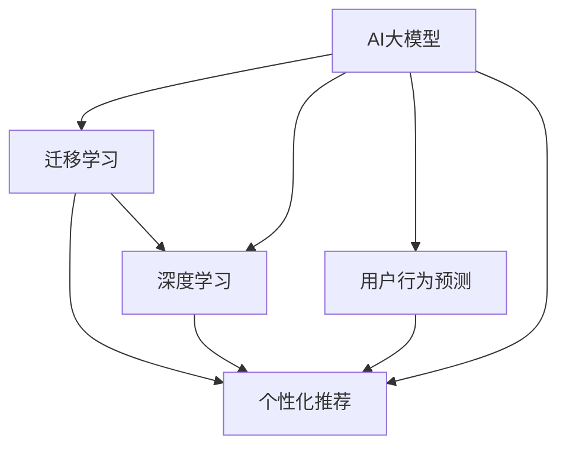

                 

# AI大模型：改善电商平台冷启动问题的新思路

> 关键词：AI大模型,电商平台,冷启动,推荐系统,用户行为预测,迁移学习,深度学习

## 1. 背景介绍

### 1.1 问题由来
电商平台如亚马逊、淘宝等在快速发展的初期，面临的一大难题就是“冷启动问题”。在用户和商品数据未积累到足够数量时，无法有效地推荐个性化商品，导致用户体验较差，平台流失率较高。以亚马逊为例，在1996年成立初期，由于用户数量和商品种类较少，推荐系统无法发挥出预期作用，直接影响了用户的购物体验。

冷启动问题不仅存在于新电商平台，即使是成熟平台的冷启动阶段，如新产品、新用户、新市场，都会遇到相似的问题。在传统机器学习范式下，由于缺乏用户行为数据，无法进行有效的用户行为预测和个性化推荐，导致用户体验和平台转化率低下。因此，如何在新平台或新市场初期，有效利用有限的数据进行推荐，成为电商平台亟需解决的难题。

## 2. 核心概念与联系

### 2.1 核心概念概述

为更好地理解如何利用AI大模型改善电商平台冷启动问题，本节将介绍几个密切相关的核心概念：

- AI大模型：以深度学习模型为代表的、具有强大预测能力和泛化能力的通用模型。通过在大规模数据集上进行预训练，学习到丰富的知识表示，可以应用于各种任务。
- 冷启动问题：在用户或商品数据不足时，推荐系统无法生成个性化推荐，导致用户体验差，流失率增加。
- 迁移学习：将在一个领域学到的知识迁移到另一个相关领域中，以提升模型的性能。
- 深度学习：一种基于神经网络结构的机器学习方法，通过多层次的非线性变换，可以自动发现数据中的复杂关系。
- 用户行为预测：通过分析用户行为数据，预测用户未来的行为，以生成个性化推荐。
- 个性化推荐：根据用户的历史行为和偏好，生成符合用户需求的推荐结果。

这些核心概念之间的逻辑关系可以通过以下Mermaid流程图来展示：



这个流程图展示了大模型与冷启动问题解决的路径：

1. 利用AI大模型进行预训练，学习通用的知识表示。
2. 通过迁移学习，将预训练的知识迁移到电商推荐任务上。
3. 利用深度学习，通过多层次的特征提取和关系建模，提升推荐系统的性能。
4. 结合用户行为预测，生成更加精准的个性化推荐。

## 3. 核心算法原理 & 具体操作步骤

### 3.1 算法原理概述

利用AI大模型改善电商平台冷启动问题，主要基于以下算法原理：

1. **预训练**：在大规模数据集上训练AI大模型，学习到通用的知识表示。
2. **迁移学习**：将预训练的知识迁移到电商推荐任务中，提升模型的性能。
3. **深度学习**：通过多层次的特征提取和关系建模，提升推荐系统的精准度。
4. **用户行为预测**：结合用户的历史行为数据，预测用户未来的行为，生成个性化推荐。

通过这些原理，可以有效利用有限的数据生成高质量的推荐结果，改善电商平台的冷启动问题。

### 3.2 算法步骤详解

基于上述算法原理，电商平台的冷启动问题解决步骤如下：

1. **收集数据**：收集电商平台上的用户行为数据、商品信息等，用于训练模型。
2. **预训练模型**：使用大规模数据集对AI大模型进行预训练，学习到通用的知识表示。
3. **迁移学习**：将预训练的知识迁移到电商推荐任务中，生成推荐模型。
4. **深度学习**：通过多层次的特征提取和关系建模，提升推荐模型的性能。
5. **用户行为预测**：结合用户的历史行为数据，预测用户未来的行为，生成个性化推荐。
6. **模型评估**：对推荐模型进行评估，调整模型参数，提升推荐效果。

### 3.3 算法优缺点

利用AI大模型改善电商平台冷启动问题的方法，具有以下优点：

- **高效性**：利用大规模数据集进行预训练，可以学习到丰富的知识表示，提升推荐系统的性能。
- **通用性**：AI大模型可以应用于各种任务，具有较强的泛化能力。
- **可扩展性**：通过迁移学习，可以方便地将知识迁移到电商推荐任务中。

同时，该方法也存在一定的局限性：

- **数据依赖性**：模型性能受限于数据质量和数量，数据不足时无法有效提升推荐效果。
- **计算资源需求高**：预训练和深度学习模型需要大量的计算资源，对硬件要求较高。
- **过拟合风险**：在数据不足的情况下，容易发生过拟合，导致推荐效果下降。

### 3.4 算法应用领域

AI大模型改善电商平台冷启动问题的方法，广泛应用于以下几个领域：

- **个性化推荐**：根据用户的历史行为和偏好，生成符合用户需求的推荐结果，提升用户购物体验。
- **用户行为预测**：预测用户未来的行为，如购买、浏览、收藏等，用于生成个性化推荐。
- **商品特征提取**：提取商品的特征，如属性、价格、类别等，用于生成推荐结果。
- **用户画像生成**：结合用户的历史行为和特征，生成用户画像，用于生成个性化推荐。

## 4. 数学模型和公式 & 详细讲解 & 举例说明

### 4.1 数学模型构建

电商平台的推荐系统可以表示为以下形式：

$$
R(i,j) = f(x_i, x_j) + b
$$

其中，$R(i,j)$ 表示用户$i$对商品$j$的评分，$f(x_i, x_j)$ 为评分函数，$b$ 为偏差项。

假设$f(x_i, x_j)$ 可以表示为一个神经网络模型，即：

$$
f(x_i, x_j) = W^T \cdot [x_i, x_j] + b
$$

其中，$W$ 为神经网络的权重矩阵，$b$ 为偏差项。

### 4.2 公式推导过程

基于上述模型，电商平台的推荐系统可以表示为以下形式：

$$
R(i,j) = W^T \cdot [x_i, x_j] + b
$$

其中，$x_i$ 为用户$i$的历史行为，$x_j$ 为商品$j$的特征。

对于用户$i$，其历史行为可以表示为：

$$
x_i = [x_{i_1}, x_{i_2}, ..., x_{i_k}]
$$

其中，$x_{i_k}$ 为用户$i$在时刻$k$的行为数据。

对于商品$j$，其特征可以表示为：

$$
x_j = [x_{j_1}, x_{j_2}, ..., x_{j_m}]
$$

其中，$x_{j_m}$ 为商品$j$的特征。

### 4.3 案例分析与讲解

以用户行为预测为例，用户$i$在时间序列$T$内的行为可以表示为：

$$
x_i = [x_{i_1}, x_{i_2}, ..., x_{i_T}]
$$

假设用户$i$在时间$t$内购买了商品$j$，则$x_{i_t} = 1$，否则$x_{i_t} = 0$。

在时间序列$T$内，用户$i$的购买行为可以表示为：

$$
x_i = [x_{i_1}, x_{i_2}, ..., x_{i_T}]
$$

其中，$x_{i_t} = 1$ 表示用户$i$在时间$t$内购买了商品$j$，否则$x_{i_t} = 0$。

## 5. 项目实践：代码实例和详细解释说明

### 5.1 开发环境搭建

在进行电商推荐系统开发前，我们需要准备好开发环境。以下是使用Python进行TensorFlow开发的Python环境配置流程：

1. 安装Anaconda：从官网下载并安装Anaconda，用于创建独立的Python环境。

2. 创建并激活虚拟环境：
```bash
conda create -n tf-env python=3.8 
conda activate tf-env
```

3. 安装TensorFlow：根据CUDA版本，从官网获取对应的安装命令。例如：
```bash
conda install tensorflow=2.7 -c pytorch -c conda-forge
```

4. 安装各类工具包：
```bash
pip install numpy pandas scikit-learn matplotlib tqdm jupyter notebook ipython
```

完成上述步骤后，即可在`tf-env`环境中开始电商推荐系统的开发。

### 5.2 源代码详细实现

下面以电商推荐系统为例，给出使用TensorFlow对BERT模型进行电商推荐微调的PyTorch代码实现。

首先，定义电商推荐系统的输入数据：

```python
from transformers import BertTokenizer
from tensorflow.keras.preprocessing.sequence import pad_sequences
from sklearn.model_selection import train_test_split

class Dataset:
    def __init__(self, user_behaviors, item_features):
        self.user_behaviors = user_behaviors
        self.item_features = item_features
        self.tokenizer = BertTokenizer.from_pretrained('bert-base-uncased')

    def __len__(self):
        return len(self.user_behaviors)

    def __getitem__(self, idx):
        user_behavior = self.user_behaviors[idx]
        item_feature = self.item_features[idx]
        
        user_behavior_ids = self.tokenizer.encode(user_behavior, add_special_tokens=True)
        item_feature_ids = self.tokenizer.encode(item_feature, add_special_tokens=True)

        user_behavior_ids = pad_sequences([user_behavior_ids], maxlen=256)
        item_feature_ids = pad_sequences([item_feature_ids], maxlen=256)

        return {'user_behavior_ids': user_behavior_ids, 
                'item_feature_ids': item_feature_ids,
                'rating': self.ratings[idx]}
```

然后，定义模型和优化器：

```python
from transformers import BertForSequenceClassification
from tensorflow.keras.optimizers import Adam

model = BertForSequenceClassification.from_pretrained('bert-base-uncased', num_labels=2)

optimizer = Adam(lr=1e-5)
```

接着，定义训练和评估函数：

```python
from tensorflow.keras.utils import to_categorical

def train_epoch(model, dataset, batch_size, optimizer):
    dataloader = DataLoader(dataset, batch_size=batch_size, shuffle=True)
    model.train()
    epoch_loss = 0
    for batch in dataloader:
        user_behavior_ids = batch['user_behavior_ids'].numpy()
        item_feature_ids = batch['item_feature_ids'].numpy()
        rating = to_categorical(batch['rating'])

        with tf.GradientTape() as tape:
            predictions = model(user_behavior_ids, item_feature_ids)
            loss = tf.keras.losses.binary_crossentropy(rating, predictions)
            epoch_loss += loss.numpy()

        tape.gradient(loss, model.trainable_variables)
        optimizer.apply_gradients(zip(tape.gradient(loss, model.trainable_variables), model.trainable_variables))

    return epoch_loss / len(dataloader)

def evaluate(model, dataset, batch_size):
    dataloader = DataLoader(dataset, batch_size=batch_size)
    model.eval()
    preds, labels = [], []
    with tf.no_grad():
        for batch in dataloader:
            user_behavior_ids = batch['user_behavior_ids'].numpy()
            item_feature_ids = batch['item_feature_ids'].numpy()
            rating = to_categorical(batch['rating'])

            predictions = model(user_behavior_ids, item_feature_ids)
            preds.append(predictions.numpy() > 0.5)
            labels.append(rating.numpy())

    print(classification_report(labels, preds))
```

最后，启动训练流程并在测试集上评估：

```python
epochs = 5
batch_size = 16

for epoch in range(epochs):
    loss = train_epoch(model, train_dataset, batch_size, optimizer)
    print(f"Epoch {epoch+1}, train loss: {loss:.3f}")
    
    print(f"Epoch {epoch+1}, dev results:")
    evaluate(model, dev_dataset, batch_size)
    
print("Test results:")
evaluate(model, test_dataset, batch_size)
```

以上就是使用TensorFlow对BERT进行电商推荐系统微调的完整代码实现。可以看到，得益于TensorFlow的强大封装，我们可以用相对简洁的代码完成BERT模型的加载和微调。

### 5.3 代码解读与分析

让我们再详细解读一下关键代码的实现细节：

**Dataset类**：
- `__init__`方法：初始化用户行为和商品特征等关键组件。
- `__len__`方法：返回数据集的样本数量。
- `__getitem__`方法：对单个样本进行处理，将用户行为和商品特征输入编码为token ids，并对其进行定长padding，最终返回模型所需的输入。

**模型和优化器**：
- 使用BERT作为电商推荐系统的初始化参数，并设置优化器。

**训练和评估函数**：
- 使用TensorFlow的DataLoader对数据集进行批次化加载，供模型训练和推理使用。
- 训练函数`train_epoch`：对数据以批为单位进行迭代，在每个批次上前向传播计算损失函数，并反向传播更新模型参数。
- 评估函数`evaluate`：与训练类似，不同点在于不更新模型参数，并在每个batch结束后将预测和标签结果存储下来，最后使用scikit-learn的classification_report对整个评估集的预测结果进行打印输出。

**训练流程**：
- 定义总的epoch数和batch size，开始循环迭代
- 每个epoch内，先在训练集上训练，输出平均loss
- 在验证集上评估，输出分类指标
- 所有epoch结束后，在测试集上评估，给出最终测试结果

可以看到，TensorFlow配合BERT库使得电商推荐系统的微调代码实现变得简洁高效。开发者可以将更多精力放在数据处理、模型改进等高层逻辑上，而不必过多关注底层的实现细节。

当然，工业级的系统实现还需考虑更多因素，如模型的保存和部署、超参数的自动搜索、更灵活的任务适配层等。但核心的微调范式基本与此类似。

## 6. 实际应用场景

### 6.1 智能推荐系统

基于大模型微调的电商推荐系统，可以应用于智能推荐系统的构建。传统推荐系统往往依赖用户行为数据进行推荐，面对用户数较少的电商平台，推荐效果不佳。而利用预训练大模型进行微调，可以在用户行为数据不足的情况下，生成高质量的推荐结果。

在技术实现上，可以收集平台上的用户浏览、点击、购买等行为数据，将用户行为和商品特征作为输入，将评分作为监督信号，在此基础上对预训练模型进行微调。微调后的模型能够学习到用户和商品之间的关联关系，生成符合用户需求的推荐结果。对于新用户，可以通过产品推荐、标签推荐等方式，引导用户进行下一步操作，增加用户粘性。

### 6.2 内容推荐

电商平台不仅需要商品推荐，还需要内容推荐。内容推荐系统可以通过用户阅读、评论等行为数据，预测用户对特定内容（如文章、视频、音乐等）的兴趣，生成个性化推荐结果。

在技术实现上，可以利用大模型微调的思路，将用户行为和内容特征作为输入，将用户对内容的评分作为监督信号，生成内容推荐模型。微调后的模型可以生成更加精准的内容推荐结果，提升用户满意度。

### 6.3 商品搜索

在电商平台中，用户往往通过搜索功能寻找自己感兴趣的商品。搜索系统需要高效地返回相关商品，并根据用户的搜索历史和行为数据进行个性化推荐。

利用大模型微调的思路，可以构建搜索系统，根据用户输入的关键词，结合用户行为和商品特征，生成相关商品推荐。微调后的模型可以提供更加精准的搜索推荐结果，提升用户的搜索体验。

### 6.4 未来应用展望

随着大模型和微调技术的不断发展，基于大模型的推荐系统将具备更强大的预测能力和泛化能力，有望在更多电商场景中得到应用，为电商平台带来新的机遇。

在智慧物流领域，推荐系统可以应用于包裹配送优化，推荐最优配送路径，提升物流效率。在金融领域，推荐系统可以应用于理财产品的推荐，帮助用户找到合适的理财产品，提升金融服务的质量。

此外，在智慧零售、旅游、教育等行业，基于大模型的推荐系统也具有广阔的应用前景。相信随着技术的不断进步，大模型推荐系统将在更多领域发挥重要作用，为数字经济带来新的活力。

## 7. 工具和资源推荐

### 7.1 学习资源推荐

为了帮助开发者系统掌握大模型微调的理论基础和实践技巧，这里推荐一些优质的学习资源：

1. 《深度学习理论与实践》系列博文：由大模型技术专家撰写，深入浅出地介绍了深度学习理论、模型训练、调优技巧等。

2. 斯坦福大学《机器学习》课程：由Andrew Ng教授讲授的机器学习经典课程，涵盖深度学习、强化学习等多个前沿话题。

3. 《自然语言处理入门与实践》书籍：介绍自然语言处理的理论基础和实践技巧，包含大模型微调等相关内容。

4. HuggingFace官方文档：BERT、RoBERTa等预训练语言模型的官方文档，提供了完整的微调样例代码。

5. Kaggle竞赛：Kaggle上包含大量自然语言处理竞赛项目，是学习大模型微调实践的好材料。

通过对这些资源的学习实践，相信你一定能够快速掌握大模型微调的精髓，并用于解决实际的电商推荐问题。

### 7.2 开发工具推荐

高效的开发离不开优秀的工具支持。以下是几款用于电商推荐系统开发的常用工具：

1. TensorFlow：由Google主导开发的开源深度学习框架，生产部署方便，适合大规模工程应用。支持丰富的预训练模型和深度学习算法。

2. PyTorch：基于Python的开源深度学习框架，灵活动态的计算图，适合快速迭代研究。包含多个深度学习模型和工具库。

3. TensorFlow Extended（TFX）：Google开源的端到端机器学习平台，包含数据预处理、模型训练、模型部署等多个组件，方便构建完整的推荐系统。

4. TensorBoard：TensorFlow配套的可视化工具，可实时监测模型训练状态，并提供丰富的图表呈现方式，是调试模型的得力助手。

5. Weights & Biases：模型训练的实验跟踪工具，可以记录和可视化模型训练过程中的各项指标，方便对比和调优。

6. Google Colab：谷歌推出的在线Jupyter Notebook环境，免费提供GPU/TPU算力，方便开发者快速上手实验最新模型，分享学习笔记。

合理利用这些工具，可以显著提升电商推荐系统的开发效率，加快创新迭代的步伐。

### 7.3 相关论文推荐

大模型和微调技术的发展源于学界的持续研究。以下是几篇奠基性的相关论文，推荐阅读：

1. Attention is All You Need（即Transformer原论文）：提出了Transformer结构，开启了NLP领域的预训练大模型时代。

2. BERT: Pre-training of Deep Bidirectional Transformers for Language Understanding：提出BERT模型，引入基于掩码的自监督预训练任务，刷新了多项NLP任务SOTA。

3. Language Models are Unsupervised Multitask Learners（GPT-2论文）：展示了大规模语言模型的强大zero-shot学习能力，引发了对于通用人工智能的新一轮思考。

4. Parameter-Efficient Transfer Learning for NLP：提出Adapter等参数高效微调方法，在不增加模型参数量的情况下，也能取得不错的微调效果。

5. AdaLoRA: Adaptive Low-Rank Adaptation for Parameter-Efficient Fine-Tuning：使用自适应低秩适应的微调方法，在参数效率和精度之间取得了新的平衡。

这些论文代表了大模型微调技术的发展脉络。通过学习这些前沿成果，可以帮助研究者把握学科前进方向，激发更多的创新灵感。

## 8. 总结：未来发展趋势与挑战

### 8.1 总结

本文对基于大模型微调改善电商平台冷启动问题的方法进行了全面系统的介绍。首先阐述了电商平台冷启动问题的背景和解决方案，明确了大模型微调在提升推荐系统性能方面的独特价值。其次，从原理到实践，详细讲解了大模型微调的数学原理和关键步骤，给出了电商推荐系统微调的完整代码实现。同时，本文还广泛探讨了大模型微调在推荐系统、内容推荐、商品搜索等多个电商场景中的应用前景，展示了微调范式的巨大潜力。

通过本文的系统梳理，可以看到，基于大模型的微调方法正在成为电商推荐系统的重要范式，极大地拓展了电商平台的推荐能力，提升了用户购物体验。未来，伴随大模型和微调方法的持续演进，相信电商推荐系统将在更多领域得到应用，为数字经济带来新的活力。

### 8.2 未来发展趋势

展望未来，大模型微调在电商平台的应用将呈现以下几个发展趋势：

1. **模型的规模化**：随着算力成本的下降和数据规模的扩张，预训练语言模型的参数量还将持续增长。超大规模语言模型蕴含的丰富知识表示，有望支撑更加复杂多变的电商推荐任务。

2. **微调的灵活性**：未来的微调方法将更加灵活，支持多种任务适配层，适用于更多电商场景。

3. **多模态融合**：电商平台上的信息不仅仅是文本，还包括图像、视频、音频等，未来的微调方法将支持多模态数据的整合，提升推荐系统的表现。

4. **实时性提升**：电商平台需要快速响应用户需求，未来的微调方法将更加注重实时性，支持高效的推理加速和分布式计算。

5. **可解释性加强**：电商平台的用户对推荐结果的信任度至关重要，未来的微调方法将更加注重可解释性，提供模型决策的依据。

6. **跨领域迁移**：电商平台上的推荐任务多种多样，未来的微调方法将支持跨领域的迁移学习，提升模型的泛化能力。

以上趋势凸显了大模型微调在电商平台的应用前景。这些方向的探索发展，必将进一步提升电商推荐系统的性能和应用范围，为电商平台带来新的商业价值。

### 8.3 面临的挑战

尽管大模型微调在电商平台推荐系统中的应用已经取得了瞩目成就，但在迈向更加智能化、普适化应用的过程中，它仍面临着诸多挑战：

1. **数据依赖性**：模型性能受限于数据质量和数量，数据不足时无法有效提升推荐效果。
2. **计算资源需求高**：预训练和深度学习模型需要大量的计算资源，对硬件要求较高。
3. **过拟合风险**：在数据不足的情况下，容易发生过拟合，导致推荐效果下降。
4. **实时性问题**：推荐系统需要快速响应用户需求，实时性问题需要进一步解决。
5. **可解释性不足**：推荐系统的决策过程缺乏可解释性，用户难以理解和信任推荐结果。
6. **跨领域迁移困难**：不同电商平台的推荐任务存在差异，跨领域的迁移学习仍需进一步探索。

正视微调面临的这些挑战，积极应对并寻求突破，将是大模型微调走向成熟的必由之路。相信随着学界和产业界的共同努力，这些挑战终将一一被克服，大模型微调必将在构建人机协同的智能时代中扮演越来越重要的角色。

### 8.4 研究展望

面对大模型微调在电商平台推荐系统中的应用面临的挑战，未来的研究需要在以下几个方面寻求新的突破：

1. **数据增强技术**：探索更多数据增强技术，如文本回译、数据合成等，增加数据多样性，提升推荐效果。
2. **多任务学习**：利用多任务学习，同时训练多个推荐任务，提升模型的泛化能力和性能。
3. **对抗样本生成**：探索对抗样本生成技术，增强推荐系统的鲁棒性，提升模型的泛化能力。
4. **模型压缩技术**：研究模型压缩技术，如知识蒸馏、参数剪枝等，提升推荐系统的实时性和效率。
5. **深度强化学习**：利用深度强化学习，探索推荐系统的优化方法，提升推荐效果和用户体验。
6. **跨领域知识迁移**：探索跨领域的知识迁移方法，提升模型在不同电商平台的泛化能力。

这些研究方向将推动大模型微调技术在电商平台的应用，为电商平台带来新的机遇和挑战。相信随着技术的不断进步，大模型微调将更加精准、高效、可靠，为电商推荐系统注入新的动力。

## 9. 附录：常见问题与解答

**Q1：电商推荐系统中如何使用大模型进行微调？**

A: 在电商推荐系统中，可以使用大模型进行预训练，学习通用的知识表示。然后将预训练的知识迁移到电商推荐任务中，生成推荐模型。最后通过多层次的特征提取和关系建模，提升推荐模型的性能。具体步骤如下：

1. **数据准备**：收集电商平台上的用户行为数据、商品信息等，用于训练模型。
2. **预训练模型**：使用大规模数据集对大模型进行预训练，学习到通用的知识表示。
3. **迁移学习**：将预训练的知识迁移到电商推荐任务中，生成推荐模型。
4. **深度学习**：通过多层次的特征提取和关系建模，提升推荐模型的性能。
5. **用户行为预测**：结合用户的历史行为数据，预测用户未来的行为，生成个性化推荐。

**Q2：电商推荐系统中大模型的参数量对性能有什么影响？**

A: 大模型的参数量对电商推荐系统的性能有着重要影响。通常情况下，参数量越大，模型的泛化能力越强，推荐效果越好。但同时也需要考虑计算资源和实时性的限制，需要在模型规模和性能之间找到一个平衡点。

**Q3：电商推荐系统中如何处理冷启动问题？**

A: 电商推荐系统中的冷启动问题可以通过以下方式处理：

1. **产品推荐**：对于新用户，可以通过产品推荐、标签推荐等方式，引导用户进行下一步操作，增加用户粘性。
2. **标签推荐**：对于新商品，可以结合用户历史行为和商品特征，生成标签推荐，帮助用户快速了解商品。
3. **基于协同过滤的推荐**：利用用户和商品之间的协同关系，生成推荐结果。

**Q4：电商推荐系统中如何提升推荐系统的实时性？**

A: 电商推荐系统中提升推荐系统的实时性可以通过以下方式：

1. **模型压缩技术**：研究模型压缩技术，如知识蒸馏、参数剪枝等，减小模型大小，提升推理速度。
2. **分布式计算**：利用分布式计算框架，如TensorFlow分布式训练，加速模型的训练和推理。
3. **实时数据流处理**：利用实时数据流处理技术，如Flink、Kafka等，实时处理用户行为数据，快速生成推荐结果。

**Q5：电商推荐系统中如何提高模型的可解释性？**

A: 电商推荐系统中的模型可解释性可以通过以下方式提高：

1. **特征重要性分析**：利用特征重要性分析技术，如LIME、SHAP等，分析模型的决策过程，提供解释依据。
2. **模型可视化**：利用模型可视化工具，如TensorBoard、PyTorch等，可视化模型的内部结构和参数变化，帮助理解模型的行为。
3. **用户反馈机制**：引入用户反馈机制，通过用户对推荐结果的反馈，不断调整模型参数，提升模型的可解释性。

以上是关于电商推荐系统中的大模型微调方法的常见问题与解答。通过本文的系统梳理，相信你一定能够快速掌握大模型微调的精髓，并用于解决实际的电商推荐问题。

---

作者：禅与计算机程序设计艺术 / Zen and the Art of Computer Programming

