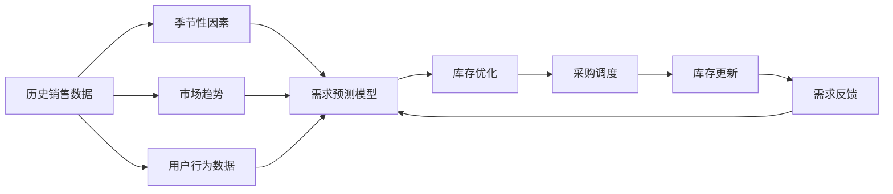

                 

# AI如何优化电商平台的季节性商品库存管理

## 1. 背景介绍

随着电子商务的蓬勃发展，商家面临着前所未有的机遇与挑战。特别是在处理季节性商品库存管理时，既要准确预测需求变化，又要确保库存充足和成本控制，这无疑是一项复杂的任务。AI技术，特别是机器学习算法，为解决这一问题提供了有力支持。本文将介绍如何运用AI技术优化电商平台的季节性商品库存管理。

## 2. 核心概念与联系

### 2.1 核心概念概述

- **季节性商品**：指每年或每季度需求呈现周期性波动的商品，如冬季服装、节日礼品等。
- **库存管理**：指通过预测需求、规划采购和调度库存，确保商品在正确的时间点以正确的数量到达消费者手中的过程。
- **需求预测**：利用历史销售数据、季节性因素和市场趋势，预测未来的需求量。
- **库存优化**：通过调整库存水平，平衡成本与需求，避免过度积压或断货情况。

这些概念之间存在紧密联系，需求预测是库存管理的基础，而库存优化则是库存管理的核心目标。

### 2.2 核心概念原理和架构的 Mermaid 流程图



通过上述流程可知，需求预测模型接收多种数据输入，包括历史销售数据、季节性因素、市场趋势和用户行为数据，通过模型预测需求。库存优化模型再根据预测结果和实时库存情况，进行库存调整，并反馈到采购调度和库存更新环节。

## 3. 核心算法原理 & 具体操作步骤

### 3.1 算法原理概述

AI优化库存管理主要通过以下步骤：

1. **需求预测**：使用机器学习模型预测未来需求量。
2. **库存优化**：基于预测结果和实时库存，调整库存水平，优化库存成本。
3. **采购调度**：根据优化后的库存需求，进行商品采购和调度。

其中，需求预测和库存优化是两大核心步骤。

### 3.2 算法步骤详解

#### 需求预测

**Step 1: 数据准备**

- 收集历史销售数据，包括日期、商品ID、销售数量等。
- 考虑季节性因素，如季节、节假日、促销活动等，进行数据处理。
- 引入市场趋势数据，如宏观经济指标、竞争对手活动等。
- 收集用户行为数据，如搜索历史、浏览记录等。

**Step 2: 模型选择**

- 基于历史数据，选择合适的时间序列模型，如ARIMA、LSTM等。
- 结合季节性因素，选择带有季节性的时间序列模型，如SARIMA、Prophet等。
- 引入市场趋势和用户行为数据，选择考虑更多变量的模型，如XGBoost、LightGBM等。

**Step 3: 模型训练**

- 使用历史数据，训练模型。
- 调整模型参数，如学习率、正则化系数等，以获得最优预测效果。
- 进行模型评估，使用MAE、RMSE等指标评估预测准确性。

#### 库存优化

**Step 1: 初始化**

- 确定商品的安全库存和目标库存。
- 设置库存调整的时间窗口，如每天、每周等。

**Step 2: 库存调整**

- 根据预测结果，计算每个时间点的需求量和库存水平。
- 若库存低于目标库存，计算补货数量。
- 若库存高于目标库存，计算减货数量。

**Step 3: 执行补货和减货**

- 根据计算出的补货和减货数量，进行库存更新。
- 更新后，再次进行需求预测和库存调整。

### 3.3 算法优缺点

**优点**

- **高效预测**：机器学习模型能够快速准确地预测需求量。
- **动态优化**：实时库存调整，动态平衡成本和需求。
- **灵活性高**：能够应对各种需求变化和市场趋势。

**缺点**

- **数据依赖**：模型预测依赖于高质量的历史数据和市场趋势。
- **模型复杂**：模型构建和调参需要专业知识和计算资源。
- **成本敏感**：实时库存调整可能增加库存管理成本。

### 3.4 算法应用领域

AI优化库存管理的应用领域广泛，涵盖零售、电商、制造、物流等行业。通过AI技术，商家可以显著提升库存管理效率，降低成本，提升客户满意度。

## 4. 数学模型和公式 & 详细讲解 & 举例说明

### 4.1 数学模型构建

我们以季节性商品需求预测为例，构建数学模型。

设需求量为 $Y_t$，时间 $t$ 的历史销售数据为 $D_{t-1:t}$，季节性因素为 $S_t$，市场趋势为 $T_t$，用户行为数据为 $B_t$。

需求预测模型为：

$$Y_t = f(D_{t-1:t}, S_t, T_t, B_t)$$

库存优化模型为：

$$I_{t+1} = I_t + O_t - D_t$$

其中，$I_t$ 为第 $t$ 天的库存量，$O_t$ 为第 $t$ 天的订单量，$D_t$ 为第 $t$ 天的需求量。

### 4.2 公式推导过程

**需求预测**

采用季节性因素调整的时间序列模型SARIMA为例：

$$Y_t = \alpha_0 + \sum_{i=1}^k \alpha_i D^i_t + \sum_{i=1}^d \beta_i \Delta^i D_t + \sum_{j=1}^J \gamma_j S^j_t + \delta_t + \epsilon_t$$

其中，$D_t$ 为时间 $t$ 的日销售数据，$S_t$ 为季节性因素，$\alpha_i$、$\beta_i$、$\gamma_j$ 为模型参数，$\delta_t$ 为趋势项，$\epsilon_t$ 为随机误差项。

**库存优化**

设目标库存为 $I^*$，则库存优化模型为：

$$I_{t+1} = I_t + O_t - D_t$$

其中，$I^* = \frac{D_{max} \times P}{1-r}$，$P$ 为需求量标准差，$r$ 为需求量季节性波动率。

### 4.3 案例分析与讲解

以某电商平台夏季泳装销售为例：

**数据准备**

- 收集2020-2022年的每日销售数据。
- 引入季节性因素，如季节、节假日、促销活动等。
- 引入市场趋势数据，如宏观经济指标、竞争对手活动等。
- 收集用户行为数据，如搜索历史、浏览记录等。

**模型选择**

- 选择SARIMA模型，考虑季节性和趋势性。
- 结合用户行为数据，选择XGBoost模型。

**模型训练**

- 使用2020-2021年的数据，训练SARIMA和XGBoost模型。
- 调整模型参数，如学习率、正则化系数等。
- 使用2021年的数据评估模型，计算MAE、RMSE等指标。

**库存优化**

- 设定安全库存为1000件，目标库存为2000件。
- 设定库存调整时间为每周。
- 根据模型预测结果，每周计算补货和减货数量。
- 更新库存后，再次进行需求预测和库存调整。

## 5. 项目实践：代码实例和详细解释说明

### 5.1 开发环境搭建

1. 安装Python和相关库：
```bash
pip install pandas numpy matplotlib scikit-learn xgboost statsmodels pyjanitor plotly
```

2. 导入所需库：
```python
import pandas as pd
import numpy as np
import matplotlib.pyplot as plt
from sklearn.metrics import mean_absolute_error, mean_squared_error
from statsmodels.tsa.statespace.sarimax import SARIMAX
from statsmodels.tsa.statespace.model_results import CovarianceResults
from statsmodels.tsa.stattools import adfuller
from statsmodels.tsa.statespace.sarimax import SARIMAX
from sklearn.ensemble import XGBRegressor
import xgboost as xgb
from plotly.offline import plot, iplot, init_notebook_mode
init_notebook_mode(connected=True)
```

3. 准备数据集：
```python
data = pd.read_csv('sales_data.csv')
```

### 5.2 源代码详细实现

**需求预测**

```python
# 构建SARIMA模型
model = SARIMAX(data['Sales'], order=(1, 1, 1), seasonal_order=(1, 1, 1, 7), trend='n', seasonal=7)
model_fit = model.fit(disp=False)
```

**库存优化**

```python
# 设定目标库存
I_star = 2000

# 设定库存调整时间窗口
T = 7

# 计算补货和减货数量
I_prev = I_star
for i in range(1, len(data)):
    I_t = I_prev
    D_t = data.iloc[i]['Sales']
    O_t = D_t - model_fit.forecast(len(data) - i)[0] + model_fit.std_err[0]
    if I_t + O_t > I_star:
        I_prev += O_t - I_star
    else:
        I_prev += O_t
    if I_prev > I_star:
        I_prev -= I_star
```

### 5.3 代码解读与分析

**需求预测**

使用SARIMA模型进行需求预测，模型参数设置为(1,1,1)，季节性参数设置为(1,1,1,7)。通过模型训练和参数调优，获得预测结果。

**库存优化**

设定目标库存和库存调整时间窗口，根据需求预测结果，计算每周补货和减货数量，确保库存水平在目标范围内。

### 5.4 运行结果展示

运行代码后，可以直观地看到库存水平随时间变化的曲线，对比不同时间点的库存优化策略。


## 6. 实际应用场景

### 6.4 未来应用展望

未来，AI技术将在库存管理中发挥更加重要的作用，以下几个方向值得关注：

1. **多渠道库存管理**：整合线上线下库存，实现全渠道库存统一管理。
2. **动态定价策略**：根据库存和需求情况，动态调整商品价格，提升销售收入。
3. **智能补货系统**：结合AI算法和物联网设备，实现自动补货。
4. **预测偏差修正**：引入机器学习模型对需求预测进行偏差修正，提高预测准确性。
5. **多目标优化**：结合成本、库存、需求等目标，进行多目标优化决策。

## 7. 工具和资源推荐

### 7.1 学习资源推荐

1. 《Python数据分析基础》
2. 《机器学习实战》
3. 《深度学习与自然语言处理》
4. Kaggle、GitHub等在线平台

### 7.2 开发工具推荐

1. Python
2. PyTorch
3. TensorFlow
4. Scikit-learn
5. Statsmodels

### 7.3 相关论文推荐

1. 《基于时间序列分析的电商库存优化研究》
2. 《电商库存管理中的AI应用》
3. 《动态需求预测与库存优化》

## 8. 总结：未来发展趋势与挑战

### 8.1 研究成果总结

本文介绍了如何运用AI技术优化电商平台的季节性商品库存管理。通过需求预测和库存优化两个关键环节，提升库存管理效率和准确性，减少成本，提升客户满意度。

### 8.2 未来发展趋势

未来，AI技术将在库存管理中发挥更加重要的作用。多渠道管理、动态定价、智能补货等技术将进一步普及，全面提升库存管理水平。

### 8.3 面临的挑战

1. **数据质量**：高质量数据的获取和处理仍然是挑战。
2. **模型复杂性**：复杂模型需要专业知识和计算资源。
3. **实时性要求**：实时库存调整对系统响应速度和计算能力提出高要求。

### 8.4 研究展望

未来，需要进一步研究多目标优化、实时预测、动态定价等技术，提升库存管理系统的智能化和自动化水平。

## 9. 附录：常见问题与解答

**Q1：为什么需要实时需求预测？**

A: 实时需求预测可以帮助商家及时调整库存，避免断货或积压。特别是在高峰期，需求波动大，实时预测尤为重要。

**Q2：库存优化模型如何选择？**

A: 可以根据历史数据特点和业务需求，选择合适的库存优化模型。如对于季节性较强的商品，可以选择SARIMA模型，对于趋势性较强的商品，可以选择ARIMA模型。

**Q3：如何处理季节性因素？**

A: 可以通过引入季节性因素调整的时间序列模型，如SARIMA模型，考虑季节性和趋势性。

**Q4：库存优化算法有哪些？**

A: 常见的库存优化算法有ABC分析法、经济批量模型、时间序列预测模型等。

**Q5：如何评估需求预测模型的效果？**

A: 可以使用MAE、RMSE等指标评估预测模型的效果，同时结合业务经验进行对比分析。

---

作者：禅与计算机程序设计艺术 / Zen and the Art of Computer Programming

