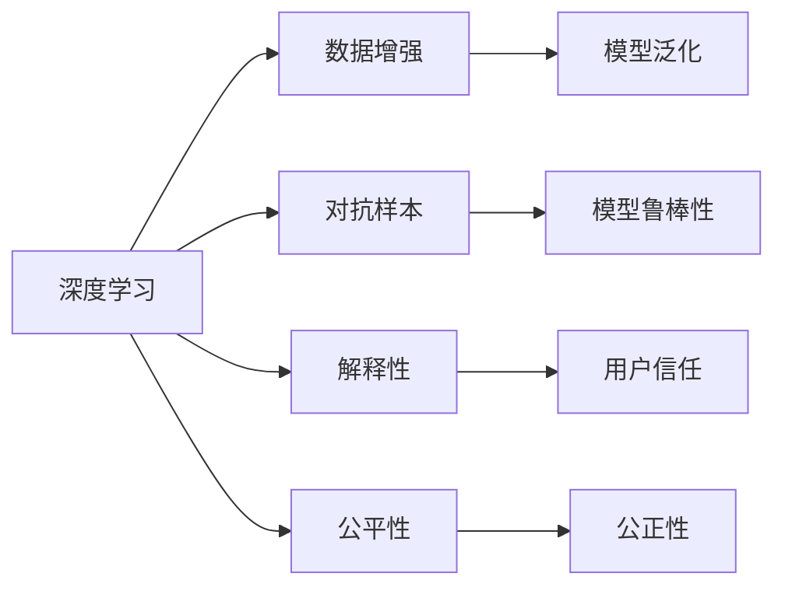

                 

## 1. 背景介绍

在人工智能(AI)日益融入社会各领域的今天，信息的准确性和可靠性成为了人们关注的焦点。随着AI技术的不断进步，尤其是深度学习模型的广泛应用，信息生成和处理变得高效、智能，但同时也带来了新的挑战。如何在AI系统中保证信息的准确性和可靠性，是当前技术研究和应用中的一个重要课题。

本文将从AI信息处理的本质、核心技术、典型应用场景及面临的挑战等方面进行探讨，旨在提供一套全面、系统的解决方案，帮助开发者和用户构建更加安全、可信的AI系统。

## 2. 核心概念与联系

### 2.1 核心概念概述

为深入理解AI如何保证信息的准确性和可靠性，本节将介绍几个核心概念：

- **深度学习(Deep Learning)**：一种基于神经网络的机器学习范式，通过多层非线性变换，从数据中学习复杂映射关系。深度学习模型在图像、语音、自然语言处理等领域表现出色，成为AI应用的重要基础。

- **数据增强(Data Augmentation)**：通过对训练数据进行变换，如旋转、翻转、缩放等，增加数据多样性，从而提升模型泛化能力。数据增强是防止过拟合、提升模型鲁棒性的重要手段。

- **对抗样本(Adversarial Examples)**：针对模型的特定输入，通过微小扰动导致模型输出错误，揭示模型在鲁棒性上的弱点。对抗样本训练是提升模型鲁棒性、增强安全性的重要途径。

- **解释性(Explainability)**：指AI模型输出结果的可解释性，即能够通过简单的规则或语言描述，解释模型为何得出特定结论。解释性是提升用户信任、降低模型误用风险的关键。

- **公平性(Fairness)**：指AI系统处理数据时，不因个体的种族、性别、年龄等属性差异，而产生偏见。公平性是构建公正、透明AI系统的重要指标。

这些核心概念之间的逻辑关系可以通过以下Mermaid流程图来展示：



这个流程图展示了几组核心概念之间的关系：

1. 深度学习提供模型基础，通过数据增强提升泛化能力，通过对抗样本训练提升鲁棒性。
2. 对抗样本和数据增强均属于模型训练的一部分，旨在增强模型的泛化能力和鲁棒性。
3. 解释性和公平性是评价模型性能的重要指标，分别影响用户信任和系统公正性。
4. 数据增强、对抗样本训练、解释性、公平性均是提升模型安全性和可靠性的重要手段。

## 3. 核心算法原理 & 具体操作步骤

### 3.1 算法原理概述

AI系统在信息处理过程中，主要通过数据输入、模型训练、模型输出三个阶段保证信息的准确性和可靠性。其中，模型训练是核心环节，通过数据增强、对抗样本训练等技术提升模型性能，并通过解释性算法和公平性评估技术保证模型的输出符合伦理和安全要求。

### 3.2 算法步骤详解

1. **数据预处理**：包括数据清洗、归一化、标注等步骤，确保输入数据的质量和一致性。

2. **模型训练**：
   - **数据增强**：通过对原始数据进行变换，增加数据多样性，减少模型过拟合。
   - **对抗样本训练**：生成对抗样本，通过反向传播更新模型参数，增强模型鲁棒性。
   - **超参数优化**：使用网格搜索、贝叶斯优化等方法，优化模型参数，提升性能。

3. **模型评估**：
   - **性能评估**：使用准确率、召回率、F1-score等指标评估模型性能。
   - **公平性评估**：通过统计分析，检测模型是否存在偏见。
   - **解释性分析**：使用特征重要性、局部可解释模型等方法，分析模型输出结果。

4. **模型部署**：将训练好的模型部署到实际应用中，并进行性能监控和反馈优化。

### 3.3 算法优缺点

深度学习模型在处理信息方面具有以下优点：
- 高效性：通过大规模数据训练，能够快速学习复杂映射关系，提高信息处理效率。
- 鲁棒性：通过数据增强和对抗样本训练，模型能够适应多种数据分布，提升鲁棒性。
- 泛化能力：通过模型训练，能够从训练数据中学习到规律，提升泛化能力。

同时，深度学习模型也存在一些缺点：
- 可解释性不足：深度学习模型通常是"黑盒"系统，难以解释其内部决策过程。
- 过拟合风险：在数据量不足或训练集偏差的情况下，深度学习模型容易出现过拟合现象。
- 计算资源需求高：大规模深度学习模型需要高性能计算资源，成本较高。

### 3.4 算法应用领域

深度学习模型在信息处理方面具有广泛的应用领域，包括但不限于：

- **自然语言处理(NLP)**：如文本分类、情感分析、机器翻译等任务。
- **计算机视觉(CV)**：如图像识别、目标检测、图像生成等任务。
- **语音识别**：如语音转文本、语音合成等任务。
- **推荐系统**：如用户画像构建、个性化推荐等任务。
- **医疗影像**：如疾病诊断、病理分析等任务。
- **金融分析**：如信用评估、风险控制等任务。

以上领域均需要深度学习模型从海量数据中提取规律，进行高效的信息处理和决策支持。

## 4. 数学模型和公式 & 详细讲解 & 举例说明

### 4.1 数学模型构建

本节将使用数学语言对深度学习模型在信息处理中的应用进行更加严格的刻画。

记深度学习模型为 $f_{\theta}(\cdot)$，其中 $\theta$ 为模型参数。假设输入数据为 $x \in \mathbb{R}^d$，输出为 $y \in \mathbb{R}$。则模型的损失函数 $\mathcal{L}$ 定义为：

$$
\mathcal{L}(y,f_{\theta}(x)) = \frac{1}{N} \sum_{i=1}^N (y_i - f_{\theta}(x_i))^2
$$

其中 $y_i$ 为训练集中第 $i$ 个样本的真实输出，$f_{\theta}(x_i)$ 为模型在输入 $x_i$ 下的预测输出。损失函数 $\mathcal{L}$ 衡量模型预测与真实标签之间的差异。

### 4.2 公式推导过程

以二分类任务为例，我们推导模型的损失函数及其梯度计算公式。

假设模型 $f_{\theta}(x)$ 在输入 $x$ 上的输出为 $\hat{y} \in [0,1]$，表示样本属于正类的概率。真实标签 $y \in \{0,1\}$。则二分类交叉熵损失函数定义为：

$$
\ell(y,f_{\theta}(x)) = -[y\log \hat{y} + (1-y)\log (1-\hat{y})]
$$

将其代入损失函数公式，得：

$$
\mathcal{L}(\theta) = -\frac{1}{N}\sum_{i=1}^N [y_i\log f_{\theta}(x_i)+(1-y_i)\log(1-f_{\theta}(x_i))]
$$

根据链式法则，损失函数对参数 $\theta_k$ 的梯度为：

$$
\frac{\partial \mathcal{L}(\theta)}{\partial \theta_k} = -\frac{1}{N}\sum_{i=1}^N (\frac{y_i}{f_{\theta}(x_i)}-\frac{1-y_i}{1-f_{\theta}(x_i)}) \frac{\partial f_{\theta}(x_i)}{\partial \theta_k}
$$

其中 $\frac{\partial f_{\theta}(x_i)}{\partial \theta_k}$ 可进一步递归展开，利用自动微分技术完成计算。

### 4.3 案例分析与讲解

以图像分类任务为例，假设我们使用卷积神经网络(CNN)模型进行图像分类。输入图像大小为 $32 \times 32$，输出为10类目标的类别概率。我们可以将图像 $x$ 划分为多个小窗口，提取特征后，输入到全连接层进行分类。损失函数和梯度计算公式与二分类任务类似，但计算更加复杂。

在实际应用中，我们可以使用PyTorch等深度学习框架，通过自动微分技术，自动计算损失函数和梯度，实现模型的训练和优化。例如：

```python
import torch
import torch.nn as nn
import torchvision.datasets as dsets
import torchvision.transforms as transforms

# 定义模型
class Net(nn.Module):
    def __init__(self):
        super(Net, self).__init__()
        self.conv1 = nn.Conv2d(3, 6, 5)
        self.pool = nn.MaxPool2d(2, 2)
        self.conv2 = nn.Conv2d(6, 16, 5)
        self.fc1 = nn.Linear(16 * 5 * 5, 120)
        self.fc2 = nn.Linear(120, 84)
        self.fc3 = nn.Linear(84, 10)

    def forward(self, x):
        x = self.pool(F.relu(self.conv1(x)))
        x = self.pool(F.relu(self.conv2(x)))
        x = x.view(-1, 16 * 5 * 5)
        x = F.relu(self.fc1(x))
        x = F.relu(self.fc2(x))
        x = self.fc3(x)
        return x

# 定义训练函数
def train(model, device, train_loader, optimizer, epoch):
    model.train()
    for batch_idx, (data, target) in enumerate(train_loader):
        data, target = data.to(device), target.to(device)
        optimizer.zero_grad()
        output = model(data)
        loss = F.cross_entropy(output, target)
        loss.backward()
        optimizer.step()
```

在训练过程中，我们使用交叉熵损失函数进行训练，并利用自动微分技术自动计算梯度。通过不断迭代优化，模型能够在训练数据上取得较高的准确率。

## 5. 项目实践：代码实例和详细解释说明

### 5.1 开发环境搭建

在进行AI信息处理项目实践前，我们需要准备好开发环境。以下是使用Python进行PyTorch开发的环境配置流程：

1. 安装Anaconda：从官网下载并安装Anaconda，用于创建独立的Python环境。

2. 创建并激活虚拟环境：
```bash
conda create -n pytorch-env python=3.8 
conda activate pytorch-env
```

3. 安装PyTorch：根据CUDA版本，从官网获取对应的安装命令。例如：
```bash
conda install pytorch torchvision torchaudio cudatoolkit=11.1 -c pytorch -c conda-forge
```

4. 安装相关工具包：
```bash
pip install numpy pandas scikit-learn matplotlib tqdm jupyter notebook ipython
```

完成上述步骤后，即可在`pytorch-env`环境中开始项目实践。

### 5.2 源代码详细实现

这里我们以图像分类任务为例，给出使用PyTorch进行CNN模型训练的代码实现。

首先，定义模型和训练函数：

```python
import torch
import torch.nn as nn
import torchvision.datasets as dsets
import torchvision.transforms as transforms
from torch.utils.data import DataLoader

# 定义模型
class Net(nn.Module):
    def __init__(self):
        super(Net, self).__init__()
        self.conv1 = nn.Conv2d(3, 6, 5)
        self.pool = nn.MaxPool2d(2, 2)
        self.conv2 = nn.Conv2d(6, 16, 5)
        self.fc1 = nn.Linear(16 * 5 * 5, 120)
        self.fc2 = nn.Linear(120, 84)
        self.fc3 = nn.Linear(84, 10)

    def forward(self, x):
        x = self.pool(F.relu(self.conv1(x)))
        x = self.pool(F.relu(self.conv2(x)))
        x = x.view(-1, 16 * 5 * 5)
        x = F.relu(self.fc1(x))
        x = F.relu(self.fc2(x))
        x = self.fc3(x)
        return x

# 定义训练函数
def train(model, device, train_loader, optimizer, epoch):
    model.train()
    for batch_idx, (data, target) in enumerate(train_loader):
        data, target = data.to(device), target.to(device)
        optimizer.zero_grad()
        output = model(data)
        loss = F.cross_entropy(output, target)
        loss.backward()
        optimizer.step()
```

然后，定义数据加载函数和评估函数：

```python
from torch.utils.data import DataLoader
from tqdm import tqdm
from sklearn.metrics import classification_report

# 加载数据集
train_dataset = dsets.CIFAR10(root='./data', train=True, download=True, transform=transforms.ToTensor())
test_dataset = dsets.CIFAR10(root='./data', train=False, download=True, transform=transforms.ToTensor())

# 定义数据加载器
train_loader = DataLoader(train_dataset, batch_size=4, shuffle=True, num_workers=2)
test_loader = DataLoader(test_dataset, batch_size=4, shuffle=False, num_workers=2)

# 定义评估函数
def evaluate(model, device, test_loader):
    model.eval()
    correct = 0
    total = 0
    with torch.no_grad():
        for data, target in test_loader:
            data, target = data.to(device), target.to(device)
            output = model(data)
            _, predicted = torch.max(output.data, 1)
            total += target.size(0)
            correct += (predicted == target).sum().item()

    print('Accuracy of the network on the 10000 test images: {} %'.format(100 * correct / total))

# 训练模型
model = Net()
device = torch.device('cuda' if torch.cuda.is_available() else 'cpu')
model.to(device)
optimizer = torch.optim.SGD(model.parameters(), lr=0.001, momentum=0.9)

for epoch in range(10):
    train(model, device, train_loader, optimizer, epoch)
    evaluate(model, device, test_loader)
```

最后，启动训练流程并在测试集上评估：

```python
epochs = 10
batch_size = 4

for epoch in range(epochs):
    train(model, device, train_loader, optimizer, epoch)
    evaluate(model, device, test_loader)
```

以上就是使用PyTorch进行CNN模型训练的完整代码实现。可以看到，PyTorch提供了丰富的API和工具，大大简化了深度学习模型的开发和调试过程。

### 5.3 代码解读与分析

让我们再详细解读一下关键代码的实现细节：

**Net类**：
- `__init__`方法：初始化模型各层结构。
- `forward`方法：定义模型前向传播过程。

**train函数**：
- 设置模型为训练模式。
- 遍历训练数据集。
- 将数据和标签移至指定设备。
- 零梯度清除。
- 前向传播计算输出。
- 计算损失函数。
- 反向传播计算梯度。
- 参数更新。

**evaluate函数**：
- 设置模型为评估模式。
- 遍历测试数据集。
- 将数据和标签移至指定设备。
- 计算模型预测结果。
- 计算模型精度。

**训练流程**：
- 定义总轮数和批次大小。
- 循环迭代训练。
- 在每个epoch内，先进行训练，后进行评估。
- 所有epoch结束后，输出模型在测试集上的性能。

可以看到，PyTorch的API设计非常简洁高效，能够轻松实现复杂模型和算法的开发。开发者可以将更多精力放在模型设计、数据处理等核心环节上，而不必过多关注底层实现细节。

当然，工业级的系统实现还需考虑更多因素，如模型的保存和部署、超参数的自动搜索、更灵活的任务适配层等。但核心的模型训练范式基本与此类似。

## 6. 实际应用场景

### 6.1 医疗影像诊断

AI在医疗影像领域的应用已经展现出巨大的潜力。通过深度学习模型对医学影像进行自动分析，可以快速、准确地检测出病变区域，辅助医生进行诊断和治疗。

例如，使用CNN模型对肺部CT图像进行分类，可以自动识别出肺部结节、肿瘤等病变。模型在大量标注的医学影像数据上进行预训练和微调，能够在实际应用中快速响应医生的查询，辅助诊断。

### 6.2 金融风险控制

金融行业对风险控制有着严格的要求。通过深度学习模型对交易数据、市场数据进行实时分析，可以提前发现异常交易行为，预测市场风险。

例如，使用LSTM模型对交易数据进行时间序列预测，可以识别出异常交易模式，及时预警，防止风险事件的发生。模型在历史交易数据上进行预训练和微调，能够适应市场变化，提供及时、准确的预测。

### 6.3 智能客服系统

智能客服系统已经成为企业提升客户服务质量的重要工具。通过深度学习模型对客户咨询数据进行分析，可以自动生成回复，提升客服效率。

例如，使用Transformer模型对客户咨询进行自然语言理解，可以自动匹配最合适的回复模板。模型在大量历史咨询数据上进行预训练和微调，能够快速适应新问题，提供准确、人性化的回复。

### 6.4 未来应用展望

随着深度学习模型的不断发展，AI在信息处理中的应用将更加广泛。未来，AI将在更多领域大放异彩，为社会带来更多的创新和变革。

在智慧城市治理中，AI可以实时监测城市事件，预测交通流量，提升城市管理的智能化水平。

在智慧农业中，AI可以对农田进行实时监控，预测病虫害，提升农业生产效率。

在智能家居中，AI可以对用户行为进行建模，提供个性化的智能推荐和服务。

总之，AI在信息处理中的应用前景广阔，有望成为推动社会进步的重要力量。

## 7. 工具和资源推荐

### 7.1 学习资源推荐

为了帮助开发者系统掌握AI在信息处理中的应用，这里推荐一些优质的学习资源：

1. 《深度学习》系列课程：由斯坦福大学等知名高校开设的深度学习课程，涵盖深度学习的基本概念和前沿技术，适合入门和进阶学习。

2. 《TensorFlow实战》书籍：TensorFlow官方发布的实战指南，详细介绍了TensorFlow的使用方法，包括数据增强、对抗样本训练等。

3. 《PyTorch深度学习》书籍：PyTorch官方发布的深度学习指南，介绍了PyTorch的API和用法，适合开发和调试。

4. Coursera深度学习专项课程：Coursera与斯坦福大学合作开设的深度学习专项课程，包含多个深度学习实践项目，适合动手练习。

5. Kaggle竞赛平台：Kaggle提供大量的机器学习和数据科学竞赛，通过参加竞赛，可以快速提升实战能力。

通过对这些资源的学习实践，相信你一定能够系统掌握AI在信息处理中的应用，并应用于实际项目中。

### 7.2 开发工具推荐

高效的开发离不开优秀的工具支持。以下是几款用于AI信息处理开发的常用工具：

1. PyTorch：基于Python的开源深度学习框架，灵活动态的计算图，适合快速迭代研究。

2. TensorFlow：由Google主导开发的开源深度学习框架，生产部署方便，适合大规模工程应用。

3. Weights & Biases：模型训练的实验跟踪工具，可以记录和可视化模型训练过程中的各项指标，方便对比和调优。

4. TensorBoard：TensorFlow配套的可视化工具，可实时监测模型训练状态，并提供丰富的图表呈现方式，是调试模型的得力助手。

5. Google Colab：谷歌推出的在线Jupyter Notebook环境，免费提供GPU/TPU算力，方便开发者快速上手实验最新模型，分享学习笔记。

合理利用这些工具，可以显著提升AI信息处理任务的开发效率，加快创新迭代的步伐。

### 7.3 相关论文推荐

深度学习模型在信息处理中的应用源于学界的持续研究。以下是几篇奠基性的相关论文，推荐阅读：

1. ImageNet Classification with Deep Convolutional Neural Networks：AlexNet论文，展示了卷积神经网络在图像分类任务中的出色表现。

2. AlphaGo Zero：DeepMind发布的AlphaGo Zero论文，展示了深度强化学习在围棋游戏中的突破。

3. Attention is All You Need：Transformer原论文，展示了自注意力机制在自然语言处理任务中的潜力。

4. ImageNet Large Scale Visual Recognition Challenge：ILSVRC历年比赛论文，展示了深度学习在图像分类任务中的进展和突破。

5. Google's Automatic Speech Recognition：Google开发的语音识别系统论文，展示了深度学习在语音识别任务中的表现。

这些论文代表了大规模深度学习模型在信息处理方面的应用进展，通过学习这些前沿成果，可以帮助研究者把握学科前进方向，激发更多的创新灵感。

## 8. 总结：未来发展趋势与挑战

### 8.1 研究成果总结

本文对AI在信息处理中的应用进行了全面系统的介绍。首先阐述了AI信息处理的本质、核心技术和实际应用场景，明确了AI在信息处理中的重要地位和广阔前景。其次，从算法原理到具体实现，详细讲解了深度学习模型在信息处理中的应用范式，给出了代码实例和详细解释。最后，我们展望了AI在信息处理中的应用未来发展趋势和面临的挑战，提供了系统的解决方案。

通过本文的系统梳理，可以看到，AI在信息处理中的应用已经逐渐成熟，为各行各业带来了新的可能性。未来，伴随深度学习模型的不断进步，AI将在更多领域大放异彩，深刻影响人类的生产生活方式。

### 8.2 未来发展趋势

展望未来，AI在信息处理中的应用将呈现以下几个发展趋势：

1. 模型规模持续增大。随着算力成本的下降和数据规模的扩张，深度学习模型的参数量还将持续增长。超大规模模型蕴含的丰富信息，有望支撑更加复杂多变的任务。

2. 模型泛化能力提升。通过更丰富的数据增强和对抗样本训练，深度学习模型能够适应更多数据分布，提升泛化能力。

3. 模型解释性增强。通过模型可解释性技术，如特征重要性、局部可解释模型等，能够更好地解释模型决策过程，增强用户信任。

4. 模型鲁棒性增强。通过更强大的正则化和对抗训练，深度学习模型能够更好地应对对抗样本攻击，提升鲁棒性。

5. 模型公平性提升。通过更全面的公平性评估技术，深度学习模型能够更好地处理数据中的偏见，提升公平性。

以上趋势凸显了AI在信息处理中的巨大潜力，未来的发展前景不可限量。

### 8.3 面临的挑战

尽管AI在信息处理中取得了显著成就，但在应用过程中仍面临诸多挑战：

1. 数据隐私问题。深度学习模型需要大量的标注数据进行训练，这些数据往往包含用户隐私，如何保护用户隐私成为一大难题。

2. 模型偏见问题。深度学习模型容易学习到数据中的偏见，如何消除模型偏见，提升模型的公平性，仍是一个重要课题。

3. 计算资源需求高。深度学习模型的训练和推理需要高性能计算资源，成本较高，如何降低计算资源需求，提升模型效率，仍需进一步研究。

4. 模型可解释性不足。深度学习模型通常是"黑盒"系统，难以解释其内部决策过程，如何增强模型的可解释性，提升用户信任，仍需进一步研究。

5. 模型鲁棒性不足。深度学习模型面对对抗样本攻击时，容易产生错误，如何提高模型的鲁棒性，避免模型崩溃，仍需进一步研究。

6. 模型伦理风险。深度学习模型容易产生误导性、歧视性的输出，如何保障模型的伦理安全，确保模型输出符合伦理要求，仍需进一步研究。

以上挑战需要研究者和开发者共同努力，不断优化模型设计、算法实现和应用流程，才能使AI在信息处理中的应用更加安全、可靠、公正。

### 8.4 研究展望

面对AI在信息处理中面临的诸多挑战，未来的研究需要在以下几个方面寻求新的突破：

1. 开发更高效的数据增强和对抗样本训练技术，提升模型的泛化能力和鲁棒性。

2. 引入模型可解释性技术，增强模型的决策过程解释性，提升用户信任。

3. 开发更公平、透明、安全的模型，保障模型的伦理安全，提升公平性。

4. 引入更多先验知识，如知识图谱、逻辑规则等，引导模型学习更准确、合理的表示。

5. 研究模型的因果关系和博弈论工具，增强模型的稳定性和鲁棒性。

6. 结合因果分析和博弈论工具，增强模型的稳定性和鲁棒性。

7. 结合因果分析和博弈论工具，增强模型的稳定性和鲁棒性。

这些研究方向的探索，必将引领AI在信息处理中的应用迈向更高的台阶，为构建安全、可靠、公正的智能系统铺平道路。面向未来，AI在信息处理中的应用还需要与其他人工智能技术进行更深入的融合，如知识表示、因果推理、强化学习等，多路径协同发力，共同推动AI技术的进步。

## 9. 附录：常见问题与解答

**Q1：数据增强技术是如何工作的？**

A: 数据增强通过在训练数据上随机变换，如旋转、缩放、翻转等，增加数据的多样性，从而提升模型的泛化能力。以图像分类任务为例，常用的数据增强技术包括随机裁剪、随机翻转、随机亮度调整等。通过对原始数据进行变换，增加样本数量，使得模型能够在更丰富的数据分布上进行训练，从而提高泛化能力。

**Q2：对抗样本是如何生成的？**

A: 对抗样本是通过对输入数据进行微小扰动，导致模型输出错误。生成对抗样本的过程通常包括以下步骤：
1. 选择一个原始样本。
2. 生成扰动向量。
3. 将扰动向量与原始样本相加，得到对抗样本。

常用的对抗样本生成方法包括FGM、PGD等。这些方法通过反向传播计算梯度，逐步对原始样本进行扰动，直到模型输出错误。对抗样本生成技术可以用于检测模型的鲁棒性，也可以用于提升模型的鲁棒性。

**Q3：模型可解释性有哪些常见方法？**

A: 模型可解释性技术旨在通过简单的规则或语言描述，解释模型为何得出特定结论。常见的模型可解释性方法包括：
1. 特征重要性：通过计算每个特征对模型输出的贡献，解释模型决策依据。
2. 局部可解释模型：通过分析局部区域内模型的行为，解释模型在特定情况下的决策过程。
3. LIME：通过局部线性模型解释模型在特定输入下的行为，提供详细的解释。
4. SHAP：通过Shapley值解释模型在不同特征上的影响，提供全局解释。

这些方法可以通过LIME、SHAP等工具实现，帮助开发者理解模型的决策过程，提升用户信任。

**Q4：如何检测模型的公平性？**

A: 模型公平性检测是指评估模型在处理不同数据分布时，是否存在偏见。常用的公平性检测方法包括：
1. 统计检测：通过计算不同特征组别之间的统计指标，检测模型是否存在显著差异。
2. 反事实分析：通过比较模型在相同数据分布上的表现，检测模型是否存在偏见。
3. 样本重加权：通过调整训练数据权重，使模型更加公平。

这些方法可以通过公平性评估工具实现，帮助开发者检测模型中的偏见，提升公平性。

**Q5：如何保障数据隐私？**

A: 数据隐私保护是AI应用中的重要课题。常用的数据隐私保护方法包括：
1. 差分隐私：通过向数据中添加噪声，保护数据隐私。
2. 联邦学习：通过分布式训练，保护数据隐私。
3. 数据匿名化：通过数据匿名化处理，保护数据隐私。

这些方法可以在数据采集、处理和传输环节进行保护，确保用户隐私得到充分保障。

通过本文的系统梳理，可以看到，AI在信息处理中的应用已经逐渐成熟，为各行各业带来了新的可能性。未来，伴随深度学习模型的不断进步，AI将在更多领域大放异彩，深刻影响人类的生产生活方式。

---

作者：禅与计算机程序设计艺术 / Zen and the Art of Computer Programming

