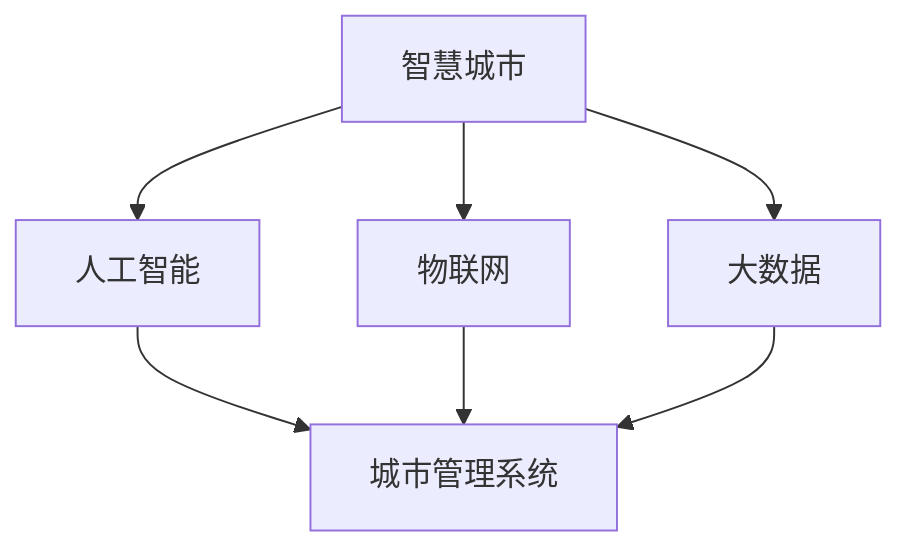

                 

# AI如何改变城市规划和管理

> 关键词：城市规划,智慧城市,人工智能,大数据,物联网,城市管理

## 1. 背景介绍

### 1.1 问题由来
随着城市化进程的加速，全球范围内城市人口不断增长，城市资源日益紧张，环境问题也愈加突出。如何更科学、高效地规划和管理城市，成为了各大城市管理者和政府部门面临的重大挑战。

传统城市规划和管理方法，如凭经验决策、人工管理等，效率低下、成本高昂，且难以应对快速变化的城市环境。随着人工智能技术的突破，城市规划和管理也开始迈向智能化、精准化，AI技术在其中的应用越来越广泛。

### 1.2 问题核心关键点
AI技术在城市规划和管理中的应用，主要体现在以下几个方面：

1. **数据驱动的智慧城市**：通过收集和分析城市大数据，实时监测和优化城市运行。
2. **交通系统优化**：利用AI技术预测交通流量，优化交通信号，减少拥堵，提高运输效率。
3. **能源管理**：智能电网和能源管理系统，通过AI预测能源需求，优化资源配置，减少浪费。
4. **环境监测**：通过传感器和AI算法，实时监测空气质量、水质等环境指标，优化环境治理。
5. **应急响应**：利用AI分析灾害数据，优化应急预案，提高灾害预警和应对能力。
6. **公共服务智能化**：AI技术在教育、医疗、文化等公共服务领域的普及，提升了服务质量和效率。

## 2. 核心概念与联系

### 2.1 核心概念概述

为更好地理解AI在城市规划和管理中的应用，本节将介绍几个关键概念及其联系：

- **智慧城市(Smart City)**：通过信息和通信技术(Information and Communication Technology, ICT)的应用，实现城市运行的智能化、高效化和可持续化。
- **大数据(Big Data)**：指规模巨大、复杂多样、真实可用的数据集，可用于城市管理的各个环节。
- **物联网(IoT)**：连接物理世界和信息世界的网络技术，通过传感器、智能设备等实时采集城市数据。
- **人工智能(AI)**：涵盖机器学习、深度学习、自然语言处理等技术，用于数据建模、智能决策等。
- **城市管理系统(Urban Management System)**：包括智能交通、能源管理、环境监测、公共服务等子系统，是AI技术在城市管理中的应用平台。

这些概念之间的逻辑关系可以通过以下Mermaid流程图来展示：



这个流程图展示了大数据、物联网和人工智能等技术，如何通过城市管理系统协同工作，支撑智慧城市的构建。

## 3. 核心算法原理 & 具体操作步骤

### 3.1 算法原理概述

AI在城市规划和管理中的应用，主要基于以下算法原理：

1. **数据预处理**：收集、清洗、标注城市数据，为后续的模型训练和应用奠定基础。
2. **模型训练**：利用机器学习、深度学习等算法，训练预测模型、分类模型、聚类模型等，用于城市数据分析和决策支持。
3. **模型部署**：将训练好的模型集成到城市管理系统，实时监测和优化城市运行。
4. **模型优化**：定期更新模型，适应城市运行环境的变化，保持模型的准确性和可靠性。

### 3.2 算法步骤详解

基于AI的城市规划和管理，一般包括以下几个关键步骤：

**Step 1: 数据收集与预处理**
- 收集城市各类数据，如交通流量、能源消耗、环境监测数据等。
- 清洗数据，去除异常值、噪音，保证数据质量。
- 标注数据，为模型训练提供监督信号。

**Step 2: 模型训练**
- 选择合适的算法，如线性回归、随机森林、神经网络等。
- 使用城市数据集训练模型，验证模型的准确性。
- 调整模型参数，提高模型的泛化能力和鲁棒性。

**Step 3: 模型部署**
- 将训练好的模型集成到城市管理系统中。
- 设置实时数据流，将城市数据送入模型，输出优化建议。
- 部署模型到服务器或云平台，保证模型的可访问性和实时性。

**Step 4: 模型优化与维护**
- 定期收集新数据，更新模型参数，保持模型的时效性。
- 优化模型的计算效率，减少资源消耗。
- 定期评估模型效果，改进算法和数据处理方式。

### 3.3 算法优缺点

AI在城市规划和管理中的应用，具有以下优点：

1. **高效性**：AI技术可以快速处理大量数据，实时监测城市运行状态，提供决策支持。
2. **精准性**：通过机器学习和深度学习，模型能够更准确地预测和优化城市资源配置。
3. **自动化**：自动化处理城市管理任务，减少人工干预，提高工作效率。
4. **持续学习**：模型能够持续学习新数据，适应城市环境的变化。

同时，也存在以下局限性：

1. **数据质量依赖**：模型的准确性高度依赖于数据的质量和完整性。
2. **算法复杂性**：复杂的算法模型需要更多的计算资源和时间成本。
3. **隐私与安全**：城市数据涉及隐私和安全问题，需要严格的数据保护措施。
4. **透明性与可解释性**：AI模型的决策过程缺乏透明度，难以解释其输出结果。
5. **伦理与道德**：AI在城市管理中的应用可能面临伦理和道德挑战，如偏见、歧视等。

### 3.4 算法应用领域

AI在城市规划和管理中的应用，涵盖多个领域，如：

- **智慧交通**：利用AI技术优化交通信号，预测交通流量，提升交通安全和效率。
- **智能电网**：通过AI分析能源需求，优化电力分配，提高能源利用率。
- **环境监测**：使用AI算法监测空气质量、水质等环境指标，优化环境治理。
- **公共安全**：利用AI技术分析视频监控数据，优化警力部署，提高响应速度。
- **应急管理**：通过AI预测灾害发生，优化应急预案，减少灾害损失。
- **城市规划**：利用AI技术分析人口分布、交通流向等数据，优化城市规划布局。

## 4. 数学模型和公式 & 详细讲解 & 举例说明

### 4.1 数学模型构建

AI在城市规划和管理中的应用，通常构建以下几种数学模型：

1. **预测模型**：用于预测城市资源需求、交通流量等，如线性回归模型、神经网络模型。
2. **分类模型**：用于分类城市数据，如决策树模型、支持向量机模型。
3. **聚类模型**：用于聚类城市数据，如K-means聚类模型。

### 4.2 公式推导过程

以线性回归模型为例，其基本公式为：

$$
y = \beta_0 + \beta_1 x_1 + \beta_2 x_2 + ... + \beta_n x_n + \epsilon
$$

其中 $y$ 为城市数据，$x_i$ 为预测因子，$\beta_i$ 为系数，$\epsilon$ 为误差项。模型的目标是找到最优的系数 $\beta_i$，使得模型对城市数据的预测误差最小。

利用最小二乘法，可以求解最优的 $\beta_i$，公式为：

$$
\hat{\beta} = (X^TX)^{-1}X^Ty
$$

其中 $X$ 为设计矩阵，$y$ 为城市数据向量。

### 4.3 案例分析与讲解

**案例：智能电网模型**

1. **数据准备**：收集电网历史数据，包括用电量、天气、设备状态等。
2. **模型构建**：使用线性回归模型预测未来用电量，公式为：

$$
y = \beta_0 + \beta_1 x_1 + \beta_2 x_2 + ... + \beta_n x_n
$$

其中 $y$ 为用电量，$x_i$ 为预测因子，$\beta_i$ 为系数。
3. **模型训练与验证**：使用历史数据训练模型，验证模型的准确性。
4. **模型部署**：将模型集成到智能电网系统中，实时预测用电量，优化电力分配。
5. **模型优化**：定期更新模型参数，适应电力需求的变化。

## 5. 项目实践：代码实例和详细解释说明

### 5.1 开发环境搭建

在进行AI城市规划和管理的应用开发前，我们需要准备好开发环境。以下是使用Python进行TensorFlow开发的环境配置流程：

1. 安装Anaconda：从官网下载并安装Anaconda，用于创建独立的Python环境。

2. 创建并激活虚拟环境：
```bash
conda create -n tf-env python=3.8 
conda activate tf-env
```

3. 安装TensorFlow：根据CUDA版本，从官网获取对应的安装命令。例如：
```bash
conda install tensorflow-gpu==2.7.0
```

4. 安装各类工具包：
```bash
pip install numpy pandas scikit-learn matplotlib tqdm jupyter notebook ipython
```

完成上述步骤后，即可在`tf-env`环境中开始开发实践。

### 5.2 源代码详细实现

下面我们以智慧交通系统为例，给出使用TensorFlow进行模型训练和部署的PyTorch代码实现。

```python
import tensorflow as tf
from tensorflow.keras import layers
from tensorflow.keras.layers import Input, Dense, Dropout, LSTM
from tensorflow.keras.models import Model

# 定义模型
def build_model(input_shape):
    input_layer = Input(shape=input_shape)
    hidden_layer1 = Dense(64, activation='relu')(input_layer)
    dropout_layer = Dropout(0.2)(hidden_layer1)
    output_layer = Dense(1, activation='sigmoid')(dropout_layer)
    model = Model(inputs=input_layer, outputs=output_layer)
    return model

# 加载数据
train_data = pd.read_csv('traffic_data.csv', index_col='id')
train_data = train_data.dropna()

# 准备数据
x_train = train_data.drop(['target'], axis=1)
y_train = train_data['target']

# 数据归一化
x_train = (x_train - x_train.mean()) / x_train.std()

# 构建模型
model = build_model(x_train.shape[1])
model.compile(optimizer='adam', loss='binary_crossentropy', metrics=['accuracy'])

# 训练模型
model.fit(x_train, y_train, batch_size=32, epochs=10, validation_split=0.2)

# 部署模型
model.save('traffic_model.h5')
```

在以上代码中，我们首先定义了交通流量预测模型，使用了LSTM层和Dropout层进行特征提取和防止过拟合。然后，加载训练数据，准备数据，并构建模型。最后，训练模型并保存模型。

### 5.3 代码解读与分析

让我们再详细解读一下关键代码的实现细节：

**build_model函数**：
- 定义模型的输入层、隐藏层、输出层等组件，并返回模型对象。

**data preparation**：
- 加载训练数据，并移除NaN值。
- 将数据归一化，使得数据分布更加稳定。

**模型构建**：
- 使用LSTM层和Dropout层进行特征提取和防止过拟合。
- 使用Sigmoid激活函数输出预测值。

**模型训练**：
- 使用Adam优化器，二元交叉熵损失函数，训练模型，验证集占比20%。

**模型部署**：
- 将训练好的模型保存到文件，以便后续使用。

可以看到，TensorFlow和PyTorch的结合，使得模型开发和训练变得相对简单高效。开发者可以将更多精力放在数据处理、模型改进等高层逻辑上，而不必过多关注底层的实现细节。

当然，工业级的系统实现还需考虑更多因素，如模型的保存和部署、超参数的自动搜索、更灵活的任务适配层等。但核心的AI城市规划和管理模型开发流程基本与此类似。

## 6. 实际应用场景

### 6.1 智慧交通系统

基于AI技术的智慧交通系统，可以显著提升城市交通效率和安全性。通过AI技术，可以实现交通流量的实时监测和预测，优化交通信号灯，减少拥堵。

在技术实现上，可以收集城市的交通监控数据，如摄像头图像、车辆位置、行驶速度等，构建交通流量预测模型。模型将历史数据和实时数据输入，预测未来的交通流量，反馈给交通管理部门，动态调整交通信号灯的设置，优化交通流量。

### 6.2 智能电网系统

智能电网系统通过AI技术，可以实现电力的高效管理和调度。AI模型可以预测用电需求，优化电力分配，提高电网的稳定性和效率。

在具体实现上，可以收集电网的历史用电量数据、气象数据、设备状态等，构建用电需求预测模型。模型通过分析当前气象和设备状态，预测未来的用电量，优化电力分配，提高电网的运行效率。

### 6.3 环境监测系统

环境监测系统利用AI技术，实时监测城市环境指标，如空气质量、水质等，优化环境治理。通过传感器收集环境数据，利用AI模型分析处理，及时预警和采取措施。

在实现上，可以构建环境指标预测模型，如PM2.5预测模型、水质监测模型等。模型通过分析历史数据和实时数据，预测未来的环境指标，及时预警和采取措施，优化环境治理。

### 6.4 未来应用展望

随着AI技术的不断进步，未来AI在城市规划和管理中的应用将更加广泛和深入。

在智慧城市建设中，AI将与5G、物联网等技术深度融合，构建更加智能化的城市运行体系。如智慧建筑、智能物流等，将进一步提升城市的智能化水平。

在公共服务领域，AI将应用于教育、医疗、文化等领域，提供个性化服务，提升服务质量和效率。

在城市应急管理中，AI将发挥更大的作用，通过数据分析和预测，优化应急预案，减少灾害损失。

## 7. 工具和资源推荐

### 7.1 学习资源推荐

为了帮助开发者系统掌握AI在城市规划和管理中的应用，这里推荐一些优质的学习资源：

1. **《智慧城市技术与管理》系列书籍**：详细介绍了智慧城市的各个方面，涵盖AI技术在城市管理中的应用。
2. **《Python数据科学手册》**：介绍了Python在数据科学中的应用，包括TensorFlow、PyTorch等深度学习框架的使用。
3. **Kaggle数据科学竞赛平台**：提供了大量城市数据集，供开发者练习AI模型构建和优化。
4. **Udacity智慧城市纳米学位课程**：涵盖智慧城市管理的各个方面，包括AI技术的应用。
5. **arXiv论文预印平台**：提供了大量AI在城市规划和管理中的最新研究成果。

通过对这些资源的学习实践，相信你一定能够快速掌握AI在城市规划和管理中的应用精髓，并用于解决实际的城市问题。

### 7.2 开发工具推荐

高效的开发离不开优秀的工具支持。以下是几款用于AI城市规划和管理开发的常用工具：

1. **TensorFlow**：由Google主导开发的开源深度学习框架，生产部署方便，适合大规模工程应用。
2. **PyTorch**：基于Python的开源深度学习框架，灵活动态的计算图，适合快速迭代研究。
3. **Jupyter Notebook**：免费开源的交互式计算环境，方便开发者进行代码实验和数据可视化。
4. **Weights & Biases**：模型训练的实验跟踪工具，可以记录和可视化模型训练过程中的各项指标，方便对比和调优。
5. **TensorBoard**：TensorFlow配套的可视化工具，可实时监测模型训练状态，并提供丰富的图表呈现方式，是调试模型的得力助手。
6. **Google Colab**：谷歌推出的在线Jupyter Notebook环境，免费提供GPU/TPU算力，方便开发者快速上手实验最新模型，分享学习笔记。

合理利用这些工具，可以显著提升AI城市规划和管理的开发效率，加快创新迭代的步伐。

### 7.3 相关论文推荐

AI在城市规划和管理中的应用源于学界的持续研究。以下是几篇奠基性的相关论文，推荐阅读：

1. **《智慧城市：定义、框架与策略》**：阐述了智慧城市的定义、框架和策略，提供了AI技术在智慧城市中的应用思路。
2. **《基于深度学习的城市交通流量预测》**：利用深度学习模型预测城市交通流量，优化交通管理。
3. **《智能电网中的深度学习应用》**：介绍了深度学习在智能电网中的应用，如用电需求预测、故障诊断等。
4. **《环境监测中的数据驱动方法》**：探讨了数据驱动在城市环境监测中的应用，如空气质量预测、水质监测等。
5. **《AI在城市应急管理中的应用》**：利用AI技术预测灾害发生，优化应急预案，减少灾害损失。

这些论文代表了大AI在城市规划和管理中的应用的发展脉络。通过学习这些前沿成果，可以帮助研究者把握学科前进方向，激发更多的创新灵感。

## 8. 总结：未来发展趋势与挑战

### 8.1 总结

本文对AI在城市规划和管理中的应用进行了全面系统的介绍。首先阐述了AI技术在城市管理中的重大意义，明确了智慧城市、大数据、物联网、人工智能等关键概念之间的联系。其次，从原理到实践，详细讲解了AI城市规划和管理的数学模型和操作步骤，给出了完整的代码实例。同时，本文还广泛探讨了AI在智慧交通、智能电网、环境监测等多个领域的应用前景，展示了AI技术在城市管理中的巨大潜力。此外，本文精选了AI在城市规划和管理中的各类学习资源和开发工具，力求为读者提供全方位的技术指引。

通过本文的系统梳理，可以看到，AI技术在城市规划和管理中的应用，正在成为智慧城市建设的重要驱动力，极大地提升了城市管理的智能化和高效化水平。未来，伴随AI技术的不断进步，AI在城市规划和管理中的应用将更加广泛和深入，为城市发展带来新的活力和机遇。

### 8.2 未来发展趋势

展望未来，AI在城市规划和管理中的应用将呈现以下几个发展趋势：

1. **自动化与智能化**：AI技术将进一步自动化城市管理任务，减少人工干预，提升管理效率。
2. **多模态融合**：AI将整合不同模态的城市数据，如视频、音频、传感器数据等，提升城市管理的综合感知能力。
3. **人机协同**：AI将与城市管理者、市民等协同工作，提供更加个性化的城市服务。
4. **跨领域应用**：AI将在智慧医疗、智慧教育、智慧文化等多个领域深度应用，提升公共服务质量。
5. **大数据与AI的深度结合**：AI将利用大数据技术，进行更加精准的城市管理决策。
6. **持续学习与自我优化**：AI模型将持续学习新数据，优化模型参数，提升模型的准确性和鲁棒性。

以上趋势凸显了AI技术在城市规划和管理中的广阔前景。这些方向的探索发展，必将进一步提升城市管理的智能化水平，为城市发展注入新的动力。

### 8.3 面临的挑战

尽管AI在城市规划和管理中的应用已经取得了显著进展，但在迈向更加智能化、普适化应用的过程中，它仍面临着诸多挑战：

1. **数据隐私与安全**：城市数据涉及大量隐私信息，如何保护数据安全是一个重要问题。
2. **算力与资源**：大规模AI模型需要高性能计算资源，如何在资源有限的情况下进行高效建模。
3. **模型透明性与可解释性**：AI模型的决策过程缺乏透明度，难以解释其输出结果。
4. **伦理与道德**：AI在城市管理中的应用可能面临伦理和道德挑战，如偏见、歧视等。
5. **跨领域融合**：不同领域的数据和模型需要有效整合，才能实现AI在城市管理中的应用。

这些挑战需要通过技术创新和政策引导，逐步克服。只有在克服这些挑战的基础上，AI在城市规划和管理中的应用才能取得更大的突破。

### 8.4 研究展望

面对AI在城市规划和管理中面临的挑战，未来的研究需要在以下几个方面寻求新的突破：

1. **隐私保护技术**：开发更加安全的隐私保护算法，保护城市数据隐私。
2. **高效计算架构**：探索高效的计算架构，如分布式计算、边缘计算等，降低计算资源成本。
3. **模型可解释性**：研发可解释性强的AI模型，提升模型的透明度和可解释性。
4. **跨领域数据融合**：研究跨领域数据整合技术，提升城市管理的综合感知能力。
5. **AI伦理与道德**：建立AI伦理框架，确保AI在城市管理中的应用符合伦理道德标准。

这些研究方向的探索，必将引领AI在城市规划和管理中的应用迈向更高的台阶，为构建智慧城市提供更可靠的技术保障。总之，只有通过技术创新和政策引导，AI在城市规划和管理中的应用才能不断取得新的突破，为城市发展带来更多的机遇和挑战。

## 9. 附录：常见问题与解答

**Q1：如何构建城市AI模型？**

A: 构建城市AI模型的关键步骤包括：数据收集与预处理、模型训练、模型部署、模型优化与维护。具体步骤如下：
1. 收集城市各类数据，如交通流量、能源消耗、环境监测数据等。
2. 清洗数据，去除异常值、噪音，保证数据质量。
3. 标注数据，为模型训练提供监督信号。
4. 选择合适的算法，如线性回归、随机森林、神经网络等。
5. 使用城市数据集训练模型，验证模型的准确性。
6. 调整模型参数，提高模型的泛化能力和鲁棒性。
7. 将训练好的模型集成到城市管理系统中，实时监测和优化城市运行。
8. 定期收集新数据，更新模型参数，保持模型的时效性。

**Q2：AI在城市规划和管理中的应用有哪些？**

A: AI在城市规划和管理中的应用主要涵盖以下领域：
1. 智慧交通：利用AI技术优化交通信号，预测交通流量，提升交通安全和效率。
2. 智能电网：通过AI分析用电需求，优化电力分配，提高电网的稳定性和效率。
3. 环境监测：利用AI技术监测空气质量、水质等环境指标，优化环境治理。
4. 公共安全：利用AI技术分析视频监控数据，优化警力部署，提高响应速度。
5. 应急管理：通过AI预测灾害发生，优化应急预案，减少灾害损失。
6. 城市规划：利用AI技术分析人口分布、交通流向等数据，优化城市规划布局。

**Q3：AI模型在城市管理中的性能如何衡量？**

A: AI模型在城市管理中的性能通常通过以下指标进行衡量：
1. 准确性(Accuracy)：模型预测结果与真实结果的匹配度。
2. 召回率(Recall)：模型识别出真实正样本的能力。
3. 精确率(Precision)：模型识别为正样本的准确度。
4. F1分数：准确率和召回率的调和平均数。
5. 训练时间和推理时间：模型的计算效率。
6. 模型鲁棒性：模型对数据分布变化的适应能力。
7. 模型可解释性：模型的决策过程是否透明，是否易于理解。

**Q4：AI在城市管理中的应用面临哪些挑战？**

A: AI在城市管理中的应用面临以下挑战：
1. 数据隐私与安全：城市数据涉及大量隐私信息，如何保护数据安全是一个重要问题。
2. 算力与资源：大规模AI模型需要高性能计算资源，如何在资源有限的情况下进行高效建模。
3. 模型透明性与可解释性：AI模型的决策过程缺乏透明度，难以解释其输出结果。
4. 伦理与道德：AI在城市管理中的应用可能面临伦理和道德挑战，如偏见、歧视等。
5. 跨领域融合：不同领域的数据和模型需要有效整合，才能实现AI在城市管理中的应用。

**Q5：如何应对AI在城市管理中的应用挑战？**

A: 应对AI在城市管理中的应用挑战，需要从以下几个方面进行改进：
1. 隐私保护技术：开发更加安全的隐私保护算法，保护城市数据隐私。
2. 高效计算架构：探索高效的计算架构，如分布式计算、边缘计算等，降低计算资源成本。
3. 模型可解释性：研发可解释性强的AI模型，提升模型的透明度和可解释性。
4. 跨领域数据融合：研究跨领域数据整合技术，提升城市管理的综合感知能力。
5. AI伦理与道德：建立AI伦理框架，确保AI在城市管理中的应用符合伦理道德标准。

这些改进措施将有助于提高AI在城市管理中的应用效果，提升城市管理的智能化和普适化水平。

