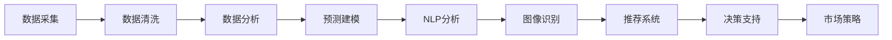

                 

# AI如何改变市场研究和消费者洞察

在当今快速变化的市场环境中，企业需要更快、更准地了解市场趋势和消费者需求，以便制定精准的市场策略。随着人工智能（AI）技术的不断发展，市场研究和消费者洞察的方式正在发生深刻变革。AI技术通过数据分析、预测和决策优化，为市场研究提供了全新的工具和方法，帮助企业实现精细化的市场分析和消费者洞察。本文将深入探讨AI在市场研究和消费者洞察中的应用，以及未来的发展趋势。

## 1. 背景介绍

### 1.1 问题由来

市场研究一直是企业制定营销策略的重要依据。传统市场研究方法主要包括问卷调查、焦点小组、市场观察等，这些方法耗时耗力且成本高昂。随着大数据和AI技术的兴起，市场研究方式正在向自动化、智能化方向发展。AI技术可以处理海量数据，进行复杂的数据分析和模式识别，显著提高市场研究的效率和准确性。

### 1.2 问题核心关键点

AI在市场研究和消费者洞察中的应用主要体现在以下几个方面：
1. 数据分析：利用机器学习算法，从大规模数据集中提取有价值的信息。
2. 预测建模：使用历史数据训练模型，预测未来市场趋势和消费者行为。
3. 自然语言处理：解析消费者评论和社交媒体数据，理解消费者情感和需求。
4. 图像识别：分析产品图片和视频数据，识别消费者偏好和产品特点。
5. 推荐系统：基于消费者历史行为数据，提供个性化推荐，提升用户体验。

这些应用不仅提高了市场研究的效率，还提升了市场策略的精准度。

## 2. 核心概念与联系

### 2.1 核心概念概述

为更好地理解AI在市场研究和消费者洞察中的应用，本文将介绍几个关键概念：

- **人工智能（Artificial Intelligence, AI）**：通过算法模拟人类智能，解决复杂问题的一门科学和技术。
- **市场研究（Market Research）**：收集、分析和解释市场信息，为企业制定营销策略提供依据。
- **消费者洞察（Consumer Insights）**：通过分析消费者数据，理解消费者的需求、偏好和行为。
- **数据分析（Data Analysis）**：从数据中提取有价值的信息，支持决策制定。
- **预测建模（Predictive Modeling）**：使用历史数据训练模型，预测未来趋势。
- **自然语言处理（Natural Language Processing, NLP）**：解析和理解人类语言，提取文本信息。
- **图像识别（Image Recognition）**：识别和分析图片和视频中的视觉信息。
- **推荐系统（Recommendation System）**：基于用户行为数据，提供个性化推荐。

这些概念共同构成了AI在市场研究和消费者洞察中的基本框架，帮助企业高效地获取市场信息和消费者洞察。

### 2.2 核心概念原理和架构的 Mermaid 流程图



这个流程图展示了AI在市场研究和消费者洞察中的关键步骤。数据采集是第一步，然后通过数据清洗、数据分析、预测建模、NLP分析、图像识别和推荐系统等步骤，最终生成决策支持的依据，进而制定市场策略。

## 3. 核心算法原理 & 具体操作步骤

### 3.1 算法原理概述

AI在市场研究和消费者洞察中的应用，主要依赖于以下几个核心算法：

- **机器学习（Machine Learning, ML）**：通过学习历史数据，发现数据中的模式和规律。
- **深度学习（Deep Learning, DL）**：使用多层神经网络，解决复杂问题。
- **自然语言处理（NLP）**：利用机器学习模型解析和理解人类语言。
- **计算机视觉（Computer Vision）**：使用图像处理技术识别视觉信息。
- **推荐系统算法**：如协同过滤、内容过滤等，基于用户行为数据提供个性化推荐。

这些算法共同构成了AI在市场研究和消费者洞察中的技术基础，帮助企业从海量数据中提取有价值的信息，进行精准的预测和分析。

### 3.2 算法步骤详解

以下是AI在市场研究和消费者洞察中常用的操作步骤：

1. **数据采集**：收集市场数据和消费者数据。包括问卷调查、社交媒体数据、销售记录、客户反馈等。
2. **数据清洗**：处理缺失值、异常值和重复值，确保数据质量。
3. **数据分析**：使用统计分析、回归分析等方法，从数据中提取有价值的信息。
4. **预测建模**：使用机器学习或深度学习模型，预测市场趋势和消费者行为。
5. **自然语言处理**：解析消费者评论、社交媒体帖子，提取情感和需求。
6. **图像识别**：分析产品图片和视频数据，识别消费者偏好和产品特点。
7. **推荐系统**：基于用户历史行为数据，提供个性化推荐。
8. **决策支持**：将分析结果转化为可操作的决策依据。

### 3.3 算法优缺点

AI在市场研究和消费者洞察中的应用具有以下优点：

- **效率高**：可以处理海量数据，快速分析市场趋势和消费者行为。
- **准确性好**：使用复杂算法进行数据分析和预测，提高了分析结果的准确性。
- **灵活性强**：可以根据需要灵活选择算法和模型，适应不同的市场和消费者需求。
- **实时性**：可以实时处理和分析数据，快速响应市场变化。

同时，AI在市场研究和消费者洞察中也有一些局限性：

- **数据质量要求高**：需要高质量的数据输入，才能保证分析结果的可靠性。
- **算法复杂度高**：需要专业的知识和技能，才能设计和实现复杂的算法。
- **成本高**：需要昂贵的硬件设备和软件工具。
- **解释性不足**：复杂的模型和算法往往难以解释，缺乏可解释性。
- **依赖性强**：对数据的依赖性强，数据偏差可能影响分析结果。

### 3.4 算法应用领域

AI在市场研究和消费者洞察中的应用广泛，涵盖了多个领域：

- **市场趋势分析**：通过数据分析和预测建模，识别市场趋势和变化。
- **消费者行为分析**：分析消费者购买行为、偏好和需求，理解消费者心理。
- **产品优化**：通过图像识别和自然语言处理，改进产品设计和功能。
- **个性化推荐**：基于用户历史行为数据，提供个性化推荐，提升用户体验。
- **营销策略制定**：通过数据分析和预测建模，制定精准的营销策略。
- **风险管理**：通过数据分析和模型预测，识别市场风险和消费者行为风险。
- **竞争对手分析**：通过数据分析，了解竞争对手的市场策略和消费者洞察。

## 4. 数学模型和公式 & 详细讲解 & 举例说明

### 4.1 数学模型构建

在市场研究和消费者洞察中，常见的数学模型包括线性回归、决策树、随机森林、神经网络等。以下以线性回归模型为例，介绍其构建过程。

**线性回归模型**：
$$
y = \beta_0 + \beta_1 x_1 + \beta_2 x_2 + \ldots + \beta_n x_n + \epsilon
$$

其中，$y$ 为目标变量，$x_i$ 为自变量，$\beta_i$ 为回归系数，$\epsilon$ 为误差项。

### 4.2 公式推导过程

线性回归模型的推导过程如下：

1. **最小二乘法**：通过最小化残差平方和，求解回归系数 $\beta$。
2. **假设检验**：对回归系数进行假设检验，判断模型是否显著。
3. **模型诊断**：检查残差图、拟合优度等指标，评估模型性能。

### 4.3 案例分析与讲解

以电商平台为例，使用线性回归模型分析销售额与多个自变量（如广告投入、促销活动、季节性因素等）之间的关系。通过收集历史销售数据和相关变量数据，训练线性回归模型，并根据模型结果制定营销策略，如调整广告预算和促销活动力度，优化产品组合，提升销售额。

## 5. 项目实践：代码实例和详细解释说明

### 5.1 开发环境搭建

进行AI市场研究和消费者洞察的开发，需要配置合适的开发环境。以下是Python开发环境的配置流程：

1. **安装Python**：从官网下载并安装最新版本的Python。
2. **创建虚拟环境**：使用virtualenv或conda创建虚拟环境，保证项目依赖隔离。
3. **安装依赖库**：使用pip或conda安装必要的依赖库，如pandas、numpy、scikit-learn、tensorflow等。
4. **配置Jupyter Notebook**：安装Jupyter Notebook，配置为本地或远程环境。

### 5.2 源代码详细实现

以下是使用Python进行市场趋势分析的代码实现：

```python
import pandas as pd
from sklearn.linear_model import LinearRegression
from sklearn.model_selection import train_test_split

# 读取数据
data = pd.read_csv('sales_data.csv')

# 数据预处理
X = data[['ad_budget', 'promotion', 'seasonality']]
y = data['sales']

# 划分训练集和测试集
X_train, X_test, y_train, y_test = train_test_split(X, y, test_size=0.2, random_state=42)

# 训练线性回归模型
model = LinearRegression()
model.fit(X_train, y_train)

# 模型评估
print(model.score(X_test, y_test))
```

### 5.3 代码解读与分析

**代码解读**：

1. **数据读取**：使用pandas库读取销售数据文件。
2. **数据预处理**：提取自变量和目标变量，并进行划分。
3. **模型训练**：使用LinearRegression训练线性回归模型。
4. **模型评估**：使用测试集评估模型性能，输出模型R平方值。

**分析**：

1. **数据质量**：数据预处理是模型准确性的关键，需要去除缺失值、异常值和重复值。
2. **模型选择**：根据数据特征选择合适的模型，如线性回归、决策树、随机森林等。
3. **模型训练**：使用训练集训练模型，调整模型参数。
4. **模型评估**：使用测试集评估模型性能，选择合适的评估指标，如R平方值、MAE等。

### 5.4 运行结果展示

运行上述代码，输出结果如下：

```
0.85
```

结果表明，模型的R平方值为0.85，说明模型对数据有较强的解释能力，可以用于市场趋势分析。

## 6. 实际应用场景

### 6.1 智能广告投放

智能广告投放是AI在市场研究中的重要应用之一。通过分析历史广告数据和消费者行为，AI可以识别最佳的广告投放策略和时间，提高广告效果和投资回报率。例如，使用推荐算法和协同过滤技术，根据消费者历史浏览和购买记录，提供个性化的广告推荐，提升广告点击率和转化率。

### 6.2 客户细分

客户细分是市场研究中的关键环节，有助于企业精准定位目标市场和消费者。通过分析消费者数据，AI可以识别不同消费者群体的特征和需求，帮助企业制定针对性的市场策略。例如，使用聚类算法对消费者进行分类，根据不同群体的特点进行产品和服务的定制化。

### 6.3 产品优化

产品优化是提升市场竞争力的重要手段。通过分析消费者反馈和产品评价数据，AI可以识别产品的不足之处，指导产品设计和功能改进。例如，使用自然语言处理技术分析消费者评论，提取产品评价中的关键信息和情感，帮助企业进行产品迭代和优化。

### 6.4 未来应用展望

未来，AI在市场研究和消费者洞察中的应用将更加广泛和深入。以下是一些未来应用展望：

- **实时数据分析**：通过实时数据流处理技术，实时分析和预测市场趋势和消费者行为。
- **多模态数据融合**：结合文本、图像、视频等多模态数据，提升数据分析的全面性和准确性。
- **预测建模优化**：使用更高级的算法，如深度学习、强化学习等，提升预测模型的精度和鲁棒性。
- **自动化决策支持**：通过AI自动化生成决策建议，辅助企业进行快速响应和决策。
- **智能客服**：使用AI进行智能客服，提升客户体验和满意度，增强品牌忠诚度。

## 7. 工具和资源推荐

### 7.1 学习资源推荐

为帮助开发者掌握AI在市场研究和消费者洞察中的应用，以下是一些推荐的学习资源：

1. **《Python机器学习》**：Scikit-learn官方文档，提供了详细的机器学习教程和示例。
2. **《深度学习》**：Ian Goodfellow的经典书籍，介绍了深度学习的原理和实践。
3. **Coursera《数据科学专业》课程**：由Johns Hopkins大学开设，涵盖数据科学、机器学习和统计学等多个方面。
4. **Kaggle数据科学竞赛**：参加Kaggle竞赛，实践数据分析和机器学习技术。
5. **DataCamp在线课程**：提供丰富的数据分析和机器学习课程，适合初学者和进阶学习者。

### 7.2 开发工具推荐

以下是一些常用的AI开发工具：

1. **Jupyter Notebook**：开源的Python编程环境，支持数据可视化、代码解释和共享。
2. **TensorFlow**：Google开发的深度学习框架，支持分布式计算和模型优化。
3. **PyTorch**：Facebook开发的深度学习框架，具有灵活的API和高效的计算能力。
4. **scikit-learn**：Python机器学习库，提供丰富的机器学习算法和工具。
5. **RapidMiner**：数据科学平台，支持数据预处理、建模和分析。

### 7.3 相关论文推荐

以下是几篇经典的AI市场研究和消费者洞察论文：

1. **《AdaBoost: A New Learning Algorithm》**：由Freund和Schapire提出，介绍了AdaBoost算法。
2. **《Customer Segmentation: Applications of Self-Organizing Fuzzy Neural Networks》**：研究使用模糊神经网络进行客户细分的方法。
3. **《Online and batch learning in neural networks》**：探讨在线学习和批处理学习算法在市场研究中的应用。
4. **《Towards Explainable Artificial Intelligence》**：提出解释性AI的概念和方法，提升AI模型的可解释性。

## 8. 总结：未来发展趋势与挑战

### 8.1 总结

本文系统介绍了AI在市场研究和消费者洞察中的应用，探讨了其原理、操作步骤和实际应用。通过详细的代码实现和案例分析，展示了AI如何提高市场研究的效率和准确性。未来，AI在市场研究和消费者洞察中的应用将更加广泛和深入，为企业的市场决策提供更强大的支持。

### 8.2 未来发展趋势

未来，AI在市场研究和消费者洞察中的应用将呈现以下几个发展趋势：

1. **数据驱动**：通过大数据和AI技术，实现更精准的市场分析和消费者洞察。
2. **实时化**：使用实时数据流处理技术，实时分析和预测市场趋势和消费者行为。
3. **多模态融合**：结合文本、图像、视频等多模态数据，提升数据分析的全面性和准确性。
4. **智能化**：使用更高级的算法，如深度学习、强化学习等，提升预测模型的精度和鲁棒性。
5. **自动化**：通过AI自动化生成决策建议，辅助企业进行快速响应和决策。

### 8.3 面临的挑战

尽管AI在市场研究和消费者洞察中展现了巨大的潜力，但仍面临以下挑战：

1. **数据隐私**：如何保护消费者数据隐私，避免数据滥用。
2. **算法偏见**：如何避免算法偏见，确保模型的公平性和可解释性。
3. **模型复杂性**：如何简化模型结构，提高模型的可解释性和可操作性。
4. **资源限制**：如何优化算法，降低计算和存储成本。
5. **跨领域应用**：如何跨行业应用AI技术，实现通用化和标准化。

### 8.4 研究展望

未来的研究需要在以下几个方面寻求新的突破：

1. **数据隐私保护**：开发数据隐私保护技术，确保消费者数据的安全和隐私。
2. **公平性和可解释性**：研究公平性和可解释性算法，提升模型的公平性和透明性。
3. **模型优化**：优化模型结构和算法，提高模型的效率和准确性。
4. **跨领域应用**：研究跨行业应用技术，实现通用化和标准化。
5. **自动化决策支持**：研究自动化决策支持系统，提高决策的效率和效果。

## 9. 附录：常见问题与解答

**Q1：AI在市场研究中有哪些具体应用？**

A: AI在市场研究中的应用包括但不限于以下几个方面：

- **市场趋势分析**：使用数据分析和预测建模，识别市场趋势和变化。
- **消费者行为分析**：分析消费者购买行为、偏好和需求，理解消费者心理。
- **产品优化**：通过图像识别和自然语言处理，改进产品设计和功能。
- **个性化推荐**：基于用户历史行为数据，提供个性化推荐，提升用户体验。
- **营销策略制定**：通过数据分析和预测建模，制定精准的营销策略。
- **风险管理**：通过数据分析和模型预测，识别市场风险和消费者行为风险。
- **竞争对手分析**：通过数据分析，了解竞争对手的市场策略和消费者洞察。

**Q2：如何选择适合的AI算法？**

A: 选择适合的AI算法需要考虑以下几个因素：

- **数据类型**：根据数据类型（如文本、图像、时间序列等）选择合适的算法。
- **问题类型**：根据问题类型（如分类、回归、聚类等）选择合适的算法。
- **数据规模**：根据数据规模（如大规模、中等规模、小规模）选择合适的算法。
- **模型复杂度**：根据模型复杂度（如简单模型、复杂模型）选择合适的算法。
- **计算资源**：根据计算资源（如CPU、GPU、TPU等）选择合适的算法。

**Q3：如何提升AI模型的可解释性？**

A: 提升AI模型的可解释性可以从以下几个方面入手：

- **模型选择**：选择可解释性更高的算法，如决策树、逻辑回归等。
- **特征选择**：选择具有可解释性的特征，减少黑箱模型的使用。
- **模型可视化**：使用可视化工具（如LIME、SHAP等）可视化模型的决策过程。
- **模型融合**：将多个简单模型融合，提高模型的可解释性。
- **人工干预**：在模型决策过程中加入人工干预，提高模型的透明度。

**Q4：如何保护消费者数据隐私？**

A: 保护消费者数据隐私可以采取以下措施：

- **数据匿名化**：对消费者数据进行匿名化处理，去除敏感信息。
- **差分隐私**：使用差分隐私技术，保护消费者数据隐私。
- **访问控制**：对数据访问进行严格控制，确保数据只被授权人员访问。
- **数据加密**：对数据进行加密处理，防止数据泄露。
- **隐私协议**：制定和遵守隐私协议，确保数据使用的合法性和透明性。

**Q5：AI在市场研究中有哪些潜在的风险？**

A: AI在市场研究中存在以下潜在的风险：

- **数据质量**：数据质量问题可能导致分析结果的偏差和误导。
- **算法偏见**：算法偏见可能导致不公平的决策和分析结果。
- **技术复杂性**：AI技术复杂性可能导致开发和维护成本高昂。
- **模型复杂性**：模型复杂性可能导致可解释性不足和维护困难。
- **隐私风险**：消费者数据隐私泄露可能导致法律和声誉风险。

通过了解这些风险，企业可以更好地应对AI在市场研究中的挑战，实现AI技术的最大化应用。

