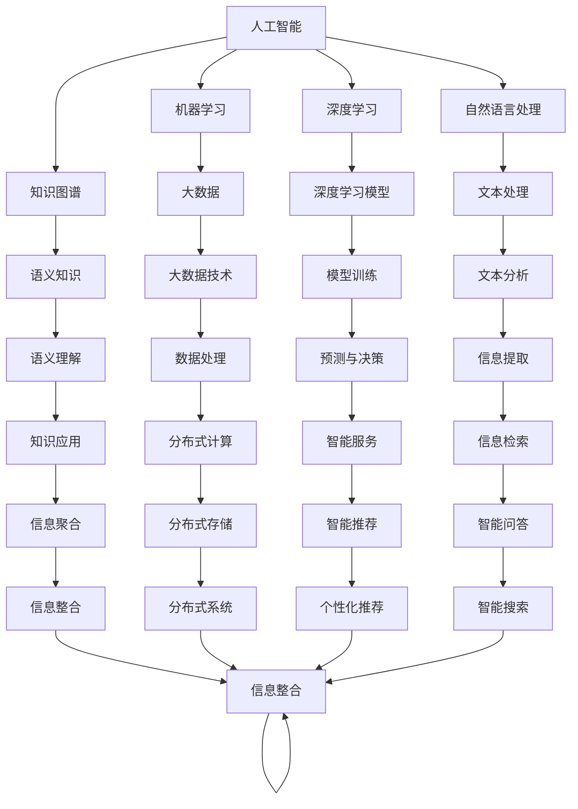

                 

## 1. 背景介绍

### 1.1 问题由来
在过去的一百年里，人类获取和处理信息的方式经历了多次重大变革。从纸张、书籍、无线电、电视、互联网，到今天的智能手机、物联网，信息技术的每一次进步都极大地改变了我们的生活方式。在21世纪，人工智能(AI)的崛起，尤其是机器学习和大数据技术的应用，更是彻底重塑了信息处理的范式。AI如何改变我们获取和处理信息的方式，成为了当前科技界乃至全社会关注的焦点。

### 1.2 问题核心关键点
1. **数据驱动决策**：在传统的信息获取和处理方式中，我们依赖专家知识和直觉进行决策。而AI通过大数据训练，能够从海量数据中挖掘出更加客观、精准的模式和规律。
2. **自动化信息处理**：AI能够自动进行信息检索、文本分类、语音识别等复杂的任务，极大地提升了信息处理的效率和准确性。
3. **个性化推荐**：基于用户行为数据和偏好，AI能够提供个性化的信息推荐，提升用户体验。
4. **多模态信息融合**：AI能够处理和融合文本、图像、语音等多模态信息，提供更全面、更丰富的信息服务。
5. **智能搜索与问答**：通过自然语言处理和知识图谱技术，AI能够进行智能搜索和自动问答，解决用户的查询需求。
6. **信息安全与隐私保护**：AI在信息安全领域的应用，如反欺诈、异常检测等，能够有效提升信息系统的安全性。同时，隐私保护技术的应用，如差分隐私、联邦学习等，保障了数据使用的安全性。

## 2. 核心概念与联系

### 2.1 核心概念概述

为了更好地理解AI如何改变信息处理方式，我们需要掌握以下几个核心概念：

- **人工智能(AI)**：使用算法和计算模型来模拟人类智能过程，包括感知、学习、推理和决策等能力。
- **机器学习(ML)**：一种从数据中学习模型，并使用该模型进行预测或决策的技术。
- **深度学习(DL)**：一种特殊的机器学习，通过多层次神经网络模型从大量数据中提取特征。
- **自然语言处理(NLP)**：使计算机能够理解、处理和生成人类语言的技术。
- **知识图谱(KG)**：一种结构化的语义知识表示方法，用于连接和组织不同领域的信息。
- **大数据(Big Data)**：超出传统数据库处理能力范围的数据集，通常用于分析和发现新模式。
- **联邦学习(Federated Learning)**：一种分布式机器学习方法，能够在保护用户隐私的前提下，联合多个数据源训练模型。

这些概念之间的联系可以通过以下Mermaid流程图来展示：



这个流程图展示了AI中各概念之间的逻辑关系：

- 人工智能是一个广泛的概念，包含多个子领域，如机器学习、深度学习、自然语言处理、知识图谱等。
- 大数据和深度学习模型是人工智能的重要基础，提供数据和模型支持。
- 知识图谱和自然语言处理技术用于处理和理解语义信息，提升信息处理的准确性和深度。
- 联邦学习等分布式技术保障了数据使用的安全性，同时提供了高效的模型训练方法。
- 最终，智能服务和智能推荐等应用将基于AI技术构建的信息系统服务于用户。

## 3. 核心算法原理 & 具体操作步骤
### 3.1 算法原理概述

AI通过机器学习和深度学习算法，能够从数据中学习模型，并利用该模型进行预测、分类、生成等任务。具体到信息处理，AI技术通过以下几个关键步骤实现：

1. **数据收集与预处理**：收集和清洗用于训练和测试的原始数据，确保数据质量和一致性。
2. **模型训练与优化**：使用训练数据对模型进行训练，并根据验证数据进行优化，以最小化模型误差。
3. **模型评估与验证**：通过测试数据评估模型的性能，并使用交叉验证等方法验证模型的泛化能力。
4. **模型部署与应用**：将训练好的模型部署到生产环境中，用于实际信息处理任务，如文本分类、智能推荐等。

### 3.2 算法步骤详解

以下是基于深度学习的AI信息处理算法的基本步骤：

1. **数据收集**：从互联网、社交媒体、交易记录等渠道收集相关的数据，形成大规模数据集。
2. **数据预处理**：清洗和格式化数据，包括去除噪声、归一化、分词等预处理步骤。
3. **特征提取**：从原始数据中提取有意义的特征，用于模型的训练。特征提取技术包括文本向量化、图像特征提取等。
4. **模型选择与设计**：选择适合的深度学习模型，并设计合适的网络结构和超参数。
5. **模型训练**：使用训练数据对模型进行前向传播和反向传播，不断更新模型参数，最小化损失函数。
6. **模型验证与调优**：在验证数据集上评估模型性能，调整超参数，优化模型结构。
7. **模型部署**：将训练好的模型部署到线上环境，用于实时处理和推荐。

### 3.3 算法优缺点

AI在信息处理方面的应用具有以下优点：

1. **高效性**：AI能够自动化处理大量复杂的信息任务，大幅提升信息处理效率。
2. **准确性**：基于大量数据训练的模型能够提供更准确的信息预测和分类。
3. **可扩展性**：AI系统可以通过添加更多数据和计算资源进行扩展，满足不同规模的需求。

同时，AI技术也存在一些缺点：

1. **数据依赖**：AI系统的性能高度依赖于数据质量，低质量数据可能导致模型效果不佳。
2. **可解释性**：许多AI模型（如深度学习）的决策过程难以解释，缺乏透明性。
3. **隐私与安全**：AI模型通常需要大量数据，涉及用户隐私问题，需注意数据保护。
4. **计算资源要求高**：训练和部署高质量AI模型需要高性能计算资源，成本较高。
5. **泛化能力**：模型过度拟合训练数据，可能导致在测试数据上表现不佳。

### 3.4 算法应用领域

AI技术在信息处理领域的应用非常广泛，以下是几个典型的应用领域：

1. **智能推荐系统**：如电商平台的商品推荐、视频网站的内容推荐等，通过用户行为数据进行个性化推荐。
2. **信息检索与问答**：如搜索引擎、智能问答系统，能够理解自然语言查询并返回相关结果。
3. **图像处理与识别**：如人脸识别、图像分类、医学影像分析等，通过深度学习处理图像数据。
4. **语音识别与合成**：如语音助手、语音识别设备，能够自动理解和生成语音。
5. **自然语言处理**：如情感分析、机器翻译、文本摘要等，通过文本数据进行语义分析和生成。
6. **医疗健康**：如疾病诊断、基因分析、药物研发等，通过医疗数据进行疾病预测和治疗方案推荐。

## 4. 数学模型和公式 & 详细讲解 & 举例说明

### 4.1 数学模型构建

我们以文本分类为例，构建一个简单的深度学习模型，用于判断给定文本是否属于某个类别。模型输入为文本序列，输出为类别标签。

记文本序列为 $x = (x_1, x_2, ..., x_n)$，其中 $x_i$ 为第 $i$ 个词的词向量表示。模型由一个嵌入层、多个卷积层和全连接层组成，输出一个类别概率分布。

数学模型如下：

$$
\hat{y} = \text{softmax}(Wx + b)
$$

其中 $W$ 和 $b$ 为模型参数，$x$ 为输入文本的词向量表示，$\text{softmax}$ 函数将输出转换为概率分布。

### 4.2 公式推导过程

对于文本分类任务，我们通常使用交叉熵损失函数进行模型训练。给定一个训练样本 $(x_i, y_i)$，其中 $y_i$ 为真实标签，模型的预测概率为 $\hat{y_i}$。交叉熵损失函数为：

$$
L(x_i, y_i) = -y_i\log\hat{y_i} - (1-y_i)\log(1-\hat{y_i})
$$

对于整个训练集 $\{(x_i, y_i)\}_{i=1}^N$，经验风险为：

$$
\mathcal{L}(W,b) = \frac{1}{N}\sum_{i=1}^N L(x_i, y_i)
$$

模型的目标是最小化经验风险，即：

$$
(W^*, b^*) = \mathop{\arg\min}_{W,b} \mathcal{L}(W,b)
$$

使用随机梯度下降（SGD）算法，模型的参数更新公式为：

$$
W \leftarrow W - \eta \frac{\partial \mathcal{L}(W,b)}{\partial W}
$$
$$
b \leftarrow b - \eta \frac{\partial \mathcal{L}(W,b)}{\partial b}
$$

其中 $\eta$ 为学习率，$\frac{\partial \mathcal{L}(W,b)}{\partial W}$ 和 $\frac{\partial \mathcal{L}(W,b)}{\partial b}$ 为损失函数对模型参数的梯度。

### 4.3 案例分析与讲解

以电商平台的商品推荐系统为例，使用协同过滤算法（Collaborative Filtering）进行个性化推荐。协同过滤算法通过分析用户行为数据，找到相似用户和相似物品，进行推荐。具体步骤如下：

1. **用户画像构建**：通过用户历史行为数据，构建用户画像。例如，记录用户购买、收藏、评分等行为。
2. **物品画像构建**：通过物品的历史交互数据，构建物品画像。例如，记录不同物品的浏览次数、购买次数、评分等。
3. **相似度计算**：使用余弦相似度或皮尔逊相关系数等方法，计算用户和物品之间的相似度。
4. **推荐生成**：根据相似度，使用协同过滤算法生成推荐结果。

## 5. 项目实践：代码实例和详细解释说明

### 5.1 开发环境搭建

为了进行AI项目实践，我们首先需要搭建开发环境。以下是使用Python和PyTorch进行深度学习开发的常见环境配置步骤：

1. 安装Anaconda：从官网下载并安装Anaconda，用于创建独立的Python环境。
2. 创建并激活虚拟环境：
```bash
conda create -n pytorch-env python=3.8 
conda activate pytorch-env
```
3. 安装PyTorch：根据CUDA版本，从官网获取对应的安装命令。例如：
```bash
conda install pytorch torchvision torchaudio cudatoolkit=11.1 -c pytorch -c conda-forge
```
4. 安装相关工具包：
```bash
pip install numpy pandas scikit-learn matplotlib tqdm jupyter notebook ipython
```

完成上述步骤后，即可在`pytorch-env`环境中开始项目实践。

### 5.2 源代码详细实现

以下是使用PyTorch实现文本分类的完整代码：

```python
import torch
import torch.nn as nn
import torch.optim as optim
from torch.utils.data import DataLoader
from sklearn.datasets import fetch_20newsgroups
from sklearn.model_selection import train_test_split

# 数据集处理
categories = ['alt.atheism', 'talk.religion.misc', 'comp.graphics', 'sci.med']
data = fetch_20newsgroups(subset='train', categories=categories)
train_data, test_data = train_test_split(data, test_size=0.2, random_state=42)

# 构建模型
class TextClassification(nn.Module):
    def __init__(self, embedding_dim=100, hidden_dim=128):
        super(TextClassification, self).__init__()
        self.embedding = nn.Embedding(len(data.vocabulary), embedding_dim)
        self.conv1 = nn.Conv1d(embedding_dim, hidden_dim, 3)
        self.maxpool = nn.MaxPool1d(2)
        self.fc1 = nn.Linear(hidden_dim * (len(train_data[0][0]) // 2), 128)
        self.fc2 = nn.Linear(128, len(categories))
        self.softmax = nn.Softmax(dim=1)

    def forward(self, x):
        x = self.embedding(x).permute(0, 2, 1)
        x = self.conv1(x)
        x = self.maxpool(x)
        x = x.view(x.size(0), -1)
        x = self.fc1(x)
        x = torch.relu(x)
        x = self.fc2(x)
        x = self.softmax(x)
        return x

# 训练模型
model = TextClassification()
optimizer = optim.Adam(model.parameters(), lr=0.001)
criterion = nn.CrossEntropyLoss()

train_loader = DataLoader(train_data.data, batch_size=32, shuffle=True)
test_loader = DataLoader(test_data.data, batch_size=32, shuffle=False)

for epoch in range(10):
    model.train()
    for batch in train_loader:
        optimizer.zero_grad()
        x, y = batch
        output = model(x)
        loss = criterion(output, y)
        loss.backward()
        optimizer.step()
    
    model.eval()
    correct = 0
    total = 0
    with torch.no_grad():
        for batch in test_loader:
            x, y = batch
            output = model(x)
            _, predicted = torch.max(output.data, 1)
            total += y.size(0)
            correct += (predicted == y).sum().item()
    
    print('Epoch [{}/{}], Loss: {:.4f}, Accuracy: {:.2f}%'.format(
        epoch+1, 10, loss.item(), 100 * correct / total))

```

### 5.3 代码解读与分析

让我们详细解读一下关键代码的实现细节：

- **数据集处理**：从Scikit-learn库中加载20newsgroups数据集，并将其分割为训练集和测试集。
- **模型构建**：定义一个包含嵌入层、卷积层、池化层、全连接层的文本分类模型。
- **训练模型**：使用Adam优化器和交叉熵损失函数，对模型进行前向传播、反向传播和参数更新。
- **评估模型**：在测试集上计算模型的准确率。

## 6. 实际应用场景

### 6.1 智能客服系统

智能客服系统通过自然语言处理和机器学习技术，能够自动理解客户咨询，提供快速响应和准确答复。具体应用场景如下：

1. **意图识别**：通过训练分类模型，系统能够自动理解客户的咨询意图，并为其推荐合适的解决方案。
2. **问答系统**：利用预训练语言模型和微调技术，系统能够自动回答常见问题，提升客户满意度。
3. **用户画像构建**：通过分析用户历史行为和反馈，系统能够构建用户画像，提供个性化的服务。
4. **多渠道整合**：系统能够整合不同渠道（如电话、邮件、社交媒体）的客户咨询，提供统一的服务体验。

### 6.2 金融舆情监测

金融舆情监测系统通过自然语言处理和情感分析技术，能够自动监测市场舆情，及时发现负面信息。具体应用场景如下：

1. **新闻爬取与文本分析**：通过爬取新闻和社交媒体，系统能够实时获取最新的市场信息。
2. **情感分析**：通过情感分析模型，系统能够判断市场情绪，预测股市走势。
3. **风险预警**：通过设置舆情预警阈值，系统能够自动发出风险预警信号，帮助金融机构规避风险。
4. **事件追踪**：通过追踪市场事件，系统能够分析事件对市场的影响，提供决策支持。

### 6.3 个性化推荐系统

个性化推荐系统通过协同过滤和深度学习技术，能够根据用户行为和兴趣，推荐个性化内容。具体应用场景如下：

1. **用户行为记录**：系统记录用户浏览、点击、评分等行为数据。
2. **物品画像构建**：系统记录不同物品的特征和用户互动情况。
3. **推荐算法**：系统使用协同过滤、深度学习等算法，生成个性化推荐结果。
4. **实时更新**：系统能够根据用户实时行为和反馈，动态更新推荐模型，提升推荐效果。

### 6.4 未来应用展望

随着AI技术的不断进步，未来AI在信息处理领域的应用将更加广泛和深入。以下是几个未来应用展望：

1. **多模态信息融合**：AI能够处理和融合文本、图像、语音等多模态信息，提供更全面、更丰富的信息服务。
2. **智能搜索与问答**：基于知识图谱和自然语言处理技术，AI能够提供智能搜索和自动问答，解决用户的查询需求。
3. **隐私保护与安全性**：通过差分隐私、联邦学习等技术，AI能够保障数据使用的安全性和隐私性。
4. **智能决策与规划**：AI能够结合大数据和领域知识，提供智能决策和规划支持，提升企业运营效率。
5. **自动化测试与优化**：AI能够自动进行系统测试和优化，提升软件质量和开发效率。
6. **智能制造与控制**：AI能够应用于工业控制、智能制造等领域，提升生产效率和产品质量。

## 7. 工具和资源推荐

### 7.1 学习资源推荐

为了帮助开发者系统掌握AI在信息处理方面的技术，以下是一些优质的学习资源：

1. **《深度学习》书籍**：Ian Goodfellow等作者所著，全面介绍了深度学习的基础理论和实践应用。
2. **Coursera机器学习课程**：由Andrew Ng教授主讲，覆盖机器学习的理论基础和实践技术。
3. **Kaggle数据科学竞赛**：提供大量实际数据集和竞赛任务，帮助开发者实践和提升AI技能。
4. **GitHub开源项目**：如TensorFlow、PyTorch等，提供了丰富的深度学习框架和应用案例。
5. **Hugging Face官方文档**：提供丰富的自然语言处理工具和预训练模型，方便开发者快速上手。

### 7.2 开发工具推荐

以下是几款用于AI开发和部署的常用工具：

1. **PyTorch**：灵活的深度学习框架，支持GPU/TPU等高性能计算。
2. **TensorFlow**：开源深度学习框架，支持分布式训练和推理。
3. **Jupyter Notebook**：交互式的编程环境，方便开发者进行模型调试和实验。
4. **Weights & Biases**：模型训练的实验跟踪工具，帮助开发者记录和分析实验结果。
5. **TensorBoard**：深度学习模型的可视化工具，方便开发者监控训练过程。
6. **Hugging Face Transformers**：提供丰富的预训练语言模型和任务适配器，方便开发者进行模型微调和应用。

### 7.3 相关论文推荐

以下是几篇在AI信息处理领域具有代表性的论文：

1. **《自然语言处理综述》**：Yoshua Bengio等作者，全面综述了自然语言处理领域的研究进展和应用场景。
2. **《深度学习在计算机视觉中的应用》**：Leon Bottou等作者，介绍了深度学习在图像处理和计算机视觉中的应用。
3. **《协同过滤算法》**：Simon Lenssen等作者，探讨了协同过滤算法在推荐系统中的应用和优化。
4. **《联邦学习：分布式机器学习框架》**：John C. Duchi等作者，介绍了联邦学习的基本原理和应用。
5. **《差分隐私：保护隐私的计算模型》**：Cynthia Dwork等作者，介绍了差分隐私的概念和应用。

这些论文代表了AI信息处理领域的研究前沿，通过学习这些前沿成果，可以帮助研究者把握学科前进方向，激发更多的创新灵感。

## 8. 总结：未来发展趋势与挑战

### 8.1 研究成果总结

AI在信息处理领域的探索和应用，极大地推动了相关技术和产业的发展。通过深度学习、自然语言处理、知识图谱等技术的不断创新，AI系统能够更好地理解、处理和生成信息，提升了信息处理的效率和准确性。

### 8.2 未来发展趋势

展望未来，AI在信息处理领域的应用将更加广泛和深入。以下是几个未来发展趋势：

1. **多模态信息融合**：AI能够处理和融合文本、图像、语音等多模态信息，提供更全面、更丰富的信息服务。
2. **智能搜索与问答**：基于知识图谱和自然语言处理技术，AI能够提供智能搜索和自动问答，解决用户的查询需求。
3. **隐私保护与安全性**：通过差分隐私、联邦学习等技术，AI能够保障数据使用的安全性和隐私性。
4. **智能决策与规划**：AI能够结合大数据和领域知识，提供智能决策和规划支持，提升企业运营效率。
5. **自动化测试与优化**：AI能够自动进行系统测试和优化，提升软件质量和开发效率。
6. **智能制造与控制**：AI能够应用于工业控制、智能制造等领域，提升生产效率和产品质量。

### 8.3 面临的挑战

尽管AI在信息处理领域取得了显著进展，但仍面临一些挑战：

1. **数据质量和数量**：AI系统的性能高度依赖于数据质量，低质量数据可能导致模型效果不佳。
2. **计算资源要求高**：训练和部署高质量AI模型需要高性能计算资源，成本较高。
3. **模型复杂性和可解释性**：许多AI模型（如深度学习）的决策过程难以解释，缺乏透明性。
4. **隐私与安全**：AI模型通常需要大量数据，涉及用户隐私问题，需注意数据保护。
5. **泛化能力**：模型过度拟合训练数据，可能导致在测试数据上表现不佳。

### 8.4 研究展望

面对这些挑战，未来的研究需要在以下几个方面寻求新的突破：

1. **无监督和半监督学习**：摆脱对大规模标注数据的依赖，利用自监督学习、主动学习等无监督和半监督范式，最大限度利用非结构化数据。
2. **参数高效和计算高效**：开发更加参数高效的微调方法，在固定大部分预训练参数的同时，只更新极少量的任务相关参数。同时优化模型计算图，减少前向传播和反向传播的资源消耗。
3. **多模态数据处理**：结合视觉、语音、文本等多模态数据，进行综合建模和分析。
4. **可解释性与透明性**：引入因果推断和博弈论思想，增强模型决策的可解释性和透明性。
5. **隐私保护与安全**：在模型训练和应用中，引入差分隐私、联邦学习等技术，保障数据使用的安全性和隐私性。

通过这些研究方向和技术突破，AI在信息处理领域的应用将更加广泛和深入，为社会带来更多价值和便利。

## 9. 附录：常见问题与解答

**Q1: 什么是自然语言处理（NLP）？**

A: 自然语言处理（NLP）是一种计算机科学领域，涉及使计算机能够理解、处理和生成自然语言（如英语、中文等）的技术。NLP技术包括文本分类、信息检索、机器翻译、情感分析等，广泛应用于搜索引擎、智能客服、翻译软件等领域。

**Q2: 什么是协同过滤算法？**

A: 协同过滤算法是一种推荐系统中的常用技术，通过分析用户和物品之间的相似性，推荐用户可能感兴趣的新物品。协同过滤算法分为基于用户的协同过滤和基于物品的协同过滤两种。

**Q3: 什么是差分隐私？**

A: 差分隐私是一种隐私保护技术，通过在数据中引入噪声，使得任何个体数据的泄露都不会影响其他个体数据的隐私性。差分隐私常用于保护用户数据隐私，同时允许数据分析和机器学习。

**Q4: 什么是联邦学习？**

A: 联邦学习是一种分布式机器学习方法，多个节点在本地训练模型，然后将模型参数汇总，进行全局更新。联邦学习常用于保护用户数据隐私，同时提高模型性能。

**Q5: 什么是知识图谱？**

A: 知识图谱是一种结构化的语义知识表示方法，用于连接和组织不同领域的信息。知识图谱通常由节点和边组成，节点表示实体或属性，边表示实体之间的关系。

**Q6: 什么是深度学习？**

A: 深度学习是一种机器学习技术，通过构建多层次的神经网络模型，自动学习数据中的特征和模式。深度学习广泛应用于图像识别、语音识别、自然语言处理等领域。

通过这些问题的回答，希望能帮助你更好地理解AI在信息处理方面的应用和前景，并激发更多的学习和研究热情。

---

作者：禅与计算机程序设计艺术 / Zen and the Art of Computer Programming

