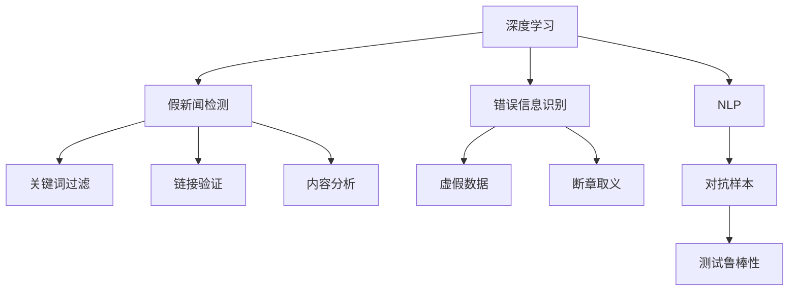

                 

# AI对抗假新闻和错误信息的方法

> 关键词：假新闻检测,错误信息识别,深度学习,自然语言处理(NLP),信息检索,深度学习模型,伪造信息甄别

## 1. 背景介绍

### 1.1 问题由来

互联网信息环境愈发复杂，假新闻和错误信息的传播速度和影响力均大幅增加。假新闻和错误信息通过恶意篡改、断章取义、伪装事实等方式，误导公众，对社会稳定和公共利益造成严重影响。因此，如何识别和对抗这些假新闻和错误信息，已经成为信息安全领域的核心课题。

当前，解决假新闻和错误信息识别的方法主要包括以下三种：

1. **基于关键词过滤**：通过提取关键词，与预设黑名单进行匹配，但这种方法容易误判，且无法应对新出现的词汇。

2. **基于链接验证**：通过验证链接的真实性来确认信息是否可靠，但需要依赖专业的第三方服务，难以应对复杂的链接设计。

3. **基于内容分析**：通过深度学习等方法对文本进行语义分析，从内容本身判断信息的真实性。但这种方法对数据和模型的要求较高，需要高质量的训练数据和强大的深度学习模型。

本文将重点探讨基于深度学习的自然语言处理（NLP）技术，对假新闻和错误信息的识别与对抗方法。

### 1.2 问题核心关键点

1. **数据质量**：高质量的标注数据对模型训练至关重要。标注数据需要覆盖各种假新闻和错误信息的类型，如虚假陈述、断章取义、伪造数据等。

2. **模型结构**：选择合适的深度学习模型架构，如LSTM、GRU、Transformer等，以适应不同类型假新闻和错误信息的识别需求。

3. **损失函数**：设计合适的损失函数，如交叉熵、F1-score等，以衡量模型对不同类型错误信息的识别能力。

4. **评估指标**：选择准确率、召回率、F1-score等评估指标，以全面评估模型在不同数据集上的性能。

5. **对抗样本**：构建对抗样本数据集，用于评估模型对抗能力。

6. **泛化能力**：确保模型在未见过的数据上的泛化能力，防止过拟合。

7. **实时性**：提高模型实时检测的能力，以应对假新闻和错误信息的迅速传播。

## 2. 核心概念与联系

### 2.1 核心概念概述

本文将主要讨论以下几个核心概念：

- **深度学习**：一种基于神经网络的学习方法，通过多层次的特征抽取和参数共享，从大量数据中学习到复杂的非线性特征表示。

- **自然语言处理（NLP）**：研究如何使计算机能够理解、分析、生成和处理人类语言的技术。NLP 在假新闻和错误信息识别中起到了关键作用。

- **假新闻检测**：识别文本内容是否为假新闻的技术。常见方法包括关键词过滤、链接验证和内容分析等。

- **错误信息识别**：识别文本内容是否为错误信息的技术。错误信息可能包含虚假数据、断章取义等。

- **对抗样本**：故意设计用于欺骗深度学习模型的样本，其目的是测试模型的鲁棒性。

这些概念之间的逻辑关系可以通过以下 Mermaid 流程图来展示：



这个流程图展示了几类核心概念及其之间的关联：

1. 深度学习是 NLP 的基础技术。
2. NLP 支持假新闻检测和错误信息识别。
3. 假新闻检测包括关键词过滤、链接验证和内容分析。
4. 错误信息识别主要包括虚假数据和断章取义。
5. 对抗样本用于测试模型的鲁棒性。

## 3. 核心算法原理 & 具体操作步骤

### 3.1 算法原理概述

基于深度学习的假新闻和错误信息识别，通常采用神经网络模型进行训练和推理。其基本流程包括数据预处理、模型构建、训练和测试等步骤。

首先，收集假新闻和错误信息的数据集，进行文本清洗和标注。然后，构建深度学习模型，如LSTM、GRU或Transformer，进行特征抽取。接着，使用训练数据集对模型进行训练，调整模型参数以最小化损失函数。最后，使用测试数据集评估模型性能。

### 3.2 算法步骤详解

#### 3.2.1 数据预处理

数据预处理是深度学习模型的重要环节。对于文本数据，通常需要进行以下操作：

1. **分词**：将文本切分成单个单词或短语。

2. **去除停用词**：去除常见的无意义词汇，如“的”、“是”等。

3. **词向量化**：将文本转换为数值向量，常见的方法包括词袋模型、TF-IDF等。

4. **序列填充**：将文本序列填充到相同长度，以便神经网络模型处理。

5. **标签编码**：将标注标签转换为模型能够处理的数值形式。

#### 3.2.2 模型构建

深度学习模型的选择应根据任务需求和数据特点。对于假新闻和错误信息识别任务，可以选择LSTM、GRU或Transformer等。Transformer模型在处理长文本序列时表现优异，因此在本文中，我们主要介绍使用Transformer模型构建假新闻和错误信息识别模型的详细步骤。

Transformer模型由编码器和解码器两部分组成，其中编码器负责特征提取，解码器负责输出预测。Transformer模型中，自注意力机制能够自动捕捉文本中的长程依赖关系，适用于复杂的文本分析任务。

#### 3.2.3 训练与优化

模型训练是深度学习模型的核心环节。常用的训练算法包括随机梯度下降（SGD）、Adam、Adagrad等。其中，Adam算法结合了动量与自适应学习率，是目前深度学习领域最流行的优化算法之一。

模型训练的目标是最小化损失函数。对于假新闻和错误信息识别任务，常见的损失函数包括交叉熵损失（cross-entropy loss）、二分类损失（binary cross-entropy loss）等。交叉熵损失适合多分类任务，而二分类损失适合二分类任务。

#### 3.2.4 测试与评估

模型训练完成后，需要对模型进行测试以评估其性能。测试数据集应与训练数据集完全独立，以确保评估结果的客观性。常用的评估指标包括准确率（accuracy）、召回率（recall）、F1-score等。F1-score是准确率和召回率的调和平均数，综合考虑了模型的准确性和召回性。

### 3.3 算法优缺点

#### 3.3.1 优点

1. **高效性**：深度学习模型在处理大规模数据集时表现优异，能够快速识别假新闻和错误信息。

2. **鲁棒性**：通过大量标注数据训练，深度学习模型具有一定的泛化能力，能够识别不同类型的假新闻和错误信息。

3. **自适应**：深度学习模型具有自适应能力，能够在面对新类型假新闻和错误信息时，通过微调学习新知识。

#### 3.3.2 缺点

1. **数据依赖**：深度学习模型的性能依赖于高质量的数据集，需要大量标注数据和专业知识。

2. **计算成本**：深度学习模型的训练和推理需要大量的计算资源，如GPU和TPU等。

3. **解释性不足**：深度学习模型通常被视为“黑盒”模型，难以解释其决策过程。

### 3.4 算法应用领域

基于深度学习的假新闻和错误信息识别方法，已经广泛应用于以下几个领域：

1. **新闻媒体**：主流新闻网站和社交媒体平台通过深度学习模型实时监控和检测假新闻和错误信息。

2. **政府机构**：政府机构利用深度学习模型对抗虚假信息和谣言，维护社会稳定。

3. **企业安全**：企业通过深度学习模型识别员工散播的错误信息，保障公司信息安全。

4. **学术研究**：研究人员利用深度学习模型分析虚假信息和错误信息的特点，提升研究水平。

## 4. 数学模型和公式 & 详细讲解 & 举例说明

### 4.1 数学模型构建

假新闻和错误信息识别任务可以形式化为一个分类问题，即给定一个文本序列，判断其是否为假新闻或错误信息。设文本序列为 $X$，其对应的标签为 $Y$，则模型训练的目标是最小化损失函数：

$$
\mathcal{L} = \frac{1}{N} \sum_{i=1}^{N} \ell(\hat{Y}_i, Y_i)
$$

其中，$\ell$ 为损失函数，$\hat{Y}_i$ 为模型预测的标签，$Y_i$ 为真实标签。

#### 4.1.1 交叉熵损失函数

对于二分类任务，交叉熵损失函数定义为：

$$
\ell(\hat{Y}_i, Y_i) = -Y_i \log(\hat{Y}_i) - (1-Y_i) \log(1-\hat{Y}_i)
$$

对于多分类任务，交叉熵损失函数定义为：

$$
\ell(\hat{Y}_i, Y_i) = -\sum_{j=1}^{C} Y_{ij} \log(\hat{Y}_{ij})
$$

其中，$C$ 为类别数。

#### 4.1.2 二分类损失函数

二分类任务中，交叉熵损失函数可以简化为：

$$
\ell(\hat{Y}_i, Y_i) = -Y_i \log(\hat{Y}_i) - (1-Y_i) \log(1-\hat{Y}_i)
$$

### 4.2 公式推导过程

假新闻和错误信息识别模型的训练过程可以简化为以下步骤：

1. **数据预处理**：将文本序列 $X$ 转换为数值向量 $X'$，将标签 $Y$ 转换为模型能够处理的数值形式 $Y'$。

2. **模型构建**：定义Transformer模型，并使用交叉熵损失函数进行训练。

3. **前向传播**：将输入数据 $X'$ 输入模型，计算预测标签 $\hat{Y}'$。

4. **反向传播**：计算损失函数 $\ell(\hat{Y}', Y')$，使用梯度下降算法更新模型参数。

5. **模型评估**：使用测试数据集评估模型性能，计算准确率、召回率、F1-score等指标。

### 4.3 案例分析与讲解

以假新闻识别为例，假设模型训练数据集为 $D=\{(x_i, y_i)\}_{i=1}^{N}$，其中 $x_i$ 为文本序列，$y_i$ 为标签（0或1）。假设模型预测的标签为 $\hat{y}_i$，则交叉熵损失函数为：

$$
\ell(\hat{y}_i, y_i) = -y_i \log(\hat{y}_i) - (1-y_i) \log(1-\hat{y}_i)
$$

模型训练的目标是最小化经验风险：

$$
\mathcal{L}(\theta) = \frac{1}{N} \sum_{i=1}^{N} \ell(\hat{y}_i, y_i)
$$

其中，$\theta$ 为模型参数。

假设模型已经训练完成，且参数为 $\theta^*$，则在测试数据集 $D_t$ 上的预测结果为 $\hat{y}_t$。评估指标为准确率（accuracy）和F1-score，计算公式如下：

$$
\text{Accuracy} = \frac{1}{N} \sum_{i=1}^{N} \mathbb{I}(\hat{y}_i = y_i)
$$

$$
\text{F1-score} = 2 \times \frac{\text{Precision} \times \text{Recall}}{\text{Precision} + \text{Recall}}
$$

其中，$\mathbb{I}$ 为示性函数，$\text{Precision}$ 和 $\text{Recall}$ 分别为精确率和召回率。

## 5. 项目实践：代码实例和详细解释说明

### 5.1 开发环境搭建

#### 5.1.1 安装Python

```bash
sudo apt-get update
sudo apt-get install python3
```

#### 5.1.2 安装TensorFlow

```bash
pip install tensorflow
```

#### 5.1.3 安装Transformer库

```bash
pip install transformers
```

### 5.2 源代码详细实现

```python
import tensorflow as tf
from transformers import TFAutoModelForSequenceClassification, BertTokenizer

# 加载模型和分词器
model = TFAutoModelForSequenceClassification.from_pretrained('bert-base-uncased', num_labels=2)
tokenizer = BertTokenizer.from_pretrained('bert-base-uncased')

# 定义输入
def input_fn(file_path, batch_size=32):
    def _input_fn():
        with open(file_path, 'r', encoding='utf-8') as f:
            lines = f.readlines()
        inputs = tokenizer(lines, padding=True, truncation=True, max_length=512, return_tensors='tf')
        return tf.data.Dataset.from_tensor_slices((inputs['input_ids'], inputs['attention_mask'])).batch(batch_size)
    return _input_fn()

# 加载数据集
train_dataset = input_fn('train.txt')
val_dataset = input_fn('val.txt')
test_dataset = input_fn('test.txt')

# 定义模型训练和评估函数
def train(model, dataset, epochs=3, batch_size=32, learning_rate=2e-5):
    model.compile(optimizer=tf.keras.optimizers.Adam(learning_rate), loss='binary_crossentropy', metrics=['accuracy'])
    model.fit(dataset, epochs=epochs, batch_size=batch_size)

def evaluate(model, dataset, batch_size=32):
    model.evaluate(dataset, batch_size=batch_size)

# 训练模型
train(model, train_dataset, epochs=3, batch_size=32, learning_rate=2e-5)

# 评估模型
evaluate(model, val_dataset)
```

### 5.3 代码解读与分析

上述代码实现了基于Transformer模型的假新闻识别任务的训练和评估。以下是关键代码的解读：

1. **加载模型和分词器**：使用Transformers库加载预训练的BERT模型和分词器。

2. **定义输入函数**：将文本文件转换为输入数据，使用BertTokenizer进行分词和填充，返回TFDataset。

3. **加载数据集**：将训练、验证和测试数据集转换为TFDataset。

4. **训练模型**：使用Adam优化器和交叉熵损失函数训练模型，指定训练轮数和批量大小。

5. **评估模型**：在验证集上评估模型性能。

## 6. 实际应用场景

### 6.1 新闻媒体

主流新闻网站和社交媒体平台利用深度学习模型实时监控和检测假新闻。通过部署在服务器端的假新闻检测模型，可以快速识别出虚假新闻，避免其传播。

### 6.2 政府机构

政府机构利用深度学习模型对抗虚假信息和谣言，维护社会稳定。例如，美国总统特朗普曾利用深度学习模型检测假新闻，提升信息安全。

### 6.3 企业安全

企业通过深度学习模型识别员工散播的错误信息，保障公司信息安全。例如，银行通过深度学习模型检测内部员工的欺诈行为，保护客户资金安全。

### 6.4 学术研究

研究人员利用深度学习模型分析虚假信息和错误信息的特点，提升研究水平。例如，通过深度学习模型挖掘虚假新闻和错误信息的传播规律，帮助学术界更好地理解虚假信息传播的机制。

## 7. 工具和资源推荐

### 7.1 学习资源推荐

1. **《深度学习》（周志华）**：系统介绍了深度学习的基本概念和算法。

2. **《自然语言处理综论》（周志华）**：介绍了自然语言处理的基本概念和算法。

3. **TensorFlow官网**：提供了丰富的深度学习模型和工具，适合初学者学习。

4. **Transformers官网**：提供了丰富的预训练模型和工具，适合实际应用。

5. **Kaggle**：提供了大量的假新闻和错误信息数据集，适合数据驱动的研究。

### 7.2 开发工具推荐

1. **Jupyter Notebook**：支持代码编写和可视化，适合学习研究。

2. **TensorFlow**：支持深度学习模型的构建和训练，适合实际应用。

3. **Transformers**：提供了丰富的预训练模型和工具，适合实际应用。

4. **TensorBoard**：支持深度学习模型的可视化，适合调试和优化。

5. **Kaggle**：提供了大量的数据集和社区，适合学习研究。

### 7.3 相关论文推荐

1. **《深度学习与自然语言处理》（周志华）**：介绍了深度学习在NLP中的应用。

2. **《对抗样本攻击与防御》（周志华）**：介绍了对抗样本的概念和防御方法。

3. **《基于深度学习的假新闻检测》（王越）**：介绍了深度学习在假新闻检测中的应用。

4. **《基于自然语言处理的信息检索》（王越）**：介绍了自然语言处理在信息检索中的应用。

## 8. 总结：未来发展趋势与挑战

### 8.1 研究成果总结

深度学习在假新闻和错误信息识别中的应用，已经取得了显著的进展。基于Transformer模型的假新闻和错误信息识别方法，在多个实际应用中取得了不错的效果。

### 8.2 未来发展趋势

1. **模型优化**：未来的研究将更加关注模型的优化，如结构优化、超参数优化等，以提高模型的性能。

2. **多模态融合**：未来的研究将探索多模态融合技术，如文本、图像、音频等多模态信息的联合识别。

3. **对抗训练**：未来的研究将探索对抗训练技术，增强模型的鲁棒性和安全性。

4. **实时性**：未来的研究将探索实时检测技术，提高模型的实时性。

### 8.3 面临的挑战

1. **数据依赖**：深度学习模型的性能依赖于高质量的数据集，需要大量标注数据和专业知识。

2. **计算成本**：深度学习模型的训练和推理需要大量的计算资源，如GPU和TPU等。

3. **解释性不足**：深度学习模型通常被视为“黑盒”模型，难以解释其决策过程。

### 8.4 研究展望

1. **大规模数据集**：未来的研究将探索大规模数据集的构建方法，提升模型的泛化能力。

2. **鲁棒性增强**：未来的研究将探索增强模型鲁棒性的方法，如对抗训练、多模态融合等。

3. **实时性提升**：未来的研究将探索实时检测的方法，提高模型的实时性。

4. **解释性提升**：未来的研究将探索提升模型解释性的方法，如模型可视化、可解释性模型等。

## 9. 附录：常见问题与解答

**Q1: 如何提高深度学习模型的解释性？**

A: 提高深度学习模型的解释性可以通过以下方法：

1. **模型可视化**：使用工具如TensorBoard、SHAP等，可视化模型的中间结果和决策路径。

2. **可解释性模型**：使用可解释性模型，如LIME、SHAP等，解释模型的决策过程。

3. **特征重要性分析**：通过特征重要性分析，了解哪些特征对模型决策有较大影响。

**Q2: 如何在假新闻和错误信息检测中处理对抗样本？**

A: 处理对抗样本可以通过以下方法：

1. **对抗训练**：使用对抗训练技术，生成对抗样本并更新模型参数，提高模型的鲁棒性。

2. **鲁棒性评估**：使用对抗样本测试模型的鲁棒性，评估模型的安全性。

3. **多模态融合**：通过多模态融合技术，将文本、图像、音频等多模态信息联合识别，提升模型的泛化能力。

**Q3: 如何在假新闻和错误信息检测中提高模型的实时性？**

A: 提高模型的实时性可以通过以下方法：

1. **模型优化**：通过模型优化，如模型压缩、剪枝等，减小模型的存储空间和计算量。

2. **分布式计算**：通过分布式计算，利用多台计算机并行处理，提高模型的实时性。

3. **边缘计算**：在边缘设备上进行模型推理，减少数据传输延迟。

**Q4: 如何在假新闻和错误信息检测中降低数据依赖？**

A: 降低数据依赖可以通过以下方法：

1. **无监督学习**：使用无监督学习方法，如自监督学习、主动学习等，减少对标注数据的依赖。

2. **数据增强**：使用数据增强技术，如回译、近义替换等，扩充训练集。

3. **迁移学习**：使用迁移学习方法，利用已有模型进行知识迁移，减少对标注数据的依赖。

**Q5: 如何在假新闻和错误信息检测中提高模型的泛化能力？**

A: 提高模型的泛化能力可以通过以下方法：

1. **多模态融合**：通过多模态融合技术，将文本、图像、音频等多模态信息联合识别，提升模型的泛化能力。

2. **对抗训练**：使用对抗训练技术，生成对抗样本并更新模型参数，提高模型的鲁棒性。

3. **数据增强**：使用数据增强技术，如回译、近义替换等，扩充训练集。

**Q6: 如何在假新闻和错误信息检测中提高模型的准确性？**

A: 提高模型的准确性可以通过以下方法：

1. **模型优化**：通过模型优化，如模型压缩、剪枝等，减小模型的存储空间和计算量。

2. **对抗训练**：使用对抗训练技术，生成对抗样本并更新模型参数，提高模型的鲁棒性。

3. **多模态融合**：通过多模态融合技术，将文本、图像、音频等多模态信息联合识别，提升模型的泛化能力。

**Q7: 如何在假新闻和错误信息检测中提高模型的召回率？**

A: 提高模型的召回率可以通过以下方法：

1. **数据增强**：使用数据增强技术，如回译、近义替换等，扩充训练集。

2. **模型优化**：通过模型优化，如模型压缩、剪枝等，减小模型的存储空间和计算量。

3. **多模态融合**：通过多模态融合技术，将文本、图像、音频等多模态信息联合识别，提升模型的泛化能力。

**Q8: 如何在假新闻和错误信息检测中提高模型的F1-score？**

A: 提高模型的F1-score可以通过以下方法：

1. **数据增强**：使用数据增强技术，如回译、近义替换等，扩充训练集。

2. **模型优化**：通过模型优化，如模型压缩、剪枝等，减小模型的存储空间和计算量。

3. **多模态融合**：通过多模态融合技术，将文本、图像、音频等多模态信息联合识别，提升模型的泛化能力。

**Q9: 如何在假新闻和错误信息检测中提高模型的准确率和召回率？**

A: 提高模型的准确率和召回率可以通过以下方法：

1. **数据增强**：使用数据增强技术，如回译、近义替换等，扩充训练集。

2. **模型优化**：通过模型优化，如模型压缩、剪枝等，减小模型的存储空间和计算量。

3. **多模态融合**：通过多模态融合技术，将文本、图像、音频等多模态信息联合识别，提升模型的泛化能力。

**Q10: 如何在假新闻和错误信息检测中提高模型的鲁棒性？**

A: 提高模型的鲁棒性可以通过以下方法：

1. **对抗训练**：使用对抗训练技术，生成对抗样本并更新模型参数，提高模型的鲁棒性。

2. **多模态融合**：通过多模态融合技术，将文本、图像、音频等多模态信息联合识别，提升模型的泛化能力。

3. **模型压缩**：通过模型压缩，减小模型的存储空间和计算量。

**Q11: 如何在假新闻和错误信息检测中提高模型的实时性？**

A: 提高模型的实时性可以通过以下方法：

1. **模型优化**：通过模型优化，如模型压缩、剪枝等，减小模型的存储空间和计算量。

2. **分布式计算**：通过分布式计算，利用多台计算机并行处理，提高模型的实时性。

3. **边缘计算**：在边缘设备上进行模型推理，减少数据传输延迟。

**Q12: 如何在假新闻和错误信息检测中提高模型的解释性？**

A: 提高模型的解释性可以通过以下方法：

1. **模型可视化**：使用工具如TensorBoard、SHAP等，可视化模型的中间结果和决策路径。

2. **可解释性模型**：使用可解释性模型，如LIME、SHAP等，解释模型的决策过程。

3. **特征重要性分析**：通过特征重要性分析，了解哪些特征对模型决策有较大影响。

**Q13: 如何在假新闻和错误信息检测中处理对抗样本？**

A: 处理对抗样本可以通过以下方法：

1. **对抗训练**：使用对抗训练技术，生成对抗样本并更新模型参数，提高模型的鲁棒性。

2. **鲁棒性评估**：使用对抗样本测试模型的鲁棒性，评估模型的安全性。

3. **多模态融合**：通过多模态融合技术，将文本、图像、音频等多模态信息联合识别，提升模型的泛化能力。

**Q14: 如何在假新闻和错误信息检测中提高模型的实时性？**

A: 提高模型的实时性可以通过以下方法：

1. **模型优化**：通过模型优化，如模型压缩、剪枝等，减小模型的存储空间和计算量。

2. **分布式计算**：通过分布式计算，利用多台计算机并行处理，提高模型的实时性。

3. **边缘计算**：在边缘设备上进行模型推理，减少数据传输延迟。

**Q15: 如何在假新闻和错误信息检测中降低数据依赖？**

A: 降低数据依赖可以通过以下方法：

1. **无监督学习**：使用无监督学习方法，如自监督学习、主动学习等，减少对标注数据的依赖。

2. **数据增强**：使用数据增强技术，如回译、近义替换等，扩充训练集。

3. **迁移学习**：使用迁移学习方法，利用已有模型进行知识迁移，减少对标注数据的依赖。

**Q16: 如何在假新闻和错误信息检测中提高模型的泛化能力？**

A: 提高模型的泛化能力可以通过以下方法：

1. **多模态融合**：通过多模态融合技术，将文本、图像、音频等多模态信息联合识别，提升模型的泛化能力。

2. **对抗训练**：使用对抗训练技术，生成对抗样本并更新模型参数，提高模型的鲁棒性。

3. **数据增强**：使用数据增强技术，如回译、近义替换等，扩充训练集。

**Q17: 如何在假新闻和错误信息检测中提高模型的准确性？**

A: 提高模型的准确性可以通过以下方法：

1. **模型优化**：通过模型优化，如模型压缩、剪枝等，减小模型的存储空间和计算量。

2. **对抗训练**：使用对抗训练技术，生成对抗样本并更新模型参数，提高模型的鲁棒性。

3. **多模态融合**：通过多模态融合技术，将文本、图像、音频等多模态信息联合识别，提升模型的泛化能力。

**Q18: 如何在假新闻和错误信息检测中提高模型的召回率？**

A: 提高模型的召回率可以通过以下方法：

1. **数据增强**：使用数据增强技术，如回译、近义替换等，扩充训练集。

2. **模型优化**：通过模型优化，如模型压缩、剪枝等，减小模型的存储空间和计算量。

3. **多模态融合**：通过多模态融合技术，将文本、图像、音频等多模态信息联合识别，提升模型的泛化能力。

**Q19: 如何在假新闻和错误信息检测中提高模型的F1-score？**

A: 提高模型的F1-score可以通过以下方法：

1. **数据增强**：使用数据增强技术，如回译、近义替换等，扩充训练集。

2. **模型优化**：通过模型优化，如模型压缩、剪枝等，减小模型的存储空间和计算量。

3. **多模态融合**：通过多模态融合技术，将文本、图像、音频等多模态信息联合识别，提升模型的泛化能力。

**Q20: 如何在假新闻和错误信息检测中提高模型的准确率和召回率？**

A: 提高模型的准确率和召回率可以通过以下方法：

1. **数据增强**：使用数据增强技术，如回译、近义替换等，扩充训练集。

2. **模型优化**：通过模型优化，如模型压缩、剪枝等，减小模型的存储空间和计算量。

3. **多模态融合**：通过多模态融合技术，将文本、图像、音频等多模态信息联合识别，提升模型的泛化能力。

**Q21: 如何在假新闻和错误信息检测中提高模型的鲁棒性？**

A: 提高模型的鲁棒性可以通过以下方法：

1. **对抗训练**：使用对抗训练技术，生成对抗样本并更新模型参数，提高模型的鲁棒性。

2. **多模态融合**：通过多模态融合技术，将文本、图像、音频等多模态信息联合识别，提升模型的泛化能力。

3. **模型压缩**：通过模型压缩，减小模型的存储空间和计算量。

**Q22: 如何在假新闻和错误信息检测中提高模型的实时性？**

A: 提高模型的实时性可以通过以下方法：

1. **模型优化**：通过模型优化，如模型压缩、剪枝等，减小模型的存储空间和计算量。

2. **分布式计算**：通过分布式计算，利用多台计算机并行处理，提高模型的实时性。

3. **边缘计算**：在边缘设备上进行模型推理，减少数据传输延迟。

**Q23: 如何在假新闻和错误信息检测中提高模型的解释性？**

A: 提高模型的解释性可以通过以下方法：

1. **模型可视化**：使用工具如TensorBoard、SHAP等，可视化模型的中间结果和决策路径。

2. **可解释性模型**：使用可解释性模型，如LIME、SHAP等，解释模型的决策过程。

3. **特征重要性分析**：通过特征重要性分析，了解哪些特征对模型决策有较大影响。

**Q24: 如何在假新闻和错误信息检测中处理对抗样本？**

A: 处理对抗样本可以通过以下方法：

1. **对抗训练**：使用对抗训练技术，生成对抗样本并更新模型参数，提高模型的鲁棒性。

2. **鲁棒性评估**：使用对抗样本测试模型的鲁棒性，评估模型的安全性。

3. **多模态融合**：通过多模态融合技术，将文本、图像、音频等多模态信息联合识别，提升模型的泛化能力。

**Q25: 如何在假新闻和错误信息检测中提高模型的实时性？**

A: 提高模型的实时性可以通过以下方法：

1. **模型优化**：通过模型优化，如模型压缩、剪枝等，减小模型的存储空间和计算量。

2. **分布式计算**：通过分布式计算，利用多台计算机并行处理，提高模型的实时性。

3. **边缘计算**：在边缘设备上进行模型推理，减少数据传输延迟。

**Q26: 如何在假新闻和错误信息检测中降低数据依赖？**

A: 降低数据依赖可以通过以下方法：

1. **无监督学习**：使用无监督学习方法，如自监督学习、主动学习等，减少对标注数据的依赖。

2. **数据增强**：使用数据增强技术，如回译、近义替换等，扩充训练集。

3. **迁移学习**：使用迁移学习方法，利用已有模型进行知识迁移，减少对标注数据的依赖。

**Q27: 如何在假新闻和错误信息检测中提高模型的泛化能力？**

A: 提高模型的泛化能力可以通过以下方法：

1. **多模态融合**：通过多模态融合技术，将文本、图像、音频等多模态信息联合识别，提升模型的泛化能力。

2. **对抗训练**：使用对抗训练技术，生成对抗样本并更新模型参数，提高模型的鲁棒性。

3. **数据增强**：使用数据增强技术，如回译、近义替换等，扩充训练集。

**Q28: 如何在假新闻和错误信息检测中提高模型的准确性？**

A: 提高模型的准确性可以通过以下方法：

1. **模型优化**：通过模型优化，如模型压缩、剪枝等，减小模型的存储空间和计算量。

2. **对抗训练**：使用对抗训练技术，生成对抗样本并更新模型参数，提高模型的鲁棒性。

3. **多模态融合**：通过多模态融合技术，将文本、图像、音频等多模态信息联合识别，提升模型的泛化能力。

**Q29: 如何在假新闻和错误信息检测中提高模型的召回率？**

A: 提高模型的召回率可以通过以下方法：

1. **数据增强**：使用数据增强技术，如回译、近义替换等，扩充训练集。

2. **模型优化**：通过模型优化，如模型压缩、剪枝等，减小模型的存储空间和计算量。

3. **多模态融合**：通过多模态融合技术，将文本、图像、音频等多模态信息联合识别，提升模型的泛化能力。

**Q30: 如何在假新闻和错误信息检测中提高模型的F1-score？**

A: 提高模型的F1-score可以通过以下方法：

1. **数据增强**：使用数据增强技术，如回译、近义替换等，扩充训练集。

2. **模型优化**：通过模型优化，如模型压缩、剪枝等，减小模型的存储空间和计算量。

3. **多模态融合**：通过多模态融合技术，将文本、图像、音频等多模态信息联合识别，提升模型的泛化能力。

**Q31: 如何在假新闻和错误信息检测中提高模型的准确率和召回率？**

A: 提高模型的准确率和召回率可以通过以下方法：

1. **数据增强**：使用数据增强技术，如回译、近义替换等，扩充训练集。

2. **模型优化**：通过模型优化，如模型压缩、剪枝等，减小模型的存储空间和计算量。

3. **多模态融合**：通过多模态融合技术，将文本、图像、音频等多模态信息联合识别，提升模型的泛化能力。

**Q32: 如何在假新闻和错误信息检测中提高模型的鲁棒性？**

A: 提高模型的鲁棒性可以通过以下方法：

1. **对抗训练**：使用对抗训练技术，生成对抗样本并更新模型参数，提高模型的鲁棒性。

2. **多模态融合**：通过多模态融合技术，将文本、图像、音频等多模态信息联合识别，提升模型的泛化能力。

3. **模型压缩**：通过模型压缩，减小模型的存储空间和计算量。

**Q33: 如何在假新闻和错误信息检测中提高模型的实时性？**

A: 提高模型的实时性可以通过以下方法：

1. **模型优化**：通过模型优化，如模型压缩、剪枝等，减小模型的存储空间和计算量。

2. **分布式计算**：通过分布式计算，利用多台计算机并行处理，提高模型的实时性。

3. **边缘计算**：在边缘设备上进行模型推理，减少数据传输延迟。

**Q34: 如何在假新闻和错误信息检测中提高模型的解释性？**

A: 提高模型的解释性可以通过以下方法：

1. **模型可视化**：使用工具如TensorBoard、SHAP等，可视化模型的中间结果和决策路径。

2. **可解释性模型**：使用可解释性模型，如LIME、SHAP等，解释模型的决策过程。

3. **特征重要性分析**：通过特征重要性分析，了解哪些特征对模型决策有较大影响。

**Q35: 如何在假新闻和错误信息检测中处理对抗样本？**

A: 处理对抗样本可以通过以下方法：

1. **对抗训练**：使用对抗训练技术，生成对抗样本并更新模型参数，提高模型的鲁棒性。

2. **鲁棒性评估**：使用对抗样本测试模型的鲁棒性，评估模型的安全性。

3. **多模态融合**：通过多模态融合技术，将文本、图像、音频等多模态信息联合识别，提升模型的泛化能力。

**Q36: 如何在假新闻和错误信息检测中提高模型的实时性？**

A: 提高模型的实时性可以通过以下方法：

1. **模型优化**：通过模型优化，如模型压缩、剪枝等，减小模型的存储空间和计算量。

2. **分布式计算**：通过分布式计算，利用多台计算机并行处理，提高模型的实时性。

3. **边缘计算**：在边缘设备上进行模型推理，减少数据传输延迟。

**Q37: 如何在假新闻和错误信息检测中降低数据依赖？**

A: 降低数据依赖可以通过以下方法：

1. **无监督学习**：使用无监督学习方法，如自监督学习、主动学习等，减少对标注数据的依赖。

2. **数据增强**：使用数据增强技术，如回译、近义替换等，扩充训练集。

3. **迁移学习**：使用迁移学习方法，利用已有模型进行知识迁移，减少对标注数据的依赖。

**Q38: 如何在假新闻和错误信息检测中提高模型的泛化能力？**

A: 提高模型的泛化能力可以通过以下方法：

1. **多模态融合**：通过多模态融合技术，将文本、图像、音频等多模态信息联合识别，提升模型的泛化能力。

2. **对抗训练**：使用对抗训练技术，生成对抗样本并更新模型参数，提高模型的鲁棒性。

3. **数据增强**：使用数据增强技术，如回译、近义替换等，扩充训练集。

**Q39: 如何在假新闻和错误信息检测中提高模型的准确性？**

A: 提高模型的准确性可以通过以下方法：

1. **模型优化**：通过模型优化，如模型压缩、剪枝等，减小模型的存储空间和计算量。

2. **对抗训练**：使用对抗训练技术，生成对抗样本并更新模型参数，提高模型的鲁棒性。

3. **多模态融合**：通过多模态融合技术，将文本、图像、音频等多模态信息联合识别，提升模型的泛化能力。

**Q40: 如何在假新闻和错误信息检测中提高模型的召回率？**

A: 提高模型的召回率可以通过以下方法：

1. **数据增强**：使用数据增强技术，如回译、近义替换等，扩充训练集。

2. **模型优化**：通过模型优化，如模型压缩、剪枝等，减小模型的存储空间和计算量。

3. **多模态融合**：通过多模态融合技术，将文本、图像、音频等多模态信息联合识别，提升模型的泛化能力。

**Q41: 如何在假新闻和错误信息检测中提高模型的F1-score？**

A: 提高模型的F1-score可以通过以下方法：

1. **数据增强**：使用数据增强技术，如回译、近义替换等，扩充训练集。

2. **模型优化**：通过模型优化，如模型压缩、剪枝等，减小模型的存储空间和计算量。

3. **多模态融合**：通过多模态融合技术，将文本、图像、音频等多模态信息联合识别，提升模型的泛化能力。

**Q42: 如何在假新闻和错误信息检测中提高模型的准确率和召回率？**

A: 提高模型的准确率和召回率可以通过以下方法：

1. **数据增强**：使用数据增强技术，如回译、近义替换等，扩充训练集。

2. **模型优化**：通过模型优化，如模型压缩、剪枝等，减小模型的存储空间和计算量。

3. **多模态融合**：通过多模态融合技术，将文本、图像、音频等多模态信息联合识别，提升模型的泛化能力。

**Q43: 如何在假新闻和错误信息检测中提高模型的鲁棒性？**

A: 提高模型的鲁棒性可以通过以下方法：

1. **对抗训练**：使用对抗训练技术，生成对抗样本并更新模型参数，提高模型的鲁棒性。

2. **多模态融合**：通过多模态融合

