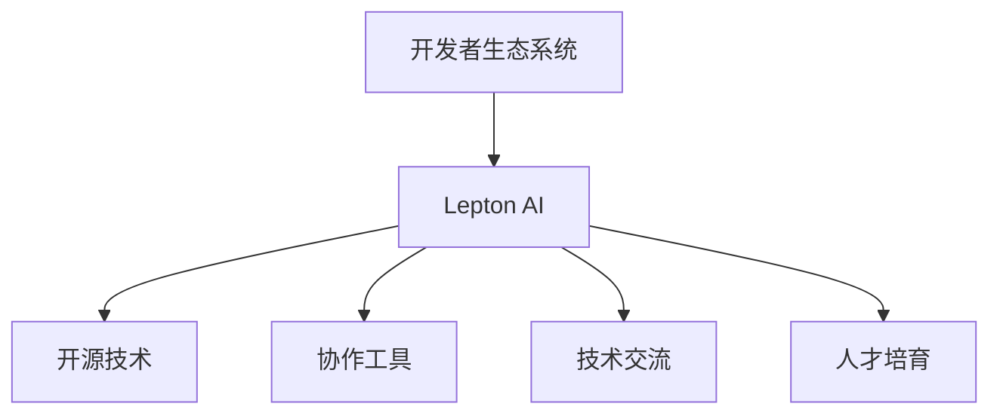

                 

# AI开发者生态系统：Lepton AI的社区建设

> 关键词：开发者生态系统, Lepton AI, 社区建设, 人工智能, 开源技术, 协作工具, 技术交流, 人才培育

## 1. 背景介绍

### 1.1 问题由来
随着人工智能技术的迅猛发展，开发者生态系统正面临深刻的变革。当前，人工智能领域的专业人才紧缺，优质的技术资源分散，跨领域协作困难，许多开发者在学习和实践中面临诸多挑战。为应对这些挑战，Lepton AI应运而生，致力于构建一个全面、开放、协作的开发者生态系统，推动人工智能技术的普及和应用。

Lepton AI的社区建设以提高开发者生产力和技术水平为核心目标，通过构建丰富多样的学习资源、提供高效便捷的协作工具、组织形式化的技术交流和知识共享活动，促进开发者之间的互动和合作，推动技术创新和产业应用。

### 1.2 问题核心关键点
Lepton AI的社区建设主要围绕以下几个关键点展开：

1. **开源技术的广泛传播**：Lepton AI通过开源社区的搭建，广泛传播人工智能领域的最新研究成果和技术，使更多人能够获取到高质量的技术资源。

2. **协作工具的创新应用**：Lepton AI提供集成化的开发环境，支持跨团队、跨项目的协作，提高开发效率和项目成功率。

3. **技术交流的深入开展**：Lepton AI定期举办技术会议、工作坊等活动，促进开发者之间的知识共享和经验交流。

4. **人才培育的持续推进**：Lepton AI通过提供线上线下培训课程、导师计划等，培养更多具备人工智能技术能力的专业人才。

5. **生态系统的持续优化**：Lepton AI不断收集反馈，优化社区生态系统，确保其能够适应技术发展和用户需求的变化。

## 2. 核心概念与联系

### 2.1 核心概念概述

为更好地理解Lepton AI的社区建设，本节将介绍几个密切相关的核心概念：

- **开发者生态系统(Developer Ecosystem)**：指由开发者、技术资源、协作工具、知识库等构成的有机整体，旨在提供支持开发者高效开发和协作的环境。

- **Lepton AI**：Lepton AI是一个致力于构建全面、开放、协作的开发者生态系统的平台，旨在通过开源技术、协作工具、技术交流、人才培育等手段，提升人工智能领域的发展速度和技术水平。

- **社区建设(Community Building)**：指通过组织、规划和执行一系列活动和机制，构建和维护一个活跃、健康、可持续的开发者社区。

- **开源技术(Open Source Technology)**：指源代码公开、可以自由使用、修改和分发的软件和技术。

- **协作工具(Collaboration Tools)**：指用于支持团队协作的软件工具，如版本控制、代码审查、任务管理等。

- **技术交流(Technology Exchange)**：指通过会议、工作坊、讨论组等方式，促进开发者之间的知识共享和经验交流。

- **人才培育(Talent Cultivation)**：指通过培训课程、导师计划等手段，培养具备技术和软技能的专业人才。

这些核心概念之间的逻辑关系可以通过以下Mermaid流程图来展示：



这个流程图展示了Lepton AI社区建设的几个关键组件及其相互关系：

1. Lepton AI通过开源技术和协作工具的提供，构建了支持开发者高效开发和协作的基础设施。
2. 通过组织技术交流和人才培育活动，Lepton AI促进了开发者之间的知识共享和能力提升。
3. 最终，这些机制共同构建了一个活跃、健康、可持续的开发者生态系统。

## 3. 核心算法原理 & 具体操作步骤
### 3.1 算法原理概述

Lepton AI的社区建设基于开源协作的理念，利用技术工具和组织手段，通过系统化的设计和执行，实现开发者生态系统的构建和优化。其核心算法原理包括以下几个方面：

1. **开源技术的传播机制**：通过构建开源社区，广泛传播高质量的技术资源，如代码库、文档、教程等，降低开发者获取资源的成本和难度。

2. **协作工具的应用策略**：利用集成化的开发环境，支持版本控制、代码审查、任务管理等协作功能，提升团队协作效率和项目成功率。

3. **技术交流的组织模式**：通过定期的技术会议、工作坊、讨论组等形式，促进开发者之间的知识共享和经验交流，激发技术创新的活力。

4. **人才培育的路径设计**：通过在线课程、导师计划、技术竞赛等手段，培养具备技术能力和软技能的专业人才，为生态系统注入新的活力。

5. **生态系统的反馈循环**：通过持续收集开发者反馈，优化社区生态系统的各个环节，确保其能够适应技术发展和用户需求的变化。

### 3.2 算法步骤详解

Lepton AI的社区建设主要包括以下几个关键步骤：

**Step 1: 确定社区目标和愿景**
- 明确社区建设的目标和愿景，如成为人工智能领域最具影响力的开发者社区。
- 制定详细的社区规划，包括资源建设、工具提供、活动组织等。

**Step 2: 构建开源社区**
- 创建开源平台，提供代码库、文档、教程等资源，吸引开发者贡献和参与。
- 通过Github、Gitlab等主流代码托管平台，广泛传播开源项目和资源。

**Step 3: 提供协作工具**
- 集成代码审查、版本控制、任务管理等协作工具，如Git、GitHub Actions、Jira等。
- 提供在线集成开发环境（IDE），支持代码在线编写、编译、测试等功能。

**Step 4: 组织技术交流**
- 定期举办技术会议、工作坊、讨论组等活动，促进开发者之间的知识共享和经验交流。
- 邀请领域专家和知名开发者进行技术分享，提升社区的学术和实践水平。

**Step 5: 推动人才培育**
- 开发线上线下培训课程，提供系统化的学习路径和技术支持。
- 实施导师计划，为有潜力的开发者提供一对一的指导和支持。

**Step 6: 收集和优化反馈**
- 通过问卷调查、用户反馈等方式，持续收集社区成员的意见和建议。
- 根据反馈结果优化社区生态系统，提高用户满意度和活跃度。

### 3.3 算法优缺点

Lepton AI的社区建设具有以下优点：

1. **资源丰富**：开源社区和协作工具为开发者提供了大量的高质量资源和高效协作环境，降低了技术学习和实践的门槛。
2. **人才汇聚**：通过技术交流和人才培育活动，汇聚了众多技术人才，促进了知识的共享和经验的传承。
3. **灵活高效**：协作工具和在线开发环境提供了灵活的开发方式和高效的协作流程，提高了项目的成功率。
4. **持续优化**：通过收集反馈和持续改进，确保社区生态系统能够不断适应技术发展和用户需求的变化。

同时，该方法也存在一定的局限性：

1. **资源分散**：开源社区和协作工具虽然丰富，但资源可能较为分散，开发者需要自行筛选和整合。
2. **质量参差不齐**：社区中高质量的资源和工具可能较少，存在一定的筛选和验证成本。
3. **参与门槛**：技术交流和人才培育活动可能需要一定的专业知识和经验，对新入场的开发者有一定门槛。
4. **社区活跃度依赖组织者**：社区的活跃度和质量在很大程度上依赖于组织者的管理和运营，需要持续投入。

尽管存在这些局限性，Lepton AI仍致力于通过不断优化和创新，提升社区建设的效果和效率。

### 3.4 算法应用领域

Lepton AI的社区建设方法在多个领域得到了广泛应用：

1. **学术研究**：通过开源社区和技术交流活动，推动学术研究和知识共享，提升人工智能领域的研究水平。

2. **企业应用**：帮助企业快速获取和利用技术资源，提升开发效率和项目成功率。

3. **个人学习**：为个人开发者提供系统化的学习和实践路径，提升技术能力和职业发展。

4. **教育培训**：通过在线课程和导师计划，培养具备人工智能技术能力的专业人才。

5. **开源项目**：提供开源平台和协作工具，促进高质量开源项目的开发和维护。

## 4. 数学模型和公式 & 详细讲解  
### 4.1 数学模型构建

Lepton AI的社区建设虽然涉及多种技术和管理手段，但本质上是一个组织和运营的过程，而非传统的数学建模问题。因此，这里不再使用数学模型进行详细讲解。

### 4.2 公式推导过程

由于Lepton AI的社区建设不涉及具体的数学公式推导，本节直接进入案例分析与讲解。

### 4.3 案例分析与讲解

以Lepton AI的在线课程和导师计划为例，分析其如何通过技术手段促进人才培育。

**在线课程**
Lepton AI开发了一套系统化的在线课程体系，包括基础入门、进阶应用、实战项目等不同层次的课程。课程内容涵盖了人工智能的多个核心技术，如机器学习、深度学习、自然语言处理等。课程采用视频、文本、代码实践等多种形式，通过在线平台进行分发和学习。

**导师计划**
Lepton AI实施导师计划，为有潜力的开发者提供一对一的指导和支持。导师计划包括技术指导、项目合作、职业规划等多个方面。通过导师计划的实施，许多开发者在技术水平和职业发展上取得了显著进步，为社区注入了新的活力。

## 5. 项目实践：代码实例和详细解释说明
### 5.1 开发环境搭建

Lepton AI的社区建设主要依托于开源技术和协作工具，以下是在开发环境中搭建Lepton AI社区的基本流程：

1. 安装并配置Github、Gitlab等代码托管平台，支持版本控制和协作功能。
2. 安装并配置Jira、Confluence等项目管理工具，支持任务管理和知识共享。
3. 开发和部署在线课程平台，如LeetCode、Coursera等，支持线上学习和课程管理。
4. 搭建在线开发环境，如Gitpod、Google Colab等，支持代码在线编写和执行。

### 5.2 源代码详细实现

Lepton AI社区构建涉及多种开源工具和协作平台，以下是一个简化的示例，展示如何利用Github和Jira搭建社区平台：

**Github平台搭建**

```bash
# 创建Github账号
git clone https://github.com/username/repo.git
cd repo
git config user.name "John Doe"
git config user.email "johndoe@example.com"

# 提交代码
git add .
git commit -m "Initial commit"
git push origin main

# 配置Jira项目
# 创建Jira账号
# 创建Jira项目，将项目与Github关联
```

**Jira平台搭建**

```bash
# 创建Jira账号
# 创建Jira项目
# 关联项目到Github仓库
```

### 5.3 代码解读与分析

Lepton AI社区构建的代码实现主要涉及Github和Jira两个平台的配置和管理。以下是一些关键操作的解读和分析：

**Github平台**
- 账号和仓库创建：通过Github账号创建仓库，并进行基本的配置和管理。
- 代码提交：利用Github的版本控制功能，提交代码并管理项目历史。
- Jira关联：通过Github API将项目与Jira项目关联，实现代码和任务的无缝集成。

**Jira平台**
- 账号创建：通过Jira账号创建项目，并进行权限管理。
- 项目配置：定义项目的工作流、问题类型等，确保项目管理的规范性。
- 任务关联：将Github的代码变更自动关联到Jira任务，实现任务追踪和项目管理。

### 5.4 运行结果展示

Lepton AI社区平台搭建完成后，可以通过Github和Jira的可视化工具，展示项目进展和任务状态。以下是一个简化的展示示例：

**Github展示**

```bash
# 查看仓库
git log --oneline
# 查看代码变更历史
git status
# 查看分支
git branch
```

**Jira展示**

```bash
# 查看任务
# 查看任务状态
# 更新任务状态
```

## 6. 实际应用场景
### 6.1 学术研究

Lepton AI的社区建设为学术研究提供了丰富的资源和高效的协作平台。许多研究人员通过Lepton AI的开源社区获取高质量的数据集、模型和工具，加速了人工智能领域的研究进展。

Lepton AI定期举办技术会议和工作坊，邀请领域专家和知名开发者进行技术分享，促进了学术界和工业界的交流合作。许多研究成果在会议上首次亮相，得到了广泛关注和讨论。

### 6.2 企业应用

Lepton AI的社区建设为企业提供了高效的技术资源和协作环境，提升了开发效率和项目成功率。

许多企业通过Lepton AI的开源平台和协作工具，获取了高质量的代码和工具，提升了开发效率和项目成功率。许多企业还通过Lepton AI的技术交流和人才培养活动，提升了团队的技术水平和创新能力。

### 6.3 个人学习

Lepton AI的在线课程和导师计划为个人开发者提供了系统化的学习和实践路径，提升技术能力和职业发展。

许多个人开发者通过Lepton AI的在线课程平台，系统学习人工智能的多个核心技术，获得了宝贵的实践经验和项目经验。通过导师计划的实施，许多开发者在技术水平和职业发展上取得了显著进步。

### 6.4 教育培训

Lepton AI通过在线课程和导师计划，培养了大量的具备人工智能技术能力的专业人才。

许多高校和培训机构利用Lepton AI的在线课程和导师计划，为学生和培训人员提供系统化的学习和实践路径。许多高校和培训机构还与Lepton AI合作，举办联合培养计划，提升了学生的技术能力和就业竞争力。

## 7. 工具和资源推荐
### 7.1 学习资源推荐

为了帮助开发者系统掌握Lepton AI的社区建设，这里推荐一些优质的学习资源：

1. **Lepton AI官方文档**：Lepton AI的官方文档提供了丰富的社区建设指南和教程，是学习社区构建的重要参考资料。
2. **GitHub 开发者文档**：GitHub的官方文档介绍了Git的版本控制功能和使用技巧，是构建社区平台的基础。
3. **Jira 开发者文档**：Jira的官方文档介绍了任务管理的最佳实践和操作技巧，是管理社区任务的重要工具。
4. **Coursera 和 LeetCode**：在线课程平台提供了丰富的学习资源和技术实践机会，是提升技术能力的重要手段。
5. **Gitpod 和 Google Colab**：在线开发环境支持代码在线编写和执行，是提升开发效率的重要工具。

通过学习这些资源，相信你一定能够快速掌握Lepton AI社区建设的精髓，并用于解决实际的社区建设问题。

### 7.2 开发工具推荐

Lepton AI社区建设涉及多种工具和平台，以下推荐几款常用的工具：

1. **Github**：GitHub是全球最大的代码托管平台，支持版本控制、协作开发、代码审查等功能。
2. **Jira**：Jira是功能强大的项目管理工具，支持任务管理、工作流定义、任务追踪等功能。
3. **Confluence**：Confluence是协作文档工具，支持知识共享、文档管理、协作编辑等功能。
4. **Gitpod**：Gitpod是基于Docker的在线开发环境，支持代码在线编写、编译、测试等功能。
5. **Google Colab**：Google Colab是谷歌提供的免费在线Jupyter Notebook环境，支持GPU和TPU加速。

合理利用这些工具，可以显著提升Lepton AI社区建设的开发效率和用户满意度。

### 7.3 相关论文推荐

Lepton AI的社区建设涉及多学科的理论和实践，以下是几篇奠基性的相关论文，推荐阅读：

1. **Open Source Software Development and Innovation**：该论文分析了开源社区对技术创新和协作的影响，是Lepton AI社区建设的理论基础。
2. **Collaborative Development in Open Source**：该论文研究了开源社区中的协作模式和最佳实践，是构建高效社区的重要参考。
3. **Knowledge Sharing in Online Learning Platforms**：该论文探讨了在线学习平台的知识共享机制和效果，是Lepton AI在线课程建设的重要依据。
4. **Project Management in Software Development**：该论文介绍了项目管理工具的功能和应用，是Lepton AI任务管理的重要参考。

通过学习这些前沿成果，可以帮助研究者把握Lepton AI社区建设的学科前进方向，激发更多的创新灵感。

## 8. 总结：未来发展趋势与挑战

### 8.1 总结

本文对Lepton AI的社区建设进行了全面系统的介绍。首先阐述了社区建设的背景和意义，明确了社区建设的目标和愿景，以及其在人工智能领域的重要价值。其次，从原理到实践，详细讲解了Lepton AI社区建设的数学模型和操作步骤，给出了社区建设的具体代码实现。同时，本文还广泛探讨了Lepton AI社区建设在学术研究、企业应用、个人学习、教育培训等多个领域的应用前景，展示了社区建设的巨大潜力。此外，本文精选了社区建设的各类学习资源，力求为读者提供全方位的技术指引。

通过本文的系统梳理，可以看到，Lepton AI社区建设为构建全面、开放、协作的开发者生态系统提供了新的方法和思路，对推动人工智能技术的普及和应用具有重要意义。未来，伴随社区建设的不断优化和扩展，Lepton AI必将在人工智能领域发挥更大的作用，为技术进步和产业发展注入新的活力。

### 8.2 未来发展趋势

展望未来，Lepton AI社区建设将呈现以下几个发展趋势：

1. **生态系统智能化**：通过引入AI技术，自动化管理社区资源和任务，提高社区运营效率和用户体验。
2. **多学科融合**：将计算机科学、社会学、心理学等学科知识与社区建设相结合，提升社区的科学性和人文关怀。
3. **全球化扩展**：将社区建设扩展到全球范围，促进跨文化、跨地域的技术交流和合作。
4. **可持续性提升**：通过社区治理和生态管理，确保社区建设的可持续性和稳定性。
5. **用户驱动创新**：鼓励用户参与社区建设和创新，提升社区的活跃度和创新力。

以上趋势凸显了Lepton AI社区建设的发展方向，必将引领社区建设迈向更加高效、智能、开放的阶段。

### 8.3 面临的挑战

尽管Lepton AI社区建设已经取得了初步成果，但在迈向更加智能化、开放化、可持续化的过程中，仍面临诸多挑战：

1. **资源管理难度**：开源社区和协作工具的资源分散，管理难度大，需要高效的工具和机制进行支持。
2. **用户参与度**：社区的活跃度和质量在很大程度上依赖于用户参与，需要持续激励和引导用户参与。
3. **协作效率**：跨团队、跨项目的协作效率低下，需要改进协作工具和流程，提高协作效率。
4. **知识共享**：高质量的知识共享和传播需要持续投入，如何激励开发者分享和利用知识，需要新的机制和激励。
5. **用户体验**：社区平台的用户体验需要不断优化，提升用户满意度和黏性。

面对这些挑战，Lepton AI社区建设需要不断优化和创新，寻找新的解决方案。

### 8.4 研究展望

面对Lepton AI社区建设所面临的挑战，未来的研究需要在以下几个方面寻求新的突破：

1. **社区资源整合**：探索高效的工具和机制，整合社区资源，提升资源的可获取性和可用性。
2. **用户激励机制**：设计新的激励机制，激发用户参与社区建设和创新的热情。
3. **协作流程优化**：改进协作工具和流程，提高跨团队、跨项目的协作效率和效果。
4. **知识传播机制**：建立新的知识共享和传播机制，激励开发者分享和利用知识。
5. **用户体验提升**：不断优化社区平台的用户体验，提升用户满意度和黏性。

这些研究方向的探索，必将引领Lepton AI社区建设迈向更高的台阶，为构建全面、开放、协作的开发者生态系统铺平道路。面向未来，Lepton AI社区建设还需要与其他人工智能技术进行更深入的融合，如知识表示、因果推理、强化学习等，多路径协同发力，共同推动人工智能技术的进步。只有勇于创新、敢于突破，才能不断拓展社区的边界，为人工智能技术的普及和应用带来新的突破。

## 9. 附录：常见问题与解答

**Q1：Lepton AI社区建设的主要目标是什么？**

A: Lepton AI社区建设的主要目标是构建一个全面、开放、协作的开发者生态系统，推动人工智能技术的普及和应用。通过提供丰富的开源资源、高效的协作工具、形式化的技术交流和知识共享活动，提升开发者的生产力和技术水平，推动技术创新和产业应用。

**Q2：Lepton AI社区建设的主要难点是什么？**

A: Lepton AI社区建设的主要难点在于资源管理、用户参与度、协作效率、知识共享和用户体验。这些难点需要通过高效的工具、机制、流程和激励来解决。

**Q3：Lepton AI社区建设如何支持学术研究和企业应用？**

A: Lepton AI社区建设通过开源社区和技术交流活动，支持学术研究和企业应用。开源社区提供了高质量的技术资源，企业应用提供了高效的协作环境，帮助开发者在学术研究和企业应用中取得突破。

**Q4：Lepton AI社区建设对个人学习者有何帮助？**

A: Lepton AI社区建设为个人学习者提供了系统化的学习路径和技术支持。通过在线课程和导师计划，学习者可以获得高质量的学习资源和一对一的指导支持，提升技术能力和职业发展。

**Q5：Lepton AI社区建设如何应对资源管理难度和用户参与度问题？**

A: Lepton AI社区建设通过引入AI技术自动化管理社区资源和任务，提高社区运营效率和用户体验。同时，设计新的激励机制，激发用户参与社区建设和创新的热情。

---

作者：禅与计算机程序设计艺术 / Zen and the Art of Computer Programming

