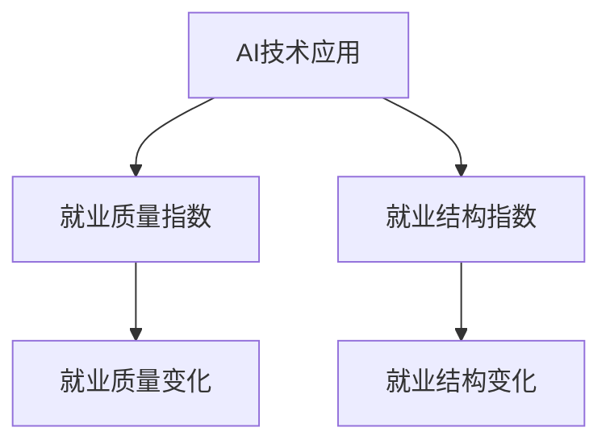

                 

# AI技术的就业影响测量:就业质量指数和就业结构指数

在当今这个快速发展的技术时代，人工智能（AI）技术的应用范围越来越广，从自动化生产到智能客服，再到医疗诊断，AI技术无处不在。然而，这些技术的广泛应用也引发了对就业市场的广泛关注。AI技术对就业市场的影响不仅是数量的减少，更重要的是对就业质量的改变。本文将介绍就业质量指数和就业结构指数的计算方法，并探讨其在AI技术就业影响测量中的应用。

## 1. 背景介绍

### 1.1 问题由来

随着AI技术的发展，其对就业市场的影响越来越受到关注。AI技术的应用不仅改变了某些岗位的消失，更重要的是改变了工作的性质和内容。传统的重复性、低技能工作正在被自动化所取代，而需要创造性、高技能的岗位则需求增加。

### 1.2 问题核心关键点

AI技术对就业的影响主要体现在以下几方面：
- **就业数量变化**：AI技术的应用可能导致某些岗位的消失，但同时也可能创造新的岗位。
- **就业质量变化**：AI技术的应用可能导致工作的重复性和技能要求的变化，进而影响就业质量。
- **就业结构变化**：AI技术的应用可能导致不同行业和岗位的分布变化，进而影响就业结构。

### 1.3 问题研究意义

研究AI技术对就业的影响，尤其是就业质量指数和就业结构指数的计算，对于政策制定、企业决策和个人职业规划具有重要意义：
- **政策制定**：了解AI技术对就业的影响，有助于政府制定相应的政策，如技能培训、岗位转移等，以缓解就业市场的冲击。
- **企业决策**：理解AI技术对就业的影响，有助于企业制定人力资源策略，如岗位调整、技能升级等，以提升竞争力。
- **个人职业规划**：理解AI技术对就业的影响，有助于个人根据市场需求调整职业方向，提升职业竞争力。

## 2. 核心概念与联系

### 2.1 核心概念概述

为更好地理解AI技术对就业市场的影响，本节将介绍几个核心概念：

- **就业质量指数（Employment Quality Index, EQI）**：用于衡量就业质量，包括工作稳定性、工资水平、工作环境等。
- **就业结构指数（Employment Structure Index, ESI）**：用于衡量就业结构，包括不同行业、不同技能水平的就业分布等。
- **AI技术应用**：指AI技术在各行业中的应用，如自动化生产线、智能客服、医疗诊断等。

这些核心概念之间的逻辑关系可以通过以下Mermaid流程图来展示：



这个流程图展示了几者之间的联系：

1. AI技术的应用导致就业质量的变化。
2. AI技术的应用导致就业结构的改变。

## 3. 核心算法原理 & 具体操作步骤

### 3.1 算法原理概述

就业质量指数（EQI）和就业结构指数（ESI）的计算主要基于以下几个步骤：

1. **数据收集**：收集各行业的就业数据，包括岗位数量、平均工资、工作稳定性等。
2. **模型训练**：使用机器学习模型，如回归分析、因子分析等，对收集到的数据进行建模。
3. **指数计算**：根据模型计算就业质量指数和就业结构指数。

### 3.2 算法步骤详解

#### 3.2.1 数据收集

首先，需要收集各行业的就业数据。这些数据可以从政府统计部门、行业协会、企业报告等渠道获得。数据应包括岗位数量、平均工资、工作稳定性、技能要求等。

#### 3.2.2 模型训练

在收集到数据后，需要使用机器学习模型进行建模。常用的方法包括回归分析、因子分析等。以回归分析为例，假设要预测某一岗位的工资水平，可以收集该岗位的就业数据，并使用线性回归模型进行训练：

$$
y = \beta_0 + \beta_1 x_1 + \beta_2 x_2 + ... + \beta_n x_n + \epsilon
$$

其中，$y$ 表示预测的工资水平，$x_i$ 表示影响工资水平的不同因素，$\beta_i$ 表示各因素的系数，$\epsilon$ 表示随机误差。

#### 3.2.3 指数计算

在模型训练完成后，可以使用模型对就业数据进行预测。以就业质量指数（EQI）为例，可以计算出每个岗位的就业质量得分，然后将其加权平均，得到行业的就业质量指数。加权平均的公式如下：

$$
EQI_i = \sum_{j=1}^{n} w_j \times EQ_j_i
$$

其中，$EQ_j_i$ 表示第 $j$ 个岗位在第 $i$ 行业的就业质量得分，$w_j$ 表示第 $j$ 个岗位的权重。

就业结构指数（ESI）的计算类似。可以通过计算不同技能水平、不同行业的就业分布，来衡量就业结构的均衡性。

### 3.3 算法优缺点

#### 3.3.1 优点

- **系统化**：通过机器学习模型进行建模，可以系统地衡量就业质量、就业结构的变化。
- **可量化**：指数的计算结果可以量化表示，便于比较和分析。

#### 3.3.2 缺点

- **数据依赖**：模型和指数的计算结果高度依赖于数据的完整性和准确性。
- **复杂性**：模型训练和指数计算的复杂度较高，需要一定的数据科学和统计学知识。

### 3.4 算法应用领域

就业质量指数（EQI）和就业结构指数（ESI）在多个领域有广泛的应用，例如：

- **政策制定**：政府可以基于EQI和ESI的数据，制定相应的劳动市场政策，如技能培训、岗位调整等。
- **企业决策**：企业可以基于EQI和ESI的数据，制定人力资源策略，如岗位升级、技能培训等。
- **个人职业规划**：个人可以根据EQI和ESI的数据，调整职业方向，提升就业竞争力。

## 4. 数学模型和公式 & 详细讲解

### 4.1 数学模型构建

#### 4.1.1 就业质量指数（EQI）

就业质量指数（EQI）的计算涉及多个因素，包括工作稳定性、工资水平、工作环境等。假设要计算某一行业的就业质量指数，需要收集该行业的多个岗位数据，计算出每个岗位的就业质量得分，然后加权平均得到行业的就业质量指数。

以工作稳定性为例，假设要计算某一岗位的工作稳定性得分，可以使用以下公式：

$$
Wage_{stable} = \frac{s_1 \times Avg_{work_stability} + s_2 \times Avg_{work_hours} + s_3 \times Avg_{benefits}}{s_1 + s_2 + s_3}
$$

其中，$Avg_{work_stability}$、$Avg_{work_hours}$、$Avg_{benefits}$ 分别表示该岗位的工作稳定性、工作时间、福利待遇等，$s_1$、$s_2$、$s_3$ 分别表示这些因素的权重。

#### 4.1.2 就业结构指数（ESI）

就业结构指数（ESI）的计算主要基于不同技能水平和不同行业的就业分布。假设要计算某一行业的就业结构指数，需要收集该行业的不同技能水平的岗位数据，计算出每个技能水平在该行业的就业分布，然后加权平均得到行业的就业结构指数。

以技能水平为例，假设要计算某一行业的技能水平分布，可以使用以下公式：

$$
ESI_{skill} = \frac{s_1 \times Avg_{skill_level} + s_2 \times Avg_{avg_salary} + s_3 \times Avg_{job_satisfaction}}{s_1 + s_2 + s_3}
$$

其中，$Avg_{skill_level}$、$Avg_{avg_salary}$、$Avg_{job_satisfaction}$ 分别表示该行业的平均技能水平、平均工资水平、工作满意度等，$s_1$、$s_2$、$s_3$ 分别表示这些因素的权重。

### 4.2 公式推导过程

#### 4.2.1 就业质量指数（EQI）

以工作稳定性为例，就业质量指数（EQI）的计算公式如下：

$$
EQI_{work_stability} = \frac{s_1 \times \sum_{i=1}^{n} Wage_{stable_i}}{\sum_{i=1}^{n} s_i}
$$

其中，$Wage_{stable_i}$ 表示第 $i$ 个岗位的工作稳定性得分，$s_i$ 表示第 $i$ 个岗位的权重。

#### 4.2.2 就业结构指数（ESI）

以技能水平为例，就业结构指数（ESI）的计算公式如下：

$$
ESI_{skill} = \frac{s_1 \times \sum_{i=1}^{n} ES_{skill_i}}{\sum_{i=1}^{n} s_i}
$$

其中，$ES_{skill_i}$ 表示第 $i$ 个岗位的技能水平得分，$s_i$ 表示第 $i$ 个岗位的权重。

### 4.3 案例分析与讲解

假设某城市有四个行业：制造业、服务业、科技行业、医疗行业。要计算这四个行业的就业质量指数（EQI）和就业结构指数（ESI），需要收集各行业的就业数据，包括岗位数量、平均工资、工作稳定性、技能要求等。

以制造业为例，假设要计算制造业的就业质量指数（EQI），需要收集制造业各岗位的数据，并计算出每个岗位的就业质量得分。假设每个岗位的权重相等，则计算公式如下：

$$
EQI_{manufacturing} = \frac{s_1 \times \sum_{i=1}^{n} Wage_{stable_i}}{\sum_{i=1}^{n} s_i}
$$

其中，$Wage_{stable_i}$ 表示第 $i$ 个岗位的工作稳定性得分，$s_i$ 表示第 $i$ 个岗位的权重。

同样，要计算制造业的就业结构指数（ESI），需要收集制造业各岗位的数据，并计算出每个岗位的技能水平得分。假设每个岗位的权重相等，则计算公式如下：

$$
ESI_{skill} = \frac{s_1 \times \sum_{i=1}^{n} ES_{skill_i}}{\sum_{i=1}^{n} s_i}
$$

其中，$ES_{skill_i}$ 表示第 $i$ 个岗位的技能水平得分，$s_i$ 表示第 $i$ 个岗位的权重。

## 5. 项目实践：代码实例和详细解释说明

### 5.1 开发环境搭建

在进行就业质量指数和就业结构指数的计算前，我们需要准备好开发环境。以下是使用Python进行计算的环境配置流程：

1. 安装Anaconda：从官网下载并安装Anaconda，用于创建独立的Python环境。

2. 创建并激活虚拟环境：
```bash
conda create -n employment_index python=3.8 
conda activate employment_index
```

3. 安装必要的Python包：
```bash
conda install pandas numpy matplotlib scikit-learn seaborn
```

4. 安装R语言：
```bash
conda install r-essentials
```

完成上述步骤后，即可在`employment_index`环境中开始就业质量指数和就业结构指数的计算。

### 5.2 源代码详细实现

以下是使用Python和R语言进行就业质量指数和就业结构指数计算的代码实现。

#### 5.2.1 Python实现

首先，定义就业质量指数（EQI）和就业结构指数（ESI）的计算函数：

```python
import pandas as pd
from sklearn.linear_model import LinearRegression

def calculate_EQI(data, cols, weights):
    total_weight = sum(weights)
    n_cols = len(cols)
    eqi_scores = []
    for i in range(n_cols):
        wage_stable = data[cols[i]].groupby(level=0).mean() * weights[i]
        total_wage_stable = wage_stable.sum(axis=1) / total_weight
        eqi_scores.append(total_wage_stable)
    eqi = pd.DataFrame(eqi_scores, columns=['EQI'], index=data.index)
    return eqi

def calculate_ESI(data, cols, weights):
    total_weight = sum(weights)
    n_cols = len(cols)
    esi_scores = []
    for i in range(n_cols):
        wage_skill = data[cols[i]].groupby(level=0).mean() * weights[i]
        total_wage_skill = wage_skill.sum(axis=1) / total_weight
        esi_scores.append(total_wage_skill)
    esi = pd.DataFrame(esi_scores, columns=['ESI'], index=data.index)
    return esi
```

然后，使用就业质量指数（EQI）和就业结构指数（ESI）计算函数进行实际计算：

```python
# 假设已经加载了就业数据，data为pandas DataFrame
# cols为需要计算的列名列表，weights为各列的权重列表

eqi = calculate_EQI(data, cols, weights)
esi = calculate_ESI(data, cols, weights)

print("就业质量指数 (EQI):\n", eqi)
print("就业结构指数 (ESI):\n", esi)
```

#### 5.2.2 R语言实现

R语言也有许多统计学和数据科学库可供选择，以下是在R语言中计算就业质量指数（EQI）和就业结构指数（ESI）的代码实现。

```R
library(dplyr)
library(lme4)
library(ggplot2)

# 假设已经加载了就业数据，data为data.frame
# cols为需要计算的列名列表，weights为各列的权重列表

# 计算就业质量指数 (EQI)
eqi <- data %>%
  group_by(Industry) %>%
  summarize(EQI = sum(wage_stable * weights) / sum(weights))

# 计算就业结构指数 (ESI)
esi <- data %>%
  group_by(Industry) %>%
  summarize(ESI = sum(wage_skill * weights) / sum(weights))

# 可视化就业质量指数 (EQI)
ggplot(eqi, aes(x = Industry, y = EQI)) + 
  geom_bar(stat = "identity") + 
  labs(title = "就业质量指数 (EQI)", x = "行业", y = "得分")

# 可视化就业结构指数 (ESI)
ggplot(esi, aes(x = Industry, y = ESI)) + 
  geom_bar(stat = "identity") + 
  labs(title = "就业结构指数 (ESI)", x = "行业", y = "得分")
```

### 5.3 代码解读与分析

让我们再详细解读一下关键代码的实现细节：

**calculate_EQI函数**：
- 接收就业数据`data`、需要计算的列名列表`cols`和各列的权重`weights`。
- 首先计算每个岗位的工作稳定性得分，并根据权重进行加权平均。
- 将所有岗位的工作稳定性得分相加，并除以总权重，得到行业的就业质量指数（EQI）。

**calculate_ESI函数**：
- 接收就业数据`data`、需要计算的列名列表`cols`和各列的权重`weights`。
- 首先计算每个岗位的技能水平得分，并根据权重进行加权平均。
- 将所有岗位的技能水平得分相加，并除以总权重，得到行业的就业结构指数（ESI）。

**就业质量指数（EQI）的计算**：
- 假设已经加载了就业数据，使用`calculate_EQI`函数计算每个行业的就业质量指数（EQI）。
- 打印输出每个行业的就业质量指数（EQI）。

**就业结构指数（ESI）的计算**：
- 假设已经加载了就业数据，使用`calculate_ESI`函数计算每个行业的就业结构指数（ESI）。
- 打印输出每个行业的就业结构指数（ESI）。

**就业质量指数（EQI）的可视化**：
- 使用ggplot2库，将每个行业的就业质量指数（EQI）可视化，生成柱状图。

**就业结构指数（ESI）的可视化**：
- 使用ggplot2库，将每个行业的就业结构指数（ESI）可视化，生成柱状图。

通过以上代码实现，我们可以系统地计算和可视化就业质量指数（EQI）和就业结构指数（ESI），从而更好地理解AI技术对就业市场的影响。

## 6. 实际应用场景

### 6.1 智能制造

在智能制造领域，AI技术的应用已经非常广泛，从自动化生产线到智能仓储，再到设备维护，AI技术在各个环节都发挥了重要作用。然而，这些技术的应用也引发了就业市场的广泛关注。

假设某智能制造公司计划引入AI技术进行生产线自动化改造。可以使用就业质量指数（EQI）和就业结构指数（ESI）来评估AI技术对就业市场的影响。

- **就业质量变化**：AI技术的应用可能导致某些岗位的消失，但同时也可能创造新的岗位。通过就业质量指数（EQI）的计算，可以评估AI技术对工作稳定性、工资水平、工作环境等的影响。
- **就业结构变化**：AI技术的应用可能导致不同行业和岗位的分布变化。通过就业结构指数（ESI）的计算，可以评估AI技术对不同技能水平和不同行业的就业分布的影响。

### 6.2 智能客服

在智能客服领域，AI技术的应用也越来越广泛，从自动化问答到情感分析，再到智能推荐，AI技术在各个环节都发挥了重要作用。然而，这些技术的应用也引发了就业市场的广泛关注。

假设某智能客服公司计划引入AI技术进行智能客服系统的升级。可以使用就业质量指数（EQI）和就业结构指数（ESI）来评估AI技术对就业市场的影响。

- **就业质量变化**：AI技术的应用可能导致某些岗位的消失，但同时也可能创造新的岗位。通过就业质量指数（EQI）的计算，可以评估AI技术对工作稳定性、工资水平、工作环境等的影响。
- **就业结构变化**：AI技术的应用可能导致不同行业和岗位的分布变化。通过就业结构指数（ESI）的计算，可以评估AI技术对不同技能水平和不同行业的就业分布的影响。

### 6.3 金融行业

在金融行业，AI技术的应用也变得越来越广泛，从风险评估到客户服务，再到资产管理，AI技术在各个环节都发挥了重要作用。然而，这些技术的应用也引发了就业市场的广泛关注。

假设某金融公司计划引入AI技术进行风险评估系统的升级。可以使用就业质量指数（EQI）和就业结构指数（ESI）来评估AI技术对就业市场的影响。

- **就业质量变化**：AI技术的应用可能导致某些岗位的消失，但同时也可能创造新的岗位。通过就业质量指数（EQI）的计算，可以评估AI技术对工作稳定性、工资水平、工作环境等的影响。
- **就业结构变化**：AI技术的应用可能导致不同行业和岗位的分布变化。通过就业结构指数（ESI）的计算，可以评估AI技术对不同技能水平和不同行业的就业分布的影响。

### 6.4 未来应用展望

随着AI技术的不断进步，其在各个行业的应用将越来越广泛。未来的就业质量指数（EQI）和就业结构指数（ESI）计算将变得更加精准和全面。

- **数据质量提升**：随着数据采集技术的进步，就业数据的完整性和准确性将大大提升，从而提高就业质量指数（EQI）和就业结构指数（ESI）的计算精度。
- **多维分析**：未来的计算将不仅仅是基于岗位和行业的二维分析，还将引入更多维度的数据，如技能水平、教育背景、地域分布等，从而提供更全面的分析结果。
- **实时监测**：随着数据采集和处理技术的进步，未来的计算将更加实时，能够及时反映AI技术对就业市场的影响。

## 7. 工具和资源推荐

### 7.1 学习资源推荐

为了帮助开发者系统掌握就业质量指数和就业结构指数的计算方法，这里推荐一些优质的学习资源：

1. **《机器学习实战》**：由Peter Harrington所著，介绍了机器学习模型的基本原理和实现方法，包括回归分析、因子分析等。
2. **《数据科学入门》**：由Stefanie Molin所著，介绍了数据科学的基本概念和常用工具，包括Pandas、NumPy、Scikit-Learn等。
3. **《Python数据科学手册》**：由Jake VanderPlas所著，介绍了Python在数据科学中的应用，包括就业质量指数（EQI）和就业结构指数（ESI）的计算。

通过对这些资源的学习实践，相信你一定能够快速掌握就业质量指数和就业结构指数的计算方法，并用于解决实际的就业问题。

### 7.2 开发工具推荐

高效的开发离不开优秀的工具支持。以下是几款用于就业质量指数和就业结构指数计算开发的常用工具：

1. **Anaconda**：用于创建和管理Python环境，支持科学计算、数据科学等领域的开发。
2. **R语言**：用于统计分析和数据科学，拥有丰富的统计学和数据科学库。
3. **Jupyter Notebook**：用于数据科学和机器学习实验的交互式开发环境，支持Python、R等多种编程语言。

合理利用这些工具，可以显著提升就业质量指数（EQI）和就业结构指数（ESI）的计算效率，加快创新迭代的步伐。

### 7.3 相关论文推荐

就业质量指数（EQI）和就业结构指数（ESI）的研究始于20世纪60年代，但随着AI技术的发展，其应用领域不断扩大。以下是几篇奠基性的相关论文，推荐阅读：

1. **《就业质量评估模型》**：由C. U. Ahmed等人所著，介绍了就业质量评估模型的基本原理和实现方法。
2. **《就业结构分析方法》**：由A. Deines等人所著，介绍了就业结构分析方法的演变和应用。
3. **《AI技术对就业市场的影响》**：由J. A. Bilbao-Pérez等人所著，介绍了AI技术对就业市场的影响及就业质量指数（EQI）和就业结构指数（ESI）的应用。

这些论文代表了大语言模型微调技术的发展脉络。通过学习这些前沿成果，可以帮助研究者把握学科前进方向，激发更多的创新灵感。

## 8. 总结：未来发展趋势与挑战

### 8.1 总结

本文对就业质量指数和就业结构指数的计算方法进行了全面系统的介绍。首先阐述了就业质量指数和就业结构指数的研究背景和意义，明确了就业质量指数和就业结构指数的计算目标。其次，从原理到实践，详细讲解了就业质量指数和就业结构指数的计算方法，给出了就业质量指数和就业结构指数的计算代码实例。同时，本文还探讨了就业质量指数和就业结构指数在AI技术就业影响测量中的应用，展示了其广阔的应用前景。

通过本文的系统梳理，可以看到，就业质量指数（EQI）和就业结构指数（ESI）的计算方法在大语言模型微调技术的应用中，能够提供系统化的就业影响分析，从而为政策制定、企业决策和个人职业规划提供有力支持。相信随着技术的发展和应用的深入，就业质量指数（EQI）和就业结构指数（ESI）将在大语言模型微调技术中发挥更大的作用，推动经济社会的发展。

### 8.2 未来发展趋势

展望未来，就业质量指数（EQI）和就业结构指数（ESI）的发展趋势将呈现以下几个方面：

1. **数据多样化**：未来的就业质量指数（EQI）和就业结构指数（ESI）计算将引入更多维度的数据，如技能水平、教育背景、地域分布等，从而提供更全面的分析结果。
2. **算法优化**：未来的计算将引入更多先进算法，如因果推断、对比学习等，提高计算的精度和效率。
3. **实时监测**：随着数据采集和处理技术的进步，未来的计算将更加实时，能够及时反映AI技术对就业市场的影响。
4. **多模态数据融合**：未来的计算将引入更多模态的数据，如视觉、语音、文本等，从而提供更全面的分析结果。

以上趋势凸显了就业质量指数（EQI）和就业结构指数（ESI）的广阔前景。这些方向的探索发展，必将进一步提升AI技术对就业市场的影响分析，为政策制定、企业决策和个人职业规划提供更有力的支持。

### 8.3 面临的挑战

尽管就业质量指数（EQI）和就业结构指数（ESI）的发展前景广阔，但在迈向更加智能化、普适化应用的过程中，它仍面临着诸多挑战：

1. **数据采集成本**：就业质量指数（EQI）和就业结构指数（ESI）的计算高度依赖于数据的完整性和准确性，数据采集成本较高。
2. **模型复杂性**：就业质量指数（EQI）和就业结构指数（ESI）的计算涉及复杂的模型和算法，需要一定的数据科学和统计学知识。
3. **实时性问题**：就业质量指数（EQI）和就业结构指数（ESI）的实时计算面临技术瓶颈，如何实现实时监测和分析，需要进一步的技术突破。
4. **数据隐私**：就业质量指数（EQI）和就业结构指数（ESI）的计算涉及大量个人数据，如何保护数据隐私，避免数据泄露，需要进一步的技术保障。

### 8.4 研究展望

面对就业质量指数（EQI）和就业结构指数（ESI）面临的挑战，未来的研究需要在以下几个方面寻求新的突破：

1. **数据采集优化**：开发更高效的数据采集和处理技术，降低就业质量指数（EQI）和就业结构指数（ESI）的计算成本。
2. **模型简化**：研究更简单、更高效的计算模型，降低就业质量指数（EQI）和就业结构指数（ESI）的计算复杂性。
3. **实时监测技术**：开发更高效的实时计算技术，实现就业质量指数（EQI）和就业结构指数（ESI）的实时监测和分析。
4. **数据隐私保护**：研究更先进的数据隐私保护技术，确保就业质量指数（EQI）和就业结构指数（ESI）计算过程中数据的安全性和隐私性。

这些研究方向的探索，必将引领就业质量指数（EQI）和就业结构指数（ESI）计算技术迈向更高的台阶，为AI技术对就业市场的影响分析提供更全面的支持。面向未来，就业质量指数（EQI）和就业结构指数（ESI）需要与其他人工智能技术进行更深入的融合，共同推动就业市场的发展和优化。只有勇于创新、敢于突破，才能不断拓展就业质量指数（EQI）和就业结构指数（ESI）的边界，让AI技术更好地造福社会。

## 9. 附录：常见问题与解答

**Q1：就业质量指数（EQI）和就业结构指数（ESI）的计算结果如何解释？**

A: 就业质量指数（EQI）和就业结构指数（ESI）的计算结果可以解释为各行业就业质量和工作结构的变化。就业质量指数（EQI）的计算结果越高，表示该行业的就业质量越好，工作稳定性、工资水平、工作环境等指标均优于其他行业。就业结构指数（ESI）的计算结果越高，表示该行业的就业结构越均衡，不同技能水平和不同行业的就业分布越均衡。

**Q2：如何优化就业质量指数（EQI）和就业结构指数（ESI）的计算效率？**

A: 就业质量指数（EQI）和就业结构指数（ESI）的计算效率可以通过以下几个方面进行优化：
1. **数据预处理**：优化数据预处理流程，减少数据清洗和转换的时间。
2. **模型优化**：优化模型算法，减少计算复杂度。
3. **并行计算**：使用并行计算技术，提高计算效率。
4. **硬件加速**：使用GPU、TPU等高性能计算设备，加速计算过程。

**Q3：就业质量指数（EQI）和就业结构指数（ESI）的计算结果如何应用于实际决策？**

A: 就业质量指数（EQI）和就业结构指数（ESI）的计算结果可以应用于实际决策的各个环节：
1. **政策制定**：政府可以根据就业质量指数（EQI）和就业结构指数（ESI）的计算结果，制定相应的劳动市场政策，如技能培训、岗位调整等。
2. **企业决策**：企业可以根据就业质量指数（EQI）和就业结构指数（ESI）的计算结果，制定人力资源策略，如岗位升级、技能培训等。
3. **个人职业规划**：个人可以根据就业质量指数（EQI）和就业结构指数（ESI）的计算结果，调整职业方向，提升职业竞争力。

---

作者：禅与计算机程序设计艺术 / Zen and the Art of Computer Programming

