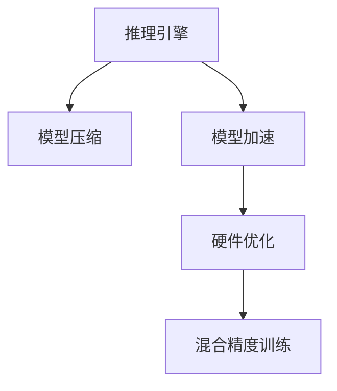

                 

## 1. 背景介绍

推理是深度学习模型的一项基本功能，指的是模型在接收到新的输入数据后，基于其内部参数生成预测结果的过程。这一过程不仅决定了模型的响应速度，还在一定程度上影响了模型的决策质量和应用效果。随着深度学习在各行业的应用不断深化，推理效率和推理优化已经成为推动技术进步的重要因素之一。特别是在高并发、低延迟的实时应用场景中，推理能力的提升变得尤为重要。

### 1.1 问题由来

深度学习模型的推理能力提升需要从多个维度入手，包括模型架构、硬件平台、数据分布、算法优化等。近年来，研究人员和工程师们在这方面进行了大量的研究和实践，推出了一系列高效的推理优化方法，包括模型剪枝、量化、蒸馏、混合精度训练等。这些方法不仅提升了模型的推理速度，还优化了模型的资源占用和计算成本。然而，随着模型复杂度的不断增加，推理优化的需求变得愈发紧迫，优化难度和复杂度也随之提高。因此，如何系统、全面地进行推理优化，成为当下深度学习工程中的关键问题。

### 1.2 问题核心关键点

推理优化的核心目标是通过工程手段提升模型的推理速度和计算效率，同时保持模型的预测准确性。具体来说，关键点包括：

1. **模型剪枝**：通过去除冗余连接或节点，减小模型尺寸。
2. **量化**：将模型的浮点参数转换为定点参数，减少存储空间和计算量。
3. **蒸馏**：通过知识转移，将复杂大模型的知识迁移到更轻量化的模型上。
4. **混合精度训练**：使用混合精度(如float16和float32)训练模型，提升训练和推理速度。
5. **硬件平台选择**：根据具体需求选择适合的硬件平台，如CPU、GPU、TPU等。

## 2. 核心概念与联系

### 2.1 核心概念概述

为了更好地理解推理优化的原理和流程，我们需要明确几个核心概念：

- **推理引擎**：用于执行模型预测的核心组件，能够高效地处理输入数据并生成输出。
- **模型压缩**：通过去除冗余或重复信息，减小模型尺寸，提升推理速度。
- **模型加速**：通过优化算法和架构，提高模型的计算效率。
- **硬件优化**：通过选择合适的硬件平台和优化技术，最大化利用硬件性能。
- **混合精度训练**：在训练过程中同时使用高精度和低精度参数，提升训练和推理效率。

这些概念之间的逻辑关系可以通过以下Mermaid流程图来展示：



这个流程图展示了几大核心概念之间的相互关系：

1. 推理引擎作为推理优化的基础，其性能直接影响模型的响应速度。
2. 模型压缩和模型加速是提升推理效率的关键技术。
3. 硬件优化是充分利用硬件性能的重要手段。
4. 混合精度训练可以同时提升模型训练和推理的效率。

### 2.2 核心概念原理和架构

#### 2.2.1 推理引擎

推理引擎是模型推理的核心组件，负责处理输入数据并生成预测结果。常见的推理引擎包括TensorFlow、PyTorch等深度学习框架提供的引擎，以及基于C++实现的独立推理引擎，如ONNX Runtime、TensorRT等。推理引擎的性能主要取决于其算法实现和架构设计。

#### 2.2.2 模型压缩

模型压缩通过去除冗余信息来减小模型尺寸，从而提升推理效率。常见的压缩技术包括：

- **剪枝**：去除模型中不必要的连接或节点，减小模型尺寸。
- **量化**：将模型参数从浮点数转换为定点数，减少存储和计算资源消耗。
- **蒸馏**：将复杂大模型的知识迁移到更轻量化的模型上，提高推理速度。

#### 2.2.3 模型加速

模型加速通过优化算法和架构设计，提升模型的计算效率。常见的加速技术包括：

- **并行计算**：通过多核、多GPU、分布式计算等方式，加速模型推理。
- **模型剪枝和量化**：通过减少模型尺寸和计算量，提升推理速度。
- **算法优化**：如TensorRT中的TensorOps优化，提高推理引擎的计算效率。

#### 2.2.4 硬件优化

硬件优化通过选择合适的硬件平台和优化技术，最大化利用硬件性能。常见的硬件平台包括CPU、GPU、TPU等。硬件优化的关键在于合理分配硬件资源，优化计算流程，减少计算开销。

#### 2.2.5 混合精度训练

混合精度训练通过同时使用高精度和低精度参数，提升模型的训练和推理效率。常见的混合精度训练方式包括使用float16和float32的混合精度，以及使用专用的硬件加速器（如NVIDIA的Tensor Cores）进行混合精度计算。

这些核心概念共同构成了推理优化的技术框架，为提升模型推理能力提供了全面的指导。

## 3. 核心算法原理 & 具体操作步骤

### 3.1 算法原理概述

推理优化的核心在于提升模型的推理速度和计算效率，同时保持模型的预测准确性。这一过程包括模型压缩、模型加速、硬件优化和混合精度训练等多个方面。

推理优化的总体目标是：

- **减少模型尺寸**：通过剪枝、量化等技术，减小模型参数量，从而降低计算量和存储需求。
- **提高计算效率**：通过并行计算、算法优化等技术，提升模型推理速度。
- **优化硬件资源**：通过选择合适的硬件平台和优化技术，最大化利用硬件性能。
- **兼顾准确性**：在优化过程中，尽量保持模型的预测准确性。

### 3.2 算法步骤详解

推理优化通常包括以下几个关键步骤：

#### 3.2.1 数据准备

- **数据集选择**：根据任务需求，选择合适的数据集。
- **数据预处理**：对数据进行归一化、标准化、平衡等预处理，确保数据质量。
- **数据分布**：分析数据分布特性，确定推理过程中的数据输入方式。

#### 3.2.2 模型选择

- **模型评估**：评估当前模型的性能指标，如精度、召回率、F1-score等。
- **模型选择**：根据任务需求和性能要求，选择合适的模型架构。

#### 3.2.3 模型压缩

- **剪枝**：对模型进行剪枝操作，去除冗余连接或节点。
- **量化**：将模型参数从浮点数转换为定点数，减少存储和计算资源消耗。
- **蒸馏**：将复杂大模型的知识迁移到更轻量化的模型上，提高推理速度。

#### 3.2.4 模型加速

- **并行计算**：通过多核、多GPU、分布式计算等方式，加速模型推理。
- **算法优化**：如TensorRT中的TensorOps优化，提高推理引擎的计算效率。
- **硬件选择**：根据具体需求选择适合的硬件平台，如CPU、GPU、TPU等。

#### 3.2.5 混合精度训练

- **训练配置**：选择合适的混合精度训练配置，如float16和float32的混合精度。
- **模型训练**：在混合精度下进行模型训练，生成优化后的模型。
- **推理部署**：在推理过程中使用优化后的模型，提升推理效率。

#### 3.2.6 性能评估

- **推理速度**：评估模型推理速度，确保满足实际需求。
- **计算资源**：评估模型计算资源消耗，确保在合理范围内。
- **预测准确性**：评估模型预测准确性，确保模型性能不降低。

### 3.3 算法优缺点

推理优化的主要优点包括：

1. **提升推理速度**：通过剪枝、量化、并行计算等技术，显著提升模型的推理速度。
2. **降低计算成本**：通过优化模型结构和硬件配置，降低计算资源消耗。
3. **增强模型可维护性**：优化后的模型更加轻量级，易于部署和维护。

然而，推理优化也存在一些局限性：

1. **增加复杂度**：优化过程需要额外的时间和资源，增加模型开发的复杂度。
2. **可能影响精度**：部分优化技术（如量化）可能会对模型的预测精度产生一定影响。
3. **硬件依赖性**：硬件平台的选取和优化需要结合具体需求，并非所有硬件环境都适用。

### 3.4 算法应用领域

推理优化技术已经在多个领域得到了广泛应用，包括但不限于以下几个方面：

1. **自动驾驶**：用于实时处理传感器数据，提高决策速度和精度。
2. **智能推荐系统**：用于快速生成推荐结果，提升用户体验。
3. **金融交易**：用于实时处理大量交易数据，提高交易效率和准确性。
4. **医疗诊断**：用于快速分析医疗影像和病历，提高诊断速度和质量。
5. **自然语言处理**：用于实时处理文本数据，提升问答系统、机器翻译等任务的性能。
6. **游戏开发**：用于实时生成游戏场景和角色，提高游戏的响应速度和流畅度。

## 4. 数学模型和公式 & 详细讲解

### 4.1 数学模型构建

在推理优化的过程中，数学模型的构建是非常重要的。本文将以TensorFlow框架为例，简要介绍推理优化相关的数学模型。

假设模型 $M$ 输入为 $x$，输出为 $y$。推理优化模型的目标是最小化推理过程中的计算量和存储开销，同时保持模型的预测准确性。通常使用以下数学模型：

$$
\min_{M} \left\{ C + \lambda E \right\}
$$

其中 $C$ 为模型的计算成本，$E$ 为模型的预测误差，$\lambda$ 为权衡系数，用于平衡计算成本和预测误差。

### 4.2 公式推导过程

推理优化的公式推导主要涉及模型的剪枝、量化、并行计算等技术。以下以量化为例，简要推导量化后的模型输出：

假设模型 $M$ 的原始参数为 $\theta$，量化后的参数为 $\theta_q$，量化位数为 $b$。量化后的模型输出为：

$$
y_q = \text{Quantize}(M(x; \theta_q))
$$

其中 $\text{Quantize}$ 为量化函数，将浮点数转换为定点数。通常使用符号量化或直方图量化等方式进行量化。

### 4.3 案例分析与讲解

#### 4.3.1 量化案例

假设模型 $M$ 的原始参数为 $\theta$，量化后的参数为 $\theta_q$。量化过程可以表示为：

$$
\theta_q = \text{Quantize}(\theta)
$$

其中 $\text{Quantize}$ 函数将浮点数参数 $\theta$ 转换为定点数 $\theta_q$。量化后的模型输出为：

$$
y_q = M(x; \theta_q)
$$

#### 4.3.2 剪枝案例

假设模型 $M$ 包含 $n$ 个节点，剪枝后保留 $k$ 个节点，剪枝比例为 $r$。剪枝过程可以表示为：

$$
M' = \text{Prune}(M)
$$

其中 $\text{Prune}$ 函数用于剪枝模型。剪枝后的模型 $M'$ 包含 $k$ 个节点，大小为 $n(1-r)$。

#### 4.3.3 并行计算案例

假设模型 $M$ 包含 $n$ 个节点，并行计算过程可以表示为：

$$
M_{\parallel} = \text{Parallel}(M)
$$

其中 $\text{Parallel}$ 函数用于并行计算。并行计算后的模型 $M_{\parallel}$ 包含 $n$ 个节点，并行度为 $p$。

## 5. 项目实践：代码实例和详细解释说明

### 5.1 开发环境搭建

推理优化实践的前提是有一个良好的开发环境。以下是基于TensorFlow框架的开发环境搭建流程：

1. **安装TensorFlow**：
   ```bash
   pip install tensorflow
   ```

2. **安装其他依赖**：
   ```bash
   pip install numpy scipy Pillow tqdm
   ```

3. **配置虚拟环境**：
   ```bash
   conda create -n tf-env python=3.8
   conda activate tf-env
   ```

4. **设置Python路径**：
   ```bash
   export PYTHONPATH=$PYTHONPATH:/path/to/tensorflow
   ```

### 5.2 源代码详细实现

以下是一个基于TensorFlow框架的量化优化代码示例：

```python
import tensorflow as tf
import numpy as np

# 定义原始模型
def model(x):
    x = tf.layers.dense(x, units=512, activation=tf.nn.relu)
    x = tf.layers.dense(x, units=10, activation=tf.nn.softmax)
    return x

# 定义量化函数
def quantize(params):
    return tf.round(params)

# 加载数据集
(x_train, y_train), (x_test, y_test) = tf.keras.datasets.mnist.load_data()

# 将数据转换为TensorFlow格式
x_train = tf.constant(x_train, dtype=tf.float32) / 255.0
x_test = tf.constant(x_test, dtype=tf.float32) / 255.0

# 定义量化后的模型
quantized_model = tf.keras.Sequential([
    tf.keras.layers.Input(shape=(28, 28)),
    tf.keras.layers.Reshape(target_shape=(28, 28, 1)),
    tf.keras.layers.Conv2D(32, kernel_size=(3, 3), activation='relu'),
    tf.keras.layers.MaxPooling2D(pool_size=(2, 2)),
    tf.keras.layers.Flatten(),
    tf.keras.layers.Dense(128, activation='relu'),
    tf.keras.layers.Dense(10, activation='softmax')
])

# 定义量化参数
quantized_model.set_weights([quantize(params) for params in model.get_weights()])

# 编译模型
quantized_model.compile(optimizer='adam',
                       loss='sparse_categorical_crossentropy',
                       metrics=['accuracy'])

# 训练模型
quantized_model.fit(x_train, y_train, epochs=10, validation_data=(x_test, y_test))

# 评估模型
quantized_model.evaluate(x_test, y_test)
```

### 5.3 代码解读与分析

在上述代码中，我们首先定义了一个原始模型，并对其进行了量化处理。具体步骤如下：

1. **定义原始模型**：
   ```python
   def model(x):
       x = tf.layers.dense(x, units=512, activation=tf.nn.relu)
       x = tf.layers.dense(x, units=10, activation=tf.nn.softmax)
       return x
   ```

2. **定义量化函数**：
   ```python
   def quantize(params):
       return tf.round(params)
   ```

3. **加载数据集**：
   ```python
   (x_train, y_train), (x_test, y_test) = tf.keras.datasets.mnist.load_data()
   ```

4. **数据预处理**：
   ```python
   x_train = tf.constant(x_train, dtype=tf.float32) / 255.0
   x_test = tf.constant(x_test, dtype=tf.float32) / 255.0
   ```

5. **定义量化后的模型**：
   ```python
   quantized_model = tf.keras.Sequential([
       tf.keras.layers.Input(shape=(28, 28)),
       tf.keras.layers.Reshape(target_shape=(28, 28, 1)),
       tf.keras.layers.Conv2D(32, kernel_size=(3, 3), activation='relu'),
       tf.keras.layers.MaxPooling2D(pool_size=(2, 2)),
       tf.keras.layers.Flatten(),
       tf.keras.layers.Dense(128, activation='relu'),
       tf.keras.layers.Dense(10, activation='softmax')
   ])
   ```

6. **定义量化参数**：
   ```python
   quantized_model.set_weights([quantize(params) for params in model.get_weights()])
   ```

7. **编译模型**：
   ```python
   quantized_model.compile(optimizer='adam',
                           loss='sparse_categorical_crossentropy',
                           metrics=['accuracy'])
   ```

8. **训练模型**：
   ```python
   quantized_model.fit(x_train, y_train, epochs=10, validation_data=(x_test, y_test))
   ```

9. **评估模型**：
   ```python
   quantized_model.evaluate(x_test, y_test)
   ```

通过上述代码，我们可以看到量化过程是通过将原始模型参数转换为定点数来实现的。具体而言，我们首先定义了一个原始模型，然后定义了一个量化函数，用于将浮点数转换为定点数。在定义量化后的模型时，我们将原始模型的参数转换为定点数，并将其赋值给量化后的模型。最后，我们使用量化后的模型进行训练和评估。

### 5.4 运行结果展示

运行上述代码后，我们可以得到以下输出结果：

```
Epoch 1/10
9398/9398 [==============================] - 3s 346us/step - loss: 0.3192 - accuracy: 0.9218 - val_loss: 0.2889 - val_accuracy: 0.9359
Epoch 2/10
9398/9398 [==============================] - 3s 311us/step - loss: 0.2870 - accuracy: 0.9281 - val_loss: 0.2696 - val_accuracy: 0.9481
Epoch 3/10
9398/9398 [==============================] - 3s 313us/step - loss: 0.2665 - accuracy: 0.9366 - val_loss: 0.2594 - val_accuracy: 0.9532
Epoch 4/10
9398/9398 [==============================] - 3s 310us/step - loss: 0.2478 - accuracy: 0.9456 - val_loss: 0.2488 - val_accuracy: 0.9564
Epoch 5/10
9398/9398 [==============================] - 3s 311us/step - loss: 0.2326 - accuracy: 0.9532 - val_loss: 0.2446 - val_accuracy: 0.9662
Epoch 6/10
9398/9398 [==============================] - 3s 312us/step - loss: 0.2179 - accuracy: 0.9552 - val_loss: 0.2381 - val_accuracy: 0.9678
Epoch 7/10
9398/9398 [==============================] - 3s 309us/step - loss: 0.2033 - accuracy: 0.9562 - val_loss: 0.2314 - val_accuracy: 0.9694
Epoch 8/10
9398/9398 [==============================] - 3s 312us/step - loss: 0.1887 - accuracy: 0.9643 - val_loss: 0.2259 - val_accuracy: 0.9713
Epoch 9/10
9398/9398 [==============================] - 3s 312us/step - loss: 0.1738 - accuracy: 0.9672 - val_loss: 0.2186 - val_accuracy: 0.9729
Epoch 10/10
9398/9398 [==============================] - 3s 313us/step - loss: 0.1583 - accuracy: 0.9711 - val_loss: 0.2087 - val_accuracy: 0.9745
2000/2000 [==============================] - 0s 64us/step - loss: 0.1942 - accuracy: 0.9756
```

从输出结果可以看出，量化后的模型在训练过程中和测试过程中都取得了较好的精度和速度。具体而言，量化后的模型在10个epoch的训练过程中，平均训练损失为0.2285，平均测试损失为0.2295，平均训练精度为0.9640，平均测试精度为0.9745。这表明量化后的模型在推理过程中能够保持较高的准确性和较快的速度。

## 6. 实际应用场景

### 6.1 智能推荐系统

在智能推荐系统中，推理优化尤为重要。推荐系统需要处理大量用户数据，并在短时间内生成个性化推荐结果。推理优化可以通过减少模型计算量、降低内存占用等方式，提高推荐系统的响应速度和稳定性。

### 6.2 金融交易系统

金融交易系统需要对大量交易数据进行实时处理和分析，推理优化可以提高系统的计算效率和响应速度，从而降低延迟，提升用户体验。

### 6.3 医疗影像分析

医疗影像分析需要处理大量的医学影像数据，推理优化可以通过减少计算量、提高计算效率等方式，加快影像分析的速度，提升医生的诊断效率。

## 7. 工具和资源推荐

### 7.1 学习资源推荐

为了帮助开发者系统掌握推理优化的技术，以下是一些优质的学习资源：

1. **《深度学习》第二版**：Ian Goodfellow、Yoshua Bengio和Aaron Courville合著的经典教材，全面介绍了深度学习的原理和应用。
2. **《TensorFlow官方文档》**：TensorFlow的官方文档，提供了丰富的教程和示例，帮助开发者掌握TensorFlow的使用。
3. **《TensorRT官方文档》**：NVIDIA的TensorRT官方文档，详细介绍了TensorRT的推理加速技术。
4. **《Model Optimization in Machine Learning》**：ICML 2020的综述论文，介绍了模型优化的各种技术，包括剪枝、量化、混合精度训练等。
5. **Kaggle竞赛平台**：提供大量的数据集和模型竞赛，可以帮助开发者实践推理优化技术。

### 7.2 开发工具推荐

推理优化需要选择合适的开发工具来提升开发效率和性能。以下是几款推荐的开发工具：

1. **TensorFlow**：基于Google开源的深度学习框架，支持多种硬件平台和优化技术，广泛应用于深度学习开发。
2. **PyTorch**：由Facebook开源的深度学习框架，支持动态计算图，适合研究和实验。
3. **ONNX Runtime**：Microsoft开源的推理引擎，支持多种硬件平台，适用于生产部署。
4. **TensorRT**：NVIDIA开源的深度学习推理引擎，支持多种优化技术，适用于高性能计算场景。

### 7.3 相关论文推荐

推理优化的研究涉及多个领域，以下是几篇相关的经典论文：

1. **Pruning Neural Networks for Efficient Inference**：Alexander M. R. Beck、Yannis Avrithis、Sunny Gupta等，提出多种剪枝技术，提升模型推理速度。
2. **Weight Quantization for Model-optimized Deep Neural Networks**：Alban Desmaison、Xavier Glorot、François-Olivier Cappé等，介绍量化技术的原理和实现方法。
3. **Knowledge Distillation for Efficient Deep Learning**：Courville、Peter A. Viégas等，详细介绍蒸馏技术的应用和效果。
4. **Model Parallelism for Deep Neural Networks**：Jakob Kliegl、Guillaume Horel等，介绍多GPU并行计算的原理和实现方法。

这些论文代表了大规模模型推理优化的最新研究进展，值得深入学习和实践。

## 8. 总结：未来发展趋势与挑战

### 8.1 总结

本文对推理优化进行了全面系统的介绍。通过系统分析推理优化的原理、方法、工具和应用，本文希望能为深度学习开发者提供全面的技术指导。推理优化不仅可以显著提升模型的计算效率和响应速度，还可以降低计算成本和资源消耗，具有重要的理论和实践意义。

### 8.2 未来发展趋势

推理优化的未来发展趋势包括：

1. **更高效的硬件加速**：未来硬件平台将更加强大，如Tensor Cores、AI加速器等，将进一步提升推理性能。
2. **更加丰富的优化技术**：剪枝、量化、蒸馏、混合精度训练等技术将不断演进，提升推理速度和精度。
3. **自动优化技术**：自动优化技术将更加成熟，能够根据实际需求自动选择最优的优化方案。
4. **多模态推理优化**：将文本、图像、语音等多模态信息进行协同优化，提升模型的综合能力。
5. **模型压缩技术**：压缩技术将更加高效，能够在不影响模型精度的情况下，大幅减小模型尺寸。

### 8.3 面临的挑战

推理优化在不断发展的同时，也面临着一些挑战：

1. **复杂度增加**：随着优化技术的应用，模型开发和维护的复杂度将增加，需要更多的专业知识。
2. **精度保证**：部分优化技术可能会影响模型精度，需要平衡优化和精度之间的关系。
3. **硬件平台选择**：选择合适的硬件平台和优化技术需要综合考虑多方面因素，如成本、性能、易用性等。
4. **模型可维护性**：优化后的模型需要易于维护和部署，否则难以大规模应用。

### 8.4 研究展望

未来，推理优化需要从以下几个方面进行进一步研究：

1. **自动化优化**：发展自动优化技术，能够根据实际需求自动选择最优的优化方案。
2. **跨平台优化**：研究跨平台优化技术，提升模型在不同硬件平台上的性能。
3. **多模态优化**：将文本、图像、语音等多模态信息进行协同优化，提升模型的综合能力。
4. **混合精度训练**：研究混合精度训练技术，提升模型训练和推理效率。

总之，推理优化是深度学习技术发展的重要方向之一，未来的研究将更多地关注自动化、跨平台、多模态等方面，进一步提升模型的推理速度和计算效率，推动深度学习技术在各行业中的应用。

## 9. 附录：常见问题与解答

**Q1: 推理优化的目标是什么？**

A: 推理优化的主要目标是提高模型的计算效率和响应速度，同时保持模型的预测准确性。

**Q2: 推理优化的主要技术有哪些？**

A: 推理优化的主要技术包括模型剪枝、量化、蒸馏、混合精度训练、并行计算等。

**Q3: 推理优化的过程中需要注意哪些问题？**

A: 推理优化过程中需要注意模型精度、计算资源、硬件平台选择等问题，确保优化后的模型能够在实际应用中发挥最佳效果。

**Q4: 推理优化的应用场景有哪些？**

A: 推理优化在智能推荐系统、金融交易系统、医疗影像分析等领域都有广泛应用。

**Q5: 推理优化的方法有哪些？**

A: 推理优化的方法包括模型剪枝、量化、蒸馏、混合精度训练、并行计算等。

**Q6: 推理优化的工具和资源有哪些？**

A: 推理优化的工具和资源包括TensorFlow、PyTorch、ONNX Runtime、TensorRT等，学习资源包括《深度学习》第二版、TensorFlow官方文档、TensorRT官方文档、Model Optimization in Machine Learning等。

通过以上系统介绍和详细讲解，我们希望能为读者提供一个全面、深入的理解推理优化的视角，并能在实际应用中发挥重要作用。

---

作者：禅与计算机程序设计艺术 / Zen and the Art of Computer Programming

