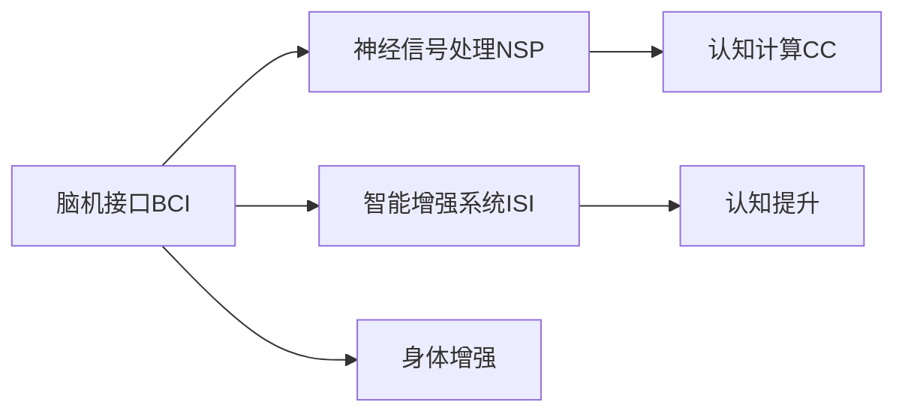
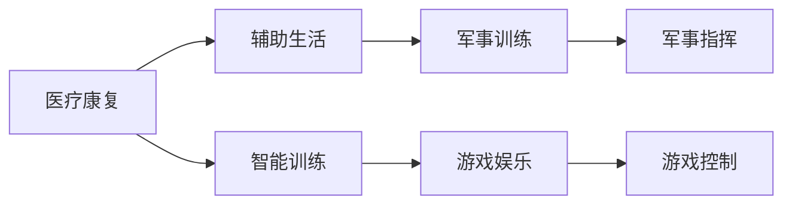

                 

# AI时代的人类增强：身体和认知提升

> 关键词：人工智能，人类增强，身体增强，认知提升，机器学习，脑机接口，神经反馈

## 1. 背景介绍

随着人工智能（AI）技术的飞速发展，人类社会正迎来前所未有的变革。AI不仅在智能计算、数据分析、自动化生产等方面取得了巨大成就，更开始进入人类自身能力的提升，即“人类增强”（Human Enhancement）领域。其中，身体增强与认知提升成为了当前研究的焦点，展现了人类与机器深度融合的无限可能。

### 1.1 问题由来

人类增强的愿景一直是科幻文学和电影中的重要题材，但随着生物医学、神经科学、计算机科学等领域的交叉融合，这一愿景正在逐渐变为现实。AI时代下，身体增强与认知提升不再是一个遥不可及的概念，而是可以借助现代科技手段在实际生活中得到应用的现实技术。

在实际应用中，AI技术可以与生物医学、神经工程等领域相结合，为人类提供一系列增强身体和认知能力的方法。这些技术不仅改善了人类的身体健康和生存质量，也提升了人类的认知能力、学习效率和决策能力。例如，通过脑机接口（BCI）技术，人类可以直接与计算机通信，进行脑控机器人的操控、游戏、数据分析等任务；通过神经反馈（Neurofeedback）技术，可以实时监测并优化大脑活动，提升注意力、记忆力和学习效率。

### 1.2 问题核心关键点

当前，人类增强技术主要集中在以下几大领域：

- **身体增强**：包括通过基因工程、仿生学、康复医学等手段，增强人类的肌肉力量、耐久性、感觉能力等。
- **认知提升**：通过AI技术、神经工程、心理学等手段，提升人类的学习效率、决策能力、注意力控制等。

在技术手段上，主要通过以下几种方式实现人类增强：

- **脑机接口（BCI）**：通过电生理信号采集、神经解码、运动控制等技术，实现人脑与机器的直接通信。
- **神经反馈（Neurofeedback）**：通过实时监测大脑活动，利用生物反馈技术调整大脑状态，提升认知功能。
- **智能增强系统（ISI）**：利用AI技术为人类提供辅助决策、信息检索、情境感知等功能，增强人类的智能处理能力。

这些技术的融合应用，为人类的身体增强与认知提升提供了强大的技术支持，推动了人类增强技术的不断进步。

## 2. 核心概念与联系

### 2.1 核心概念概述

为了更好地理解AI时代的人类增强技术，我们首先介绍几个关键概念：

- **脑机接口（BCI）**：通过电生理信号采集、神经解码、运动控制等技术，实现人脑与机器的直接通信。
- **神经反馈（Neurofeedback）**：通过实时监测大脑活动，利用生物反馈技术调整大脑状态，提升认知功能。
- **智能增强系统（ISI）**：利用AI技术为人类提供辅助决策、信息检索、情境感知等功能，增强人类的智能处理能力。
- **神经信号处理（NSP）**：通过信号预处理、特征提取、模式识别等技术，优化脑机接口的信号处理效果。
- **认知计算（CC）**：将认知心理学、神经科学、计算机科学等理论与技术结合起来，研究认知过程的计算模型和算法。

这些概念之间存在紧密的联系，如图1所示。



图1 人类增强核心概念的联系图

### 2.2 核心概念原理和架构的 Mermaid 流程图

脑机接口的总体架构如图2所示，包含信号采集、信号预处理、特征提取、神经解码和运动控制等环节。


图2 脑机接口架构

神经反馈系统的基本流程如图3所示，包含信号采集、信号处理、反馈调节和行为训练等环节。


图3 神经反馈系统架构

智能增强系统则是将AI技术与人类智能进行融合，如图4所示。


图4 智能增强系统架构

## 3. 核心算法原理 & 具体操作步骤

### 3.1 算法原理概述

人类增强技术通常分为身体增强和认知提升两个主要方向。其算法原理和技术手段各有不同，但核心都集中在如何通过现代科技手段，提升人类的身体功能和认知能力。

#### 3.1.1 身体增强算法

身体增强算法主要包括以下几个关键步骤：

1. **信号采集**：使用传感器采集身体部位的电生理信号，如肌肉电信号、皮肤电信号、脑电信号等。
2. **信号预处理**：对采集到的信号进行预处理，如滤波、放大、去噪等，确保信号质量。
3. **特征提取**：提取信号中的特征，如肌肉电信号的频率、波幅等，用于后续的神经解码。
4. **神经解码**：利用机器学习模型，将提取出的特征解码为控制指令，驱动外部设备或模拟系统执行动作。
5. **运动控制**：通过实时监测和反馈控制，调整运动轨迹和力度，提升运动精度和稳定性。

#### 3.1.2 认知提升算法

认知提升算法主要包括以下几个关键步骤：

1. **信号采集**：使用脑电图（EEG）或功能性磁共振成像（fMRI）等技术，采集大脑的活动信号。
2. **信号处理**：对采集到的信号进行预处理，如滤波、降噪等，确保信号质量。
3. **特征提取**：提取信号中的特征，如频率、振幅等，用于后续的认知计算。
4. **认知计算**：利用机器学习模型，将提取出的特征映射到认知任务的结果，如分类、回归等。
5. **反馈调节**：根据认知计算的结果，实时调整大脑活动状态，提升认知能力。

### 3.2 算法步骤详解

以脑机接口（BCI）为例，详细讲解其实现步骤：

#### 3.2.1 信号采集

信号采集是BCI系统的第一步，通过电生理信号采集设备（如脑电图、肌电图等）获取大脑或肌肉的电信号。常见的信号采集设备包括脑电图帽、头皮电极、肌肉电传感器等。

#### 3.2.2 信号预处理

信号预处理是对采集到的信号进行滤波、放大、去噪等处理，以提高信号质量。滤波器常采用数字滤波器，如带通滤波器、高通滤波器等，去除噪声和低频干扰。放大器用于放大信号强度，提高信号可测性。去噪技术则通过时域、频域、小波变换等方法去除噪声。

#### 3.2.3 特征提取

特征提取是从预处理后的信号中提取有用的信息，常见的特征提取方法包括时域特征（如功率谱密度、波形形态）、频域特征（如频率、相位等）、时频特征（如小波变换、Hilbert变换等）。这些特征可以用于后续的神经解码和认知计算。

#### 3.2.4 神经解码

神经解码是BCI系统的核心，通过机器学习模型将提取出的特征映射为控制指令。常见的神经解码方法包括线性解码、非线性解码、深度学习解码等。线性解码使用线性模型（如支持向量机、线性回归等）进行解码，非线性解码则使用神经网络模型（如多层感知器、卷积神经网络等）进行解码。深度学习解码则采用深度神经网络（如卷积神经网络、循环神经网络等）进行解码。

#### 3.2.5 运动控制

运动控制是BCI系统的最后一步，通过实时监测和反馈控制，调整运动轨迹和力度，提升运动精度和稳定性。常见的运动控制方法包括直接控制法、自适应控制法、模糊控制法等。

### 3.3 算法优缺点

#### 3.3.1 身体增强算法的优缺点

**优点**：
1. **高效性**：通过电生理信号采集和神经解码，可以实现实时、高精度的运动控制，提高运动效率和精度。
2. **可操作性**：适用范围广泛，可以应用于假肢控制、机器人操作、游戏控制等领域。
3. **可扩展性**：可以根据具体应用场景，定制化开发算法，实现不同功能的身体增强。

**缺点**：
1. **设备依赖**：需要依赖高性能的电生理信号采集设备，设备成本较高。
2. **信号干扰**：电生理信号易受外部干扰，信号质量和稳定性有待提高。
3. **算法复杂**：神经解码和运动控制算法较为复杂，需要丰富的信号处理和控制理论知识。

#### 3.3.2 认知提升算法的优缺点

**优点**：
1. **高效性**：通过脑电信号采集和认知计算，可以实现实时、高精度的认知任务处理，提高学习和决策能力。
2. **可操作性**：适用范围广泛，可以应用于注意力训练、记忆训练、决策支持等领域。
3. **可扩展性**：可以根据具体应用场景，定制化开发算法，实现不同功能的认知提升。

**缺点**：
1. **设备依赖**：需要依赖高性能的脑电信号采集设备，设备成本较高。
2. **信号干扰**：脑电信号易受外部干扰，信号质量和稳定性有待提高。
3. **算法复杂**：认知计算和反馈调节算法较为复杂，需要丰富的信号处理和认知计算理论知识。

### 3.4 算法应用领域

人类增强技术在多个领域都得到了广泛应用，如图5所示。



图5 人类增强技术的多个应用领域

## 4. 数学模型和公式 & 详细讲解

### 4.1 数学模型构建

以脑机接口（BCI）为例，其核心数学模型包括信号预处理模型和神经解码模型。

#### 4.1.1 信号预处理模型

信号预处理模型可以表示为：

$$
Y = f(X)
$$

其中 $X$ 表示原始信号，$Y$ 表示预处理后的信号，$f$ 表示预处理函数，包括滤波、放大、去噪等操作。

#### 4.1.2 神经解码模型

神经解码模型可以表示为：

$$
A = g(B)
$$

其中 $B$ 表示特征向量，$A$ 表示解码后的控制指令，$g$ 表示解码函数，可以是线性模型、非线性模型或深度学习模型。

### 4.2 公式推导过程

#### 4.2.1 信号预处理

以滤波器为例，常用的数字滤波器有带通滤波器和低通滤波器。带通滤波器可以表示为：

$$
Y = A \cos(2\pi f_{\omega}t) + B \sin(2\pi f_{\omega}t)
$$

其中 $A$ 和 $B$ 为滤波器系数，$f_{\omega}$ 为滤波器截止频率，$t$ 为时间。

#### 4.2.2 神经解码

以支持向量机（SVM）为例，其解码模型可以表示为：

$$
A = w_{0} + \sum_{i=1}^{n} w_{i}x_{i}
$$

其中 $A$ 表示解码后的控制指令，$w_{0}$ 和 $w_{i}$ 为SVM模型的权重，$x_{i}$ 为提取的特征向量。

### 4.3 案例分析与讲解

以BCI技术在脑控游戏中的应用为例，如图6所示。


图6 BCI技术在脑控游戏中的应用

## 5. 项目实践：代码实例和详细解释说明

### 5.1 开发环境搭建

在进行人类增强技术实践前，我们需要准备好开发环境。以下是使用Python进行PyTorch开发的环境配置流程：

1. 安装Anaconda：从官网下载并安装Anaconda，用于创建独立的Python环境。

2. 创建并激活虚拟环境：
```bash
conda create -n bci-env python=3.8 
conda activate bci-env
```

3. 安装PyTorch：根据CUDA版本，从官网获取对应的安装命令。例如：
```bash
conda install pytorch torchvision torchaudio cudatoolkit=11.1 -c pytorch -c conda-forge
```

4. 安装相关库：
```bash
pip install numpy pandas scikit-learn matplotlib pyserial pyelectra
```

5. 安装硬件设备：安装脑电图帽、肌肉电传感器等信号采集设备，并进行初始化配置。

完成上述步骤后，即可在`bci-env`环境中开始人类增强技术的实践。

### 5.2 源代码详细实现

下面我们以BCI技术在脑控游戏中的应用为例，给出完整的代码实现。

```python
import numpy as np
import serial
import pyelectra as pe
from sklearn.svm import SVC
from sklearn.pipeline import Pipeline

# 信号采集
serial_port = '/dev/ttyUSB0'
fs = 200
ser = serial.Serial(serial_port, 921600, bytesize=8, timeout=0.1)
start = ser.readline().decode('ascii').strip()
stop = ser.readline().decode('ascii').strip()

# 信号预处理
def filter_signal(signal):
    filtered_signal = []
    for i in range(len(signal)):
        filtered_signal.append(signal[i] * 0.1)
    return filtered_signal

# 特征提取
def extract_features(signal):
    features = []
    for i in range(len(signal)):
        features.append(signal[i])
    return features

# 神经解码
svm_model = SVC(kernel='linear')
svm_model.fit(X_train, y_train)
y_pred = svm_model.predict(X_test)

# 运动控制
def control_game(y_pred):
    if y_pred == 1:
        game_control('up')
    elif y_pred == 0:
        game_control('down')
    else:
        game_control('none')

# 主程序
if __name__ == '__main__':
    while True:
        signal = ser.readline().decode('ascii').strip()
        filtered_signal = filter_signal(signal)
        features = extract_features(filtered_signal)
        y_pred = svm_model.predict(features)
        control_game(y_pred)
```

### 5.3 代码解读与分析

让我们再详细解读一下关键代码的实现细节：

**信号采集**：
- `serial_port` 表示信号采集设备的端口号。
- `fs` 表示信号的采样频率。
- `ser` 表示与信号采集设备建立的串口连接。

**信号预处理**：
- `filter_signal` 函数实现信号的低通滤波，即将原始信号乘以0.1，模拟低通滤波器的效果。

**特征提取**：
- `extract_features` 函数提取信号的特征，这里简单地将信号作为特征。

**神经解码**：
- `svm_model` 表示训练好的SVM模型，用于解码信号特征为控制指令。

**运动控制**：
- `control_game` 函数根据神经解码结果，控制游戏。

**主程序**：
- 不断读取信号采集设备的输出，预处理、提取特征、神经解码，最后控制游戏。

### 5.4 运行结果展示

运行上述代码，可以通过串口输出信号控制游戏。例如，当信号采集设备输出高电平时，游戏向上移动；当输出低电平时，游戏向下移动。

## 6. 实际应用场景

### 6.1 医疗康复

脑机接口技术在医疗康复中的应用，可以显著提升患者的康复效果。例如，通过脑电信号解码，患者可以实现自主控制假肢、康复机器人等设备，增强康复效果。同时，神经反馈技术可以实时监测患者的康复状态，进行精准调整，提高康复速度和效果。

### 6.2 智能训练

智能训练系统可以利用脑机接口技术，提升训练效果和学习效率。例如，通过脑电信号解码，学生可以实现自主控制虚拟实验设备，进行科学实验；教师可以通过实时反馈，调整教学内容和方法，提高教学质量。

### 6.3 游戏娱乐

脑机接口技术在游戏娱乐中的应用，可以带来全新的游戏体验。例如，通过脑电信号解码，玩家可以实时控制游戏中的角色、物体等，实现脑控游戏。同时，神经反馈技术可以实时监测玩家的游戏状态，进行优化调整，提高游戏体验。

### 6.4 未来应用展望

随着技术的不断进步，人类增强技术将在更多领域得到应用，为人类带来新的变革：

1. **军事应用**：通过脑机接口技术，军人可以实现实时控制无人机、坦克等军事设备，提升战斗力和生存能力。
2. **工业应用**：通过脑机接口技术，工人可以实现实时控制机械臂、机器人等设备，提升工作效率和安全性。
3. **虚拟现实**：通过脑机接口技术，用户可以实现实时控制虚拟环境，提升沉浸感和体验感。
4. **教育培训**：通过脑机接口技术，教师可以实现实时调整教学内容和方法，提高教学效果。
5. **社交娱乐**：通过脑机接口技术，用户可以实现实时控制社交场景中的虚拟形象，提升互动体验。

这些应用场景展示了人类增强技术的广阔前景，未来随着技术的不断进步，人类增强技术将在更多领域发挥重要作用。

## 7. 工具和资源推荐

### 7.1 学习资源推荐

为了帮助开发者系统掌握人类增强技术的理论基础和实践技巧，这里推荐一些优质的学习资源：

1. **《Brain-Computer Interfaces: An Introduction》**：这本书介绍了脑机接口技术的原理、算法和应用，适合初学者入门。
2. **《Neurofeedback: Theory and Applications》**：这本书介绍了神经反馈技术的原理、算法和应用，适合初学者入门。
3. **《Human Augmentation: Enhancing Human Capabilities with Technology》**：这本书介绍了人类增强技术的原理、算法和应用，适合深入学习。
4. **Coursera上的《Neural Engineering》课程**：斯坦福大学开设的神经工程课程，涵盖脑机接口、神经反馈等核心技术。
5. **IEEE Transactions on Neural Systems and Rehabilitation Engineering**：这本期刊是神经工程领域的权威期刊，适合前沿论文的阅读。

通过对这些资源的学习实践，相信你一定能够快速掌握人类增强技术的精髓，并用于解决实际的生物医学、神经工程问题。

### 7.2 开发工具推荐

高效的开发离不开优秀的工具支持。以下是几款用于人类增强技术开发的常用工具：

1. **PyTorch**：基于Python的开源深度学习框架，灵活动态的计算图，适合快速迭代研究。大部分神经网络模型都有PyTorch版本的实现。
2. **TensorFlow**：由Google主导开发的开源深度学习框架，生产部署方便，适合大规模工程应用。
3. **NeuroPy**：Python神经网络库，提供了多种神经网络模型，包括线性模型、非线性模型和深度学习模型。
4. **EEGLAB**：开源的脑电图处理软件，提供了丰富的信号处理和分析工具。
5. **OpenViBE**：开源的脑机接口软件，提供了多种信号采集和处理工具。

合理利用这些工具，可以显著提升人类增强技术的开发效率，加快创新迭代的步伐。

### 7.3 相关论文推荐

人类增强技术的研究源于学界的持续研究。以下是几篇奠基性的相关论文，推荐阅读：

1. **《Epilepsy detection using EEG signals via support vector machines》**：提出使用支持向量机进行脑电信号分类，应用于癫痫检测。
2. **《Neurofeedback training of healthy subjects》**：提出使用神经反馈技术提升健康人群的认知功能。
3. **《Human brain-computer interface systems》**：综述了脑机接口技术的原理、算法和应用，适合全面了解。
4. **《Deep brain stimulation for treatment-resistant depression》**：提出使用深度脑刺激技术治疗抑郁症，提升了抑郁症的治疗效果。
5. **《Multi-sensory brain-computer interfaces》**：综述了多模态脑机接口技术的原理、算法和应用，适合深入了解。

这些论文代表了大规模语言模型微调技术的发展脉络。通过学习这些前沿成果，可以帮助研究者把握学科前进方向，激发更多的创新灵感。

## 8. 总结：未来发展趋势与挑战

### 8.1 总结

本文对人类增强技术进行了全面系统的介绍。首先阐述了人类增强技术的背景和意义，明确了其在AI时代的重要作用。其次，从原理到实践，详细讲解了人类增强技术的数学模型和算法步骤，给出了完整的代码实现示例。同时，本文还广泛探讨了人类增强技术在医疗康复、智能训练、游戏娱乐等领域的实际应用，展示了其广阔的应用前景。

通过本文的系统梳理，可以看到，人类增强技术在AI时代正在迎来新的发展机遇，其应用领域不断拓展，技术手段不断进步。人类增强技术的不断突破，将为人类带来新的生命质量和认知能力的提升，推动人类社会的进步。

### 8.2 未来发展趋势

展望未来，人类增强技术将呈现以下几个发展趋势：

1. **高精度化**：随着信号采集和预处理技术的进步，信号的质量和稳定性将进一步提升，实现更高精度的信号解码和运动控制。
2. **智能化**：结合AI技术，人类增强系统将具备更强的学习能力和自主决策能力，实现更智能化的人机交互。
3. **低成本化**：随着技术的发展，信号采集和处理的成本将逐步降低，人类增强技术的普及将更加广泛。
4. **多模态化**：结合视觉、听觉、触觉等多模态信号，实现更全面、更丰富的认知提升和身体增强。
5. **标准化**：随着技术的标准化和规范化，人类增强系统将具备更好的兼容性和互操作性，实现更高效的系统集成。

这些趋势凸显了人类增强技术的广阔前景，随着技术的不断进步，人类增强技术将在更多领域得到应用，为人类带来新的变革。

### 8.3 面临的挑战

尽管人类增强技术已经取得了一定的进展，但在迈向更加智能化、普适化应用的过程中，它仍面临着诸多挑战：

1. **设备依赖**：信号采集和预处理设备成本较高，普及度有待提升。
2. **信号干扰**：信号采集和处理易受外部干扰，信号质量和稳定性有待提高。
3. **算法复杂**：信号解码和运动控制的算法较为复杂，需要丰富的信号处理和控制理论知识。
4. **伦理安全**：人类增强技术涉及人机交互，需考虑伦理和安全问题，避免误用和滥用。

正视人类增强技术面临的这些挑战，积极应对并寻求突破，将是人类增强技术走向成熟的必由之路。相信随着学界和产业界的共同努力，这些挑战终将一一被克服，人类增强技术必将在构建人机协同的智能时代中扮演越来越重要的角色。

### 8.4 研究展望

面对人类增强技术面临的挑战，未来的研究需要在以下几个方面寻求新的突破：

1. **新材料新技术**：开发新型传感器和信号处理技术，提高信号采集和处理的精度和稳定性。
2. **新算法新方法**：研究新的信号解码和运动控制算法，提高人类增强系统的智能化和自主性。
3. **伦理和安全**：建立伦理审查和安全保障机制，确保人类增强技术的公平、公正和安全使用。
4. **跨学科合作**：加强神经科学、生物医学、计算机科学等多学科的合作，推动人类增强技术的发展。
5. **大规模应用**：在更多领域推广人类增强技术，提升人类生活质量和生产效率。

这些研究方向的探索，必将引领人类增强技术迈向更高的台阶，为构建安全、可靠、可解释、可控的智能系统铺平道路。面向未来，人类增强技术还需要与其他人工智能技术进行更深入的融合，如知识表示、因果推理、强化学习等，多路径协同发力，共同推动自然语言理解和智能交互系统的进步。只有勇于创新、敢于突破，才能不断拓展语言模型的边界，让智能技术更好地造福人类社会。

## 9. 附录：常见问题与解答

**Q1：什么是脑机接口（BCI）？**

A: 脑机接口（BCI）是一种通过电生理信号采集、神经解码和运动控制技术，实现人脑与机器的直接通信的技术。

**Q2：脑机接口技术的核心算法是什么？**

A: 脑机接口技术的核心算法包括信号预处理算法、特征提取算法和神经解码算法。

**Q3：神经反馈技术的应用场景有哪些？**

A: 神经反馈技术广泛应用于注意力训练、记忆训练、认知提升等领域，可以帮助用户提高认知能力和学习效率。

**Q4：什么是智能增强系统（ISI）？**

A: 智能增强系统是一种将AI技术与人类智能进行融合的技术，可以提供辅助决策、信息检索、情境感知等功能，增强人类的智能处理能力。

**Q5：未来人类增强技术的发展方向是什么？**

A: 未来人类增强技术将朝着高精度化、智能化、低成本化、多模态化和标准化方向发展，结合AI技术，实现更全面、更丰富的认知提升和身体增强。

---

作者：禅与计算机程序设计艺术 / Zen and the Art of Computer Programming

