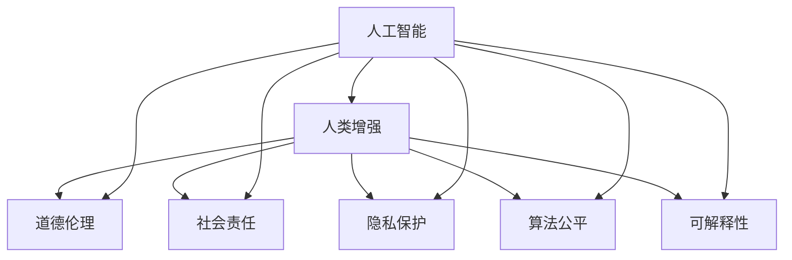

                 

# AI时代的人类增强：道德和伦理问题

> 关键词：人工智能,人类增强,道德伦理,社会责任,隐私保护,算法公平,可解释性

## 1. 背景介绍

随着人工智能技术的飞速发展，人类正步入一个全新的AI时代。AI技术在诸多领域取得了重大突破，从自动驾驶、医疗诊断到金融分析、教育辅助，无不展示了其强大的潜力和影响力。然而，技术的进步同时也带来了新的道德和伦理问题，亟需深入探讨和解决。

AI时代的人类增强，是指通过人工智能技术提升人类的认知、情感、身体等方面的能力，以应对复杂多变的现实世界。这种增强不仅包括物理形态的改善，还涵盖了信息处理、决策支持、创新能力等多方面。然而，人类增强的同时，也伴随着诸多道德和伦理挑战，如何确保技术的安全、公平、透明、可控，成为全社会关注的焦点。

## 2. 核心概念与联系

### 2.1 核心概念概述

本节将介绍几个关键概念，并阐释它们之间的联系：

- **人工智能(Artificial Intelligence, AI)**：指由计算机系统执行的任务，这些任务通常需要人类的智能来完成。AI包括机器学习、深度学习、自然语言处理、计算机视觉等多个子领域。

- **人类增强(Human Enhancement)**：指通过技术手段增强人类的认知、情感、身体等方面的能力，实现更高效、更全面的生活和工作。

- **道德伦理(Ethics)**：涉及对行为、制度、思想等进行价值判断，确定其道德合理性和伦理责任。

- **社会责任(Social Responsibility)**：指个人、组织、企业在追求经济利益和社会效益时，应承担的义务和责任，包括对公众、环境、社会的贡献。

- **隐私保护(Privacy Protection)**：指保护个人隐私不被非法获取、使用或泄露，确保个人信息安全。

- **算法公平(Algorithm Fairness)**：指在算法设计和使用过程中，确保对所有群体或个体公平对待，避免偏见和歧视。

- **可解释性(Explainability)**：指算法或系统的决策过程应能够被理解和解释，便于用户、监管机构了解和信任。

### 2.2 核心概念原理和架构的 Mermaid 流程图



这个流程图展示了AI技术如何通过人类增强提升人类能力，并在此过程中产生道德、伦理、隐私、公平、可解释性等多重挑战。

## 3. 核心算法原理 & 具体操作步骤

### 3.1 算法原理概述

AI时代的人类增强主要依赖于以下几个核心算法原理：

- **强化学习(Reinforcement Learning, RL)**：通过与环境交互，学习最优决策策略。强化学习可用于训练智能机器人、优化生产流程、提升游戏智能等。

- **自然语言处理(Natural Language Processing, NLP)**：使计算机能理解、处理和生成人类语言。NLP可用于智能客服、自动翻译、文本摘要等任务。

- **计算机视觉(Computer Vision, CV)**：使计算机能“看”并理解视觉信息。CV可用于图像识别、视频分析、自动驾驶等。

- **机器人学(Robotics)**：研究如何设计、制造、控制机器人。机器人可用于工业自动化、服务机器人、医疗辅助等。

- **基因编辑(Genome Editing)**：利用基因编辑技术如CRISPR，修改生物基因，提升人体健康和寿命。

### 3.2 算法步骤详解

#### 3.2.1 数据采集与预处理

1. **数据采集**：从多渠道采集相关数据，包括公共数据库、用户上传数据、传感器数据等。数据来源应多样、全面，避免偏差。
2. **数据清洗**：对采集到的数据进行去重、去噪、填补缺失值等处理，确保数据质量。
3. **数据标注**：对数据进行标注，例如标签分类、关键点检测、行为识别等，为后续算法训练提供有效监督信号。

#### 3.2.2 模型训练与评估

1. **模型选择**：根据任务需求选择合适的算法模型，如CNN、RNN、Transformer等。
2. **模型训练**：利用标注数据训练模型，通过迭代优化调整模型参数。常用的训练算法包括梯度下降、随机梯度下降、Adam等。
3. **模型评估**：使用测试集评估模型性能，通常使用准确率、召回率、F1分数等指标。

#### 3.2.3 部署与应用

1. **模型部署**：将训练好的模型部署到生产环境，例如服务器、嵌入式设备等。
2. **系统集成**：将模型集成到业务流程中，例如自动驾驶车辆、医疗诊断系统、教育辅助工具等。
3. **用户交互**：提供友好的用户界面，使用户能够轻松使用增强技术。

### 3.3 算法优缺点

#### 3.3.1 优点

1. **高效性**：AI技术能够快速处理大量数据，显著提升工作效率。
2. **准确性**：AI算法在处理特定任务时，通常具有较高准确度。
3. **创新性**：AI技术不断突破现有认知边界，引领新的应用领域。

#### 3.3.2 缺点

1. **依赖数据**：AI技术高度依赖于数据质量，数据偏差可能导致模型偏见。
2. **不可解释性**：许多AI模型（如深度神经网络）的决策过程难以解释，缺乏透明度。
3. **安全性问题**：AI系统可能被攻击或误用，带来安全风险。
4. **隐私风险**：AI系统处理敏感数据，可能泄露用户隐私。
5. **伦理挑战**：AI技术应用可能导致不平等、歧视等问题。

### 3.4 算法应用领域

AI技术在多个领域中得到广泛应用，涵盖了医疗、教育、交通、金融等众多方面：

- **医疗领域**：通过AI辅助诊断、药物研发、病历管理等，提高医疗效率和精准度。
- **教育领域**：利用AI进行个性化学习、智能辅助教学、智能评估等，提升教育质量。
- **交通领域**：通过AI实现自动驾驶、交通流量优化、智能导航等，改善交通体验。
- **金融领域**：应用AI进行风险评估、投资分析、智能客服等，提升金融服务水平。

## 4. 数学模型和公式 & 详细讲解 & 举例说明

### 4.1 数学模型构建

#### 4.1.1 强化学习

强化学习的基本模型为：

$$
V(s) = \max_a \sum_{t=0}^\infty \gamma^t r(s_t,a_t)
$$

其中 $s$ 为当前状态，$a$ 为当前动作，$r$ 为即时奖励，$\gamma$ 为折扣因子。目标是在给定状态 $s$ 下，选择动作 $a$ 最大化长期奖励。

#### 4.1.2 自然语言处理

在NLP中，常见任务如文本分类、情感分析、机器翻译等，可以通过如下公式表示：

$$
\text{Output} = f(\text{Input}; \theta)
$$

其中 $\text{Input}$ 为输入文本，$\theta$ 为模型参数，$f$ 为模型映射函数。

#### 4.1.3 计算机视觉

计算机视觉模型常用于图像分类、物体检测等任务。常见模型如卷积神经网络（CNN），其基本结构如下：

$$
f_{CNN}(x) = W_2 \cdot f_{Conv}(W_1 \cdot x + b_1) + b_2
$$

其中 $x$ 为输入图像，$f_{Conv}$ 为卷积层函数，$W_1$、$W_2$ 为卷积核权重，$b_1$、$b_2$ 为偏置项。

#### 4.1.4 机器人学

机器人学中，常见的路径规划算法如A*搜索，其基本步骤为：

1. 定义起点 $s_0$ 和终点 $s_g$
2. 定义启发式函数 $h(s)$
3. 初始化开放列表 $O$ 和关闭列表 $C$
4. 重复以下步骤直到找到终点或无解：
   1. 从 $O$ 中取出 $s_{best}$
   2. 若 $s_{best} = s_g$，则返回路径
   3. 扩展 $s_{best}$ 的邻居节点，更新其评估值
   4. 将新节点加入 $O$ 或 $C$

### 4.2 公式推导过程

#### 4.2.1 强化学习

强化学习的核心在于求解最优策略 $\pi$，使得在给定状态下选择动作最大化长期奖励。具体推导如下：

1. 定义状态-动作值函数 $Q(s,a)$ 为在状态 $s$ 下选择动作 $a$ 的期望长期奖励。
2. 利用贝尔曼方程求解 $Q(s,a)$：
   $$
   Q(s,a) = r(s,a) + \gamma \max_a Q(s',a')
   $$
   其中 $s'$ 为 $s$ 的下一状态，$a'$ 为 $s'$ 的下一动作。

3. 通过求解 $Q(s,a)$，可以得到最优策略 $\pi(s) = \arg\max_a Q(s,a)$。

#### 4.2.2 自然语言处理

在NLP中，常见任务如文本分类、情感分析、机器翻译等，可以通过如下公式表示：

$$
\text{Output} = f(\text{Input}; \theta)
$$

其中 $\text{Input}$ 为输入文本，$\theta$ 为模型参数，$f$ 为模型映射函数。

#### 4.2.3 计算机视觉

计算机视觉模型常用于图像分类、物体检测等任务。常见模型如卷积神经网络（CNN），其基本结构如下：

$$
f_{CNN}(x) = W_2 \cdot f_{Conv}(W_1 \cdot x + b_1) + b_2
$$

其中 $x$ 为输入图像，$f_{Conv}$ 为卷积层函数，$W_1$、$W_2$ 为卷积核权重，$b_1$、$b_2$ 为偏置项。

#### 4.2.4 机器人学

机器人学中，常见的路径规划算法如A*搜索，其基本步骤为：

1. 定义起点 $s_0$ 和终点 $s_g$
2. 定义启发式函数 $h(s)$
3. 初始化开放列表 $O$ 和关闭列表 $C$
4. 重复以下步骤直到找到终点或无解：
   1. 从 $O$ 中取出 $s_{best}$
   2. 若 $s_{best} = s_g$，则返回路径
   3. 扩展 $s_{best}$ 的邻居节点，更新其评估值
   4. 将新节点加入 $O$ 或 $C$

### 4.3 案例分析与讲解

#### 4.3.1 医疗领域

以AI辅助诊断为例，其基本流程为：

1. 数据采集：收集患者历史病例、影像数据、基因数据等。
2. 数据预处理：对数据进行清洗、标注，准备用于训练模型。
3. 模型训练：利用标注数据训练神经网络模型，如卷积神经网络（CNN）、循环神经网络（RNN）等。
4. 模型评估：在测试集上评估模型性能，调整模型参数。
5. 应用部署：将训练好的模型部署到医疗系统中，辅助医生进行诊断和治疗决策。

#### 4.3.2 教育领域

以智能辅助教学为例，其基本流程为：

1. 数据采集：收集学生学习数据、作业数据、考试成绩等。
2. 数据预处理：对数据进行清洗、标注，准备用于训练模型。
3. 模型训练：利用标注数据训练神经网络模型，如递归神经网络（RNN）、注意力机制等。
4. 模型评估：在测试集上评估模型性能，调整模型参数。
5. 应用部署：将训练好的模型集成到教学系统中，辅助教师进行个性化教学、智能评估等。

## 5. 项目实践：代码实例和详细解释说明

### 5.1 开发环境搭建

在进行AI增强实践前，我们需要准备好开发环境。以下是使用Python进行PyTorch开发的环境配置流程：

1. 安装Anaconda：从官网下载并安装Anaconda，用于创建独立的Python环境。

2. 创建并激活虚拟环境：
```bash
conda create -n pytorch-env python=3.8 
conda activate pytorch-env
```

3. 安装PyTorch：根据CUDA版本，从官网获取对应的安装命令。例如：
```bash
conda install pytorch torchvision torchaudio cudatoolkit=11.1 -c pytorch -c conda-forge
```

4. 安装TensorFlow：如果需要进行TensorFlow开发，同样需要安装相应的库：
```bash
pip install tensorflow==2.3
```

5. 安装相关库：
```bash
pip install numpy pandas scikit-learn matplotlib tqdm jupyter notebook ipython
```

完成上述步骤后，即可在`pytorch-env`环境中开始AI增强实践。

### 5.2 源代码详细实现

这里我们以图像分类为例，给出使用PyTorch进行卷积神经网络模型训练的代码实现。

```python
import torch
import torch.nn as nn
import torch.optim as optim
import torchvision
import torchvision.transforms as transforms
from torch.utils.data import DataLoader
import matplotlib.pyplot as plt

# 定义卷积神经网络模型
class CNN(nn.Module):
    def __init__(self):
        super(CNN, self).__init__()
        self.conv1 = nn.Conv2d(3, 16, kernel_size=3, stride=1, padding=1)
        self.pool = nn.MaxPool2d(kernel_size=2, stride=2)
        self.conv2 = nn.Conv2d(16, 32, kernel_size=3, stride=1, padding=1)
        self.fc1 = nn.Linear(32 * 28 * 28, 128)
        self.fc2 = nn.Linear(128, 10)

    def forward(self, x):
        x = self.pool(F.relu(self.conv1(x)))
        x = self.pool(F.relu(self.conv2(x)))
        x = x.view(-1, 32 * 28 * 28)
        x = F.relu(self.fc1(x))
        x = self.fc2(x)
        return x

# 加载数据集并进行预处理
transform = transforms.Compose([
    transforms.ToTensor(),
    transforms.Normalize((0.5, 0.5, 0.5), (0.5, 0.5, 0.5))
])
trainset = torchvision.datasets.CIFAR10(root='./data', train=True,
                                        download=True, transform=transform)
trainloader = torch.utils.data.DataLoader(trainset, batch_size=4,
                                          shuffle=True, num_workers=2)

testset = torchvision.datasets.CIFAR10(root='./data', train=False,
                                       download=True, transform=transform)
testloader = torch.utils.data.DataLoader(testset, batch_size=4,
                                         shuffle=False, num_workers=2)

# 定义模型和优化器
model = CNN()
criterion = nn.CrossEntropyLoss()
optimizer = optim.SGD(model.parameters(), lr=0.001, momentum=0.9)

# 训练模型
for epoch in range(2):
    running_loss = 0.0
    for i, data in enumerate(trainloader, 0):
        inputs, labels = data
        optimizer.zero_grad()
        outputs = model(inputs)
        loss = criterion(outputs, labels)
        loss.backward()
        optimizer.step()

        running_loss += loss.item()
        if i % 2000 == 1999:
            print('[%d, %5d] loss: %.3f' %
                  (epoch + 1, i + 1, running_loss / 2000))
            running_loss = 0.0

print('Finished Training')
```

以上就是使用PyTorch对卷积神经网络进行图像分类任务训练的完整代码实现。可以看到，得益于PyTorch的强大封装，我们可以用相对简洁的代码完成模型训练，并利用可视化工具展示训练过程和结果。

### 5.3 代码解读与分析

让我们再详细解读一下关键代码的实现细节：

**CNN类**：
- `__init__`方法：定义卷积层、池化层、全连接层等组件。
- `forward`方法：实现模型前向传播，计算损失函数并反向传播更新模型参数。

**数据加载器**：
- 利用`torchvision.datasets.CIFAR10`加载CIFAR-10数据集，并进行预处理，转化为Tensor格式。
- 定义训练集和测试集的数据加载器，用于迭代训练数据和测试数据。

**训练过程**：
- 定义模型、优化器和损失函数。
- 在每个epoch内，对训练集数据进行迭代，计算损失函数并更新模型参数。
- 使用`print`输出每个epoch的平均损失值。
- 训练结束后输出“Finished Training”。

可以看到，PyTorch使得AI增强的实现变得简便高效，开发者可以更加专注于算法创新和应用实践。

## 6. 实际应用场景

### 6.1 智能客服系统

基于AI增强的智能客服系统，可以提供24/7无间断服务，通过自然语言处理和语音识别技术，实时响应客户咨询，解决客户问题。智能客服系统可以处理常见的客户咨询，如产品信息、订单查询、退换货流程等，提升客户满意度和服务效率。

### 6.2 金融风险控制

在金融领域，AI增强技术可以用于风险评估、信用评分、欺诈检测等任务。通过分析客户的交易行为、信用历史、社交网络等数据，AI模型可以预测客户的违约风险、欺诈行为，为金融机构提供决策支持，降低金融风险。

### 6.3 教育辅助工具

AI增强技术可以用于个性化教育、智能评估、智能推荐等任务。通过分析学生的学习数据、行为数据、反馈数据等，AI模型可以为每个学生提供量身定制的学习方案，推荐适合的课程、资源，提升学习效果。

### 6.4 自动驾驶汽车

在交通领域，AI增强技术可以用于自动驾驶汽车、智能交通管理等任务。通过感知、决策、控制等技术，AI模型可以实现自动驾驶、路径规划、避障等功能，提升交通安全和效率。

## 7. 工具和资源推荐

### 7.1 学习资源推荐

为了帮助开发者系统掌握AI增强技术的理论基础和实践技巧，这里推荐一些优质的学习资源：

1. 《深度学习》系列书籍：由Ian Goodfellow等专家编写，全面介绍了深度学习的基本原理和应用。

2. 《人工智能导论》课程：由斯坦福大学开设的AI入门课程，涵盖机器学习、深度学习、自然语言处理等多个领域。

3. 《计算机视觉：模型、学习和推理》书籍：详细介绍了计算机视觉技术的理论、算法和应用。

4. 《强化学习：算法、策略与技术》课程：由DeepMind等机构开设的强化学习课程，深入浅出地讲解了强化学习的基本原理和实际应用。

5. 《机器人学：理论与应用》书籍：介绍了机器人学的基本理论和应用场景，涵盖机械臂、自动驾驶、人机交互等多个方向。

通过对这些资源的学习实践，相信你一定能够快速掌握AI增强技术的精髓，并用于解决实际的AI问题。

### 7.2 开发工具推荐

高效的开发离不开优秀的工具支持。以下是几款用于AI增强开发的常用工具：

1. PyTorch：基于Python的开源深度学习框架，灵活动态的计算图，适合快速迭代研究。

2. TensorFlow：由Google主导开发的开源深度学习框架，生产部署方便，适合大规模工程应用。

3. TensorFlow Hub：用于快速构建和部署模型，提供了大量的预训练模型和模块。

4. Keras：高级神经网络API，简洁易用，适合快速原型设计和模型实验。

5. HuggingFace Transformers库：提供了大量的预训练模型，支持自然语言处理任务，包括微调、推理等功能。

6. Weights & Biases：模型训练的实验跟踪工具，可以记录和可视化模型训练过程中的各项指标，方便对比和调优。

7. Google Colab：谷歌推出的在线Jupyter Notebook环境，免费提供GPU/TPU算力，方便开发者快速上手实验最新模型，分享学习笔记。

合理利用这些工具，可以显著提升AI增强任务的开发效率，加快创新迭代的步伐。

### 7.3 相关论文推荐

AI增强技术的发展源于学界的持续研究。以下是几篇奠基性的相关论文，推荐阅读：

1. 《深度神经网络》（Goodfellow et al., 2016）：深度学习领域的经典教材，全面介绍了深度神经网络的基本原理和应用。

2. 《TensorFlow: A System for Large-Scale Machine Learning》（Abadi et al., 2016）：介绍了TensorFlow的设计理念和应用场景，展示了其在实际工程中的强大能力。

3. 《端到端学习在计算机视觉中的应用》（LeCun et al., 2015）：介绍了端到端学习的原理和应用，展示了其在图像分类、物体检测等任务上的卓越表现。

4. 《深度学习中的模型选择与优化》（Sutskever et al., 2013）：讨论了深度学习模型选择和优化的方法，为模型训练提供了实用的建议。

5. 《自然语言处理中的模型与表示学习》（Bengio et al., 2015）：介绍了自然语言处理中的模型与表示学习方法，展示了其在语言生成、语言理解等任务上的应用。

这些论文代表了大语言模型微调技术的发展脉络。通过学习这些前沿成果，可以帮助研究者把握学科前进方向，激发更多的创新灵感。

## 8. 总结：未来发展趋势与挑战

### 8.1 总结

本文对AI时代的人类增强技术进行了全面系统的介绍。首先阐述了AI增强技术的背景和应用前景，明确了其在提升人类认知、情感、身体等方面的独特价值。其次，从原理到实践，详细讲解了强化学习、自然语言处理、计算机视觉等核心算法，给出了具体的代码实例和详细解释。最后，探讨了AI增强技术在智能客服、金融风险控制、教育辅助、自动驾驶等多个领域的应用场景。

通过本文的系统梳理，可以看到，AI增强技术正在成为AI时代的重要范式，极大地提升了各行业的工作效率和生活质量，催生了新的商业模式和应用场景。然而，随着技术的进步，AI增强也面临着诸多挑战，如数据隐私、算法公平、模型可解释性等，亟需学术界和产业界的共同努力，确保技术的健康发展。

### 8.2 未来发展趋势

展望未来，AI增强技术将呈现以下几个发展趋势：

1. **技术融合**：AI增强技术将与其他人工智能技术进行深度融合，如知识图谱、强化学习、生成对抗网络等，拓展应用领域，提升技术能力。

2. **多模态融合**：AI增强技术将实现多模态数据的整合，如文本、图像、语音等，提升对复杂现实世界的理解能力。

3. **个性化服务**：AI增强技术将实现个性化服务，根据用户需求提供量身定制的解决方案，提升用户体验。

4. **伦理与法律规范**：随着AI增强技术的普及，伦理与法律规范将逐渐完善，保障用户权益，促进公平公正。

5. **持续学习与适应性**：AI增强技术将具备持续学习和适应能力，能够不断更新知识和技能，适应环境变化。

以上趋势凸显了AI增强技术的广阔前景，展示了其巨大的潜力。这些方向的探索发展，必将进一步提升AI增强技术的应用水平，为人类的认知智能和身体增强带来新的突破。

### 8.3 面临的挑战

尽管AI增强技术已经取得了显著成就，但在迈向更加智能化、普适化应用的过程中，仍面临诸多挑战：

1. **数据隐私**：AI增强技术需要处理大量个人数据，数据隐私问题亟需解决。如何在保护隐私的前提下，充分利用数据价值，是未来的重要研究方向。

2. **算法公平性**：AI增强技术可能存在偏见和歧视，如何保证算法公平性，是一个亟待解决的问题。

3. **模型可解释性**：许多AI增强模型（如深度神经网络）的决策过程难以解释，缺乏透明度，这将影响用户对技术的信任。

4. **伦理道德**：AI增强技术可能带来新的伦理道德问题，如自主性、责任感等，需要构建合理的伦理框架。

5. **法律规范**：AI增强技术的普及将引发新的法律问题，如责任归属、数据保护等，需要制定相应的法律法规。

6. **计算资源**：AI增强技术对计算资源需求巨大，如何在降低计算成本的同时，提升计算效率，是一个重要的研究方向。

以上挑战亟需学术界和产业界的共同努力，通过技术创新和规范制定，保障AI增强技术的健康发展。

### 8.4 研究展望

面对AI增强技术面临的诸多挑战，未来的研究需要在以下几个方面寻求新的突破：

1. **隐私保护技术**：开发更加高效、安全的隐私保护技术，如差分隐私、联邦学习等，在保护隐私的前提下，充分利用数据价值。

2. **算法公平性**：研究如何消除AI增强技术的偏见和歧视，开发更加公平的算法，确保不同群体、个体之间的公平对待。

3. **模型可解释性**：开发更加透明、可解释的AI增强模型，如因果模型、可解释深度学习等，提升用户对技术的信任。

4. **伦理道德框架**：构建合理的伦理道德框架，明确AI增强技术的责任和权利，指导技术的开发和应用。

5. **法律规范制定**：制定相应的法律法规，规范AI增强技术的使用，保障用户权益，促进公平公正。

6. **计算资源优化**：开发更加高效的计算资源优化技术，如模型压缩、模型剪枝等，降低计算成本，提升计算效率。

这些研究方向将推动AI增强技术的发展，为构建安全、可靠、可解释、可控的智能系统铺平道路，助力人类社会的进步。面向未来，AI增强技术还需要与其他人工智能技术进行更深入的融合，多路径协同发力，共同推动认知智能和身体增强的突破。只有勇于创新、敢于突破，才能不断拓展AI增强技术的边界，让智能技术更好地造福人类社会。

## 9. 附录：常见问题与解答

**Q1: AI增强技术会对就业市场产生什么影响？**

A: AI增强技术的应用，将提高各行业的生产效率和工作质量，但同时也会带来就业市场结构的变化。部分重复性、低技能的工作可能被自动化替代，而高技能、创新性的工作将更加依赖AI增强技术。因此，教育和培训体系需要适应新需求，培养更多具备跨学科知识、创新能力的人才。

**Q2: AI增强技术是否会对人类伦理产生影响？**

A: AI增强技术的应用，可能会带来新的伦理问题，如自主性、责任感等。例如，自动驾驶汽车面临的伦理困境、AI辅助医疗的决策责任等。因此，需要构建合理的伦理框架，明确AI增强技术的责任和权利，确保技术的健康发展。

**Q3: AI增强技术是否会导致隐私泄露？**

A: AI增强技术需要处理大量个人数据，数据隐私问题亟需解决。然而，通过差分隐私、联邦学习等技术，可以在保护隐私的前提下，充分利用数据价值。合理设计数据处理流程，确保数据的合法使用，是确保AI增强技术发展的重要保障。

**Q4: AI增强技术是否会导致算法偏见？**

A: AI增强技术可能存在偏见和歧视，如何保证算法公平性，是一个亟待解决的问题。需要通过数据清洗、算法设计等多方面努力，消除偏见，确保不同群体、个体之间的公平对待。

**Q5: AI增强技术是否会导致技术滥用？**

A: AI增强技术的应用需要严格监管，确保技术的健康发展。需要制定相应的法律法规，规范AI增强技术的使用，保障用户权益，促进公平公正。同时，需要加强技术伦理教育，提高从业者的道德素质，避免技术滥用。

通过这些常见问题的解答，可以看到，AI增强技术在带来巨大发展机遇的同时，也面临着诸多挑战。唯有通过技术创新和规范制定，才能确保AI增强技术的健康发展，为人类社会的进步提供新的动力。

---

作者：禅与计算机程序设计艺术 / Zen and the Art of Computer Programming

