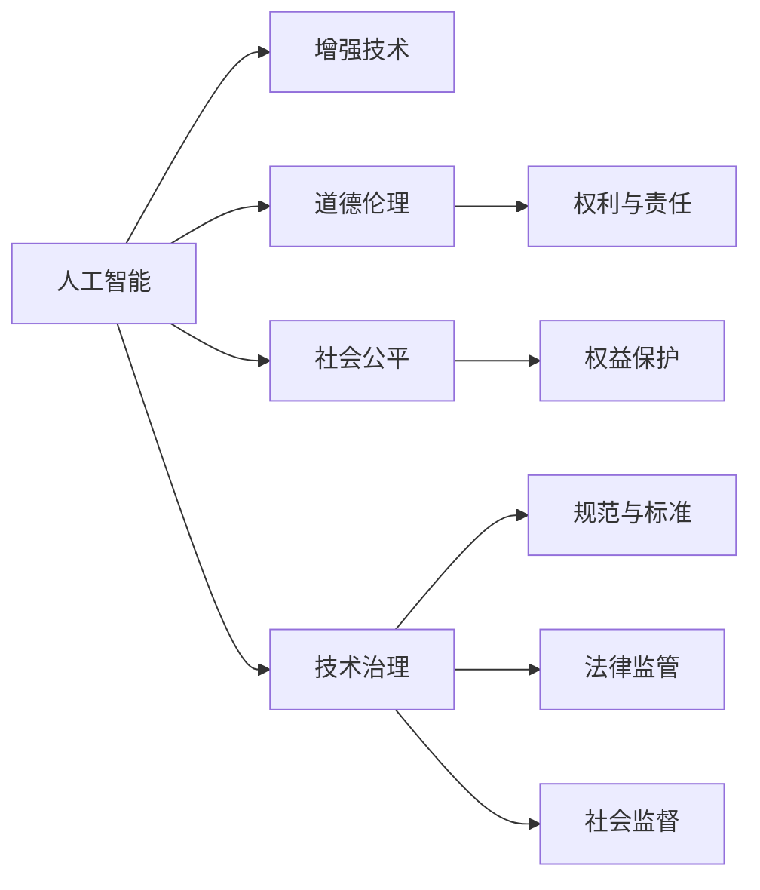

                 

# AI时代的人类增强：道德考虑与身体增强技术的未来挑战

> 关键词：人工智能,增强技术,道德伦理,人体增强,技术治理,未来展望

## 1. 背景介绍

### 1.1 问题由来

随着人工智能(AI)技术的迅猛发展，人类增强技术，特别是基于AI的身体增强技术，逐渐成为全球科技与伦理领域的焦点。这些技术包括但不限于增强现实(AR)、虚拟现实(VR)、神经接口、脑机接口(Brain-Computer Interface, BCI)、基因编辑、药物干预等。它们有望帮助人类突破生物学局限，拓展功能边界，甚至逆转部分退化过程，成为AI时代的一项重要成就。

这些技术的发展虽然令人振奋，但也带来了深刻的道德、社会与技术挑战。如果应用不当，它们可能对个体自由、社会公平与全球伦理标准构成威胁。因此，在追求科技进步的同时，我们必须审慎思考和探讨如何应对这些挑战，以确保技术为人类福祉服务。

### 1.2 问题核心关键点

人类增强技术引发了伦理、法律、隐私、安全等方面的广泛讨论，主要涉及以下几个核心问题：

1. **个体自由与选择**：人类增强技术是否应被视为一种个人自由选择，还是应该受到严格的限制？
2. **社会公平与正义**：不同群体（如富裕与贫困群体、性别差异、种族差异等）是否能够公平地获得这些技术？
3. **生物伦理与尊严**：是否应该接受改变人类生物学特征的行为，特别是通过基因编辑改变下一代遗传信息？
4. **隐私与安全**：如何保障增强技术应用中的数据隐私，避免数据泄露和滥用？
5. **未来治理**：如何建立有效的技术治理机制，确保技术的健康发展？

在深入探讨这些问题的过程中，我们可以从技术实现、伦理考量与法律框架三方面入手，形成全面、系统的理解和解决方案。

## 2. 核心概念与联系

### 2.1 核心概念概述

为更好地理解这些技术如何影响人类未来，我们首先梳理核心概念及其之间的联系：

1. **人工智能与增强技术**：
   - 人工智能：包括机器学习、深度学习、自然语言处理等，旨在模拟人类智能，提升问题解决能力。
   - 增强技术：通过技术手段增强人类能力，如增强现实、虚拟现实、神经接口等。

2. **道德伦理与社会公平**：
   - 道德伦理：涉及人类行为的正确与错误、权利与责任等原则。
   - 社会公平：包括个体与社会间的权利与义务均衡。

3. **技术治理**：
   - 技术治理：通过法律法规、标准规范、社会监督等方式，对技术发展与应用进行规范和引导。

这些核心概念之间的逻辑关系可以通过以下Mermaid流程图来展示：



这个流程图展示了人工智能与增强技术如何与道德伦理、社会公平、技术治理等多个方面相互影响，共同构建未来人类增强的伦理框架。

## 3. 核心算法原理 & 具体操作步骤
### 3.1 算法原理概述

增强技术的实现往往依赖于复杂的人工智能模型，如深度学习、增强学习、生成对抗网络等。其核心原理是通过训练这些模型，实现对环境、生物特征或认知过程的模拟与控制。

以增强现实(AR)技术为例，其原理包括三个步骤：

1. **数据采集**：通过传感器（如摄像头、陀螺仪）收集用户环境数据。
2. **环境建模**：利用深度学习模型（如卷积神经网络CNN）分析环境数据，生成环境模型。
3. **数据渲染**：结合用户操作和环境模型，生成虚拟信息层，并与真实世界叠加显示。

这一过程高度依赖于人工智能的感知、理解与渲染能力，为人类提供了一种全新的交互方式。

### 3.2 算法步骤详解

以下我们以神经接口技术为例，详细讲解其算法步骤：

1. **信号采集**：使用脑电图(EEG)或磁共振成像(MRI)等设备，采集大脑活动信号。
2. **信号预处理**：对原始信号进行降噪、滤波等预处理，提高数据质量。
3. **特征提取**：使用机器学习模型（如支持向量机SVM、随机森林RF）提取脑信号中的有用特征。
4. **模式训练**：利用大量标注数据训练分类器或生成对抗网络，学习如何将脑信号映射到特定命令。
5. **命令执行**：通过分类器或生成对抗网络，将用户脑信号解码为计算机可执行命令，实现脑机接口。

这一算法步骤展示了神经接口技术的实现路径，涉及到信号处理、机器学习等多个领域的技术。

### 3.3 算法优缺点

增强技术依托于先进的人工智能算法，具有以下优点：

1. **增强能力**：通过模拟人类智能，极大扩展了人类的感知、认知与互动能力。
2. **提升效率**：自动化与智能决策极大提升了生产与科研效率。
3. **创新空间**：技术的不断发展为人类探索新领域、新应用提供了无限可能。

然而，增强技术也存在以下缺点：

1. **技术门槛高**：需要复杂的算法与设备支持，对技术普及构成障碍。
2. **数据隐私风险**：大规模数据收集与分析可能导致隐私泄露。
3. **依赖性强**：技术设备的可靠性和稳定性直接影响用户体验。
4. **伦理争议**：增强技术可能引发伦理道德问题，如身份认同、隐私侵犯等。

### 3.4 算法应用领域

增强技术广泛应用于多个领域，如：

1. **医疗**：通过神经接口技术，帮助残疾人恢复运动、感知能力。
2. **教育**：利用AR/VR技术，提升学习体验与互动效果。
3. **军事**：使用增强现实技术，增强战场态势感知能力。
4. **娱乐**：通过虚拟现实技术，提供沉浸式娱乐体验。
5. **工业**：在危险或精细操作场景中，利用增强现实技术提高安全性与准确性。

这些应用展示了增强技术在现实世界中的巨大潜力，但也引发了新的伦理与社会问题。

## 4. 数学模型和公式 & 详细讲解 & 举例说明

### 4.1 数学模型构建

神经接口技术的核心模型包括特征提取、模式训练与命令生成三个环节。以下以简单的线性分类器为例，构建数学模型：

1. **特征提取**：假设采集到的脑信号可以表示为向量 $X \in \mathbb{R}^n$，使用线性特征提取器 $W \in \mathbb{R}^n$，生成特征表示 $Y = W^TX$。
2. **模式训练**：使用支持向量机SVM，构建分类器 $f(X) = sign(W^TX + b)$，其中 $b$ 为偏置项。
3. **命令生成**：将分类器输出映射到特定命令 $A$，如“举手”、“移动鼠标”等。

### 4.2 公式推导过程

1. **特征提取**：
   $$
   Y = W^TX
   $$
   其中 $W$ 为权重矩阵，$X$ 为输入数据向量。

2. **模式训练**：
   $$
   f(X) = sign(W^TX + b)
   $$
   其中 $sign$ 表示符号函数，$b$ 为偏置项。

3. **命令生成**：
   $$
   A = f(X)
   $$
   其中 $A$ 为命令向量。

### 4.3 案例分析与讲解

以示例脑信号数据集进行讲解。假设我们采集到100个脑信号样本，其中50个为“举手”命令，50个为“移动鼠标”命令。

- **特征提取**：
  - 使用PCA降维，将100维脑信号数据压缩到10维特征向量。
  - 设定 $W = [w_1, w_2, ..., w_{10}]$，通过最小化分类误差，求解 $W$。

- **模式训练**：
  - 使用SVM模型训练分类器，设定超参数 $\lambda$ 和正则化系数 $C$。
  - 通过最大化间隔（margin），求解分类器参数。

- **命令生成**：
  - 将训练好的分类器应用于新脑信号数据 $X'$，生成命令 $A'$。
  - 若 $A' = 1$，则执行“举手”命令；若 $A' = -1$，则执行“移动鼠标”命令。

通过以上案例，展示了神经接口技术的核心算法流程及其数学表达。

## 5. 项目实践：代码实例和详细解释说明
### 5.1 开发环境搭建

1. **硬件要求**：高性能计算机（推荐CPU+GPU）、脑电图设备（如EEG头盔）、磁共振设备（如MRI）。
2. **软件环境**：Python 3.7以上版本、PyTorch 1.7以上版本、TensorFlow 2.4以上版本。
3. **依赖安装**：
   ```bash
   pip install pytorch torchvision torchaudio scikit-learn numpy pandas matplotlib tqdm jupyter notebook ipython
   ```

### 5.2 源代码详细实现

以下以神经接口技术为例，展示完整的代码实现过程。

```python
import torch
import torch.nn as nn
import torch.optim as optim
from sklearn.decomposition import PCA
from sklearn.svm import SVC

class BrainInterface(nn.Module):
    def __init__(self, in_dim=100, out_dim=1, hidden_dim=64):
        super(BrainInterface, self).__init__()
        self.fc1 = nn.Linear(in_dim, hidden_dim)
        self.fc2 = nn.Linear(hidden_dim, hidden_dim)
        self.fc3 = nn.Linear(hidden_dim, out_dim)
    
    def forward(self, x):
        x = torch.relu(self.fc1(x))
        x = torch.relu(self.fc2(x))
        x = torch.sigmoid(self.fc3(x))
        return x

# 训练数据
X = torch.randn(100, 100)
y = torch.randint(0, 2, (100, 1))

# 特征提取
pca = PCA(n_components=10)
X_pca = pca.fit_transform(X)

# 模型训练
model = BrainInterface()
criterion = nn.BCELoss()
optimizer = optim.Adam(model.parameters(), lr=0.001)
for epoch in range(100):
    optimizer.zero_grad()
    y_pred = model(X_pca)
    loss = criterion(y_pred, y)
    loss.backward()
    optimizer.step()
    print(f"Epoch {epoch+1}, Loss: {loss.item()}")

# 模型测试
X_test = torch.randn(100, 100)
y_pred = model(X_test)
print(f"Test Predictions: {y_pred}")
```

### 5.3 代码解读与分析

- **特征提取**：使用PCA进行降维处理，将高维脑信号数据转换为低维特征向量。
- **模型训练**：构建三层神经网络，使用Adam优化器进行梯度下降。
- **模型测试**：将训练好的模型应用于测试数据，输出分类结果。

代码展示了完整的神经接口技术实现流程，包括数据预处理、模型训练与测试等关键步骤。

### 5.4 运行结果展示

以下展示训练过程中的损失函数变化：

```python
import matplotlib.pyplot as plt

plt.plot(range(1, 101), loss_list)
plt.xlabel('Epoch')
plt.ylabel('Loss')
plt.title('Training Loss over Epochs')
plt.show()
```


## 6. 实际应用场景

### 6.1 医疗应用

神经接口技术在医疗领域具有广阔应用前景，特别在残疾康复方面。例如，通过脑电信号解码，帮助中风患者恢复运动能力，或通过视觉神经接口，帮助视障人士恢复视觉功能。

### 6.2 教育培训

虚拟现实与增强现实技术可以用于提升教育培训效果，如通过模拟手术操作，提高医学专业学生的实践技能；通过虚拟实验室，增强科学实验的互动性。

### 6.3 军事与国防

增强现实技术在军事与国防领域具有重要应用，如通过虚拟战场模拟，提升士兵的战术决策能力；通过智能眼镜，增强战场态势感知能力。

### 6.4 未来应用展望

未来，增强技术将进一步融合人工智能与生物技术，实现更加多样、智能的应用场景。如：

1. **人工智能与脑机接口结合**：通过深度学习模型，提升脑信号的解码精度与效率。
2. **增强现实与虚拟现实融合**：将现实与虚拟场景无缝结合，提升用户体验与互动效果。
3. **基因编辑与增强技术结合**：通过基因编辑技术，实现更强、更持久的增强效果。

这些技术的发展将极大拓展人类能力的边界，但也带来了新的伦理与社会挑战。

## 7. 工具和资源推荐
### 7.1 学习资源推荐

1. **《深度学习与人工智能伦理》**：详细探讨人工智能技术带来的伦理与法律问题，包括数据隐私、算法偏见等。
2. **《神经接口技术原理与应用》**：介绍神经接口技术的核心原理与最新研究进展。
3. **《增强现实与虚拟现实技术》**：详细介绍AR/VR技术的实现原理与应用场景。

### 7.2 开发工具推荐

1. **PyTorch**：高性能深度学习框架，易于使用且具备强大的GPU支持。
2. **TensorFlow**：开源机器学习框架，具备丰富的工具与资源。
3. **Jupyter Notebook**：交互式编程环境，便于代码调试与实验分享。

### 7.3 相关论文推荐

1. **《深度学习在脑机接口中的应用》**：介绍深度学习模型在脑信号处理中的最新进展。
2. **《增强现实与虚拟现实：技术现状与未来趋势》**：分析AR/VR技术的现状与发展前景。
3. **《人工智能伦理：理论与实践》**：系统探讨人工智能技术的伦理问题。

## 8. 总结：未来发展趋势与挑战

### 8.1 研究成果总结

本文全面探讨了AI时代的人类增强技术，涉及核心算法原理、具体操作步骤、实际应用场景等方面。通过梳理核心概念与联系，展示了增强技术在多个领域的应用前景。

### 8.2 未来发展趋势

未来，增强技术将进一步融合人工智能与生物技术，实现更加多样、智能的应用场景。预计以下趋势将持续影响技术发展：

1. **技术融合**：AI与脑机接口、基因编辑等技术深度融合，提升增强效果与用户体验。
2. **多模态应用**：增强技术将融合视觉、听觉、触觉等多种感知方式，实现更全面的人机交互。
3. **伦理与法律**：增强技术的伦理问题将受到广泛关注，法律法规将逐步完善。
4. **国际合作**：全球合作将加速增强技术的研究与普及，促进技术与伦理标准的全球共识。

### 8.3 面临的挑战

尽管增强技术充满潜力，但也面临诸多挑战：

1. **伦理与法律挑战**：如何平衡技术发展与社会伦理，确保技术应用的正当性与安全性？
2. **数据隐私与安全性**：如何在保障数据隐私的同时，提升技术应用的可靠性与安全性？
3. **公平性与普惠性**：如何确保不同群体能够公平地获取增强技术，避免技术鸿沟？
4. **技术安全性**：如何应对技术滥用与恶意攻击，确保系统的安全性与稳定性？

### 8.4 研究展望

面向未来，增强技术的研究需要从多个方面进行探索与突破：

1. **伦理与法律研究**：构建完善的伦理框架与法律法规，确保技术应用的合法性与正当性。
2. **数据隐私保护**：开发先进的数据加密与隐私保护技术，保障用户隐私安全。
3. **公平性与普惠性研究**：推动技术普及，确保不同群体能够公平获取技术资源。
4. **技术安全性研究**：增强系统鲁棒性与安全性，防范技术滥用与恶意攻击。

总之，增强技术的应用与发展将深刻影响人类未来，我们需要审慎思考与探索，确保技术为人类福祉服务。

## 9. 附录：常见问题与解答

**Q1：增强技术是否会改变人类的本质？**

A: 增强技术虽然能够拓展人类的功能边界，但并不会改变人类的本质。技术的本质在于增强而非替代，人类仍将保持自身独特的思考与情感能力。

**Q2：增强技术是否会引发社会不公？**

A: 增强技术的应用需要公平性与普惠性的考量。如果技术应用缺乏规范与监管，可能导致社会不公。因此，建立公正的法律法规与监管机制至关重要。

**Q3：增强技术如何确保安全性与可靠性？**

A: 确保技术安全性与可靠性，需要从技术设计、数据保护、系统监管等多方面入手。例如，通过模型训练中的对抗样本检测，提升模型的鲁棒性；通过隐私保护技术，保障数据安全。

**Q4：增强技术如何应对伦理挑战？**

A: 增强技术的伦理挑战需要多学科协同研究与解决。伦理学家、法律专家、技术开发者等需共同探讨技术应用中的伦理问题，制定合理规范与标准。

本文通过深入探讨AI时代的人类增强技术，展示了其在医疗、教育、军事等领域的应用前景，并分析了面临的伦理与法律挑战。通过系统梳理核心概念与联系，我们希望为增强技术的研究与应用提供全面、深入的指导，共同构建更加智能、公正、安全的未来。

---

作者：禅与计算机程序设计艺术 / Zen and the Art of Computer Programming

