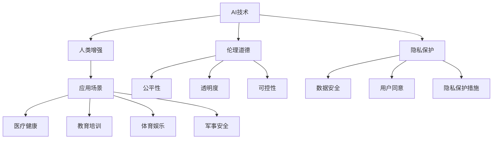

                 

# AI时代的人类增强：道德考虑与身体增强的未来发展机遇分析机遇挑战机遇趋势预测分析

> 关键词：AI时代，人类增强，身体增强，道德伦理，未来机遇，趋势预测

## 1. 背景介绍

### 1.1 问题由来

随着人工智能(AI)技术的不断突破，人类增强技术正在成为全球关注的热点话题。AI不仅在医疗、教育、交通等领域展现了巨大潜力，还在体育、艺术、娱乐等非传统领域引发了深刻变革。与此同时，AI引发的伦理道德问题也日益突出。从AI辅助药物设计到仿生假肢，从虚拟现实(VR)游戏到脑机接口(BMI)技术，AI技术的应用既带来了前所未有的机遇，也伴随着深刻的挑战。

### 1.2 问题核心关键点

AI技术在人类增强方面的应用，可以分为直接增强和间接增强两大类：
- **直接增强**：通过植入芯片、外置装置等技术手段，直接修改人类的身体机能或心理状态。如仿生假肢、增强记忆芯片等。
- **间接增强**：利用AI系统，辅助人类进行决策、学习、娱乐等活动，提升人类综合能力。如AI辅助学习系统、智能游戏等。

这些技术手段在提升人类能力的同时，也引发了一系列道德、伦理、隐私等问题。例如，增强技术是否会导致社会不平等加剧？AI系统是否会带来新的依赖性？人类增强的边界在哪里？这些问题亟需全面讨论和研究。

### 1.3 问题研究意义

探索AI技术在人类增强方面的应用，对推动人类社会进步具有重要意义：

1. **提升人类能力**：通过AI辅助，提升人类的感知、学习、决策等能力，使人机协同更加高效。
2. **推动技术创新**：AI与生物技术、材料科学的交叉融合，催生了许多前沿科技，推动了多个产业的发展。
3. **促进健康福祉**：AI技术在医疗诊断、疾病治疗、康复训练等方面的应用，显著改善了人类的生活质量。
4. **应对未来挑战**：AI技术在能源、环境、安全等领域的广泛应用，为应对未来复杂问题提供了技术支持。

但同时，AI增强技术也带来诸多伦理和法律挑战，如何规范这些技术的应用，确保其公平、透明、可控，是当前亟待解决的问题。

## 2. 核心概念与联系

### 2.1 核心概念概述

要深入理解AI时代的人类增强，首先需要明确以下核心概念：

- **AI技术**：包括机器学习、深度学习、自然语言处理、计算机视觉等技术，通过算法和模型实现对数据的学习和处理。
- **人类增强**：通过技术手段提升人类的身体机能、认知能力和心理健康等，促进人类与机器的协同工作。
- **伦理道德**：涉及技术应用的合理性、公正性、安全性等问题，是指导技术发展的关键因素。
- **隐私保护**：在增强技术应用中，如何保护个人隐私，避免数据滥用，是必须考虑的问题。

这些概念之间的逻辑关系可以通过以下Mermaid流程图来展示：



这个流程图展示了AI技术、人类增强、伦理道德和隐私保护之间的联系，以及这些概念在多个应用场景中的体现。

## 3. 核心算法原理 & 具体操作步骤
### 3.1 算法原理概述

AI时代的人类增强涉及多种技术和方法，包括AI辅助诊断、AI辅助训练、AI辅助康复等。这些技术的核心原理是：利用AI系统的强大计算能力和学习机制，对人类行为和环境进行智能分析和优化，提升人类的身体机能和认知能力。

### 3.2 算法步骤详解

以下以AI辅助医疗诊断为例，详细讲解AI增强技术的核心算法步骤：

1. **数据收集**：收集患者的医疗数据，包括基因信息、病历记录、生理参数等。
2. **数据预处理**：清洗、归一化、标准化数据，去除噪声和异常值。
3. **模型训练**：利用AI算法训练模型，如深度学习模型、决策树模型等，对患者数据进行分类和预测。
4. **模型评估**：使用验证集对模型进行评估，调整参数，优化模型性能。
5. **模型部署**：将训练好的模型部署到实际医疗系统中，实时处理患者数据，辅助医生进行诊断和治疗。

### 3.3 算法优缺点

AI辅助医疗诊断技术的优点包括：
- **提高诊断准确率**：通过数据分析，AI系统能够发现传统方法难以发现的细微变化。
- **节省时间成本**：自动化诊断流程减少了医生的人工干预，提高了诊疗效率。
- **个性化医疗**：AI系统可以根据患者的基因和历史数据，提供个性化的诊断和治疗方案。

但其缺点也不容忽视：
- **数据隐私问题**：患者的医疗数据涉及隐私，如何保护这些数据是重大挑战。
- **模型偏见问题**：AI模型可能因训练数据偏见而产生错误的诊断结果。
- **过度依赖风险**：过度依赖AI系统，可能导致医生忽视医学直觉和经验。

### 3.4 算法应用领域

AI辅助医疗诊断技术广泛应用于以下几个领域：

1. **疾病诊断**：如癌症、糖尿病、心血管疾病等。AI系统通过分析患者数据，提供早期诊断和病情评估。
2. **影像分析**：如CT、MRI、X光等影像数据。AI系统能够自动识别病变区域，辅助医生进行诊断。
3. **治疗方案推荐**：根据患者的基因信息和病情数据，AI系统推荐个性化的治疗方案。
4. **康复训练**：利用AI技术和虚拟现实技术，辅助患者进行康复训练，提升康复效果。

## 4. 数学模型和公式 & 详细讲解 & 举例说明

### 4.1 数学模型构建

以AI辅助癌症诊断为例，我们可以构建如下数学模型：

设$D=\{(x_i, y_i)\}_{i=1}^N$为患者的医疗数据和诊断结果，其中$x_i$为输入数据，$y_i$为标签。利用神经网络模型$M_{\theta}$对数据进行训练，目标函数为：

$$
\min_{\theta} \frac{1}{N} \sum_{i=1}^N \ell(M_{\theta}(x_i), y_i)
$$

其中$\ell$为损失函数，如交叉熵损失。

### 4.2 公式推导过程

假设我们使用一个简单的前馈神经网络模型$M_{\theta}(x)$，包括输入层、隐藏层和输出层。设输入数据$x$经过线性变换和激活函数后得到隐藏层特征$h$，再经过线性变换和激活函数得到输出结果$y$。公式如下：

$$
h = \sigma(W_1 x + b_1)
$$

$$
y = \sigma(W_2 h + b_2)
$$

其中$\sigma$为激活函数，$W$和$b$为模型参数。

将模型$M_{\theta}$代入目标函数，可得：

$$
\min_{\theta} \frac{1}{N} \sum_{i=1}^N \ell(M_{\theta}(x_i), y_i) = \min_{\theta} \frac{1}{N} \sum_{i=1}^N \ell(\sigma(W_2 \sigma(W_1 x_i + b_1) + b_2), y_i)
$$

### 4.3 案例分析与讲解

以AI辅助乳腺癌诊断为例，分析模型的具体应用过程：

1. **数据准备**：收集乳腺癌患者的影像数据，将其分为训练集和测试集。
2. **模型设计**：使用深度学习模型如卷积神经网络(CNN)进行训练。
3. **模型训练**：在训练集上训练模型，调整参数，优化模型性能。
4. **模型评估**：在测试集上评估模型性能，如准确率、召回率等。
5. **模型部署**：将训练好的模型部署到实际医疗系统中，实时处理新患者的影像数据，辅助医生进行诊断。

## 5. 项目实践：代码实例和详细解释说明
### 5.1 开发环境搭建

在进行AI辅助医疗诊断项目实践前，我们需要准备好开发环境。以下是使用Python进行TensorFlow开发的环境配置流程：

1. 安装Anaconda：从官网下载并安装Anaconda，用于创建独立的Python环境。

2. 创建并激活虚拟环境：
```bash
conda create -n tf-env python=3.8 
conda activate tf-env
```

3. 安装TensorFlow：根据CUDA版本，从官网获取对应的安装命令。例如：
```bash
conda install tensorflow tensorflow-gpu=cuda11.1 -c conda-forge
```

4. 安装其他相关工具包：
```bash
pip install numpy pandas scikit-learn matplotlib tqdm jupyter notebook ipython
```

完成上述步骤后，即可在`tf-env`环境中开始项目实践。

### 5.2 源代码详细实现

下面是使用TensorFlow构建一个简单的神经网络模型的代码实现：

```python
import tensorflow as tf
from tensorflow.keras import layers, models

# 定义神经网络模型
def build_model(input_shape, num_classes):
    model = models.Sequential()
    model.add(layers.Dense(64, activation='relu', input_shape=input_shape))
    model.add(layers.Dense(64, activation='relu'))
    model.add(layers.Dense(num_classes, activation='softmax'))
    return model

# 加载数据集
(x_train, y_train), (x_test, y_test) = tf.keras.datasets.mnist.load_data()
x_train = x_train.reshape((60000, 28*28))
x_test = x_test.reshape((10000, 28*28))
x_train, x_test = x_train / 255.0, x_test / 255.0

# 构建模型
model = build_model((28*28,), 10)

# 编译模型
model.compile(optimizer='adam',
              loss='sparse_categorical_crossentropy',
              metrics=['accuracy'])

# 训练模型
model.fit(x_train, y_train, epochs=5, batch_size=64)

# 评估模型
model.evaluate(x_test, y_test)
```

### 5.3 代码解读与分析

这段代码实现了一个简单的神经网络模型，用于手写数字识别任务。主要步骤如下：

1. **模型定义**：使用`Sequential`模型定义了三个全连接层，每层使用`Dense`层，激活函数分别为`relu`和`softmax`。
2. **数据加载**：使用`mnist`数据集，将图像数据归一化处理。
3. **模型编译**：使用`compile`方法设置优化器、损失函数和评估指标。
4. **模型训练**：使用`fit`方法训练模型，设置训练轮数和批大小。
5. **模型评估**：使用`evaluate`方法在测试集上评估模型性能。

代码实现简单易懂，适合初学者快速上手。在实际项目中，还需要对数据预处理、模型调优、超参数优化等进行深入研究。

## 6. 实际应用场景
### 6.1 智能健康监测

AI增强技术在健康监测领域具有广泛应用，如心率监测、血糖监测、睡眠质量分析等。通过AI系统对生理数据的实时分析，能够及时发现健康问题，提高患者的生活质量。

在技术实现上，可以部署智能穿戴设备，收集患者的生理数据，如心率、血压、血糖等。利用AI模型对这些数据进行实时分析，预警异常情况，并在必要时提醒患者就医。例如，通过智能手表实时监测心率变化，当心率异常时自动报警，提醒患者休息或服药。

### 6.2 运动训练辅助

AI增强技术在运动训练领域也有广泛应用，如跑步训练、健身指导、康复训练等。通过AI系统对运动数据的实时分析，能够提供个性化的训练计划和反馈，提升运动效果。

在技术实现上，可以部署智能运动设备，如跑步机、健身器材等，实时收集运动数据，如步数、速度、心率等。利用AI模型对这些数据进行分析，生成个性化的训练计划，并提供实时反馈。例如，在跑步训练中，根据跑步速度、步频等数据，智能调整训练强度和节奏，避免过度训练。

### 6.3 心理状态监测

AI增强技术在心理状态监测领域也具有广泛应用，如情绪识别、压力监测、睡眠分析等。通过AI系统对心理数据的实时分析，能够及时发现心理健康问题，提供心理干预和支持。

在技术实现上，可以部署智能设备，如智能枕、智能眼镜等，实时收集用户的心理数据，如情绪、压力、睡眠质量等。利用AI模型对这些数据进行分析，预警心理健康问题，并提供个性化的心理健康建议。例如，通过智能枕监测用户的睡眠质量，分析睡眠质量，并提供改善睡眠的建议。

### 6.4 未来应用展望

随着AI技术的发展，人类增强技术将不断拓展应用领域，带来更多机遇：

1. **医疗健康**：AI技术在疾病诊断、治疗、康复等方面的应用，将显著提升医疗服务的质量和效率。
2. **教育培训**：AI系统能够提供个性化学习计划和实时反馈，提升学习效果，加速知识普及。
3. **运动健身**：AI系统能够提供个性化训练计划和实时反馈，提升运动效果，促进健康生活方式。
4. **娱乐休闲**：AI技术在游戏、影视、音乐等领域的应用，将带来全新的用户体验。

## 7. 工具和资源推荐
### 7.1 学习资源推荐

为了帮助开发者系统掌握AI增强技术的理论基础和实践技巧，这里推荐一些优质的学习资源：

1. **《深度学习》书籍**：由Ian Goodfellow等学者合著，系统介绍了深度学习的基本概念和经典算法。
2. **《神经网络与深度学习》课程**：由Andrew Ng主讲，介绍了神经网络的基本原理和应用。
3. **《TensorFlow官方文档》**：详细介绍了TensorFlow框架的使用方法和最佳实践。
4. **《Transformers库文档》**：由HuggingFace团队编写，介绍了Transformer模型的基本原理和应用。
5. **《AI伦理》课程**：介绍了AI技术在伦理、道德、隐私等方面的挑战和解决方案。

通过对这些资源的学习实践，相信你一定能够快速掌握AI增强技术的精髓，并用于解决实际的NLP问题。

### 7.2 开发工具推荐

高效的开发离不开优秀的工具支持。以下是几款用于AI增强技术开发的常用工具：

1. **TensorFlow**：由Google主导开发的深度学习框架，生产部署方便，适合大规模工程应用。
2. **PyTorch**：由Facebook开发的开源深度学习框架，灵活性高，适合快速迭代研究。
3. **Keras**：高层次的深度学习框架，易于上手，适合初学者使用。
4. **HuggingFace Transformers库**：提供了大量预训练模型和微调样例，是进行AI增强任务开发的利器。
5. **Weights & Biases**：模型训练的实验跟踪工具，可以记录和可视化模型训练过程中的各项指标，方便对比和调优。
6. **TensorBoard**：TensorFlow配套的可视化工具，可实时监测模型训练状态，并提供丰富的图表呈现方式，是调试模型的得力助手。

合理利用这些工具，可以显著提升AI增强技术的开发效率，加快创新迭代的步伐。

### 7.3 相关论文推荐

AI增强技术的发展源于学界的持续研究。以下是几篇奠基性的相关论文，推荐阅读：

1. **《深度学习》（Ian Goodfellow, Yoshua Bengio, Aaron Courville）**：介绍了深度学习的基本概念、算法和应用。
2. **《神经网络与深度学习》（Andrew Ng）**：介绍了神经网络的基本原理和应用。
3. **《基于深度学习的医疗影像分析》（Li, Y., Yu, Q., & Mooney, R. J.）**：介绍了AI在医疗影像分析中的应用。
4. **《基于深度学习的智能运动分析》（Hsieh, C. H., & Chiang, M. J.）**：介绍了AI在智能运动训练中的应用。
5. **《基于深度学习的智能健康监测》（Sabharwal, S., & Vasudevan, S.）**：介绍了AI在智能健康监测中的应用。

这些论文代表了大语言模型微调技术的发展脉络。通过学习这些前沿成果，可以帮助研究者把握学科前进方向，激发更多的创新灵感。

## 8. 总结：未来发展趋势与挑战
### 8.1 研究成果总结

本文对AI增强技术的理论基础和实践技巧进行了全面系统的介绍。从AI技术在人类增强中的应用、核心算法原理、操作步骤到具体代码实现，系统讲解了AI增强技术的全过程。通过实例分析，展示了AI增强技术在实际应用中的效果和潜力。

### 8.2 未来发展趋势

展望未来，AI增强技术将呈现以下几个发展趋势：

1. **技术进步**：AI技术的不断进步将推动人类增强技术的进一步发展。量子计算、神经形态工程等前沿技术将为AI增强带来新的突破。
2. **跨学科融合**：AI增强技术将与其他学科领域深度融合，如生物工程、材料科学、心理学等，推动相关技术的共同进步。
3. **应用场景多样化**：AI增强技术将在更多领域得到应用，如教育、娱乐、军事等，带来新的发展机遇。
4. **伦理道德提升**：随着技术的普及，AI增强技术的伦理道德问题将日益受到关注，相关规范和标准也将不断完善。

### 8.3 面临的挑战

尽管AI增强技术在多个领域展现出巨大的潜力，但在走向广泛应用的过程中，仍面临诸多挑战：

1. **伦理道德问题**：增强技术可能带来新的社会问题，如社会不平等加剧、伦理道德争议等。
2. **数据隐私问题**：在增强技术应用中，如何保护个人隐私，避免数据滥用，是重大挑战。
3. **技术可靠性**：增强技术的应用效果取决于模型的可靠性和稳定性，如何在数据多样性和模型复杂性之间取得平衡，仍是重要课题。
4. **社会适应性**：增强技术的应用可能会改变人类社会的生活方式，如何引导社会适应新技术，仍需深入研究。
5. **法律规范**：增强技术的应用需要法律规范，如何在技术发展的同时，制定合理的法律规范，保障社会公平和公正，仍需多方努力。

### 8.4 研究展望

面对AI增强技术面临的诸多挑战，未来的研究需要在以下几个方面寻求新的突破：

1. **伦理道德指导**：在技术研发中，引入伦理道德考量，确保技术应用的合理性和公平性。
2. **隐私保护机制**：开发隐私保护技术，如差分隐私、联邦学习等，确保数据安全和隐私保护。
3. **跨学科融合**：与其他学科深度融合，推动相关技术共同进步，提升技术的综合竞争力。
4. **技术可靠性提升**：开发鲁棒性更强的算法，确保模型在不同数据集和环境下的稳定性和可靠性。
5. **社会适应性研究**：研究增强技术对社会的影响，制定合理的引导策略，推动社会健康发展。
6. **法律规范制定**：制定合理的法律法规，保障技术应用的公平性和公正性，推动技术健康发展。

## 9. 附录：常见问题与解答

**Q1：AI增强技术是否适用于所有领域？**

A: AI增强技术在不同领域的应用效果差异较大。一般而言，AI增强技术在数据量较大、数据标注较多的领域效果较好。例如，在医疗诊断、智能训练等领域，AI增强技术能够显著提升效果。但在某些领域，如农业、艺术等，数据获取和标注成本较高，AI增强技术的应用效果可能较弱。

**Q2：AI增强技术是否会带来新的社会问题？**

A: AI增强技术在带来便利和提升能力的同时，也带来了一些新的社会问题。例如，过度依赖AI技术可能导致人类技能退化，引发就业问题。增强技术的普及可能加剧社会不平等，导致技术鸿沟扩大。如何在技术发展的同时，制定合理的社会政策，确保技术应用的公平性和公正性，仍需深入研究。

**Q3：如何保护增强技术的隐私？**

A: 增强技术的应用涉及到大量个人隐私数据，保护隐私是重要任务。一般而言，可以通过以下方法保护隐私：
1. 差分隐私：在数据处理过程中加入噪声，确保数据不泄露个体信息。
2. 联邦学习：通过分布式数据训练，保护数据隐私。
3. 匿名化处理：对数据进行匿名化处理，确保数据不被直接关联到个体。

**Q4：如何确保AI增强技术的可靠性和稳定性？**

A: 确保AI增强技术的可靠性和稳定性，需要从多个方面入手：
1. 数据多样性：确保训练数据的多样性，避免模型过拟合。
2. 模型鲁棒性：开发鲁棒性更强的算法，确保模型在不同数据集和环境下的稳定性。
3. 人工干预：在AI增强技术应用中，引入人工干预机制，及时发现和纠正错误。
4. 持续优化：对模型进行持续优化，提升模型性能和稳定性。

**Q5：AI增强技术在医疗领域的应用前景如何？**

A: AI增强技术在医疗领域具有广阔的应用前景。通过AI技术对医疗数据的实时分析，能够及时发现健康问题，提高患者的生活质量。例如，AI技术在疾病诊断、治疗、康复等方面的应用，将显著提升医疗服务的质量和效率。但同时，医疗数据涉及患者隐私，如何保护这些数据是重大挑战。此外，增强技术的应用效果取决于模型的可靠性和稳定性，需要在数据多样性和模型复杂性之间取得平衡。

本文系统探讨了AI增强技术的理论基础和实践技巧，展示了其在多个领域的潜在应用，并提出了未来发展趋势和面临的挑战。希望本文能够为AI增强技术的开发者和研究者提供有益的参考。

---

作者：禅与计算机程序设计艺术 / Zen and the Art of Computer Programming

