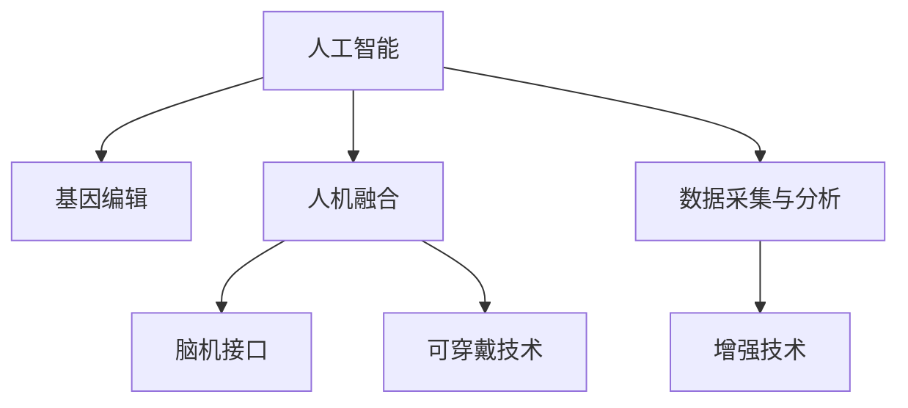

                 

# AI时代的人类增强：道德考虑与身体增强的未来挑战

> 关键词：人工智能, 道德伦理, 人类增强, 基因编辑, 人机融合, 可穿戴技术, 脑机接口

## 1. 背景介绍

### 1.1 问题由来
随着人工智能（AI）技术的飞速发展，人类增强（Human Enhancement）的概念逐渐走入公众视野。过去，增强的概念更多体现在技术层面，如计算机性能的提升；而今，它更多地与人类的身体、认知、情感等方面挂钩。AI技术在医疗、运动、教育、娱乐等多个领域的应用，正在悄然改变人类的生活模式。然而，这些技术带来的不仅仅是便利，还引发了一系列道德、伦理和社会问题。本文将探讨AI时代人类增强的现状、影响以及面临的挑战，重点关注身体增强领域的基因编辑、人机融合等前沿技术。

### 1.2 问题核心关键点
人类增强涉及诸多核心关键点，包括但不限于：
1. **技术进步**：AI、生物技术、材料科学等前沿技术的发展为人类增强提供了可能。
2. **道德伦理**：增强技术的应用是否符合伦理，如基因编辑、人体植入等。
3. **社会影响**：增强技术可能带来的社会分化、就业结构变化等。
4. **安全性与风险**：技术应用的安全性评估及风险规避。
5. **隐私保护**：增强技术涉及个人隐私和数据安全的保护问题。
6. **公平性与可及性**：如何确保技术的公平使用，让更多人受益。

这些关键点构成了人类增强领域的研究框架，本文将深入探讨。

## 2. 核心概念与联系

### 2.1 核心概念概述

为了更好地理解人类增强的概念及其相关技术，本节将介绍几个密切相关的核心概念：

- **人工智能（AI）**：通过算法和计算机技术，使计算机系统能够模拟人类智能，执行复杂任务。AI的应用包括自然语言处理、计算机视觉、机器人控制等。
- **基因编辑**：利用CRISPR-Cas9等技术，直接修改生物体的基因组，以改变其特性或功能。基因编辑技术在医学、农业、环保等领域具有巨大潜力。
- **人机融合（Human-AI Integration）**：将AI与人体系统结合，提升人类认知、感知、决策等能力。人机融合技术包括脑机接口、可穿戴设备等。
- **可穿戴技术**：通过穿戴式设备，实时监测和管理人体状态，提升健康、运动、娱乐等方面的体验。
- **脑机接口（BCI）**：通过记录和解码脑电信号，实现人脑与计算机系统间的直接交互。脑机接口技术可应用于医疗康复、游戏娱乐等多个领域。

这些概念之间的逻辑关系可以通过以下Mermaid流程图来展示：



这个流程图展示了几大核心概念及其之间的关系：

1. 人工智能通过算法和计算技术实现复杂任务。
2. 基因编辑技术直接修改生物体的基因组，可应用于疾病治疗、农业改良等。
3. 人机融合通过脑机接口、可穿戴设备等实现AI与人体系统的结合。
4. 数据采集与分析为增强技术提供支持，通过智能穿戴设备、脑机接口等收集生理和心理数据。
5. 增强技术通过AI和基因编辑等手段，提升人类的身体和认知能力。

这些概念共同构成了人类增强的研究框架，使得人类能够借助技术手段提升自身能力，同时也带来了诸多伦理和社会问题。

## 3. 核心算法原理 & 具体操作步骤
### 3.1 算法原理概述

人类增强的算法原理主要基于AI技术，特别是机器学习和深度学习。这些算法通过大规模数据训练，学习到复杂模式，从而实现对人类状态和行为的预测、控制和优化。以下是几类主要算法：

- **强化学习（Reinforcement Learning, RL）**：通过奖惩机制，训练智能体执行特定任务。RL在机器人控制、游戏智能等方面有广泛应用。
- **迁移学习（Transfer Learning）**：将一个领域学到的知识迁移到另一个领域。迁移学习在图像识别、自然语言处理等领域有成功应用。
- **深度强化学习（Deep Reinforcement Learning, DRL）**：结合深度神经网络与强化学习，提升决策和学习效率。DRL在自动驾驶、智能家居等领域有广泛应用。

### 3.2 算法步骤详解

基于AI技术的人类增强算法步骤主要包括：

1. **数据收集**：收集相关领域的数据，如健康监测数据、运动行为数据等。
2. **模型训练**：利用收集到的数据训练AI模型，学习复杂模式。
3. **模型评估与优化**：在验证集上评估模型性能，根据评估结果调整模型参数，优化模型表现。
4. **模型应用**：将训练好的模型应用于实际场景，进行增强技术的操作。

以可穿戴设备为例，其核心步骤如下：

1. **传感器数据采集**：通过各类传感器（如心率传感器、加速度计）收集用户的生理和行为数据。
2. **数据预处理**：对采集到的数据进行清洗、归一化等预处理，提高数据质量。
3. **特征提取**：使用算法（如PCA、LDA）从原始数据中提取重要特征，降低数据维度。
4. **模型训练**：使用机器学习或深度学习模型（如SVM、CNN）训练分类或预测模型。
5. **模型应用**：将训练好的模型部署到可穿戴设备上，实时监测和分析用户状态，提供增强功能。

### 3.3 算法优缺点

人类增强的AI算法具有以下优点：

- **高效性**：通过大规模数据训练，AI算法可以快速学习复杂模式，实现高效增强。
- **普适性**：AI算法可应用于不同领域，提升人类的认知、情感、决策等多个方面。
- **灵活性**：AI算法可以根据具体任务和需求进行调整优化，满足不同用户的需求。

但同时，这些算法也存在以下缺点：

- **数据依赖**：AI算法需要大量高质量数据进行训练，数据的获取和处理成本较高。
- **隐私风险**：数据收集和处理过程中涉及用户隐私，可能引发隐私泄露和滥用问题。
- **模型黑箱**：部分AI算法（如深度学习）的内部机制复杂，难以解释，可能影响用户的信任和接受度。
- **技术门槛**：AI算法开发和应用需要高水平的技术和专业知识，门槛较高。

### 3.4 算法应用领域

人类增强的AI算法在多个领域得到了广泛应用，以下是几个典型领域：

1. **健康监测与医疗**：利用AI算法进行疾病诊断、治疗方案优化、手术辅助等。
2. **运动训练与康复**：通过可穿戴设备实时监测运动数据，提供个性化训练方案和康复建议。
3. **教育与培训**：使用AI算法进行个性化教育、技能培训、语言学习等。
4. **娱乐与游戏**：开发智能游戏、虚拟现实等娱乐应用，提升用户体验。
5. **智能家居与生活**：利用AI算法进行智能家居控制、个性化推荐、智能助手等。

这些应用领域展示了AI算法在人类增强中的广泛应用，也引发了诸多伦理和社会问题。

## 4. 数学模型和公式 & 详细讲解 & 举例说明

### 4.1 数学模型构建

本文以深度强化学习（DRL）为例，构建AI增强模型的数学模型。

假设环境为 $E$，智能体为 $A$，动作空间为 $A$，状态空间为 $S$，奖励函数为 $R$。在每个时间步 $t$，智能体根据当前状态 $s_t$ 选择一个动作 $a_t$，并观察到下一个状态 $s_{t+1}$ 和奖励 $r_t$。DRL的目标是通过学习最优策略 $\pi$，最大化总奖励 $J$：

$$
J = \mathbb{E}\left[\sum_{t=0}^{\infty} \gamma^t r_t\right]
$$

其中 $\gamma$ 为折扣因子，确保长期奖励的优先级。

DRL的核心思想是通过Q值函数 $Q$ 学习最优策略 $\pi$。Q值函数定义为：

$$
Q(s,a) = \mathbb{E}\left[\sum_{t=0}^{\infty} \gamma^t r_t \mid s_0 = s, a_0 = a\right]
$$

在强化学习框架下，Q值函数可通过以下公式迭代更新：

$$
Q(s,a) \leftarrow Q(s,a) + \alpha \left[R(s,a) + \gamma \max_a Q(s',a') - Q(s,a)\right]
$$

其中 $\alpha$ 为学习率，$Q(s',a')$ 为当前状态 $s'$ 下选择动作 $a'$ 的Q值。

### 4.2 公式推导过程

上述公式展示了DRL中Q值函数的迭代更新过程。该公式基于以下假设：

1. 环境具有马尔科夫性质，即当前状态只取决于上一状态和动作。
2. 动作空间连续，可以近似为可微函数。
3. 奖励函数为已知函数，可以计算其积分。

通过上述假设，可以将Q值函数的更新公式推导为：

$$
Q(s,a) \leftarrow Q(s,a) + \alpha \left[R(s,a) + \gamma Q(s',a^*) - Q(s,a)\right]
$$

其中 $Q(s',a^*)$ 表示在状态 $s'$ 下选择最优动作 $a^*$ 的Q值。

### 4.3 案例分析与讲解

以智能运动设备为例，设备通过加速度计、心率传感器等传感器实时监测用户的运动和生理数据。AI算法根据这些数据预测用户的运动状态，调整运动模式，优化运动效果。

在训练阶段，算法首先收集大量用户运动数据，构建特征向量。然后利用强化学习框架，训练最优的运动策略。在实际应用中，设备实时采集用户数据，通过训练好的AI模型预测当前运动状态，并调整运动模式。例如，如果检测到用户运动强度过高，算法将自动调整运动强度，避免受伤。

## 5. 项目实践：代码实例和详细解释说明

### 5.1 开发环境搭建

要进行人类增强的AI算法开发，需要配置以下开发环境：

1. **Python环境**：安装Python 3.x，建议使用Anaconda或Miniconda。
2. **深度学习框架**：安装TensorFlow、PyTorch等深度学习框架。
3. **AI算法库**：安装scikit-learn、TensorFlow、PyTorch等AI算法库。
4. **数据集**：收集和预处理相关领域的数据集，如运动数据、医疗数据等。
5. **可穿戴设备接口**：编写接口程序，实现与可穿戴设备的通信。

### 5.2 源代码详细实现

以下是使用TensorFlow进行运动监测和智能训练的代码实现示例：

```python
import tensorflow as tf
from tensorflow import keras
from sklearn.preprocessing import MinMaxScaler
from scipy.signal import detrend

# 数据预处理
def preprocess_data(data):
    scaler = MinMaxScaler(feature_range=(0, 1))
    data_scaled = scaler.fit_transform(data)
    data_detrended = detrend(data_scaled, axis=1)
    return data_detrended

# 模型训练
def train_model(X_train, y_train):
    model = keras.Sequential([
        keras.layers.Dense(64, activation='relu', input_shape=(X_train.shape[1],)),
        keras.layers.Dense(64, activation='relu'),
        keras.layers.Dense(1, activation='sigmoid')
    ])
    model.compile(optimizer='adam', loss='binary_crossentropy', metrics=['accuracy'])
    model.fit(X_train, y_train, epochs=10, batch_size=32)
    return model

# 数据采集与处理
# 假设使用加速度计采集用户运动数据
acceleration_data = ...
X_train, y_train = preprocess_data(acceleration_data)

# 训练模型
model = train_model(X_train, y_train)

# 模型应用
# 实时监测用户运动数据，调用训练好的模型预测和调整运动模式
new_data = ...
new_data_scaled = preprocess_data(new_data)
new_data_detrended = detrend(new_data_scaled, axis=1)
predicted = model.predict(new_data_detrended)
if predicted[0] > 0.5:
    # 调整运动强度
    ...
```

### 5.3 代码解读与分析

**preprocess_data函数**：
- 实现数据预处理功能，包括归一化、去趋势等。

**train_model函数**：
- 使用Keras构建并训练神经网络模型，使用Adam优化器和二元交叉熵损失函数。

**数据采集与处理**：
- 使用加速度计采集用户运动数据。
- 数据预处理包括归一化、去趋势等操作，提高数据质量。
- 训练模型并应用到新数据，预测运动状态并调整运动模式。

**模型应用**：
- 实时监测用户运动数据，调用训练好的模型预测运动状态。
- 根据预测结果调整运动强度，实现智能训练。

## 6. 实际应用场景

### 6.1 智能运动设备

智能运动设备通过AI算法实时监测用户的运动状态，提供个性化训练建议。这些设备可以集成心率传感器、加速度计、陀螺仪等传感器，采集用户的生理和行为数据。AI算法通过对这些数据进行分析和处理，预测用户的运动状态，调整运动强度，优化训练效果。

### 6.2 健康监测与康复

AI算法在健康监测和康复领域有广泛应用。例如，利用可穿戴设备实时监测用户的生理参数，如心率、血压、血糖等。AI算法对数据进行分析和处理，预测用户的健康状态，提供健康建议和治疗方案。对于慢性病患者，AI算法还可以进行药物推荐和复诊提醒，提升医疗服务质量。

### 6.3 智能家居与生活

AI算法在智能家居与生活领域也有广泛应用。例如，智能音箱可以通过自然语言处理技术，与用户进行自然对话，提供语音助手服务。智能照明和温控系统可以根据用户的作息习惯和天气情况，自动调节家居环境，提升居住舒适度。AI算法还可以分析用户的日常行为数据，提供个性化推荐，提升生活质量。

### 6.4 未来应用展望

未来，随着AI技术的不断进步，人类增强将迎来更多新的应用场景。以下是几个可能的方向：

1. **脑机接口**：脑机接口技术通过记录和解码脑电信号，实现人脑与计算机系统间的直接交互。未来，脑机接口可能应用于医疗康复、游戏娱乐、智能助手等领域。
2. **基因编辑**：基因编辑技术在医学、农业、环保等领域有广泛应用。未来，基因编辑技术可能应用于增强人类身体、认知等特性。
3. **人机融合**：通过人机融合技术，提升人类认知、感知、决策等能力。未来，人机融合技术可能应用于自动驾驶、智能家居、教育培训等领域。
4. **增强现实（AR）与虚拟现实（VR）**：AR和VR技术通过视觉、听觉、触觉等感官模拟现实环境，提升用户的沉浸感和体验。未来，AR和VR技术可能应用于教育培训、娱乐游戏、远程医疗等领域。
5. **个性化医疗**：AI算法在医疗领域有广泛应用。未来，通过AI算法分析患者的基因数据和行为数据，可以提供更加个性化、精准的医疗服务。

## 7. 工具和资源推荐

### 7.1 学习资源推荐

为了帮助开发者系统掌握AI技术在人类增强中的应用，以下是几个推荐的学习资源：

1. **深度学习入门书籍**：《深度学习》（Ian Goodfellow等著）是深度学习领域的经典教材，适合初学者和专业人士。
2. **强化学习课程**：Coursera上的《强化学习》课程，由斯坦福大学的Andrew Ng教授讲授，系统介绍了强化学习的理论和方法。
3. **AI与人类增强论文**：阅读相关领域的顶级会议论文，如NeurIPS、ICML、IJCAI等，了解最新的研究进展和趋势。
4. **可穿戴设备技术手册**：阅读可穿戴设备的技术手册和应用指南，了解设备的工作原理和开发方法。
5. **开源项目与代码库**：GitHub上的开源项目和代码库，如TensorFlow、PyTorch、scikit-learn等，提供丰富的学习和实践资源。

### 7.2 开发工具推荐

以下推荐的开发工具可以帮助开发者高效开发人类增强应用：

1. **IDE与编辑器**：Visual Studio Code、PyCharm等IDE和编辑器，提供代码编写、调试、测试等功能。
2. **版本控制工具**：Git、GitHub等版本控制工具，方便代码版本管理和协作开发。
3. **数据处理工具**：Pandas、NumPy等数据处理工具，提供高效的数据处理和分析能力。
4. **机器学习框架**：TensorFlow、PyTorch等机器学习框架，提供高效的模型训练和优化功能。
5. **可视化工具**：Matplotlib、Seaborn等可视化工具，提供直观的数据分析和展示能力。
6. **云平台**：AWS、Google Cloud、Microsoft Azure等云平台，提供弹性计算资源和丰富的开发环境。

### 7.3 相关论文推荐

人类增强领域的研究涉及多个前沿领域，以下是几个推荐阅读的相关论文：

1. **深度学习与人机融合**：《Deep Reinforcement Learning for Human-AI Interaction》（Szamár et al., 2020），展示了深度强化学习在人机融合中的应用。
2. **基因编辑技术**：《CRISPR-Cas9: Properties, Applications, and Ethical, Legal, and Social Implications》（Joung et al., 2014），详细介绍了基因编辑技术的原理和应用。
3. **脑机接口技术**：《Neural Interface Design for Brain-Machine Interaction》（Rao et al., 2020），综述了脑机接口技术的现状和未来发展方向。
4. **可穿戴技术**：《Wearable Device Application Development》（Geng et al., 2020），介绍了可穿戴设备的开发和应用。
5. **智能家居与生活**：《Smart Home: A Survey》（Jiang et al., 2018），综述了智能家居和生活的现状和未来趋势。

## 8. 总结：未来发展趋势与挑战

### 8.1 研究成果总结

本文系统介绍了AI技术在人类增强中的应用，涵盖智能运动设备、健康监测、智能家居等多个领域。通过对AI算法和技术的讲解，展示了人类增强的广泛应用前景和潜在风险。通过案例分析和代码实现，帮助读者理解人类增强技术的实现细节和应用场景。

### 8.2 未来发展趋势

未来，人类增强将向更加智能化、个性化、多样化的方向发展。以下是几个主要趋势：

1. **技术融合**：AI技术与人类增强技术不断融合，形成更加全面、高效、智能的技术体系。
2. **跨学科发展**：人类增强涉及生物学、医学、工程学等多个学科，未来将进一步跨学科发展，推动技术进步。
3. **伦理与法律**：人类增强技术涉及诸多伦理和法律问题，未来需要制定相应的法规和伦理准则，保障技术应用的安全性和公平性。
4. **大众普及**：人类增强技术将逐渐普及到各个领域，成为社会生活的重要组成部分。
5. **持续创新**：人类增强技术将持续创新，不断突破现有技术边界，提升人类能力。

### 8.3 面临的挑战

尽管人类增强技术在多个领域有广泛应用，但也面临诸多挑战：

1. **数据隐私与安全**：数据采集和处理过程中涉及用户隐私，可能引发隐私泄露和滥用问题。
2. **伦理与法律**：人类增强技术涉及诸多伦理和法律问题，如基因编辑可能带来的社会歧视、不平等问题。
3. **技术门槛**：AI算法和技术的开发和应用需要高水平的技术和专业知识，门槛较高。
4. **技术风险**：增强技术可能带来未知的风险和副作用，需要进一步研究和评估。
5. **伦理共识**：人类增强技术涉及诸多伦理问题，需要社会各界达成共识。

### 8.4 研究展望

未来，人类增强技术的研究将从以下几个方向进行：

1. **技术优化**：优化AI算法和增强技术，提高其准确性、稳定性和可解释性。
2. **伦理研究**：探讨人类增强技术的伦理问题，制定相应的法规和伦理准则。
3. **跨学科融合**：加强与其他学科的合作，推动技术创新和应用。
4. **社会应用**：推动人类增强技术在社会各个领域的普及和应用，提升人类生活质量。
5. **可持续发展**：在技术发展的同时，注重可持续发展，保障技术的长期应用。

## 9. 附录：常见问题与解答

**Q1: 什么是人类增强？**

A: 人类增强是指通过技术手段提升人类身体、认知、情感等多方面的能力，包括基因编辑、可穿戴技术、脑机接口等。

**Q2: 人类增强技术有哪些应用？**

A: 人类增强技术在多个领域有广泛应用，如智能运动设备、健康监测、智能家居、智能助手等。

**Q3: 人类增强技术面临哪些伦理挑战？**

A: 人类增强技术涉及诸多伦理问题，如基因编辑可能带来的社会歧视、不平等问题，数据隐私和安全问题等。

**Q4: 如何保障人类增强技术的公平性？**

A: 通过制定相关法规和伦理准则，确保技术应用的安全性和公平性，保障各个群体的利益。

**Q5: 如何提高人类增强技术的可解释性？**

A: 加强AI算法和技术的可解释性研究，提供透明的决策过程，增强用户信任和接受度。

通过以上讨论，我们可以看到，人类增强技术在AI时代的应用前景广阔，但也面临诸多挑战。只有在技术、伦理、法律等多方面进行全面考虑，才能实现技术应用的可持续发展，提升人类的生活质量和幸福感。

