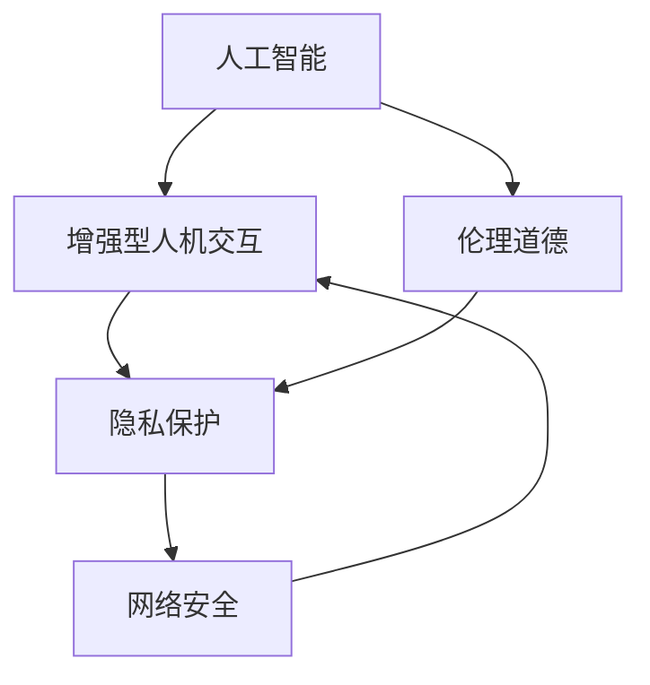

                 

# AI时代的人类增强：道德、隐私和安全考虑

> 关键词：人工智能,增强型人机交互,伦理道德,隐私保护,网络安全

## 1. 背景介绍

随着人工智能(AI)技术的不断进步，AI正迅速渗透到社会的各个方面，从医疗、教育到交通、娱乐，AI已经极大地改善了人类生活和工作质量。然而，AI的发展也引发了一系列复杂的道德、隐私和安全问题，这些问题在AI时代的人类增强和应用中尤为凸显。本文将深入探讨AI技术在提升人类能力、改善生活质量的同时，如何确保其使用的道德、隐私和安全。

## 2. 核心概念与联系

### 2.1 核心概念概述

为更好地理解AI时代的人类增强中的道德、隐私和安全问题，本节将介绍几个密切相关的核心概念：

- **人工智能**：使用算法和计算机技术，使机器能够执行类似于人类智能的任务，包括学习、推理、感知等。
- **增强型人机交互**：通过AI技术提升人机交互的质量和效率，增强人类的感知、决策和行动能力。
- **伦理道德**：指导AI技术设计和使用的伦理原则，涉及AI对社会、人类和环境的影响。
- **隐私保护**：保护个人数据不受未授权访问、使用和泄露的技术和法律措施。
- **网络安全**：保护计算机系统和网络资源不受未经授权的访问、破坏和数据泄露，确保网络环境的稳定和安全。

这些核心概念之间的逻辑关系可以通过以下Mermaid流程图来展示：



这个流程图展示了几者之间的逻辑关系：

1. 人工智能是增强型人机交互的基础，通过技术手段提升人类的感知、决策和行动能力。
2. 伦理道德指导AI技术的设计和使用，确保其符合社会的伦理准则和法律规定。
3. 隐私保护和网络安全是增强型人机交互的重要保障，保护用户数据和系统安全。

## 3. 核心算法原理 & 具体操作步骤

### 3.1 算法原理概述

在AI时代的人类增强中，核心的算法原理主要涉及以下几个方面：

- **增强学习算法**：通过模拟人或动物的认知行为，使机器学习在特定环境中做出最优决策。
- **生成对抗网络(GANs)**：通过两个相互竞争的神经网络模型，生成逼真的数据和图像，增强人类的感知体验。
- **自然语言处理(NLP)**：通过理解和生成自然语言，增强人类的交流和信息处理能力。
- **增强现实(AR)和虚拟现实(VR)**：通过虚拟环境模拟现实世界，增强人类的感知和交互能力。

这些算法原理通过提升人类的感知、决策和行动能力，实现AI时代的人类增强。

### 3.2 算法步骤详解

下面以增强学习算法为例，详细介绍其实现步骤：

**Step 1: 环境设定**
- 确定增强学习任务的环境，如迷宫、游戏等，定义状态空间、动作空间和奖励函数。

**Step 2: 策略选择**
- 选择一个合适的策略模型，如Q网络或策略网络，用于学习最优策略。

**Step 3: 参数初始化**
- 对模型参数进行随机初始化，或加载预训练模型。

**Step 4: 模型训练**
- 将环境模拟出来的数据输入模型，通过反向传播算法更新模型参数。
- 不断迭代训练，直到模型收敛。

**Step 5: 评估与优化**
- 使用测试集评估模型效果。
- 根据评估结果调整模型参数，优化性能。

**Step 6: 应用部署**
- 将训练好的模型部署到实际应用中，实现增强型人机交互。

### 3.3 算法优缺点

增强学习算法具有以下优点：
1. 可以处理复杂多变的任务，适应性强。
2. 通过不断试错和优化，能够找到最优策略。
3. 无需大量标注数据，训练成本低。

同时，增强学习算法也存在一些缺点：
1. 学习过程复杂，需要大量的计算资源和时间。
2. 策略模型可能会过拟合，泛化能力有限。
3. 存在探索与利用之间的平衡问题，即如何平衡对环境的探索和利用。

### 3.4 算法应用领域

增强学习算法在AI时代的人类增强中有着广泛的应用，例如：

- **游戏AI**：通过增强学习，使游戏中的AI角色具备自主决策和动态适应能力。
- **机器人控制**：通过增强学习，使机器人能够自动学习最优操作策略，提升任务执行效率。
- **自动驾驶**：通过增强学习，使自动驾驶系统能够适应复杂的道路环境和交通情况，实现安全可靠的驾驶。
- **金融交易**：通过增强学习，使交易系统能够自动进行策略优化和风险管理，提升投资收益。

这些应用展示了增强学习在AI时代人类增强中的巨大潜力。

## 4. 数学模型和公式 & 详细讲解

### 4.1 数学模型构建

本节将使用数学语言对增强学习算法的核心模型进行更加严格的刻画。

假设增强学习任务的环境为 $E$，状态空间为 $\mathcal{S}$，动作空间为 $\mathcal{A}$，奖励函数为 $R$，策略为 $\pi$。目标是在策略 $\pi$ 下，最大化预期累积奖励 $J(\pi)$。

增强学习算法的数学模型可以表示为：

$$
\max_{\pi} \mathbb{E}\left[\sum_{t=0}^{\infty} \gamma^t R(s_t, a_t)\right]
$$

其中，$\gamma$ 为折扣因子，用于考虑未来奖励的影响。

### 4.2 公式推导过程

以下我们以Q-learning为例，推导其公式及其梯度计算方法。

Q-learning的目标是最小化模型在环境中的行为误差，即：

$$
Q_{\theta}(s,a) = r + \gamma \max_{a'} Q_{\theta}(s', a')
$$

其中，$Q_{\theta}(s,a)$ 表示在状态 $s$ 下采取动作 $a$ 的累积奖励，$\theta$ 为模型参数。

利用上述公式，可以得到Q-learning的更新公式：

$$
\theta \leftarrow \theta - \eta \nabla_{\theta} Q_{\theta}(s, a) = \eta \nabla_{\theta} \left(r + \gamma \max_{a'} Q_{\theta}(s', a')\right)
$$

其中，$\eta$ 为学习率。

### 4.3 案例分析与讲解

以下以自动驾驶为例，解释增强学习算法的实际应用：

假设自动驾驶系统在道路上的决策包括加速、减速和转向。系统通过感知传感器获取当前位置和速度，根据环境状态和目标位置计算最优动作。假设系统在状态 $s$ 下，采取动作 $a$ 的累积奖励为 $Q_{\theta}(s, a)$，则系统将根据Q-learning算法不断优化参数 $\theta$，直到找到最优策略 $\pi$。

## 5. 项目实践：代码实例和详细解释说明

### 5.1 开发环境搭建

在进行增强学习算法实践前，我们需要准备好开发环境。以下是使用Python进行TensorFlow实现的环境配置流程：

1. 安装Anaconda：从官网下载并安装Anaconda，用于创建独立的Python环境。

2. 创建并激活虚拟环境：
```bash
conda create -n reinforcement-env python=3.8 
conda activate reinforcement-env
```

3. 安装TensorFlow：根据CUDA版本，从官网获取对应的安装命令。例如：
```bash
conda install tensorflow -c tf -c conda-forge
```

4. 安装相关库：
```bash
pip install gym stable-baselines
```

完成上述步骤后，即可在`reinforcement-env`环境中开始增强学习算法实践。

### 5.2 源代码详细实现

下面我们以Q-learning算法为例，给出使用TensorFlow实现自动驾驶决策的代码实现。

```python
import tensorflow as tf
import gym

env = gym.make('CartPole-v0')
state_dim = env.observation_space.shape[0]
action_dim = env.action_space.n
gamma = 0.99
learning_rate = 0.01

model = tf.keras.Sequential([
    tf.keras.layers.Dense(64, activation='relu', input_shape=(state_dim,)),
    tf.keras.layers.Dense(action_dim)
])

optimizer = tf.keras.optimizers.Adam(learning_rate)

def q_learning(env, model, optimizer, gamma, num_episodes):
    state = env.reset()
    for episode in range(num_episodes):
        done = False
        while not done:
            action_probs = model.predict(state.reshape(1, -1))
            action = tf.random.categorical(action_probs, 1)[0, 0].numpy()
            next_state, reward, done, _ = env.step(action)
            q_next = model.predict(next_state.reshape(1, -1))
            q_value = reward + gamma * tf.reduce_max(q_next)
            loss = q_value - model.predict(state.reshape(1, -1))
            optimizer.apply_gradients([(loss, model.trainable_variables)])
            state = next_state

q_learning(env, model, optimizer, gamma, 1000)
```

### 5.3 代码解读与分析

让我们再详细解读一下关键代码的实现细节：

**状态空间和动作空间**：
- `state_dim = env.observation_space.shape[0]`：获取观察空间维度。
- `action_dim = env.action_space.n`：获取动作空间大小。

**模型定义**：
- `model = tf.keras.Sequential()`：定义多层感知器模型。
- `tf.keras.layers.Dense(64, activation='relu', input_shape=(state_dim,))`：定义输入层和隐藏层。
- `tf.keras.layers.Dense(action_dim)`：定义输出层。

**优化器定义**：
- `optimizer = tf.keras.optimizers.Adam(learning_rate)`：定义Adam优化器。

**Q-learning函数**：
- `q_value = reward + gamma * tf.reduce_max(q_next)`：计算Q值。
- `loss = q_value - model.predict(state.reshape(1, -1))`：计算损失函数。
- `optimizer.apply_gradients([(loss, model.trainable_variables)])`：反向传播更新模型参数。

**训练循环**：
- `env.reset()`：重置环境。
- `action_probs = model.predict(state.reshape(1, -1))`：模型预测动作概率。
- `action = tf.random.categorical(action_probs, 1)[0, 0].numpy()`：随机选择动作。
- `next_state, reward, done, _ = env.step(action)`：执行动作，更新状态和奖励。
- `q_next = model.predict(next_state.reshape(1, -1))`：模型预测下一步Q值。
- `loss = q_value - model.predict(state.reshape(1, -1))`：计算损失。
- `optimizer.apply_gradients([(loss, model.trainable_variables)])`：更新模型参数。
- `state = next_state`：更新状态。

可以看到，TensorFlow配合Keras实现了Q-learning算法的简洁高效代码实现。开发者可以将更多精力放在问题建模、优化策略等高层逻辑上，而不必过多关注底层的实现细节。

当然，工业级的系统实现还需考虑更多因素，如模型的保存和部署、超参数的自动搜索、更灵活的任务适配层等。但核心的算法范式基本与此类似。

## 6. 实际应用场景

### 6.1 自动驾驶系统

增强学习算法在自动驾驶系统中有着广泛的应用，通过学习最优驾驶策略，提高车辆的自主决策能力和安全性。自动驾驶系统可以通过模拟环境和实际驾驶数据，训练增强学习模型，使其能够适应复杂道路环境和交通情况。

### 6.2 金融交易系统

金融交易系统可以利用增强学习算法，通过模拟市场变化，训练最优交易策略，实现风险控制和收益优化。通过不断试错和优化，增强学习算法可以在高风险和高频交易环境中取得显著效果。

### 6.3 机器人控制

增强学习算法在机器人控制中也有着广泛的应用，通过学习最优操作策略，提高机器人的自主性和灵活性。例如，通过增强学习算法，可以训练机器人进行物体抓取、避障等复杂任务。

## 7. 工具和资源推荐

### 7.1 学习资源推荐

为了帮助开发者系统掌握增强学习算法的理论基础和实践技巧，这里推荐一些优质的学习资源：

1. 《Reinforcement Learning: An Introduction》书籍：Richard S. Sutton和Andrew G. Barto所著，是强化学习的入门经典。
2. CS285《强化学习》课程：斯坦福大学开设的强化学习课程，涵盖算法原理、应用实例和代码实现。
3. DeepMind的AlphaGo论文：展示深度学习在增强学习中的突破，带动了AI时代的全面发展。
4. OpenAI的Dreamer论文：展示增强学习在机器人控制中的应用，取得了世界领先的成果。
5. Gym库：OpenAI开发的环境库，提供了各种强化学习任务，方便快速实验。

通过对这些资源的学习实践，相信你一定能够快速掌握增强学习算法的精髓，并用于解决实际的AI问题。

### 7.2 开发工具推荐

高效的开发离不开优秀的工具支持。以下是几款用于增强学习算法开发的常用工具：

1. TensorFlow：由Google主导开发的开源深度学习框架，支持增强学习算法的实现和优化。
2. PyTorch：Facebook开发的深度学习框架，灵活性和可扩展性高，适合增强学习算法的快速实验。
3. Stable Baselines：开源增强学习算法库，提供了各种经典的增强学习算法实现，方便快速构建模型。
4. Gym库：OpenAI开发的环境库，提供了丰富的增强学习任务和环境模拟工具，方便实验和调试。
5. RLlib：Facebook的强化学习库，支持分布式训练和优化，适合大规模增强学习任务的实现。

合理利用这些工具，可以显著提升增强学习算法的开发效率，加快创新迭代的步伐。

### 7.3 相关论文推荐

增强学习算法的发展源于学界的持续研究。以下是几篇奠基性的相关论文，推荐阅读：

1. Q-Learning：By T. M. Mitchell，1997年，强化学习领域的经典算法。
2. Deep Q-Networks：By K. Silver et al., 2016年，DeepMind提出的深度增强学习算法，实现了AlphaGo的成功。
3. Trust Region Policy Optimization (TRPO)：By J. Schulman et al., 2015年，提出了基于梯度的增强学习算法，提高了算法效率和稳定性。
4. Proximal Policy Optimization (PPO)：By J. Schulman et al., 2017年，进一步改进了TRPO算法，解决了梯度消失和样本效率低的问题。
5. Multi-Agent Deep Reinforcement Learning：By V. Mnih et al., 2016年，展示了多智能体增强学习算法在复杂环境中的表现。

这些论文代表了大增强学习算法的最新进展。通过学习这些前沿成果，可以帮助研究者把握学科前进方向，激发更多的创新灵感。

## 8. 总结：未来发展趋势与挑战

### 8.1 总结

本文对AI时代的人类增强中的伦理、隐私和安全问题进行了全面系统的介绍。首先阐述了增强学习算法在提升人类感知、决策和行动能力方面的核心作用，明确了增强学习算法在伦理、隐私和安全方面的重要性和挑战。其次，从原理到实践，详细讲解了增强学习算法的数学模型和实现步骤，给出了增强学习算法的代码实现。同时，本文还广泛探讨了增强学习算法在自动驾驶、金融交易、机器人控制等多个行业领域的应用前景，展示了增强学习算法的广泛应用潜力。

通过本文的系统梳理，可以看到，增强学习算法在AI时代人类增强中的巨大潜力，其在提升人类感知、决策和行动能力方面发挥着重要作用，同时也带来了伦理、隐私和安全等多方面的挑战。未来，伴随增强学习算法的发展，这些挑战终将得到解决，增强学习算法必将在构建人机协同的智能时代中扮演越来越重要的角色。

### 8.2 未来发展趋势

展望未来，增强学习算法将呈现以下几个发展趋势：

1. 增强学习算法将更加高效和稳定。通过引入更多的优化算法和技术，增强学习算法将在计算资源和时间成本上取得显著突破。
2. 增强学习算法将更加灵活和适应性强。通过引入多智能体系统和分布式训练，增强学习算法将能够更好地适应复杂和多变的环境。
3. 增强学习算法将更加安全和可解释。通过引入因果分析和可解释性技术，增强学习算法将能够更好地理解其决策过程和输出结果。
4. 增强学习算法将更加伦理和符合社会价值观。通过引入伦理导向的评估指标和约束机制，增强学习算法将能够更好地符合社会的伦理准则和法律规定。

以上趋势凸显了增强学习算法的发展方向和潜力。这些方向的探索发展，必将进一步提升增强学习算法的性能和应用范围，为人类智能的进化带来深远影响。

### 8.3 面临的挑战

尽管增强学习算法已经取得了显著成果，但在迈向更加智能化、普适化应用的过程中，它仍面临着诸多挑战：

1. 数据获取和标注成本高。增强学习算法需要大量的标注数据和环境模拟数据，这些数据的获取和标注成本较高。
2. 算法效率和性能有待提高。当前的增强学习算法在计算资源和时间成本上仍存在一定的局限性，需要进一步优化和改进。
3. 模型解释性和可控性不足。增强学习算法的输出结果往往缺乏可解释性，难以理解和调试。
4. 系统安全性和鲁棒性有待加强。增强学习算法在面对复杂和恶意环境时，容易产生不稳定和不可预测的行为。
5. 伦理和社会影响需重视。增强学习算法在提升人类能力的同时，也可能带来伦理和社会问题，如隐私泄露、歧视等。

这些挑战需要在算法设计和应用中加以重视，并不断探索解决之道。

### 8.4 研究展望

未来，增强学习算法的研究应在以下几个方面继续深入：

1. 研究更加高效和可解释的增强学习算法，提高算法性能和应用范围。
2. 研究更加安全和可控的增强学习系统，确保其在复杂环境中的稳定性和鲁棒性。
3. 研究更加符合伦理和法律要求的增强学习算法，确保其在社会中的应用符合伦理准则和法律规定。
4. 研究更加灵活和多智能体的增强学习算法，提高其在复杂和多变环境中的适应性和可扩展性。

这些研究方向的探索，将推动增强学习算法迈向更加智能化、普适化和伦理化的未来，为构建人机协同的智能时代提供坚实的技术基础。

## 9. 附录：常见问题与解答

**Q1：增强学习算法是否适用于所有任务？**

A: 增强学习算法在处理与环境互动的任务中效果显著，适用于需要动态决策和策略优化的场景，如游戏、机器人控制等。但对于静态或单次决策的任务，如表格数据分析、文档分类等，增强学习算法可能并不适用。此时，传统的机器学习算法可能更适合。

**Q2：增强学习算法中，如何选择最佳策略？**

A: 增强学习算法通过试错和优化逐步找到最佳策略。一般来说，可以使用Q-learning、SARSA等算法进行策略优化，通过不断的试错和优化，找到最优策略。同时，可以使用探索和利用策略，平衡对环境的探索和利用。

**Q3：增强学习算法中，如何处理奖励函数的设计？**

A: 奖励函数的设计是增强学习算法中至关重要的一环。好的奖励函数应能够引导模型学习最优策略。常见的奖励函数设计方法包括：
1. 直接奖励法：奖励模型执行正确动作。
2. 累计奖励法：奖励模型在整个过程中的表现。
3. 惩罚错误法：通过惩罚错误动作，引导模型学习最优策略。

这些方法需要根据具体任务和应用场景进行选择和调整。

**Q4：增强学习算法中，如何处理探索与利用之间的平衡？**

A: 探索与利用之间的平衡是增强学习算法中的一个重要问题。可以使用$\epsilon$-贪心策略、Q-learning等算法进行平衡处理，选择合适的探索和利用策略，确保模型在环境和策略之间取得平衡。

**Q5：增强学习算法中，如何处理模型过拟合问题？**

A: 过拟合是增强学习算法中的常见问题。可以使用正则化、模型压缩、分布式训练等方法进行缓解。同时，需要合理设计奖励函数和探索策略，避免模型在特定环境下的过拟合。

**Q6：增强学习算法中，如何处理环境噪声问题？**

A: 环境噪声是增强学习算法中常见的干扰因素。可以使用鲁棒优化、模型融合等方法进行缓解。同时，需要设计鲁棒性强的奖励函数和策略，增强模型对环境噪声的抵抗能力。

**Q7：增强学习算法中，如何处理模型可解释性问题？**

A: 增强学习算法中，模型的可解释性往往较差。可以使用可解释性增强方法，如因果分析和可解释性模块，提高模型的可解释性和透明性。同时，可以通过逐步分析和调试模型，理解其决策过程和输出结果。

这些常见问题的解答，将帮助开发者更好地理解增强学习算法，并解决实际应用中的问题。

---

作者：禅与计算机程序设计艺术 / Zen and the Art of Computer Programming

