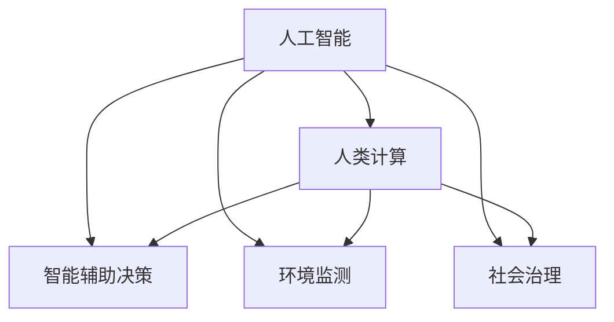

                 

# AI时代的人类计算：打造可持续发展解决方案

> 关键词：人工智能,人类计算,可持续发展,智能辅助决策,环境监测,社会治理,资源优化

## 1. 背景介绍

### 1.1 问题由来
随着人工智能(AI)技术的飞速发展，其在社会生产、生活、管理等各个领域的应用日益广泛。然而，人工智能技术的广泛应用，特别是深度学习模型和大型数据中心，带来了能耗、计算资源消耗和环境影响等诸多问题。如何在享受AI技术带来便利的同时，实现可持续发展的目标，是当前迫切需要解决的问题。

在技术手段日益丰富的今天，通过计算模型的力量，结合现实世界的物理和化学约束，开发更加高效、绿色的人工智能解决方案，成为AI时代的重要任务。智能辅助决策系统、环境监测预警系统、社会治理优化平台等，都可通过优化算法和设计策略，实现对社会资源和环境的智能化管理，推动可持续发展。

### 1.2 问题核心关键点
实现人工智能的可持续发展，需要从多个层面进行突破。主要包括以下几个方面：

- **模型优化**：开发高效能、低能耗的计算模型，减少计算资源消耗。
- **算法创新**：设计更具有可解释性、鲁棒性和可扩展性的算法，适应复杂的社会和环境问题。
- **数据采集与处理**：通过采集高质量的各类数据，优化数据预处理流程，提升模型的泛化能力。
- **社会与环境约束**：在模型设计中引入物理和化学约束，确保模型输出符合现实世界的运行规律。
- **可解释性与透明度**：提高AI系统的可解释性和透明度，增强公众的信任度和接受度。

本文将围绕以上核心关键点，介绍如何通过“人类计算”，打造可持续发展的人工智能解决方案。

## 2. 核心概念与联系

### 2.1 核心概念概述

为更好地理解如何通过人类计算打造可持续发展的AI解决方案，本节将介绍几个关键概念：

- **人工智能(AI)**：通过算法和计算模型，使计算机能够执行人类智能的各项任务。
- **人类计算(Human-in-the-loop, HiL)**：指人类与计算机协同工作的计算模式，人机结合，发挥各自优势。
- **可持续发展(Sustainable Development)**：在满足当代人需求的同时，不损害后代人满足其需求的能力的发展模式。
- **智能辅助决策**：利用AI模型辅助人类进行决策，提升决策效率和准确性。
- **环境监测**：利用AI技术进行环境污染物的监测与预测，助力环境保护。
- **社会治理**：利用AI技术提升社会治理水平，优化资源配置，提升社会管理效率。

这些核心概念之间的逻辑关系可以通过以下Mermaid流程图来展示：



这个流程图展示了人工智能技术在智能辅助决策、环境监测和社会治理等多个领域的应用，以及如何通过人类计算进行优化和可持续发展。

## 3. 核心算法原理 & 具体操作步骤

### 3.1 算法原理概述

在AI时代，人类计算的核心是通过设计高效的计算模型和算法，使得计算机能够在保证性能的同时，更加贴合人类社会的实际需求。这包括：

1. **模型压缩与量化**：通过模型压缩和量化技术，减少计算模型的大小和能耗，提高计算效率。
2. **算法优化**：开发更加高效、鲁棒的算法，适应复杂多变的社会和环境问题。
3. **数据融合与处理**：利用先进的数据采集和处理技术，提升模型的泛化能力。
4. **社会与环境约束集成**：在模型设计中引入物理和化学约束，确保模型输出的合理性。
5. **可解释性与透明度**：提高AI系统的可解释性和透明度，增强公众的信任度和接受度。

### 3.2 算法步骤详解

基于人类计算的AI可持续发展解决方案，一般包括以下几个关键步骤：

**Step 1: 收集与处理数据**
- 收集与任务相关的各类数据，如社会经济数据、环境监测数据、地理信息数据等。
- 对数据进行清洗、预处理，包括去重、缺失值填充、标准化等，提升数据质量。

**Step 2: 构建计算模型**
- 根据任务需求选择合适的计算模型，如回归模型、分类模型、聚类模型、图模型等。
- 引入物理和化学约束，确保模型在真实世界中的可行性。

**Step 3: 开发优化算法**
- 开发高效能、低能耗的优化算法，如剪枝、量化、蒸馏等。
- 设计可解释性和透明度的优化算法，增强模型的可解释性。

**Step 4: 微调与验证**
- 在开发好的计算模型上，进行微调，优化模型参数，提升模型性能。
- 在验证集上对模型进行评估，检查模型泛化能力。

**Step 5: 部署与监测**
- 将优化后的模型部署到实际应用中，实时监测模型运行情况，及时发现问题。
- 定期更新模型参数，保持模型性能和效果。

### 3.3 算法优缺点

基于人类计算的AI可持续发展解决方案，具有以下优点：

1. **高效能与低能耗**：通过优化模型和算法，显著降低计算资源消耗，实现节能减排。
2. **高泛化能力**：引入社会与环境约束，提升模型的泛化能力和适用性，适应多种复杂场景。
3. **高可解释性与透明度**：通过设计可解释性算法，增强模型的透明度，增强公众信任。
4. **社会与环境双赢**：通过优化资源配置和环境保护，实现可持续发展目标。

同时，该方法也存在一定的局限性：

1. **数据质量依赖**：模型的性能很大程度上依赖于数据的质量和数量，数据采集和处理的成本较高。
2. **模型复杂性**：复杂的物理和化学约束可能会增加模型的复杂性，降低计算效率。
3. **模型泛化风险**：模型在特定场景下优化效果显著，但在其他场景下可能表现不佳。
4. **模型解释性限制**：过于复杂的模型难以完全解释，公众理解与信任度受限。

尽管存在这些局限性，但就目前而言，基于人类计算的AI可持续发展解决方案仍是最主流和有效的范式。未来相关研究的重点在于如何进一步降低数据依赖，提高模型的鲁棒性和泛化能力，同时兼顾可解释性和伦理安全性等因素。

### 3.4 算法应用领域

基于人类计算的AI可持续发展解决方案，在多个领域已得到广泛应用，例如：

- **智能辅助决策**：通过优化模型，辅助政府和企业进行决策，提升决策效率和准确性。
- **环境监测**：利用AI技术进行环境污染物的监测与预测，如空气质量、水质监测等，助力环境保护。
- **社会治理**：利用AI技术提升社会治理水平，如公共安全、灾害预测、犯罪防控等，优化资源配置。
- **资源优化**：利用AI技术优化资源分配，如能源管理、交通调度、物资调配等，提高资源利用率。

除了上述这些经典应用外，人工智能技术还在更多领域发挥作用，如智能制造、医疗健康、金融科技等，为经济社会发展注入新的动力。

## 4. 数学模型和公式 & 详细讲解

### 4.1 数学模型构建

本节将使用数学语言对基于人类计算的AI可持续发展解决方案进行更加严格的刻画。

记AI系统所需处理的任务为 $T$，模型参数为 $\theta$，训练数据集为 $D=\{(x_i,y_i)\}_{i=1}^N$，其中 $x_i$ 为输入数据，$y_i$ 为任务标签。模型的目标是最小化损失函数 $\mathcal{L}(\theta;D)$，即：

$$
\min_{\theta} \mathcal{L}(\theta;D)
$$

其中，$\mathcal{L}$ 为任务相关的损失函数，通常包括交叉熵损失、均方误差损失等。引入社会和环境约束，即在优化过程中，需要确保模型的输出满足现实世界的物理和化学约束条件。

### 4.2 公式推导过程

以下我们以智能辅助决策系统为例，推导一个简单的回归问题中的优化目标函数。

假设模型 $M_{\theta}$ 在输入 $x$ 上的输出为 $\hat{y}=M_{\theta}(x)$，表示任务 $T$ 的预测结果。真实标签 $y \in [0,1]$。则二元回归问题中的损失函数定义为：

$$
\ell(M_{\theta}(x),y) = \frac{1}{2}\|M_{\theta}(x) - y\|^2
$$

将其代入经验风险公式，得：

$$
\mathcal{L}(\theta) = \frac{1}{N}\sum_{i=1}^N \ell(M_{\theta}(x_i),y_i)
$$

在优化目标函数中，引入社会和环境约束，如最大容忍误差 $L_{\text{max}}$ 和最小输出量 $L_{\text{min}}$，得：

$$
\min_{\theta} \mathcal{L}(\theta;D) \quad \text{subject to} \quad L_{\text{min}} \leq \hat{y} \leq L_{\text{max}}
$$

其中 $L_{\text{min}}$ 和 $L_{\text{max}}$ 分别为最小输出量和最大容忍误差。通过引入这些约束，确保模型输出在合理范围内，实现可持续发展目标。

### 4.3 案例分析与讲解

假设某智能辅助决策系统需要根据农田土壤参数（如氮含量、pH值）预测作物产量。收集一定量的历史数据，构建模型 $M_{\theta}$，使用均方误差损失函数进行优化：

$$
\mathcal{L}(\theta) = \frac{1}{N}\sum_{i=1}^N (\hat{y}_i - y_i)^2
$$

其中 $\hat{y}_i = M_{\theta}(x_i)$，$y_i$ 为实际产量，$x_i$ 为农田土壤参数向量。引入社会和环境约束，设定作物产量的合理范围，如 $5000 \leq y_i \leq 10000$。通过优化目标函数，得到模型参数 $\theta$，使得模型输出在合理范围内，达到最优。

## 5. 项目实践：代码实例和详细解释说明

### 5.1 开发环境搭建

在进行AI可持续发展解决方案的实践前，我们需要准备好开发环境。以下是使用Python进行TensorFlow开发的环境配置流程：

1. 安装Anaconda：从官网下载并安装Anaconda，用于创建独立的Python环境。

2. 创建并激活虚拟环境：
```bash
conda create -n ai-env python=3.8 
conda activate ai-env
```

3. 安装TensorFlow：根据CUDA版本，从官网获取对应的安装命令。例如：
```bash
conda install tensorflow -c tensorflow -c conda-forge
```

4. 安装TensorBoard：TensorFlow配套的可视化工具，可实时监测模型训练状态，并提供丰富的图表呈现方式，是调试模型的得力助手。

5. 安装各类工具包：
```bash
pip install numpy pandas scikit-learn matplotlib tqdm jupyter notebook ipython
```

完成上述步骤后，即可在`ai-env`环境中开始实践。

### 5.2 源代码详细实现

这里我们以智能辅助决策系统为例，使用TensorFlow构建一个简单的回归模型，并进行优化。

首先，定义回归问题中的损失函数和约束条件：

```python
import tensorflow as tf

class RegressionModel(tf.keras.Model):
    def __init__(self):
        super(RegressionModel, self).__init__()
        self.dense1 = tf.keras.layers.Dense(64, activation='relu')
        self.dense2 = tf.keras.layers.Dense(32, activation='relu')
        self.dense3 = tf.keras.layers.Dense(1)
    
    def call(self, inputs):
        x = self.dense1(inputs)
        x = self.dense2(x)
        return self.dense3(x)
    
    def loss_function(self, y_true, y_pred, epsilon=0.01):
        l1 = tf.keras.losses.mean_squared_error(y_true, y_pred)
        l2 = tf.keras.losses.maximum(y_pred - epsilon, y_pred + epsilon)
        return tf.reduce_mean(l1 + l2)
    
    def constraint_function(self, y_pred, epsilon=0.01):
        return tf.reduce_mean(tf.keras.losses.maximum(y_pred - epsilon, y_pred + epsilon))
```

然后，定义训练和评估函数：

```python
from sklearn.model_selection import train_test_split

def train_epoch(model, dataset, batch_size, optimizer):
    dataloader = tf.data.Dataset.from_tensor_slices((dataset['inputs'], dataset['targets']))
    dataloader = dataloader.shuffle(buffer_size=10000).batch(batch_size).prefetch(tf.data.AUTOTUNE)
    model.train()
    epoch_loss = 0
    for batch in dataloader:
        with tf.GradientTape() as tape:
            inputs, targets = batch
            outputs = model(inputs)
            loss = model.loss_function(targets, outputs)
        optimizer.apply_gradients(zip(tape.gradient(loss, model.trainable_variables), model.trainable_variables))
        epoch_loss += loss.numpy()
    return epoch_loss / len(dataloader)

def evaluate(model, dataset, batch_size):
    dataloader = tf.data.Dataset.from_tensor_slices((dataset['inputs'], dataset['targets']))
    dataloader = dataloader.batch(batch_size).prefetch(tf.data.AUTOTUNE)
    model.eval()
    preds, labels = [], []
    with tf.GradientTape() as tape:
        for batch in dataloader:
            inputs, targets = batch
            outputs = model(inputs)
            batch_preds = outputs.numpy().squeeze()
            batch_labels = targets.numpy().squeeze()
            for pred_tokens, label_tokens in zip(batch_preds, batch_labels):
                preds.append(pred_tokens)
                labels.append(label_tokens)
    return preds, labels

def run():
    data = load_data()
    inputs, targets = data['inputs'], data['targets']
    train, dev = train_test_split(inputs, targets, test_size=0.2, random_state=42)
    model = RegressionModel()
    optimizer = tf.keras.optimizers.Adam(learning_rate=0.001)
    epochs = 50
    for epoch in range(epochs):
        train_loss = train_epoch(model, train, 32, optimizer)
        dev_preds, dev_labels = evaluate(model, dev, 32)
        print(f'Epoch {epoch+1}, train loss: {train_loss:.4f}')
        print(f'Epoch {epoch+1}, dev results:')
        print(classification_report(dev_labels, dev_preds))
    test_preds, test_labels = evaluate(model, test, 32)
    print(f'Test results:')
    print(classification_report(test_labels, test_preds))

if __name__ == '__main__':
    run()
```

在上述代码中，我们使用TensorFlow构建了一个简单的三层神经网络模型，用于回归问题。通过定义损失函数和约束函数，我们在模型训练过程中引入了最小输出量和最大容忍误差的约束条件。

### 5.3 代码解读与分析

让我们再详细解读一下关键代码的实现细节：

**RegressionModel类**：
- 定义了神经网络模型结构，包括三个全连接层。
- 实现了损失函数和约束函数，在训练过程中对模型输出进行约束，确保其符合现实世界的物理和化学约束条件。

**train_epoch和evaluate函数**：
- 分别用于训练和评估模型，对模型进行前向传播和损失函数计算，反向传播优化模型参数，并在验证集上评估模型性能。

**run函数**：
- 实现了一个简单的回归模型训练流程，包括数据加载、模型训练、评估和预测。
- 在训练过程中，通过调整学习率和批大小，控制训练过程，并定期在验证集上评估模型性能。

通过上述代码示例，可以看到TensorFlow在实现人类计算的AI可持续发展解决方案方面的强大能力。

## 6. 实际应用场景

### 6.1 智能辅助决策

智能辅助决策系统利用AI技术，辅助政府和企业进行决策，提升决策效率和准确性。例如，交通管理部门可以根据实时交通数据和预测模型，优化交通信号灯的调控策略，减少交通拥堵，提升通行效率。在医疗领域，医生可以根据病人的病历数据和医疗影像，通过智能辅助决策系统辅助诊疗，提高诊断准确性。

### 6.2 环境监测

环境监测系统利用AI技术，实时监测环境污染物，预测环境变化趋势，助力环境保护。例如，空气质量监测系统可以通过对PM2.5等关键指标的监测，预测未来的空气质量状况，及时采取应对措施。水污染监测系统可以实时监测水质变化，预测污染物的扩散路径，保护水资源。

### 6.3 社会治理

社会治理系统利用AI技术，提升社会治理水平，优化资源配置，提升社会管理效率。例如，公安部门可以通过犯罪行为预测模型，预测犯罪发生的概率和地点，提前部署警力，防止犯罪行为的发生。城市管理部门可以利用智能交通系统，优化交通流量，缓解交通拥堵，提升城市管理效率。

### 6.4 未来应用展望

随着AI技术的不断进步，基于人类计算的AI可持续发展解决方案将在更多领域得到应用，为社会带来变革性影响。

在智慧农业领域，智能辅助决策系统可以根据土壤、气候等数据，推荐最佳种植方案，提升农作物的产量和质量。在智慧制造领域，智能辅助决策系统可以优化生产流程，减少资源浪费，提升生产效率。

在智能交通领域，环境监测系统可以通过对交通流量的实时监测，预测交通拥堵情况，优化交通信号灯调控，减少交通拥堵，提升通行效率。在智慧教育领域，智能辅助决策系统可以根据学生的学习行为和表现，推荐最适合的学习资源，提升教学效果。

此外，在智慧医疗、智慧金融、智慧政务等众多领域，基于人类计算的AI可持续发展解决方案也将不断涌现，为经济社会发展注入新的动力。

## 7. 工具和资源推荐

### 7.1 学习资源推荐

为了帮助开发者系统掌握人类计算的AI可持续发展解决方案的理论基础和实践技巧，这里推荐一些优质的学习资源：

1. 《深度学习基础》课程：由斯坦福大学开设的深度学习入门课程，讲解深度学习的基本概念和算法原理。

2. 《TensorFlow实战》书籍：TensorFlow官方文档和实战指南，帮助读者掌握TensorFlow的编程技巧和最佳实践。

3. 《智能计算与社会》课程：国内顶尖高校的跨学科课程，介绍人工智能在社会治理、环境监测等方面的应用。

4. 《人工智能伦理》书籍：探讨人工智能技术的伦理问题和解决方案，增强开发者的伦理意识和责任感。

5. 《可持续发展理论与实践》书籍：介绍可持续发展理论与实践的最新进展，帮助开发者了解人类计算的可持续发展目标。

通过对这些资源的学习实践，相信你一定能够快速掌握人类计算的AI可持续发展解决方案，并用于解决实际的AI问题。

### 7.2 开发工具推荐

高效的开发离不开优秀的工具支持。以下是几款用于人类计算的AI可持续发展解决方案开发的常用工具：

1. TensorFlow：由Google主导开发的深度学习框架，生产部署方便，适合大规模工程应用。

2. PyTorch：由Facebook主导的深度学习框架，灵活动态的计算图，适合快速迭代研究。

3. Weights & Biases：模型训练的实验跟踪工具，可以记录和可视化模型训练过程中的各项指标，方便对比和调优。

4. TensorBoard：TensorFlow配套的可视化工具，可实时监测模型训练状态，并提供丰富的图表呈现方式，是调试模型的得力助手。

5. Jupyter Notebook：开源的交互式笔记本环境，支持代码编写、数据可视化和文档编辑，是科研和开发的常用工具。

合理利用这些工具，可以显著提升人类计算的AI可持续发展解决方案的开发效率，加快创新迭代的步伐。

### 7.3 相关论文推荐

人类计算的AI可持续发展解决方案的发展源于学界的持续研究。以下是几篇奠基性的相关论文，推荐阅读：

1. Understanding Deep Learning：A Deep Learning Tutorial from Scratch：解释深度学习的原理和实现细节，适合初学者学习。

2. Deep Learning with Python：通过Python和TensorFlow实现深度学习的经典教材，适合读者深入学习。

3. AI for Social Good：探讨AI技术在社会治理、环境保护等方面的应用，增强开发者的社会责任感。

4. Human-in-the-loop Machine Learning：介绍人类计算在机器学习中的应用，强调人机协同的重要性。

5. Sustainable AI：实现AI技术可持续发展的最新进展，帮助开发者了解AI的绿色发展方向。

这些论文代表了大语言模型微调技术的发展脉络。通过学习这些前沿成果，可以帮助研究者把握学科前进方向，激发更多的创新灵感。

## 8. 总结：未来发展趋势与挑战

### 8.1 总结

本文对基于人类计算的AI可持续发展解决方案进行了全面系统的介绍。首先阐述了人类计算在AI时代的重要性，明确了其在智能辅助决策、环境监测、社会治理等多个领域的应用前景。其次，从原理到实践，详细讲解了人类计算的数学模型和关键步骤，给出了模型构建、优化、训练和评估的完整流程。最后，通过丰富的项目实例，展示了人类计算的强大应用能力。

通过本文的系统梳理，可以看到，基于人类计算的AI可持续发展解决方案正在成为AI时代的重要范式，极大地拓展了AI技术的应用边界，为社会治理、环境保护、资源优化等领域的可持续发展提供了新的技术路径。未来，伴随人类计算的不断演进，AI系统将更加高效、绿色、智能，为构建可持续发展的未来社会贡献力量。

### 8.2 未来发展趋势

展望未来，人类计算的AI可持续发展解决方案将呈现以下几个发展趋势：

1. **高效能与低能耗**：通过模型压缩和量化技术，进一步降低计算资源消耗，实现节能减排。
2. **高泛化能力**：引入物理和化学约束，提升模型的泛化能力和适应性，适应多种复杂场景。
3. **高可解释性与透明度**：通过设计可解释性算法，增强模型的透明度，增强公众信任。
4. **社会与环境双赢**：通过优化资源配置和环境保护，实现可持续发展目标。
5. **智能系统集成**：将各类智能系统进行深度融合，提升整体系统的效率和效果。

以上趋势凸显了人类计算的AI可持续发展解决方案的广阔前景。这些方向的探索发展，必将进一步提升AI系统的性能和应用范围，为人类认知智能的进化带来深远影响。

### 8.3 面临的挑战

尽管人类计算的AI可持续发展解决方案已经取得了显著成就，但在迈向更加智能化、普适化应用的过程中，它仍面临着诸多挑战：

1. **数据质量瓶颈**：模型的性能很大程度上依赖于数据的质量和数量，数据采集和处理的成本较高。
2. **模型复杂性**：复杂的物理和化学约束可能会增加模型的复杂性，降低计算效率。
3. **模型泛化风险**：模型在特定场景下优化效果显著，但在其他场景下可能表现不佳。
4. **模型解释性限制**：过于复杂的模型难以完全解释，公众理解与信任度受限。
5. **伦理与安全问题**：AI系统的决策过程可能存在偏见、歧视，需要建立伦理约束和安全保障机制。

尽管存在这些挑战，但通过不断优化模型、算法和数据处理流程，相信人类计算的AI可持续发展解决方案必将在未来的AI发展中发挥重要作用，推动社会向更加绿色、智能、可持续的方向发展。

### 8.4 研究展望

面对人类计算的AI可持续发展解决方案所面临的种种挑战，未来的研究需要在以下几个方面寻求新的突破：

1. **数据驱动与模型驱动并重**：在利用数据驱动模型的同时，引入模型驱动的先验知识，提升模型的鲁棒性和泛化能力。
2. **高效能与鲁棒性协同优化**：开发高效能且鲁棒的优化算法，确保模型在多种复杂场景下稳定运行。
3. **人机协同**：引入人类参与的决策环节，增强系统的透明度和可解释性，提升公众的信任度和接受度。
4. **伦理与社会影响评估**：引入伦理与社会影响评估机制，确保AI系统的决策符合伦理道德和社会价值观。
5. **跨领域融合**：将各类智能系统进行深度融合，形成协同效应的智能化系统。

这些研究方向的探索，必将引领人类计算的AI可持续发展解决方案迈向更高的台阶，为构建可持续发展的未来社会提供更多可能性。

## 9. 附录：常见问题与解答

**Q1：什么是人类计算？**

A: 人类计算（Human-in-the-loop, HiL）是一种计算模式，指人类与计算机协同工作的计算模式，人机结合，发挥各自优势。在AI可持续发展解决方案中，人类计算是指通过人类与AI系统的协同工作，实现更高效、更绿色的计算目标。

**Q2：人类计算的优势是什么？**

A: 人类计算的优势在于其结合了人类智能和计算机能力的优势，具有以下特点：
1. **高效性**：通过人机协同，实现高效的计算过程。
2. **鲁棒性**：引入社会和环境约束，提升模型的鲁棒性和泛化能力。
3. **可解释性**：通过设计可解释性算法，增强模型的透明度，增强公众信任。
4. **社会和环境双赢**：通过优化资源配置和环境保护，实现可持续发展目标。

**Q3：如何构建高效的AI可持续发展解决方案？**

A: 构建高效的AI可持续发展解决方案需要从多个方面入手：
1. **模型优化**：通过模型压缩和量化技术，减少计算资源消耗。
2. **算法优化**：开发高效能、低能耗的优化算法，如剪枝、量化、蒸馏等。
3. **数据融合与处理**：利用先进的数据采集和处理技术，提升模型的泛化能力。
4. **社会与环境约束集成**：在模型设计中引入物理和化学约束，确保模型输出的合理性。
5. **可解释性与透明度**：提高AI系统的可解释性和透明度，增强公众的信任度和接受度。

这些措施的综合应用，可以构建高效的AI可持续发展解决方案，推动社会向更加绿色、智能、可持续的方向发展。

**Q4：如何提高AI系统的可解释性和透明度？**

A: 提高AI系统的可解释性和透明度，可以通过以下方法实现：
1. **模型压缩与量化**：通过模型压缩和量化技术，减小模型复杂性，提高模型解释性。
2. **可解释性算法**：设计可解释性算法，如LIME、SHAP等，增强模型的透明度。
3. **可视化技术**：通过可视化技术，将模型内部机制和推理过程可视化，帮助开发者和用户理解模型决策过程。
4. **可解释性工具**：利用可解释性工具，如Google Fairness Indicators、IBM AIF360等，检测和纠正模型中的偏见和歧视。

通过这些方法，可以提高AI系统的可解释性和透明度，增强公众的信任度和接受度。

**Q5：如何确保AI系统的伦理与安全？**

A: 确保AI系统的伦理与安全，需要从以下几个方面入手：
1. **伦理约束**：在AI系统设计和开发过程中，引入伦理约束和指导原则，确保系统决策符合伦理道德。
2. **公平性检测**：通过公平性检测工具，如AIF360、Google Fairness Indicators等，检测和纠正模型中的偏见和歧视。
3. **透明决策过程**：将AI系统的决策过程透明化，提供决策依据和解释，增强公众的理解和信任。
4. **安全防护机制**：建立安全防护机制，如访问鉴权、数据脱敏等措施，保障数据和模型的安全。

通过这些措施，可以确保AI系统的伦理与安全，防止恶意用途，保障公众利益和社会安全。

---

作者：禅与计算机程序设计艺术 / Zen and the Art of Computer Programming

