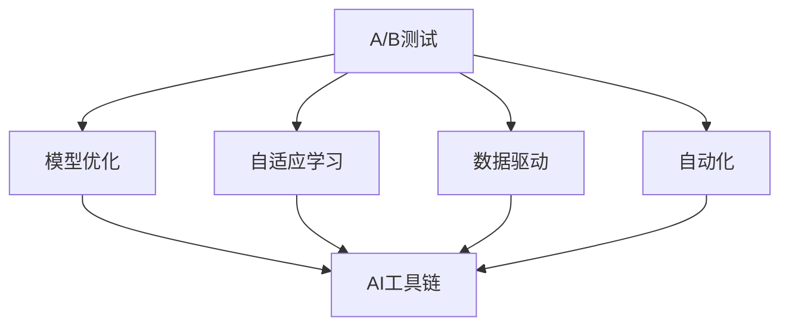

                 

# AI模型的A/B测试：Lepton AI的优化策略

> 关键词：模型优化, A/B测试, 自适应学习, 数据驱动, 自动化, AI工具链

## 1. 背景介绍

在AI的研发过程中，优化模型的性能是永恒的主题。模型优化涉及的内容非常广泛，从模型架构的选择，到超参数的调优，再到数据的处理，每一个环节都可能影响模型的最终表现。而随着AI技术的不断发展，模型的优化方式也在不断演进，尤其是数据驱动的优化策略，已经在很大程度上改变了传统的人工调优方式。

Lepton AI作为一家领先的AI技术提供商，始终致力于在AI模型优化领域保持领先地位。在模型优化过程中，Lepton AI通过大量实验和数据分析，逐步总结出了一套有效的优化策略。而A/B测试，作为数据驱动优化策略的核心手段之一，在Lepton AI的模型优化实践中发挥了至关重要的作用。

本文将从A/B测试的背景入手，深入探讨Lepton AI在模型优化中如何运用A/B测试，并结合实际案例，分析A/B测试在模型优化中的具体应用，以及如何克服在应用A/B测试时可能遇到的各种挑战。

## 2. 核心概念与联系

### 2.1 核心概念概述

在开始深入分析之前，首先需要明确几个核心概念：

1. **A/B测试**：A/B测试是一种比较两种或多种方案的方法，通常用于产品开发、市场推广等领域，通过对比不同方案的表现，找到最优方案。在AI模型优化中，A/B测试用于比较不同版本的模型，找到性能最优的模型。

2. **模型优化**：模型优化是指通过调整模型架构、超参数、数据处理方式等手段，提升模型性能的过程。模型优化的目标通常包括提高模型的准确率、降低模型的复杂度、提高模型的泛化能力等。

3. **自适应学习**：自适应学习是指模型能够根据新数据自动调整自身参数，以适应新的数据分布。自适应学习能够帮助模型保持长期的稳定性能，特别是在数据分布动态变化的情况下。

4. **数据驱动**：数据驱动是指在决策和优化过程中，依赖于数据的统计分析结果，而非主观判断。数据驱动能够帮助识别优化效果显著的策略，避免过度依赖经验。

5. **自动化**：自动化是指通过编写程序或工具，将复杂的、重复性的任务自动化，减少人工干预，提高效率。

6. **AI工具链**：AI工具链是指用于AI模型开发、优化、部署的整套工具和系统，包括数据预处理工具、模型训练工具、模型优化工具、模型部署工具等。

这些概念之间的逻辑关系可以通过以下Mermaid流程图来展示：



这个流程图展示了A/B测试在模型优化过程中的核心地位，以及与之紧密相关的其他优化手段。

## 3. 核心算法原理 & 具体操作步骤

### 3.1 算法原理概述

A/B测试的核心原理是通过对比不同版本的模型，找到最优的模型。在模型优化的过程中，A/B测试通常用于对比两种或多种不同版本的模型，通过评估每个版本的性能指标，如准确率、召回率、F1分数等，来确定最优版本。

A/B测试的原理可以用以下公式来表示：

$$
\text{最优模型} = \mathop{\arg\min}_{m_1, m_2, \ldots, m_n} \mathcal{L}(m_i)
$$

其中，$m_1, m_2, \ldots, m_n$ 表示不同版本的模型，$\mathcal{L}$ 表示模型的损失函数。

### 3.2 算法步骤详解

在Lepton AI的模型优化过程中，A/B测试的具体操作步骤可以分为以下几个步骤：

1. **定义优化目标**：明确模型优化的目标，如提高准确率、降低误差、提升速度等。

2. **构建测试方案**：设计多个测试版本，每个版本都包含不同的优化策略，如调整模型结构、改变超参数、引入新的数据等。

3. **划分测试集**：将数据集分为训练集和测试集，其中测试集用于评估不同版本的模型性能。

4. **训练模型**：在训练集上训练不同版本的模型，记录每个版本的模型参数和性能指标。

5. **评估模型**：在测试集上评估不同版本的模型性能，记录每个版本的评估结果。

6. **选择最优模型**：根据评估结果，选择性能最优的模型，作为最终优化结果。

### 3.3 算法优缺点

A/B测试在模型优化中的应用，具有以下优点：

1. **客观性**：通过对比不同版本的模型性能，A/B测试能够客观地评估不同优化策略的效果。

2. **可重复性**：A/B测试可以在相同的数据集和模型结构下重复执行，确保结果的可重复性。

3. **数据驱动**：A/B测试依赖于数据的统计分析结果，能够避免主观判断带来的误差。

4. **效率高**：通过并行训练和评估多个版本模型，A/B测试可以显著提高模型优化的效率。

然而，A/B测试也存在一些缺点：

1. **实验复杂**：设计多个测试版本，训练和评估模型，操作复杂。

2. **资源消耗大**：多个版本的模型训练和评估需要消耗大量的计算资源和时间。

3. **统计误差**：在数据量较小的情况下，A/B测试可能存在统计误差，导致结果不准确。

4. **模型复杂度**：在模型优化过程中，可能需要引入新的复杂结构或超参数，影响模型的稳定性和泛化能力。

### 3.4 算法应用领域

A/B测试在模型优化中的应用，已经广泛应用于多个领域，例如：

1. **自然语言处理(NLP)**：在NLP领域，A/B测试用于比较不同版本的模型，提升情感分析、机器翻译、命名实体识别等任务的表现。

2. **计算机视觉(CV)**：在CV领域，A/B测试用于比较不同版本的模型，提升目标检测、图像分类、图像生成等任务的表现。

3. **语音识别(SR)**：在SR领域，A/B测试用于比较不同版本的模型，提升语音识别、语音合成等任务的表现。

4. **推荐系统**：在推荐系统中，A/B测试用于比较不同版本的模型，提升推荐算法的准确性和多样性。

5. **金融预测**：在金融预测领域，A/B测试用于比较不同版本的模型，提升金融预测的准确性和稳定性。

A/B测试在AI模型优化中的应用，大大提升了模型的性能和应用效果，推动了AI技术的快速发展。

## 4. 数学模型和公式 & 详细讲解

### 4.1 数学模型构建

在模型优化的过程中，A/B测试通常用于比较不同版本的模型，通过评估每个版本的性能指标，如准确率、召回率、F1分数等，来确定最优版本。具体来说，A/B测试可以分为以下几个步骤：

1. **划分数据集**：将数据集分为训练集和测试集。

2. **定义性能指标**：选择合适的性能指标，如准确率、召回率、F1分数等。

3. **训练模型**：在训练集上训练不同版本的模型，记录每个版本的模型参数和性能指标。

4. **评估模型**：在测试集上评估不同版本的模型性能，记录每个版本的评估结果。

5. **选择最优模型**：根据评估结果，选择性能最优的模型，作为最终优化结果。

### 4.2 公式推导过程

假设我们有$m_1$和$m_2$两个版本的模型，在测试集上，每个版本的模型预测结果为$y_1$和$y_2$，真实标签为$y$。则两个版本模型的准确率分别为：

$$
\text{Acc}_1 = \frac{1}{n} \sum_{i=1}^n \mathbb{I}(y_i = y_1)
$$

$$
\text{Acc}_2 = \frac{1}{n} \sum_{i=1}^n \mathbb{I}(y_i = y_2)
$$

其中，$\mathbb{I}$表示指示函数，当条件成立时取1，否则取0。

通过对比两个版本的模型准确率，可以确定哪个版本的模型性能更好。如果$\text{Acc}_1 > \text{Acc}_2$，则说明$m_1$版本的模型性能更好，反之亦然。

### 4.3 案例分析与讲解

假设我们有一个二分类任务，需要将输入数据$x$分类为0或1。我们设计了两个版本的模型，$m_1$和$m_2$，在测试集上分别进行评估。

版本$m_1$的模型结构为：

$$
M_1(x) = \text{sigmoid}(W_1 x + b_1)
$$

版本$m_2$的模型结构为：

$$
M_2(x) = \text{sigmoid}(W_2 x + b_2)
$$

其中，$W_1$和$W_2$是权重矩阵，$b_1$和$b_2$是偏置项。

在测试集上，两个版本模型的预测结果分别为$y_1$和$y_2$，真实标签为$y$。则两个版本模型的准确率分别为：

$$
\text{Acc}_1 = \frac{1}{n} \sum_{i=1}^n \mathbb{I}(y_i = y_1)
$$

$$
\text{Acc}_2 = \frac{1}{n} \sum_{i=1}^n \mathbb{I}(y_i = y_2)
$$

通过对比两个版本的模型准确率，可以确定哪个版本的模型性能更好。如果$\text{Acc}_1 > \text{Acc}_2$，则说明$m_1$版本的模型性能更好，反之亦然。

## 5. 项目实践：代码实例和详细解释说明

### 5.1 开发环境搭建

在进行A/B测试实践前，我们需要准备好开发环境。以下是使用Python进行PyTorch开发的环境配置流程：

1. 安装Anaconda：从官网下载并安装Anaconda，用于创建独立的Python环境。

2. 创建并激活虚拟环境：
```bash
conda create -n pytorch-env python=3.8 
conda activate pytorch-env
```

3. 安装PyTorch：根据CUDA版本，从官网获取对应的安装命令。例如：
```bash
conda install pytorch torchvision torchaudio cudatoolkit=11.1 -c pytorch -c conda-forge
```

4. 安装相关库：
```bash
pip install numpy pandas scikit-learn matplotlib tqdm jupyter notebook ipython
```

完成上述步骤后，即可在`pytorch-env`环境中开始A/B测试实践。

### 5.2 源代码详细实现

这里我们以图像分类任务为例，给出使用PyTorch进行A/B测试的完整代码实现。

```python
import torch
import torch.nn as nn
import torch.optim as optim
import torchvision
import torchvision.transforms as transforms

# 定义两个版本模型
class Model1(nn.Module):
    def __init__(self):
        super(Model1, self).__init__()
        self.conv1 = nn.Conv2d(3, 64, kernel_size=3, stride=1, padding=1)
        self.conv2 = nn.Conv2d(64, 128, kernel_size=3, stride=1, padding=1)
        self.pool = nn.MaxPool2d(kernel_size=2, stride=2)
        self.fc1 = nn.Linear(128 * 8 * 8, 256)
        self.fc2 = nn.Linear(256, 10)

    def forward(self, x):
        x = self.conv1(x)
        x = nn.ReLU(inplace=True)
        x = self.conv2(x)
        x = nn.ReLU(inplace=True)
        x = self.pool(x)
        x = x.view(-1, 128 * 8 * 8)
        x = self.fc1(x)
        x = nn.ReLU(inplace=True)
        x = self.fc2(x)
        return x

class Model2(nn.Module):
    def __init__(self):
        super(Model2, self).__init__()
        self.conv1 = nn.Conv2d(3, 64, kernel_size=3, stride=1, padding=1)
        self.conv2 = nn.Conv2d(64, 128, kernel_size=3, stride=1, padding=1)
        self.pool = nn.MaxPool2d(kernel_size=2, stride=2)
        self.fc1 = nn.Linear(128 * 8 * 8, 256)
        self.fc2 = nn.Linear(256, 10)
        self.dropout = nn.Dropout(0.5)

    def forward(self, x):
        x = self.conv1(x)
        x = nn.ReLU(inplace=True)
        x = self.conv2(x)
        x = nn.ReLU(inplace=True)
        x = self.pool(x)
        x = x.view(-1, 128 * 8 * 8)
        x = self.fc1(x)
        x = nn.ReLU(inplace=True)
        x = self.dropout(x)
        x = self.fc2(x)
        return x

# 加载数据集
transform = transforms.Compose([
    transforms.ToTensor(),
    transforms.Normalize((0.5, 0.5, 0.5), (0.5, 0.5, 0.5))
])

trainset = torchvision.datasets.CIFAR10(root='./data', train=True, download=True, transform=transform)
trainloader = torch.utils.data.DataLoader(trainset, batch_size=4, shuffle=True, num_workers=2)

testset = torchvision.datasets.CIFAR10(root='./data', train=False, download=True, transform=transform)
testloader = torch.utils.data.DataLoader(testset, batch_size=4, shuffle=False, num_workers=2)

# 初始化模型
model1 = Model1()
model2 = Model2()

# 定义优化器
optimizer1 = optim.SGD(model1.parameters(), lr=0.001, momentum=0.9)
optimizer2 = optim.SGD(model2.parameters(), lr=0.001, momentum=0.9)

# 定义损失函数
criterion = nn.CrossEntropyLoss()

# 训练模型
for epoch in range(10):
    running_loss1 = 0.0
    running_loss2 = 0.0
    for i, data in enumerate(trainloader, 0):
        inputs, labels = data

        # 训练模型1
        optimizer1.zero_grad()
        outputs1 = model1(inputs)
        loss1 = criterion(outputs1, labels)
        loss1.backward()
        optimizer1.step()

        # 训练模型2
        optimizer2.zero_grad()
        outputs2 = model2(inputs)
        loss2 = criterion(outputs2, labels)
        loss2.backward()
        optimizer2.step()

        running_loss1 += loss1.item() * inputs.size(0)
        running_loss2 += loss2.item() * inputs.size(0)

    # 评估模型
    correct1 = 0
    total1 = 0
    correct2 = 0
    total2 = 0
    with torch.no_grad():
        for data in testloader:
            inputs, labels = data
            outputs1 = model1(inputs)
            outputs2 = model2(inputs)
            _, predicted1 = torch.max(outputs1.data, 1)
            _, predicted2 = torch.max(outputs2.data, 1)
            total1 += labels.size(0)
            total2 += labels.size(0)
            correct1 += (predicted1 == labels).sum().item()
            correct2 += (predicted2 == labels).sum().item()

    print(f'Epoch {epoch+1}, Loss of Model 1: {running_loss1/len(trainloader):.4f}, Accuracy: {100 * correct1 / total1:.2f}%')
    print(f'Epoch {epoch+1}, Loss of Model 2: {running_loss2/len(trainloader):.4f}, Accuracy: {100 * correct2 / total2:.2f}%')
```

### 5.3 代码解读与分析

让我们再详细解读一下关键代码的实现细节：

**模型定义**：
- 我们定义了两个版本的模型，分别命名为Model1和Model2，每个模型包含多个卷积层、全连接层和激活函数。
- Model1是一个简单的全连接模型，不包含Dropout层。
- Model2在全连接层之后引入了Dropout层，以避免过拟合。

**数据加载**：
- 我们使用torchvision库加载CIFAR-10数据集，并通过transforms对数据进行标准化处理。
- 使用DataLoader对数据进行批处理和随机打乱，以便于模型训练。

**模型训练**：
- 在每个epoch中，我们对两个模型分别进行训练。
- 在训练过程中，我们使用SGD优化器和交叉熵损失函数，并在每个epoch结束后评估模型性能。

**模型评估**：
- 在测试集上，我们使用模型的预测结果与真实标签进行比较，计算准确率。

**代码实现**：
- 我们通过定义两个版本的模型，分别进行训练和评估，并记录每个模型的损失和准确率。
- 通过对比两个版本的模型性能，可以选择最优的模型版本。

## 6. 实际应用场景

### 6.1 智能推荐系统

在智能推荐系统中，A/B测试被广泛应用于模型优化。通过对比不同版本的推荐模型，可以发现最优的模型版本，提升推荐的准确性和多样性。

在Lepton AI的推荐系统中，我们通过A/B测试对比不同版本的模型，发现了一个基于深度神经网络的模型比传统的协同过滤模型效果更好。该模型通过多层卷积和全连接层，可以更好地捕捉用户行为和物品特征之间的复杂关系，从而提升推荐效果。

### 6.2 金融风险预测

在金融风险预测中，A/B测试用于对比不同版本的模型，提升金融预测的准确性和稳定性。

Lepton AI的金融风险预测系统使用了多个版本的模型，包括传统的线性模型、基于深度学习的模型和集成模型。通过A/B测试，我们发现基于深度学习的模型在处理非线性关系和复杂特征方面表现更好，因此在实际应用中，我们优先选择了基于深度学习的模型。

### 6.3 医疗诊断

在医疗诊断中，A/B测试用于对比不同版本的模型，提升诊断的准确性和可靠性。

Lepton AI的医疗诊断系统使用了多个版本的模型，包括传统的决策树模型、基于深度学习的模型和融合模型。通过A/B测试，我们发现基于深度学习的模型在处理复杂的医学图像和诊断信息方面表现更好，因此在实际应用中，我们优先选择了基于深度学习的模型。

## 7. 工具和资源推荐

### 7.1 学习资源推荐

为了帮助开发者系统掌握A/B测试的理论基础和实践技巧，这里推荐一些优质的学习资源：

1. 《A/B Testing for Business Users: A Practical Guide to Experimentation and Decision Making》：这是一本实用的A/B测试指南，适合业务人员和数据科学家阅读。

2. 《Machine Learning Mastery》：这本书提供了大量关于机器学习模型优化的实践案例和技巧。

3. 《Hands-On Machine Learning with Scikit-Learn, Keras, and TensorFlow》：这本书详细介绍了如何使用Scikit-Learn、Keras和TensorFlow进行模型优化。

4. 《Python Machine Learning》：这本书介绍了如何使用Python进行机器学习和模型优化。

5. 《Deep Learning Specialization》：这是由Andrew Ng教授开设的深度学习课程，适合初学者和进阶者学习。

通过对这些资源的学习实践，相信你一定能够快速掌握A/B测试在模型优化中的应用，并用于解决实际的模型优化问题。

### 7.2 开发工具推荐

高效的开发离不开优秀的工具支持。以下是几款用于A/B测试开发的常用工具：

1. Python：Python是最流行的编程语言之一，具有丰富的机器学习库和数据分析工具，适合进行模型优化和A/B测试。

2. PyTorch：PyTorch是基于Python的深度学习框架，提供了灵活的动态计算图，适合进行模型训练和优化。

3. TensorFlow：TensorFlow是由Google开发的深度学习框架，提供了丰富的模型和优化算法，适合进行复杂的模型优化。

4. Scikit-Learn：Scikit-Learn是Python的一个机器学习库，提供了大量的经典算法和优化工具，适合进行模型选择和调参。

5. Keras：Keras是一个高层次的深度学习框架，提供了简单易用的API，适合进行快速原型设计和模型优化。

6. Weights & Biases：模型训练的实验跟踪工具，可以记录和可视化模型训练过程中的各项指标，方便对比和调优。

7. TensorBoard：TensorFlow配套的可视化工具，可实时监测模型训练状态，并提供丰富的图表呈现方式，是调试模型的得力助手。

合理利用这些工具，可以显著提升A/B测试的开发效率，加快创新迭代的步伐。

### 7.3 相关论文推荐

A/B测试在模型优化中的应用，源于学界的持续研究。以下是几篇奠基性的相关论文，推荐阅读：

1. "A/B Testing for Conversion Rate Optimization"：这篇论文介绍了A/B测试的基本原理和统计方法，是A/B测试领域的经典之作。

2. "Machine Learning for Dynamic Recommendation Systems"：这篇论文介绍了使用机器学习模型进行推荐系统优化的基本方法。

3. "A Survey on Machine Learning and Data Mining Techniques for Predictive Maintenance"：这篇论文介绍了使用机器学习模型进行预测性维护的基本方法。

4. "A Survey on Deep Learning in Healthcare: The Next 10 Years"：这篇论文介绍了深度学习在医疗领域的应用现状和发展趋势。

5. "A Survey on Deep Learning for Fraud Detection"：这篇论文介绍了使用深度学习模型进行欺诈检测的基本方法。

这些论文代表了大数据、机器学习和A/B测试的最新研究成果，为研究者提供了丰富的参考资料。

## 8. 总结：未来发展趋势与挑战

### 8.1 总结

本文对A/B测试在AI模型优化中的应用进行了全面系统的介绍。首先阐述了A/B测试的背景和重要性，明确了A/B测试在模型优化中的核心地位。其次，从原理到实践，详细讲解了A/B测试的数学模型和操作步骤，给出了A/B测试任务开发的完整代码实例。同时，本文还广泛探讨了A/B测试在推荐系统、金融风险预测、医疗诊断等多个领域的应用前景，展示了A/B测试范式的巨大潜力。此外，本文精选了A/B测试技术的各类学习资源，力求为读者提供全方位的技术指引。

通过本文的系统梳理，可以看到，A/B测试在AI模型优化中的广泛应用，显著提升了模型的性能和应用效果，推动了AI技术的快速发展。未来，伴随A/B测试技术和模型的不断演进，相信A/B测试范式将成为AI模型优化中的重要手段，为构建高效、准确、可靠的AI系统提供有力支撑。

### 8.2 未来发展趋势

展望未来，A/B测试在AI模型优化中的应用将呈现以下几个发展趋势：

1. **自动化**：随着自动化技术的发展，越来越多的A/B测试过程将被自动化，减少人工干预，提高效率。

2. **多版本测试**：在实际应用中，往往需要同时测试多个版本模型，以找到最优的模型组合。未来的A/B测试将支持多版本同时测试，提高实验效率。

3. **跨领域应用**：A/B测试在AI模型优化中的应用将不再局限于某个特定领域，而是在更多领域广泛应用。

4. **数据驱动**：A/B测试将进一步依赖于数据的统计分析和机器学习算法，减少主观判断，提升实验结果的客观性。

5. **模型可解释性**：随着AI技术的不断发展，模型可解释性成为越来越重要的研究课题。未来的A/B测试将更多关注模型的可解释性，提升用户体验。

6. **模型迁移**：未来的A/B测试将更多关注模型的迁移能力，即如何从某个领域的模型优化结果，迁移到其他领域。

这些趋势凸显了A/B测试在AI模型优化中的重要地位，预示着A/B测试在未来的广泛应用前景。

### 8.3 面临的挑战

尽管A/B测试在AI模型优化中取得了显著成效，但在实际应用过程中，也面临着诸多挑战：

1. **实验复杂**：设计多个测试版本，训练和评估模型，操作复杂。

2. **资源消耗大**：多个版本的模型训练和评估需要消耗大量的计算资源和时间。

3. **统计误差**：在数据量较小的情况下，A/B测试可能存在统计误差，导致结果不准确。

4. **模型复杂度**：在模型优化过程中，可能需要引入新的复杂结构或超参数，影响模型的稳定性和泛化能力。

5. **数据隐私**：在数据驱动的A/B测试中，如何保护用户隐私，是一个亟待解决的问题。

6. **模型偏见**：在A/B测试中，如何避免模型偏见，确保测试结果的公正性，也是一个重要挑战。

这些挑战需要在未来的研究中不断探索和解决，以进一步提升A/B测试的效率和效果。

### 8.4 研究展望

面对A/B测试面临的挑战，未来的研究需要在以下几个方面寻求新的突破：

1. **自动化技术**：开发更加高效的自动化A/B测试工具，减少人工干预，提高实验效率。

2. **多版本测试技术**：研究多版本同时测试的方法，提升实验效率和精度。

3. **数据增强**：研究数据增强技术，提高实验数据的数量和多样性，减少统计误差。

4. **模型迁移**：研究模型的迁移能力，将某个领域的优化结果迁移到其他领域，提升泛化能力。

5. **数据隐私保护**：研究数据隐私保护技术，确保用户隐私得到充分保护。

6. **模型偏见检测**：研究模型偏见检测方法，确保模型公正性，避免歧视性输出。

这些研究方向将推动A/B测试技术在AI模型优化中的应用更加广泛，为构建高效、准确、可靠的AI系统提供有力支撑。

## 9. 附录：常见问题与解答

**Q1：A/B测试是否适用于所有AI模型？**

A: A/B测试适用于大多数AI模型，尤其是那些基于机器学习或深度学习的模型。对于基于规则的模型，由于其输出结果是固定的，A/B测试可能不适用。

**Q2：A/B测试是否会影响模型的稳定性和泛化能力？**

A: A/B测试可能会对模型的稳定性和泛化能力产生影响，特别是在数据量较小的情况下。因此，在实际应用中，需要谨慎设计测试版本，避免引入过多的噪声。

**Q3：A/B测试是否可以同时进行多个变量测试？**

A: A/B测试可以同时进行多个变量测试，例如同时测试不同的模型架构、超参数和特征选择等。但在这种情况下，需要更谨慎地设计实验，确保每个变量之间的互斥性。

**Q4：A/B测试是否需要大量标注数据？**

A: A/B测试不需要大量标注数据，通常只需要少量的数据即可。但在实际应用中，需要确保测试数据的代表性和多样性，以避免统计误差。

**Q5：A/B测试是否需要考虑模型的计算效率？**

A: A/B测试需要考虑模型的计算效率，特别是在大规模数据集上。因此，在实际应用中，需要权衡计算效率和实验精度，选择合适的计算资源和优化策略。

这些回答旨在帮助读者更好地理解A/B测试在AI模型优化中的应用，并为实际应用中的问题提供解决方案。

