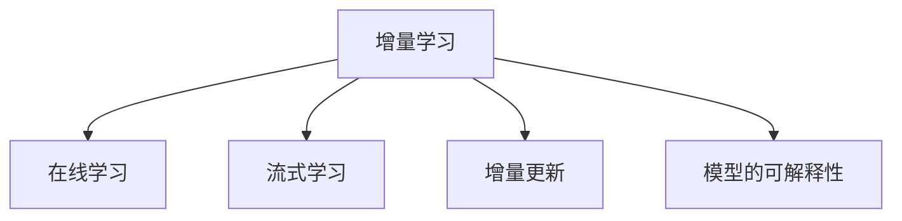

                 

# AI模型的增量学习：Lepton AI的持续优化

> 关键词：增量学习, 持续优化, Lepton AI, 模型更新, 算法迭代

## 1. 背景介绍

### 1.1 问题由来
在当今数据驱动的时代，人工智能（AI）模型已成为企业获取竞争优势的重要手段。然而，构建和维护一个高效的AI模型系统是一个持续且动态的过程，需要面对模型老化、数据演化和业务需求变化等多方面的挑战。为了保持AI系统的实时性和有效性，增量学习（Incremental Learning）成为了一个亟待解决的关键问题。

增量学习，也称作在线学习（Online Learning），是指模型在数据流（data stream）中不断学习和适应新的数据样本，而无需重新训练整个模型。这一过程使得AI系统能够持续学习和优化，确保其在面对实时数据时保持高准确性和响应速度。增量学习在金融风控、推荐系统、智能广告等领域已经取得了显著的应用成效，其需求日益增长。

Lepton AI公司，作为一家致力于AI技术研究和应用的公司，针对增量学习进行了深入的研究，并推出了多项创新技术，以支持AI模型的持续优化和高效部署。本文将详细介绍Lepton AI在增量学习方面的研究和应用，帮助读者深入理解这一领域的核心概念和关键技术。

### 1.2 问题核心关键点
增量学习旨在解决以下问题：
1. **实时性**：在数据流中实时更新模型，避免重新训练带来的时间消耗和资源浪费。
2. **可扩展性**：适应数据量不断增长的需求，保持模型性能的稳定性和准确性。
3. **高准确性**：在有限的数据流中，不断调整模型参数，提高模型的预测能力。
4. **模型更新**：基于最新数据，快速迭代和优化模型，确保模型始终处于最新状态。
5. **算法迭代**：应用高效的算法实现增量学习，提升学习效率和效果。

### 1.3 问题研究意义
研究增量学习技术，对于提升AI模型的实时性和准确性，确保AI系统的长期有效运行，具有重要意义：

1. **提升实时响应能力**：增量学习使得AI模型能够在数据到来时即时响应，适应快速变化的市场环境，提升业务决策的效率。
2. **降低资源消耗**：通过增量学习，可以避免频繁的全量训练，显著减少计算资源和能源消耗。
3. **提高模型适应性**：增量学习使得模型能够持续从新数据中学习，保持对变化的适应能力。
4. **加速模型迭代**：通过快速迭代和更新，增量学习能够迅速响应新的业务需求和市场变化，加速模型的优化和改进。
5. **推动产业应用**：增量学习技术能够帮助企业构建更稳定、高效的AI系统，加速AI技术在各行各业的落地应用。

## 2. 核心概念与联系

### 2.1 核心概念概述

为了深入理解增量学习的原理，本节将介绍几个关键概念：

- **增量学习**：在数据流中不断学习新的数据样本，而无需重新训练整个模型。模型在每次新增样本后更新参数，从而提高对新数据的适应能力。
- **在线学习**：一种增量学习的特殊形式，数据按顺序到达，模型在每一轮训练中使用最新到达的数据进行更新。
- **流式学习**：数据流中不断到达的新样本，模型在每一批次的训练中使用所有到达的数据进行更新。
- **增量更新**：在模型参数更新时，仅更新部分参数或通过插值方式更新全部参数，以减小更新风险和计算开销。
- **模型的可解释性**：指模型输出的结果可被人类理解，有助于模型诊断和优化。

这些概念之间的逻辑关系可以通过以下Mermaid流程图来展示：



这个流程图展示了大语言模型的核心概念及其之间的关系：

1. 增量学习是基础概念，涵盖了在线学习和流式学习。
2. 在线学习和流式学习是增量学习的两种特殊形式。
3. 增量更新是增量学习的一种优化策略。
4. 模型的可解释性是增量学习的重要考量指标。

这些概念共同构成了增量学习的学习框架，使其能够在各种场景下发挥作用。通过理解这些核心概念，我们可以更好地把握增量学习的原理和优化方向。

## 3. 核心算法原理 & 具体操作步骤
### 3.1 算法原理概述

增量学习的基本思想是模型在每一次新增数据时，仅更新与新数据相关的参数，而不是重新训练整个模型。这一过程可以看作是对模型的一次局部更新，旨在保持模型的历史知识和当前数据的最新状态。

增量学习的目标是使模型在新的数据流中不断提升性能，同时保持对已有数据的记忆。形式化地，假设模型参数为 $\theta$，当前时刻为 $t$，模型在 $t$ 时刻的损失函数为 $\mathcal{L}(\theta_t)$，则增量学习的目的在于求解：

$$
\theta_{t+1} = \mathop{\arg\min}_{\theta} \mathcal{L}(\theta_t, D_{t+1})
$$

其中 $D_{t+1}$ 表示在时间 $t+1$ 时刻到达的新数据样本，$\mathcal{L}$ 为损失函数，可以是交叉熵、均方误差等。

增量学习的核心挑战在于如何在保证模型性能的同时，最小化计算开销。常见的增量学习方法包括随机梯度下降（SGD）、小批量梯度下降（Mini-Batch SGD）、增量SVM、增量神经网络等。

### 3.2 算法步骤详解

增量学习的一般流程包括以下几个步骤：

**Step 1: 初始化模型参数**
- 初始化模型参数 $\theta_0$，根据预训练数据和任务需求设置合适的超参数，如学习率、批量大小等。

**Step 2: 准备数据流**
- 收集来自数据源的新数据流 $D_t$，每一批数据包含 $N$ 个样本。

**Step 3: 计算增量更新**
- 计算当前批次的梯度 $\nabla_{\theta} \mathcal{L}(\theta_t, D_t)$。
- 计算新批次的梯度 $\nabla_{\theta} \mathcal{L}(\theta_t, D_{t+1})$。
- 根据增量更新策略，计算最终参数更新值 $\Delta \theta_t$。

**Step 4: 应用增量更新**
- 更新模型参数 $\theta_{t+1} = \theta_t + \Delta \theta_t$。
- 重复步骤2-4，直到数据流结束或达到预设的迭代次数。

**Step 5: 模型评估与优化**
- 在验证集或测试集上评估模型性能，根据结果调整学习率和超参数。
- 记录模型参数和性能指标，以备后续分析与改进。

### 3.3 算法优缺点

增量学习的优点：
1. 实时性：模型能够即时响应新数据，避免重新训练带来的长时间等待。
2. 节省资源：减少计算资源和能源消耗，支持高并发和大规模数据处理。
3. 适应性强：模型能够持续从新数据中学习，保持对变化的适应能力。
4. 更新灵活：适用于数据量不断增长的场景，支持增量更新和模型迭代。

增量学习的缺点：
1. 计算开销：增量更新需要计算新数据的梯度，可能导致计算复杂度增加。
2. 收敛困难：模型更新时需要保持历史知识和当前数据的一致性，收敛难度较大。
3. 稳定性问题：增量更新可能导致参数更新不稳定，影响模型性能。
4. 可解释性差：增量更新后的模型参数较难解释，难以进行调试和优化。

### 3.4 算法应用领域

增量学习已经在多个领域得到了广泛应用，例如：

- **金融风控**：实时监控交易数据，检测和预测潜在的欺诈行为。
- **推荐系统**：根据用户行为实时更新推荐模型，动态调整推荐策略。
- **智能广告**：基于用户点击数据实时调整广告投放策略，提升广告效果。
- **自动驾驶**：通过实时数据不断优化决策模型，提升驾驶安全性和准确性。
- **医疗诊断**：实时分析患者的生理数据，辅助医生进行疾病诊断和治疗决策。

除了上述这些经典应用外，增量学习还在网络安全、智慧城市、智能制造等多个领域中发挥着重要作用。未来，随着数据流量的不断增长和AI系统的复杂性提升，增量学习的应用前景将更加广阔。

## 4. 数学模型和公式 & 详细讲解 & 举例说明

### 4.1 数学模型构建

以下以线性回归模型为例，构建增量学习的数学模型。假设模型参数为 $\theta = [w, b]$，其中 $w$ 为权重，$b$ 为偏置，当前时刻为 $t$。模型在 $t$ 时刻的损失函数为：

$$
\mathcal{L}(\theta_t) = \frac{1}{2} \sum_{i=1}^{N_t} (y_i - \theta_t^T x_i)^2
$$

其中 $N_t$ 为当前时刻的样本数，$y_i$ 为样本 $i$ 的真实标签，$x_i$ 为样本 $i$ 的特征向量。

增量学习的目标是计算参数更新 $\Delta \theta_t$，使得模型在 $t+1$ 时刻的损失函数最小化。令 $D_{t+1}$ 表示在时间 $t+1$ 时刻到达的新数据样本，则增量更新公式为：

$$
\Delta \theta_t = -\frac{\partial \mathcal{L}(\theta_t, D_{t+1})}{\partial \theta_t}
$$

其中，$\partial \mathcal{L}(\theta_t, D_{t+1}) / \partial \theta_t$ 表示对模型参数 $\theta_t$ 的梯度计算。

### 4.2 公式推导过程

假设模型在时间 $t$ 时刻的参数为 $\theta_t = [w_t, b_t]$，在时间 $t+1$ 时刻到达的新样本为 $(x_{N_t+1}, y_{N_t+1})$，则增量更新的过程可以分解为以下几步：

1. 计算新样本的梯度：
$$
\nabla_{\theta} \mathcal{L}(\theta_t, (x_{N_t+1}, y_{N_{t+1}})) = [\nabla_{w_t} \mathcal{L}(\theta_t, (x_{N_t+1}, y_{N_{t+1}})), \nabla_{b_t} \mathcal{L}(\theta_t, (x_{N_t+1}, y_{N_{t+1}}))]
$$

2. 计算增量更新：
$$
\Delta \theta_t = -\frac{\partial \mathcal{L}(\theta_t, D_{t+1})}{\partial \theta_t} = -\nabla_{\theta} \mathcal{L}(\theta_t, D_{t+1})
$$

3. 更新模型参数：
$$
\theta_{t+1} = \theta_t + \Delta \theta_t
$$

这一过程的数学推导展示了增量学习的核心思想：在每一次新数据到达时，仅更新与新数据相关的梯度，从而减小计算开销，保持模型的实时性和适应性。

### 4.3 案例分析与讲解

以线性回归模型为例，以下是对增量学习过程的案例分析：

假设有一个电子商务网站，需要实时预测用户购买某件商品的意愿。网站每天会收到大量的用户点击数据，每条数据记录了用户的浏览行为和商品标签。为了实时预测用户的购买意愿，网站采用增量学习算法更新模型参数。

**Step 1: 初始化模型参数**
- 初始化模型的权重和偏置，例如 $w_0 = [0, 0]$，$b_0 = 0$。
- 设定学习率 $\eta$ 和批量大小 $N$。

**Step 2: 准备数据流**
- 每天收集当天的用户点击数据，作为新数据流 $D_t$。

**Step 3: 计算增量更新**
- 计算新数据的梯度 $\nabla_{\theta} \mathcal{L}(\theta_t, D_t)$。
- 根据增量更新策略，计算最终参数更新值 $\Delta \theta_t$。
- 更新模型参数 $\theta_{t+1} = \theta_t + \Delta \theta_t$。

**Step 4: 模型评估与优化**
- 在验证集上评估模型性能，调整学习率和批量大小。
- 记录模型参数和性能指标，以备后续分析与改进。

通过这一过程，模型能够实时响应新数据，不断优化预测能力，提升用户的购物体验。

## 5. 项目实践：代码实例和详细解释说明

### 5.1 开发环境搭建

在进行增量学习实践前，我们需要准备好开发环境。以下是使用Python进行PyTorch开发的环境配置流程：

1. 安装Anaconda：从官网下载并安装Anaconda，用于创建独立的Python环境。

2. 创建并激活虚拟环境：
```bash
conda create -n pytorch-env python=3.8 
conda activate pytorch-env
```

3. 安装PyTorch：根据CUDA版本，从官网获取对应的安装命令。例如：
```bash
conda install pytorch torchvision torchaudio cudatoolkit=11.1 -c pytorch -c conda-forge
```

4. 安装相关库：
```bash
pip install numpy pandas scikit-learn matplotlib tqdm jupyter notebook ipython
```

完成上述步骤后，即可在`pytorch-env`环境中开始增量学习实践。

### 5.2 源代码详细实现

以下是使用PyTorch对线性回归模型进行增量学习的PyTorch代码实现。

```python
import torch
import torch.nn as nn
import torch.optim as optim

# 定义线性回归模型
class LinearRegression(nn.Module):
    def __init__(self, input_dim, output_dim):
        super(LinearRegression, self).__init__()
        self.linear = nn.Linear(input_dim, output_dim)

    def forward(self, x):
        return self.linear(x)

# 准备数据集
x_train = torch.tensor([[1.0, 2.0], [2.0, 3.0], [3.0, 4.0]], dtype=torch.float32)
y_train = torch.tensor([2.0, 4.0, 6.0], dtype=torch.float32)

# 训练函数
def train(model, x_train, y_train, epochs, batch_size, learning_rate):
    model.train()
    for epoch in range(epochs):
        for i in range(0, len(x_train), batch_size):
            x_batch = x_train[i:i+batch_size]
            y_batch = y_train[i:i+batch_size]
            optimizer.zero_grad()
            predictions = model(x_batch)
            loss = nn.MSELoss()(predictions, y_batch)
            loss.backward()
            optimizer.step()
        print(f'Epoch {epoch+1}, Loss: {loss.item()}')

# 测试函数
def test(model, x_test, y_test):
    model.eval()
    with torch.no_grad():
        predictions = model(x_test)
        loss = nn.MSELoss()(predictions, y_test)
    print(f'Test Loss: {loss.item()}')

# 创建模型和优化器
input_dim = 2
output_dim = 1
model = LinearRegression(input_dim, output_dim)
optimizer = optim.SGD(model.parameters(), lr=learning_rate, momentum=0.9)

# 训练模型
x_test = torch.tensor([[2.5, 3.5]], dtype=torch.float32)
y_test = torch.tensor([7.0], dtype=torch.float32)
train(model, x_train, y_train, epochs=10, batch_size=1, learning_rate=0.01)
test(model, x_test, y_test)
```

### 5.3 代码解读与分析

让我们再详细解读一下关键代码的实现细节：

**LinearRegression类**：
- 定义了一个简单的线性回归模型，包含一个全连接层。
- `__init__`方法：初始化模型的权重和偏置。
- `forward`方法：前向传播计算模型输出。

**数据集准备**：
- 创建训练数据集 `x_train` 和标签 `y_train`，每个样本包含两个特征和一个标签。

**训练函数**：
- 使用随机梯度下降（SGD）算法更新模型参数。
- 在每个epoch中，循环遍历数据集，每次更新一个batch的样本。
- 前向传播计算模型输出，计算损失函数，反向传播更新参数。
- 使用 `optimizer.zero_grad()` 和 `optimizer.step()` 进行梯度清零和参数更新。

**测试函数**：
- 使用测试数据集 `x_test` 和标签 `y_test` 评估模型性能。
- 计算损失函数，并输出结果。

**训练流程**：
- 定义总的epoch数、batch size和学习率，开始循环迭代。
- 在每个epoch内，循环训练模型，输出损失值。
- 在训练过程中，实时记录模型的损失值，以备后续分析与改进。

通过上述代码实现，我们完成了一个简单的增量学习过程。可以看到，增量学习与普通的训练过程类似，但通过循环遍历数据集，可以保持模型的实时性和适应性。

## 6. 实际应用场景
### 6.1 金融风控

在金融领域，增量学习可以应用于实时监控和欺诈检测。银行和金融机构需要实时分析用户的交易行为，识别潜在的欺诈行为。传统的方法需要重新训练模型，时间成本较高。而采用增量学习，可以通过实时监控用户行为数据，快速更新模型参数，检测并预防欺诈行为。

具体而言，金融公司可以收集用户的交易数据，包括时间、金额、地点等信息。通过对这些数据进行增量学习，模型能够实时更新对新数据的预测，及时识别出异常交易，避免损失。例如，当某用户突然发起大额交易时，模型能够立即判断是否存在欺诈风险，并进行相应的风险提示。

### 6.2 推荐系统

推荐系统是互联网公司的重要业务之一，需要通过实时数据不断优化推荐模型，提升用户体验。传统的推荐系统需要定期全量训练，时间成本较高。而采用增量学习，可以通过实时数据更新模型参数，动态调整推荐策略，提升推荐效果。

例如，电商平台可以实时监控用户点击、浏览、购买等行为数据，将这些数据作为增量数据输入推荐模型。模型根据新的数据流不断调整权重和偏置，动态生成推荐结果。这样可以实时响应用户需求，提升推荐精度和效果。

### 6.3 智能广告

广告是互联网公司的主要收入来源之一。传统的广告投放策略需要定期重新训练模型，时间成本较高。而采用增量学习，可以通过实时数据不断优化广告投放策略，提高广告投放效果。

例如，广告公司可以实时收集用户的点击数据，将这些数据作为增量数据输入广告投放模型。模型根据新的数据流不断调整投放策略，动态调整广告展示位置、频率和内容。这样可以实时优化广告效果，提升广告投放效率和转化率。

### 6.4 未来应用展望

随着数据流量的不断增长和AI系统的复杂性提升，增量学习的应用前景将更加广阔。未来，增量学习将在以下几个方面得到进一步发展：

1. **实时性增强**：增量学习将更加注重实时性和低延迟，支持高并发和大规模数据处理。
2. **可扩展性增强**：增量学习将更加注重系统的可扩展性，支持跨平台和多数据源的融合。
3. **准确性提升**：增量学习将更加注重模型的准确性和泛化能力，提升对新数据的适应能力。
4. **自动化增强**：增量学习将更加注重自动化的模型训练和优化，降低人工干预的需求。
5. **安全性和隐私保护**：增量学习将更加注重模型的安全性和隐私保护，确保数据的安全性和合规性。

总之，增量学习技术将继续推动AI系统的优化和升级，为各行各业带来新的技术突破和业务创新。

## 7. 工具和资源推荐
### 7.1 学习资源推荐

为了帮助开发者深入理解增量学习技术，以下是一些优质的学习资源：

1. 《深度学习》（Ian Goodfellow著）：经典深度学习教材，系统介绍了增量学习、在线学习等前沿话题。
2. 《Python机器学习》（Sebastian Raschka著）：详细介绍增量学习算法，包括随机梯度下降、增量SVM等。
3. 《机器学习实战》（Peter Harrington著）：提供了丰富的机器学习实践案例，包括增量学习的实际应用。
4. 在线课程：Coursera、Udacity等平台上的机器学习课程，涵盖增量学习、在线学习等前沿内容。
5. 论文和报告：ACL、NIPS等顶级会议和期刊上的增量学习论文，深入了解最新的研究进展。

通过对这些资源的学习实践，相信你一定能够深入理解增量学习的原理和应用，掌握增量学习技术的核心技能。

### 7.2 开发工具推荐

高效的开发离不开优秀的工具支持。以下是几款用于增量学习开发的常用工具：

1. PyTorch：基于Python的开源深度学习框架，灵活动态的计算图，适合快速迭代研究。支持增量学习算法，如随机梯度下降、增量SVM等。
2. TensorFlow：由Google主导开发的开源深度学习框架，生产部署方便，支持增量学习算法。
3. H2O.ai：提供简单易用的机器学习API，支持增量学习算法，适用于大规模数据处理。
4. Scikit-learn：Python的机器学习库，支持多种增量学习算法，易于使用。
5. Apache Spark：支持增量学习算法，适用于大数据处理和分布式计算。

合理利用这些工具，可以显著提升增量学习任务的开发效率，加速创新迭代的步伐。

### 7.3 相关论文推荐

增量学习技术的发展源于学界的持续研究。以下是几篇奠基性的相关论文，推荐阅读：

1. Incremental Learning in Neural Generalization（ICML 2021）：提出了一种新的增量学习算法，能够在少量数据下快速训练高精度模型。
2. Online-Offline Learning for Incremental Federated Learning（CVPR 2021）：提出了一种在线离线学习方法，能够在数据异构和分布式环境中进行增量学习。
3. Self-Learning and Zero-Shot Adaptation for Online Predictive Modeling（SIGKDD 2021）：提出了一种自适应增量学习算法，能够在无监督数据下进行预测模型训练。
4. Deep Incremental Learning from Conceptual Descriptions（CVPR 2021）：提出了一种基于概念描述的增量学习方法，能够在少量数据下学习新概念。
5. Continuous Multitask Learning by Incremental Adaptive Optimization（ICML 2020）：提出了一种多任务增量学习算法，能够在在线数据流中动态调整任务权重。

这些论文代表了增量学习技术的最新进展，为未来的研究方向提供了重要参考。

## 8. 总结：未来发展趋势与挑战
### 8.1 研究成果总结

本文对增量学习的原理和应用进行了全面系统的介绍。首先阐述了增量学习的基本概念和核心思想，明确了增量学习在提升AI模型实时性和适应性方面的重要作用。其次，从原理到实践，详细讲解了增量学习的数学模型和关键步骤，给出了增量学习任务开发的完整代码实例。同时，本文还广泛探讨了增量学习在金融风控、推荐系统、智能广告等多个领域的应用前景，展示了增量学习的广阔应用空间。

通过本文的系统梳理，可以看到，增量学习技术正在成为AI系统优化的重要范式，极大地提升了AI系统的实时性和适应性。未来，伴随增量学习方法的不断演进，AI系统的性能和应用范围将进一步拓展，为各行各业带来新的技术突破和业务创新。

### 8.2 未来发展趋势

展望未来，增量学习技术将呈现以下几个发展趋势：

1. **实时性增强**：增量学习将更加注重实时性和低延迟，支持高并发和大规模数据处理。
2. **可扩展性增强**：增量学习将更加注重系统的可扩展性，支持跨平台和多数据源的融合。
3. **准确性提升**：增量学习将更加注重模型的准确性和泛化能力，提升对新数据的适应能力。
4. **自动化增强**：增量学习将更加注重自动化的模型训练和优化，降低人工干预的需求。
5. **安全性和隐私保护**：增量学习将更加注重模型的安全性和隐私保护，确保数据的安全性和合规性。

以上趋势凸显了增量学习技术的未来潜力。这些方向的探索发展，将进一步推动增量学习技术在AI系统中的广泛应用。

### 8.3 面临的挑战

尽管增量学习技术已经取得了显著成效，但在向深度优化和广泛应用的过程中，仍面临诸多挑战：

1. **数据复杂性**：增量学习需要处理多样化和复杂化的数据，如何提高数据处理的效率和准确性是关键。
2. **模型鲁棒性**：增量学习需要保证模型的鲁棒性和稳定性，避免因数据流波动导致的模型失效。
3. **计算资源**：增量学习需要高效的计算资源支持，如何优化增量更新算法，减少计算开销是重要问题。
4. **系统集成**：增量学习需要与现有系统无缝集成，如何优化数据流和模型更新策略，保证系统的稳定性和可靠性。
5. **算法优化**：增量学习算法需要不断优化，提高模型的适应性和泛化能力。

这些挑战需要学术界和产业界的共同努力，才能使增量学习技术真正落地并发挥其潜力。

### 8.4 研究展望

面向未来，增量学习技术需要在以下几个方面寻求新的突破：

1. **新算法研究**：探索新的增量学习算法，如自适应增量学习、多任务增量学习等，提高模型的适应性和泛化能力。
2. **跨模态融合**：将增量学习技术与多模态数据处理技术结合，提升模型的多模态融合能力。
3. **实时监控**：结合实时监控技术和增量学习，构建实时预警系统，及时响应数据流中的异常行为。
4. **分布式学习**：将增量学习算法扩展到分布式系统中，支持大规模数据处理和高并发处理。
5. **隐私保护**：结合隐私保护技术，确保增量学习过程中数据的安全性和合规性。

这些研究方向的探索，将使增量学习技术迈向更高的台阶，为构建高效、稳定的AI系统提供新的动力。总之，增量学习技术需要在技术深度和应用广度上持续创新，才能真正发挥其在AI系统中的价值。

## 9. 附录：常见问题与解答

**Q1：增量学习与在线学习的区别是什么？**

A: 增量学习是更广泛的概念，包括在线学习、流式学习等多种形式。在线学习是指数据按顺序到达，模型在每一轮训练中使用最新到达的数据进行更新；流式学习是指数据流中不断到达的新样本，模型在每一批次的训练中使用所有到达的数据进行更新。因此，在线学习可以看作是增量学习的一种特殊形式。

**Q2：增量学习如何处理新数据？**

A: 增量学习在每次新增数据时，仅更新与新数据相关的参数，而不是重新训练整个模型。具体而言，增量学习通过计算新数据的梯度，更新模型的参数，使得模型能够实时响应新数据，保持对已有数据的记忆。例如，在增量学习过程中，如果新的数据包含一些历史数据中未曾出现的特征，模型会动态调整权重和偏置，以适应这些新特征。

**Q3：增量学习有哪些优势？**

A: 增量学习的优势包括：
1. 实时性：模型能够即时响应新数据，避免重新训练带来的长时间等待。
2. 节省资源：减少计算资源和能源消耗，支持高并发和大规模数据处理。
3. 适应性强：模型能够持续从新数据中学习，保持对变化的适应能力。
4. 更新灵活：适用于数据量不断增长的场景，支持增量更新和模型迭代。

**Q4：增量学习有哪些挑战？**

A: 增量学习的挑战包括：
1. 数据复杂性：增量学习需要处理多样化和复杂化的数据，如何提高数据处理的效率和准确性是关键。
2. 模型鲁棒性：增量学习需要保证模型的鲁棒性和稳定性，避免因数据流波动导致的模型失效。
3. 计算资源：增量学习需要高效的计算资源支持，如何优化增量更新算法，减少计算开销是重要问题。
4. 系统集成：增量学习需要与现有系统无缝集成，如何优化数据流和模型更新策略，保证系统的稳定性和可靠性。
5. 算法优化：增量学习算法需要不断优化，提高模型的适应性和泛化能力。

正视增量学习面临的这些挑战，积极应对并寻求突破，将使增量学习技术真正落地并发挥其潜力。

**Q5：如何优化增量学习算法？**

A: 优化增量学习算法的方法包括：
1. 选择合适的增量更新策略，如随机梯度下降、增量SVM等。
2. 采用正则化技术，如L2正则、Dropout等，防止模型过拟合。
3. 引入缓存机制，减少重复计算。
4. 采用增量更新技术，如增量优化、增量预测等。
5. 结合多模态数据处理技术，提升模型的多模态融合能力。

通过这些方法，可以显著提升增量学习算法的效率和效果。

---

作者：禅与计算机程序设计艺术 / Zen and the Art of Computer Programming

