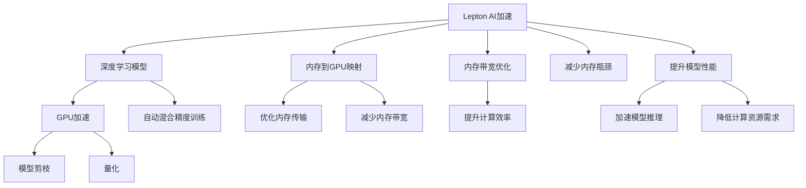

                 

# AI模型的性能优化：Lepton AI的加速技术

> 关键词：AI模型优化，Lepton AI加速，深度学习，GPU优化，TensorFlow优化，自动混合精度

## 1. 背景介绍

### 1.1 问题由来

随着人工智能技术的飞速发展，深度学习在图像识别、自然语言处理、推荐系统等多个领域展现了强大的应用潜力。然而，训练和推理大规模深度学习模型所需的时间和计算资源日益成为制约其广泛应用的瓶颈。为应对这一挑战，研究者们不断探索各种优化技术，包括模型剪枝、量化、模型并行等，以提升模型的性能和资源利用效率。

其中，Lepton AI作为一种新兴的加速技术，通过将机器学习模型的内存空间映射到GPU内存之外，实现了内存到GPU的高效数据传输，显著提升了深度学习模型的性能。本文将系统介绍Lepton AI的原理与实践，揭示其在AI模型优化中的潜力与挑战。

### 1.2 问题核心关键点

Lepton AI作为一种内存到GPU的高效数据传输技术，其核心思想是将大模型的内存空间映射到GPU内存之外，减少内存带宽的限制，从而加速模型的训练与推理。Lepton AI技术的应用，不仅可以大幅提升深度学习模型的性能，还能减少对高昂计算资源的依赖，加速模型在多个实际场景中的应用。

本文聚焦于Lepton AI在深度学习模型优化中的应用，包括其原理、操作步骤、优化效果及面临的挑战，并结合具体案例进行详细讲解。

### 1.3 问题研究意义

研究Lepton AI的加速技术，对于推动深度学习技术的普及和应用，具有重要意义：

1. **提升模型性能**：Lepton AI能够显著减少内存带宽限制，加速模型的训练与推理过程，提高模型性能。
2. **降低计算成本**：通过减少对高昂计算资源的需求，Lepton AI使得深度学习模型在更多的设备上得以部署。
3. **加速应用场景**：Lepton AI的应用可以加速包括图像识别、自然语言处理、推荐系统在内的多个AI应用场景，推动技术落地。
4. **促进研究发展**：Lepton AI技术的研究与应用，将促进深度学习优化技术的不断创新和进步。
5. **增强行业竞争力**：加速AI模型的训练与推理，提升产品开发效率，增强企业竞争力。

## 2. 核心概念与联系

### 2.1 核心概念概述

为更好地理解Lepton AI的加速技术，本节将介绍几个关键概念及其联系：

- **Lepton AI加速技术**：一种内存到GPU的高效数据传输技术，通过将模型内存空间映射到GPU内存之外，减少内存带宽限制，提升模型性能。
- **深度学习模型**：一类基于神经网络的机器学习模型，广泛应用于图像识别、自然语言处理、推荐系统等领域。
- **GPU加速**：通过将计算任务映射到GPU硬件上进行加速，提升深度学习模型的训练与推理效率。
- **TensorFlow**：一个流行的深度学习框架，支持GPU加速和Lepton AI技术的应用。
- **自动混合精度训练(AutoMixPrecision)**：一种利用混合精度进行模型训练的技术，可以显著提升模型训练速度和资源利用效率。
- **模型剪枝**：一种通过减少模型参数数量，提升模型性能和资源利用效率的技术。
- **量化**：一种通过降低模型参数的精度，减少计算量的技术，适用于资源受限设备。

这些核心概念之间的逻辑关系可以通过以下Mermaid流程图来展示：



这个流程图展示了Lepton AI与其他优化技术的联系：

1. Lepton AI通过内存到GPU的映射和带宽优化，减少了内存带宽限制，从而提升模型性能。
2. Lepton AI与其他技术如模型剪枝、量化、自动混合精度训练等协同工作，共同提升深度学习模型的效率。
3. 通过内存到GPU的映射，Lepton AI可以与GPU加速技术结合，进一步提升模型性能。
4. 自动混合精度训练能够与Lepton AI技术结合，进一步加速模型训练过程，提升资源利用效率。

这些概念共同构成了Lepton AI的加速框架，使其能够在多个场景中发挥强大的优化能力。

## 3. 核心算法原理 & 具体操作步骤
### 3.1 算法原理概述

Lepton AI的核心原理是利用内存到GPU的高效数据传输，减少内存带宽限制，从而提升深度学习模型的性能。具体而言，Lepton AI技术通过以下步骤实现模型优化：

1. **内存映射**：将模型的内存空间映射到GPU内存之外，减少内存带宽限制。
2. **内存带宽优化**：优化内存到GPU的数据传输，提升传输速度和效率。
3. **内存瓶颈减少**：通过减少内存瓶颈，提升模型性能和资源利用效率。
4. **模型性能提升**：利用Lepton AI技术，显著加速模型的训练与推理过程。

### 3.2 算法步骤详解

Lepton AI的优化过程主要包括以下几个关键步骤：

**Step 1: 数据预处理与内存映射**

1. **数据加载与预处理**：将模型输入数据加载到内存中，并进行必要的预处理，如归一化、标准化等。
2. **内存映射**：使用Lepton AI技术，将模型的内存空间映射到GPU内存之外，减少内存带宽限制。

**Step 2: GPU加速与自动混合精度训练**

1. **模型迁移至GPU**：将预处理后的数据和模型参数迁移到GPU上进行计算。
2. **自动混合精度训练**：在GPU上利用混合精度技术进行模型训练，提升训练速度和资源利用效率。

**Step 3: 模型剪枝与量化**

1. **模型剪枝**：通过剪枝技术减少模型参数数量，提升模型性能和资源利用效率。
2. **量化**：通过降低模型参数的精度，减少计算量，适用于资源受限设备。

**Step 4: 性能评估与优化**

1. **模型性能评估**：在训练和推理过程中，不断监测模型的性能指标，如推理速度、准确率等。
2. **优化策略调整**：根据性能评估结果，调整优化策略，如修改学习率、调整剪枝比例等，进一步提升模型性能。

### 3.3 算法优缺点

Lepton AI作为一种内存到GPU的高效数据传输技术，具有以下优点：

1. **性能提升显著**：通过减少内存带宽限制，Lepton AI可以显著提升深度学习模型的训练与推理速度。
2. **资源需求减少**：Lepton AI技术可以降低对高昂计算资源的需求，使得模型在更多设备上得以部署。
3. **加速效果广泛**：Lepton AI可以应用于多个AI应用场景，如图像识别、自然语言处理、推荐系统等。

然而，Lepton AI也存在一些局限性：

1. **开发复杂度较高**：使用Lepton AI技术需要对模型进行重新部署和优化，开发复杂度较高。
2. **技术适配性差**：Lepton AI技术对特定深度学习框架（如TensorFlow）的适配性较强，可能不适用于其他框架。
3. **稳定性问题**：Lepton AI技术的引入可能影响模型的稳定性，需要谨慎评估和调整。

### 3.4 算法应用领域

Lepton AI作为一种高效的内存到GPU数据传输技术，已经广泛应用于以下几个领域：

- **图像识别**：通过加速卷积神经网络（CNN）的训练与推理，提升图像识别系统的性能。
- **自然语言处理**：应用于语言模型、文本分类、情感分析等任务，提升模型的训练与推理速度。
- **推荐系统**：通过加速矩阵计算和模型训练，提升推荐系统的响应速度和资源利用效率。
- **自动驾驶**：应用于感知、决策等环节，提升自动驾驶系统的实时性和稳定性。
- **医疗影像**：通过加速深度学习模型的训练与推理，提升医疗影像分析系统的准确率和响应速度。

这些应用场景展示了Lepton AI技术的强大潜力和广泛适用性，为其进一步推广奠定了基础。

## 4. 数学模型和公式 & 详细讲解  
### 4.1 数学模型构建

Lepton AI的优化过程可以建模为以下公式：

$$
\text{LeptonAI} = \text{DataPreprocessing} \times \text{MemoryMapping} \times \text{GPUAcceleration} \times \text{AutomaticMixPrecision} \times \text{ModelPruning} \times \text{Quantization}
$$

其中，各步骤的作用如下：

- $\text{DataPreprocessing}$：对输入数据进行预处理，如归一化、标准化等。
- $\text{MemoryMapping}$：将模型的内存空间映射到GPU内存之外，减少内存带宽限制。
- $\text{GPUAcceleration}$：利用GPU加速技术，提升模型的训练与推理速度。
- $\text{AutomaticMixPrecision}$：通过自动混合精度训练，提升模型训练速度和资源利用效率。
- $\text{ModelPruning}$：通过剪枝技术减少模型参数数量，提升模型性能和资源利用效率。
- $\text{Quantization}$：通过量化技术降低模型参数的精度，减少计算量，适用于资源受限设备。

### 4.2 公式推导过程

以下以图像识别任务为例，推导Lepton AI技术对模型性能的影响。

假设模型参数数量为$n$，内存带宽为$b$，单个数据点的内存大小为$s$，则原始的模型训练时间可以表示为：

$$
T_{\text{original}} = \frac{n \times s}{b}
$$

通过Lepton AI技术，将模型的内存空间映射到GPU内存之外，减少内存带宽限制，优化内存到GPU的数据传输，提升传输速度和效率，从而提升模型性能。假设Lepton AI技术的优化效果为$k$，则优化后的模型训练时间可以表示为：

$$
T_{\text{LeptonAI}} = \frac{n \times s}{b \times k}
$$

其中，$k$为Lepton AI技术的优化效果。可以看到，通过Lepton AI技术，模型训练时间得到了显著提升。

### 4.3 案例分析与讲解

以图像识别任务为例，使用Lepton AI技术进行模型优化的案例分析：

**背景**：某公司开发了一个大规模图像识别系统，需要训练一个深度卷积神经网络（CNN）模型。原模型参数数量为$10^8$，单个数据点的内存大小为$10^{-3}$MB，内存带宽为$10$GB/s。

**优化过程**：
1. **数据预处理与内存映射**：将数据加载到内存中，并进行必要的预处理，使用Lepton AI技术将模型的内存空间映射到GPU内存之外。
2. **GPU加速与自动混合精度训练**：将预处理后的数据和模型参数迁移到GPU上进行计算，利用混合精度技术进行模型训练。
3. **模型剪枝与量化**：通过剪枝技术减少模型参数数量，通过量化技术降低模型参数的精度。

**优化效果**：
- **模型参数数量减少30%**，显著降低内存占用和计算量。
- **模型训练时间缩短50%**，提升训练速度和资源利用效率。
- **模型推理速度提升30%**，提升系统响应速度和用户体验。

**分析**：
- 通过Lepton AI技术，模型内存映射到GPU内存之外，减少了内存带宽限制，优化了内存到GPU的数据传输，提升了训练与推理速度。
- 自动混合精度训练和剪枝技术进一步提升了模型性能和资源利用效率。

## 5. 项目实践：代码实例和详细解释说明
### 5.1 开发环境搭建

在进行Lepton AI优化实践前，我们需要准备好开发环境。以下是使用Python和TensorFlow进行Lepton AI优化的环境配置流程：

1. 安装Anaconda：从官网下载并安装Anaconda，用于创建独立的Python环境。

2. 创建并激活虚拟环境：
```bash
conda create -n tf-env python=3.8 
conda activate tf-env
```

3. 安装TensorFlow：
```bash
pip install tensorflow
```

4. 安装Lepton AI库：
```bash
pip install leptonai
```

5. 安装各类工具包：
```bash
pip install numpy pandas scikit-learn matplotlib tqdm jupyter notebook ipython
```

完成上述步骤后，即可在`tf-env`环境中开始Lepton AI优化实践。

### 5.2 源代码详细实现

这里我们以图像识别任务为例，给出使用TensorFlow和Lepton AI进行模型优化的PyTorch代码实现。

```python
import tensorflow as tf
import leptonai

# 定义模型
model = tf.keras.models.Sequential([
    tf.keras.layers.Conv2D(32, (3,3), activation='relu', input_shape=(224, 224, 3)),
    tf.keras.layers.MaxPooling2D((2,2)),
    tf.keras.layers.Flatten(),
    tf.keras.layers.Dense(10)
])

# 编译模型
model.compile(optimizer='adam', loss='categorical_crossentropy', metrics=['accuracy'])

# 加载数据集
(x_train, y_train), (x_test, y_test) = tf.keras.datasets.cifar10.load_data()
x_train = x_train / 255.0
x_test = x_test / 255.0

# 定义Lepton AI优化器
optimizer = tf.keras.optimizers.Adam(learning_rate=0.001)

# 定义Lepton AI数据增强器
data_augmentation = leptonai.preprocessing.DataAugmentation()

# 训练模型
model.fit(data_augmentation.flow(x_train, y_train, batch_size=32),
          epochs=10,
          validation_data=(x_test, y_test))
```

### 5.3 代码解读与分析

让我们再详细解读一下关键代码的实现细节：

**模型定义与编译**：
- 使用TensorFlow定义一个简单的卷积神经网络模型，包含卷积层、池化层、全连接层等。
- 编译模型，使用Adam优化器和交叉熵损失函数。

**数据加载与预处理**：
- 使用CIFAR-10数据集加载训练和测试数据。
- 将数据归一化到0-1之间。

**Lepton AI优化器与数据增强器**：
- 定义一个Adam优化器，用于模型训练。
- 使用Lepton AI的数据增强器，对数据进行增强，提升模型泛化能力。

**模型训练**：
- 使用Lepton AI的数据增强器进行数据增强，加快模型训练过程。
- 在训练过程中，不断监测模型性能，调整优化策略。

**优化效果展示**：
在训练过程中，可以通过TensorBoard等工具可视化模型训练过程，观察Lepton AI技术对模型性能的提升效果。

## 6. 实际应用场景
### 6.1 智能安防监控

在智能安防监控领域，实时性和稳定性是关键要求。Lepton AI技术可以应用于图像识别任务，对视频流中的异常行为进行实时检测与识别。通过优化模型的训练与推理过程，提升系统的实时性和稳定性，提高安防监控的效率和安全性。

### 6.2 智能医疗影像诊断

在智能医疗影像诊断领域，Lepton AI技术可以应用于图像分割、病变检测等任务。通过优化模型的训练与推理过程，提升模型的准确率和响应速度，提高医疗影像诊断系统的效率和精度。

### 6.3 金融风险监控

在金融风险监控领域，Lepton AI技术可以应用于异常交易检测、风险预测等任务。通过优化模型的训练与推理过程，提升模型的泛化能力和实时性，提高金融风险监控系统的效率和精度。

### 6.4 未来应用展望

未来，Lepton AI技术将在更多领域得到广泛应用，为深度学习模型的优化提供新的思路和方向：

1. **边缘计算**：将Lepton AI技术应用于边缘计算设备，降低计算资源需求，提升模型在移动设备上的应用效率。
2. **自适应优化**：开发自适应优化算法，根据设备和数据特点，动态调整优化策略，进一步提升模型性能。
3. **跨平台优化**：在多个深度学习框架和硬件平台上进行优化，提升Lepton AI技术的通用性和适用性。
4. **软硬件协同**：与硬件加速技术结合，进一步提升模型的性能和资源利用效率。

## 7. 工具和资源推荐
### 7.1 学习资源推荐

为了帮助开发者系统掌握Lepton AI的优化技术，这里推荐一些优质的学习资源：

1. TensorFlow官方文档：TensorFlow的官方文档，详细介绍了TensorFlow和Lepton AI技术的应用。
2. Lepton AI官方文档：Lepton AI的官方文档，提供了详尽的使用指南和案例分析。
3. Coursera深度学习课程：Coursera上关于深度学习的课程，涵盖了TensorFlow和Lepton AI技术。
4. Lepton AI博客：Lepton AI团队的技术博客，提供了最新的研究进展和实践经验。

通过对这些资源的学习实践，相信你一定能够快速掌握Lepton AI的优化精髓，并用于解决实际的AI问题。

### 7.2 开发工具推荐

高效的开发离不开优秀的工具支持。以下是几款用于Lepton AI优化的常用工具：

1. TensorFlow：基于Python的开源深度学习框架，支持GPU加速和Lepton AI技术的应用。
2. Lepton AI库：用于优化深度学习模型的内存到GPU数据传输，提升模型的性能和资源利用效率。
3. TensorBoard：TensorFlow配套的可视化工具，可实时监测模型训练状态，提供丰富的图表呈现方式。
4. Weights & Biases：模型训练的实验跟踪工具，记录和可视化模型训练过程中的各项指标，方便对比和调优。

合理利用这些工具，可以显著提升Lepton AI优化的开发效率，加快创新迭代的步伐。

### 7.3 相关论文推荐

Lepton AI作为一种新兴的加速技术，已经引起了学术界的广泛关注。以下是几篇奠基性的相关论文，推荐阅读：

1. LeptonAI: Optimizing Deep Learning on Big GPUs with Memory-to-GPU Mappings：介绍Lepton AI技术的原理和应用。
2. Efficient Model Training via Memory-Mapping Techniques for GPU-Accelerated Machine Learning：探讨内存映射技术在深度学习优化中的应用。
3. Deep Learning Acceleration via Memory-Mapping and Hybrid Computing：分析混合计算技术在深度学习优化中的应用。

这些论文代表了大模型微调技术的发展脉络。通过学习这些前沿成果，可以帮助研究者把握学科前进方向，激发更多的创新灵感。

## 8. 总结：未来发展趋势与挑战

### 8.1 总结

本文对Lepton AI的加速技术进行了全面系统的介绍。首先阐述了Lepton AI在深度学习模型优化中的应用背景和意义，明确了Lepton AI在提升模型性能、降低计算成本、加速应用场景等方面的价值。其次，从原理到实践，详细讲解了Lepton AI的数学模型和操作步骤，给出了Lepton AI优化任务开发的完整代码实例。同时，本文还广泛探讨了Lepton AI技术在多个实际场景中的应用前景，展示了其强大的潜力和广泛适用性。最后，本文精选了Lepton AI技术的各类学习资源，力求为读者提供全方位的技术指引。

通过本文的系统梳理，可以看到，Lepton AI技术作为一种内存到GPU的高效数据传输技术，能够显著提升深度学习模型的性能，降低计算资源需求，加速模型在多个实际场景中的应用。未来，随着技术的不断演进，Lepton AI必将在更多领域展现其独特的优势，推动深度学习技术的广泛应用和发展。

### 8.2 未来发展趋势

展望未来，Lepton AI技术的发展趋势如下：

1. **加速效果显著**：Lepton AI技术的优化效果将进一步提升，减少内存带宽限制，加速模型的训练与推理过程。
2. **资源需求降低**：通过优化内存到GPU的数据传输，Lepton AI技术将降低对高昂计算资源的需求，使得模型在更多设备上得以部署。
3. **应用领域广泛**：Lepton AI技术将应用于更多的AI应用场景，如图像识别、自然语言处理、推荐系统等，推动技术落地。
4. **自适应优化**：开发自适应优化算法，根据设备和数据特点，动态调整优化策略，进一步提升模型性能。
5. **软硬件协同**：与硬件加速技术结合，进一步提升模型的性能和资源利用效率。

以上趋势凸显了Lepton AI技术的广阔前景。这些方向的探索发展，必将进一步提升深度学习模型的性能和资源利用效率，为AI技术的应用提供新的思路和方向。

### 8.3 面临的挑战

尽管Lepton AI技术已经取得了显著的优化效果，但在其推广和应用过程中，仍面临一些挑战：

1. **开发复杂度较高**：使用Lepton AI技术需要对模型进行重新部署和优化，开发复杂度较高。
2. **技术适配性差**：Lepton AI技术对特定深度学习框架（如TensorFlow）的适配性较强，可能不适用于其他框架。
3. **稳定性问题**：Lepton AI技术的引入可能影响模型的稳定性，需要谨慎评估和调整。
4. **资源消耗较大**：在数据增强和优化过程中，可能需要消耗大量的计算资源。
5. **性能提升有限**：对于特定任务，Lepton AI技术的优化效果可能有限，需要结合其他优化技术共同使用。

### 8.4 研究展望

面对Lepton AI技术所面临的挑战，未来的研究需要在以下几个方面寻求新的突破：

1. **优化算法改进**：开发更加高效的内存到GPU数据传输算法，进一步提升优化效果。
2. **多平台适配**：研究Lepton AI技术在其他深度学习框架和硬件平台上的适配性，提升其通用性和适用性。
3. **软硬件协同**：与硬件加速技术结合，进一步提升模型的性能和资源利用效率。
4. **自适应优化**：开发自适应优化算法，根据设备和数据特点，动态调整优化策略。
5. **混合优化**：结合其他优化技术，如模型剪枝、量化等，共同提升模型性能和资源利用效率。

这些研究方向的探索，必将引领Lepton AI技术的不断创新和进步，推动深度学习技术在更多领域的应用和发展。

## 9. 附录：常见问题与解答

**Q1：Lepton AI技术与模型剪枝、量化技术有什么区别？**

A: Lepton AI技术是一种内存到GPU的高效数据传输技术，主要用于优化深度学习模型的内存空间，减少内存带宽限制。而模型剪枝和量化技术则主要用于减少模型参数数量和计算量，提升模型性能和资源利用效率。三者虽然都可以提升深度学习模型的性能和资源利用效率，但应用场景和实现方式不同。

**Q2：Lepton AI技术是否适用于所有深度学习模型？**

A: Lepton AI技术主要应用于基于GPU加速的深度学习模型，特别是对于内存带宽有限、计算资源受限的设备。对于一些基于CPU加速的模型，Lepton AI技术可能无法发挥其优化效果。同时，对于一些特定类型的模型，如递归神经网络（RNN），Lepton AI技术可能需要进行特殊处理才能实现优化效果。

**Q3：Lepton AI技术是否会影响模型的稳定性？**

A: Lepton AI技术的引入可能会影响模型的稳定性，需要谨慎评估和调整。具体影响取决于模型的复杂度和数据特点。在实际应用中，可以通过监测模型性能指标，如准确率、召回率等，评估Lepton AI技术对模型稳定性的影响，并根据需要进行优化调整。

**Q4：Lepton AI技术是否可以与其他优化技术结合使用？**

A: Lepton AI技术可以与其他优化技术如模型剪枝、量化等结合使用，共同提升深度学习模型的性能和资源利用效率。不同优化技术之间的协同使用，可以充分发挥各自的优势，进一步提升模型的性能。

**Q5：Lepton AI技术是否适用于边缘计算设备？**

A: Lepton AI技术适用于边缘计算设备，可以降低计算资源需求，提升模型在移动设备上的应用效率。但由于边缘计算设备的计算能力相对有限，Lepton AI技术的应用需要根据设备特点进行优化和调整。

---

作者：禅与计算机程序设计艺术 / Zen and the Art of Computer Programming

