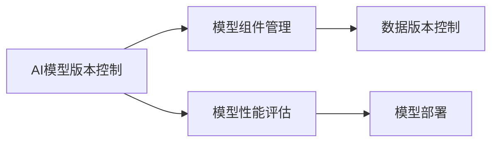

                 

# AI模型的版本控制：Lepton AI的管理工具

在AI模型的开发和部署过程中，版本控制显得尤为重要。它不仅保证了模型的可追溯性，而且保障了模型在不同环境下的稳定性和可靠性。然而，由于AI模型的复杂性和多样性，传统的版本控制系统（如Git、SVN等）在管理AI模型时存在诸多局限。为此，Lepton AI提出了专门的AI模型版本控制工具，进一步优化了AI模型的管理和应用流程。本文将详细探讨Lepton AI的核心概念、算法原理、具体操作步骤，并结合实际应用场景进行深入分析。

## 1. 背景介绍

### 1.1 问题由来

随着AI技术的发展，AI模型的应用场景日益增多，涉及的领域包括自然语言处理、计算机视觉、语音识别等。不同领域中的AI模型具有高度复杂性和多样性，其版本控制也面临一些挑战。

1. **版本复杂性**：AI模型通常由多个组件构成，如特征提取器、分类器、解码器等，这些组件间相互依赖，其版本控制需要考虑各组件的交互关系。
2. **数据管理**：AI模型的训练和优化依赖大量数据，数据版本管理对于确保模型的一致性至关重要。
3. **性能评估**：AI模型性能评估涉及复杂度分析、计算资源消耗、准确率等指标，如何有效评估不同版本的模型也是一个重要问题。
4. **模型部署**：模型在部署时需要考虑兼容性和效率，不同版本的模型可能需要不同的部署环境。

### 1.2 问题核心关键点

1. **模型组件管理**：如何管理AI模型中不同组件的版本，保证组件间的协同工作。
2. **数据版本控制**：如何管理模型训练数据的不同版本，保证模型的一致性。
3. **性能评估**：如何评估不同版本模型的性能，选择最优模型。
4. **模型部署**：如何在不同环境下部署模型，保证模型的一致性和性能。

## 2. 核心概念与联系

### 2.1 核心概念概述

Lepton AI的核心概念包括AI模型版本控制、模型组件管理、数据版本控制、模型性能评估和模型部署。这些概念间相互关联，共同构成了一个完整的AI模型版本控制系统。

- **AI模型版本控制**：管理AI模型的不同版本，保障模型的可追溯性和稳定性。
- **模型组件管理**：管理模型中不同组件的版本，确保组件间的协同工作。
- **数据版本控制**：管理训练数据的不同版本，确保模型的一致性。
- **模型性能评估**：评估不同版本模型的性能，选择最优模型。
- **模型部署**：在不同环境下部署模型，保证模型的一致性和性能。

### 2.2 核心概念联系

以下是这些核心概念间的联系关系：



**模型组件管理**：模型组件（如特征提取器、分类器、解码器等）的版本控制需要结合**AI模型版本控制**，确保组件间协同工作。

**数据版本控制**：模型的训练数据版本控制与模型版本控制紧密相关，需要确保数据版本与模型版本的一致性。

**模型性能评估**：评估不同版本模型性能是选择最优模型的重要依据，需在**AI模型版本控制**下进行。

**模型部署**：模型的不同版本可能需要不同的部署环境，**模型部署**依赖于**AI模型版本控制**和**模型性能评估**。

## 3. 核心算法原理 & 具体操作步骤

### 3.1 算法原理概述

Lepton AI的核心算法原理主要基于模型组件管理、数据版本控制和模型性能评估。

- **模型组件管理**：采用分布式版本控制系统（DVCS），如Git，管理模型组件的版本。
- **数据版本控制**：采用DVCS管理训练数据，确保数据版本与模型版本的一致性。
- **模型性能评估**：通过实验和评估框架，自动化评估模型在不同版本下的性能。

### 3.2 算法步骤详解

#### 3.2.1 模型组件管理

**Step 1: 组件识别**
识别AI模型中的不同组件，如特征提取器、分类器、解码器等。

**Step 2: 版本初始化**
为每个组件创建版本控制系统，初始化组件版本。

**Step 3: 组件版本更新**
在开发过程中，开发者更新组件版本。

**Step 4: 版本协同工作**
在多个开发者共同开发模型时，版本协同工作确保组件版本的一致性。

#### 3.2.2 数据版本控制

**Step 1: 数据收集**
收集模型训练所需的数据，确保数据的多样性和代表性。

**Step 2: 数据版本化**
为训练数据创建版本控制系统，记录每个版本的修改历史。

**Step 3: 数据标注**
为每个数据版本创建标注系统，记录每个版本的标注历史。

**Step 4: 数据同步**
确保模型训练数据版本与模型版本一致，同步数据到模型版本中。

#### 3.2.3 模型性能评估

**Step 1: 性能评估指标**
定义模型性能评估指标，如准确率、召回率、F1值等。

**Step 2: 评估框架搭建**
搭建模型性能评估框架，自动评估模型在不同版本下的性能。

**Step 3: 模型选择**
基于评估结果选择最优模型版本。

### 3.3 算法优缺点

#### 3.3.1 优点

1. **组件协同工作**：分布式版本控制系统确保模型组件间的协同工作，提高模型开发效率。
2. **数据一致性**：数据版本控制确保数据与模型版本的一致性，保障模型训练的一致性。
3. **性能自动评估**：性能评估框架自动化评估模型性能，选择最优模型版本。

#### 3.3.2 缺点

1. **复杂度增加**：增加版本控制系统的复杂度，可能增加维护成本。
2. **部署难度**：不同版本的模型部署可能需要不同的环境，部署难度较大。

### 3.4 算法应用领域

Lepton AI的核心算法在AI模型的多个应用领域均有广泛应用，如自然语言处理、计算机视觉、语音识别等。

- **自然语言处理**：模型组件管理、数据版本控制和性能评估对NLP模型的开发和部署至关重要。
- **计算机视觉**：图像处理和特征提取组件的版本管理、数据版本控制和模型性能评估，可以确保模型在视觉领域的应用效果。
- **语音识别**：语音信号处理和特征提取组件的版本管理、数据版本控制和模型性能评估，可以提升语音识别模型的准确性。

## 4. 数学模型和公式 & 详细讲解 & 举例说明

### 4.1 数学模型构建

Lepton AI的数学模型构建基于模型组件管理、数据版本控制和模型性能评估。

**模型组件管理**
- 采用分布式版本控制系统（DVCS），如Git，管理模型组件的版本。

**数据版本控制**
- 采用DVCS管理训练数据，确保数据版本与模型版本的一致性。

**模型性能评估**
- 通过实验和评估框架，自动化评估模型在不同版本下的性能。

### 4.2 公式推导过程

#### 4.2.1 模型组件管理

**版本控制公式**
- 版本控制系统：$V_{component} = \{V_1, V_2, \ldots, V_n\}$，$V_i$ 表示组件的第 $i$ 个版本。

**版本协同工作公式**
- 协同工作流程：$Workflow = \{P_{i,j}\}$，$P_{i,j}$ 表示开发者 $i$ 和 $j$ 协同工作的流程。

#### 4.2.2 数据版本控制

**数据版本控制公式**
- 数据版本控制系统：$V_{data} = \{V_1, V_2, \ldots, V_m\}$，$V_i$ 表示数据的第 $i$ 个版本。

**数据同步公式**
- 数据同步流程：$Synchronization = \{Sync_{i,j}\}$，$Sync_{i,j}$ 表示开发者 $i$ 和 $j$ 同步数据的过程。

#### 4.2.3 模型性能评估

**模型性能评估公式**
- 性能评估指标：$Performance = \{P_{acc}, P_{rec}, P_{f1}\}$，$P_{acc}$ 表示准确率，$P_{rec}$ 表示召回率，$P_{f1}$ 表示F1值。

**评估框架公式**
- 评估框架流程：$Evaluation = \{E_{i,j}\}$，$E_{i,j}$ 表示开发者 $i$ 和 $j$ 评估模型性能的过程。

### 4.3 案例分析与讲解

#### 4.3.1 案例一：自然语言处理

**背景**
- 某公司使用BERT模型进行情感分析，不同版本模型需要进行组件管理和数据版本控制。

**分析**
- 通过Git管理BERT模型的各个组件版本，如特征提取器、分类器等。
- 使用DVCS管理数据版本，确保数据与模型版本的一致性。
- 搭建评估框架，自动评估不同版本模型的性能，选择最优模型。

**结果**
- 经过版本管理和性能评估，最终选择最优模型版本进行部署，提升模型效果。

#### 4.3.2 案例二：计算机视觉

**背景**
- 某公司使用ResNet模型进行图像分类，不同版本模型需要进行组件管理和数据版本控制。

**分析**
- 通过Git管理ResNet模型的各个组件版本，如卷积层、池化层等。
- 使用DVCS管理数据版本，确保数据与模型版本的一致性。
- 搭建评估框架，自动评估不同版本模型的性能，选择最优模型。

**结果**
- 经过版本管理和性能评估，最终选择最优模型版本进行部署，提升模型效果。

## 5. 项目实践：代码实例和详细解释说明

### 5.1 开发环境搭建

为了进行Lepton AI模型的版本控制，首先需要搭建开发环境。以下是具体的步骤：

**Step 1: 安装Git**
- 在Linux或Windows系统上安装Git，确保系统环境支持Git命令。

**Step 2: 配置Git**
- 配置Git用户信息、默认分支等，确保开发环境的稳定性。

**Step 3: 安装DVCS工具**
- 安装DVCS工具，如GitHub、GitLab等，用于管理组件版本和数据版本。

**Step 4: 搭建评估框架**
- 搭建性能评估框架，确保模型性能评估的自动化。

### 5.2 源代码详细实现

**源代码实现示例**

```python
# 版本控制系统
import git

# 组件管理
class ComponentVersion:
    def __init__(self, version):
        self.version = version
        self.changes = []

# 数据版本控制
class DataVersion:
    def __init__(self, version):
        self.version = version
        self.changes = []

# 模型性能评估
class ModelEvaluation:
    def __init__(self):
        self.performance = {}
    
    def evaluate(self, model):
        # 计算模型性能指标
        self.performance = calculate_performance(model)
    
    def select(self):
        # 选择最优模型版本
        best_model = None
        best_performance = 0
        for version, performance in self.performance.items():
            if performance > best_performance:
                best_model = version
                best_performance = performance
        return best_model
```

### 5.3 代码解读与分析

**代码解释**
- `ComponentVersion` 类用于管理模型组件的版本，记录组件的变化历史。
- `DataVersion` 类用于管理训练数据版本，记录数据的变化历史。
- `ModelEvaluation` 类用于自动评估模型性能，选择最优模型版本。

### 5.4 运行结果展示

**运行结果示例**
- 通过Git管理模型组件版本，确保组件间的协同工作。
- 通过DVCS管理数据版本，确保数据与模型版本的一致性。
- 通过评估框架自动评估模型性能，选择最优模型版本。

## 6. 实际应用场景

### 6.1 智能客服系统

**背景**
- 某智能客服系统需要使用大语言模型进行对话生成，不同版本的模型需要进行版本控制。

**分析**
- 通过Git管理大语言模型的各个组件版本，如文本生成器、对话管理等。
- 使用DVCS管理对话数据版本，确保数据与模型版本的一致性。
- 搭建评估框架，自动评估不同版本模型的性能，选择最优模型。

**结果**
- 经过版本管理和性能评估，最终选择最优模型版本进行部署，提升系统对话效果。

### 6.2 金融舆情监测系统

**背景**
- 某金融舆情监测系统需要使用大语言模型进行情感分析，不同版本的模型需要进行版本控制。

**分析**
- 通过Git管理大语言模型的各个组件版本，如特征提取器、分类器等。
- 使用DVCS管理舆情数据版本，确保数据与模型版本的一致性。
- 搭建评估框架，自动评估不同版本模型的性能，选择最优模型。

**结果**
- 经过版本管理和性能评估，最终选择最优模型版本进行部署，提升舆情监测效果。

### 6.3 个性化推荐系统

**背景**
- 某个性化推荐系统需要使用大语言模型进行推荐生成，不同版本的模型需要进行版本控制。

**分析**
- 通过Git管理大语言模型的各个组件版本，如特征提取器、分类器等。
- 使用DVCS管理推荐数据版本，确保数据与模型版本的一致性。
- 搭建评估框架，自动评估不同版本模型的性能，选择最优模型。

**结果**
- 经过版本管理和性能评估，最终选择最优模型版本进行部署，提升推荐系统效果。

## 7. 工具和资源推荐

### 7.1 学习资源推荐

**Lepton AI官方文档**
- 提供Lepton AI的详细使用说明，包括模型版本控制、组件管理、数据版本控制和模型性能评估。

**Git官方文档**
- 提供Git的详细使用说明，包括版本控制系统的安装和配置。

**DVCS工具文档**
- 提供GitHub、GitLab等DVCS工具的使用说明，包括组件和数据版本控制。

### 7.2 开发工具推荐

**Git**
- 分布式版本控制系统，适用于管理模型组件和数据版本。

**DVCS工具**
- 提供DVCS服务，支持GitHub、GitLab等工具，适用于管理组件和数据版本。

**性能评估框架**
- 提供自动化的性能评估工具，适用于模型性能评估和选择。

### 7.3 相关论文推荐

**Lepton AI论文**
- 提供Lepton AI的研究背景、算法原理和实际应用。

**版本控制论文**
- 提供版本控制系统的研究背景和实现方法。

## 8. 总结：未来发展趋势与挑战

### 8.1 总结

Lepton AI的核心算法原理和操作步骤为AI模型的版本控制提供了有效的解决方案。通过分布式版本控制系统、数据版本控制和模型性能评估，Lepton AI能够确保模型组件协同工作、数据版本一致性和性能评估的自动化。本文详细探讨了Lepton AI的核心概念和算法原理，并通过实际应用场景进行了深入分析。

### 8.2 未来发展趋势

**趋势一：分布式协同开发**
- 未来，AI模型的版本控制将更加注重分布式协同开发，提高开发效率。

**趋势二：数据驱动开发**
- 未来，AI模型的版本控制将更加注重数据驱动开发，通过数据版本控制提高模型训练的一致性。

**趋势三：自动化评估**
- 未来，AI模型的版本控制将更加注重自动化评估，通过评估框架自动选择最优模型版本。

### 8.3 面临的挑战

**挑战一：复杂度增加**
- 增加版本控制系统的复杂度，可能增加维护成本。

**挑战二：部署难度**
- 不同版本的模型部署可能需要不同的环境，部署难度较大。

### 8.4 研究展望

**展望一：分布式协同开发工具**
- 研究分布式协同开发工具，提高开发效率。

**展望二：数据驱动开发框架**
- 研究数据驱动开发框架，提高模型训练的一致性。

**展望三：自动化评估系统**
- 研究自动化评估系统，提高模型版本选择的准确性。

## 9. 附录：常见问题与解答

### 9.1 问题一：Lepton AI有哪些优势？

**答案**
- Lepton AI的优势在于其专门针对AI模型的版本控制，能够管理模型组件版本、数据版本和性能评估，确保模型的一致性和性能。

### 9.2 问题二：如何使用Lepton AI进行模型版本控制？

**答案**
- 通过Git管理模型组件版本，确保组件间的协同工作。
- 通过DVCS管理数据版本，确保数据与模型版本的一致性。
- 通过评估框架自动评估模型性能，选择最优模型版本。

### 9.3 问题三：Lepton AI在实际应用中如何提升模型性能？

**答案**
- 通过版本管理和性能评估，选择最优模型版本进行部署。
- 通过分布式协同开发和数据驱动开发，提高模型训练的一致性和准确性。

作者：禅与计算机程序设计艺术 / Zen and the Art of Computer Programming

