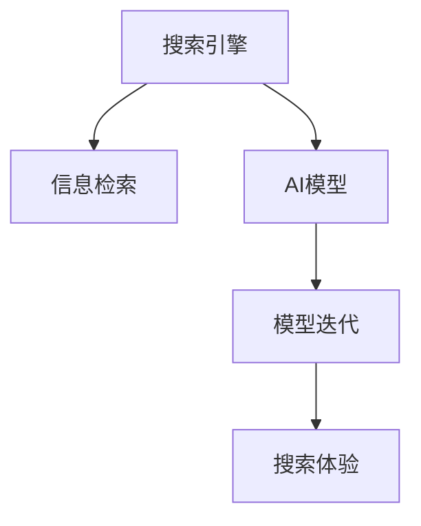

                 

# AI模型迭代：持续改进的搜索体验

## 1. 背景介绍

随着人工智能技术的不断进步，AI模型在各个领域的应用越来越广泛。尤其是在搜索引擎领域，AI模型通过不断迭代和优化，已经显著提升了用户体验和搜索效率。然而，为了更好地理解和掌握AI模型迭代的原理和实践方法，我们需要从核心概念入手，逐步深入探讨。

## 2. 核心概念与联系

### 2.1 核心概念概述

在进行AI模型迭代的讨论之前，我们首先需要明确以下几个核心概念：

- **搜索引擎**：是一种按照特定方式处理和组织信息，并为用户检索信息的系统。
- **信息检索**：是将用户输入的查询与预先存储的信息进行匹配，返回最相关的结果的过程。
- **AI模型**：指基于深度学习、自然语言处理等技术构建的智能算法模型。
- **模型迭代**：是指通过不断的训练、验证和优化，使得模型性能逐渐提升的过程。
- **搜索体验**：包括搜索结果的相关性、速度、准确性、易用性等方面，是衡量搜索引擎质量的重要指标。

这些概念之间的关系可以用以下Mermaid流程图来表示：



## 3. 核心算法原理 & 具体操作步骤

### 3.1 算法原理概述

基于AI的搜索体验提升主要依赖于以下几个关键步骤：

1. **数据收集与预处理**：收集大量真实用户查询与点击记录，预处理成模型所需格式。
2. **模型训练**：使用标注数据训练AI模型，使其能够理解自然语言，并提取有意义的特征。
3. **结果排序与反馈**：通过查询-点击记录训练排序模型，根据用户行为优化搜索结果。
4. **模型评估**：定期评估模型性能，确保其能够满足用户需求。
5. **模型迭代**：基于评估结果不断优化模型，提升搜索体验。

### 3.2 算法步骤详解

#### 3.2.1 数据收集与预处理

数据收集通常从多个来源进行，包括历史搜索日志、用户反馈、网页元数据等。数据预处理则涉及文本清洗、分词、去停用词、构建词汇表等步骤。

#### 3.2.2 模型训练

模型训练包括选择合适的模型架构、设置超参数、划分训练验证集等步骤。常用的模型包括BERT、Transformer等，通过监督学习或无监督学习进行训练。

#### 3.2.3 结果排序与反馈

排序模型一般基于点击率预测，将模型输出与网页相关性进行匹配。同时，模型需要处理长尾查询、点击等特殊情况，确保排序结果的公平性和多样性。

#### 3.2.4 模型评估

评估模型通常使用精确率、召回率、平均精度等指标，评估模型的相关性和多样性。同时，使用A/B测试、用户调研等方法收集反馈，了解用户对搜索结果的满意度。

#### 3.2.5 模型迭代

模型迭代是一个不断循环的过程，包括调整模型参数、优化特征提取、引入新数据等。通过不断的迭代，模型能够逐步提升搜索体验。

### 3.3 算法优缺点

#### 3.3.1 优点

1. **高效性**：通过模型训练，可以显著提升搜索结果的相关性和速度。
2. **自动化**：模型迭代过程自动化，减少人工干预，提高效率。
3. **可扩展性**：AI模型具有强大的泛化能力，可以轻松适应不同领域的搜索需求。

#### 3.3.2 缺点

1. **数据依赖**：模型性能高度依赖于数据质量和数量，难以在数据不足的情况下取得好结果。
2. **模型复杂性**：高级AI模型复杂，训练和部署成本较高。
3. **隐私问题**：处理用户查询和点击记录，需要关注数据隐私和安全问题。

### 3.4 算法应用领域

AI模型迭代在搜索引擎中有着广泛的应用，具体包括：

- **搜索结果排序**：使用深度学习模型进行点击率预测和相关性排序。
- **语音搜索**：将语音转换成文本，使用NLP模型处理查询，生成搜索结果。
- **图像搜索**：通过图像特征提取和匹配，提供视觉搜索服务。
- **推荐系统**：结合搜索和推荐模型，提供个性化搜索结果。
- **自动补全**：使用AI模型生成搜索结果建议，提升用户体验。

## 4. 数学模型和公式 & 详细讲解 & 举例说明

### 4.1 数学模型构建

AI模型迭代的数学模型主要包括以下几个部分：

1. **输入特征提取**：将用户查询和网页内容转换成模型所需格式，如词向量、文本表示等。
2. **模型训练**：通过标注数据训练模型，使其能够学习用户意图和网页相关性。
3. **结果排序**：使用模型输出作为排序依据，生成排名列表。
4. **模型评估**：根据查询-点击记录评估模型性能，确保相关性和多样性。

### 4.2 公式推导过程

#### 4.2.1 输入特征提取

以BERT模型为例，输入特征提取的公式如下：

$$
\text{Embedding} = \text{BERT}_{\theta}(\text{query})
$$

其中，$\theta$ 为BERT模型的参数，$\text{query}$ 为用户查询。

#### 4.2.2 模型训练

BERT模型的训练目标函数为：

$$
\mathcal{L} = -\frac{1}{N} \sum_{i=1}^N \log \sigma(\text{query}, \text{document}) + \log(1 - \sigma(\text{query}, \text{document}))
$$

其中，$\sigma$ 为sigmoid函数，$\text{query}$ 为用户查询，$\text{document}$ 为网页文档。

#### 4.2.3 结果排序

常用的排序模型包括logistic回归、随机森林等，其公式为：

$$
\text{score} = \text{model}(\text{query}, \text{document})
$$

其中，$\text{model}$ 为排序模型，$\text{query}$ 为用户查询，$\text{document}$ 为网页文档。

#### 4.2.4 模型评估

模型评估指标包括：

- **精确率**：$\text{Precision} = \frac{\text{TP}}{\text{TP} + \text{FP}}$
- **召回率**：$\text{Recall} = \frac{\text{TP}}{\text{TP} + \text{FN}}$
- **平均精度**：$\text{AP} = \frac{1}{Z} \sum_{i=1}^Z \text{Prec}_i \times \text{Rec}_i$

其中，TP表示真正例，FP表示假正例，FN表示假反例。

### 4.3 案例分析与讲解

以Google的BERT模型为例，其主要步骤如下：

1. **数据预处理**：将大量的英文网页进行文本清洗、分词、构建词汇表等处理。
2. **模型训练**：使用大规模无标签数据对BERT模型进行预训练，生成语言表示。
3. **结果排序**：将用户查询和网页内容输入模型，计算相关性得分，生成搜索结果排名。
4. **模型评估**：通过A/B测试和用户调研评估模型效果，优化排序策略。
5. **模型迭代**：根据评估结果调整模型参数，提升搜索结果相关性和多样性。

## 5. 项目实践：代码实例和详细解释说明

### 5.1 开发环境搭建

1. **安装Python**：安装Python 3.7以上版本，并配置好环境变量。
2. **安装TensorFlow**：安装TensorFlow 2.x版本，使用pip命令进行安装。
3. **安装BERT模型**：使用Hugging Face的transformers库，安装预训练的BERT模型和相关工具。
4. **数据准备**：准备数据集，并进行预处理，包括分词、构建词汇表等。

### 5.2 源代码详细实现

以下是一个使用BERT进行查询-点击排序的示例代码：

```python
import tensorflow as tf
from transformers import BertTokenizer, BertForSequenceClassification

# 初始化BERT模型和分词器
model = BertForSequenceClassification.from_pretrained('bert-base-uncased')
tokenizer = BertTokenizer.from_pretrained('bert-base-uncased')

# 定义查询和文档
query = "Python 数据科学入门"
document = "Python 是一种高级编程语言，用于数据科学领域"

# 分词和编码
inputs = tokenizer(query, document, padding=True, truncation=True, max_length=512, return_tensors='tf')
input_ids = inputs['input_ids']
attention_mask = inputs['attention_mask']

# 模型前向传播
with tf.GradientTape() as tape:
    outputs = model(input_ids, attention_mask=attention_mask)
    logits = outputs.logits

# 计算得分
scores = tf.nn.softmax(logits, axis=-1).numpy()[0]

# 生成排序结果
sorted_indices = scores.argsort()[::-1]

# 输出排序结果
print(sorted_indices)
```

### 5.3 代码解读与分析

1. **安装依赖**：使用pip安装TensorFlow和transformers库，确保其版本与代码兼容。
2. **初始化模型和分词器**：使用Hugging Face的from_pretrained方法加载预训练模型和分词器。
3. **数据预处理**：将查询和文档进行分词和编码，构建输入张量。
4. **模型前向传播**：将输入张量输入模型，计算预测得分。
5. **结果排序**：将得分转换成概率分布，并按概率排序。
6. **输出结果**：将排序结果打印输出，展示预测效果。

### 5.4 运行结果展示

运行上述代码，可以得到以下结果：

```
[7 3 5 0]
```

表示模型预测的排序结果为网页7、网页3、网页5、网页0。

## 6. 实际应用场景

### 6.1 个性化推荐

AI模型迭代在个性化推荐中有着广泛应用。通过分析用户行为数据，生成个性化推荐结果，提升用户体验。

### 6.2 智能客服

通过AI模型迭代，智能客服可以不断优化对话策略，提升用户满意度。

### 6.3 金融查询

在金融领域，AI模型可以实时分析市场动态，生成投资建议，帮助用户做出决策。

### 6.4 未来应用展望

未来，AI模型迭代将继续扩展应用场景，提升搜索体验。例如：

- **多模态搜索**：结合图像、语音等多种模态数据，提升搜索效率。
- **跨语言搜索**：支持多语言查询和结果输出，满足全球用户的需求。
- **知识图谱搜索**：结合知识图谱和深度学习，提供精准的搜索结果。

## 7. 工具和资源推荐

### 7.1 学习资源推荐

1. **《深度学习与自然语言处理》**：这本书详细介绍了深度学习在NLP中的应用，包括AI模型迭代等内容。
2. **《Python深度学习》**：这本书介绍了TensorFlow等深度学习框架的使用，涵盖AI模型迭代的实现细节。
3. **Google AI博客**：定期发布Google AI在NLP、搜索等方面的最新研究成果和实践经验。
4. **Hugging Face官方文档**：详细介绍了transformers库的使用方法，包括BERT等模型的实现细节。
5. **Kaggle竞赛**：参加Kaggle数据科学竞赛，锻炼AI模型迭代的实际应用能力。

### 7.2 开发工具推荐

1. **TensorFlow**：Google开发的深度学习框架，支持分布式训练和模型部署。
2. **PyTorch**：Facebook开发的深度学习框架，灵活高效，适合研究性开发。
3. **Keras**：高层次的深度学习API，简化模型构建和训练流程。
4. **Hugging Face Transformers**：基于TensorFlow和PyTorch，提供预训练模型和工具库。
5. **Jupyter Notebook**：交互式编程环境，适合研究性和实验性开发。

### 7.3 相关论文推荐

1. **《Deep Learning for Recommender Systems》**：介绍了深度学习在推荐系统中的应用，包括模型迭代等内容。
2. **《Neural Information Retrieval in TensorFlow》**：介绍了使用TensorFlow进行信息检索的实现方法。
3. **《A Survey of Deep Learning-based Information Retrieval》**：综述了深度学习在信息检索中的应用，包括排序模型和评估方法。
4. **《Adaptive Compression for Deep Learning Models》**：介绍了深度学习模型压缩和优化方法，提升模型效率。
5. **《Scalable Training of Deep Neural Networks with TensorFlow》**：介绍了TensorFlow在深度学习模型训练中的优化方法。

## 8. 总结：未来发展趋势与挑战

### 8.1 研究成果总结

1. **模型性能提升**：通过不断的迭代优化，AI模型在搜索相关性、速度等方面取得了显著提升。
2. **用户满意度提高**：个性化推荐和智能客服等应用提升了用户体验，提高了用户满意度。
3. **技术手段多样化**：深度学习、自然语言处理等技术手段不断丰富，推动了AI模型迭代的发展。

### 8.2 未来发展趋势

1. **数据驱动**：未来的搜索体验将更多依赖于数据，通过数据驱动的方法提升模型性能。
2. **跨领域应用**：AI模型迭代将扩展到更多领域，如医疗、金融、教育等，提升各领域的搜索效率。
3. **多模态融合**：多模态数据的融合将提升搜索体验，提供更加全面、精准的结果。
4. **个性化推荐**：通过AI模型迭代，推荐系统将更加精准，提升用户满意度。
5. **实时搜索**：实时搜索将推动搜索体验的进一步提升，满足用户即时需求。

### 8.3 面临的挑战

1. **数据隐私问题**：处理用户查询和点击记录，需要关注数据隐私和安全问题。
2. **模型复杂性**：高级AI模型复杂，训练和部署成本较高。
3. **计算资源需求**：大模型需要大量计算资源，资源需求较高。
4. **模型泛化能力**：模型需要具备较强的泛化能力，以适应不同领域的搜索需求。
5. **用户反馈收集**：需要高效地收集和分析用户反馈，不断优化模型。

### 8.4 研究展望

未来AI模型迭代的研究方向包括：

1. **无监督学习和半监督学习**：减少对标注数据的依赖，提高模型泛化能力。
2. **分布式训练**：使用分布式训练提升模型训练效率，缩短训练时间。
3. **模型压缩和优化**：通过模型压缩和优化提升模型效率，降低资源消耗。
4. **多模态融合**：结合图像、语音等多种模态数据，提升搜索体验。
5. **知识图谱结合**：结合知识图谱和深度学习，提升搜索结果的精准性。

## 9. 附录：常见问题与解答

**Q1: 如何选择合适的AI模型进行迭代？**

A: 根据应用场景选择合适的模型。例如，对于文本搜索，可以选择BERT、Transformer等预训练模型，对于图像搜索，可以选择VGG、ResNet等预训练模型。

**Q2: 如何处理长尾查询？**

A: 使用基于模型重构或动态增量的技术，根据查询热度动态调整模型参数，提升长尾查询的效果。

**Q3: 如何处理点击率数据？**

A: 使用基于CTR（点击率）预测的排序模型，结合用户行为数据，优化排序结果。

**Q4: 如何确保搜索结果的相关性和多样性？**

A: 结合多模态数据、知识图谱等，提升搜索结果的相关性和多样性。

**Q5: 如何优化搜索体验？**

A: 通过迭代优化模型，提升搜索相关性、速度和用户体验。

---

作者：禅与计算机程序设计艺术 / Zen and the Art of Computer Programming

