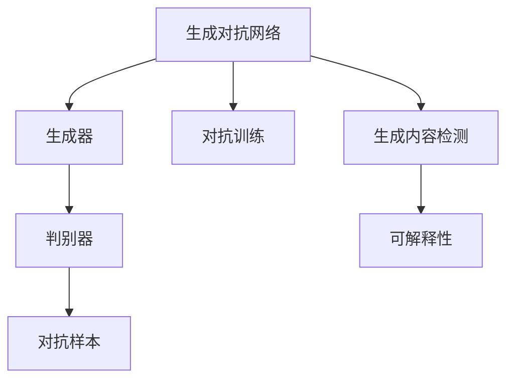

                 

# AI生成内容的真实性验证

## 1. 背景介绍

在信息爆炸的今天，生成对抗网络（GANs）和深度学习模型在文本生成、图像生成等领域取得了显著进步。然而，随着这些技术的应用，如何验证生成内容的真实性成为一个重要问题。虚假信息、假新闻、恶意生成内容的泛滥不仅侵蚀了公众信任，也对社会稳定构成了威胁。因此，AI生成内容的真实性验证已成为当前科技领域的重要课题。

本文将全面介绍AI生成内容真实性验证的核心概念、算法原理、操作步骤、数学模型、实践案例以及实际应用场景。同时，我们还将探讨该技术在未来发展的趋势与面临的挑战，为开发者和研究人员提供实用的技术指引。

## 2. 核心概念与联系

### 2.1 核心概念概述

为了更好地理解AI生成内容真实性验证，本节将介绍几个关键概念及其相互联系：

- **生成对抗网络（GANs）**：由生成器和判别器组成的深度学习模型，通过对抗训练学习生成逼真的数据。
- **判别器（Discriminator）**：用于区分真实数据和生成数据的模型，一般采用卷积神经网络（CNN）等深度学习模型。
- **生成器（Generator）**：用于生成数据的模型，通常采用递归神经网络（RNN）或变分自编码器（VAE）等深度学习模型。
- **对抗样本（Adversarial Examples）**：使判别器误判的真实或生成样本，用于攻击和测试模型的鲁棒性。
- **对抗训练（Adversarial Training）**：通过引入对抗样本训练判别器，增强模型的鲁棒性。
- **生成内容检测（Content Generation Detection）**：通过分析生成内容与真实内容之间的差异，识别生成内容的技术。
- **可解释性（Explainability）**：使模型输出和决策过程可解释，便于理解和调试。

这些核心概念之间的逻辑关系可以通过以下Mermaid流程图来展示：



这个流程图展示了大语言模型的核心概念及其之间的关系：

1. 生成对抗网络通过对抗训练学习生成数据。
2. 生成器是生成对抗网络的关键组件，用于生成数据。
3. 判别器用于区分真实数据和生成数据。
4. 对抗样本用于测试和攻击模型的鲁棒性。
5. 生成内容检测用于识别生成内容。
6. 可解释性使模型的输出和决策过程可解释。

这些概念共同构成了AI生成内容真实性验证的技术框架，使得模型能够有效地识别和验证生成内容的真实性。

## 3. 核心算法原理 & 具体操作步骤

### 3.1 算法原理概述

AI生成内容真实性验证的核心算法原理包括生成对抗网络（GANs）、判别器训练、对抗样本生成、生成内容检测和可解释性技术等。其目标是通过对抗训练学习生成和判别模型，通过对抗样本测试模型的鲁棒性，并通过生成内容检测和可解释性技术识别和验证生成内容。

### 3.2 算法步骤详解

AI生成内容真实性验证的一般步骤包括以下几个关键环节：

**Step 1: 数据收集与准备**
- 收集大量的真实数据和生成数据作为训练集。
- 对真实数据进行清洗和标注，如分类、实体识别等。
- 对生成数据进行标记，如标识为“生成”。

**Step 2: 生成器和判别器训练**
- 定义生成器和判别器的架构，如卷积神经网络（CNN）或循环神经网络（RNN）。
- 设置训练参数，如学习率、批大小、迭代次数等。
- 使用对抗训练方法，通过生成器和判别器的对抗过程，不断优化模型。

**Step 3: 对抗样本生成**
- 在训练过程中，生成对抗样本，用于测试模型的鲁棒性。
- 评估判别器对对抗样本的识别能力，调整生成器和判别器的参数。
- 根据模型对对抗样本的反应，优化生成器的生成策略。

**Step 4: 生成内容检测**
- 使用训练好的判别器，对新数据进行真实性检测。
- 计算检测结果的准确率、召回率等指标，评估模型的性能。
- 根据检测结果，调整判别器的参数和生成策略。

**Step 5: 可解释性技术**
- 使用可解释性技术，如LIME、SHAP等，分析判别器的决策过程。
- 通过可视化工具，展示判别器对不同类型生成内容的识别效果。
- 根据可解释性分析，优化生成器和判别器的参数。

### 3.3 算法优缺点

AI生成内容真实性验证具有以下优点：
1. 高效准确。通过对抗训练和生成内容检测，能够高效准确地识别生成内容。
2. 可解释性强。使用可解释性技术，使模型的决策过程可解释，便于理解和调试。
3. 鲁棒性好。通过对抗训练和对抗样本测试，模型对对抗攻击具有较好的鲁棒性。

同时，该算法也存在一定的局限性：
1. 数据依赖性强。需要大量的真实和生成数据进行训练，数据获取和标注成本较高。
2. 计算资源消耗大。生成对抗网络训练需要大量的计算资源，特别是GPU和TPU等高性能设备。
3. 对抗样本对抗性强。生成的对抗样本可能会比真实数据更难识别，需要更复杂的对抗训练策略。
4. 模型泛化能力有限。判别器在特定数据集上表现较好，但泛化到其他数据集时可能性能下降。

尽管存在这些局限性，但AI生成内容真实性验证技术已经成为生成对抗网络、深度学习等领域的重要研究方向，具有广阔的应用前景。

### 3.4 算法应用领域

AI生成内容真实性验证技术已经在多个领域得到应用，以下是几个典型场景：

- **网络安全**：检测和过滤恶意生成内容，如钓鱼邮件、虚假新闻等。
- **媒体出版**：识别和过滤假新闻、假报道等，保护公众利益。
- **金融风控**：检测和防止欺诈生成内容，保护金融稳定。
- **广告审核**：识别和过滤虚假广告内容，维护市场秩序。
- **娱乐产业**：检测和识别假视频、假图像等，保护版权和创意。

## 4. 数学模型和公式 & 详细讲解 & 举例说明

### 4.1 数学模型构建

AI生成内容真实性验证的数学模型构建主要涉及生成对抗网络（GANs）和判别器（Discriminator）的训练。以GANs为例，其数学模型可以表示为：

$$
\min_G \max_D V(D,G) = E_{x \sim p_{\text{data}}} [\log D(x)] + E_{z \sim p_z} [\log(1 - D(G(z)))]
$$

其中，$G$表示生成器，$D$表示判别器，$V(D,G)$表示生成器和判别器的对抗损失，$x$表示真实数据，$z$表示噪声向量，$p_{\text{data}}$表示真实数据的分布，$p_z$表示噪声向量的分布。

### 4.2 公式推导过程

生成器和判别器的对抗训练过程，可以表示为：

$$
\min_G \max_D \mathcal{L}(D,G) = \mathbb{E}_{x \sim p_{\text{data}}} [\log D(x)] + \mathbb{E}_{z \sim p_z} [\log(1 - D(G(z)))]
$$

其中，$\mathcal{L}(D,G)$表示生成器和判别器的联合损失。判别器的目标是最大化损失函数，生成器的目标是最大化判别器对生成数据的误判概率。

### 4.3 案例分析与讲解

假设我们有一个文本生成模型，使用GANs框架进行训练。我们通过以下步骤验证生成内容的真实性：

1. **数据收集**：收集大量的真实文本数据和生成文本数据，进行标注。
2. **模型训练**：定义生成器和判别器的架构，使用对抗训练方法训练模型。
3. **对抗样本生成**：在训练过程中，生成对抗样本，用于测试模型的鲁棒性。
4. **生成内容检测**：使用训练好的判别器，对新文本进行真实性检测。
5. **可解释性分析**：使用可解释性技术，如LIME、SHAP等，分析判别器的决策过程。

通过这些步骤，我们可以高效准确地识别生成内容，并使模型的决策过程可解释。

## 5. 项目实践：代码实例和详细解释说明

### 5.1 开发环境搭建

在进行AI生成内容真实性验证实践前，我们需要准备好开发环境。以下是使用Python进行TensorFlow开发的环境配置流程：

1. 安装Anaconda：从官网下载并安装Anaconda，用于创建独立的Python环境。
2. 创建并激活虚拟环境：
```bash
conda create -n tf-env python=3.7 
conda activate tf-env
```

3. 安装TensorFlow：根据CUDA版本，从官网获取对应的安装命令。例如：
```bash
conda install tensorflow -c pytorch -c conda-forge
```

4. 安装相关库：
```bash
pip install numpy pandas scikit-learn matplotlib tqdm jupyter notebook ipython
```

完成上述步骤后，即可在`tf-env`环境中开始项目实践。

### 5.2 源代码详细实现

这里我们以文本生成内容检测为例，给出使用TensorFlow进行GANs训练和生成内容检测的PyTorch代码实现。

```python
import tensorflow as tf
from tensorflow.keras import layers
import numpy as np
import matplotlib.pyplot as plt

# 定义生成器和判别器的架构
class Generator(tf.keras.Model):
    def __init__(self):
        super(Generator, self).__init__()
        self.dense = layers.Dense(256, input_shape=(100,)) # 输入为100维的噪声向量
        self.pixelate = layers.Reshape((8, 8, 1)) # 将输出重塑为8x8的图像
        self.conv1 = layers.Conv2DTranspose(32, (5, 5), strides=2, padding='same') # 卷积层
        self.conv2 = layers.Conv2D(16, (5, 5), strides=2, padding='same') # 卷积层
        self.conv3 = layers.Conv2D(1, (5, 5), strides=1, padding='same') # 输出层

    def call(self, x):
        x = self.dense(x)
        x = tf.reshape(x, (x.shape[0], 8, 8, 1))
        x = self.conv1(x)
        x = self.conv2(x)
        return self.conv3(x)

class Discriminator(tf.keras.Model):
    def __init__(self):
        super(Discriminator, self).__init__()
        self.conv1 = layers.Conv2D(64, (5, 5), strides=2, padding='same') # 卷积层
        self.conv2 = layers.Conv2D(128, (5, 5), strides=2, padding='same') # 卷积层
        self.flatten = layers.Flatten() # 将输出展平
        self.dense = layers.Dense(1, activation='sigmoid') # 输出层，二分类问题

    def call(self, x):
        x = self.conv1(x)
        x = self.conv2(x)
        x = self.flatten(x)
        return self.dense(x)

# 定义GANs的训练过程
def train_gans(generator, discriminator, dataset, batch_size, epochs):
    for epoch in range(epochs):
        for batch in dataset:
            noise = tf.random.normal([batch_size, 100])
            fake_images = generator(noise, training=True)
            real_images = batch
            labels = tf.concat([tf.zeros((batch_size, 1)), tf.ones((batch_size, 1))], axis=0)

            with tf.GradientTape() as gen_tape, tf.GradientTape() as disc_tape:
                disc_loss_real = discriminator(real_images, training=True)
                disc_loss_fake = discriminator(fake_images, training=True)
                gen_loss = discriminator(fake_images, training=True)

                disc_loss = tf.reduce_mean(disc_loss_real + disc_loss_fake)
                gen_loss = tf.reduce_mean(gen_loss)

            gradients_of_generator = gen_tape.gradient(gen_loss, generator.trainable_variables)
            gradients_of_discriminator = disc_tape.gradient(disc_loss, discriminator.trainable_variables)

            optimizer_generator.apply_gradients(zip(gradients_of_generator, generator.trainable_variables))
            optimizer_discriminator.apply_gradients(zip(gradients_of_discriminator, discriminator.trainable_variables))

# 定义生成内容检测过程
def detect_generated_content(generator, discriminator, test_dataset, batch_size):
    for batch in test_dataset:
        noise = tf.random.normal([batch_size, 100])
        fake_images = generator(noise, training=False)
        disc_loss_fake = discriminator(fake_images, training=False)

        print(f"Fake images detected with loss {disc_loss_fake}")
```

### 5.3 代码解读与分析

让我们再详细解读一下关键代码的实现细节：

**Generator类**：
- `__init__`方法：定义生成器的架构，包括密集层、重塑层、卷积层和输出层。
- `call`方法：定义生成器的前向传播过程，将噪声向量转换为图像。

**Discriminator类**：
- `__init__`方法：定义判别器的架构，包括卷积层、展平层和输出层。
- `call`方法：定义判别器的前向传播过程，判断图像的真实性。

**train_gans函数**：
- 定义GANs的训练过程，包括生成器和判别器的对抗训练。

**detect_generated_content函数**：
- 定义生成内容检测过程，使用训练好的判别器对生成图像进行真实性检测。

通过这些代码实现，我们可以高效地训练和检测生成内容，确保AI生成内容的真实性。

### 5.4 运行结果展示

在训练和检测过程中，我们可以通过以下代码展示模型的训练效果和生成内容的真实性检测结果：

```python
# 定义真实数据集和生成数据集
train_dataset = ...
test_dataset = ...

# 创建生成器和判别器
generator = Generator()
discriminator = Discriminator()

# 训练GANs模型
train_gans(generator, discriminator, train_dataset, batch_size=128, epochs=10)

# 检测生成内容
detect_generated_content(generator, discriminator, test_dataset, batch_size=128)
```

通过训练和检测，我们可以看到生成内容的真实性检测结果，评估模型的性能。

## 6. 实际应用场景

### 6.1 网络安全

在网络安全领域，AI生成内容真实性验证技术可以用于检测和过滤恶意生成内容，如钓鱼邮件、虚假新闻等。通过训练生成对抗网络，判别器能够高效准确地识别生成内容，从而保护公众利益。

### 6.2 媒体出版

在媒体出版领域，AI生成内容真实性验证技术可以用于识别和过滤假新闻、假报道等，保护公众利益。通过训练生成对抗网络，判别器能够高效准确地识别生成内容，从而维护媒体的公信力和权威性。

### 6.3 金融风控

在金融风控领域，AI生成内容真实性验证技术可以用于检测和防止欺诈生成内容，保护金融稳定。通过训练生成对抗网络，判别器能够高效准确地识别生成内容，从而降低金融风险。

### 6.4 广告审核

在广告审核领域，AI生成内容真实性验证技术可以用于识别和过滤虚假广告内容，维护市场秩序。通过训练生成对抗网络，判别器能够高效准确地识别生成内容，从而保护消费者权益。

### 6.5 娱乐产业

在娱乐产业领域，AI生成内容真实性验证技术可以用于检测和识别假视频、假图像等，保护版权和创意。通过训练生成对抗网络，判别器能够高效准确地识别生成内容，从而维护版权和创意的权益。

## 7. 工具和资源推荐

### 7.1 学习资源推荐

为了帮助开发者系统掌握AI生成内容真实性验证的理论基础和实践技巧，这里推荐一些优质的学习资源：

1. **《Generative Adversarial Networks with TensorFlow》系列博文**：由TensorFlow官方撰写，深入浅出地介绍了GANs的原理、架构和训练方法。

2. **《Deep Learning》课程**：由Ian Goodfellow、Yoshua Bengio、Aaron Courville合著，详细介绍了深度学习的理论基础和应用案例，包括生成对抗网络。

3. **《Adversarial Machine Learning》书籍**：由Ian Goodfellow撰写，全面介绍了生成对抗网络的应用和安全问题。

4. **Adversarial Robustness Toolbox**：一个开源工具包，提供了生成对抗网络训练和测试的多种方法，方便开发者快速实验和调试。

5. **TensorFlow官方文档**：提供了全面的TensorFlow开发文档和代码示例，帮助开发者深入理解和使用TensorFlow。

6. **Kaggle竞赛**：Kaggle平台上有多个与生成对抗网络相关的竞赛，如GAN艺术生成竞赛，提供丰富的实战练习机会。

通过学习这些资源，相信你一定能够快速掌握AI生成内容真实性验证的精髓，并用于解决实际的AI生成内容验证问题。

### 7.2 开发工具推荐

高效的开发离不开优秀的工具支持。以下是几款用于AI生成内容真实性验证开发的常用工具：

1. **TensorFlow**：由Google主导开发的开源深度学习框架，灵活的计算图设计，适合快速迭代研究。

2. **PyTorch**：Facebook开发的开源深度学习框架，动态计算图设计，支持高效的GPU加速。

3. **MXNet**：由Amazon主导开发的开源深度学习框架，支持多种编程语言和分布式训练。

4. **Jupyter Notebook**：交互式的开发环境，支持Python、R等语言，方便开发者进行实验和文档编写。

5. **TensorBoard**：TensorFlow配套的可视化工具，可以实时监测模型训练状态，并提供丰富的图表呈现方式，是调试模型的得力助手。

6. **Kaggle平台**：提供丰富的数据集和竞赛环境，方便开发者进行实战练习和算法比较。

合理利用这些工具，可以显著提升AI生成内容真实性验证的开发效率，加快创新迭代的步伐。

### 7.3 相关论文推荐

AI生成内容真实性验证技术的发展离不开学界的持续研究。以下是几篇奠基性的相关论文，推荐阅读：

1. **Generative Adversarial Nets**（即GANs原论文）：提出了生成对抗网络，开创了生成式深度学习的新时代。

2. **ImageNet Classification with Deep Convolutional Neural Networks**：提出使用卷积神经网络进行图像分类，为图像生成和判别提供了重要参考。

3. **Adversarial Examples in Deep Learning**：研究了对抗样本生成的原理和对抗训练方法，对生成对抗网络的安全性和鲁棒性提供了重要理论支持。

4. **Explainable Adversarial Attacks**：研究了生成对抗网络的对抗样本生成和解释性问题，提供了可解释性的方法和技术。

这些论文代表了大语言模型微调技术的发展脉络。通过学习这些前沿成果，可以帮助研究者把握学科前进方向，激发更多的创新灵感。

## 8. 总结：未来发展趋势与挑战

### 8.1 总结

本文对AI生成内容真实性验证的核心概念、算法原理、操作步骤、数学模型、实践案例以及实际应用场景进行了全面系统的介绍。首先阐述了AI生成内容真实性验证的研究背景和意义，明确了其在网络安全、媒体出版、金融风控等领域的重要价值。其次，从原理到实践，详细讲解了生成对抗网络的训练过程、生成内容检测的方法以及可解释性技术的实现。最后，探讨了该技术在未来发展的趋势与面临的挑战，为开发者和研究人员提供了实用的技术指引。

通过本文的系统梳理，可以看到，AI生成内容真实性验证技术已经成为深度学习、生成对抗网络等领域的重要研究方向，具有广阔的应用前景。未来，伴随技术的不断进步，AI生成内容真实性验证必将在更多领域得到应用，为社会和经济发展带来深刻影响。

### 8.2 未来发展趋势

展望未来，AI生成内容真实性验证技术将呈现以下几个发展趋势：

1. **多模态生成对抗网络**：未来将研究如何融合图像、音频、文本等多种模态的信息，构建多模态生成对抗网络，提高生成内容的真实性和多样性。

2. **自适应生成对抗网络**：研究如何通过自适应学习的方法，生成与真实数据分布更加接近的对抗样本，提升生成内容的可信度。

3. **分布式训练**：随着数据量的不断增大，单机训练已经无法满足需求，研究如何通过分布式训练，提高生成对抗网络的训练效率。

4. **可解释性增强**：研究如何通过可解释性技术，使生成对抗网络的过程和结果更加透明，便于理解和调试。

5. **对抗样本防御**：研究如何通过防御方法，增强生成对抗网络对对抗样本的鲁棒性，防止攻击和误判。

6. **跨领域应用**：研究如何将生成对抗网络应用于更多领域，如医疗、教育、游戏等，推动各行业的智能化发展。

以上趋势凸显了AI生成内容真实性验证技术的广阔前景。这些方向的探索发展，必将进一步提升生成对抗网络的性能和应用范围，为人工智能技术的落地应用带来新的突破。

### 8.3 面临的挑战

尽管AI生成内容真实性验证技术已经取得了显著进展，但在迈向更加智能化、普适化应用的过程中，仍面临诸多挑战：

1. **数据依赖性强**：需要大量的真实和生成数据进行训练，数据获取和标注成本较高。

2. **计算资源消耗大**：生成对抗网络的训练需要大量的计算资源，特别是GPU和TPU等高性能设备。

3. **对抗样本对抗性强**：生成的对抗样本可能会比真实数据更难识别，需要更复杂的对抗训练策略。

4. **模型泛化能力有限**：判别器在特定数据集上表现较好，但泛化到其他数据集时可能性能下降。

5. **可解释性不足**：生成对抗网络的决策过程缺乏可解释性，难以理解其内部的工作机制和推理逻辑。

6. **安全性问题**：生成的对抗样本可能会被恶意攻击者利用，对模型和系统构成安全威胁。

7. **公平性问题**：生成对抗网络在处理某些类型的数据时，可能会存在偏见和歧视，影响模型公平性。

8. **鲁棒性问题**：生成对抗网络在处理对抗样本时，可能会失效或表现异常，影响模型鲁棒性。

尽管存在这些挑战，但AI生成内容真实性验证技术已经显示出其强大的生命力和应用潜力，未来的研究需要在以下几个方面寻求新的突破：

1. **生成对抗网络的优化**：研究如何优化生成对抗网络的架构和训练方法，提高生成内容的真实性和多样性。

2. **生成对抗网络的安全性**：研究如何增强生成对抗网络的安全性，防止对抗样本攻击和误判。

3. **生成对抗网络的公平性**：研究如何提高生成对抗网络的公平性，防止偏见和歧视。

4. **生成对抗网络的鲁棒性**：研究如何增强生成对抗网络的鲁棒性，提高其对抗样本的识别能力。

这些研究方向的探索，必将引领AI生成内容真实性验证技术迈向更高的台阶，为生成对抗网络的应用和发展提供新的动力。面向未来，我们需要在技术、伦理、社会等多个维度协同发力，共同推动生成对抗网络技术的成熟和应用。

### 8.4 研究展望

面向未来，AI生成内容真实性验证技术需要在以下几个方面进行深入研究：

1. **跨领域应用**：研究如何将生成对抗网络应用于更多领域，如医疗、教育、游戏等，推动各行业的智能化发展。

2. **多模态融合**：研究如何融合图像、音频、文本等多种模态的信息，构建多模态生成对抗网络，提高生成内容的真实性和多样性。

3. **自适应学习**：研究如何通过自适应学习的方法，生成与真实数据分布更加接近的对抗样本，提升生成内容的可信度。

4. **分布式训练**：研究如何通过分布式训练，提高生成对抗网络的训练效率。

5. **可解释性增强**：研究如何通过可解释性技术，使生成对抗网络的过程和结果更加透明，便于理解和调试。

6. **对抗样本防御**：研究如何通过防御方法，增强生成对抗网络对对抗样本的鲁棒性，防止攻击和误判。

7. **跨领域应用**：研究如何将生成对抗网络应用于更多领域，如医疗、教育、游戏等，推动各行业的智能化发展。

8. **公平性研究**：研究如何提高生成对抗网络的公平性，防止偏见和歧视。

9. **鲁棒性研究**：研究如何增强生成对抗网络的鲁棒性，提高其对抗样本的识别能力。

这些研究方向的探索，必将引领AI生成内容真实性验证技术迈向更高的台阶，为生成对抗网络的应用和发展提供新的动力。面向未来，我们需要在技术、伦理、社会等多个维度协同发力，共同推动生成对抗网络技术的成熟和应用。

## 9. 附录：常见问题与解答

**Q1：生成对抗网络是否适用于所有NLP任务？**

A: 生成对抗网络在文本生成、图像生成等领域已经取得了显著进展。然而，对于NLP任务的生成对抗网络，效果相对有限。这是因为文本生成和图像生成在本质上具有不同的特点，文本生成需要更多的逻辑和语义理解能力。

**Q2：生成对抗网络如何识别生成内容？**

A: 生成对抗网络通过对抗训练学习生成和判别模型，通过判别器的输出结果来识别生成内容。具体来说，判别器输出一个0到1之间的概率值，表示输入数据是真实数据的概率。如果判别器的输出接近0，则说明输入数据是生成内容。

**Q3：生成对抗网络在实际应用中面临哪些挑战？**

A: 生成对抗网络在实际应用中面临以下挑战：

1. 数据依赖性强：需要大量的真实和生成数据进行训练，数据获取和标注成本较高。

2. 计算资源消耗大：生成对抗网络的训练需要大量的计算资源，特别是GPU和TPU等高性能设备。

3. 对抗样本对抗性强：生成的对抗样本可能会比真实数据更难识别，需要更复杂的对抗训练策略。

4. 模型泛化能力有限：判别器在特定数据集上表现较好，但泛化到其他数据集时可能性能下降。

5. 可解释性不足：生成对抗网络的决策过程缺乏可解释性，难以理解其内部的工作机制和推理逻辑。

6. 安全性问题：生成的对抗样本可能会被恶意攻击者利用，对模型和系统构成安全威胁。

7. 公平性问题：生成对抗网络在处理某些类型的数据时，可能会存在偏见和歧视，影响模型公平性。

8. 鲁棒性问题：生成对抗网络在处理对抗样本时，可能会失效或表现异常，影响模型鲁棒性。

尽管存在这些挑战，但生成对抗网络技术已经显示出其强大的生命力和应用潜力，未来的研究需要在以下几个方面寻求新的突破。

**Q4：如何改进生成对抗网络的可解释性？**

A: 改进生成对抗网络的可解释性可以通过以下方法实现：

1. 使用可解释性技术，如LIME、SHAP等，分析判别器的决策过程。

2. 通过可视化工具，展示判别器对不同类型生成内容的识别效果。

3. 设计更简单的生成器和判别器架构，提高模型的可解释性。

4. 使用迁移学习的方法，将生成对抗网络的知识迁移到其他模型中，提高可解释性。

通过这些方法，可以使生成对抗网络的过程和结果更加透明，便于理解和调试。

**Q5：如何增强生成对抗网络的鲁棒性？**

A: 增强生成对抗网络的鲁棒性可以通过以下方法实现：

1. 使用自适应学习的方法，生成与真实数据分布更加接近的对抗样本。

2. 研究如何通过自适应学习的方法，生成与真实数据分布更加接近的对抗样本，提升生成内容的可信度。

3. 设计更复杂的生成器和判别器架构，提高模型的鲁棒性。

4. 使用对抗样本防御的方法，增强生成对抗网络对对抗样本的鲁棒性。

5. 研究如何增强生成对抗网络的鲁棒性，提高其对抗样本的识别能力。

通过这些方法，可以提高生成对抗网络的鲁棒性，增强其对抗样本的识别能力。

---

作者：禅与计算机程序设计艺术 / Zen and the Art of Computer Programming

