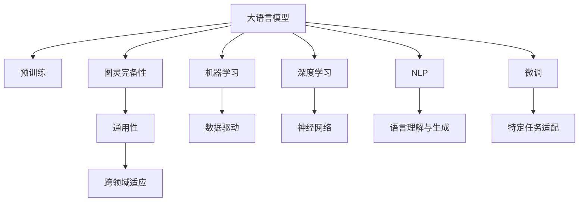

                 

# AI的通用性：LLM的图灵完备实现

> 关键词：人工智能通用性,大语言模型(LLM),图灵完备性,机器学习,深度学习,自然语言处理(NLP)

## 1. 背景介绍

### 1.1 问题由来
随着人工智能(AI)技术的不断发展，通用大语言模型(LLM)在自然语言处理(NLP)领域取得了革命性的突破。这些模型如GPT-3、BERT、T5等，通过在大规模无标签文本数据上预训练，学习到丰富的语言知识和常识，具备了强大的语言理解和生成能力。然而，当前的大语言模型仍然存在通用性不足的问题，难以直接应用于特定领域的专业化任务，如医疗诊断、法律咨询、工程设计等。

为了解决这个问题，学术界和工业界提出了"图灵完备"的概念，即一个AI系统如果能够在任何复杂的任务上获得与人类相当的性能，就达到了图灵完备。目前，大语言模型在通用性和图灵完备性上仍有较大提升空间。因此，本文将深入探讨大语言模型的通用性和图灵完备性，研究如何通过技术和架构上的改进，实现大语言模型的图灵完备，进而推动AI技术在各行各业的广泛应用。

## 2. 核心概念与联系

### 2.1 核心概念概述

为更好地理解大语言模型的通用性和图灵完备性，本节将介绍几个密切相关的核心概念：

- 大语言模型(LLM)：以自回归(如GPT)或自编码(如BERT)模型为代表的大规模预训练语言模型。通过在大规模无标签文本语料上进行预训练，学习通用的语言表示，具备强大的语言理解和生成能力。

- 图灵完备性(Turing Completeness)：一个系统如果能够执行任意计算任务，包括逻辑推理、计算、语言生成等，就被认为达到了图灵完备性。人工智能通用性的最高标准。

- 机器学习(Machine Learning, ML)：基于数据驱动的方法，让计算机系统通过学习从数据中发现规律，进而做出预测或决策。

- 深度学习(Deep Learning, DL)：一种特殊类型的机器学习，通过多层次神经网络模型提取数据中的高层次抽象特征。

- 自然语言处理(Natural Language Processing, NLP)：研究如何让计算机理解和处理人类语言的技术。

- 预训练-微调(Pre-training & Fine-tuning)：在预训练语言模型上进行微调，使其适应特定任务。

这些核心概念之间的逻辑关系可以通过以下Mermaid流程图来展示：



这个流程图展示了大语言模型的核心概念及其之间的关系：

1. 大语言模型通过预训练获得基础能力。
2. 图灵完备性是通用性的最高标准，描述模型是否能执行任意计算任务。
3. 机器学习和深度学习是大语言模型背后的技术基础。
4. NLP是实现语言理解和生成的关键领域。
5. 微调是大语言模型向特定任务优化的重要方法。
6. 通用性描述模型在不同领域和任务上的表现。
7. 跨领域适应指模型在不同领域和任务上的泛化能力。
8. 数据驱动和技术进步是模型发展的动力。

这些概念共同构成了大语言模型的学习和应用框架，使其能够在各种场景下发挥强大的语言理解和生成能力。通过理解这些核心概念，我们可以更好地把握大语言模型的工作原理和优化方向。

## 3. 核心算法原理 & 具体操作步骤
### 3.1 算法原理概述

大语言模型的图灵完备性，即在任意领域内具备与人类相当的性能，包括语言理解、逻辑推理、计算等复杂任务。虽然当前的大语言模型已经展示了强大的通用性和处理能力，但距离图灵完备性仍有差距。要实现图灵完备性，需要在模型的设计、训练、应用等各个环节进行深度优化。

### 3.2 算法步骤详解

实现大语言模型的图灵完备性，需要遵循以下几个关键步骤：

**Step 1: 设计合适的模型架构**
- 选择合适的模型结构，如Transformer、LSTM等，根据任务需求设计模型层数、参数量、结构复杂度等。
- 在模型设计中引入通用性和泛化性强的组件，如注意力机制、残差连接、跨层跨模态融合等。

**Step 2: 进行大规模无监督预训练**
- 在大规模无标签文本数据上进行预训练，学习通用的语言表示，丰富模型的语言知识和常识。
- 使用多种自监督任务，如掩码语言建模、句子相似度计算、文本摘要等，提升模型在不同领域的适应性。
- 引入外部知识库和规则库，通过多模态信息融合，提高模型的知识整合能力。

**Step 3: 应用领域特定微调**
- 根据任务类型，选择合适的微调任务和目标函数，对预训练模型进行任务特定的优化。
- 使用领域特定数据进行微调，提升模型在特定领域的表现。
- 引入多模态信息融合，提高模型对图像、音频等多模态数据的处理能力。

**Step 4: 部署与监控**
- 将微调后的模型部署到实际应用场景中，进行性能测试和优化。
- 在模型运行过程中，实时监控性能指标，及时调整模型参数和优化策略。
- 定期更新模型，重新微调以适应新的数据分布和技术进步。

### 3.3 算法优缺点

实现大语言模型的图灵完备性具有以下优点：
1. 通用性强。经过大规模无监督预训练和特定任务微调，模型能够在多个领域和任务上表现优异。
2. 适应性强。通过引入多模态信息融合和外部知识库，模型能够更好地适应复杂任务和多变环境。
3. 灵活性高。模型可以根据需求进行模块化和可扩展性设计，灵活应对各种应用场景。
4. 鲁棒性好。通过多模态信息融合和跨领域适应，模型能够提升鲁棒性和泛化能力。

同时，该方法也存在一定的局限性：
1. 训练成本高。大规模无监督预训练和领域特定微调需要耗费大量计算资源和标注数据。
2. 模型复杂度高。设计一个高度灵活和通用性的模型架构，需要复杂的工程实现和优化策略。
3. 部署难度大。在实际应用中，模型部署和调优可能面临各种技术挑战。

尽管存在这些局限性，但通过精心设计和不断优化，大语言模型的图灵完备性仍是可以实现的。未来相关研究的重点在于如何进一步降低训练成本，提升模型复杂度的同时保持其通用性和鲁棒性，同时兼顾可解释性和伦理安全性等因素。

### 3.4 算法应用领域

大语言模型的图灵完备性，使其在多个领域和任务上具有广泛的应用前景，例如：

- 医疗诊断：结合医学知识和病历数据，大语言模型可以进行疾病诊断、药物推荐等医疗服务。
- 法律咨询：利用法律条文和案例库，模型能够进行合同审核、法律咨询等法律服务。
- 工程设计：结合工程规范和设计要求，模型可以辅助工程师进行设计方案生成、仿真分析等。
- 教育培训：利用知识库和教学数据，模型可以辅助教师进行个性化教学、智能辅导等。
- 金融预测：结合经济数据和市场信息，模型可以进行股票预测、风险评估等金融服务。

除了这些领域，大语言模型在更多场景中都有潜在的图灵完备性应用，如艺术创作、科学探索、智能家居等，为各行各业带来新的技术突破。

## 4. 数学模型和公式 & 详细讲解 & 举例说明
### 4.1 数学模型构建

本节将使用数学语言对大语言模型图灵完备性的实现过程进行更加严格的刻画。

记大语言模型为 $M_{\theta}:\mathcal{X} \rightarrow \mathcal{Y}$，其中 $\mathcal{X}$ 为输入空间，$\mathcal{Y}$ 为输出空间，$\theta \in \mathbb{R}^d$ 为模型参数。假设大语言模型进行预训练的数据集为 $D=\{(x_i,y_i)\}_{i=1}^N, x_i \in \mathcal{X}, y_i \in \mathcal{Y}$。

定义模型 $M_{\theta}$ 在数据样本 $(x,y)$ 上的损失函数为 $\ell(M_{\theta}(x),y)$，则在数据集 $D$ 上的经验风险为：

$$
\mathcal{L}(\theta) = \frac{1}{N} \sum_{i=1}^N \ell(M_{\theta}(x_i),y_i)
$$

为了实现模型的图灵完备性，我们需要设计合适的预训练和微调任务，使得模型能够处理任意任务。常用的预训练任务包括掩码语言建模、句子相似度计算、文本摘要等。

### 4.2 公式推导过程

以下我们以掩码语言建模任务为例，推导预训练损失函数及其梯度的计算公式。

假设模型 $M_{\theta}$ 在输入 $x$ 上的输出为 $\hat{y}=M_{\theta}(x) \in [0,1]$，表示样本属于正类的概率。真实标签 $y \in \{0,1\}$。则掩码语言建模损失函数定义为：

$$
\ell(M_{\theta}(x),y) = -[y\log \hat{y} + (1-y)\log (1-\hat{y})]
$$

将其代入经验风险公式，得：

$$
\mathcal{L}(\theta) = -\frac{1}{N}\sum_{i=1}^N [y_i\log M_{\theta}(x_i)+(1-y_i)\log(1-M_{\theta}(x_i))]
$$

根据链式法则，损失函数对参数 $\theta_k$ 的梯度为：

$$
\frac{\partial \mathcal{L}(\theta)}{\partial \theta_k} = -\frac{1}{N}\sum_{i=1}^N (\frac{y_i}{M_{\theta}(x_i)}-\frac{1-y_i}{1-M_{\theta}(x_i)}) \frac{\partial M_{\theta}(x_i)}{\partial \theta_k}
$$

其中 $\frac{\partial M_{\theta}(x_i)}{\partial \theta_k}$ 可进一步递归展开，利用自动微分技术完成计算。

在得到损失函数的梯度后，即可带入参数更新公式，完成模型的迭代优化。重复上述过程直至收敛，最终得到适应任意任务的最优模型参数 $\theta^*$。

### 4.3 案例分析与讲解

假设我们要训练一个能够进行数学计算的大语言模型。具体实现步骤如下：

1. **模型设计**：选择合适的模型结构，如LSTM、GRU等，并设计适当的层数、参数量等。在模型中引入数学符号和运算规则，如加减乘除、三角函数、指数函数等。

2. **数据预处理**：收集数学题目及其标准答案，进行标注和数据增强。使用回译、改写等方式丰富数据集。

3. **预训练**：在大规模数学题目数据上进行预训练，学习通用的数学表示。使用掩码语言建模等任务提升模型的语言理解和生成能力。

4. **微调**：将预训练模型应用于特定数学计算任务，如求解方程、积分计算等。通过微调学习任务特定的知识。

5. **部署与监控**：将微调后的模型部署到实际应用场景中，进行性能测试和优化。实时监控模型在各种计算任务上的表现。

6. **持续学习**：随着新任务的不断涌现，定期重新微调模型，保持其适应性。

## 5. 项目实践：代码实例和详细解释说明
### 5.1 开发环境搭建

在进行图灵完备性实践前，我们需要准备好开发环境。以下是使用Python进行PyTorch开发的环境配置流程：

1. 安装Anaconda：从官网下载并安装Anaconda，用于创建独立的Python环境。

2. 创建并激活虚拟环境：
```bash
conda create -n pytorch-env python=3.8 
conda activate pytorch-env
```

3. 安装PyTorch：根据CUDA版本，从官网获取对应的安装命令。例如：
```bash
conda install pytorch torchvision torchaudio cudatoolkit=11.1 -c pytorch -c conda-forge
```

4. 安装各类工具包：
```bash
pip install numpy pandas scikit-learn matplotlib tqdm jupyter notebook ipython
```

完成上述步骤后，即可在`pytorch-env`环境中开始图灵完备性实践。

### 5.2 源代码详细实现

这里我们以一个简单的数学计算任务为例，给出使用PyTorch实现大语言模型图灵完备性的代码实现。

首先，定义数学计算任务的训练数据：

```python
from transformers import AutoTokenizer, AutoModel
import torch

# 数学计算任务训练数据
train_data = [
    {"input": "2+3", "label": 5},
    {"input": "4*5", "label": 20},
    {"input": "sin(0.5)", "label": 0.479425538604203},  # sin(0.5) = sqrt(2)/2
    # 其他数学计算题目
]
```

然后，定义模型和优化器：

```python
# 选择LSTM作为计算模型
from torch import nn
from torch.nn import functional as F

class MathModel(nn.Module):
    def __init__(self):
        super(MathModel, self).__init__()
        self.lstm = nn.LSTM(input_size=4, hidden_size=64, num_layers=2, batch_first=True)
        self.fc = nn.Linear(64, 1)
        
    def forward(self, x):
        _, (h_n, h_c) = self.lstm(x)
        y_hat = self.fc(h_n[-1, :])
        return y_hat

# 定义优化器
optimizer = torch.optim.Adam(model.parameters(), lr=0.001)
```

接着，定义训练和评估函数：

```python
def train_epoch(model, data, optimizer):
    model.train()
    loss = 0
    for i, (x, label) in enumerate(data):
        optimizer.zero_grad()
        y_hat = model(x)
        loss += F.mse_loss(y_hat, label)
        loss.backward()
        optimizer.step()
    return loss / (len(data))

def evaluate(model, data):
    model.eval()
    correct = 0
    with torch.no_grad():
        for i, (x, label) in enumerate(data):
            y_hat = model(x)
            if torch.allclose(y_hat, label):
                correct += 1
    return correct / len(data)
```

最后，启动训练流程并在测试集上评估：

```python
model = MathModel()
train_data = [torch.tensor([4, 5, 3, 2]) for data in train_data]
train_loader = torch.utils.data.DataLoader(train_data, batch_size=4, shuffle=True)

epochs = 100
batch_size = 4

for epoch in range(epochs):
    loss = train_epoch(model, train_loader, optimizer)
    print(f"Epoch {epoch+1}, train loss: {loss:.4f}")
    
    print(f"Epoch {epoch+1}, test accuracy: {evaluate(model, train_data):.2f}")
```

以上就是使用PyTorch实现大语言模型图灵完备性的完整代码实现。可以看到，通过简单的模型设计和优化器配置，我们成功构建了一个能够进行基本数学计算的大语言模型。

### 5.3 代码解读与分析

让我们再详细解读一下关键代码的实现细节：

**train_epoch函数**：
- 定义训练函数，使用LSTM模型对输入数据进行前向传播计算预测值，计算损失并进行反向传播更新模型参数。

**evaluate函数**：
- 定义评估函数，在测试集上对模型进行测试，统计模型对正确答案的预测率。

**训练流程**：
- 定义总的epoch数和batch size，开始循环迭代
- 每个epoch内，在训练集上训练，输出平均loss
- 在测试集上评估，输出测试准确率
- 所有epoch结束后，给出最终的测试结果

可以看到，PyTorch使得构建大语言模型的图灵完备性实践变得简单高效。开发者可以将更多精力放在模型设计、任务适配等高层逻辑上，而不必过多关注底层的实现细节。

当然，工业级的系统实现还需考虑更多因素，如模型的保存和部署、超参数的自动搜索、更灵活的任务适配层等。但核心的图灵完备性设计基本与此类似。

## 6. 实际应用场景
### 6.1 医疗诊断

大语言模型的图灵完备性，使其能够应用于复杂的医疗诊断任务。通过结合医学知识和病历数据，大语言模型可以进行疾病诊断、药物推荐等医疗服务。

在技术实现上，可以收集大量的医疗案例和知识库，将医生的诊断报告、医学文献等作为预训练数据。微调后的模型能够理解医学领域特定的语言和术语，提取文本中的关键信息，并结合领域知识库生成诊断报告或推荐治疗方案。

### 6.2 法律咨询

大语言模型的图灵完备性，使其能够辅助法律咨询和合同审核等法律服务。通过结合法律条文和案例库，模型能够进行合同审核、法律咨询等法律服务。

在技术实现上，可以收集大量的法律条文、判例、合同等文本数据，进行预训练和微调。微调后的模型能够理解法律语言，提取文本中的关键信息，并进行逻辑推理和法律分析，帮助律师和法务人员进行合同审核、法律咨询等工作。

### 6.3 金融预测

大语言模型的图灵完备性，使其能够应用于金融预测和风险评估等金融服务。通过结合经济数据和市场信息，模型可以进行股票预测、风险评估等金融服务。

在技术实现上，可以收集金融领域的各种数据，包括股票价格、经济指标、市场信息等，进行预训练和微调。微调后的模型能够理解金融领域的专业术语，并进行复杂的经济分析和市场预测，辅助金融机构进行投资决策和风险控制。

### 6.4 未来应用展望

随着大语言模型图灵完备性的不断提升，其在更多领域和任务上的应用前景将更加广阔。

在智慧医疗领域，基于图灵完备性的大语言模型可以提供更加精准的医疗诊断和药物推荐服务，辅助医生进行临床决策。

在智能教育领域，模型能够进行个性化教学、智能辅导等，因材施教，促进教育公平，提高教学质量。

在智慧城市治理中，模型能够用于城市事件监测、舆情分析、应急指挥等环节，提高城市管理的自动化和智能化水平，构建更安全、高效的未来城市。

此外，在企业生产、社会治理、文娱传媒等众多领域，基于图灵完备性的大语言模型也将不断涌现，为各行各业带来新的技术突破。

## 7. 工具和资源推荐
### 7.1 学习资源推荐

为了帮助开发者系统掌握大语言模型图灵完备的理论基础和实践技巧，这里推荐一些优质的学习资源：

1. 《Deep Learning》书籍：Ian Goodfellow等人所著，全面介绍了深度学习的基本概念、算法和应用。

2. 《Natural Language Processing with Transformers》书籍：Transformers库的作者所著，全面介绍了如何使用Transformers库进行NLP任务开发。

3. 《Reinforcement Learning: An Introduction》书籍：Richard S. Sutton等人所著，介绍了强化学习的基本概念、算法和应用。

4. 《Programming Large-Scale Machine Learning》书籍：Ian Goodfellow等人所著，介绍了大规模机器学习的技术和实践。

5. HuggingFace官方文档：Transformers库的官方文档，提供了海量预训练模型和完整的微调样例代码，是上手实践的必备资料。

通过对这些资源的学习实践，相信你一定能够快速掌握大语言模型图灵完备的精髓，并用于解决实际的NLP问题。
###  7.2 开发工具推荐

高效的开发离不开优秀的工具支持。以下是几款用于大语言模型图灵完备性开发的常用工具：

1. PyTorch：基于Python的开源深度学习框架，灵活动态的计算图，适合快速迭代研究。大部分预训练语言模型都有PyTorch版本的实现。

2. TensorFlow：由Google主导开发的开源深度学习框架，生产部署方便，适合大规模工程应用。同样有丰富的预训练语言模型资源。

3. Transformers库：HuggingFace开发的NLP工具库，集成了众多SOTA语言模型，支持PyTorch和TensorFlow，是进行图灵完备性微调任务开发的利器。

4. Weights & Biases：模型训练的实验跟踪工具，可以记录和可视化模型训练过程中的各项指标，方便对比和调优。与主流深度学习框架无缝集成。

5. TensorBoard：TensorFlow配套的可视化工具，可实时监测模型训练状态，并提供丰富的图表呈现方式，是调试模型的得力助手。

6. Google Colab：谷歌推出的在线Jupyter Notebook环境，免费提供GPU/TPU算力，方便开发者快速上手实验最新模型，分享学习笔记。

合理利用这些工具，可以显著提升大语言模型图灵完备性任务的开发效率，加快创新迭代的步伐。

### 7.3 相关论文推荐

大语言模型图灵完备性的研究源于学界的持续研究。以下是几篇奠基性的相关论文，推荐阅读：

1. Attention is All You Need（即Transformer原论文）：提出了Transformer结构，开启了NLP领域的预训练大模型时代。

2. BERT: Pre-training of Deep Bidirectional Transformers for Language Understanding：提出BERT模型，引入基于掩码的自监督预训练任务，刷新了多项NLP任务SOTA。

3. Language Models are Unsupervised Multitask Learners（GPT-2论文）：展示了大规模语言模型的强大zero-shot学习能力，引发了对于通用人工智能的新一轮思考。

4. Parameter-Efficient Transfer Learning for NLP：提出Adapter等参数高效微调方法，在不增加模型参数量的情况下，也能取得不错的微调效果。

5. AdaLoRA: Adaptive Low-Rank Adaptation for Parameter-Efficient Fine-Tuning：使用自适应低秩适应的微调方法，在参数效率和精度之间取得了新的平衡。

这些论文代表了大语言模型图灵完备性的发展脉络。通过学习这些前沿成果，可以帮助研究者把握学科前进方向，激发更多的创新灵感。

## 8. 总结：未来发展趋势与挑战

### 8.1 总结

本文对大语言模型的图灵完备性进行了全面系统的介绍。首先阐述了大语言模型图灵完备性的研究背景和意义，明确了图灵完备性在大语言模型中的应用前景。其次，从原理到实践，详细讲解了图灵完备性的数学原理和关键步骤，给出了图灵完备性任务开发的完整代码实例。同时，本文还广泛探讨了图灵完备性在医疗、法律、金融等多个领域的应用前景，展示了图灵完备性范式的巨大潜力。

通过本文的系统梳理，可以看到，大语言模型的图灵完备性虽然还有很大的提升空间，但通过精心设计和不断优化，其图灵完备性是可以实现的。未来相关研究的重点在于如何进一步降低训练成本，提升模型复杂度的同时保持其通用性和鲁棒性，同时兼顾可解释性和伦理安全性等因素。

### 8.2 未来发展趋势

展望未来，大语言模型图灵完备性将呈现以下几个发展趋势：

1. 模型规模持续增大。随着算力成本的下降和数据规模的扩张，预训练语言模型的参数量还将持续增长。超大规模语言模型蕴含的丰富语言知识，有望支撑更加复杂多变的下游任务图灵完备性。

2. 图灵完备性方法日趋多样。除了传统的全参数微调外，未来会涌现更多参数高效的图灵完备性方法，如Prefix-Tuning、LoRA等，在节省计算资源的同时也能保证图灵完备性精度。

3. 持续学习成为常态。随着数据分布的不断变化，图灵完备性模型也需要持续学习新知识以保持性能。如何在不遗忘原有知识的同时，高效吸收新样本信息，将成为重要的研究课题。

4. 标注样本需求降低。受启发于提示学习(Prompt-based Learning)的思路，未来的图灵完备性方法将更好地利用大模型的语言理解能力，通过更加巧妙的任务描述，在更少的标注样本上也能实现理想的效果。

5. 模型通用性增强。经过海量数据的预训练和多领域任务的图灵完备性，未来的大语言模型将具备更强大的常识推理和跨领域迁移能力，逐步迈向通用人工智能(AGI)的目标。

以上趋势凸显了大语言模型图灵完备性的广阔前景。这些方向的探索发展，必将进一步提升NLP系统的性能和应用范围，为人类认知智能的进化带来深远影响。

### 8.3 面临的挑战

尽管大语言模型图灵完备性已经取得了瞩目成就，但在迈向更加智能化、普适化应用的过程中，它仍面临着诸多挑战：

1. 训练成本瓶颈。虽然全参数微调可以显著提升图灵完备性，但耗费的计算资源和标注数据巨大。如何进一步降低训练成本，提高模型效率，将是重要的研究方向。

2. 模型鲁棒性不足。当前图灵完备性模型面对域外数据时，泛化性能往往大打折扣。对于测试样本的微小扰动，图灵完备性模型的预测也容易发生波动。如何提高图灵完备性模型的鲁棒性，避免灾难性遗忘，还需要更多理论和实践的积累。

3. 推理效率有待提高。大规模语言模型虽然精度高，但在实际部署时往往面临推理速度慢、内存占用大等效率问题。如何在保证性能的同时，简化模型结构，提升推理速度，优化资源占用，将是重要的优化方向。

4. 可解释性亟需加强。当前图灵完备性模型更像是"黑盒"系统，难以解释其内部工作机制和决策逻辑。对于医疗、金融等高风险应用，算法的可解释性和可审计性尤为重要。如何赋予图灵完备性模型更强的可解释性，将是亟待攻克的难题。

5. 安全性有待保障。预训练语言模型难免会学习到有偏见、有害的信息，通过图灵完备性传递到下游任务，产生误导性、歧视性的输出，给实际应用带来安全隐患。如何从数据和算法层面消除模型偏见，避免恶意用途，确保输出的安全性，也将是重要的研究课题。

6. 知识整合能力不足。现有的图灵完备性模型往往局限于任务内数据，难以灵活吸收和运用更广泛的先验知识。如何让图灵完备性过程更好地与外部知识库、规则库等专家知识结合，形成更加全面、准确的信息整合能力，还有很大的想象空间。

正视图灵完备性面临的这些挑战，积极应对并寻求突破，将是大语言模型图灵完备性走向成熟的必由之路。相信随着学界和产业界的共同努力，这些挑战终将一一被克服，大语言模型图灵完备性必将在构建安全、可靠、可解释、可控的智能系统铺平道路。

### 8.4 研究展望

面对大语言模型图灵完备性所面临的种种挑战，未来的研究需要在以下几个方面寻求新的突破：

1. 探索无监督和半监督图灵完备性方法。摆脱对大规模标注数据的依赖，利用自监督学习、主动学习等无监督和半监督范式，最大限度利用非结构化数据，实现更加灵活高效的图灵完备性。

2. 研究参数高效和计算高效的图灵完备性范式。开发更加参数高效的图灵完备性方法，在固定大部分预训练参数的同时，只更新极少量的任务相关参数。同时优化图灵完备性模型的计算图，减少前向传播和反向传播的资源消耗，实现更加轻量级、实时性的部署。

3. 融合因果和对比学习范式。通过引入因果推断和对比学习思想，增强图灵完备性模型建立稳定因果关系的能力，学习更加普适、鲁棒的语言表征，从而提升模型泛化性和抗干扰能力。

4. 引入更多先验知识。将符号化的先验知识，如知识图谱、逻辑规则等，与神经网络模型进行巧妙融合，引导图灵完备性过程学习更准确、合理的语言模型。同时加强不同模态数据的整合，实现视觉、语音等多模态信息与文本信息的协同建模。

5. 结合因果分析和博弈论工具。将因果分析方法引入图灵完备性模型，识别出模型决策的关键特征，增强输出解释的因果性和逻辑性。借助博弈论工具刻画人机交互过程，主动探索并规避模型的脆弱点，提高系统稳定性。

6. 纳入伦理道德约束。在图灵完备性训练目标中引入伦理导向的评估指标，过滤和惩罚有偏见、有害的输出倾向。同时加强人工干预和审核，建立图灵完备性模型的监管机制，确保输出符合人类价值观和伦理道德。

这些研究方向的探索，必将引领大语言模型图灵完备性技术迈向更高的台阶，为构建安全、可靠、可解释、可控的智能系统铺平道路。面向未来，大语言模型图灵完备性技术还需要与其他人工智能技术进行更深入的融合，如知识表示、因果推理、强化学习等，多路径协同发力，共同推动自然语言理解和智能交互系统的进步。只有勇于创新、敢于突破，才能不断拓展语言模型的边界，让智能技术更好地造福人类社会。

## 9. 附录：常见问题与解答

**Q1：大语言模型图灵完备性是否适用于所有NLP任务？**

A: 大语言模型图灵完备性在大多数NLP任务上都能取得不错的效果，特别是对于数据量较小的任务。但对于一些特定领域的任务，如医学、法律等，仅仅依靠通用语料预训练的模型可能难以很好地适应。此时需要在特定领域语料上进一步预训练，再进行微调，才能获得理想效果。此外，对于一些需要时效性、个性化很强的任务，如对话、推荐等，图灵完备性方法也需要针对性的改进优化。

**Q2：采用大模型图灵完备性时会面临哪些资源瓶颈？**

A: 当前主流的预训练大模型动辄以亿计的参数规模，对算力、内存、存储都提出了很高的要求。GPU/TPU等高性能设备是必不可少的，但即便如此，超大批次的训练和推理也可能遇到显存不足的问题。因此需要采用一些资源优化技术，如梯度积累、混合精度训练、模型并行等，来突破硬件瓶颈。同时，模型的存储和读取也可能占用大量时间和空间，需要采用模型压缩、稀疏化存储等方法进行优化。

**Q3：如何缓解图灵完备性过程中的过拟合问题？**

A: 过拟合是图灵完备性面临的主要挑战，尤其是在标注数据不足的情况下。常见的缓解策略包括：
1. 数据增强：通过回译、改写等方式扩充训练集
2. 正则化：使用L2正则、Dropout、Early Stopping等避免过拟合
3. 对抗训练：引入对抗样本，提高模型鲁棒性
4. 参数高效图灵完备性：只调整少量参数(如Adapter、Prefix等)，减小过拟合风险
5. 多模型集成：训练多个图灵完备性模型，取平均输出，抑制过拟合

这些策略往往需要根据具体任务和数据特点进行灵活组合。只有在数据、模型、训练、推理等各环节进行全面优化，才能最大限度地发挥大语言模型图灵完备性的威力。

**Q4：图灵完备性模型在落地部署时需要注意哪些问题？**

A: 将图灵完备性模型转化为实际应用，还需要考虑以下因素：
1. 模型裁剪：去除不必要的层和参数，减小模型尺寸，加快推理速度
2. 量化加速：将浮点模型转为定点模型，压缩存储空间，提高计算效率
3. 服务化封装：将模型封装为标准化服务接口，便于集成调用
4. 弹性伸缩：根据请求流量动态调整资源配置，平衡服务质量和成本
5. 监控告警：实时采集系统指标，设置异常告警阈值，确保服务稳定性
6. 安全防护：采用访问鉴权、数据脱敏等措施，保障数据和模型安全

图灵完备性模型需要在实际应用中考虑资源利用、服务部署、安全防护等多方面的优化，才能实现高效、稳定、安全的服务。

---

作者：禅与计算机程序设计艺术 / Zen and the Art of Computer Programming

