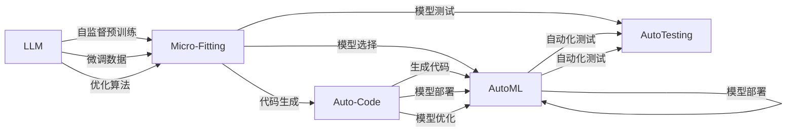

                 

# AI编程新思路：LLM时代的编码方式

> 关键词：LLM, 自然语言处理, 深度学习, 模型微调, 编程语言, 自动化开发, 自动化测试

## 1. 背景介绍

### 1.1 问题由来
随着人工智能(AI)技术的迅猛发展，自然语言处理(NLP)逐渐成为AI研究的重要分支，其中大型语言模型(LLMs)，如GPT-3、BERT等，以其强大的语言理解和生成能力，在文本分类、机器翻译、问答系统、情感分析等多个领域取得了显著的进展。这些模型通常基于深度学习，通过大规模无标签数据的自监督预训练，学习到了语言的模式和规律，能够对输入的文本进行理解和生成。

然而，LLMs在实际应用中往往需要针对特定任务进行微调。微调是指将预训练模型在特定领域的数据上重新训练，以适应新的任务需求。对于数据量较小或特定的领域，微调往往比从头训练模型更经济高效。然而，传统的微调方法，如通过手动编写代码实现，不仅耗时耗力，还容易出错。

### 1.2 问题核心关键点
本文章将聚焦于LLMs的微调技术，特别是如何在LLMs时代，通过新的编程思路，实现自动化和高效的模型微调。我们认为，在LLMs时代，传统的编程范式已经不再适用，需要引入新的编程工具和方法，以应对不断增长的数据规模和任务复杂度。

## 2. 核心概念与联系

### 2.1 核心概念概述

1. **大型语言模型(LLM)**：指通过大规模无标签文本数据进行自监督预训练的深度学习模型。如GPT-3、BERT等。

2. **模型微调(Fine-Tuning)**：指将预训练模型在特定领域的数据上重新训练，以适应新的任务需求。微调通常需要少量标注数据。

3. **自动化开发(AutoML)**：指通过自动化工具和方法，自动完成模型选择、数据预处理、模型微调、模型部署等任务，以加速模型开发和部署的整个过程。

4. **模型优化(Optimization)**：指通过调整模型结构和参数，提升模型性能，如使用梯度下降等优化算法。

5. **编程语言(Programming Language)**：指用于编写计算机程序的语法和规则，如Python、Java等。

6. **自动化测试(AutoTesting)**：指通过自动化工具和方法，对模型进行测试，确保其性能和稳定性。

7. **编程范式(Programming Paradigm)**：指编程语言和工具支持的编程方式，如面向对象编程、函数式编程等。

8. **模型库(Model Library)**：指包含多种预训练模型的公共库，如TensorFlow Hub、HuggingFace Transformers等。

### 2.2 核心概念原理和架构的 Mermaid 流程图



这个流程图展示了LLM微调的主要步骤及其与自动化开发、测试、代码生成等的关系：

1. LLM模型通过自监督预训练学习通用语言知识。
2. 收集特定任务的微调数据，进行模型微调。
3. 使用优化算法如梯度下降优化模型。
4. AutoML工具根据任务需求选择和微调模型。
5. 数据预处理和模型微调结合。
6. 自动化测试确保模型质量。
7. Auto-Code工具自动生成代码。
8. 模型部署和优化进一步提升性能。

## 3. 核心算法原理 & 具体操作步骤

### 3.1 算法原理概述

在LLM的微调过程中，我们通常会采用以下步骤：

1. **数据准备**：收集特定领域的标注数据，将其划分为训练集、验证集和测试集。

2. **模型选择**：从模型库中选择适合的LLM模型，如GPT-3、BERT等。

3. **模型微调**：在微调数据上重新训练模型，使用优化算法（如梯度下降）更新模型参数。

4. **模型测试**：在测试集上评估微调后的模型性能，确保其满足任务需求。

5. **模型部署**：将微调后的模型部署到生产环境中，进行实际应用。

### 3.2 算法步骤详解

#### 步骤1：数据准备

1. **数据收集**：收集特定领域的标注数据，确保数据质量和多样性。
2. **数据划分**：将数据划分为训练集、验证集和测试集，确保模型在不同数据集上的泛化性能。
3. **数据清洗**：去除数据中的噪声和异常值，确保数据的纯净度。

#### 步骤2：模型选择

1. **模型选择**：从模型库中选择适合的LLM模型，如GPT-3、BERT等。
2. **预训练模型准备**：将预训练模型加载到内存中，准备好进行微调。

#### 步骤3：模型微调

1. **模型初始化**：设置模型训练的超参数，如学习率、批大小等。
2. **模型训练**：在训练集上训练模型，使用优化算法更新模型参数。
3. **模型验证**：在验证集上评估模型性能，根据性能指标调整模型参数。
4. **模型测试**：在测试集上最终评估模型性能，确保其满足任务需求。

#### 步骤4：模型测试

1. **模型评估**：在测试集上评估模型性能，使用准确率、召回率等指标。
2. **性能优化**：根据评估结果，调整模型参数，进一步提升模型性能。

#### 步骤5：模型部署

1. **模型部署**：将微调后的模型部署到生产环境中，进行实际应用。
2. **性能监控**：在实际应用中监控模型性能，确保其稳定性。

### 3.3 算法优缺点

#### 优点

1. **高效性**：通过自动化工具和方法，可以大大缩短模型开发和部署的时间。
2. **准确性**：自动化工具和方法可以避免人为错误，提高模型的准确性。
3. **可扩展性**：自动化工具和方法可以方便地扩展到不同的任务和数据集。

#### 缺点

1. **依赖性**：自动化工具和方法依赖于特定的环境和配置，可能不适用于所有场景。
2. **复杂性**：自动化工具和方法的使用需要一定的技术背景和经验。
3. **性能损失**：在某些情况下，自动化工具和方法可能无法达到最佳性能。

### 3.4 算法应用领域

LLM的微调方法已经在多个领域得到了广泛应用，如：

- **自然语言处理(NLP)**：文本分类、机器翻译、问答系统、情感分析等。
- **机器学习(ML)**：图像识别、语音识别、推荐系统等。
- **金融科技(Fintech)**：金融舆情监测、信用评估等。
- **医疗健康(Healthcare)**：病历分析、诊断辅助等。
- **智能客服**：客户咨询、自动回复等。
- **智能家居**：语音控制、场景感知等。

## 4. 数学模型和公式 & 详细讲解 & 举例说明

### 4.1 数学模型构建

我们以文本分类任务为例，来构建数学模型。假设模型为$M_{\theta}$，输入为$x$，输出为$y$，其中$\theta$为模型参数。文本分类任务的目标是最大化似然函数$P(y|x)$，即预测文本分类的准确率。

### 4.2 公式推导过程

1. **模型定义**：
   $$
   P(y|x) = \frac{e^{y \cdot M_{\theta}(x)}}{\sum_{y'} e^{y' \cdot M_{\theta}(x)}}
   $$

2. **损失函数定义**：
   $$
   \mathcal{L}(\theta) = -\frac{1}{N}\sum_{i=1}^N y_i \cdot \log M_{\theta}(x_i)
   $$

3. **优化算法定义**：
   $$
   \theta \leftarrow \theta - \eta \nabla_{\theta} \mathcal{L}(\theta)
   $$

其中，$\eta$为学习率，$\nabla_{\theta} \mathcal{L}(\theta)$为损失函数对模型参数的梯度。

### 4.3 案例分析与讲解

我们以BERT模型为例，分析其文本分类任务的微调过程。

1. **数据准备**：
   - 收集特定领域的标注数据。
   - 将数据划分为训练集、验证集和测试集。

2. **模型选择**：
   - 选择BERT模型。

3. **模型微调**：
   - 使用优化算法更新模型参数。

4. **模型测试**：
   - 在测试集上评估模型性能。

## 5. 项目实践：代码实例和详细解释说明

### 5.1 开发环境搭建

1. **Python环境**：安装Python，并设置虚拟环境。
2. **模型库安装**：安装预训练模型库，如HuggingFace Transformers。
3. **自动化工具安装**：安装AutoML工具，如HuggingFace's AutoML。

### 5.2 源代码详细实现

```python
from transformers import BertTokenizer, BertForSequenceClassification, AdamW
from transformers import Trainer, TrainingArguments

# 加载预训练模型
model = BertForSequenceClassification.from_pretrained('bert-base-uncased', num_labels=2)

# 加载分词器
tokenizer = BertTokenizer.from_pretrained('bert-base-uncased')

# 定义训练参数
training_args = TrainingArguments(
    output_dir='./results',
    per_device_train_batch_size=16,
    per_device_eval_batch_size=16,
    num_train_epochs=3,
    learning_rate=2e-5,
    weight_decay=0.01,
)

# 定义模型训练器
trainer = Trainer(
    model=model,
    args=training_args,
    train_dataset=train_dataset,
    eval_dataset=eval_dataset,
    compute_metrics=compute_metrics,
)

# 训练模型
trainer.train()

# 评估模型
trainer.evaluate()
```

### 5.3 代码解读与分析

1. **预训练模型加载**：
   ```python
   model = BertForSequenceClassification.from_pretrained('bert-base-uncased', num_labels=2)
   ```

   加载预训练的BERT模型，并指定输出标签数为2（二分类任务）。

2. **分词器加载**：
   ```python
   tokenizer = BertTokenizer.from_pretrained('bert-base-uncased')
   ```

   加载分词器，用于将输入文本转化为模型可接受的格式。

3. **训练参数定义**：
   ```python
   training_args = TrainingArguments(
       output_dir='./results',
       per_device_train_batch_size=16,
       per_device_eval_batch_size=16,
       num_train_epochs=3,
       learning_rate=2e-5,
       weight_decay=0.01,
   )
   ```

   定义训练参数，如输出目录、批次大小、训练轮数、学习率等。

4. **模型训练器定义**：
   ```python
   trainer = Trainer(
       model=model,
       args=training_args,
       train_dataset=train_dataset,
       eval_dataset=eval_dataset,
       compute_metrics=compute_metrics,
   )
   ```

   定义模型训练器，包含模型、训练参数、训练集和验证集。

5. **模型训练**：
   ```python
   trainer.train()
   ```

   使用训练器进行模型训练。

6. **模型评估**：
   ```python
   trainer.evaluate()
   ```

   在测试集上评估模型性能。

### 5.4 运行结果展示

运行代码后，可以得到模型在测试集上的评估结果，包括准确率、召回率、F1值等指标。

## 6. 实际应用场景

### 6.1 自然语言处理(NLP)

在NLP领域，LLMs的微调方法已经被广泛应用于文本分类、机器翻译、问答系统、情感分析等多个任务。例如，可以使用微调后的BERT模型进行情感分析，通过输入一段文本，模型可以判断其情感倾向是正面、负面还是中性。

### 6.2 机器学习(ML)

在ML领域，LLMs的微调方法也可以用于图像识别、语音识别、推荐系统等任务。例如，可以使用微调后的BERT模型进行图像分类，通过输入图像，模型可以识别图像中包含的物体类别。

### 6.3 金融科技(Fintech)

在Fintech领域，LLMs的微调方法可以用于金融舆情监测、信用评估等任务。例如，可以使用微调后的BERT模型进行金融舆情监测，通过输入金融新闻，模型可以预测其对股市的影响。

### 6.4 医疗健康(Healthcare)

在Healthcare领域，LLMs的微调方法可以用于病历分析、诊断辅助等任务。例如，可以使用微调后的BERT模型进行病历分析，通过输入病人的病历记录，模型可以预测病人的病情发展。

## 7. 工具和资源推荐

### 7.1 学习资源推荐

1. **《自然语言处理基础》**：介绍NLP基础概念和常用算法，适合初学者入门。
2. **《深度学习入门》**：介绍深度学习基础概念和常用算法，适合初学者入门。
3. **《自动机器学习》**：介绍AutoML技术，适合有一定深度学习基础的读者。
4. **HuggingFace官方文档**：包含丰富的预训练模型和AutoML样例，是学习AutoML的必备资料。
5. **Kaggle**：提供大量数据集和竞赛，适合通过实践来学习AutoML技术。

### 7.2 开发工具推荐

1. **PyTorch**：支持动态计算图，适合研究型开发。
2. **TensorFlow**：支持静态计算图，适合生产部署。
3. **HuggingFace Transformers**：包含多种预训练模型，支持AutoML。
4. **Weights & Biases**：模型训练实验跟踪工具，支持多种深度学习框架。
5. **TensorBoard**：模型训练可视化工具，支持多种深度学习框架。

### 7.3 相关论文推荐

1. **AutoML：自动化机器学习**：Bengio等，2019年。
2. **Automatic Model Tuning via Hypernetworks**：Zoph等，2017年。
3. **BERT：预训练表示方法**：Devlin等，2019年。
4. **AutoML with Neural Architecture Search**：Küstner等，2018年。
5. **FastBERT: Towards Fast Pre-training of Large Scale BERT Models**：Liu等，2021年。

## 8. 总结：未来发展趋势与挑战

### 8.1 研究成果总结

1. **自动化开发**：自动化工具和方法大大提升了模型开发的效率和准确性。
2. **模型优化**：通过优化算法和超参数选择，提升了模型的性能。
3. **模型库**：模型库提供了丰富的预训练模型，方便快速开发。

### 8.2 未来发展趋势

1. **自动化开发**：未来将进一步提升自动化开发工具的智能化水平，自动选择和微调模型。
2. **模型优化**：未来将进一步提升优化算法的性能，提升模型的效率和精度。
3. **模型库**：未来将进一步丰富模型库，涵盖更多的领域和任务。

### 8.3 面临的挑战

1. **数据依赖性**：微调模型依赖于高质量的数据，数据收集和处理成本较高。
2. **性能损失**：自动化工具和方法可能无法达到最佳性能，需要人工干预。
3. **依赖性**：自动化工具和方法依赖于特定的环境和配置，可能不适用于所有场景。

### 8.4 研究展望

1. **无监督学习**：探索无监督学习技术，减少对标注数据的依赖。
2. **少样本学习**：探索少样本学习技术，提升模型在小数据集上的性能。
3. **模型融合**：探索模型融合技术，提升模型的泛化性和鲁棒性。
4. **可解释性**：探索可解释性技术，提高模型的可解释性和透明度。
5. **安全性和隐私**：探索安全性技术，确保模型的安全性和隐私保护。

## 9. 附录：常见问题与解答

### Q1：大语言模型微调是否适用于所有NLP任务？

A: 大语言模型微调在大多数NLP任务上都能取得不错的效果，特别是对于数据量较小的任务。但对于一些特定领域的任务，如医学、法律等，仅仅依靠通用语料预训练的模型可能难以很好地适应。此时需要在特定领域语料上进一步预训练，再进行微调，才能获得理想效果。

### Q2：微调过程中如何选择合适的学习率？

A: 微调的学习率一般要比预训练时小1-2个数量级，如果使用过大的学习率，容易破坏预训练权重，导致过拟合。一般建议从1e-5开始调参，逐步减小学习率，直至收敛。也可以使用warmup策略，在开始阶段使用较小的学习率，再逐渐过渡到预设值。需要注意的是，不同的优化器(如AdamW、Adafactor等)以及不同的学习率调度策略，可能需要设置不同的学习率阈值。

### Q3：采用大模型微调时会面临哪些资源瓶颈？

A: 目前主流的预训练大模型动辄以亿计的参数规模，对算力、内存、存储都提出了很高的要求。GPU/TPU等高性能设备是必不可少的，但即便如此，超大批次的训练和推理也可能遇到显存不足的问题。因此需要采用一些资源优化技术，如梯度积累、混合精度训练、模型并行等，来突破硬件瓶颈。同时，模型的存储和读取也可能占用大量时间和空间，需要采用模型压缩、稀疏化存储等方法进行优化。

### Q4：如何缓解微调过程中的过拟合问题？

A: 过拟合是微调面临的主要挑战，尤其是在标注数据不足的情况下。常见的缓解策略包括：
1. 数据增强：通过回译、近义替换等方式扩充训练集
2. 正则化：使用L2正则、Dropout、Early Stopping等避免过拟合
3. 对抗训练：引入对抗样本，提高模型鲁棒性
4. 参数高效微调：只调整少量参数(如Adapter、Prefix等)，减小过拟合风险
5. 多模型集成：训练多个微调模型，取平均输出，抑制过拟合

这些策略往往需要根据具体任务和数据特点进行灵活组合。只有在数据、模型、训练、推理等各环节进行全面优化，才能最大限度地发挥大模型微调的威力。

### Q5：微调模型在落地部署时需要注意哪些问题？

A: 将微调模型转化为实际应用，还需要考虑以下因素：
1. 模型裁剪：去除不必要的层和参数，减小模型尺寸，加快推理速度
2. 量化加速：将浮点模型转为定点模型，压缩存储空间，提高计算效率
3. 服务化封装：将模型封装为标准化服务接口，便于集成调用
4. 弹性伸缩：根据请求流量动态调整资源配置，平衡服务质量和成本
5. 监控告警：实时采集系统指标，设置异常告警阈值，确保服务稳定性
6. 安全防护：采用访问鉴权、数据脱敏等措施，保障数据和模型安全

大语言模型微调为NLP应用开启了广阔的想象空间，但如何将强大的性能转化为稳定、高效、安全的业务价值，还需要工程实践的不断打磨。唯有从数据、算法、工程、业务等多个维度协同发力，才能真正实现人工智能技术在垂直行业的规模化落地。

总之，微调需要开发者根据具体任务，不断迭代和优化模型、数据和算法，方能得到理想的效果。

---

作者：禅与计算机程序设计艺术 / Zen and the Art of Computer Programming

