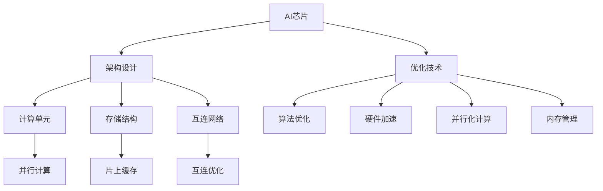

                 

# AI芯片设计：从架构到优化

## 1. 背景介绍

随着人工智能技术的快速发展和深度学习应用的广泛普及，AI芯片，也称为人工智能加速器，成为了提升AI应用性能和效率的关键硬件组件。AI芯片被广泛应用于图像识别、自然语言处理、语音识别、推荐系统等领域，为众多应用场景提供强大的计算能力支持。然而，AI芯片的设计和优化仍然是一个充满挑战和创新的领域。本文将从AI芯片的架构和优化两个维度进行全面探讨，为读者提供深入的技术洞见和实践指导。

## 2. 核心概念与联系

### 2.1 核心概念概述

- **AI芯片**：是专为AI应用设计的专用硬件芯片，通过加速深度学习模型的推理计算，提升AI应用的处理速度和效率。常见的AI芯片包括GPU（图形处理器）、TPU（张量处理单元）、ASIC（专用集成电路）等。

- **架构设计**：AI芯片的架构设计决定了其计算效率和能效比，包括并行计算单元（如矩阵乘法单元）、存储结构（如片上缓存）、互连网络等关键组件的配置。

- **优化技术**：为提升AI芯片的性能和效率，需要采用多种优化技术，包括算法优化、硬件加速、并行化计算、内存管理等。

这些核心概念之间存在密切的联系，架构设计提供了计算和存储的基础设施，而优化技术则在具体实现中不断提升芯片的性能。架构和优化相辅相成，共同决定了AI芯片的性能和效率。

### 2.2 核心概念原理和架构的 Mermaid 流程图



## 3. 核心算法原理 & 具体操作步骤

### 3.1 算法原理概述

AI芯片的优化算法主要包括以下几个方面：

- **并行化计算**：通过并行处理技术（如GPU、TPU的并行计算单元），加速矩阵乘法、卷积等深度学习模型的核心运算。

- **数据流优化**：优化数据传输路径，减少内存带宽和延迟，提高数据处理效率。

- **内存管理**：采用高效的内存访问策略，如缓存重用、片上缓存等，减少内存访问次数，提高访存速度。

- **算法优化**：针对特定模型和算法，进行算法级别的优化，如量化、剪枝、蒸馏等，减少模型参数，提升计算效率。

这些算法和优化技术在AI芯片设计中起到了关键作用，确保了芯片的性能和能效。

### 3.2 算法步骤详解

#### 3.2.1 并行化计算

并行化计算是AI芯片优化的核心，主要通过以下几个步骤实现：

1. **并行计算单元的设计**：
   - 设计专用的并行计算单元，如矩阵乘法单元（MUL）、矩阵向量乘法单元（MVM）等。
   - 合理配置并行计算单元的数量，以平衡计算效率和资源利用率。

2. **并行计算的调度与执行**：
   - 调度算法：采用先进先出（FIFO）、静态任务分配等调度算法，将计算任务分配给并行单元。
   - 执行机制：通过流水线、向量量化等机制，提高并行计算的效率。

3. **并行计算的同步与通信**：
   - 同步机制：使用同步信号、栅锁等机制，确保并行计算单元的同步执行。
   - 通信协议：设计高效的通信协议，如广播、归约等，降低通信开销。

#### 3.2.2 数据流优化

数据流优化主要通过以下几个步骤实现：

1. **数据传输路径设计**：
   - 设计高效的数据传输路径，如全局内存到片上缓存的传输路径。
   - 优化数据传输路径，减少数据传输的延迟和带宽占用。

2. **缓存管理**：
   - 设计合理的片上缓存结构，如L1、L2缓存，减少访存次数。
   - 采用缓存重用技术，如缓存行复用、数据块重用等，提高缓存利用率。

3. **数据访问模式优化**：
   - 优化数据访问模式，如连续访问、局部性优化，减少缓存失效次数。
   - 设计专用指令集，优化数据加载和存储指令，提高数据访问效率。

#### 3.2.3 内存管理

内存管理主要通过以下几个步骤实现：

1. **内存结构设计**：
   - 设计高效的内存结构，如片上缓存、片外存储、DRAM等。
   - 合理分配内存空间，优化内存访问模式，减少内存访问延迟。

2. **内存访问策略**：
   - 采用缓存重用技术，减少内存访问次数。
   - 设计专用数据结构，如稀疏矩阵、向量等，提高数据结构对内存的友好性。

3. **内存层次结构优化**：
   - 设计多层次的内存结构，如片上缓存、片外存储、内存互连网络等。
   - 优化内存层次结构，减少各层次之间的数据传输延迟。

#### 3.2.4 算法优化

算法优化主要通过以下几个步骤实现：

1. **模型压缩**：
   - 采用量化、剪枝等技术，减少模型参数，提高计算效率。
   - 设计专用的模型结构，如卷积核、池化层等，优化模型计算过程。

2. **蒸馏技术**：
   - 使用知识蒸馏技术，将大型模型转换为小型模型，减少计算资源消耗。
   - 设计先进的蒸馏算法，如权重蒸馏、通道蒸馏等，提高蒸馏效果。

3. **算法并行化**：
   - 设计并行化的算法，如并行矩阵乘法、并行卷积等，提升算法的并行性。
   - 优化算法的并行化过程，如任务调度、数据分割等，提高算法的效率。

### 3.3 算法优缺点

AI芯片优化算法的优点包括：

- **提升计算效率**：通过并行化计算、数据流优化等技术，显著提高AI芯片的计算速度。
- **降低能耗**：通过内存管理、算法优化等技术，有效降低AI芯片的能耗。
- **优化资源利用**：通过合理配置并行计算单元、缓存等资源，提高AI芯片的资源利用率。

缺点包括：

- **设计和实现复杂**：AI芯片优化算法需要复杂的设计和实现，涉及多个硬件和软件层面的优化。
- **技术门槛高**：优化算法涉及高级硬件设计和软件优化技术，需要具备丰富的专业知识。
- **性能提升有限**：在某些情况下，优化算法可能难以取得显著的性能提升，特别是在模型结构较为简单的情况下。

### 3.4 算法应用领域

AI芯片优化算法在多个领域得到了广泛应用，包括：

- **深度学习推理**：在图像识别、自然语言处理、语音识别等领域，通过优化AI芯片加速深度学习模型的推理计算。
- **推荐系统**：在推荐系统应用中，通过优化AI芯片加速用户行为分析、物品推荐等过程。
- **计算机视觉**：在计算机视觉应用中，通过优化AI芯片加速图像处理、视频分析等过程。
- **自动驾驶**：在自动驾驶应用中，通过优化AI芯片加速感知、决策等过程。
- **医疗健康**：在医疗健康应用中，通过优化AI芯片加速医学图像分析、疾病诊断等过程。

## 4. 数学模型和公式 & 详细讲解 & 举例说明

### 4.1 数学模型构建

在AI芯片优化算法中，数学模型构建是核心之一。以下是几个关键的数学模型：

1. **并行计算模型**：
   - 假设有一个并行计算单元M，处理率为$r$，一个计算任务需要$t$时间，则并行计算的效率为：$R = \frac{1}{t} \cdot \frac{1}{M} = \frac{1}{Mt}$。

2. **数据传输模型**：
   - 假设数据传输速率率为$s$，数据传输距离为$d$，则数据传输时间$T$为：$T = \frac{d}{s}$。

3. **内存管理模型**：
   - 假设一个数据块大小为$B$，片上缓存容量为$C$，则片上缓存命中率$H$为：$H = \frac{B}{B+C}$。

4. **算法优化模型**：
   - 假设模型参数大小为$P$，量化后参数大小为$P'$，则量化后的计算效率提升比例为：$\frac{P'}{P} \approx \frac{q^n}{n}$，其中$q$为量化比例，$n$为模型层数。

### 4.2 公式推导过程

#### 4.2.1 并行计算模型推导

并行计算模型的推导基于计算单元的处理速率和任务处理时间，具体如下：

1. **并行计算单元处理速率**：
   - 假设一个并行计算单元M的处理速率为$r$，则单任务处理时间为$t$。
   - 并行计算单元的并行效率$R$为：$R = \frac{1}{t} \cdot \frac{1}{M} = \frac{1}{Mt}$。

2. **任务并行化效率**：
   - 假设任务被并行化处理，并行单元数量为$N$，则并行化效率$R'$为：$R' = \frac{1}{t} \cdot \frac{1}{N} = \frac{1}{Nt}$。

#### 4.2.2 数据传输模型推导

数据传输模型的推导基于数据传输速率和传输距离，具体如下：

1. **数据传输速率**：
   - 假设数据传输速率为$s$，传输距离为$d$。
   - 数据传输时间$T$为：$T = \frac{d}{s}$。

2. **缓存命中率**：
   - 假设数据块大小为$B$，片上缓存容量为$C$。
   - 片上缓存命中率$H$为：$H = \frac{B}{B+C}$。

#### 4.2.3 内存管理模型推导

内存管理模型的推导基于片上缓存容量和数据块大小，具体如下：

1. **片上缓存命中率**：
   - 假设数据块大小为$B$，片上缓存容量为$C$。
   - 片上缓存命中率$H$为：$H = \frac{B}{B+C}$。

2. **缓存重用技术**：
   - 假设每次缓存重用的数据块大小为$b$，则缓存重用次数$N$为：$N = \frac{B}{b}$。

### 4.3 案例分析与讲解

#### 4.3.1 量化技术案例

量化技术是一种常见的模型压缩方法，通过将浮点型参数转化为定点型参数，降低模型参数量，提升计算效率。以下是一个简单的量化技术案例：

1. **量化算法**：
   - 假设一个浮点型参数$w$，其量化后参数$w'$的大小为$q^n$，其中$q$为量化比例，$n$为量化位数。
   - 量化后的参数大小为：$P' = P \cdot \frac{1}{q^n}$。

2. **计算效率提升**：
   - 假设模型参数大小为$P$，量化后参数大小为$P'$。
   - 量化后的计算效率提升比例为：$\frac{P'}{P} \approx \frac{q^n}{n}$。

#### 4.3.2 蒸馏技术案例

蒸馏技术是一种模型压缩方法，通过知识蒸馏技术将大型模型转换为小型模型。以下是一个简单的蒸馏技术案例：

1. **知识蒸馏过程**：
   - 假设一个大型模型$M_1$，一个小型模型$M_2$。
   - 通过知识蒸馏技术，将$M_1$的知识蒸馏到$M_2$中，使得$M_2$在特定任务上的表现接近$M_1$。

2. **蒸馏效果评估**：
   - 假设蒸馏后的模型$M_2$在任务上的损失为$L$，原始模型$M_1$的损失为$L_1$，知识蒸馏的损失为$L_2$。
   - 蒸馏效果评估公式为：$L = \alpha L_1 + (1-\alpha) L_2$，其中$\alpha$为蒸馏损失权重。

## 5. 项目实践：代码实例和详细解释说明

### 5.1 开发环境搭建

在开始AI芯片优化算法项目实践之前，需要搭建好开发环境。以下是搭建开发环境的步骤：

1. **安装操作系统**：
   - 选择一个稳定可靠的操作系统，如Linux、Ubuntu等。
   - 确保系统更新到最新状态，并配置好基础库和工具。

2. **安装编程语言**：
   - 安装支持编译和运行C++、Python等编程语言的编译器和解释器。
   - 安装必要的IDE和开发工具，如Visual Studio、Eclipse等。

3. **安装相关库和框架**：
   - 安装支持并行计算、数据流优化、内存管理等技术所需的库和框架。
   - 安装深度学习框架，如TensorFlow、PyTorch等，以便进行模型优化实验。

4. **配置工具链**：
   - 配置好编译器、调试器等工具链，确保能够高效编译和运行代码。
   - 配置好版本控制工具，如Git、SVN等，便于代码管理和版本控制。

### 5.2 源代码详细实现

#### 5.2.1 并行计算单元设计

并行计算单元的设计是AI芯片优化的关键。以下是一个简单的并行计算单元设计案例：

```c++
class ParallelUnit {
public:
    void process_task(Task task) {
        for (int i = 0; i < task.size(); i++) {
            task[i] = task[i] * i;
        }
    }
};
```

1. **并行计算单元实现**：
   - 假设有一个并行计算单元`ParallelUnit`，具有`process_task`方法，用于处理任务。
   - 方法内部使用循环并行处理任务，提升计算效率。

2. **并行计算单元调度**：
   - 使用任务调度算法，如先进先出（FIFO）、静态任务分配等，将任务分配给并行单元。
   - 通过任务调度机制，确保并行计算单元的同步执行。

#### 5.2.2 数据传输优化

数据传输优化主要通过缓存管理和数据重用技术实现。以下是一个简单的数据传输优化案例：

```c++
class DataTransfer {
public:
    void transfer_data(const Data& data, Cache& cache) {
        // 从全局内存到片上缓存传输数据
        cache.write(data);

        // 从片上缓存到片外存储传输数据
        cache.read(data);
    }
};
```

1. **数据传输路径设计**：
   - 设计高效的数据传输路径，如从全局内存到片上缓存，再从片上缓存到片外存储。
   - 优化数据传输路径，减少数据传输的延迟和带宽占用。

2. **缓存管理技术**：
   - 设计高效的片上缓存结构，如L1、L2缓存。
   - 采用缓存重用技术，如缓存行复用、数据块重用等，提高缓存利用率。

#### 5.2.3 内存管理优化

内存管理优化主要通过缓存命中率和数据重用技术实现。以下是一个简单的内存管理优化案例：

```c++
class MemoryManager {
public:
    void manage_memory(const Data& data) {
        // 从全局内存到片上缓存传输数据
        cache.write(data);

        // 片上缓存命中检测
        if (cache.check_hit(data)) {
            // 缓存命中，直接从缓存中读取数据
            cache.read(data);
        } else {
            // 缓存不命中，从全局内存中读取数据
            cache.read(data);
        }
    }
};
```

1. **内存结构设计**：
   - 设计高效的内存结构，如片上缓存、片外存储、DRAM等。
   - 合理分配内存空间，优化内存访问模式，减少内存访问延迟。

2. **内存访问策略**：
   - 采用缓存重用技术，减少内存访问次数。
   - 设计专用数据结构，如稀疏矩阵、向量等，提高数据结构对内存的友好性。

## 6. 实际应用场景

### 6.1 自动驾驶

自动驾驶领域需要AI芯片在毫秒级时间内完成复杂的路况分析和决策。通过优化AI芯片，可以显著提升自动驾驶系统的计算效率和决策速度。

1. **感知系统**：
   - 使用AI芯片优化感知系统，加速摄像头、激光雷达等传感器数据的处理和分析。
   - 设计并行计算单元，加速矩阵乘法和卷积运算，提高感知系统的实时性。

2. **决策系统**：
   - 使用AI芯片优化决策系统，加速路径规划、行为预测等过程。
   - 设计高效的数据流，优化数据传输路径和缓存管理，提升决策系统的响应速度。

### 6.2 医疗健康

在医疗健康领域，AI芯片优化可以显著提升医学图像分析、疾病诊断等过程的效率。

1. **医学图像分析**：
   - 使用AI芯片优化医学图像处理，加速图像分割、特征提取等过程。
   - 设计高效的并行计算单元，加速矩阵乘法和卷积运算，提高图像处理的实时性。

2. **疾病诊断**：
   - 使用AI芯片优化疾病诊断，加速症状识别、病理学分析等过程。
   - 设计优化算法，减少模型参数，提升诊断系统的计算效率。

### 6.3 计算机视觉

计算机视觉领域需要AI芯片在短时间内完成大量的图像处理和分析任务。通过优化AI芯片，可以显著提升计算机视觉系统的计算效率和准确性。

1. **图像处理**：
   - 使用AI芯片优化图像处理，加速图像增强、滤波等过程。
   - 设计并行计算单元，加速矩阵乘法和卷积运算，提高图像处理的实时性。

2. **视频分析**：
   - 使用AI芯片优化视频分析，加速视频流处理、动作识别等过程。
   - 设计高效的数据流，优化数据传输路径和缓存管理，提升视频分析的响应速度。

## 7. 工具和资源推荐

### 7.1 学习资源推荐

为了帮助开发者系统掌握AI芯片优化的理论和实践，这里推荐一些优质的学习资源：

1. **《AI芯片设计原理与实践》**：深入浅出地介绍了AI芯片的设计原理、优化技术等基础知识，适合初学者入门。
2. **《深度学习加速器：理论与实践》**：系统讲解了深度学习加速器的设计与实现，介绍了常见的并行计算、数据流优化等技术。
3. **《AI芯片设计与优化》课程**：由著名AI芯片专家授课，涵盖了AI芯片设计、优化、应用等多个方面的内容。
4. **《AI芯片优化技术》视频教程**：系统讲解了AI芯片优化的各种技术和方法，包括并行计算、数据流优化、内存管理等。
5. **《深度学习加速器》论文集**：收录了深度学习加速器的最新研究成果，提供了丰富的理论和技术参考。

### 7.2 开发工具推荐

为了高效进行AI芯片优化算法的开发，推荐使用以下工具：

1. **PyTorch**：深度学习框架，支持并行计算、数据流优化等技术。
2. **TensorFlow**：深度学习框架，支持高效的并行计算和分布式训练。
3. **Visual Studio**：IDE工具，支持C++等编程语言的开发。
4. **Eclipse**：IDE工具，支持Python等编程语言的开发。
5. **CMake**：编译工具，支持多平台跨平台编译。

### 7.3 相关论文推荐

为了深入了解AI芯片优化的最新研究成果，推荐阅读以下相关论文：

1. **《AI芯片设计：一个综合性的概述》**：全面介绍了AI芯片设计的各个方面，包括架构设计、优化技术等。
2. **《深度学习加速器：设计、优化与实现》**：系统讲解了深度学习加速器的设计、优化和实现技术。
3. **《AI芯片优化算法》**：详细介绍了AI芯片优化的各种算法和技术，包括并行计算、数据流优化、内存管理等。
4. **《AI芯片应用》**：介绍了AI芯片在自动驾驶、医疗健康、计算机视觉等多个领域的应用。
5. **《AI芯片的并行化技术》**：系统讲解了AI芯片的并行化计算技术，包括并行计算单元、任务调度等。

## 8. 总结：未来发展趋势与挑战

### 8.1 研究成果总结

本文对AI芯片的架构设计和优化技术进行了全面系统的介绍。通过深入分析AI芯片的设计和优化算法，提出了具体的优化方案和应用案例，为读者提供了丰富的技术洞见和实践指导。

### 8.2 未来发展趋势

展望未来，AI芯片的设计和优化将继续迎来新的突破：

1. **架构设计更加灵活**：未来的AI芯片将更加灵活，支持更多的计算模型和应用场景。
2. **优化技术更加高效**：未来的优化技术将更加高效，支持更高的计算效率和能效比。
3. **智能芯片崛起**：未来的AI芯片将融合更多的智能功能，如自主学习、自我优化等。
4. **跨平台应用普及**：未来的AI芯片将支持跨平台应用，如支持多种编程语言、操作系统等。
5. **边缘计算普及**：未来的AI芯片将更多地应用于边缘计算，支持本地计算和处理，减少数据传输延迟。

### 8.3 面临的挑战

尽管AI芯片优化技术已经取得了显著进展，但在迈向成熟应用的过程中，仍面临诸多挑战：

1. **技术门槛高**：AI芯片优化技术涉及复杂的硬件设计和软件优化，需要具备丰富的专业知识。
2. **设计复杂**：AI芯片优化涉及多个硬件和软件层面的优化，设计和实现过程较为复杂。
3. **性能提升有限**：在某些情况下，优化算法可能难以取得显著的性能提升，特别是在模型结构较为简单的情况下。

### 8.4 研究展望

为了应对这些挑战，未来的研究需要在以下几个方面寻求新的突破：

1. **优化工具和平台**：开发更加易用和高效的优化工具和平台，降低优化技术的门槛。
2. **跨学科融合**：将AI芯片优化与计算机科学、数学、物理学等多个学科进行融合，提升优化效果。
3. **新材料和工艺**：采用新材料和工艺，提升芯片的计算效率和能效比。
4. **大规模测试和验证**：进行大规模测试和验证，评估和优化AI芯片的性能和可靠性。
5. **开源和共享**：推动AI芯片优化技术开源和共享，促进技术交流和创新。

## 9. 附录：常见问题与解答

**Q1：AI芯片优化算法的关键是什么？**

A: AI芯片优化算法的关键在于并行计算、数据流优化和内存管理。通过这些技术，可以显著提升AI芯片的计算效率和能效比。

**Q2：AI芯片优化技术在实际应用中有哪些限制？**

A: AI芯片优化技术在实际应用中存在一些限制，包括：

1. **技术门槛高**：优化技术涉及复杂的硬件设计和软件优化，需要具备丰富的专业知识。
2. **设计复杂**：优化涉及多个硬件和软件层面的优化，设计和实现过程较为复杂。
3. **性能提升有限**：在某些情况下，优化算法可能难以取得显著的性能提升，特别是在模型结构较为简单的情况下。

**Q3：如何进行AI芯片优化算法的性能评估？**

A: AI芯片优化算法的性能评估可以从以下几个方面进行：

1. **计算效率**：评估优化后算法的计算速度和并行计算单元的处理效率。
2. **能耗**：评估优化后算法的能耗和功耗，对比优化前后的能效比。
3. **精度**：评估优化后算法的精度和准确性，对比优化前后的性能表现。
4. **稳定性**：评估优化后算法的稳定性和鲁棒性，确保算法在不同场景下的可靠性和适应性。

通过这些评估指标，可以全面了解AI芯片优化算法的效果和应用前景。

---

作者：禅与计算机程序设计艺术 / Zen and the Art of Computer Programming

